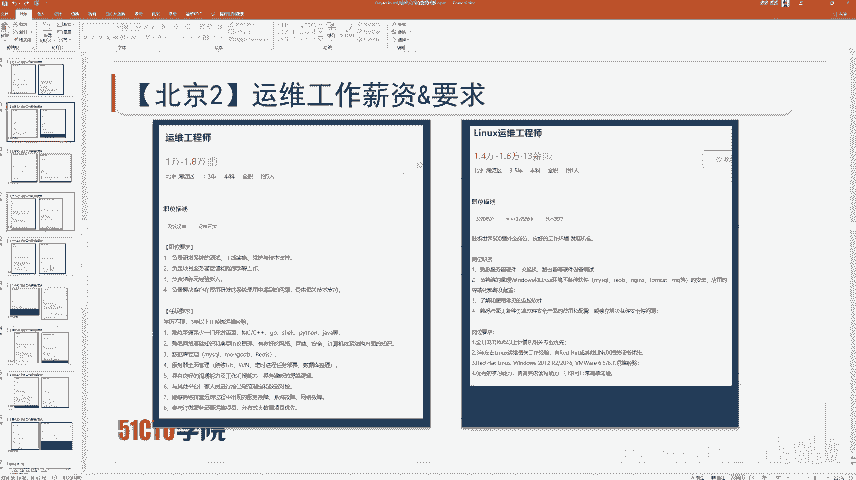

# 老庚讲红帽Linux（红帽RHCE＼RHCA认证技能培训） - P1：老庚红帽Linux训练营第四天 - 51CTO李老师 - BV1984y1F7Mj

话啊，就是说我们第四天内容啊，我觉得才是最有价值这个内容啊，对吧？因为这部分的话，相当于算是你linux运维人员的一个职业规划啊，包括你未来几年，你要学习什么技能啊，哪怕你已经是在运维这一行了。

那你可能也对现在就是说以后要学的东西不是特别清楚，很迷茫。那你如果没进这行啊，你眼馋这一行的薪资，这行的收入。那么这边的话就是。你就要知道，其实作为一个运维人员，就是说处在不同的级别会不同的东西。

他的这个收入啊也是不同的啊。那我们今天的话主要就是介绍一下这个linux对运维人员的重要性，以及linux必须。利ux斯运维人员必须具备哪些技能？具备什么样的技能，能拿到什么样的薪资？

一线城市的这个啊就是说职业技能分析啊，包括这个职薪资的一个介绍啊，这个的话都是我们今天的内容。那这边的话啊，就是说我们先来说一下什么呢？先来说一下我们的这个基础运维技能啊。

基础运维技能就代表着，如果你是一个应届生，或者你刚出大学的这个校门的啊，或者说你你说你是一个零基础，你想入运维这一行，你必须要会的基础的运维技能有哪些，就说如果你这些基础运维技能都不会的话。

那你就不要入这行的，或者说哪怕你说你干了35年，我现在基础运维技能这里边的东西你都不清楚，不知道这是什么，那我估计你的薪资应该不会特别高啊，就至少说是在运维这个圈子，你的薪资应该不会特别高。

至少我觉得超过10K这个事是不太可能的啊，除非你有关系，或者除非你对吧？长了一张较好的面容啊，对吧？和我差不多这种。呃，五百强的薪资大概多少？40万的年薪啊，40万的年薪。我在二线城市啊。

那在这边的话啊，我们来看一下这个基础运维技能啊，我在这帮老师里边算是收入低的啊，很咱们很多老师的话都是年薪百万的这种啊，我这边的话基本年薪的话就是中规中矩。因为我在二线这边的话，要不说我出来又来做客嘛。

对吧？就是收入的话，基本上就是。税前的话，40万年薪啊，你要什么乱七八糟的啊，就是说公积金呢，什么五险一金啊，商业险呢，专加上福利啊，乱七八糟的啊，到手候也能差不多接近35个啊35个左右啊。

那这边啊我在哪个二线，我在大连啊，我在大连。呃，我们来看一下这个基础运维技能啊，等一会儿我们这些说完了之后，我们再去唠唠这个闲科啊。我们来看一下基础运维技能。首先。

基础运维技能就是说去基础的啊入门级的运维人员啊，他所需要具备的什么呢？啊运维知识有哪些？在这边的话，首先就是TCPIP的基础知识。TCPIP的基础知识的话，这边。说白了就是网络网络技术啊。

你说老师你先你你这讲的对吧？讲的是红帽推的是lininux，然后你现在又说要学网络，那我到底该学网络还是linux呢？我跟你说，你不管学网络还是linux，但凡有人跟你说啊，学网络做网工就行了。

linux不需要会，这种绝对是傻逼，在忽悠你的。😊，但凡有人跟你说，学运维不需要学网络，来学运维就行了。学完之后年薪多少多少钱，然后。😊，不需要学网络，那种也是把你当傻逼忽悠你的。我就这么跟你说。😡。

这是百分之百的。因为只要是做运维，甚至说是做网工，lininux是必须要会的，网络是必须要会的。所以说网络的基本知识必须要了解这个TCPIP代表着协议站啊，代表着协议站并不是说是你只会TCP协议。

只会IP协议就够用了，那肯定是不行的啊，这个要搞清楚。然后的话就是常用的静态路由协议和动态路由协议啊。虽然说我们在工作环境当中，在lininux服务器当中用的最多的是静态路由协议。

但是也有一些场景会使用动态路由协议。比如说我们现在给客户做的东西啊，都是带这个SDN的。这个SDN的话要求我们在某些特殊的云云主机的节点上，这边的话要和我们的这个控制器去建立这个动态路由协议。

也就是说需要我们在linux上配置OSPF甚至BGP这种协议。所以说基本上啊初中级的运维人员的话，了解一些静态路由协议就够了。但是达到这种中高级的运维人员动态路由协议一定要了解啊，这个是一定的。

一定要用动态路由协议。至少你知道你的linux如何去使用动态路由协议啊，但是linux上使用动态路由协议这种可能咱们有些同学连听都没听过，有个东西叫做kua啊kua的话。

你在你的linux装了酷a之后的话，你的linux就可以支持OSPF啊BGP啊啊啊这种动态路由协议都是可以支持的啊。甚至说这种啊VPN啊MVPVPN都可以在你linux上直接配置啊。

甚至说有一些专门的linux发行版本。我们比如说我之前给运营商做项目做这个网源测试的时候，他们会经常用一个这个。linux翻译版本叫做VYOS啊，这个VYOS的话，它里面先天就支持动态旅由协议啊。

我们这边一般都是作为这个网员来去做测试的啊，上面它的这个配置命令的话，和这个juos的系统差不多。zono就是juniperOS啊差不多的。

然后的话就是windows7和windows10下边的常用运维工具，现在用windows7的都很少了，现在基本都是windows10。如果你现在还用的用的是windows。

但是你用的不是windows10的话，其实你应该自己检讨一下。你说老师我用windows7windows8啊，甚至windows XP我都习惯了。

甚至有些同学还是用windows98windows2000。那我觉得你不是一个合格的运维人员，合格的运运维人员必须与时俱进。啊，必须与时俱进啊，你要尝试。客服你这个就是说不同终端的这个区别啊。

我之前就是说一直是忠于windows7，后来用windows10用一段时间发现确实比windows好，windows7好用，占用的资源也少了，驱动也多了啊，然后的话也比windows7方便不少啊。

用基本上用个半年左右就习惯了啊。那在这边的话啊，就是说上面常用的客户端软件啊，至少说是终端工具，像sQCT啊叉sha啊，对吧？VSCP啊啊，各种各样的啊软件TFTP的软件FTP的软件。

这些东西是一定要用清楚的啊，这是百分之百的，包括一些抓包工具啊，啊等等等VNC啊这些啊RDP这些是一定要弄清楚的啊。如果你连这些工具都不会用的话，那你肯定不是一个合格的运维人员。

你连基础运维的门槛你都到不了啊。m克当然是最好的啊，我是个人建议同咱们同学用macmac它是属于生产力工具，它能大大提高你的这个效率。里边的很多软件非常优秀，完全碾压windows啊。

甚至说是这个啊linux啊，你要是有条件的话，对吧？或者说你没有条件的话啊，我说的有条件指的有时间啊，你可以在你的客户端装一个linux啊，直接就是把linux装在你的笔记本上啊。

就不用windows啊，这样的话也不错啊，前提是你喜欢折腾。然后的话就是windows server搭建常用的各种服务器，这种搭建非常简单啊，搭个DRCP啊DNS啊，对吧？

windows啊鼠标点一点就能搭建成功了啊，鼠标点一点就能搭建成功了，没有什么特别复杂的。至少说是让你起一个什么服务的话，你至少不会说是就卡住你windows server点一点对吧？随便上网搜点资料。

然后装个虚拟机，鼠标点一点DRCP服务器就出来了。DNS服务器就出来了。windows就出来了啊，然后的话是linux的多种安装方式。

多种安装方式包含的是手工安装网络安装和PSE加star的自动化安装啊，这里边的话初级和中级和高级的区别很大。初级的话一般来说就是手工安装。但是至少说是这个服务器安装系统不会有什么问题。中中等级别的话。

它可能会采用一些网络安装啊，比如说挂一个光盘通过网络去安装高级一点的话就是PSE加star或者直接用实现。这个啊大量主机的这个批量安装啊，当然安装系统会涉及到一些，特别是这个服务器啊。

需要我们的硬盘做read啊。read技术与read选型。来点干货，你你现在就是觉得这些东西你我觉得你应该是都会了。这个时期要不你先你先休息一下。啊，你先休息一下，我不知道你在发说的干货是什么。

因为我不是给你一个人在讲，明白吧？我不是一个人给你一个人在讲。如果你这边的话，觉得你需要一对一的话，这个一对一我们也是可以提供的啊。这个就像是之前咱们有很多同学啊，对吧？听我课听爽了之后。

他非要听点别的。我说可以，你这边的话，只要交钱，对吧？我能讲的，我都会给你讲。我不能讲的，我花钱，我找别人我也可以给你讲，只要你提供钱就行。😊，明白吧？就是我觉得你应该挺厉害啊，去要上来就要干货。

因为我不是给你一个人讲的，明白吧？😡，所以说你觉得这不是干货的话，你可以先休息休息，喝点水啊。等一会儿你觉得到了你干货的时候，你再听就行了，明白吧啊。😊，就感觉很奇怪啊。😮。

然后的话我们这边的话就是linux基本的文件管理，高级文件管理啊，基本文件管理的话，无非就是文件的增三改查啊。高级文件管理的话就涉及到一些输入输入重定向啊、管道啊、文件过滤啊等等等等啊。

在文件管理这个位置的话，其实涉及到一些sll脚本啊。如果你合理的利用shall脚本啊，里边的循环哪判断哪啊，条件分支语句啊，对吧？等等等内容的话，能实现这个lininux文件的高级管理。

其实也涉及到了一些sll的部分啊。然后的话就是什么呢？linux的用户用户组用户密码，用户组密码管理，这个是linux系统的基础。你在后边涉及到linux的服务管理的时候，有很多针对不同的服务。

有很多的这个系统用户啊，这些系统用户，比如说我们我们之前这个装了这个zabu，对吧？我们做了zabu的监控。那这边的话okK我们就可以什么呢？

我们就可以这个就是说用这个zabu这个用户来去做一些这个权限的分发。也就是说zabu它能做的，只有zabu范围之内的事儿。你N g就只能做NG范围之内的事。

而不是说是将这个服务的权限直接开到root级别，这样的话就比较危险啊。所以说我们在做一些这个源码包安装的时候啊，有些时候会涉及到这个linux的这个用户用户组管理，这个是非常重要的。因为有一些客户的话。

他会要求你用源码包安装，它不允许你用这个ym或者说是APT这种方式来安装软件包，这个要搞清楚啊。然后就是linux基础权限管理和特殊权限管理。这个不用说了。

这个的话无论是你的windows还是你的lininux上是一定要有的啊，一定要有的。所以说呃比如说这个文件哪些人能读这个model，哪些人能在里边创建文件，删除文件，哪些人能修改文件啊。

这都是属于linux权限的范畴啊，还有一些特殊权限啊，特殊权限。呃，特殊权限的话，在一些特殊场景下非常有用啊。然后就是linux进程管理服务管理。比如说你监控哪些进程有哪些问题啊，对吧？

然后控制一个服务的启动啊等等等。如果这个软件装了之后就有服务的话，那，当然很简单，如果这个软件没有服务。😊，比如说。比如说普罗米修斯这种监控系统，它本身的话，现在它不提供样本包安装。

它只提供这种现成的这种二进制文件。那么你就要需要自己去写服务。啊，自己去写服务。所以说在这边啊，就是说像这种啊，你可能在做服务管理的时候，可能就要自己花点心思啊，然后就是linux的网络管理。

网络是一切的基石啊，对吧？为什么英雄联盟啊，什么这种王者荣耀啊，这种游戏能火啊，就是因为网络啊，它是网络游戏啊。为什么扫雷就没那么火啊？虽然说大家都玩过扫雷，但是呢你不会天天玩扫雷。

因为它这个扫雷不能联网啊。虽然说我们说QQ游戏里面有一种类似的联网扫雷的那种那种游戏，但是玩的人也不多啊。所以说这种啊网络非常重要。没有网络拿什么去承担你的业务，拿什么去保证你的业务被用户访问到啊。

所以说lininux网络管理也非常重要。lininux作为这个市场占有率95%以上的操作系统啊，它这个的话就是说啊必须要让它这边配置正确的网络啊，让你的业务能正常运行啊，这个是非常重要的。

然后就是linux远程管理，因为你不可能天天去机房，所以说你lininux远程必须要搞清楚，就这个SSH啊，就是我们lininux用的最多的远程管理方法啊。当然除此之外的话。

我们的lininux也支持啊这种VNC啊来去实现这种类似于windows的远程桌面管理啊，也是可以的。那这边的话。就是说可能啊就这个SSH可能咱们很多同学都搞不清楚啊，都不知道SSH原理是什么啊。

我就记我就见过那种啊，就是可能他干了运维，干了十年的SSH改个配置文件，不会SS是免密登录，不会SSH是客户端配置文件不会SSH是指纹验证，不会。就什么不会，他但是他会SSH你也给他正常开个22端口。

他这边他能访问到。但是你给他换一个端口，他连指定端口他都不会。😡，这个非常正常啊，就是说你没系统的学习过，对吧？野路子就会出现这种问题啊，你会发现你以为你会了，但是其实你根本没会啊。😡。

然后就是lininux软件包管理。linux软件包其实不同的lininux发行版本啊，它的这个软件包管理啊用的这个软件有一些不太一样。比如说reo汕 sfiora这种系列，它用的就是ym管理软件包啊。

用的就是ym管理软件包。ym或者RPM啊亚m或者RPM来管理软件包。那你如果是乌邦图的话，他这边就用APT啊Dpack来管理软件包。如果你是susy的话，susie他用的是什么呢？

zeer和这个RPM就是susy的话，它这边其实。也会用RPM来实施软件包的管理。但是他这边。他这不是zeperZEZZEPPER好像是这个啊记不清了啊。zeper啊。

我们现在已经我之前的时候最早的时候用的是这个乌邦图，后边的话我们公司就用到苏usy了。我们现在又用回红帽和汕头S了啊，这个应该是ZYPPER啊ZYPPRziper啊zper。

那这边的话就是说不管是什么软件包管理，他们的这个本质都是一样的啊，你不明白本质啊，你可能学了三头S乌邦图也不会，你学了乌邦图，苏us思也不会。那还有其他的小众的呢。

比如说小众的还有APK的这种软件包管理。你说老师APK不安卓吗？那显然不是安卓，在linux系统里边，在linux系统里边。😡，它有各种各样的软件包管理方式，有各种各样的软件包。

所以说你不同的linux侧方向版本，你只要明白它的软件包管理的原理。不管是什么亚么RPMAPTD package，还有zapper或者APK你都能玩明白。但是你不明白原理。你永远也玩不明白。

就这么简单啊，这也是为什么说是咱们很多同学在我的课程里边啊，就是说他可能干了好多年，他也觉得他会了。但是学完我们课程之后，他就会发现他根本就没会原来啊，然后开开阔了他很多的这个视角啊。

这个是在我们班级里边是经常发生的这种情况啊，因为我觉得我把软件包这块讲明白了啊，然后就是linux文件系统管理。因为你的这种各种各样的配置文件呢，你的这个包括你的数据库啊。

这边的话都是存放在你的硬盘里面。那你的磁盘的分区，磁盘的这个格式化，磁盘的挂载，包括逻辑卷逻辑卷的划分，物理卷的划分卷组的划分，逻辑卷的划分，逻辑卷的扩容缩容啊，这些的话都是比较重要。

当然我们一般来说都是扩容很少会做缩容。咱们今天还有同学在群里面问说老师叉FS到底能不能缩容，我明确的说了叉S不支持缩容的。😊，只有EST4啊，我们现在用的比较多的文件系统就是EST系列或者叉FS。

还有一种我们用的比较多的，现在啊是better FS啊better FS。但是那个的话一般在乌邦图这边用的比较多，红帽这边红帽汕透S啊，这边还是用什么呢？还是用叉FS和EST4比较多啊。

然后就是linux的shall脚本和python脚本。那linux的shall脚本和python脚本的话，这个基本上是这样的，很多同学就想学shall脚本啊。

他根本就不明白你linux如果不会你shall脚本，你根本就学不会。你linux越精通，你shall脚本就越精通。关于python脚本是锦上添花的东西。就是说你作为一个运维人员。如果你时间很充裕了。

很多技术你都搞清楚了，你可以去研究研究开发，研究研研究研究研究pyython。基本上的话啊就是说。作为一个运维人员，pyython和gl啊，真正的这种开发语言啊二选一就可以了。啊，你毕竟不是真正的开发。

就算你学了pyython学了几年，你也不可能靠python。自己写一个多大的项目，你也作为一个运维人员，你也不可能做这种软件工程啊，这种就是大型软件的这种架构开发也不太可能。

所以说基本上啊就是说了解一些pyython就足够了。你花太多时间在它上面是完全犯不上的。而且你会发现你学来学去，你可能学了两三年，你还在这学的pyython的基本语法，你并没有用python干什么事儿。

最多就是在简历里边加上了一条，了解python。你也不敢说自己很熟悉pyython，因为让你找一个库，找一个库里边的函数，你也找不明白，你也调不明白，还是要百度，甚至写的很墨迹。然后各种各样的语法错误。

就算写出来了，过段时间就忘了，你也不知道它的实际应用在哪儿。😡，这就是你所谓的学了好几年的python，在简历里边加了一个了解python。😡。

所以说真正聪明的运维人员都会把更多的时间花在这个linux之上的开源软件上，在那个方上面学习，等那些都学习差不多了之后，闲下来了之后，看一下pyython在哪些地方，在自动化运维能帮助自己提升哪些效率。

这才是正经的一个学习学习套路，学习思路啊。😊，这些呢就是基础运维技能。这些基础运维技能基本上达到来说，达到了之后啊，对于一个应届生来说，找一个刚毕业的时候。

找1个60006000到8000左右的薪资是完全没有问题的。甚至说如果说运气好的话，10K左右也是没有问题的。只要这些基础运维技能知识，掌握的差不多就没有问题啊。甚至说现在哪怕有一些同学干了两三年。

他也达不到这个基础运维的标准。因为他没系统的学习过，他是野路子啊。那在这边啊就是说。我们接下来看一下，除了基础运维技能之外，我们来看一下啊其他的运维技能。首先我们先来看一下web运维技能。

那这个web运维技能的话，它这边的话有一个架构，这个架构叫什么呢？叫做lamp架构啊，lamp架构。这个lamp架构呢。就是linux阿帕奇my circlecle和PHP啊PHP。

就是四个啊四个单词的这个缩写lamp架构L就是linux。A就是阿帕奇，这阿帕奇是一款什么呢？是一款搭建web服务器的软件啊，是一款搭建web服务器的软件。然后就是什么呢？

然后就是mycle是一款数据库的软件。但是这mysrcle自从被acle收购的话，用的越来越少了，基本上都会用什么呢？都会用mer瑞 d啊mer买瑞b这个的话其实和mycircle是一样的。

但是它是完全免费完全开源的cle自从被acle收购了啊，这边就是说用的人越来越少啊，那myrcle自然分为社区版和收费版啊，社区版的话也是免费的。但是实际上有很多的问题啊。事实证明的话。

被acle收购的东西啊慢慢的都会变差。因为acle这家公司企业文化就极其恶心啊，从你看它那个加va就能看出来啊。😊，包括他自己的oracle的数据库，再包括什么呢？再包括他的自己的硬件啊，都是贵的要死。

贼恶心，你自己研究十年，你也研究不明白，然后还得找他的知识，你找知识就很贵啊，这就是这家企业啊。那这边的话啊。紧接着就是PHPPHP的话是什么呢？啊，上来就啊老师PHP是世界上最好的语言啊，你要这样想。

我也没有关系，就为了你口嗨一下，满足你也是无所谓的那这个PHP是什么呢？是这个web后端的啊，写web后端的一种语言，说白了就是web服务器，它的code。那你作为一个运维人员需不需要学PHP呢？

我可以完全告诉你，作为一个运维人员，完全不需要会PHP。😊，完全不需要学PHP。为什么你运维人员不需要学PSP呢？因为这是开发人员需要做的，你运维人员不需要写扣的。😡。

你说老师现在不有这种职位叫运维开发吗？你运维都没运维明白，你还想着开发呢。如果你的薪资没突破到30K，通过运维技能突破到30K以上，你就不要想着碰开发，对你来说就是浪费时间，你也不能跨过去。😡。

你也没那个时间在上面折腾，结果发现折腾了好长时间，自己一点提升都没有。这就是你所谓的转运维开发嘛，你靠做运纯运维做做到30K，你只要一心的做运维，别想着天天学这个天天学那个。😡。

天天就是啊这个也想学那个也想学这个上那调点资料，那个上那调点资料。😡，不脚踏实地的自己去摸索自己去学，你还想达到多少薪资？😡，不可能明白吗？不可能，我就这么跟你说，这个PHP在这块注意lamp。😡。

Lamp。他这个P。有其实是相当于三P啊三P就是说能写web后端的，不光只有PHP。还有什么呢？还有python。😡，还有pro。也可以写web后端，现在用python写web的非常多。

PRP是世界上最好的语言，这句话纯粹就是在放地。明白吧。超大型网站也不会用PSP会用java。😡，你白吧会用java。基本上现在现在大家去写web的话，更多的是用python。

因为pyython相比于PHP来说，门槛更加的低。啊，写的东西都差不多啊，你现在找1个PHP，真的就专门做PHP开发的，他收入不会特别高，因为他只会写PHP。😡，啊，就这就这么简单啊。

那这个的话就是lamp啊lamp架构。那这个lamp架构里边的核心是linux啊。那我们接下来来看一下另外一个架构，这个架构也是web运维技能，叫做lim架构啊，叫lip架构。那这个L架构在这边的话啊。

它除了中间这个N和前面那个不一样的话，其他的都是一样的。这个N的话不再是A，不再是阿帕奇，而是什么呢？而是NN g以这个占用资源少，性能更加优越啊，就是说占有了快速的占有了很多的市场。

但是实际上在超大型的网站建设上，仍然不会用N g。仍然会用什么呢？阿帕奇原因是什么呢？阿帕奇稳，你说老师NG和也很稳呢，我们用了两三年了也没出现什么问题呢。😡，注意就是说NG在这边的话。

就是说一般啊稍微有一点经验的运维工程师。他这边的话都不会在如果说真真的想设计一个超大型的那种网站架构，他绝对不会选择N镜子，一定会选择阿帕奇。这个是百分之百，你不你说老师阿帕奇占资源，不在乎资源。

只在乎稳定啊，只在乎稳定。那NG之所以很多人推崇它都是谁在吹呢？哪些人在吹NG呢？😡，都是开发人员在吹NG，为什么？因为NG的这个配置文件风格和这个C语言非常像。所以说这个他们写N的配置文件非常简单。

所以说在这边的话就是说很多开发人员吹N就慢慢就吹起来了。但实际上NG市场占有率也并不是说是会比阿帕奇高哪去也没高。阿帕奇仍然是全球第一。N只不过有些人喜欢秀操作，天天跟老板说想表现自己啊。

原来用阿帕奇用好好的，天天跟老板说啊，老板，我们这边你看N这么多优点，我们要把阿帕奇换成N吧，老板也听不懂，就听你忽悠，反正老板心里想的是啊，你反正整吧，整坏了，你必须背锅，整不坏的话，哎，也无所谓。

反正你加班我也不给你钱，你不想整吧，让你整，你就整就行了。😊，所以说在这边啊就是说关于NG啊，在这边的话，现在在大型网站上一般不会用它作为这个呃承载web服务器的。一般在Nt这边的话。

更多的是做一些反向代理或者做一些负载均衡啊，会用到这个N啊，但是的话并不会用它去承载这个就是说超大型的网站啊，当然有有没有这种承载的案例呢，也有。但是如果让你去选择的话。

尽量我个人觉得还是阿帕奇更稳一点。毕竟我用阿帕奇用这么多年了，就没有出现过什么问题啊，其他的都是一样的。那这边啊我这么跟你说啊，我这么跟你说。你说老师这个外部运维技能。

这个我看现在很多培训机构都在讲这个我我我明我明摆着跟你说啊，在这个什么呢？在这个10年前啊十0年前。是一个比较黄金的一个啊外b运维的一个时代啊，现在外部运维在运维这个圈子里边基本上啊是属于什么呢？

属于逐渐的走下坡路啊，或者说基本没有什么太多的市场。为什么呢？😡，我这么跟你说，你肯定听过一个语言叫做HTML。HTML语言这个HTML语言，我跟你说，在10年前它的收入能达到一个什么水平呢？10年前。

HTMHTML经过培训机构一培训，不用多培训个两个月左右，出来就能找着20K到30K的工作。😡，基本上培训机构学两个月HDM2出来就能找20K30K工作。10年前10年前的收入和现在的收入。

你自己想象一下啊。😡，为什么？因为当时处在一个互联网的一个爆发期间。市面上涌现了大量的网页。😡，大量的网站应用。对这种web运维的需求非常非常的高。😡，所以说对这种什么lamp呀，这种架构啊需求特别多。

当然对这个所谓的PHP啊，HH5前端PHP后端这边的话就是需求量特别大。所以说你基本上随便上上个培训机构，学个两个月，20K到30K。😊，你现在。😡，再去培训机构。

你就学半年HTV25出来找个6000的都费劲。我这么跟你说，你现在上培训机构，你学个6年的HTML，你出来找个6000多都费劲，因为这个东西太简单了。😡，太简单了。为什么说这个东西现在太简单了呢？

就是因为你哪怕就因为HDML它本身的语法都非常简单。😡，你哪怕没学过这个东西，上网随便搜一搜，而且互联网上资料这么多，你就是不上培训机构学，你也能学明白，也能写出来一个东西。😡，就写HHMM就可以了。

但是现在的话就不值钱了，显然不值钱。所以学这个东西越来越少了。那你说老师我要做外部运维，你现在去培训机构啊，现在还有那种培训机构呢，在这跟你说啊，过来学外围运维，我要搭建一个什么呢？

学完之后你能搭建一个承载一级的访问量的网站。😡，你要什么呢？你要你你学完了之后能搭建一个网站，这个网站能承载这个数亿级的访问。😡，你说逆星，我操这个牛逼啊，学完了之后，我能搭建一个像淘宝那样的网站。😡。

结果你学完了出来发现找不着工作。😡，你可能交了1万呢还是2万呢，还是3万呢，我就不知道了啊，看你脑袋有多大，明白吗？😡，那为什么说是你学完了之后，哎呀，人家确实给你讲了这个网站，你采用这种方式搭建啊。

就能什么呢？承载数亿级的访问量。😡，原因是什么呢？原因就是现在哪有那么多网站需要承载数亿级的访问量啊。😡，你告诉我，现在这个年代什么最值钱？😡，最值钱的是流量。😡，流量最值钱。

那么那个这个网站要是有每天他妈能有数亿次的访问，你觉得这个网站能用轮得到你来搭吗？😡，能轮得到你来搭吗？这个网站他妈天天访问量数亿次，你觉得这个网站能轮到你上培训机构，我不管你学多少年。

能轮得到你来搭吗？轮不到你搭出来有什么，你会搭有什么用？没有流量，谁需要这种东西啊，没有市场，明白吧？没有市场。😡，就你学这个东西没有用，高不高端，高端大不大气大气，能不能找着工作。

能找着收入怎么样不高。😡，这就是外部运维。为什么走下坡路的原因，而且现在最恐怖的是什么？😡，现在最恐怖的是。😡，cloud的出现，云计算的普及，别再说云计算还在发展的路上了。你如果再这么说。

说明你根本不懂这一行。😡，那云计算都普及多少年了？😡，还在这儿啊，云计算是新时代，那新时代早都来了。😡，还在这想着啊，我我先学学这个Lamp，学学Lmp啊，然后我再学云计算。

你知道现在公有云上鼠标点一下一套Lamp，一套L就出来了吗？😡，还给你带上负载均衡呢，还给你带上数据库集群呢，只要钱到位，人家可以做到有一个按钮给你，你摁一下这个按钮，一套支撑数以亿级的。😡。

访问量的网站就出来了。然后呢，你只需要把你的代码传上去就行了。😡，把你的代码传上去。😡，然后的话这种能承载数亿级别访问的都告诉你，对人都给你搭建好了，你说需要招运维吗？不需要人家云平台都给你提供好了。

你只要花钱就行了。那很多销售天天的声音又甜，对不对啊，然后天天就打电话跟觉啊，这个快到期了，要续费了啊，记得往账户里充钱啊啊，就这种。😡，没事儿，钉钉就骚扰你，要加你钉钉。😡，这就是云平台。

当今的云平台。所以说运维。外b运维技能已经成为过去，但是这些东西要不要学呢？要学要学这些东西要学，你说老师外b运维技能不需要了，那我阿帕奇要不要学呢？要学my circlecle要不要学呢？

要学linux要不要学呢？要学P时要不要学呢？你运维不用学。😡，运维不用学。没有用，运维就学运维。等你运维，你觉得学到了你收入的瓶颈了，你可以尝试做运维开发。

因为现在大部分开发人员其实是基本上什么都不懂的，他就会写代码，甚至他连自己写的是什么都不知道。所以在一个公司当中，运维才是骨干。😡，网工有事儿要找运维，开发有事儿要找运维，领导需要有新的工作安排。

要先跟运维去聊。明白吧？啊，但是不是外部运维啊。那来这边的话，外部运维再走下坡路。那你作为新时代的运维人员，你还需要学习哪些知识呢？linux是必须的啊，lininux是必须的。😊。

数据库相关技术你要了解一些啊，那在这边两个主流的数据库，一个是mycicle，其实就是门瑞DB。另外一个是posts grey circle post gray circle是新一代的数据库。

现在的话基本上能用posts gray circle的都不会用mycircle，不用posts grey circle的，是因为运维工程师没有能力。😊，不用postg circlel。

用买myscle或者买瑞DB的都是属于运维工程师没有能力，或者公司没有好的DBA就这么简单，有好的DBA运维有能力，一定会选择posts gray circle。因为它的性能稳定性、可扩展性。

任何方面是碾压my circlercle的。😊，那关于mongo DB和readdis这种严格意义上来说，它都不算是完整的数据库，它只不过算是一种中间件而已啊，算上一种中间件而已啊。作为这个作为什么呢？

作为一个运维人员的话，一些中间件还是要了解的啊。像什么no circle这种东西，你如果都不知道它是什么，那你就不用去了解，明白吧？如果你需要去了解，那是这个东西是DBA需要去了解的。

你运维人员至少关于一些mycicle啊 post circlecle啊，你要会搭个集群搭个主备这种一些中间件啊readdis啊mongoB啊raitMQ啊卡法卡啊这种啊这种中间键啊，你需要会一些啊。

他啊这种。知道怎么去搭建，对于一个运维人员来说就够了啊。😡，这就是数据库，你这边要学的相关技术。这些我列出的是开源的啊，那除了开源之外，还有一些必然的。

像这个microsoft的circle server和oracle，你要有时间你就了解，你要没有时间就完全不用看。因为这两个东西基本上啊我这么跟你说，oracle是属于什么呢？市场绑定。😊。

啊，有一些企业的话，它是离不开oracle。这个没办法，microsoft circlercle server也相当于绑定啊，但是这个东西啊可替代性非常强啊，circle server。😊。

所以说现在在中国的话，基本上除了你在一些大学的教室实验室里边还能见到circle server，基本上的话你是见不到他了。😊，啊。oracle这个东西要多恶心有多恶心啊，我是不会花时间在这个上面的啊。

因为没有意义啊，我们公司也从来不会用这种东西啊。😡，你要有兴趣，你自己去了解啊，这就是数据库。作为一个运维人员，一定要了解一些数据库啊。😡。

然后的话就是运维监控工具。对于一个运维人员来说，一定要会会做监控啊，会做监控。那监控的话在这里边啊，这里边4个logo啊，代表着什么呢？代表着4款软件。这里边除了grfa娜不是做监控的之外。

其他的都是做监控的老牌的监控系统ns啊s。这个现在用的比较少啊，现在用的比较多的就是zabu和permissbu就是我们这个训练营第二天第三天讲的啊，这permissus的话叫做普罗米修斯啊。

是网上对普普罗米修斯的定义是新一代的监控系统啊。当然这个东西的话，我觉得这个定义不准确啊。因为它显然还没到新一代监控系统的级别。它你用过permissus，你应该都知道它非常原始。😊，啊。

非常原始仙人掌。现在除了一些历史遗留原因的公司，用这个仙人掌，谁还用那个？啊，谁还用那个啊。那来这边啊，就是说。那这个permissors的话非常原始啊，你很多的这个啊告警规则的话。

都得自己去手工的去写压mail文件啊，比较原始。但是很多开发人员比较喜欢，但是的话它的效率非常高，至少相比zas来说，而且它的部署方法非常便捷啊。😊。

这个的话你可以有兴趣了解一下这grafa的话是一个前端展示系统。当然它的功能不仅于此，它可以将这个收集到的数据。你可以把 careerfa理解为一个数据采数据采集系统，它可以将你监控获得的数据。

或者说干脆就是直接连到数据库，把数据以一个良好的图形展示出来啊，这就是G find啊国 find。那这个对于运维人员来说，监控是必备的技能啊，现在是必备的技能。你说你一个运维，你不会做监控啊。

那公司要你何用，基本上对于一个公司来说是一定要有一个啊，不管这个公司是这个小公司还是大公司啊，它一定是要有一个扛把子的一个运维。要么就是保证公司的业务维稳运行，要么就是给开发准备开发环境啊。

因为真的是很多开发真的是什么都不懂啊。就像咱们刚才有个同学说的什么来着，他连修电脑都不会啊，电脑出问题了。他都不知道怎么弄啊，他只会写代码，写的是什么，可能他都不知道啊。

这种情况下需要有一个开发的头子啊，对吧？一个开发的头子，一个运维的头子，加上一个老板啊，就成立了一家公司。😊，能明白我意思吧嗯。

然后的话就是HA技术。HA技术的话其实就是高可用技术啊。因为随着你不管你搭建什么监控监控系统啊，你的数据库啊，包括你的web呀，这边的话是一定要实现高可用技术的。说白了就是服务器集群。啊，服务器集群。

那这边的话这个服务器集群啊，这边的话，你像ke啊LVS这种的话都是可以提供对应的这个呃VIP的啊VIP的。就是说说白了你像ki的话，它就是通过这个网络里边的VRP协议啊。

它能提供1个VIP能实就是你很多的IP虚拟成一个你访问这个虚拟IP的话，就访问其访问到其中的一个节点啊，就是这么简单啊，它所谓的就是解决这种集群的啊集群，实现集群的这种高可用啊，高可用技术。

然后就是HAproy，它能实现对应的这个负载均衡啊，负载均衡。那无论是你用keepD加LVS还是keepD加HAprocy啊，这边的话都是这个就是以前用的比较多的啊。现在新一代的这个HA技术啊。

更多的啊企业当中更习惯于用paacemaker啊paacemaker。paacemaker的话。它它的好处就在于你可以通过它将很多的这种啊集群定义为资源啊，实现统一的管理。

你说老师HAprocy也可以HApro没有paacemaker直观啊，paacemaker有独特的集群管理系统。Hpro没有，它只是基于配置的管理啊，所以说在paacemaker这块的话。

就是说基本上你任何的高可用，都可以将它的服务托管到paacemaker来实现管理。不管你有多少套需要实现高可用的资源都可以用paacemaker加cro scene来实现。

pamaker它本身并不带这种啊心跳起搏器，就是说白了就是你集群之间你要跑心跳嘛，所以说它有另外一个扩展主件叫cro scene。但是基本上你pamaker配好了之后。

你的cro scene的心跳的话都会都会做好啊。那这种的话就是说关于什么呢？关于你像咱们同学说，老师F5A10是否就这样死了，F5A10死不了啊，有一些有一些什么呢？廉价的解决方案。

肯定是用这种开源的手段来实现所谓的这种负载均衡啊，高可用啊啊，对这个业务要求规格比较高的，肯定是通过硬件来实现，更加的好。软件毕竟有瓶颈。专门做专注于做硬件的这种厂商，他这边提供的性能才是更加优越的。

但是这边的话，当然你要付出对应的价格啊。那随着你这边的话，HA技术有了一些了解之后啊，那这边的话你管理的这个服务器集群自然也就会变变多了。啊，你管理的服务器就变多了。所以说此时的话。

你需要一款自动化运维工具。

来去管理你这些服务器。比如说你经常要答一些补丁包啊。改一些配置啊啊，甚至说批量部署这些应用。那四个自动化语面工具啊，st stack sible carpett和chi。那chi。开发人员用的比较多啊。

运维人员用的比较少。Ppet是一个老牌的自动化运维工具。我们公司最早就用ppet啊，后来我后来我这边我们我们公司就不用ppet了。就是说因为py的话，它的这种管理方式啊过于古老，而且效率太低。

我们这边就换成sible了啊，换成sible了。其实我们当时在st和sible之间犹豫了。后来之后我们发现sible更简单。当我们把自动化就这种automation的脚本写出来之后的话，这边的话。

如果交给这个底层的这种大密级别的啊，就说白了就是傻子都会布的这种啊ible更加简单st对于这个下边的人来说的话还是比较困难的啊，因为我们写完这个东东西之后要给客户部署嘛。

我也不可能说是我们这帮就是核心的出去啊，对吧？那我们得类死啊，我们也不会干啊，这么一整的话，我们都走了啊，所以说我们写完这种altomation之后的话，都是下边的人去干。所以说最简单的sible。

他们还能说是。😊，简单的做一下到soft stack，他们根本用不明白啊。所以说在这边啊，就是说关于什么呢？关于这个soft stack和ansible，当时我们就选择了ansible啊。

自动化运维现在啊几乎已经成为了运维人员必备技能。你现在说哪个运维，它不会自动化。那它就不叫一个运维，因为你运维人员天天就管理两三个机器，你叫什么运维人员呢？运维人员起码得管理数十个节点。😊。

你管理数十个节点，数百个节点，上千个节点，你拿的钱肯定是不一样的。😡，你拿的钱肯定是不一样的。你像我们之前给某个运营商去做这个5G的项目，我们不给这个运营商部署这个5G的云平台。

给这个运营商部署这个5G的云平台。这边的话，他们这边要求的节点数量是1500个啊1500个。那1500个，那这边的话，那节点数量显然就不一样啊，我们当时是整个中国的team，大约是120号人啊。

分为四个区给他们去做。啊，四个区给他们去做，当时出差就是全国跑啊，给他们解决各种各样的问题，基本上就是这样啊。那他这边啊就是说自动化运维工具必须要了解st stack这个东西，你可以学习一下。

作为你的这个提升你竞争力的这个工具啊。因为st stack的话，我觉得这个东西还是比较重要的啊。因为这个东西怎么说呢？就是说你学了之后的话，人一看你简历，你enssible也会s stack也会。

那你相比于只会enssible的肯定有优势。这个东西和你多少证书没有关系，真的说实在的，我这我做了这么我做了这么长时间培训啊，对吧？包括我出去面试，我也出去，我也出去找工作的时候，我也面了很多。

基本上我就只有一个证书。27CA但是我的简历里边我都懒得去写，甚至都放到最后边，我不会把它放到最前面，因为我那个27CA还是我之前做线下培训的时候，因为当时做红帽这个技术培训的主管嘛。

他说你这个都成红帽培训主管了。你这边起码你得考个27CA吧，公司掏钱啊，公司给我时间让我去考，我都懒得去考，真的我都懒得去考。😡，后来去没办法，必须得考了，那硬着头皮考呗。后来考了一个证书。

我的简历里边证书都是写在最后边，就那么一个证书，其他的证书我都不屑于去考。😡，把技能写上去，人家自然知道你怎么回事了，就这么简单啊。😡，我们课程里边ible也有souttt也有啊。

你可以上全国任何一家机构去找红帽认证里边，没有人会给你讲souttt啊，可能是他们会，但是他们没有时间啊，也可能是他们不会啊。这个你自己去品啊，但是s stack我们只会放到RHC里边RHC里边。

我们是不放的啊，这个就是自动化运维工具。

那来这边啊，就是说接下来就是虚拟化技术啊。虚拟化这边的话。是你运维人员必须要学的。因为你说老师你怎么运维人员需要学这么多东西啊，怎么这么恐怖，他妈要学这么多，我不干了行不行？可以呀，谁也没逼你入行。

对不对？你今天过来听，说明要么就是你想调。😡，要么就是你觉得这东西有用。😡，谁说是你一定要入行运维了，谁说你一定要学这些东西了？😡，这也没逼你去学，对不对啊？但是这一行收入确实不错？

我个人觉得至少是这样的。现在除了一些就是做法律做金融的啊，就是同龄的，我觉得比我收入高的非常少啊，比我收入高的非常非常少啊，就是我这个我感觉就是我还是稍微比较自豪的啊，而且我在二线过得很舒服啊。

我也不去不想去一线为户口，为了他妈的他妈的摇个摇个号，车牌子上的都费劲啊，图什么呢？啊，没有必要啊，收入少了就少了啊。我觉得我在二线过得比一线开心啊。😡，虚拟化技术虚拟化技术在这边的话。

其实它严格意义上算是一个资源管理平台。因为你很多的集群，你想去把它做成裸机。那这个事不太可能。就是你说老师我上面部署各种各样的应用，你把它部署成裸辑，你直接在一个物理服务器上装了操作系统。

在这个上面部署应用不会这样，现在都是虚拟化都是虚拟化。😡，所以说在这边啊。😡，这个所谓的虚拟化。那你学就要学个主流的威威尔必须要会啊，威威尔ESSI必须要会。

至少说是让你搭建一套VCSA加上ESSI的系统，你完全没有问题。而且这个网上资料很多，毕竟是虚拟化龙头。你像华为云计算那东西都是扯淡的。华为云计算HCIHCIP云计算里边讲的什么东西。

讲的华为那套虚拟化，他敢说那个东西叫云计算。😡，讲什么fusioncomp fusion fair。😡，那玩意儿不就是学这个VNware的这个visfire和微center吗？😡，然后东西还贼不好用。

你用我的就知道我我不说对吧？你可能不知道我说了，你可能也不知道，但是懂的都懂，明白吧？懂的都懂啊。😡，那这个什么呢？那这个啊就是Vware尔这边的话，我觉得还是有必要学一下的啊。

其实至少这个东西肯定是加分项。那除了这个厂商呢，微m尔的虚拟化之外，你还需要选哪些呢？第二个就是虚拟化技术啊，虚拟化技术的这个开源的虚拟化技术。😊。

开源的虚拟化技术最主流的就是什么呢？就是Q加KVM。Qme远远大于KVM。😡，啊，这个你要搞清楚，华为的fusion openen stack还是可以的。那个是HCIE里边才有的。

而且华为的HCIE我并不觉得它的内容有多少啊，我玩open stack我已经玩了5年了，我已经玩了5年open opent今年应该是第11年。我已经玩了5年了啊，我觉得华为那op。

因为我我们给这个运营商去做武器，不光有华为的opent，还有中兴的opent，还有浪潮的opent，还有我们的open stack，什么样的wa幕我都对接过他们的控制器我全玩过。

我觉得他那个东西真不行啊，一堆问题啊。算了，不跟你们讨论这个了啊，估计你们可能对吧？也只是听别人说这个东西怎么怎么样啊，从来没有自己接触过啊，只有你真正接触过了，你才。具备自己对他做一个判断的能力啊。

QmeKVM这个是最主流的啊开源虚拟化。整个现在我们运营商啊，不管是什么呢？不能说我们运营商啊，我只是给运营商做过项目啊，我可没在运营商待啊。😡，中国移动、中国啊三大云商、中国移动、中国联通、中国电信。

他们的整个5G底层的支撑全都是open stack。open stack的底层什么呢？Qme KVM啊Q KVM。所以说在这边啊就是说。😡，呃，Qme远远大于KVM。

因为KVM仅仅是基于内核层面的一个hperraer能。能这个通过你的CPU的物理特性实现你CPU内存的加速，真正模拟设备的是QQme的复杂程度远远高于QVM。所以说写Qme那哥们完全就是个天才。

这个Qme的话，它能模拟任何主流的硬件设备作为虚拟机啊作为虚拟机。这个Z的话完全就是模拟这个微m啊，这个东西很很次的，我自觉写到这里啊，因为它算是一个半虚拟化啊。

那这个over world在国外用的非常多，特别是近两年啊，用的非常多啊，国外的企业因为什么呢？我们在中国的话，你可能知道啊，你用这个VVESSI，你中小公司可能根本不买license。

直接就瓢了。啊，破解一下就行了。但是在国外的话可不是这样的。😊，你就像印度，印度，我不觉得印度这边人对吧？多有钱，但是他们的windows全都是正版。你在中国能找到多少个正版的windows。

全都是买电脑的时候，不懂被被人忽悠的。😡，国外受这个license折磨已经好久了。所以说一个开源的虚拟化平台对他们来说非常重要，能节约很大的成本。那这个开源的虚拟化平台就是什么呢？就是这个over。

它底层是基于什么呢？基于QQVM来做的。所以说这个over word在国外现在用的非常多。😡，在国外用的多，慢慢的就会在国内使用。因为中国如果想真正成真正成为名副其实的世界第二大经济体啊。

虽然说现在一直宣称全球世界第二大经济体，但是懂得都懂啊，就什么呢？他就得和世界接轨，就不能那么多盗版了。所以说这个overt了解一下啊，对你的虚拟化理解也会变得很深刻。因为它底层全是linux。

对于一个运维人员来说，如果能把overt玩明白，那它的虚拟化将不再会是问题啊。就是开源的虚拟化技术啊。

然后就是什么呢？然后就是私有云技术，私有云的opent。这个opent的话，这边它组件特别多啊呃，但是它改名了，现在的名字叫做open infrastructure啊，叫open infr。

就是它自己定位的话，它自己是一个基础设施解决方案啊，就二s层面的云平台解决方案啊，那这个opent呢在这边的话就是说它的组件很多啊。😊，open代表着开放的意思st就代表着一个堆战的意思。

就代表着它里边有很多很多的开源组件啊，keystone是什么？keystone是里边的认证组件。gance是里边的镜像组件，nova是里边的计算组件， neutralutual是里边的网络组件。

swift是这里边的对象存储组件，snder是里边的块存储组件。het是里边的编排组件。那他这边的话啊，就是说现在Z stack比OP火ok那你继续用Z stack，谢谢啊。

那在这边啊就是说所有的现在三大运营商，5G的底层全是open stack的改版啊，就各种做5G的啊这些厂商，他们底层全都用的是open stack。因为什么呢？open stack这边。

他们基本上要么是这些厂商，要么是黄金会员，要么是铂金会员啊，都争着抢着去分运营商这块蛋糕啊。所以opent这边要学习的话，它就相当于学云计算。你说老师，那我为什么不学阿里云呢？我为什么不学AWS呢？

我跟你说，学习云计算，如果你不从私有云开始学习，你学的云计算全是假的云计算。😡，那根本不叫云计算。😡，你学习的那些AWS。😡，还有这还有什么呢？还有这个阿里云的什么ACP那种就是在外部界面上点一点。😡。

你所谓的考试就是选择题。😡，你告诉我学完那个考了那个证，你就说你会云计算了。你在真正的运维行业里面，你能被人笑掉大牙。😡，真正的玩云计算的一定要从私有云开始玩起。你连私有云都玩不明白。

你就别提玩公有云了。你说老师公有云我们也能点明白呀啊，那没有用啊，对你整个运维生涯没有任何好处啊，因为对于一个运维人员来说的话，它的终极目标肯定是将私有云的资源石化石化到什么程度，池是池子的意思。

水池子的意思啊，石化到私有云里面的资源可以像公有云那样给企业内部员工使用。😡，这是运维人员的终极梦想啊，所以说在这边啊就是说云计算是一定要从私有云开始玩起的，才叫真的云计算。你从公有云点一点。

公有云高不高端呢，上不上档次呢？上档次。但是你见哪个公有云能玩明白的，他私有云玩不明白。你那些公有云上只会点点点的那些人，他是玩不明白私有云的。所以说碰到什么问题，他也解决不了啊。😊。

那这这个的话就是私有云opent。那这个opent它这边的话组件非常多，非常复杂，没有个1到2年的linux基础，根本就不要想着碰啊，没有个1到2年的linux基础，你想都不要想。

而且opent的高端玩法，这边是网络必须要至少达到NP以上的级别。我说的不是你有NP的证书或者I华为的IP的证书，你就能玩明白opent的网络，你至少要达到真正的那种P级的水平才行。

不是说你今天经常有些同学找我啊。老师，我这个HCIP证书，加上ICCC能拿到一个月多少钱呢。😊，我每次碰到这个问题的同学啊，还好他不是我手下的人，要是我手下的人，他绝对不可能这样去问我。😡。

证书代表不了什么，证书只能代表你考过试。😡，证书只能代表你考过试，而并不代表说你真正会了这个东西。你说HCIPRHCE这种东西，对吧？我们就我就说实话，RHCE这边的话，你基本上学个一个月到2个月。

然后你把这个版本敲一敲，你考试就能过版本好，你就容易过版本差，你就被机构坑，大不了重考一次，1万块钱左右也能下来。😡，HCIP，你连考，你连学你都不用学背背题库3天就下来。你跟这个机构关系好。

我这么跟你说，我就我就这么跟你说，你跟这个机构关系好，你题都不用背。你直接去VOE考场，去VOE考场之后就是啥呢？旁边摆着电脑，照着答案往里去选。😡，这就是所谓的华为考试吗？啊，我太懂这一行了，明白吧？

我太懂这一行了，因为啥呢？😡，我之前就是干这个的。😡，这行业里边这个培训圈里面这些套路我都非常清楚啊。甚至之前还有一次啊，我曾经知道1个VOE考场做这个作弊啊，太过火了，学生直接拿电脑老师去帮着点啊。

学生给老师500块钱服务费，老老老师捧着电脑去帮他去选保过这种。然后呢，结果后来之后，摄像头当时考试的时候也直接关闭了，结果被查到了，直接就封考场啊，就这种啊。那我们在这块啊，就是说永远不要什么呢？

想着这个运维这个行业啊，就是说你考了个什么证啊，你就能拿到多少钱啊，这是完全不现实的啊。一定要有真才实学啊，有真才实学的人呢也不会问出这种问题。只有那种抱着投机心理。

觉得考个证就能拿到多少多少钱的人才会才会这样。你像这种人的话，基本上无论是在。生活上真实的世界里边，工作的职场里边，甚至说在游戏里边啊，它都是那种。不太起眼的角色，我只能这么跟你说啊。

我不知道有没有冒犯到你啊，但是我就是这个我这个人就是实话实说，我这人的性格就是这样啊，可能是啊这些年啊感觉技术上来了啊，感觉有底细了。在公司的话，基本上你看到不爽的是，我也该喷就喷啊。

而你听懂了就是听懂了啊。那来这边啊，紧接着就是分布式存储技术，分布式存储技术这边的话就是啥呢？就是glast fS和s啊，在以前阿里云啊。

这边的话用的是gster fS后边的话在赛fe迅速变得这个火热之后的话，阿里云这边的话，所谓的几副文技术，它的后端全都是用s来支撑的。

现在很多的云平台都是用s来支撑的gster fS只能提供基于文件系统级别的分布式存储。

那sif的话，它除了能提供文件系统级别的分布式存储。它还可以提供对象存储，还可以提供块存储。所以说你用了s之后的话，基本上分布式存储技术在开源的分布式存储技术这块，你sF精通了，你就到头了啊。

就这么简单，s精通了就到头了，而且还涉及到什么呢？sf和你的open的对接和你的ubernet对接啊，这个的话就是你要想学习存储技术，你就老老实实的从NFS桑啊这些学习。

你说老师我要去FC那你首先得有几十万买套设备啊，而且几十万买套设备，它也不是你的，这是公司买的啊，你也只会点点点配配，就是配一下，这就是所谓厂商的设备。你真正想玩明白存储，一定什么呢？

一定要从开源的技术玩起啊，这才是正道啊。😊。

这就是分布式存储技术。然后我们来说一下容器和容器编排技术啊，那容器呢绝对是一项改变世界的东西，这个是绝对的啊，这个是绝对的。就是说容器改变世界我也这样认为，但是很多人都说容器真正啊就是火热起来的时候。

opent就死掉了啊，这个事我是绝对不赞成的。因为他们两个解决的是不同的问题。说就是能说出这种话的人都是什么呢？都是就是要不就是听别人说的啊，听风就是雨的这种完全没有自己主见的啊。

或者以为自己懂得很多的。啊，真正会的人他是绝对不会这样说的。因为kubernetes解决的问题和opent解决的问题，它是不一样的。你说kubernetes都统一全球了。

为什么我们中国作为世界上最大的三家运营商？😡。

三家云营商、中国移动、中国电信、中国联通。它为什么5G还用opent呢？甚至华为再去给很多其他的国家做这个5G解决方案的时候，包括爱立信爱立信在给这个其他国家做这个5G解决方案的时候。

底层用的也是opent。他为什么没用K8S呢？

你自己慢慢品啊，你自己慢慢品，你品明白了，你就知道这两个东西是都要学的。open stack是要会的，kuubernetes也是要会的。而且你会惊奇的发现。

open stack会了kuubernetes对它来说并不难。kuubernetes会了open stack也并不难。😡，因为什么呢？因为你能把其中的一个学会说明你的lininux非常好。

你linux好，学这些东西完全没有瓶颈。不管是什么新技术，这技术，那技术只要是和linux相关的。你linux会这个东西基本上3天左右你就能入门。😡，5天左右，你已经能自动化搭建一套集群 labb。

一个月之后，这个东西改一改可以上生产。一切都是linux，没有linux什么都不行。😡，这就是我这9年总结下来的经验啊，我以前网络lininux一起搞，后来网络我发现。😡，差不多了。再去提升我的网络。

也没有产生更多的价值。那个时候我就开始决定一心搞lininux啊。至今的话，我觉得我当时做的投最大的一笔投资就是把我所有的时间全投入到lininux上。至今来看的话，是非常正确的一种投资。

而且我通过这种投资的话，我觉得我那时间还真就没有浪费啊。容器必须要学会基本的docker。你说老师docker现在不都不用了吗？那你告诉我用什么？😡，你告诉我docker不用，你用什么？😡。

你现在给我说出来一个答案。😡，你可能啊学了之后，你可能说老师poman，你见过现在哪个生产环境用poman呢？现在还是docker。你说老师kuubbernets不都不用docker了吗？

你现在给我找一个kuubernets生产环境上集群，你看看kuubernets是不是底层全是docker。😡，现在kubernetes底层全是docker，之前传的什么啊。

kuubbernets在某个版本当中啊，这边的话就是不就是把docker踢出去了。😡，那你看现在不还是全是docker吗？我最近在做一个这个英国的项目啊，这个英国的项目的话。

这边的话就是搭一套K8S的集群啊，写写这个K8S集群的auomation自动化。😊，底边全都是docker，我用的kernet是什么版本，右边kuernet是1。20。4，这版本很新了吧，很新了。

底层还是docker。😡，啊就这么简单，底层还是docker，这个东西不是一时半会能剔出去的。docker它只不过现在的企业版能实现类似于kuubernets的编排功能。😡。

kubernets认为docker并不需要什么呢？kuernets来去编排它。所以说他这边的话说是啊docker以后说是它会被剔出去。但是现在你仍然可以使用docker。

甚至以后你也可以使用docker。但是我们并不是使用docker的全部，而仅仅使用docker里边作为容器标准化接口那一部分。这个你要搞清楚啊，那下边这个东西就厉害了，下边这个东西叫什么呢？

下边这个东西叫openshiftenshift的话其实是比ernets更加强大的一款变排工具。这个是红帽红帽的产品啊，红帽的产品。在国外的话这个已经很多企业用到opshift过都用过的都说好。

我们认为用是因为我们这边的话也是和红帽这边是竞争关系啊。我们这边的话就是用的全是K就给客户提供的是K解决方案。在很多人还在为K这边各种出现各种各样问题的时候。

红帽早就已经做了一个比更加优秀的产品叫openshift但凡一个运维人员，他们公司当中，如果搭了一套openshift那这个运维人员这一生都会将过得非常滋润，至少在openshift被出去之前。

他过的会非常舒服。因为openshift他的优越程度远远高于erneternet更加方便功能更加强大，还有红帽一堆优秀的工程师来给你提供技术支识，这就。😊，しゃか。那容器技术啊在这边的话也作为云计算。

是你运维人员现在或者说将来必须要学的技术啊。那你学了这些技术能到多少薪资呢？啊，我们这样我们上半节课先休息一下啊，休息10分钟啊。然后这边回来之后，我们来看一下这个一线城市，你会了哪些运维技能。

你能达到什么样的薪资呢？啊，这个等我们休息一下啊，10分钟左右啊，我们休息完之后回来，我们来带你做一下这个一线城市的运维职业分析啊，包括它的薪资包括哪些技能啊，稍微休息一下。那个课间结束啊。

看同学问什么问题啊，K8S用什么来监控，你想用什么就用什么啊。也可以permiss也可以，ngoos也可以kti也可以啊，都可以啊。看你自己啊，你想用什么运维工具，你擅长什么运维工具。

你就可以用什么运维工具来监控它啊。运维和程序员有什么区别，区别大了啊，运维人员啊，真正的运维人员和真正的开发人员啊，它的区别在于什么呢？在于就是说运维人员掌握的知识宽度远远超过程序员啊。程序员是程序员。

开发人员是开发人员，他们两个也有本质的区别啊。你不能把程序员和开发人员啊混为一谈啊，程序员一般来说叫马农啊，开发人员才是真正的就是说是那种所谓的开发大佬啊。基本上你像我之前啊。

就是说我们公司整个上海分公司这边的话就只有一个能叫做Pncipled的啊，就是非常专业的这种开发人员啊，很多运维东西他都懂啊，而且各种各样的这个知识宽度不输于运维人员啊，这才是真正的开发啊。

大部分的开发是。基本上是什么都不懂的啊，基本上90%吧啊，90%开发人员，他连网络是什么，他都不太清楚啊，他连这个甚至人员修电脑都不会啊，那么什么服务啊，这东西什么都不会啊，就会以框架来写代码啊。

甚至他连写的是什么，他都不知道啊，这种的话基本上叫码农啊，中国有90%以上的程序员都是马农啊。呃，在这边的话啊，就是说简单回答一下咱们同学的问题啊。

然后我们这边的话来对这个一线城市的这个运维人员的薪资啊做一个这个啊简单的讲解啊，分别就是北上广深啊，四个城市啊。

我们来看一下啊，我在这边找的这个区间啊，基本都是15K左右，甚至15K以上的啊。基本上你在搜运维人员啊，很少收入啊，在一线城市能有低于10K的啊，基本上你就是一个应届生去一线城市。

基本上只要是个呃差不多的学校啊，就是说去的话，基本上10K左右也差不多，哪怕你什么都不会去学都是可以的啊。但是肯定是比不过那种会一点的啊，你要什么都不会，你在以前还行。现在大部分人啊，还都是会一点啊。

所以说就是会一点肯定就比不会强啊。我们来看一下啊。这是上海啊，运维人员，你会发现一个在找工作的时候，你会发现他的薪资下限和上限非常高啊非常高。基本上什么呢？基本上就是2倍左右啊。

就是差不多能达到两倍左右啊，都要本科啊。😊，那你见见的还是比较少啊，有一些职位，他会告诉你，只要能力足够啊，不关心你是不是学什么学历啊，基本上第一条就会写，只要能力足够，不会关心你是不是你是什么学历。

而且基本上你工作5年之后，没人看你学历，只看你能力啊。在这边你来看一下lininux云运维工程师啊，高级lininux工程师，他们需要会什么东西呢？啊，负责公司客户lininux平台下服务器的日常维护。

我在这边搜索的两个平台，一个平台叫智联招聘，一个平台叫做boss直聘啊，两个两个这个招聘软件啊，你别说什么前程5忧51照吧，那都是扯淡，现在找工作，基本上要么就是你干5年左右啊。

基本上去别的公司都是内推，没人都干了5年了，你还得投简历，你告诉我，你在这个圈子得混的有多惨的啊，基本上啥呢？基本上干上5年以上啊，同学们基本上你的圈子就应该有一些了。

如果你5年以上还没建立自己的这种圈子，可以适当的进行帮别人内推。那说明你基本上。就和别人少沟通，明白吗？沟通就比较少啊，这个你自己心里要搞清楚的啊。我不想在这块儿跟咱们同学纠绝学历的问题啊，在我们公司。

我不想说我是哪家公司啊，因为我们公司的话是不允许出来去做这种所谓的兼职副业的啊。所以我在这边一直也不说我是什么公司，我也不会因为在这块给你们去做这个满足你们的好奇心去跟你们说这个。

但是我们公司也有很多的专科啊，只要是水平够，我不去看你学历，我就看你能力，而且我们team我们team大约是40多个人，接近50号人，里边一半人过来招聘，这边都要经过我的面试啊，都要经经过我的面试。

而且我面试从来不看学历，我只看你简历里边写了什么东西啊，面试，我的问题能不能答上来。你是不是真的像你简历写的那样啊。那连启平就是说。😡，负责公司客户linux平台的服务器日常运行。

这些东西你基本上都不用看啊，你只看这个职责就可以了啊。为什么说lininux运维人员的工资下线和上限比较高呢？因为基本上lininux运营人员啊，你去找一个工作的话，你不需要百分之百满足他的要求。

因为这样的人太少了，我也在找这样的人。如果你找到，如果你有这个水平的话，你把简历投给我，你过来大连你你过来大连，我能保证你进来啊，和我一样做同事，跟我一样做同事进到我们的team。😡，真的啊。

你要能百分之百达到，我保证让你薪资满意。虽然可能到不了一线城市的薪资，但是我觉得你肯定在二线城市过的比一线城市要舒服的多，没事去洗个脚啊，按按个摩呀什么的，那都是问题不大的。

我们这边TB是贼能贼能花钱啊。而且我们这边的话对员工非常好啊，什么这个呃大大小节啊，各种各样的礼物，工会的礼物。然后这个什么这个过生日也有礼物，什么都有啊。😊。

该有的都有啊。年终奖还有这个对应的这个14薪、15薪，这些都是分开的啊，分开的。在这边啊就是说。熟悉主流的lininux操作系统，基本上你能满足什么呢？满足50%啊，你就可以投简历了。

你就有可能达到101。4就14K以上啊，你要能达到70%，你基本上就能达到它的中间值啊，中间值就是什么呢？就是20K，甚至更多。甚至也不是没有可能到达它这个上限值28K。如果你能到百分之百。

你可以再跟他说，你这个薪资有点低，可以再突破一下到30K也是可以的。所以说在这边啊就是说。😡，我这么跟你说啊我这么跟你说。😡，就是说你投就很多啊那种特别是那种就是真的就是情商也不太行的那种啊。

他天天我都不知道他在忧虑什么，他看了一个。😡，看了一个JD啊，这个JD叫job description啊，job description就说什么呢？他说。😊，老师，我这里边有一个他说的这些东西我不会。

😡，所以我就没敢投，你怕什么？你知不知道像这种工作投简历的可能有100分，里边能满足50%的人都不超过10个。😡，我就这么跟你说，我们公司放1个GD出去，基本上百来个人去投里边真正能达到50%的。

基本上觉连10个都不到。😡，能达到百分之能达到50%要求的连10个都不到。😡，能达到百分之百的更是没有。所以说企业招人不可能就是把这个JD亮出来之后，就是需要你来应应聘的人，所有的东西都懂，不可能的。

😡，那这样的话，企业是百分之百招不到人的，所以基本达到50%已经可以面试试一试了啊，这个是一定的。所以说运维人员的这种薪资的下限和上限非常高。你来看一下，熟悉主流linux操作系统红帽邦图日常操作。

然后精通linux主流开源解决方案架构iblepro算上中间算是中间Hpro算是高可用各种linux的网络服务搭建，比如说DNS服务H服务代理服务负载均衡服务CDN这个可能对咱们同学门槛比较高。

除了这个CDN我觉得对于这种就是可能干个35年的接触不到的。😊，当然这个其实不是问题啊其实不是问题。然后就是至少精通一门shall译门这个脚本语言，shall啊，python啊、PHP啊、rabby啊。

但是基本上啊就是说你会shall就可以了啊。真的很少这个linuxus运维人员什么都懂，然后他还得会python，还得会g。这里边里边几个会一个很少啊，基本上会这种的话，这是根本招不到的啊。

你这这个数根本招不到的啊，不用想都不用想。😊。

有CICD经验最好CICD Dev是这个就是说以后绝对的自动化的主流啊，这个是一定的。然后后边有一定的运维管理和流程方面的经验啊，熟练阅读英文文档，这是肯定的，基本上达到这个要求的啊。

看英文文档肯定是没有问题的啊，发个邮件自然没有什么问题啊。所谓的后边这些良好的服务意识，沟通能力、逻辑思考能力和抗压能力。说白了就是跟你说什么呢？老板让你加班，你就得过来加班。😊，周六上班。

你就得周六上班，周日上班，你就得周日上班，出差，你也得能出差。就这样说着跟你说什么良好的服务意识、沟通能力、逻辑思考能力和抗压能力。就你得读懂老板里边的话。没吧？没事，老板给你画个饼，你得是接着。😡。

这就是啥呢？这就是。😡，告诉你，你得能加班，明白吗？啊，是这都是表面的话，你得读懂。另外表面的话里边背后的含义啊。😡，然后就是良好的文档书写能力，就是没事儿，你得写个文档，给这个什么新人做个培训什么的。

这是肯定的。对不熟悉的技术领域有学习热情。就是公司有个新的产品，需要你去了解学习，你得去学，就这种这都是背后的含义。你背后的含义都读不明白，甚至有些人根本不看这些，你去了之后问你能不能适应出差啊。

上来不能能不能适应加班，不能，你们的职位也没写加班啊，你觉得你这种你能进去吗？不可能明吧？不可能啊，这个你要想清楚啊。😊，然后就是这右边这个高级lininux运维工程师啊，熟悉这个主流的这个是公有云啊。

公有云阿里云AWSR一般这种啊都相相当于啥，基本上都是这种中小型公司啊，会对公有云这个上面有要求。因为他们的中小型公司它是没有自己数据中心的。所以说他这边很多的业务都是放在公有云上运行的。

所以自然需要你具备一些公有云的操作能力。中小型公司都是这样的。然后精通linux，l架构iblepro啊这些公有云的产品。比如说这个VPS云主机啊VPC啊负载均衡器啊。

什么这个啊对象存储CDNDNS消息队列这都相当于什么呢？相当于这种是中间键啊视频直播组件这是肯定是公司有自己的产品。

要不就是对这个就是买了别人的这种啊直播直播软件这种啊虚拟化啊得了解一些什么zen啊KVM啊waretrix啊啊，基本上了解一两个，其他的你弄起来都没有什么问题啊。😊。

然后就是你要了解一些容器技术，容器技术哪些呢？docker K8这是肯定的啊，有docker实际应用者优先。所谓实际应用者就是你自己会自己会做这个docker的镜像啊。

docker composeose会议点啊，基本上就是这样现在docker compose用的也少啊，然后就是主流的厂商解决经验啊。

云计算解决经验AWS啊、rehead、谷歌呀、microsoft这种啊，后边都是软实力了啊，其实就是加不加班的问题啊。😊，这就是linux运维工程师，这是上海的，然后这又有这个上下限比较高的啊。

这种啊你看啊基本上都是要求linux啊l limp shellthondocker kubernetes ECD啊，然后当然这个容器里边的这个容器里面的这个什么呢？这个网络的解决啊。

这主流的肯定是这是肯定的啊。然后数据库了解一些啊mycircleaclecle server啊，然后熟悉no circlecle数据库啊，这个应该是一些特殊的要求了啊。然后具有大数据运维经验的优先啊。

基本上就是能随便搭一个doop集群啊，这东西自己上网搜一搜很好搭的啊。😊。

现就现你现去学都没有关系啊，反正你进到公司里面，你只要能进去啊，他就不短不会短时间去搞你的啊。😡，然后右边这个就什么呢啊，什么熟悉三年以上这种东西你都不用看，你就看啥呢？

技能要求技能什么熟悉linux啊，能安装各种各样的主流的防火墙交换机，这就是你的网络技术啊，然后ware的相关的虚拟化。然后外b相关的这个中间件以及这个开源软件，的监控ELK的日志分析啊。

然后这些有一些等保等保运维的这个经验啊，就是安全相关的这些啊，然后其他福利啊，你在这块注意啊，一旦一个公司把其他福利晒出来，基本上就是他这个招这个人啊都是比较着急的啊，比较着急的。为啥呢？

一般在这个公司这边去这个招人的时候啊，他不太会晒这个福利啊，而且你在看到这个福利的时候，你肯定要一定要仔细啊，这里边注意啊，所谓的13星14薪和年终奖是不一样的。😊。

十3薪和14薪就是最后一个月给你发个两三个月的工资，15薪啊，4个月的工资这种和年终奖是有本质区别的。很多公司喜欢混淆这个事儿。

他认为所谓的十三星是你的年终年终奖。其实不是真正的好公司，十三薪、十4薪、十5薪，它和年终奖是绝对是分开的。啊，这个你要搞清楚啊这个你要搞清楚啊，所以说呃去的时候你面试的时候谈钱就不用扭扭捏捏的啊。

还不好意思谈钱啊，就这种人就是最最是这种腼腆的人，越容易被HR欺负啊。

就是要问清楚十三薪和年终奖是不是分开的，是分开的。OK那你就肯定是多考虑一下啊，不是分开的，你就自己看一下你合不合适啊，基本上就这样。如果在一线城市连1个十三薪都没有，你就不要不要在一线城市呆了。

不要在这家公司呆了，没有意义。😡。

你连十三性最基本的保证，1三性都没有。你说你你在这家公司呆着干嘛呢？情怀吗？还是你有什么期权呢啊，这种对吧？😡。

然后还是差不多啊，这种基本上都是对你的linux啊这些东西相关的。这里边多了一个SV和get，你要对这个分布式的版本控制系统有一些了解啊。jeickkins基本上就是你的CSD那套啊，CSD那套。

然后运维啊监控对吧？zass啊这些啊。然后这是上海的啊，你看北京其实差不多啊，基本上它的要求在职位描述这个位置啊都说的很清楚了。

linux shell中间件、数据库sal sre hat售后技术支持系统安装，系统运维linux my啊，就这种啊，就这种。然后你继续往下看，基本上都是你找系统运维工程师，或者linux运维工程师。

你在什么智联招聘，或者这个呃或者这个boss资聘上，你只要收lininux基本上它的需求就脱离不了。我今天给你讲的这个主题，基本上脱离不了。

所以说针对这种一线城市的。

运维所需要的技能，我做了一个总结。

什么总结呢？就是通过上面超一线城市的运维工作和任职要求上来看，无非你要求会如下几个领域的知识。操作系统层面，linux居多，linux里边是sentalS和乌邦图居多，windows较少。

在这里边也不要有同学说老师，我们公司就我我在群里边看到那个同学说什么啊，老师，我1000台服务器全是windows，那是你们公司。😡，那是你们公司，你们公司不能代表所有啊。

可能你们公司就恰好是那个百分9095%和5%里边那5%啊，就这么简单啊，当然我估计你们一年的维护费用啊，给微软交了不少啊，这是百分之百的啊。😡，lininux就不需要啊。

你看哪个用lininux系统的公司需要给这个李纳斯去交点维护费用啊，不需要啊，开源的免费的啊。所以说运维公司运运维人员的工资就高嘛，他能把这些操作系统玩明白，给公司节省下来了很多的这种成本。

所以说他的工资就高啊，就很简单，因为他不用给微软交钱了啊。😡，然后什么呢？然后网络技术精通携程携程，我就这么跟你说。😡，你不要拿国内的这些公司去和这种一线互联网公司去比。真正的科技公司在国内。

我跟你说就只有一家，就是阿里巴巴。腾讯都不算。😡，明白吗？腾讯都不算，真正能真正能算上，在我看来是技术的。😡，技术的一些互联网公司就一家阿里巴巴。腾讯算吗？腾讯是做什么的？😡，腾讯是做游戏的。😡。

然后做这种所谓的这种通讯平台的，在国外才是有很多的科技公司。华为能叫科技公司吗？你自己慢慢品啊，我我不想跟你们去争论这些啊。你们可以自己去和这个就是真正啊有见识的人找时间去聊一聊啊，你学个抽烟也行。

跟他们去聊一聊啊，你自己去慢慢了解啊，中国能算得上是一家真正的就是搞技术的公司。啊，阿里巴巴就这么一家啊。国外才很多，国外的像什么AWS啊、microsoft啊，然后这个谷歌呀，对吧？

苹果呀这种才算啊这种才算。😊，你在这整这个什么腾讯啊、携程啊这种啊不入流的啊，你说老师你怎么这么牛逼，还说他们不入流啊，你就可以你可以理解为我是吃不到葡萄，说葡萄说葡萄酸啊。

你完全你想怎么理解怎么理解啊，反正我的见闻，包括我的这些年的见识，我只总结出来，就我刚才说那些啊，别人可能有不同的见解，但是我的见解，我会一直坚持下去，我说出来了。

我觉得这是我把我的见闻告诉你接不接收是你的事儿啊，所以说对吧？啊，我不说也无所谓啊，对不对？网络服在这边啊。😡，DHCPDNS啊，不是精网络技术，精通TCPIP技术。

说白了就是网络网络必须要会操作系统啊必须要会啊。网络服务DNSDHCP阿帕奇n fixHprocy等等。还有很多啊我在这边不一一列出了，基本上就是很多的网络服务啊，像linux里边网络服务的话。

怎么说也得有个。😊，呃，少数接近100种吧接近100种吧，很多的啊各种各样的数据库全都是服务啊，都是需要操作系统，网络都能搞清楚的。这些网络服务才能搞明白啊。

然后自动化运维工具ansiblest party chief至少会一种。😊，那来这边的话什么呢？这边的话以ansible为主，ansible在这个市面上就是要求自动化的ansible是要求最多的啊。

很少的对边对这边有salt，对salt有要求啊，对st有要求。然后就是什么呢？存储技术存储技术的话，以sfe分布式存储居多，厂商存储对象存储这边偏少。当然，对象存储的话，sfe也可以实现。

所以说你可以把对象存储归结于sfe存储里边，厂商存储这边的话，基本上就是像什么呃EMC啊啊这种啊，再就是浪潮也有浪潮存储。IBM也有IBM存储啊，只不过在国内卖的并不好。

在国内这种卖的好的存储基本上就两家。现在第一就是EMC的存储。第二就是华华为的fusion storage。华为的这个fusion storage在这边多了C。这家公司就叫EMCC。

这家公司就叫EMCC啊，我没有必要给你在这多个C啊，你自己去搜啊，自己去搜。正常来说，这家公司叫EMC。平方。EMC是戴尔，因为戴尔将EMC的这个什么呢？存储收购了啊，收购了。

虚拟化技术以这个Vware和KVM居多啊，s c hyper way偏少啊，基本上它对你虚拟化有要求的主要就是Vware和KVM啊虚拟化技术。然后ars这边的话就是什么呢？

就是open stack居多啊，cloud stack，还有这个其他的一些云云产品啊，就就比较少啊。主要ass云这边的话还是opent居多啊。容器技术的话就什么呢？docker和K8一统天下。

只有docker和K8它对你其他的现在的容器技术要求不多啊，就是docker和K8。你这边如果会potman的话，是一个加分项。因为pot man是红帽主推的。而且po man在各方面的话。

其实比docker只强不弱啊，所以说在这边的话就是说。😊，都是加分项目，就是你会得多，在这方面会得多，你可以从多个不同的产品去了解这个技术。所以说在这边的话，就是说我为什么倾向于让咱们同很多同学啊。

包括我们的课程里边有很多的这个额外的知识。就是你作为一个运维，你就是要会得多。你会得多，你才有更加的更好的竞争力。因为这个社会就是这么残酷，就是这么现实。你你如果真的成为了这种所谓的运维大拿。😡，啊。

就别人眼中的玉煤蛋啊，所以买房子这种事儿就是咱几年前的事儿，就这么跟你说，咱几年前的事儿，有些人一辈子他入错了行，一辈子他除了家里资助，他家里要不资助，他可能都买不起房。😡，但是你入对了行，真的努力了。

你几年的收入攒下来就可以买房，就这么简单啊。😡，然后就是监控技术，监控技术的就是zabics和permisss居多，ns和cy偏少。grfaa这边配合监控工具绘图。当然grfa呢有很多其他的功能啊。

很多比较高级比较复杂。在这里边我就不多说了啊，基本上你看到监控的话，更多的是zaics和 permissionmisss。😊，然后就是数据库。

数据库的话是mycircle和postgr circle居多。然后oracle circlecle和DB two偏少啊，那这个的话因为什么呢？因为oracle这边基本上和某些企业都已经绑定了啊。

所以说学oracle的性价比个人比较低啊，在这块我并不是说什么呢？因为我们学院也有其他老师做oracle，我没有必要说是猜其他老师台说啊，你过来学lins怎么怎么样，包括网络也是这样。

我网络我是建议你去学的，但是oracle的话。😊，就说因为我这个人比较实在啊，但是我其实这也是很多同学就喜欢我性格的原因，就是因为什么呢？就是因为就是说我就觉得oracle没用。😡，啊。

我个人就是这么觉得oracle没有，而且数据库是一条比较窄的路，就只有1个DBA。但是你做运维的话，你可以往网工转，你可以往架构师转云计算运维，大数据运维、人工智能运维都可以转。

但是你入了oracle入了DBA这一行，你就只有DBA一条路。但是DBA说白了就是一款软件，就是玩玩明白数据库。DBA非常赚钱啊。我跟你说DBA非常赚钱，但是路很窄啊，想转行的话不太容易啊。

所以说在这边的话，就是说。😊，啊，你自己看啊，但是运维人员一定要了解数据库，但是一定要是mycircle和postgr circle居多啊。然后的话就是中间件啊。

中间件的话这边的话就是什么呢raitQ啊readdismongo啊keeperca卡发卡呀memory catch啊这些还有很多额外的中间件中间件特别多。但是一般来说。

对于运营人员只要能将这个中间件搭一个集群，会搭集群就好了。比如说你搭raMQ集群read集群mongo集群keeper集群ca卡巴卡集群memory catch集群。你只要会搭集群就行，你只要会装就行。

这就是运营人员的要求。基本上你lin能玩明白这种文档基本上看一个礼拜。😊，首先单机安装肯定没有问题。一个月左右，咱就不说一个月，就是两周左右啊，你leaing词真的玩明白都不用多。

其实一周的话这种集群就能搭进来，搭起来安ible写个playbook，下写个脚本啊，非常简单啊，网上文档非常多啊。😡，那来这边啊就是说紧接就是什么呢？紧接着就是日志系统啊，日志系统。那来这边的话啊。

这个日志系统的话在这边以ELK居多啊，ELK居多。然后其他的话就比较少。现在基本上你看到这个运维人员啊，就是招运维人员，这边话只要是对这个日志系统啊，有需求的，基本上都是ELK啊ELK。😊。

然后这边什么呢？然后开发语言开发语言这边的话，shallshall你linux精通了shall自然就会了。我从来没见过一个liningux很精通的。

他还说shall脚本不会写Lingux精通就一定会shall。你shall会了，你肯定是会linux啊，想都不用想，因为shall脚本里面所有东西全都是linux的命令啊，至于后期扩展的话。

学你可以选择一门到两门语言去学。但是前提是什么呢？前提是。😡，前提是你这边的话就是把上面的这些运维技术都搞定了，学个python，学个go。对运维来说，主流的就是什么呢？

shall和pyython购的话属于加分项啊，加分项。敏捷开发敏捷开发的话，基本上谈到这种越维需求的话，就是dveops和CID啊，版本控制系统是必须要会的get get lab啊。

jas当然jakins现在基本上越来越少了，因为主流的现在的CID Devs里边都并不包含jakins啊。😊。

公有云就是AWSGCP阿里云、华为云全球工作背景首选AWS和GCP国内中小型公司选择会选择阿里云啊，会选择阿里云啊。VPN技术啊，因为你这边的话就是这需要一些网络来支撑的VPN的话。

现在基本上主流的话就是SVPNIPVPN啊VPN种类繁多，选择适合自己的就好啊。刚才有些同学老师这些都学会了50K起步了吧，无敌了吧。我跟你说，你要真实的踏实做技术，这些东西三年就能学会。😊。

这些东西三年就能学会啊，你真的踏实做技术，这些东西三年就你我我跟你说，我标出来红色的。😡，是我都会的。我标出来红色的是我都会的，而且我学的就是主流的。我当时的一个套路就是走遍了所有的什么呢？招聘网站。

把所有的运维这边都总结起来，我自己去搜索哪些是主流。然后的话我就奔着这个学。到现在过了几年，我应该是其实我应该是做了9年lininux，但是前几年的话主要是做网络，主要是学网络。因为我觉得网络非常重要。

而且前期学网络的话入门非常简单。带着学历尼斯，后来我发现网络这东西价值不高。😊，学的再精通也就那么回事儿啊，我就开始转lininux。所以严格意义上来说，我到现在是6年啊6年。😡。

所以说现在红色列出来的东西都是我会的。😡，都是我会的。😡，所以说我在这块儿把我的经验拿出来给你看。😡，所以说你要学习你就照这个学啊。😡，你也可以不用不用听我的，因为你有自己的想法，对吧？你有自己的想法。

你觉得老师说的这这么多，我他妈怎么学这些东西学会了，我还不无敌了，这些东西真很难嘛。你这加起来说实在的能有能有多少知识啊，我现在回头看，真的没有多少知识。😡，很多都是其实你像里边任何一个东西。

除了比较大块的知识操作系统、网络技术，这些大块的技术都是要以年为单位去学的。其他的像ansible KBMopent，你linux会了之后。

opent和docker KB这种基本上就是以月为单位就能学明白。其他的这种小的东西基本上的话就是一一个月甚至几周你就能入门。😡，你说老师这些东西你都精通吗？肯定不可能都精通。😡，你任何一门。

你往深了学都能独挡一面。但是运维人员他就不需要你什么都精通，你什么都精通。😡，你做你做那种顶级的开发好不好？😡，为什么很多人最开始没有做开发，选择做运维？因为开发大部分的人的结果就是马农。😡。

而且做了那种年年头大的开发，说实在价值能产生的价值非常低，加班赶不上年轻的。😊，啊，你还想加工资啊，这是不现实的，而且大部分开发真的是什么都不会啊，你懂的都懂，你不懂，我跟你说再多也没有用啊。

就那个那个那个什么电影来着，经典的一句话啊，做兄弟在心中，你不懂，我跟你说一万遍都没有用。那个是谁啊，张家辉啊，跟那个刘青云说的啊。😡，冲击一下CTO可以吗？你这些都会了，你去一个初创公司。

做一个技术总监，完全没有任何问题。啊，你知道有多少家公司，小公司就老板约我到这种五星级酒店，让我去，我都没去，因为我觉得太累了，上市肯定是没有希望上市的啊，就是想让我去做技术总监。我就不想去。

因为我觉得去内容是肯定太累了，我就找个外企啊，轻轻松松的，我觉得挺好啊。这边的话，我觉得对于运维人员来说啊，这些东西都搞定了啊，至少说是买房子不会是问题啊，买房子不会是问题，找女朋友啊。

结婚就不会是问题。至于你会不会成为那个接盘侠，那我就不知道了啊，你说老师这些得学会多需要多长时间，我还得花时间，我还得谈恋爱呢，我还得打游戏呢，那就是你的事了，我只是把我的经验告诉你啊。😊。

那在这边啊就是说。😡，linux学习的话，它这边的话分为什么呢？分为两种，一种是自学，一种是报班学啊，我们先来说一下自学的这个优点啊。自学的优点在这块儿，自学的优点在于会踩很多的坑啊。

通过不断的解决问题，获得巨大的成就感，提升学习兴趣啊，成功解决问题后印象会非常深刻，短时间内无法忘记。即使下次碰到类似的问题，也会很快的唤醒及忆解决。😊，辅以几本知名书籍，例如鸟哥的linux私房菜。

学起来，那就是如虎添翼啊。如今互联网环境非常发达，网上的资料数不胜数，你的问题或者你踩过的坑基本上都是别人踩过的。😡，找到合适的资料就能快速的解决问题，然后增加成就感，增加自信。

奠定lininux强大的基础，这就是自学的优点。我推荐咱们同学自学啊。😡，我推荐咱们同学自询，你要前提是你有时间啊，你有时间。😡，呃，你如果是一个学生的话，对吧？你可以试试自学啊，对吧？是没有问题的啊。

就自己解决一些问题，成就感是非常非常强的啊非常强的缺点是什么啊？缺点自学的缺点就是时间成本太高了。😊，有些问题可能别有人点一下，你就明白，但是你自己解决要花费很长时间。

自学lininux在内行人眼里看属于野路子。😡，由于没有参加过系统的学习，极容易产生知识盲区，对学习路线不理解，容易陷入迷茫，然后就是浑浑噩噩的浪费时间。确点。网上有很多的视频资料可以学习，淘宝9。

9块可以买到上T的视频学习资料。但是由于视频发布者水平参差不齐，容易让你误入歧途。即使你坚持学下来，也会遇到大量的课程问题，但是没有人给你答疑。😡，问题积累的越来越多，你的压力越来越大，最后被迫放弃。

浪费时间啊。我甚至啊之前有些同学跟我说自学的说啊找我啊，这边这这怎么这个看不明白呢啊，看不明白啊，那个老师甚至说话都有口吃啊，我都不知道他有什么自信录课，但是我并不是歧视啊。

我只是觉得这可能确实不太适合他这个职业。你说你一个。😡，口吃你来做老师讲课，你想靠这张嘴赚钱不太容易，这行也不是说谁都能做的啊。首先你口活得好，你说话都说不利索，你怎么讲课呢？我绝对没有歧视的意思。

我只是说理性的去看待这个问题啊，所以说真的就是你买到上T的资料啊，水平参差不齐，你就看吧啊，免费的也有啊，不用花9。9块，你也能嫖到很多资料啊。但是希望你能在这些资料里面有收获啊。😡。

然后你觉得应该买几本书看，毕竟你认为能出书的都是人上人啊，都是领域内的专家。但是我告诉你，事实并非如此，领域内真正的专家出的书基本上都不是给零基础看的，你以为这帮真正牛的专家是给那帮零基础出书的吗？

他们都是给自己出书的。那本书里边总结的是他一生的经验。😡，那些他妈隔一年就出那妈两三本书的，你告诉我那种人他有几辈子的经验出那些书啊。😡，真正的牛人出书都是给已经入了门或者有多年经验的人来看的。

这样才能碰到懂自己的读者。毕竟大部分小白他是不识货的，再好的书在他看来，他看不懂都是傻逼书。😡，能明白吧？我以前也是这样啊，这本书大家都说好，我买来我看不懂，因为谁也不会认为自己脑子有问题。😡。

你看不懂，你不会怀疑自己的理解能力啊，大部分人的想法就是这本书肯定有问题，这个写的通不通俗易懂啊，就基本上就是这么个情况啊。小白看书最大的问题就是无法分辨书中哪些知识对自己是有用的，哪些对自己是无用的。

一股脑的学，很容易学一点忘一点，或者因为学到的东西用不到，慢慢的就忘记了，效率很低。😡，碰到了问题也没人给你解决。你上网搜索资料，百度里搜索的内容狼莠不齐，有一些所谓的答案是错误的。

甚至八竿子都打不到一起。😡，让你的心态逐渐浮躁，最后放弃。浑浑噩噩的浪费时间，最恐怖的是学习到最后，你发现你已经会linux了，其实也只是你以为的而已，其实你根本就没会，然后找工作也找不到期望的工资。

然后怀疑行业的同时，还羡慕那些已经入行的高薪人员。😡，这就是自学的缺点。如何克服这些缺点无法克服，只能硬着头皮上遇到问题能自己解决自自己解决，实在解决不了，就厚着个脸皮找别人问。😡。

然后问问题还是情商贼低的那种。啊。总结下来自学就是什么呢？非大意力者无法自学lininux。😡。