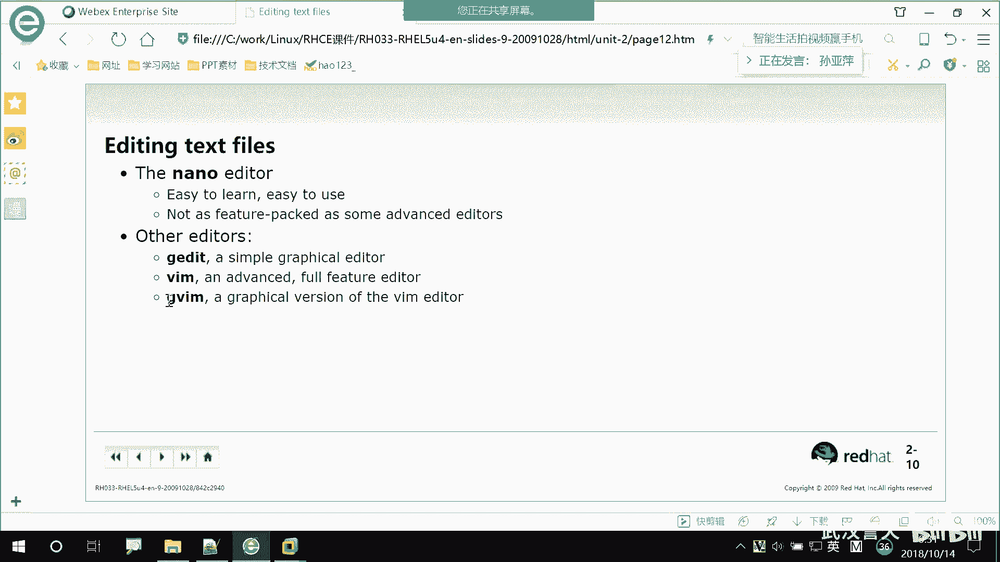
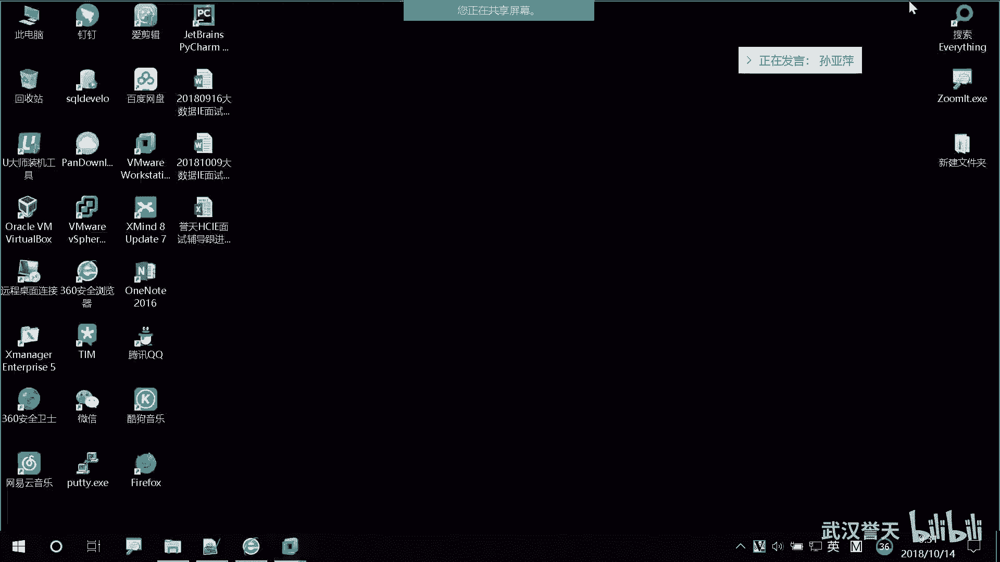
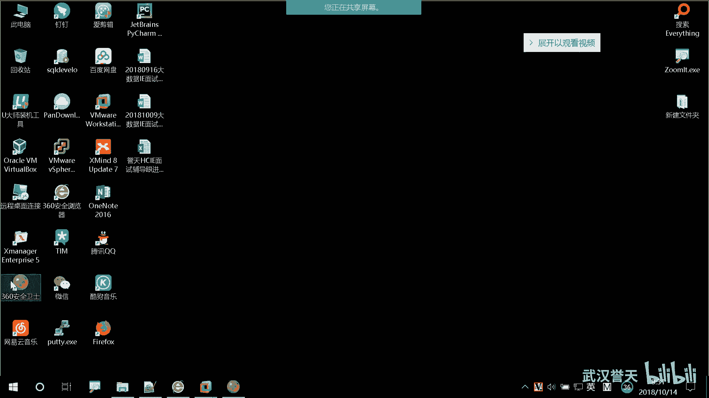
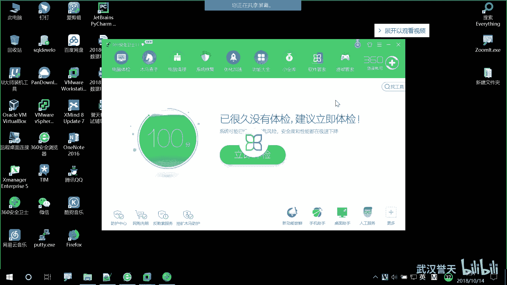
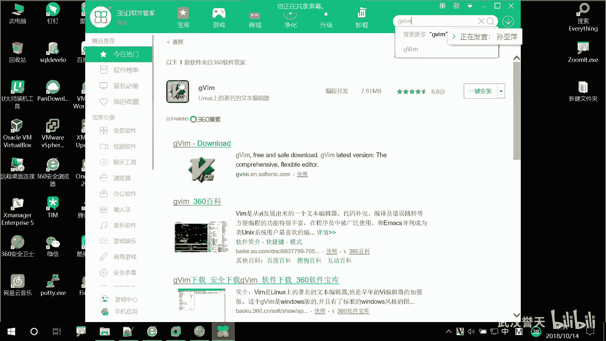
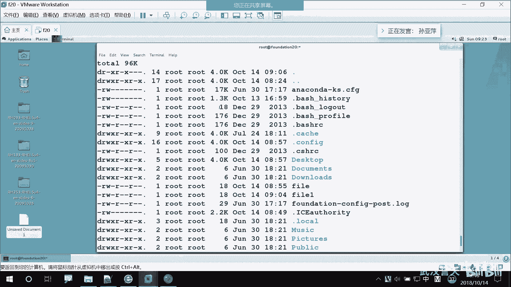

# Linux基础操作：03：运行命令和获取帮助

在本节课中，我们将要学习Linux系统中运行命令的基本语法，以及如何利用系统内置的帮助资源来学习和解决问题。这对于初学者掌握Linux至关重要。

上一节我们介绍了Linux的基本概念和登录、文件编辑等操作，本节中我们来看看如何正确地运行命令并在遇到困难时获取帮助。

## 运行命令的基本语法

在Linux的命令行界面中，所有操作都通过输入命令来完成。一个完整的命令通常遵循以下基本结构：

**`命令 [选项] [参数]`**

*   **命令**：这是必须的部分，代表要执行的操作或程序。例如，`ls` 命令用于列出目录内容。
*   **选项**：用于修改命令的默认行为，通常以短横线 `-` 开头。例如，`ls -l` 中的 `-l` 表示以长格式（详细信息）列出。
*   **参数**：命令操作的对象，通常是文件名、目录名或用户名等。例如，`ls /home` 中的 `/home` 就是参数，表示要列出 `/home` 目录的内容。

并非所有命令都需要选项和参数，但命令本身是必需的。

## 命令选项的作用与组合

选项可以看作是命令的“开关”或“功能键”，用于启用命令的特定功能。

以下是 `ls` 命令常用选项的示例：

*   `ls -l`：以长格式列出文件，显示详细信息（权限、所有者、大小、修改时间等）。
*   `ls -a`：列出所有文件，包括以点 `.` 开头的隐藏文件。
*   `ls -h`：与 `-l` 选项结合使用时，以人类易读的格式（如 K, M, G）显示文件大小。

这些选项可以组合使用，以实现更复杂的查看需求。例如，要查看所有文件（包括隐藏文件）的详细信息并以易读格式显示大小，可以输入：

**`ls -l -a -h`**

或者更简洁地写为：

**`ls -lah`**

## 如何获取命令帮助

Linux系统内置了丰富的帮助文档，是学习命令最权威、最直接的资源。以下是几种主要的获取帮助的方法：

### 1. 使用 `--help` 选项

大多数命令都支持 `--help` 选项，它会输出该命令的简要用法说明和选项列表。这是最快捷的查询方式。

**`命令 --help`**

例如，查看 `ls` 命令的帮助信息：

**`ls --help`**

### 2. 使用 `man` 手册

`man`（manual的缩写）命令提供了更详细、更完整的命令手册页。它包含了命令的描述、语法、选项、参数、示例以及相关文件等信息。

**`man 命令`**

例如，查看 `ls` 命令的完整手册：

**`man ls`**

在 `man` 页面中，可以使用以下按键进行导航：
*   按 **空格键** 或 **Page Down** 向下翻页。
*   按 **Page Up** 向上翻页。
*   按 **`/`** 后输入关键词进行搜索。
*   按 **`q`** 键退出 `man` 页面。

### 3. 使用 `info` 页面

`info` 是另一种格式的帮助文档，通常比 `man` 页面更详细，结构像一本书，包含章节和链接。

**`info 命令`**

例如：

**`info ls`**

操作方式与 `man` 类似，按 `q` 退出。

### 4. 查看系统文档

Red Hat Enterprise Linux (RHEL) 等发行版会在 `/usr/share/doc` 目录下安装软件包附带的详细文档。你可以进入相应软件的目录查看 README 或其他文档文件。

例如，查看已安装的 `bash` 软件包的文档：

**`cd /usr/share/doc/bash-*`**
**`ls`**

## 实用技巧：命令历史与补全

在命令行操作中，熟练使用历史记录和自动补全可以极大提高效率。

*   **历史命令**：按 **上下方向键** 可以浏览之前执行过的命令。输入 `history` 命令可以列出所有历史命令。
*   **命令补全**：输入命令、选项或文件路径的前几个字母后，按 **Tab** 键，系统会自动补全。如果按一次Tab没有反应，可以按两次Tab，系统会列出所有可能的选项。

本节课中我们一起学习了Linux命令的基本语法结构，了解了选项如何修饰命令行为，并掌握了通过 `--help`、`man`、`info` 和系统文档等多种途径获取帮助的方法。记住，遇到不熟悉的命令时，首先尝试使用 `命令 --help` 或 `man 命令` 来查看官方说明，这是成为Linux熟练用户的关键第一步。