# Linux基础操作：P14：运行命令和获取帮助_2

## 概述
在本节课中，我们将继续学习Linux命令行的核心概念，包括命令选项的组合、长选项与短选项的区别、命令与参数的结合使用，以及如何获取命令的帮助信息。掌握这些知识是熟练使用Linux命令行的基础。

## 命令选项的组合
上一节我们介绍了命令的基本结构。本节中我们来看看如何将多个短选项组合使用。

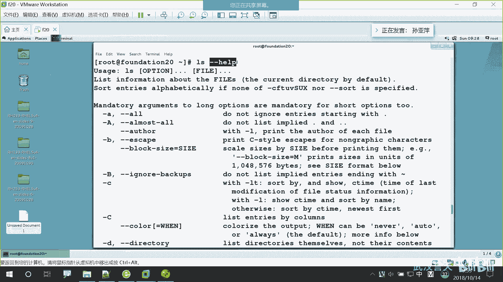

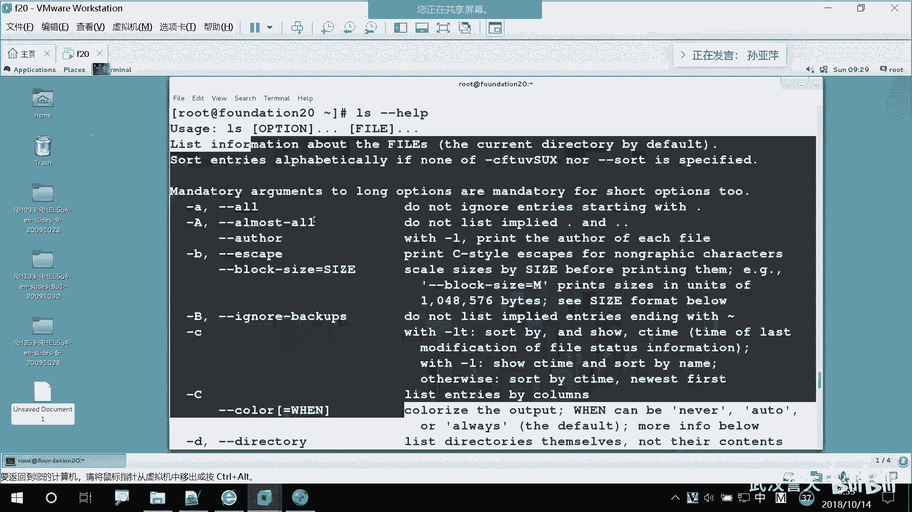

对于单个字母的短选项，我们可以将它们组合在一个短横杠后面，以简化输入。选项的顺序通常无关紧要。

以下是组合选项的示例：
```
ls -lah
```
这条命令等同于依次使用 `ls -l`、`ls -a` 和 `ls -h`。它将列出当前目录下所有文件的详细信息，包括隐藏文件，并以人类可读的格式显示文件大小。

## 短选项与长选项
我们了解了短选项，那么与之对应的就是长选项。

短选项通常由一个短横杠加一个字母组成，例如 `-a`。长选项则由两个短横杠加一个完整的单词或词组组成，例如 `--all`。长选项的可读性更好，但输入较长。

以下是长选项的示例：
```
ls --all
```
这条命令的效果与 `ls -a` 相同，都是显示所有文件，包括隐藏文件。

需要注意的是，长选项不能像短选项那样组合在一起。例如，`ls --all --help` 虽然不会报错，但 `--all` 选项可能不会生效。而 `ls --allhelp` 则会被系统认为是一个不存在的长选项，从而导致错误。

## 命令、选项与参数
一个完整的命令可能包含命令本身、选项和参数三部分。其中，只有命令是必须的，选项和参数都是可选的。

参数通常指定命令操作的具体对象，例如文件名或目录名。

以下是包含参数的示例：
```
ls -l anaconda-ks.cfg
```
这条命令会显示文件 `anaconda-ks.cfg` 的详细信息。

命令行的每个组成部分（命令、选项、参数）之间必须用**空格**分隔。空格的个数可以是一个或多个，系统都能识别。但是，不能不用空格，否则系统会将整个字符串当作一个命令名来处理。

## 执行多个命令
有时我们需要连续执行多个命令。可以使用分号 `;` 来分隔多个命令。

以下是使用分号的示例：
```
date; cal
```
系统会先执行 `date` 命令显示日期和时间，然后执行 `cal` 命令显示日历。

需要注意的是，用分号连接的命令之间没有逻辑关联。无论前一个命令执行成功与否，后一个命令都会被执行。

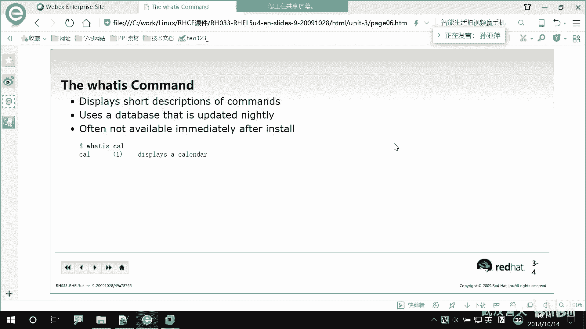


## 获取命令帮助
我们不可能记住所有命令的用法，因此学会如何获取帮助至关重要。Linux提供了多种获取帮助的途径。

### 1. whatis 命令
`whatis` 命令用于显示某个命令的简短描述。

以下是使用 `whatis` 的示例：
```
whatis date
whatis ls
```
`whatis` 命令从一个数据库中查询信息。在新安装的系统上，可能需要先手动更新此数据库才能使用：
```
sudo updatedb
```
或者使用：
```
mandb
```

### 2. --help 选项
大多数命令都支持 `--help` 选项（或其简写 `-h`），用于显示该命令的使用帮助和选项说明。

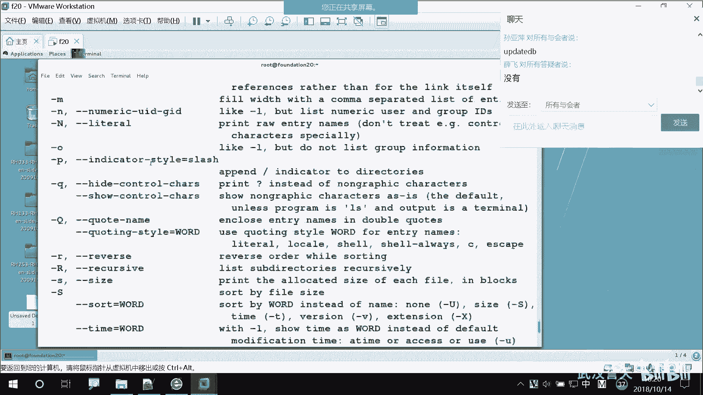

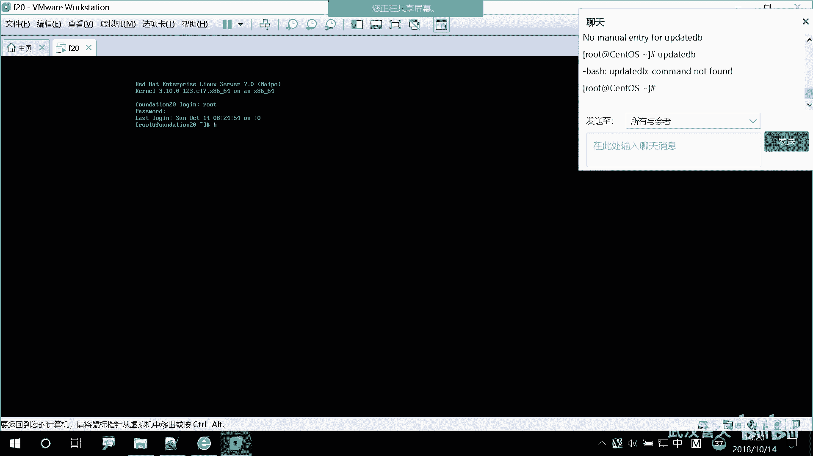

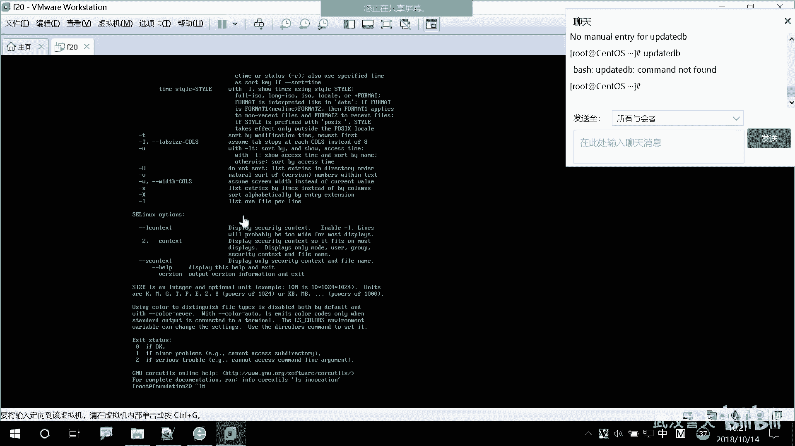

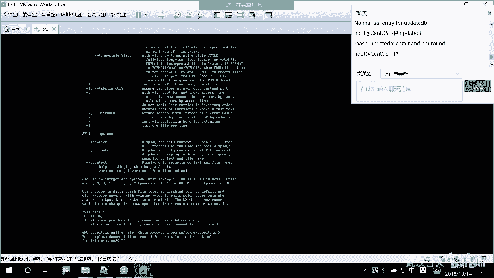

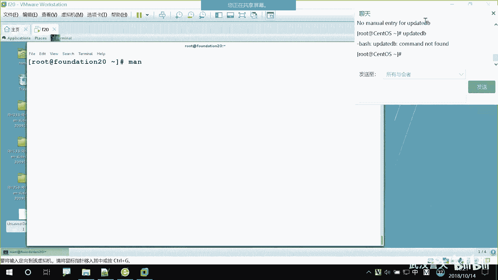

以下是使用 `--help` 的示例：
```
ls --help
```
帮助信息通常会包含命令的语法格式。例如，`ls [OPTION]... [FILE]...` 表示：
*   `ls` 是命令。
*   `[OPTION]...`：`[]` 表示选项是可选的，`...` 表示可以指定多个选项。
*   `[FILE]...`：`[]` 表示参数是可选的，`...` 表示可以指定多个文件（参数）。

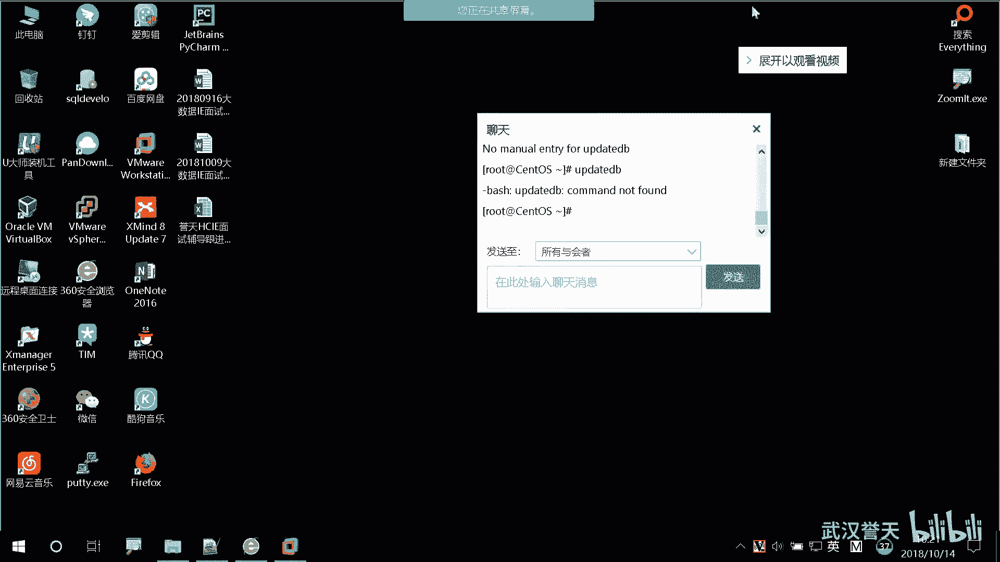

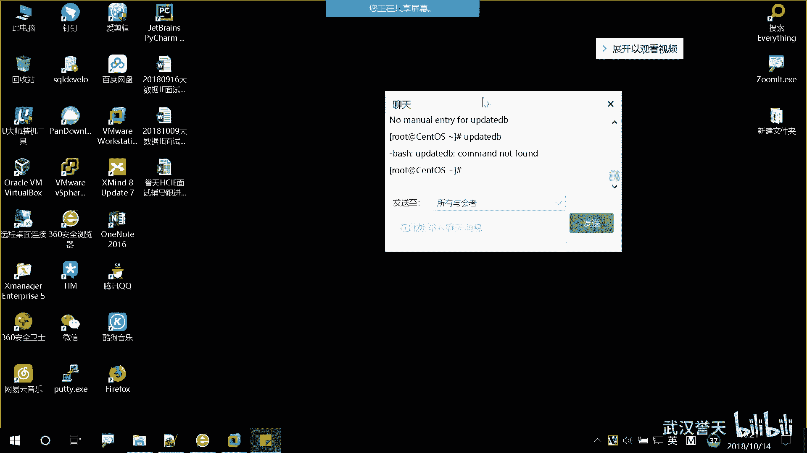

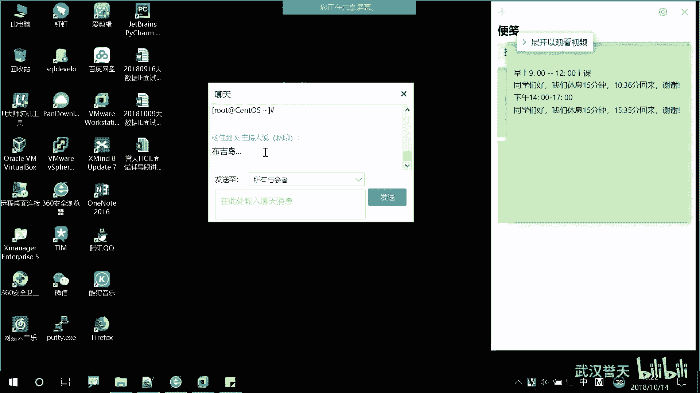

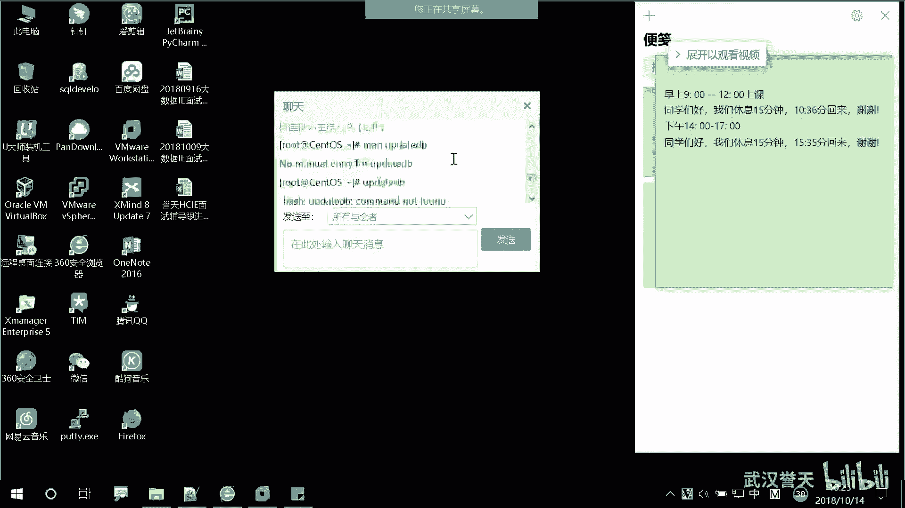

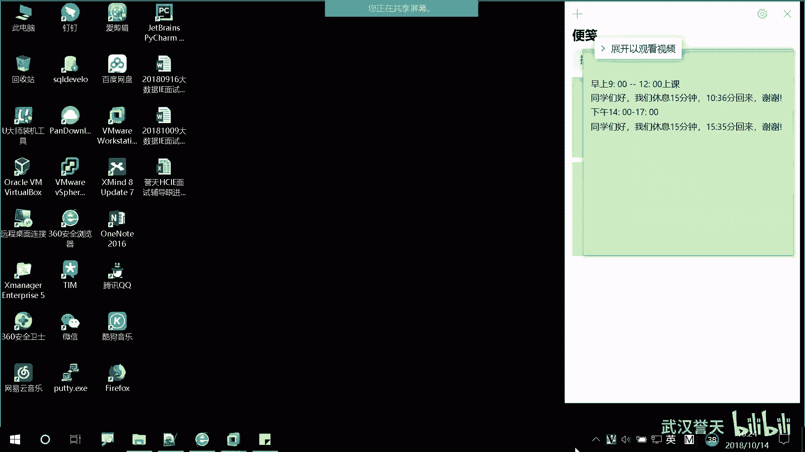

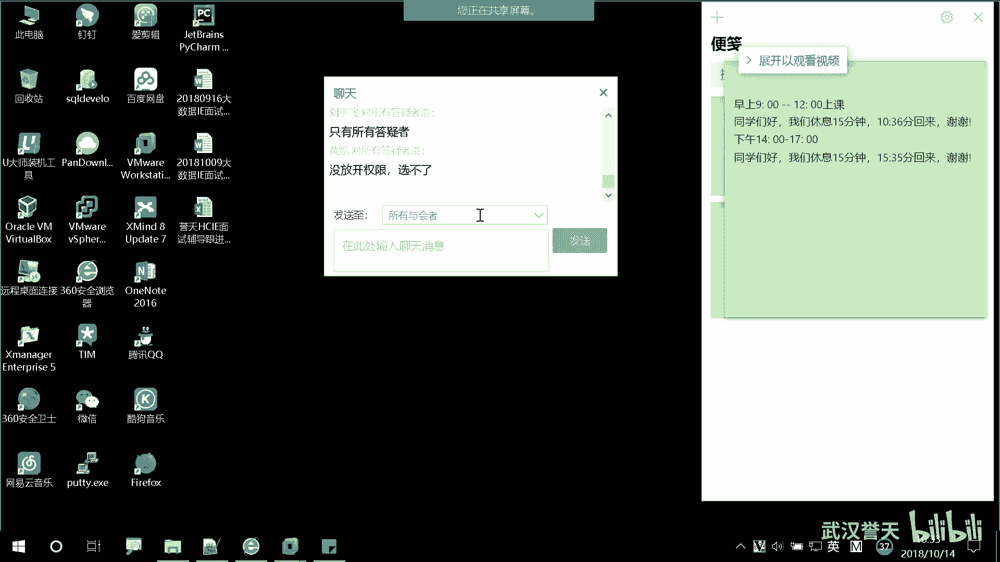

## 总结
本节课中我们一起学习了Linux命令行的几个关键知识点：如何组合短选项以提高效率；认识了长选项及其与短选项的区别；明确了命令、选项、参数之间的关系和书写格式；掌握了使用分号连续执行多个命令的方法；并学习了通过 `whatis` 命令和 `--help` 选项来获取基础帮助信息。这些是构建Linux命令行技能的重要基石，请务必理解和掌握。在下一节，我们将介绍更强大的帮助工具 `man` 手册。