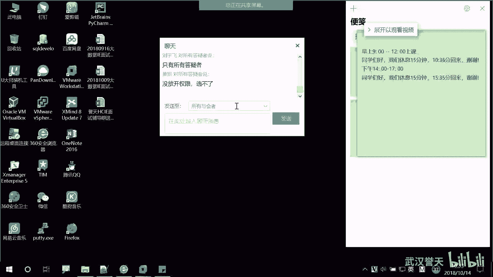
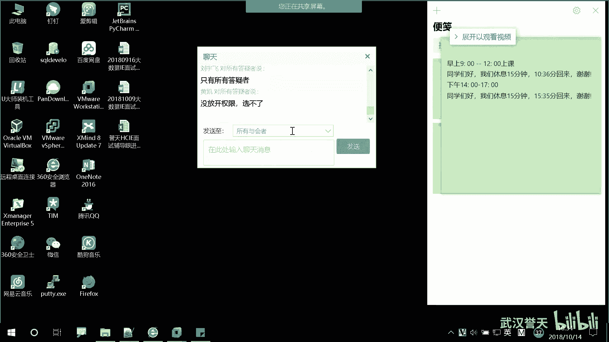
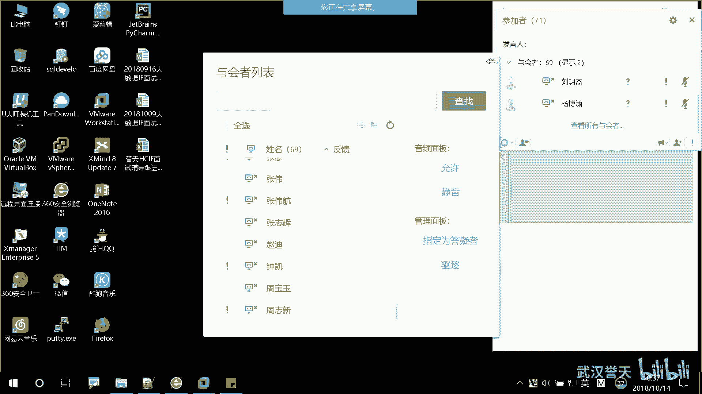
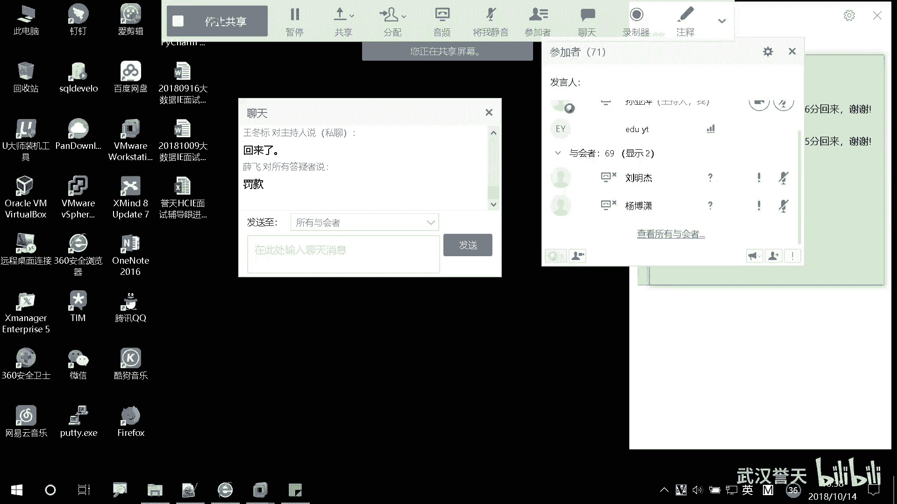
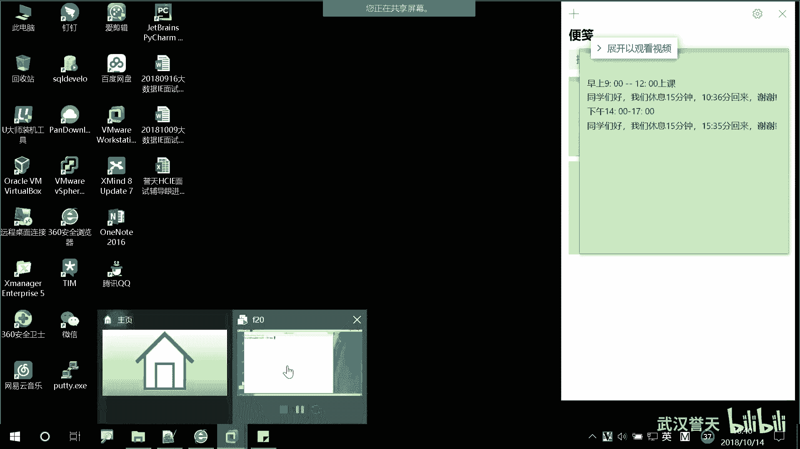
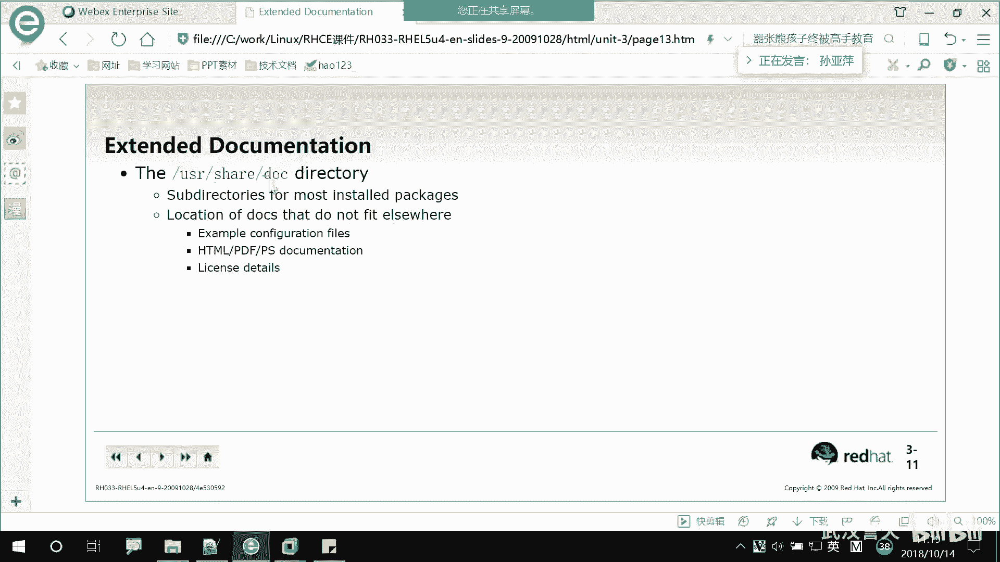

# Linux基础操作：P15：运行命令和获取帮助_3











在本节课中，我们将要学习Linux系统中获取命令帮助的几种核心方法，特别是`man`手册页的详细使用方法。我们将了解如何查阅命令的完整语法、选项和描述，并学习在手册页中高效导航和搜索的技巧。



上一节我们介绍了`whatis`和`--help`这两种基础的帮助命令，本节中我们来看看功能更强大、信息更全面的`man`手册页。

## `man`手册页：命令的完整手册

`man`是`manual`（手册）的缩写。它提供了一个结构化的、完整的命令帮助文档，比`--help`的输出更易于阅读和查找。

### 如何进入和退出`man`手册

要查看一个命令的手册页，只需输入`man`后接命令名。例如，查看`ls`命令的手册：

```bash
man ls
```

要退出`man`手册页并返回命令行，只需按下 **`q`** 键。

### 在手册页中高效导航

进入`man`手册后，可以使用以下快捷键进行导航：

*   **上下箭头键**：逐行滚动。
*   **空格键** 或 **`Page Down`**：向下翻页。
*   **`b`** 键 或 **`Page Up`**：向上翻页。
*   **`g`**：跳转到手册页的**第一行**。
*   **`G`**（即 `Shift + g`）：跳转到手册页的**最后一行**。

### 在手册页中搜索关键词

如果你想在冗长的手册页中快速找到特定信息，可以使用搜索功能。

*   **`/`**：按下斜杠键 `/`，屏幕左下角会出现提示。输入你要搜索的关键词（例如 `ls`），然后按回车。所有匹配的文本都会被高亮显示。
*   **`n`**：在搜索结果中，按 **`n`** 键可以**向下**移动到下一个匹配项。
*   **`N`**（即 `Shift + n`）：按 **`N`** 键可以**向上**移动到上一个匹配项。
*   **清除高亮**：输入 `/` 后直接按回车，或者搜索一个不存在的词，可以清除当前的高亮显示。

### 理解手册页的结构

一个典型的`man`手册页包含以下几个部分，以`man ls`为例：

1.  **NAME（名称）**：命令名称及其简短描述（类似于`whatis`的输出）。
2.  **SYNOPSIS（概要）**：命令的语法格式。这是学习命令用法的关键。
3.  **DESCRIPTION（描述）**：对命令功能的详细说明。
4.  **OPTIONS（选项）**：列出命令所有可用的选项及其解释。
5.  **AUTHOR（作者）**：命令的编写者。
6.  **SEE ALSO（参见）**：列出与该命令相关的其他命令或文档，是扩展学习的好途径。

### 语法规则详解

在`SYNOPSIS`部分，你会看到一些特殊的符号，它们代表了命令的使用规则：

*   **`[ ]` （中括号）**：表示括号内的内容是可选的。例如 `ls [-l]` 表示 `-l` 选项可用可不用。
*   **`|` （竖线）**：表示“或”的关系。例如 `-u | --universal` 表示可以使用短选项 `-u` 或长选项 `--universal`，二者选一。
*   **`...` （省略号）**：表示前面的元素可以重复多次。例如 `source...` 表示可以指定多个源文件。
*   **`<>` （尖括号）**：表示需要被实际值替换的占位符，例如 `<filename>` 表示你需要在这里填入一个文件名。
*   **不加括号的文本**：通常是必须提供的参数。例如 `cp source dest` 中的 `source` 和 `dest` 都是必须的。

让我们分析一个复杂些的例子，`man date` 命令的语法部分可能显示为：
```
date [OPTION]... [+FORMAT]
date [-u|--utc|--universal] [MMDDhhmm[[CC]YY][.ss]]
```
*   第一行表示：`date` 命令后可以跟多个可选选项 `[OPTION]...`，以及一个可选的格式参数 `[+FORMAT]`。
*   第二行展示了设置日期时间的复杂语法，其中 `MMDDhhmm` 是必须的（月日时分），而 `[[CC]YY][.ss]`（世纪、年、秒）则是嵌套的可选部分。

## `man`手册的章节

`man`手册不仅仅包含命令，它被分成了多个章节（section），每个章节包含特定类型的内容。

以下是主要的章节及其内容：

*   **Section 1: User Commands** - 用户命令（最常用）。
*   **Section 5: File Formats** - 文件格式和约定（如 `/etc/passwd` 文件的结构）。
*   **Section 8: System Administration Commands** - 系统管理命令（通常需要root权限）。

默认情况下，`man`命令会从编号最小的章节开始查找。如果你想查看特定章节的内容，需要在命令和章节号。例如，查看`passwd`文件的格式（第5章）：
```bash
man 5 passwd
```
查看`fdisk`分区命令的管理员手册（第8章）：
```bash
man 8 fdisk
```

## 使用`man -k`进行模糊搜索

如果你只记得命令的一部分，或者想查找具有某种功能的命令，可以使用 `man -k` 进行关键词搜索。它会搜索所有手册页的**名称**和**描述**。

例如，搜索所有包含“pass”关键词的手册页：
```bash
man -k pass
```
输出结果会显示匹配的命令名、其所在的章节以及简短描述。

## 更详细的帮助：`info`

除了`man`，还有一个更详尽但结构更复杂的帮助系统叫 `info`。它提供的信息量通常比`man`页更大，但导航起来也更复杂。

查看`date`命令的info文档：
```bash
info date
```
在`info`页面中，可以使用方向键移动，`Tab`键在链接间跳转，`Enter`键进入链接，`s`键进行搜索，`q`键退出。

对于初学者来说，掌握`man`手册已经足够应对绝大多数情况。

## 其他帮助资源

系统的帮助文档还以纯文本文件的形式存放在 `/usr/share/doc` 目录下，这里包含了大量软件包的详细文档、示例和版权信息。



本节课中我们一起学习了Linux中最重要的帮助工具——`man`手册页。我们掌握了如何进入、退出以及在手册页中导航和搜索；理解了手册页的标准结构和语法符号的含义；知道了`man`手册有不同的章节，并学会了如何查看特定章节以及使用`man -k`进行模糊搜索。此外，我们还简要了解了`info`系统和`/usr/share/doc`文档目录。熟练使用这些帮助工具，是独立学习和解决Linux问题的关键能力。