Linux基础操作：P16：运行命令和获取帮助_4

在本节课中，我们将学习如何利用Linux系统中的多种帮助资源，包括系统自带的文档、软件包提供的参考文件以及官方网站的详细指南。掌握这些方法对于解决实际问题和深入学习至关重要。

---

### 系统自带帮助文档

上一节我们介绍了`man`命令的基本用法，本节中我们来看看系统里其他形式的帮助文档。这些文档通常以文件形式存放在特定目录中，供用户阅读参考。

例如，安装`httpd-manual`软件包后，系统会在`/usr/share`目录下生成一系列帮助文件。

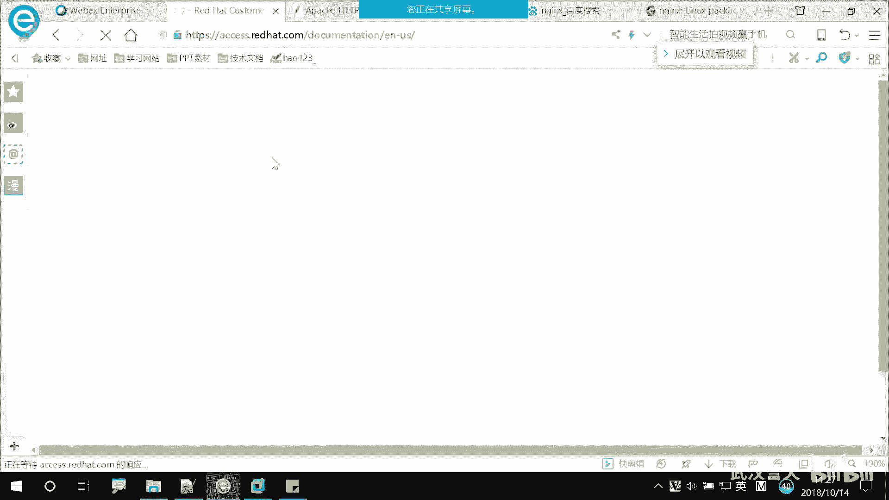

```bash
yum install httpd-manual
```

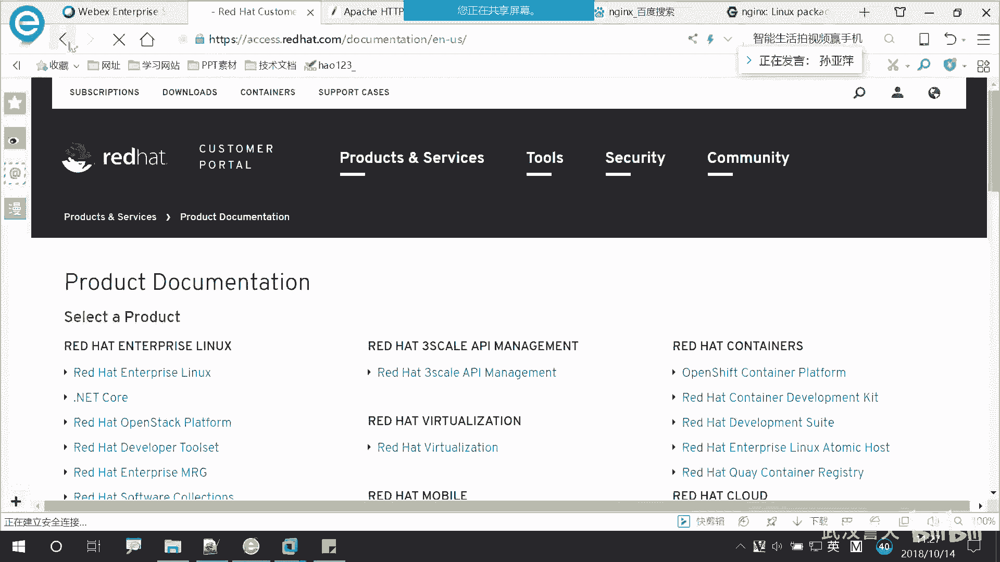

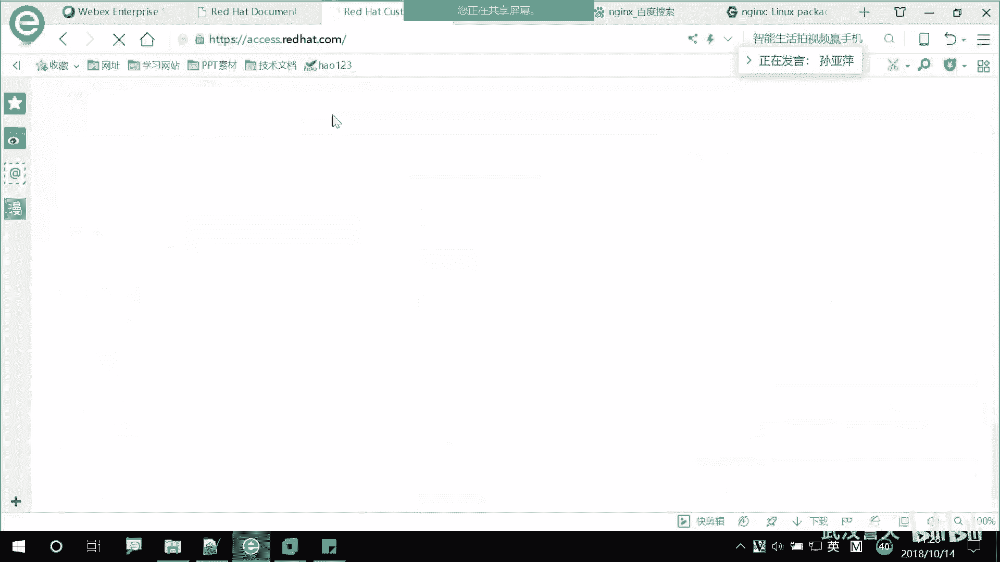


安装完成后，可以进入`/usr/share/httpd/manual`目录查看。这些文件主要是HTML格式，可以使用火狐浏览器直接打开阅读。

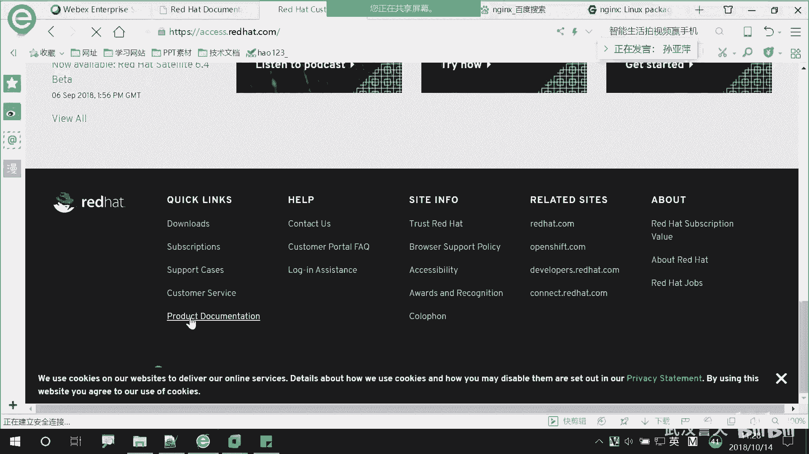

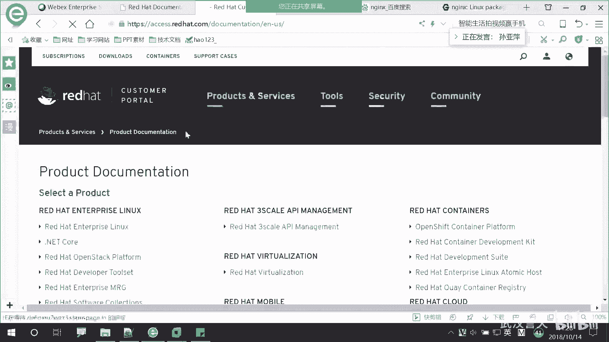

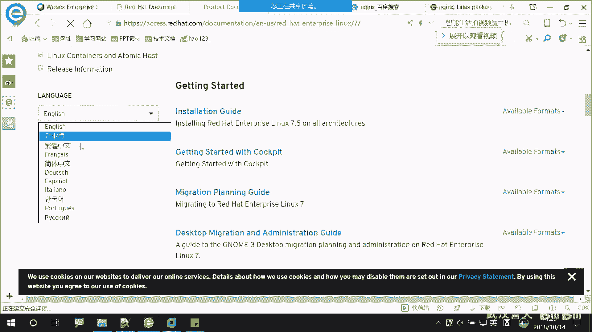

```bash
firefox /usr/share/httpd/manual/index.html
```

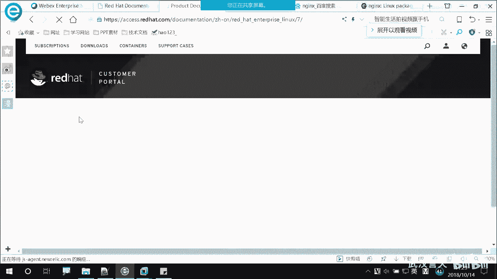

以下是关于这些帮助文件的几点说明：
*   这些文件是纯粹的参考文档，用于说明软件（如Apache）的配置和使用方法。
*   它们不是活动的配置文件，修改这些文件不会影响软件运行。
*   除了HTML文件，该目录下也可能包含PDF、PS等格式的文档。

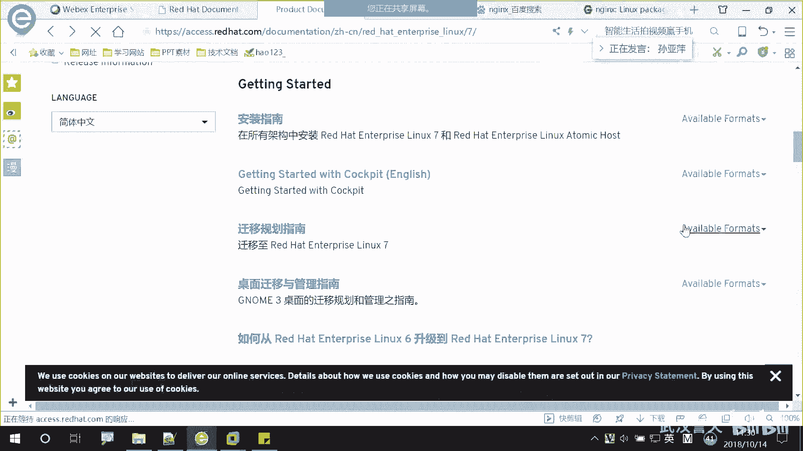

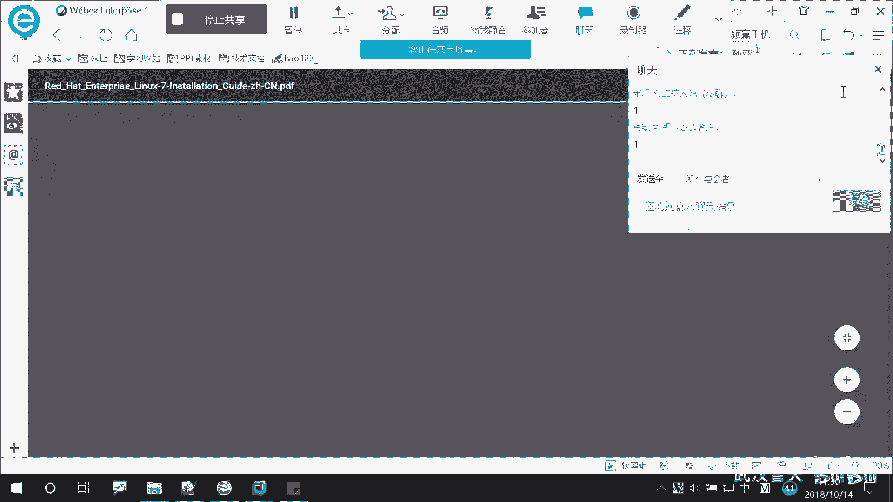

---

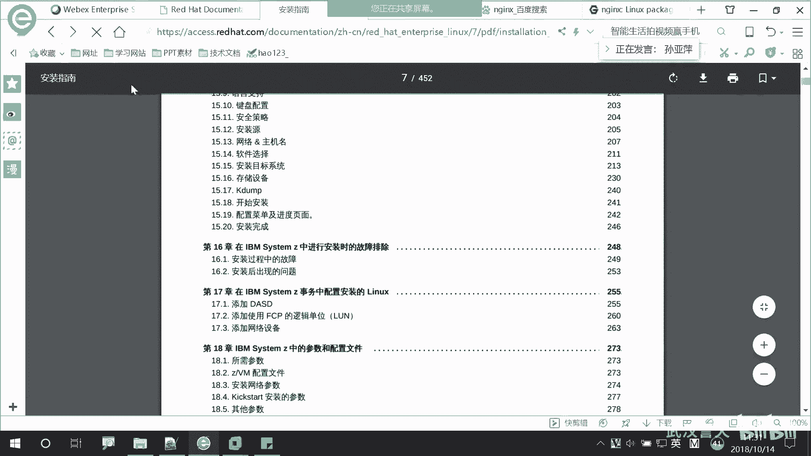

### 访问软件官方网站

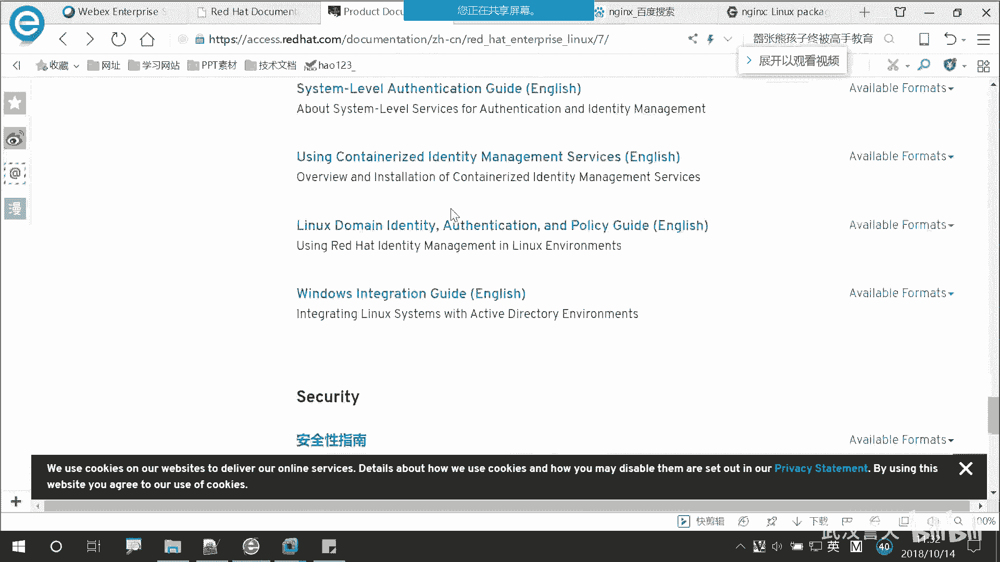

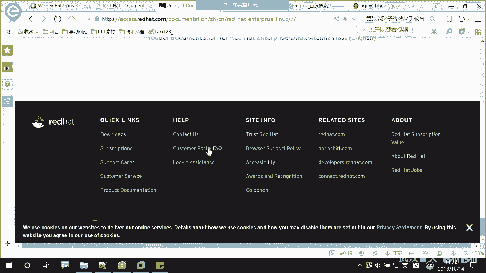

除了系统自带的文档，获取帮助最权威的途径是访问相应软件的官方网站。官方网站通常提供最新的软件信息、使用指南、配置示例和问题解答。

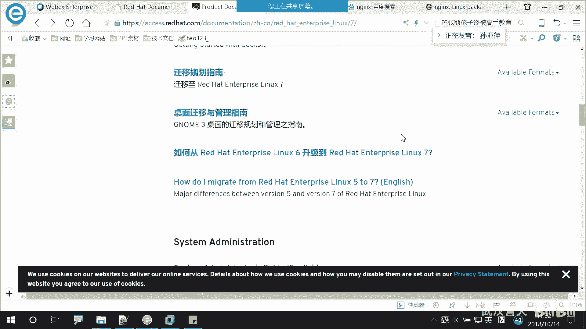

例如，Apache网站的地址是 `http://httpd.apache.org/`。Nginx的官方网站是 `https://nginx.org/`。

官方网站的信息通常非常全面，例如：
*   **软件特性介绍**：详细说明软件的功能和优势。
*   **下载资源**：提供稳定版、开发版等不同版本的软件包下载。
*   **文档与指南**：包含安装、配置、优化等全方位的教程。
*   **社区与支持**：可以找到邮件列表、论坛等寻求帮助的渠道。

---

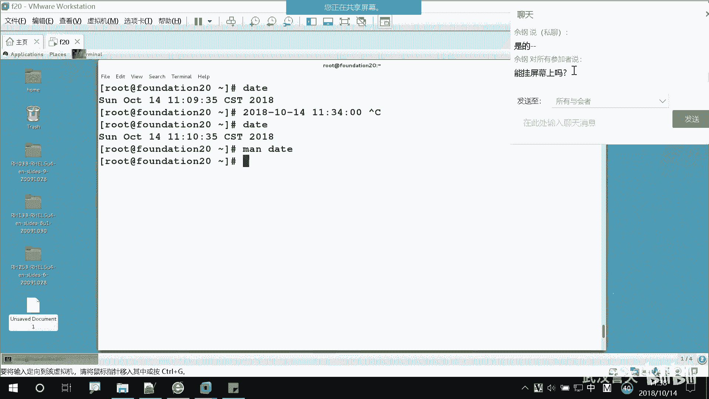

### 利用红帽官方知识库

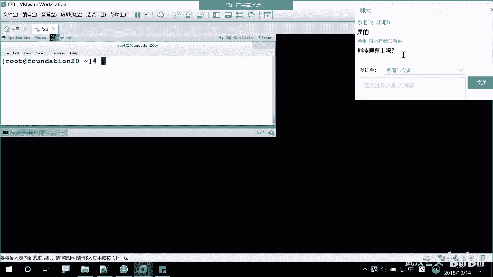

对于红帽企业版Linux（RHEL）用户，红帽公司提供了官方的产品文档网站，这是学习和解决问题不可或缺的资源。

红帽官方文档访问地址是：`https://access.redhat.com/documentation`

该网站提供了极其详尽的文档，涵盖RHEL的各个方面。以下是其主要内容分类：
*   **发行说明（Release Notes）**：介绍每个子版本（如RHEL 7.1, 7.2）的变更内容。
*   **安装指南**：提供在各种环境（物理机、虚拟机、云平台）下的详细安装步骤。该指南通常有中文版本。
*   **系统管理指南**：包含用户管理、存储管理（如逻辑卷）、网络配置等日常管理任务。
*   **迁移指南**：指导用户如何从旧版本（如RHEL 5/6）升级或迁移到新版本。
*   **性能调优指南**：提供优化系统性能的建议和方案。
*   **虚拟化与高可用**：涉及KVM虚拟化、集群（Cluster）等高级主题的文档。

用户可以根据需要，在线浏览或下载PDF格式的文档进行学习。

---

### 实践练习：定制日期显示格式

为了巩固对帮助文档的使用，我们布置一个实践作业：使用`date`命令，将系统当前时间显示为 `2018-01-14 11:34` 这样的格式（请以你实际操作时的日期时间为准）。

**需求分析**：默认的`date`命令输出格式可能不符合我们的习惯。我们需要通过查阅`man`手册，找到控制输出格式的选项和参数。

**解决步骤提示**：
1.  使用 `man date` 命令查看手册。
2.  在手册中查找与“格式（FORMAT）”相关的部分。可以使用 `/` 键进行搜索，例如搜索 `year`, `month`, `hour` 等关键词。
3.  格式控制符通常以 `%` 开头。例如：
    *   `%Y` 表示四位数的年份（如2018）。
    *   `%m` 表示两位数的月份（01-12）。
    *   `%d` 表示两位数的日期（01-31）。
    *   `%H` 表示24小时制的小时（00-23）。
    *   `%M` 表示分钟（00-59）。
4.  组合这些格式符，并使用 `date` 命令的 `+FORMAT` 选项进行输出。注意，空格等特殊字符可能需要用引号括起来。

示例命令格式如下：
```bash
date "+%Y-%m-%d %H:%M"
```

请尝试自己查找手册并完成这个练习，这将有效提升你查阅文档和解决问题的能力。

---

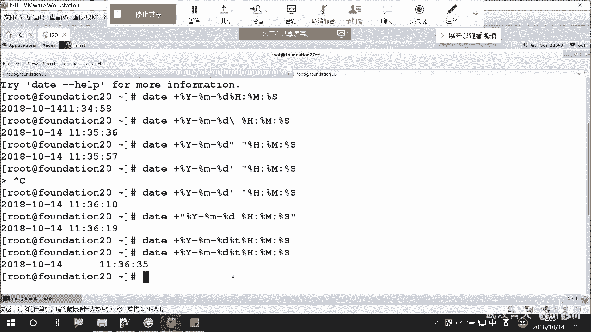

本节课中我们一起学习了Linux系统中多种获取帮助的途径：从系统自带的`man`手册和软件包文档，到互联网上软件的官方网站，最后到红帽官方的详尽产品文档库。善于利用这些资源，是成为一名合格Linux系统管理员的关键技能。课后请认真完成日期格式化的练习，并尝试浏览红帽官方文档网站，熟悉其结构。