# Linux基础操作：01：RHEL7操作系统安装准备 🖥️

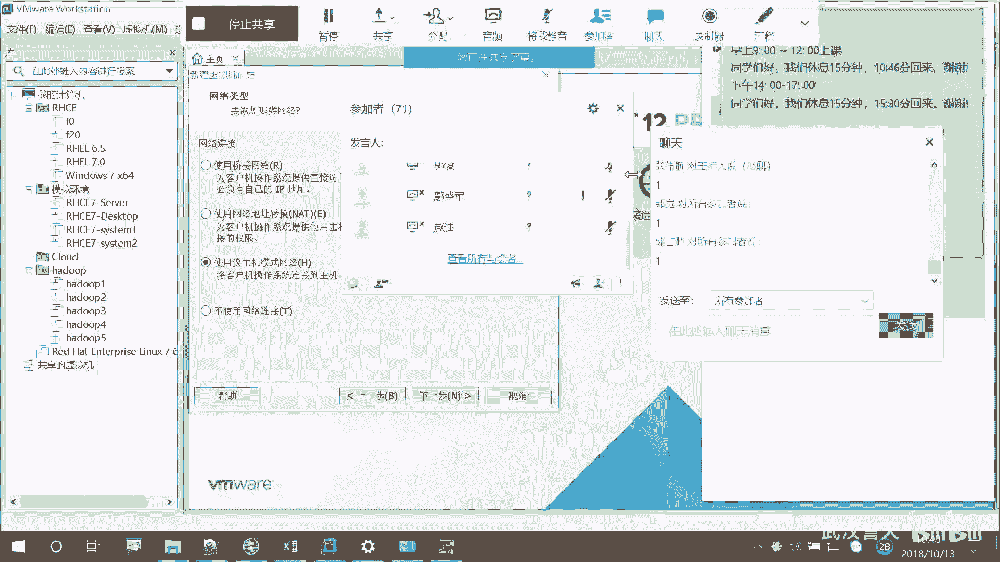

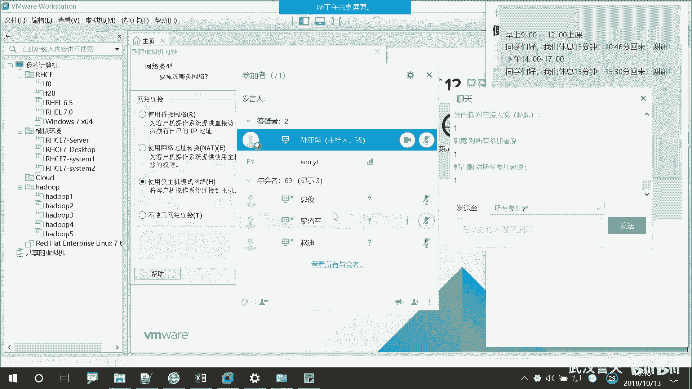

在本节课中，我们将学习如何为安装Red Hat Enterprise Linux 7（RHEL7）操作系统做准备。这包括了解课程纪律、修改用户名以及课堂交流规范。

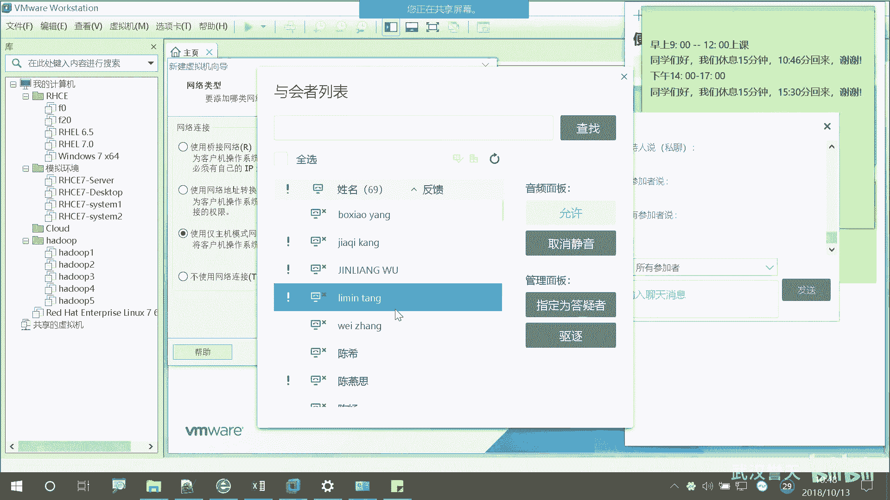

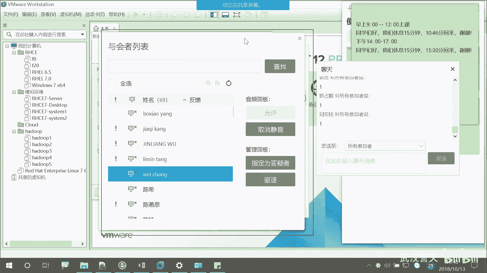

## 课程纪律与用户名规范

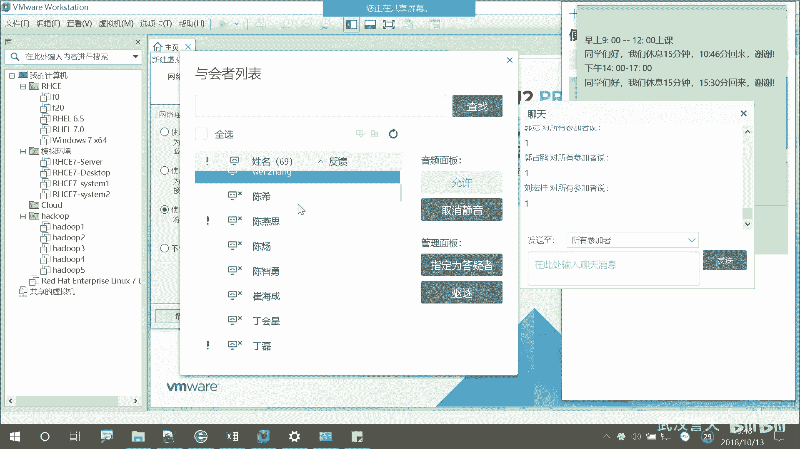

上一节我们介绍了课程主题，本节中我们来看看参与课程时需要遵守的基本规范。

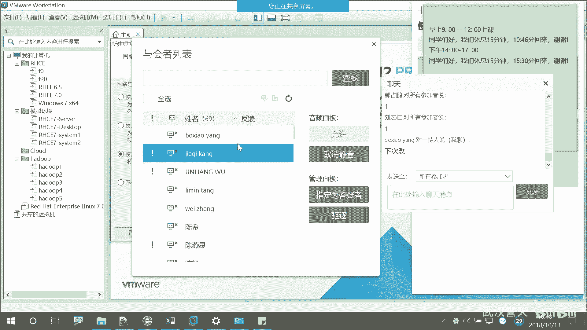

远程学习的同学请注意。需要再次强调。

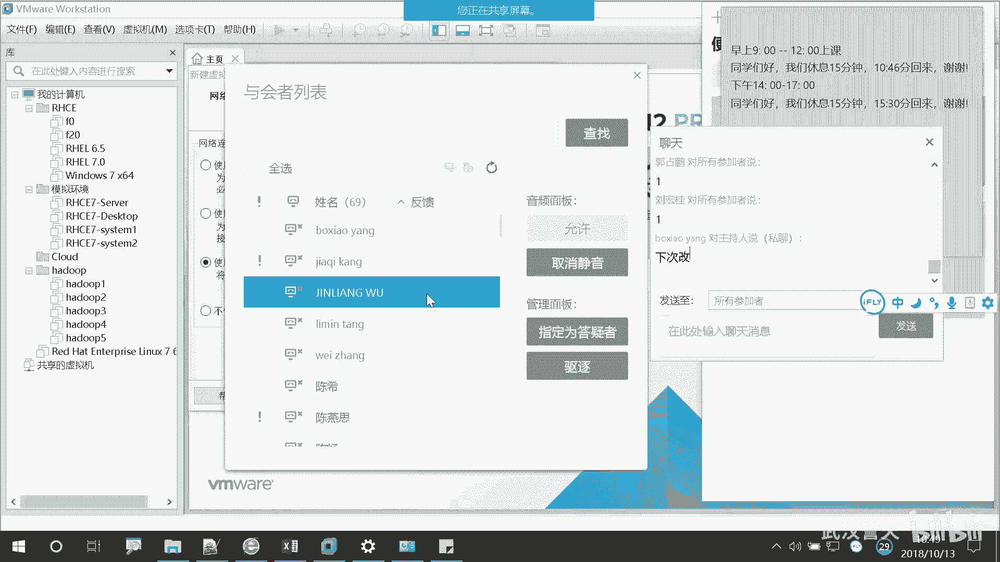

以下是关于用户名设置的具体要求：
*   请勿使用拼音书写自己的名字。
*   请将用户名修改为中文。
*   如果无法找到对应的中文姓名，相关学员可能会被移出课堂。

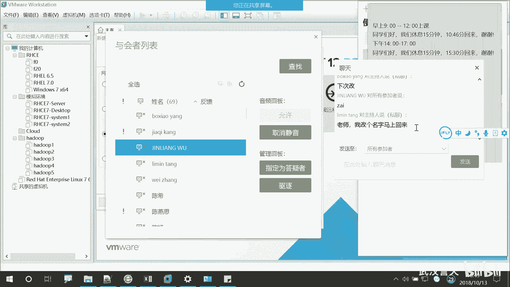

为了避免被移出，请立即按要求修改。

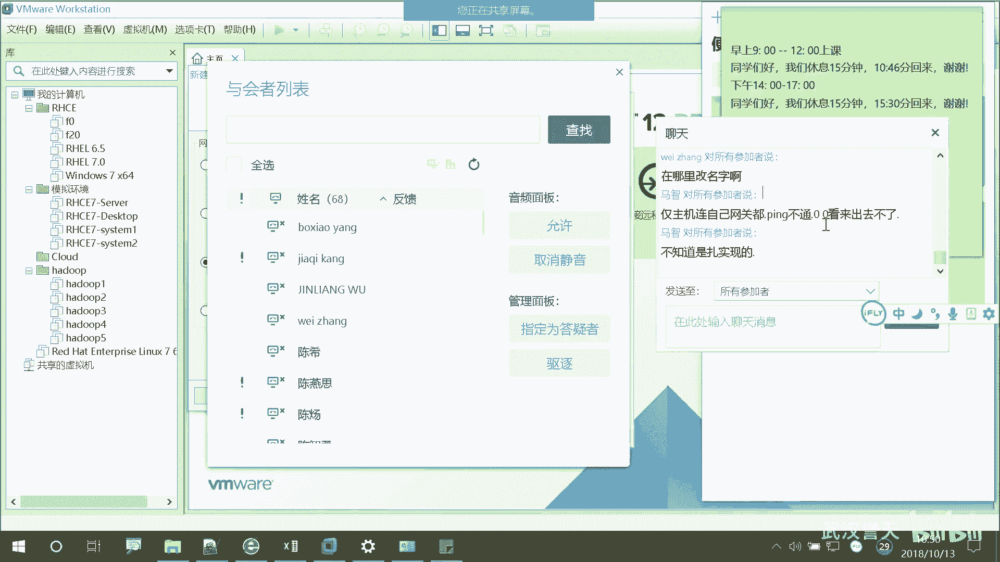

## 课堂交流规范

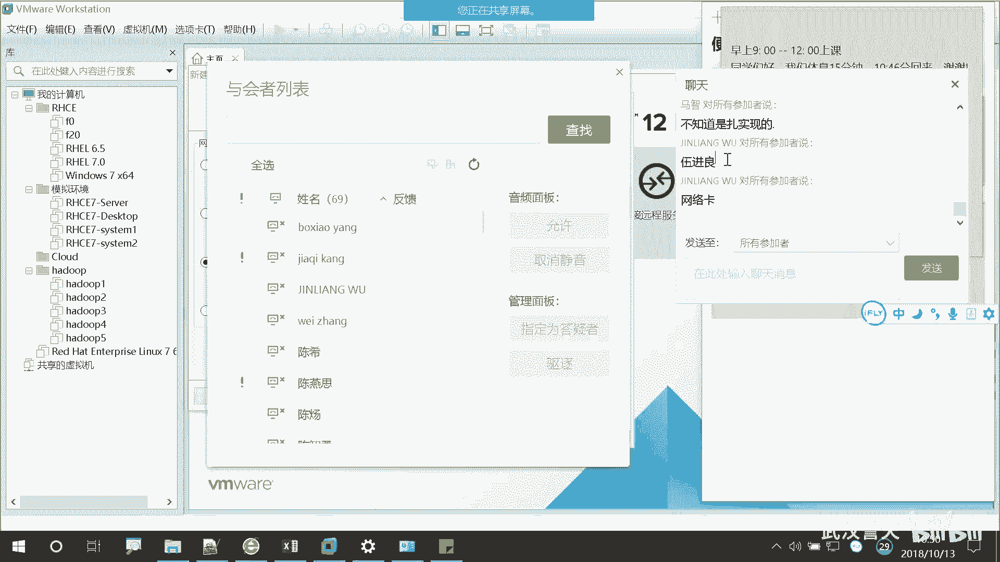

在明确了用户名规范后，我们接下来了解课堂上的交流方式。

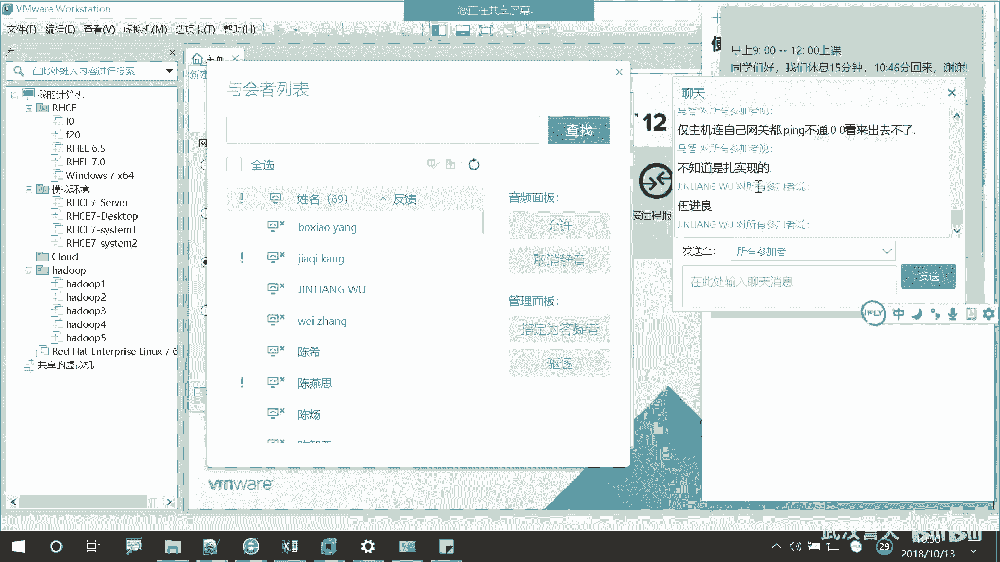

上课期间，请注意对话框的使用规则。

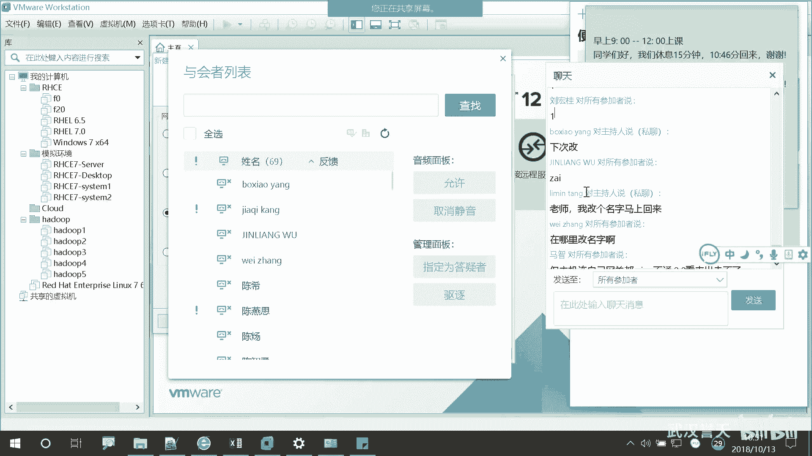

以下是课堂交流的具体注意事项：
*   不要刷屏。
*   当教师提问时，可以回复。
*   提问时，请勿讨论与课堂无关的内容。
*   对于正在讲解的内容，可以随时提问。

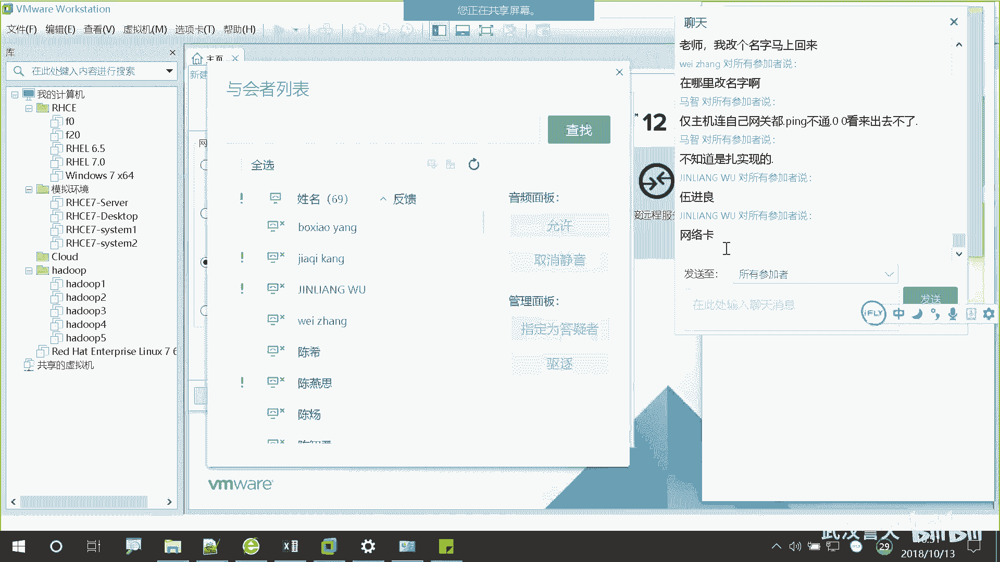

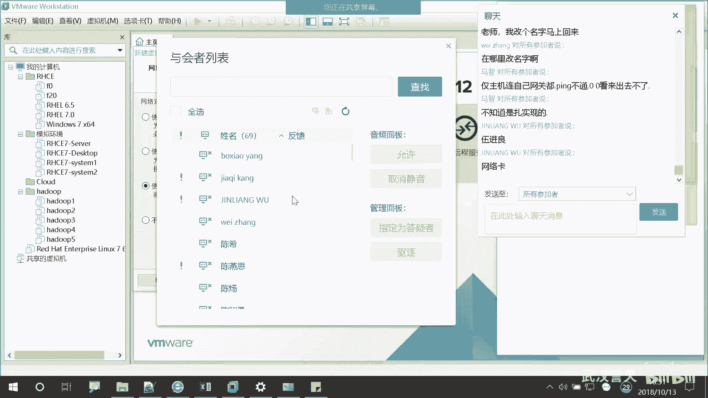

本节课中我们一起学习了参与RHEL7安装课程前的准备工作，包括设置规范的中文用户名以及遵守课堂交流纪律，为后续的实际操作学习打下良好基础。