# Linux基础操作：P2-01：RHEL7操作系统安装（第二部分）

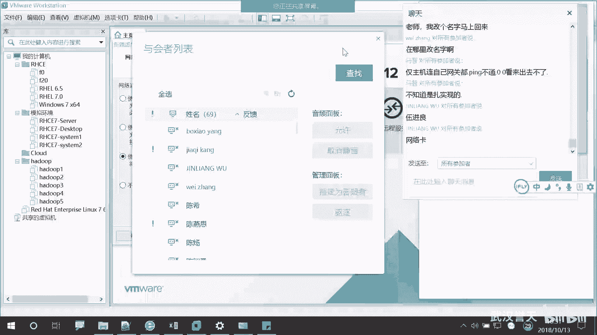

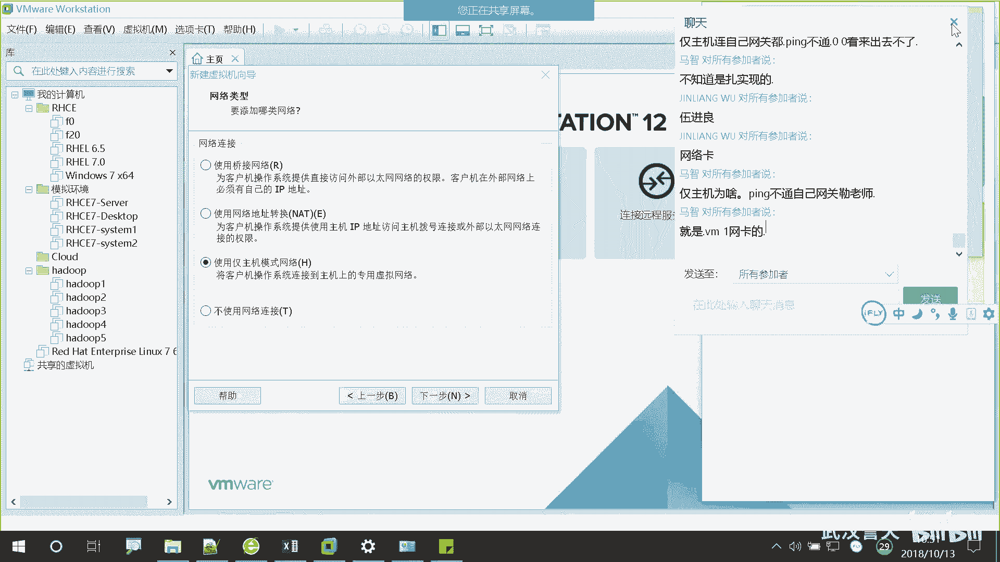

在本节课中，我们将继续学习如何在VMware Workstation中安装RHEL7操作系统。上一节我们介绍了虚拟机的创建和基本配置，本节中我们将重点讲解虚拟磁盘、网络模式的选择以及安装前的最后设置。

## 网络模式选择

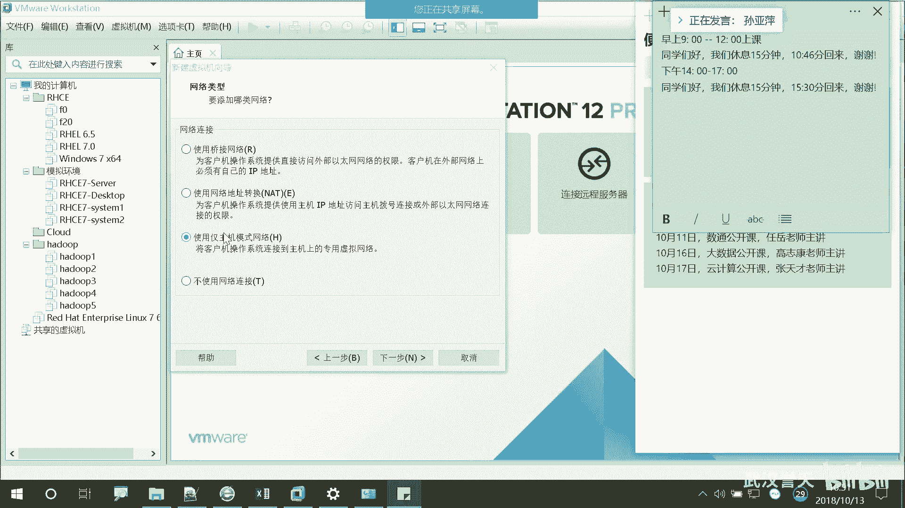

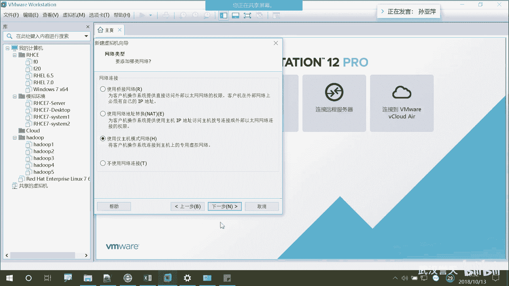

上一节我们介绍了网络配置，本节中我们来看看第三种网络模式——仅主机模式。仅主机模式将虚拟机与物理主机连接在一个隔离的私有网络中，虚拟机之间可以互相通信，但无法访问外部互联网。由于我们的课程实验基本不需要访问外部网络，因此选择此模式即可。

## 磁盘控制器与类型配置

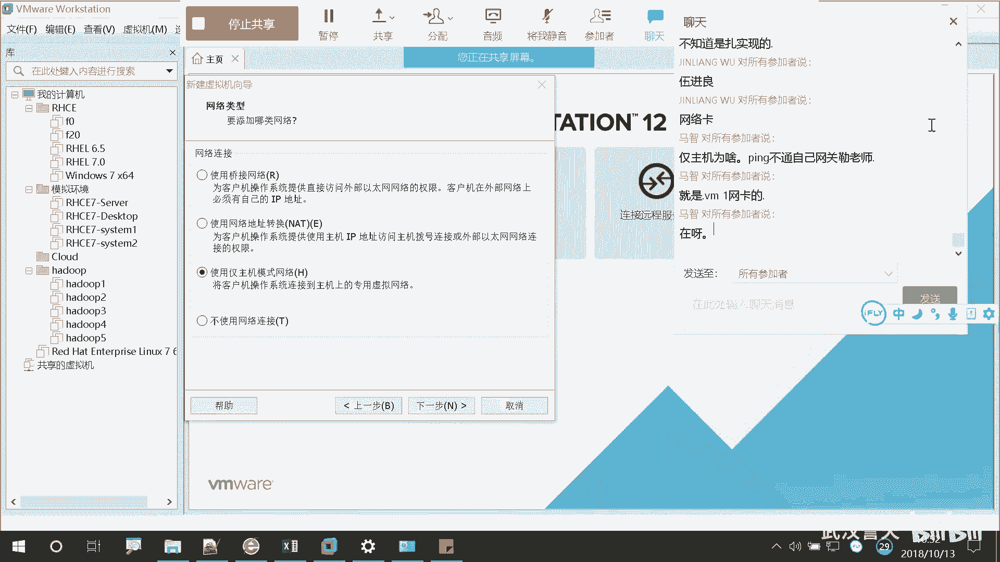

接下来是磁盘控制器（SCSI控制器）和磁盘类型的配置。对于初学者，直接使用软件推荐的默认设置即可。这能确保虚拟机与宿主机的兼容性。

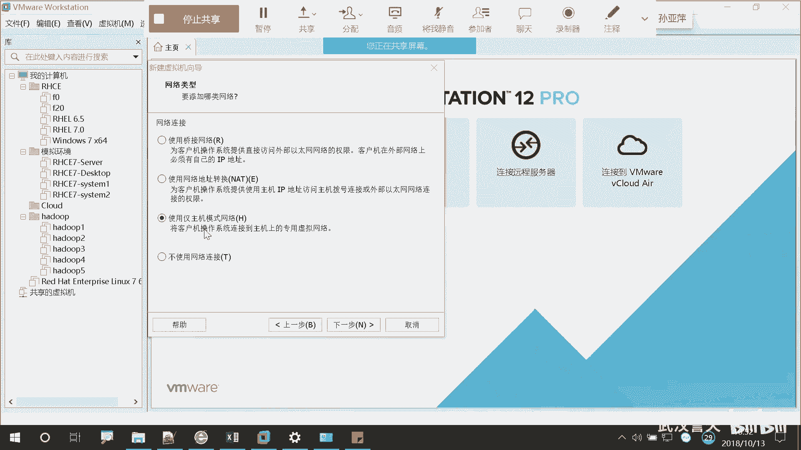

## 虚拟磁盘创建

以下是创建虚拟磁盘时的三个选项说明：

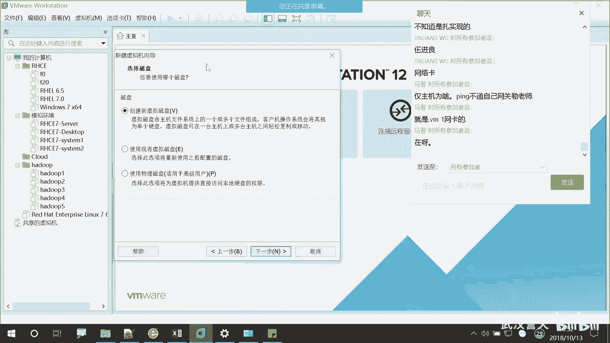

*   **创建新虚拟磁盘**：为虚拟机创建一个全新的、独立的磁盘文件。这是首次安装时的标准选择。
*   **使用现有虚拟磁盘**：如果之前安装过其他虚拟机并保留了其磁盘文件，可以选择此选项来复用该文件。
*   **使用物理磁盘**：此选项会直接使用宿主机的物理硬盘分区，不推荐初学者使用，因为操作不当可能导致数据丢失。

我们选择第一个选项“创建新虚拟磁盘”。

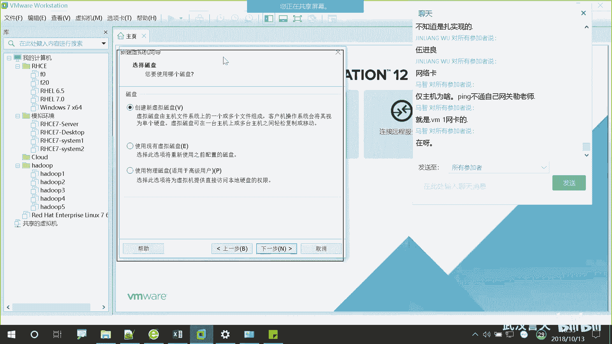

## 配置虚拟磁盘大小

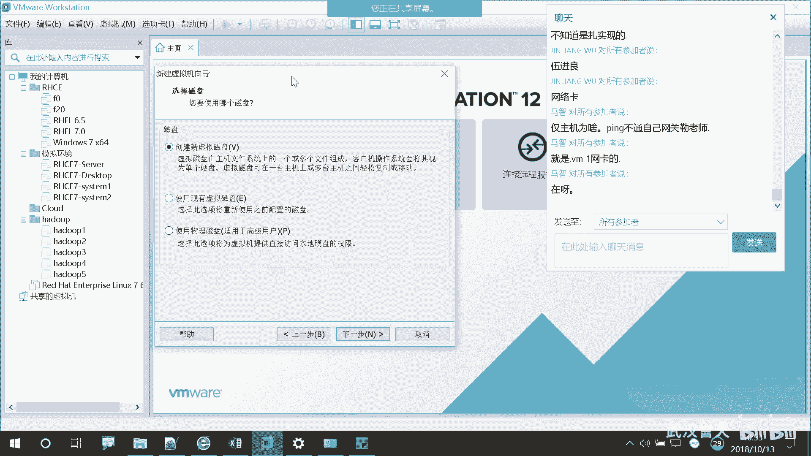

现在需要指定虚拟磁盘的容量。虚拟机的磁盘实际上是一个文件，其大小可以灵活设置。

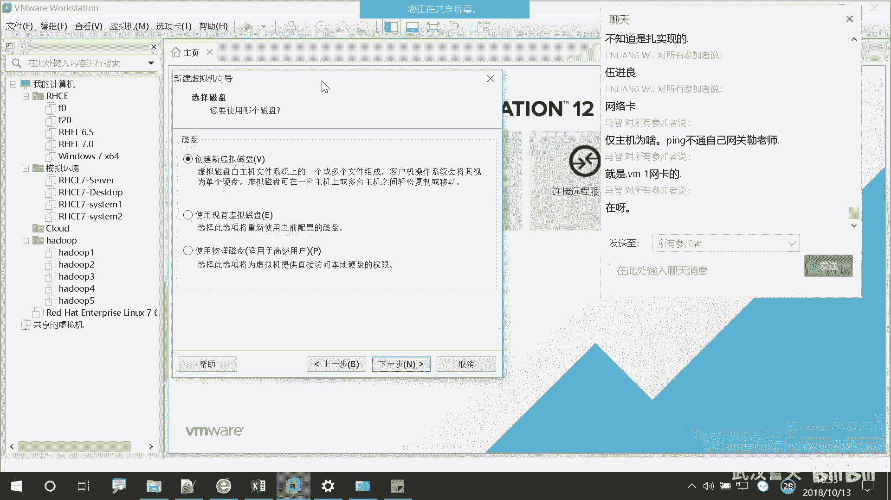

*   对于仅安装RHEL7并进行基础操作，分配**20GB**空间通常足够。
*   你可以根据需要设置得更大（例如200GB），但这并不会立即占用宿主机的物理磁盘空间。虚拟磁盘文件采用的是“稀疏文件”技术，初始很小，会随着虚拟机内实际数据的增加而动态增长。

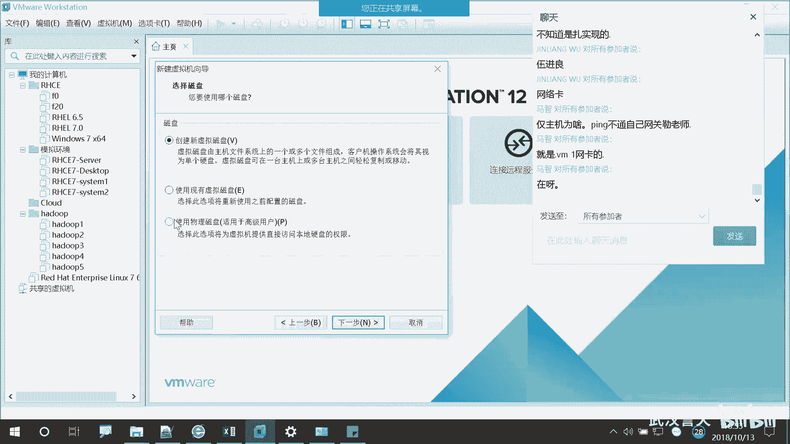

因此，我们设置为20GB并进入下一步。

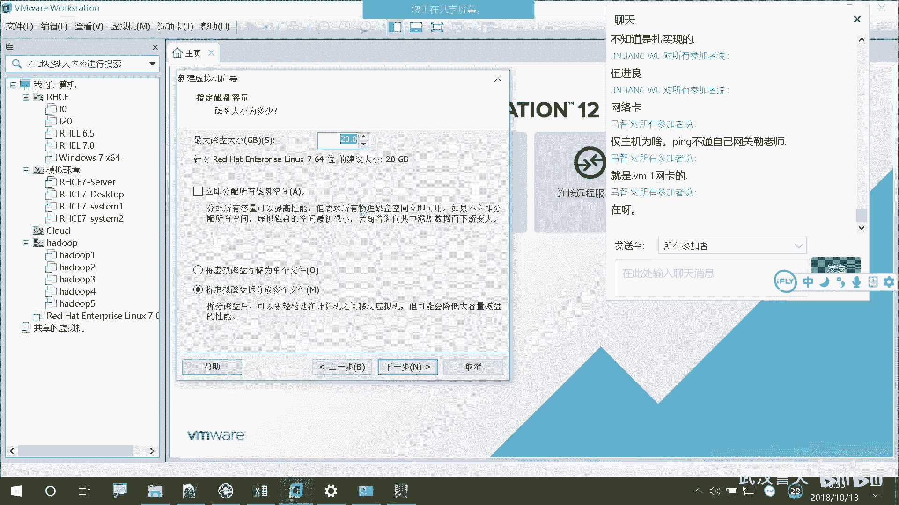

## 指定磁盘文件位置

最后一步是指定虚拟磁盘文件在宿主机上的存储位置。建议将其放在为虚拟机专门创建的文件夹中，以便于管理。

---
本节课中我们一起学习了安装RHEL7前的关键配置：选择了适合实验的“仅主机”网络模式，配置了虚拟磁盘控制器，创建了一个新的20GB虚拟磁盘，并指定了其存储位置。完成这些设置后，我们就为操作系统的安装做好了准备。