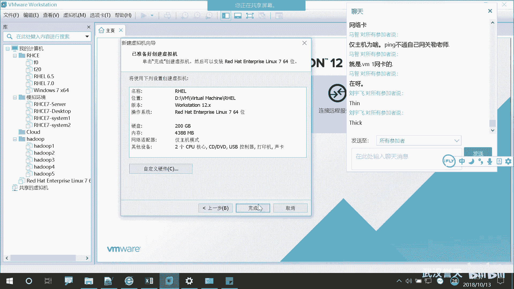
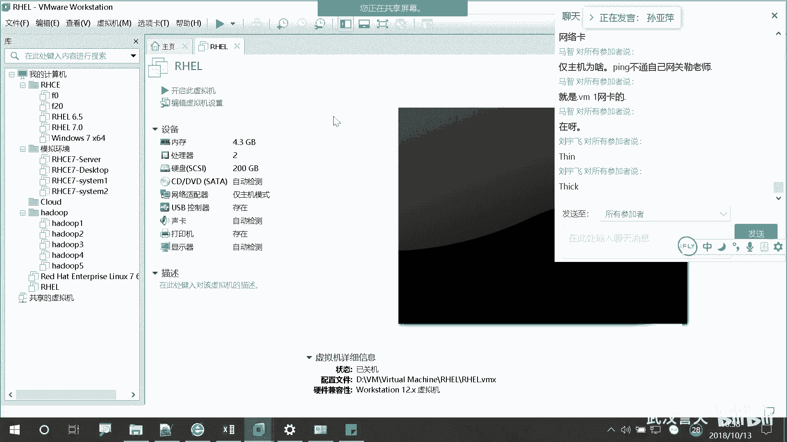
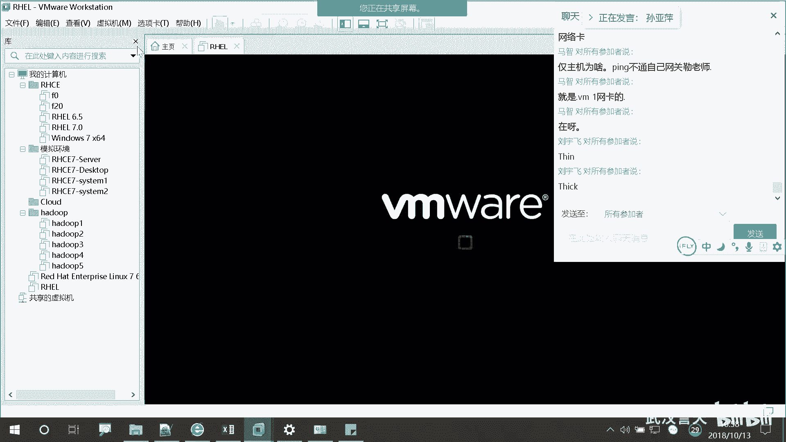
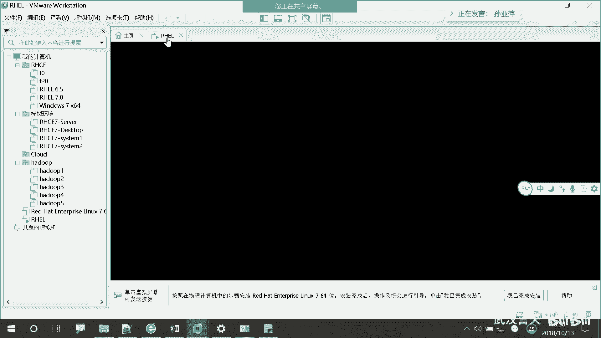
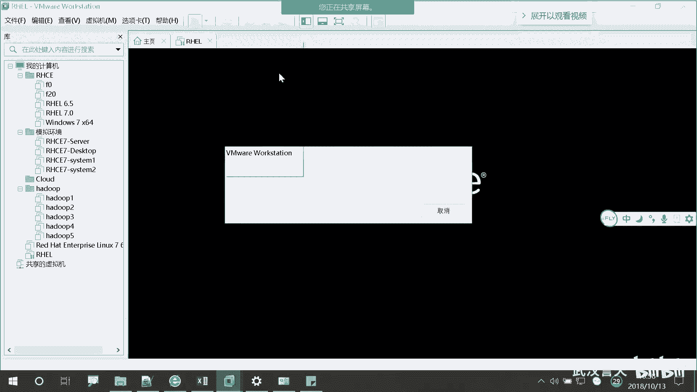
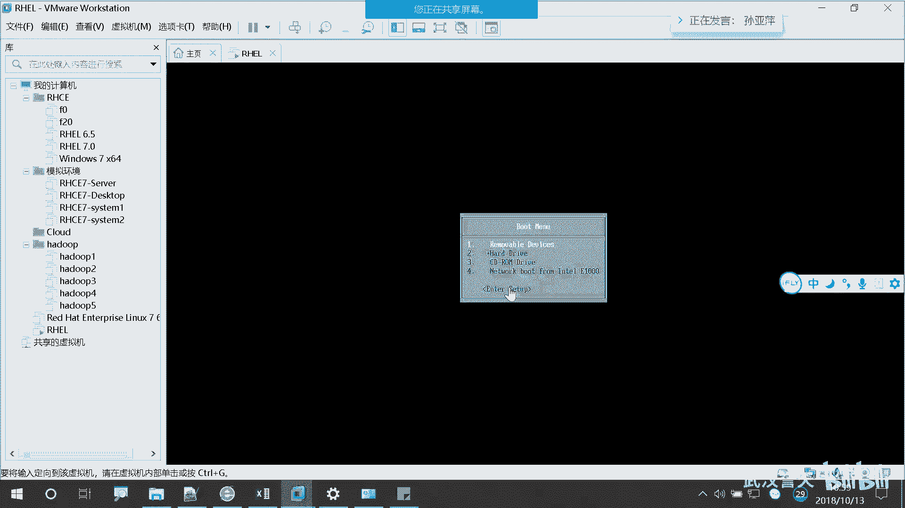
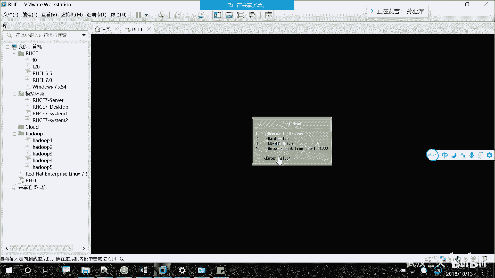
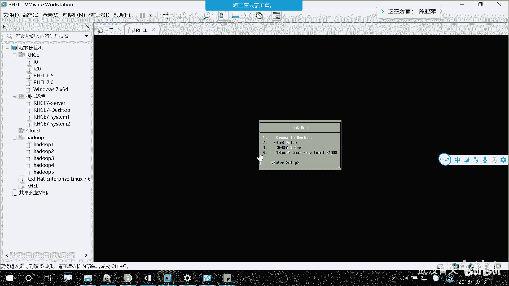
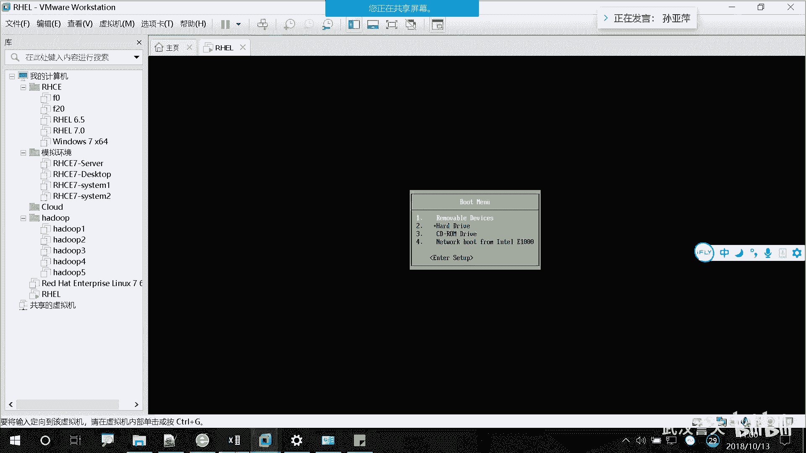

# Linux基础操作：P4：01 rhel7操作系统安装_4

## 概述
在本节课中，我们将学习如何完成虚拟机的创建，并开始安装RHEL7操作系统。我们将从配置虚拟机磁盘文件开始，然后演示如何启动物理机或虚拟机并进入安装引导界面。

---

## 配置虚拟机磁盘

上一节我们完成了虚拟机的基本设置，本节中我们来看看如何配置虚拟机的磁盘。

磁盘文件是虚拟机存储数据的核心。在配置过程中，你需要为这个文件命名。如果你在虚拟机文件夹中看到一个以 `.vmdk` 结尾的文件，这个文件就是虚拟机的磁盘文件。

以下是配置磁盘的步骤：
1.  设置磁盘大小。例如，设置为200GB或20GB均可，20GB通常也足够使用。
2.  为磁盘文件命名。
3.  点击“下一步”并“完成”配置。

完成上述步骤后，你的虚拟机就创建成功了，相当于准备好了一台“新电脑”。

---

## 启动设备并进入安装界面

虚拟机创建完成后，下一步就是启动它并开始安装操作系统。我们将分别演示在教室物理机和虚拟机上的操作。

首先，演示如何在教室的物理机上操作。操作方法是重启电脑。

以下是进入安装引导界面的通用步骤：
1.  重启你的电脑。
2.  在听到“滴”一声或看到启动画面时，立即按下特定的功能键。不同电脑的按键可能不同，常见的有 `F12`、`F5` 或 `F8`，请尝试按这些键。
3.  成功后会进入一个蓝色的界面，并停留在那个选择启动设备的画面上。界面上可能会出现类似“Pxe”或“Agent”的选项。

对于虚拟机，操作更简单：直接启动虚拟机即可。在启动瞬间（出现进度条时）可以按相应键（如 `Esc`）进入启动菜单，其效果与物理机按功能键相同。

---

## 总结
本节课中我们一起学习了RHEL7操作系统安装前的最后准备工作。我们完成了虚拟机磁盘的配置，明确了 `.vmdk` 文件的作用，并掌握了如何通过重启设备并按下特定功能键进入操作系统的安装引导界面。这是开始安装系统的关键一步。