# Linux基础操作：P5：02 RHEL7操作系统安装(续)

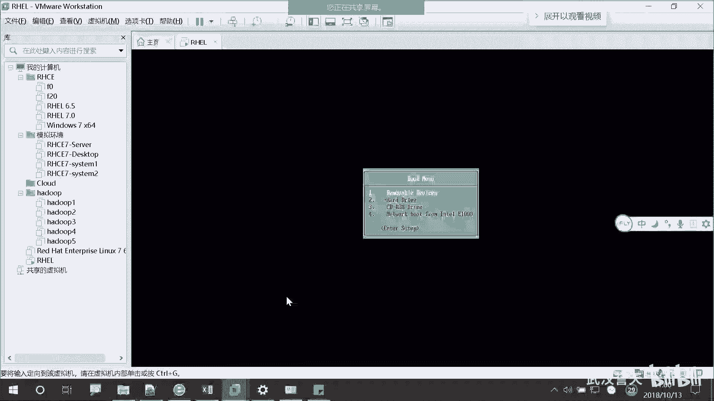

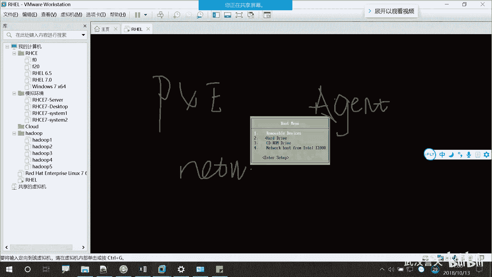

在本节课中，我们将继续学习RHEL7操作系统的安装过程，重点讲解如何从PXE网络或本地ISO镜像启动安装程序，并完成初始安装步骤的选择。

## 启动安装程序

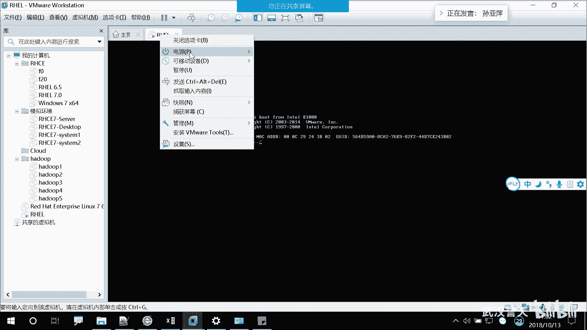

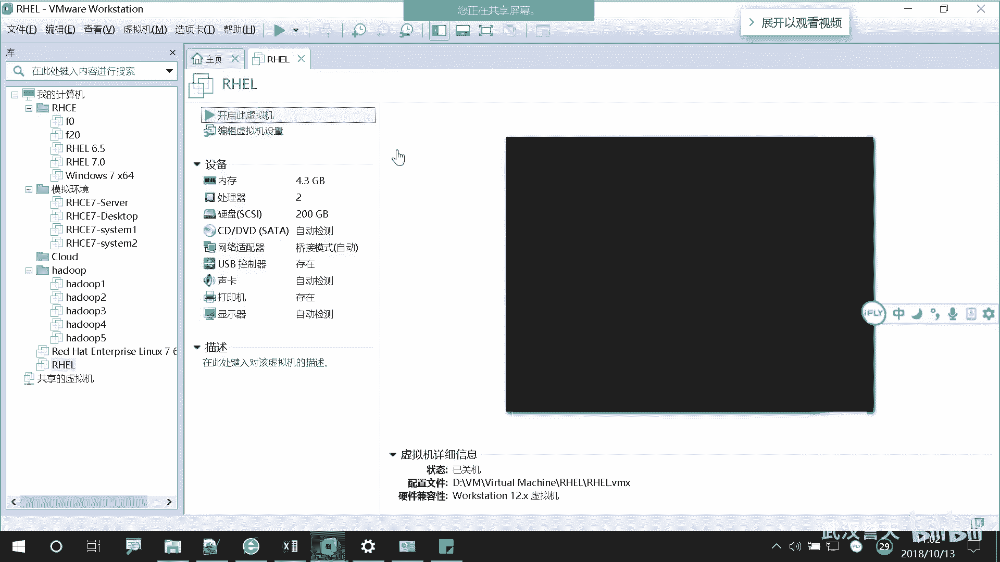

上一节我们介绍了安装前的准备工作，本节中我们来看看如何启动安装程序。

当系统启动时，你可能会看到包含“Pxe”或“agent”字样的提示信息。这通常表示系统正在尝试从网络启动。

在启动菜单界面，使用键盘上下键进行选择。第一个选项通常是 **`boot from local drive`**，即从本地硬盘启动。如果选择此项，系统将直接进入已安装好的操作系统。

我们需要选择第三个选项：**`Install Red Hat Enterprise Linux 7`**，即安装红帽企业版Linux 7。

在菜单下方，你还会看到一系列功能键选项（如F1, F2等）。这些是用于自动化部署的脚本菜单，也称为 **`kickstart`**。选择这些选项可以实现无人值守的全自动安装，但这部分内容将在后续课程中深入学习。

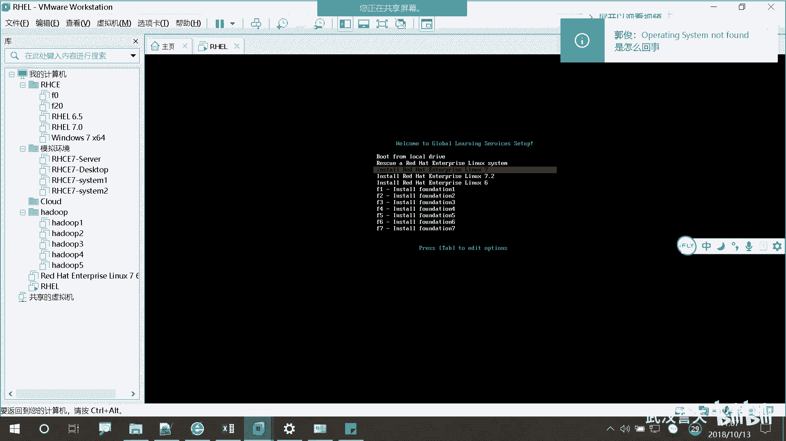

## 远程学员的安装方式

对于使用个人笔记本进行学习的远程学员，安装方式有所不同。因为你们无法使用教室的PXE网络，所以需要使用ISO镜像文件进行安装。

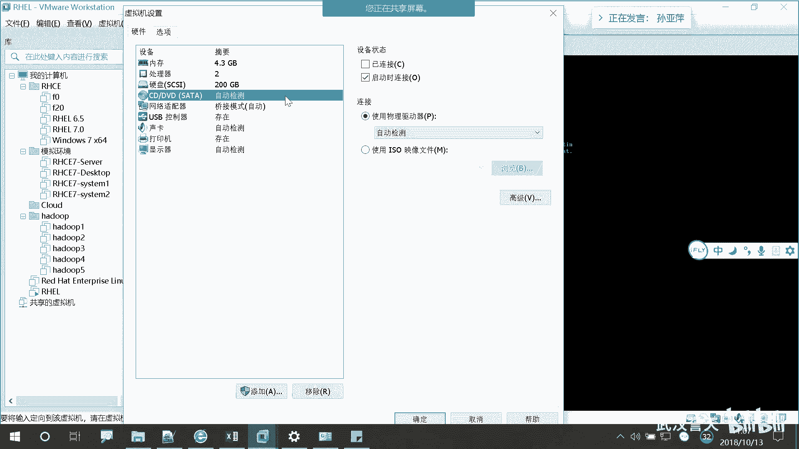

以下是配置虚拟机使用ISO镜像的步骤：

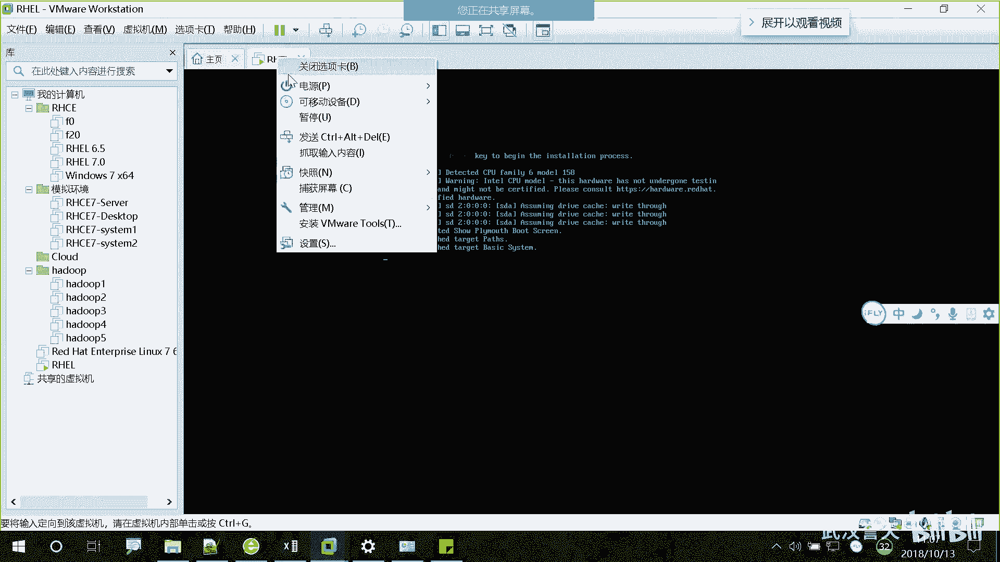

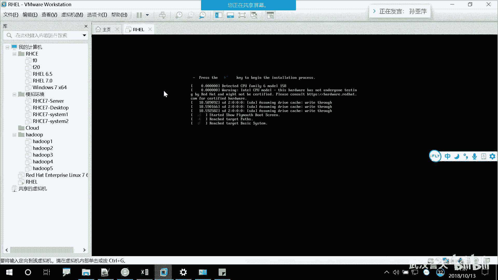

1.  在虚拟机软件（如VMware）中，右键点击你的虚拟机，选择“设置”。
2.  在设置窗口中，找到“CD/DVD”选项。
3.  在右侧，选择“使用ISO映像文件”，然后点击“浏览”按钮，找到你下载的RHEL 7.0 ISO文件位置，选择并打开它。
4.  点击“确定”保存设置。

完成上述设置后，重启虚拟机即可从ISO镜像启动。

如果遇到选项是灰色无法选择的情况，请确保虚拟机已关闭。若问题仍无法解决，可以寻求讲师帮助。为了方便远程协助，推荐使用 **`AnyDesk`** 这款远程桌面连接软件。

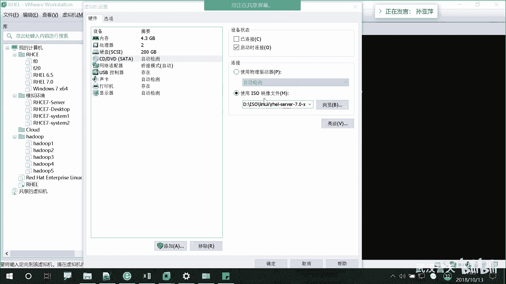

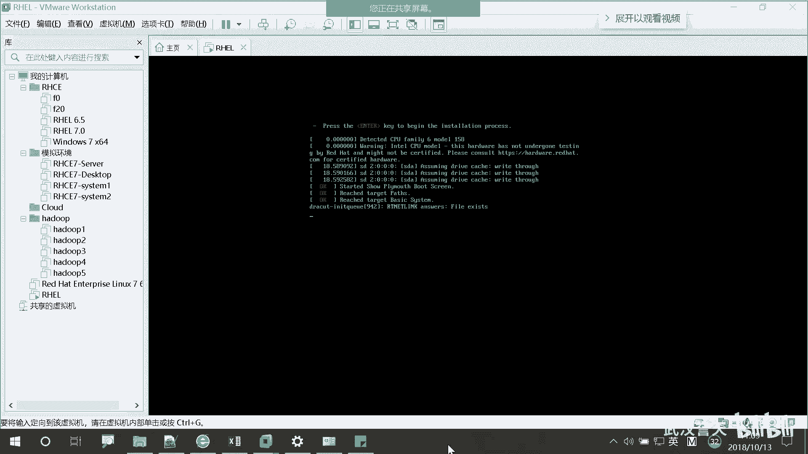

## 从光盘/ISO启动的安装菜单

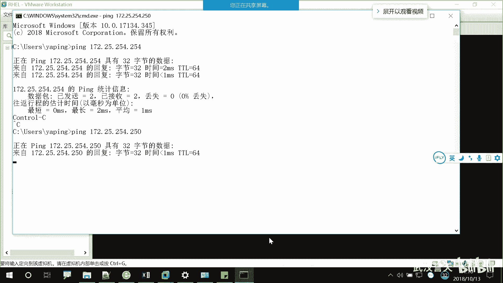

当从光盘或ISO镜像启动时，你会看到与PXE网络略有不同的启动菜单。

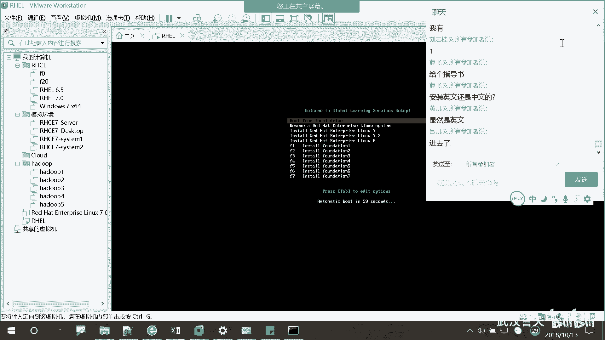

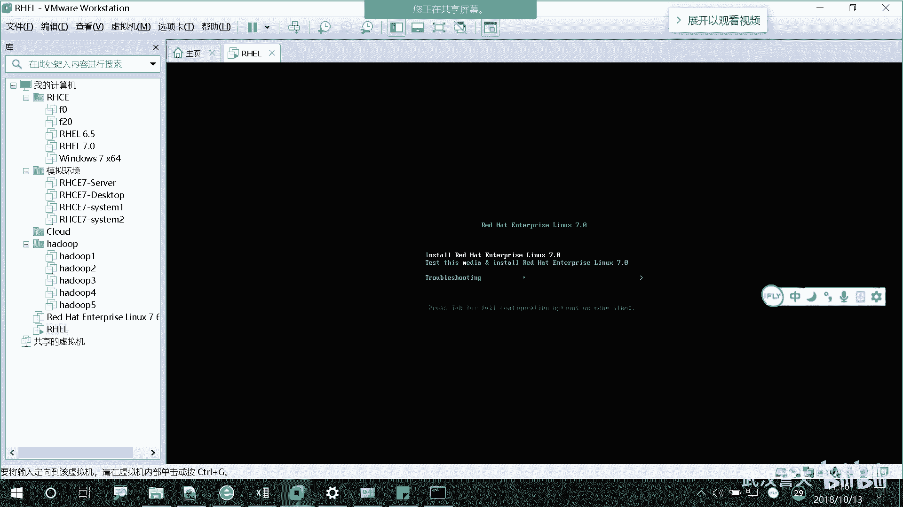

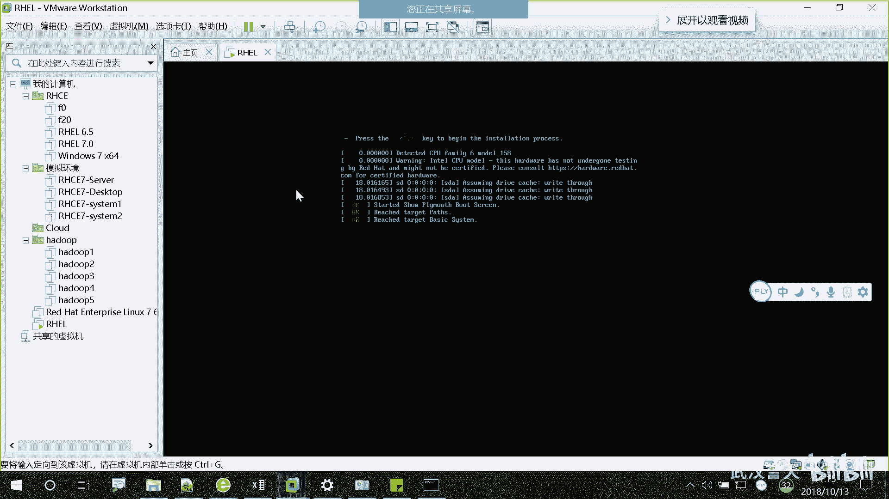

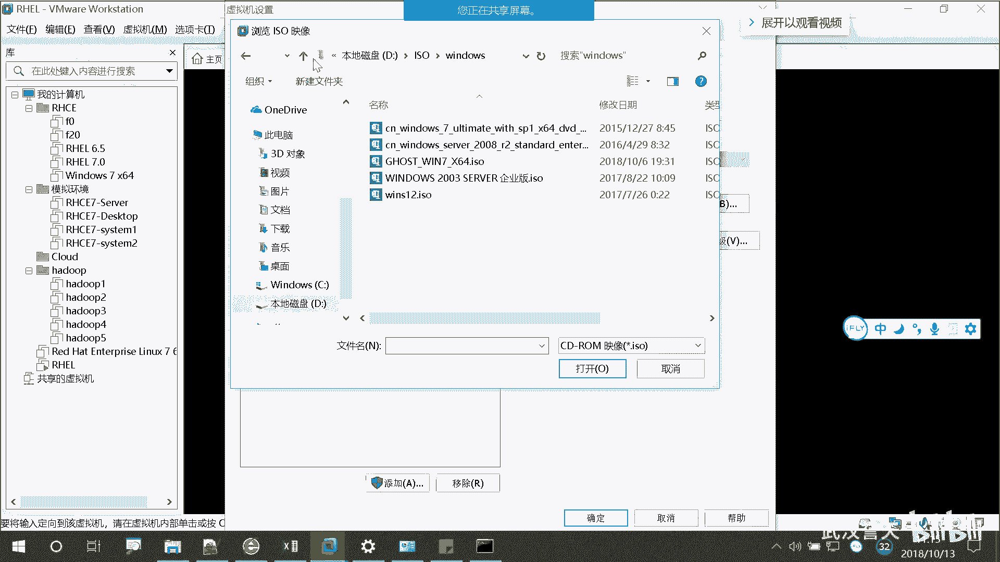

菜单通常包含以下选项：
*   **`Install Red Hat Enterprise Linux 7`**: 直接开始安装操作系统。
*   **`Test this media & install Red Hat Enterprise Linux 7`**: 先测试安装介质（即你的ISO文件）的完整性，然后再进行安装。

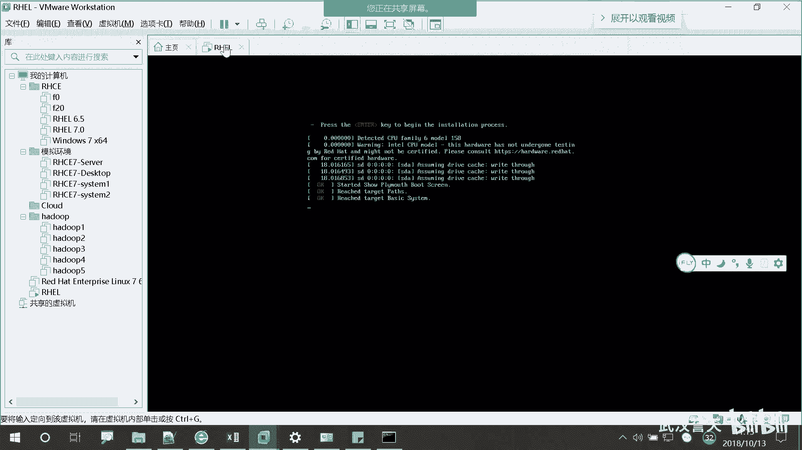

对于大多数情况，我们直接选择第一个选项 **`Install...`** 进行安装即可。选择第二个选项会额外进行介质测试，这会消耗更多时间。

---

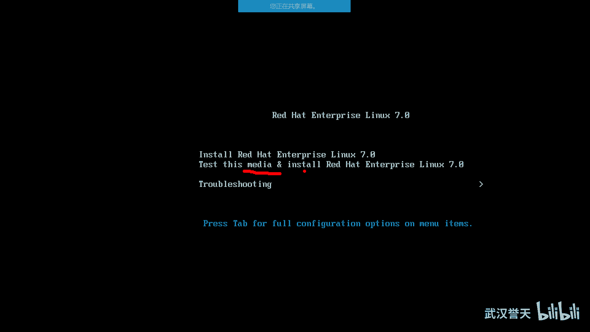

本节课中我们一起学习了如何从PXE网络或本地ISO镜像启动RHEL 7的安装程序，并正确选择了安装选项。对于远程学员，我们特别讲解了在虚拟机中配置ISO镜像的方法。掌握正确的启动方式是成功安装系统的第一步。