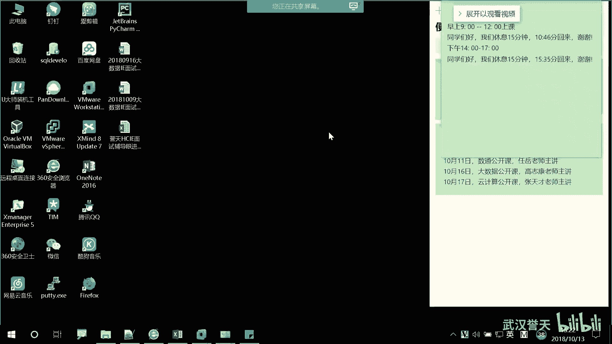

# 誉天-Linux／红帽认证／RHCE／RHEL7基础操作视频 - P10：03 Linux发展和rhel7基本操作_2 - 武汉誉天 - BV1xr4y1K7Aj

啊，就涉及到版权问题了。后来。后来呢他就哎呀就想这是什么一直找不到可以用的内核啊。那这个时候呢。哎，linux出现了。那lininux是如何出现的呢？19呃1991年的时候啊，来这个有有一个人物叫。

叫这个叫翻译过来，叫林纳斯，叫林纳斯啊，李纳斯。那他当时呢是一名学生，对，是一名学生。呃，他在学校嘛，对吧？他就拿到了一台unix操系统，对unix操系统。因为当时呢他也其实。我我没有移动啊。我我。

没有动没有动。那当时呢他其实也比较呃有点愤青，对吧？就有一点那个。然后呃就觉得哎呀unix呃用不了了呀，对吧？但是为什么他能用了？因为他可能哎当时之前有传说是吧，别人给他搞了一台，对吧？

搞了一台unix对他他呢就觉得哎我是不是也应该就是就他比较对这个比较感兴趣啊，然后他就在这个unix基础之上呢，就进行了就参考了啊参考了unix的内核，然后自己写了一个。对，自己写了一个内核。然后呢。

他觉得呢他是那比较有奉献精神啊，然后他就把这个代码公开了。放在网上对吧？公开了，那全国各地的爱好者啊，看到这个代码就觉得会特别激动，是吧？你像新的技术出来之后，呃，新的那个那个程程程序写出来之后。

那这样的话全国啊就是也不是全国全世界的啊爱好者就在这个内核之上呢进行了修改。对，进行了修改。恰好呢。我们的GNEU也看上了，他也看上了，他写的内核，而且他公布出来了，公布出来了。那他之后呢。

就跟林娜斯就他就想把这个内核呢纳入到他的组织里面。对，纳话组织用它这个内核呢，然后在这个内核上面，然后开发一些操系统的组件。啊，那么在19呃91年的时候啊。红这个linux1。0版本啊，1。

0版本就发布了。对，1。0版本就发布了。那么1。0这个版本其实是一个内核版本。内核版本，而且还是经过了很多人的一个呃修改呀、完善啊等等，最终才发布了啊，终才发布了。好。

那么我们监U组织就把这个内核拿过来用了。由于我们之前linux呢，它是参考了unix，对吧？后来我们也称它叫layunix操系统。对layunix操系统。所以呢。它跟unux有点类似，对，有点类似。

所以之前今NU组织呢在unux之上开发了一些组件，唉，可以直接移植到我们的linux上面。对，可以直接移植到我们linux上面，那就可以直接用了。经过一定修改就可以直接拿来用了。😡。

所以后来呢我们慢慢的发展啊，从最初的1。0版本，现在我们的内核版本已经升级到4。0版本了。对，4点几版本了啊，到现在为止。1991年的时候是内核版本发布啊，内核。

当然我们现在所说的linux好就你看这里啊，现在我们linux内核加上什么呀？GNU组织的一些什么一些组件。一些应用组件。共同来形成我们现在这个完整的开源的什么类unix操作系统。

所以我们现在所说的操作系统其实是包含我们的内核的对，其实是包含我们的内核的啊。然后我们他就是GNU呢也发布了一些什么准则，比如说GPR准则，GPL准则。就是这个如何去运行呢？

还是有有有一些条条框框协议的啊。啊，那么其实在后面我们在学习的过程中，会经常会遇到一些关于类就是unix里面的一些，就是像呃跟他就是呃什么。unix类unix类的一些呃组件。

就是你会经常会听到一些什么unix。大家应该知道为什么了啊，就是因为兼U组织最初的时候是在unux号系统去开发的一些，然后移植到了我们的linux上面。所以有一些呃功能呢跟unix是类似的对。

是类似的啊。好，然后我们继续啊，这是它的一个发展的过程。大知道我们可能也看过呃那个linux它的一个图那个那个上标。这个logo是个什么呀？企鹅对吧？对，是一个企鹅啊，有个传说啊。

也不是不知道是不是传说啊，传说两个传说啊。对。第一个传说呢是。对雷纳斯在那个什么动物园啊，不是不是在动物园啊，在什么被那个企鹅咬了是吧？对，网上传说是被企鹅咬了。然后呢。

他就就是国外呢喜欢就是让一些什么动物啊，作为它的那个logo。对他就就用那个什么什么企鹅就当做它的那个呃系统的logo了。但是这个好像感觉。很勉强对吧？对，然后第二个呢比较好接受一些，就是说。呃。

因为他说南极啊是属于要不企鹅呢是属于南极要讲故。企鹅是属于南极，对吧？还是说南极呢不属于任何一个国家，对，不属于任何一个国家。那么它其实倡导的自由呢就是linux呢不属于任何一个人或任何一个组织。

它是大家的。对，他是大家的，所以他就用企鹅来当做它的logo，对，这个比较好接受一些，对吧？对，一种思想啊。而且呢这个人呢呃现在嗯。呃，也比较年轻啊，他当时你看91年还是个研究生，估计现在没有多大。

对吧？也还还。呃，现在呢他也从事了一些就是有关我们那个linux的一些内核的开发工作。对，也也也有去参与这些工作啊。所以到现在为止，其实他是他的创始人。到现在为止呢。

我们这个linux find到现在其实。圆远跟最初的那个版本已经呃呃很不一样了啊不一样了。好。下面呢我们来介绍一下我们鸿茂的一些发行版啊，那我们要学的呢是鸿贸企业版的那个对吧？

那我们要了解一下鸿茂这个公司，对鸿帽这个公司。那鸿茂呢呃它是一些做什么呀，做软件的对，做纯软件开发的对纯软件开发。所以它不涉及到一些硬件。对，不涉及到一些硬件绑定。

那它就可以在各种插八六服务器上一些兼容机上面开始跑，对吧？所以这样就是呃比较应用比较广泛啊啊，那么这个是我们红猫的一些发行班啊，红猫到目前为止有3个发行班，对，上面只列了两个这个PPT比较老了啊。

然我给大家介绍一下啊。那么我们红帽呢我们不说了吗？你拿到源代码对吧？拿到内核，那你可以在上面进行二次开发呀。那红帽就是一家公司，它在这个内核之上呢进行二次开发，然后形成了自己的一个呃就是在发布出来。

形成了自己的版本。那么在早些时候呢，它有两个版本，一个版本呢叫鸿贸entterpriselinuxlinux，叫红贸企业版linux。我冒齐了办0是。

大家之前就是呃为什么服务器上跑lininux呢也是有原因的啊，因为它比较稳定。对，比较稳定，稳定到什么程度呢？就是我们windows啊，如果做服务器的话。他需要可能隔一段时间是不是要重启一下呀，对吧？

要不然这这这这这就是特别卡了啊，特别卡。那么可能几个月呀就要重启。那linux呢它很稳定，它可能几年都一直在跑，没有重启，对吧？它可能你可能会看到啊。

好多服务器上面跑的那个linkux跑了几好几年都没有重启，对，还还是很很很顺畅。对，还是性能很好。那么它比较稳定啊，那企业要什么？稳定嘛，对吧？三天老两头出故障，三就两头出bug。

那你的业务就不要停了嘛？所以说一定要稳定啊，所以这个版本呢专门是为我们的企业的一些呃服务器上面去定制的啊，定制的一个版本。所以叫企业版嘛，entterprise叫企业版。嗯，然后呢。

这个版本呢是呃这个版本啊，如果你购买它的服务。会有售后支持，是会有售后支持的啊。你购买韩服出问题了，你可以去找红帽的售后，这都是可以的啊。这是有官方支持的。好，下面会有一个版本叫fdora。对。

叫findo projects。这个返多尔的项目呢？😡，它是一个偏向于什么呢？偏向于桌面版的对，偏向于桌面桌面版的操系统。我们鸿贸企业版它虽然也有桌面，对吧？但是它的桌面大家可以看一下啊。

其实看起来呢呃。有点光秃秃，什么都没有，对吧？对它就是一个最基本的桌面，它是面向于什么呀？面向于就是企业服务器上面跑的，我不需要那么炫酷，对吧？不需要很多功能。也，不需要很多功能。

但是斐dora呢它是面向桌面的啊，面向桌面的它的它的那个桌面的一些功能就是比较新，而且呃功能比较多，比较全这样子啊，然后呢。他有什么呢？他一个最大的特点是。它上面跑的一些应用很新很多，为什么呢？呃。

如果大家想了解鸿猫企业版将来呢它下面会有哪些新的特性，你可以去下载一个fdora去玩一下，对吧？看这个上面有什么功能，对，为什么呢？因为我们很多啊你不是都是红猫的吗？他如果说开发了一个新的功能。

他首先会放在这个fdora上面。对，首先会放在这个斐多尔上面进行跑。然后放在这个上面之后呢，他就给到别人去用，就放到社区里面，你们可以自行去下载，去使用。然后如果你使用出现问题了。

那你可以怎么样可以提交问题吗？他是由社区维护的啊，不是由官方提，不是由官方就是。呃，维护的。也就是说你用它如果出现问题了，官方负责吗？不负责对吧？对，不负责。那你如果说现出现问题了怎么办呢？

那你去社交去呃社社区去提交问题，对，去社区去提交问题。那你如果运气好，对吧？别人可以帮你回答，如果运气不好，可能。就就就没人理你，对吧？当然呢官方也会提也会去收集这些，就bug呀，那么有什么各种问题呀。

还有会收集啊，然后呢一次一次的更新迭代这样子。那直到这个功能呢呃比较稳定了。对，这个功能比较使用起来比较稳定了。那么他就把这个呃这个啊放到我们的猫企业版里面。对，才敢放上去吧，对吧？你才敢放去才敢用嘛。

对吧？稳定了啊才会放上去。所以这个是斐多尔，这个啊，它是由社区维护的啊。你看no official，这个是官方的意思。是官方的啊，官方不支持，它是由社区维护的。那么我们还有一个版本啊。

还有一个版本叫什么呢？叫。😡，Since was。呃，去学校去上课的时候啊，呃绝大多数学校用的都是这个版本。对，这个版本现在是属于红帽的。那最初的时候这个版本呢是不呃，它是不属于红猫，对吧？

是后来红猫收购了啊，那为什么收购呢？是这样的啊。呃，这个深度S小组呢。他呢呃就是红帽啊，不是发行了红帽企业版嘛，对吧？那么这两个版本用的内核是一样的对，内核是一样的。

而且sOS小组呢承诺就是说你每更新一个版本，或者是你每更新一个补丁。等等啊，你打一个漏什么漏漏漏洞啊等等这些。😡，我都可以在很短的时间比如24小时啊，多少时间内啊就会出来。对你有更新，我就有更新。

你你你更新版本了，我也更新版，你打不定，我也打不停。😡，他可以做到这种程度啊。那那这样的话，你想。他呢还有一个优点啊，还有一个优点是什么呢？它不涉及到服务。😡，呃，你随便用对吧？随便用嗯。

你不用购买我的服务。那这样的话啊，那如果那不购买服务的话，那我怎么用啊？呃，我我出现问题了怎么办呢？😡，对，如果很多公司啊，他其实跑的很多就sOS，那怎么办呢？这个时候就我们就派上用途了，对吧？对。

我们学来干什么呀？我们做来我们用来做运维嘛？一般一些呃稍微大一点的公司啊，他自己内部是不是都有一些运维团队呀，对吧？你自己公司出现问题了，那我培养一群运维人员来帮我做维护啊，来帮我做维护。

反正他有的补丁，我都有嘛，我就更新打补平就可以了呀，对吧？好，那这样的话。那好多人都不用这个了呀。😡，对吧那那其实红猫其实也比较后怕，说哎呀，那这样子没办法控制你了，就感觉心里还没有安全感啊。

那后来呢他就去找他们，对吧？就说哎呀，能不能去把钱把它收了，对吧？钱把它收了。对，后来他就好像是呃是是有有股份吧，还是说后来直接把它收购了。对，收购之后呢，它就属于红帽了。

之前呢它其实跟它还是有一点点区别，像logo什么之类的，好像是有点点区别，现在基本上没有区别。但是好像logo还是有点不一样的啊。那sOS呢。呃，收购完之后呃收购回来之后呢。

它还是保持它原来是什么样就是什么样，就是原来我红帽更新一个版本，红帽企业版更新一个版本，你也就更新一版也可以，就是还是那个小组维护的嘛，对吧？就是我不动你，但是你属于我了，我心里是不是就有底了，对吧？

对，心里有底了啊，所以到目前为止呢，我们红帽呢就有三个版本，一个是红帽企业版，对红帽企业版的那个还有一个fdora，另外一个还一个叫sdo。其实呢我们。嗯，这上面其他公司的没有写啊，但是要跟他说一下啊。

嗯，我们还有很多版本。呃，比较出名的，大家应该也都接触过。当然有学型就算IE的对吧？你学过运计算底层他跑的是什么呀？😡，删除。5水吧。嗯，是我哦你说的是那个我说是那个华为的对。

之前有一学华为的那个云计算底层跑的是什么呀？出水。给苏uszy苏zy它是另外一家公司的一个版本啊，它叫诺标奥。对诺贝尔公司其诺贝尔公司早早期的时候还是比较厉害的啊。他厉害在哪呢？还有一个no贝亚网络。

对，但是现在好像被被干掉了，对吧？对，后来现在不是什么网络啊，什么呃IP网络什么就这些网络啊。好，那么后来呢？呃，大家可能没有进过公司，但是一定知道苏uszy，因为他后来就收购了我们的suszy。

对他做的最明智的一些事把苏usy也收购了。那苏ay呢是用来做什么呢？它主要是啊它是商业化版本中呃比较成功的一个对做商业化的。很多像云呃像我之前举的例子，就是我们云计算底层的啊。

底层做虚拟化的那一层其实用的就是我们的susy对苏usy它就是我们它也是我们linux的一种发行版。只不过它是商业版的啊，商业版要收费。对，你用我就要收费，你用我就要收费的啊。

其实还有很多像呃大家举个例子啊，就是班图，大家应该也。接触过对吧？呃有工作同学有接触过啊，无班图给大家看一下啊，让家搜一下。嗯。这个啊。乌班图呢它其实你看这地方就是乌班图的官方网站。然后它有中文的。

你看他他说亲知到很多中文官方网站啊，你可以打开看一下。这个呢其实它也是面向桌面的对它是面向桌面的。

他有他可以做什么呢？呃，他可以做一些呃多媒体。对，像一些什么呃媒体制作呀，一些什么主题呀等等这些啊。大家可以看一下啊，这个网站你们可以去游览一下，这个在哪里看你看它这个桌面啊做的其实。

他这个桌面做的呃。

甚至有时候有的他们桌面做的比windows还炫一些。你们可以下载下来去看一下，而且它有那个ISO在这里面大家可以去下啊，它在哪里下，我看。

你要下载无班图这。就是那个。可以打开啊，这都是英文的。说好的中文呢对吧？哦，这里有它的镜像啊，你们可以自己去下载，对，去安装。对，下载安装是无斑图的。还有很多啊。

还有很多大家如果说要去下载一些镜像在哪里下呀？😡，Yeah。有很多网站有一些像国内一些互联网公司，它有一些呃进那个那镜像网站，对吧？大家可以去下啊，有一个叫叫什么？阿里云。对，阿里云啊。

还有一个镜像网站。你看上面有很多操系统，有snoOS，但这个好像里面没有s斗OS也有官方网站，你们可以找到官方网站啊。s斗OS，然后还有其他很多版本。看这里啊，乌班图也有，对吧？百dora是不是也有。

嗯。还有一些其他的什么open苏，也是苏的一个版本。还有很多啊呃好像像卡里，卡利也是一个linux。也是linux一个版本，这个卡里呢。他主要是做什么呢？偏向与安全。对，偏向于安全啊。

做安全方面的就是它集成了很多安全的软件。对，安全的软件就是不同的版本，可能面向的那个呃应用场景是不一样的。所以大家可以了解一下啊。所以这里有很多版本大家可以去下，而且还有一些呃很多像搜狐啊什么。

网易也有，对吧？那网易也有开源的镜像站点。你要学会去下啊。去搜一些网站，大家可以记一下一些网站，mimis6163，还有一些。我看一下啊嗯还有一个。这叫什么来着？呃，中国科技大学也有。对，你看。

这都是有的啊，sOS。你看啊。我们s动OS版本啊，生动OS现在是你看呃一呃这是几版本，234链接可以可以。振动OS的版本现在最呃最高是7。5，我们那个红猫的企红猫企业版最新应该是也是7。5，现在有7。

6嘛。呃，7。57。6这样子啊，所以他只他这个跟跟我们宏贸企业版。呃，几乎是一模一样的对，几乎是一模一样的。所以你也可以去下载这个去使用啊。你看这里啊。这里点进来就点进来啊。

这有个ISOS对ISOS点进去。对，超了6幅器哦，这里有很多啊，你看ISO镜像。对，everything呢。啊minim最小化的对吧？那都有啊，你们可以去自由下载啊。这个网站给大家发群里啊。呃。

阿里的这个镜像。

有王毅的。都可以去下啊。就是他们一般互联网是搞几台那个呃什么服务器啊，专门放这个镜像的。因为如果镜像这些一般都是国外的国外的网站，他把它收集过来，然后放在他这个里面。让你们供我们国内去下载啊。

而且他还有一些呃圆的安装员呀什么之类的。哦，这是一些镜像啊。哎呀，我者PPP去哪了？啊，还有这样啊，还有一个地方是一个我们内核的对内核的网站叫K点ORG。这个啊在这个里面。😡。

这个里面啊所下载到的就是可以下载它的源代码，是可以下载到内核的源代码的啊。其实他们很多公司都是从这个网站里面，就是内核都是基于这个网站里面的。你们可以自由去下载啊。

这个这个啊cal点ORGublic点一下这个。那有个linux看到吗？对，linux点进去。然后这个有 kernelnal kernelnals内核， kernelnal是内核的意思啊。继据。

看一下我们现在内核的版本啊，从最初的1。0版本看到了吗？1。0版本，然后后面。后面1。02。0，然后3。0对吧？到最新的是4。0，这里56还没有出来啊，这空着，要把先把文件夹做好，对吧？这个最新的是4。

0版本啊，4。0，而且我们的内核呃它一般是很小的啊。你看比如说现在我们的这个这是补丁啊，这都是补丁patch patchch补丁啊。呃，我们的内核在哪里呢？在这里啊，看这里。对，踏点GZ的个我那个包。

你可以下载下来，上面都是它的源代码，都是它的源代码。而且现在到4。呃4。0版本，对吧？4点几版本它有多大呢？它呃很小，大概是呃100兆左。对，100兆左右内核是很小的啊。其实在最早的时候，1。

0版本内核估计才有几兆。对，几兆到现在其实已经很大了，对吧？那我们1个ISO里面哇好呃几个G，对吧？里面都是集成了一些软件包，以及一些操系统的一些其他的那个功能。对操系统的里面一些组件。对。

其实内核真正的它的呃它的那个那个那个呃是很小的啊是很小的，你看就很小嘛，100兆左右。对，如果大家想学习它的源代码，也可以去这里面去下载啊。哦，这个地方好像呃没有那个是吧，没有红猫的HEL对。

那个是没有的。但是你需要去它的官方下载。啊，官方是有的，但是官方。好像要要要那个要要付费的。注册跟注册。那个账号好像先要充会员什么等一下。麻烦。大家想要的话，可以在我这里去要啊，我这里有。哦，然后嗯。

继续啊这几个版本大家应该知道了吧。大家可以去这些网站去下啊。我刚刚发错了什么呀？啊哦，这不是群是吧？好，这样我们大家休息一下啊，休息一会儿。

休息15分钟。

不是。

感天转下来其实强度还是蛮高的，你们要。坚持是。

那你俩困的哟，我眼睛都快睁不开了。

同于。

啊。😮，认呀。

你是不能。

嗯。

Yeah。关你。不问。不是。不要8回讲。嗯。我。Thank you。最后可以思么。等会儿吧。啊。😮，等你。那看我。哦，不需要了。

啊，我们回来了啊，远程同学我们回来了啊。😊，嗯。袁天同学回来了回来了。好，大家远程同学都很听话啊，都换了嗯。心音都换了是吧？啊，这样看着多舒服啊，这样。啊嗯，是这样的啊，我感觉大家好像容易犯困是吧？啊。

大家觉得我是中午不不是那个我看是3个小时，对吧？中午是休息一次，还是说我们分开两次休息？就是你们看哪种比较好一些？分开两次的话，就像差不多上快一个小时，我们就休息呃休息10分钟。

然后再上一个小时休息10分钟这样子。还是说我们就上呃。一个小时多，然后就。对我怕大家扛不住啊。就我我讲课大把家讲睡着了。但是我我我本来是想下去看看你们，但是我一走开那个原声同业就听不到我说话了。😡，啊。

😮，么。带个那个是吧，带个蓝耳机。😊，那你们申请一下看看。给给给班主任申请一下，看公司能不能给配一个。啊，因为后面呢我们上课基本上就是边讲边敲了，边讲边那个那敲实验。对，所以站起来的机会也不多。好。

我们继续上课啊。嗯，我们刚刚呢讲了一下我们的那个。呃，发行版啊。另外的话我说一点啊，如果我上课好像答应给大家发什么资料，我如果下课忘了，大家可以提醒我一下啊。年纪大了，记性不好。还很年轻。好。嗯。

那下面呢是一个linux的一些基本的原，这个准呃pris原则准则吧，可以说是啊。然后呃第一个。everything is file就是么一切皆文件，对，一切接文件。然后什么呢？包括硬件。对。

hardware就是硬件的意思。dotware是软件嘛，对吧？hardware是硬件啊，那一切接文件包括我们的硬件。也就是说我们linux当中啊，磁盘文件还有什么什么一些其他的硬件设施啊。

它也是以什么呀？以文件的形式存在的对，因为它原则就是一切接文件对，一切接文件。那难道windows不是一切接文件吗？不一定吧，对吧？不一定一切都是文件啊。😡。

那就比如说啊你的比如你修改你的网卡信息的时候。那你在你那个地方去修改的时候啊，那你就一定能保证说你的修改的信息是保存在一个文件里面吧。你可能根本找不到它保存在哪个位置，对吧？对，他说不一定啊不一定。

而且我们系统当中windows里面有一个注册表，大家应该呃也也接触过啊，接触过一那注册表。但是那注册表也不一定是文件吧，对吧？你也不知道它存在哪个位置。对它也不一定是文件啊。

但是我们linux当中呢一切接文件，你的所有的配置信息都保保存在我们的文件里面。对，叫一切接文件啊。那你对这个文件进行操作。比如说啊你对这个磁盘进行操作，那就是对一个文件进行操作。对，就这个意思啊。啊。

然后第二个呢是我们的什么small single pose，什么小而什么功能单一的应用程序。对我们links当中呢呃都是小而功能单一的应用程序。什么叫小而功能单一呢？呃。举个反例啊，大家用过QQ。

特别是QQ啊。对它很典型的一个例子。早些时候我们QQ一般是用来干什么呀？聊天对吧？对，聊天呢就发个信息什么的对，但是现在的QQ已经不仅仅局限于我们的聊天了。对，还可以呃。对，各种功能。

对你只有你什么想不到的，没有他做不到的对吧？对，什么邮箱啊，一些什么很多也用用邮箱啊呃那个什么。反正就各种嘛，然后支付宝也各种功能特别强大，对吧？它功能大而全，但是它呢。呃。

比如说啊它有一个那个什么QQ共享，有屏幕共享，或者是你可以远程控制那个那个功能，对吧？它那个功能啊，我用了一下。为什么要给大家发那个T6的呢？😡，因为其没有啊，你两个你可以对比用一下那个QQ那个远程。

你连接过去之后，你几乎哦点都点不了，大家可以体验过，对吧？去连别人的时候，那个非常卡，而且移动的鼠标的速度非常慢。对他做的就不太好，那就没有说就没有我们 team没有专门做这种远程连接的这种软件做的好。

对吧？对它功能比较单一，但是它性能很好对，性能很好。那么我们linux当中呢都是一些什么呀？小，而且功能单一的应用程序。比如说啊。我看对看就是一个应用程序。那这个应用程序呢。

它就只能看对它干不了别的事情了，那就只能看那各种看对吧？对，各种看啊，给大家举个例子啊。

啊，比如说我们有一个命令叫LS，那么这个命令呢是用来看的啊，用来看的那我可以各种看的对吧？这样子看对，这样子看都可以看，那他只能有看只能有看这个功能，它没有其他的功能了。对，没有其他的功能了。

那我要实现一个比较什么呀？比较呃复杂的应用应用，就是你运行一个复杂的应用程序呃，就是完成一个复杂的任务的时候，那不仅仅说你条一个应用程序可能完成不了，对吧？

那你这个时候可能用什么多个多个应用程序结合在一起啊，结合在一起，所以它都是有一些什么呃小而精巧的应用程序组成的那要完成复杂的任务呢，你把它结合起来，放在一起可以了。对，放在一起对命令嘛，对吧？

放在一起来执行啊。好。所以你看这个啊你要想去运行一些复杂的任务，那只有把这些信用程序放在一起。至于怎么结合，我们后面会说啊，我们后面会慢慢学啊。呃避免呃开什么什么captiveuser。

什么interface啊，这个不太清楚了，这个具体是什么啊。然后这下面这个啊。呃，下面这个是配置的数据保存在文本test文本当中。其实这个跟第一个有点类似，因为一切接文件嘛。

那么我们所有的配置的数据配置啊，配置的数据都放在呃文本文件当中，对，那么这个文本文件是不是就可以直接去编辑它了呀，对吧？所以你可以直接编辑文本来修改配置，对，编辑文本来修改配。

那就好比说你你在这上面是不是创建一个文本文档，那你修改这个文文本文档呢，就修改配置。但是windows里面这样，对吧？windows里面你修改的并不是不一定是文件吧，对吧？不一定是文件啊。

啊，这是我们第一章的内容啊，第一章呢就大概给大家介绍一下发展的历史啊、理念哪等等这些内容啊，我们下面开始第二章的内容啊，第二章内容呃，今天第一章第二章，明天呢第三章第四章内容。对。

第四章第五章看估计上不到啊，明天我们把第三章第四章内容上，其实这个呃上课的强度还是比较大的。所以大家打起精神来啊，你们看怎么解决啊，让自己能够精神起来。啊。呃，讲笑话好像我也不太会讲笑话。

们谁有那个那个笑话可以讲一下啊。