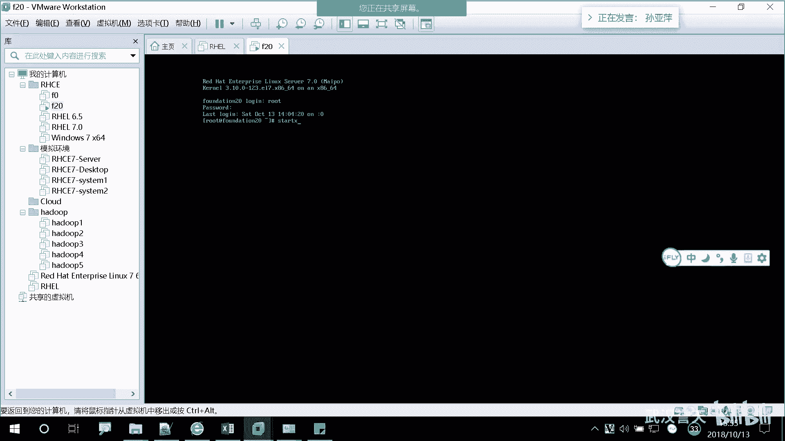

# 誉天-Linux／红帽认证／RHCE／RHEL7基础操作视频 - P11：03 Linux发展和rhel7基本操作_3 - 武汉誉天 - BV1xr4y1K7Aj

对。好，第二张呢。多做笔记。对。大家你光坐在这看马上就睡着了，但是你要不停的写，对，要思考，睡着，对吧？睡着啊，多记一下笔记啊。啊，然后我们第二章内容呢是我们linkux的一些基本的用法啊。

怎么去使用这个给你了，你怎么去用啊，还是一回事不会用啊啊。

那么。😡，我们第二章就来学习啊。那第二章呢我们主要学哪些内容呢？第一个是如何去登录我们的操系统。如何去登录跟一个超系统，如何去登录它呀。对，然后如有几种方式去登录啊等等啊。啊，这个是控制台的意思。对。

如何去start X在一个控制台里面start X。对，这个是呃呃呃就是。啊，待会儿来说啊，没办法跟他解释啊啊，另外就是访问我们的命令呃，from X。其实大家可以把这个X理解是什么呀？无行见面的意思。

对图形界面。X它是其实是一个底层的信息框架叫X window。其实它是什么X呃RO什么11那个那个那个那个底层的一个软件来实现的对，所以叫X嘛。X你就可以把它当成是一个图形界面，对。

就可以当成图形界面啊。所以他的意思就是说，如何在同一界面里面是不是进入到什么？😡，命令行吧，对吧？command line就是命令行啊，如何从X进入到命令行。然后第四个呢是我们如何去修改密码，对。

如何去给我们修改密码。第五个是如何去了了解一下我们root的基本的一个呃有哪些权限啊，它的本质是什么样子的。以及如何去提升自己的权限。普通用户很多没有权限，对吧？

那我我我想要去实现就有有这个权限怎么办呢？我们可以给他复全啊复全，以及我们有一些文本编辑工具或去使用。好。那如何去登录操系统呢？😡，呃，我们登录的时候啊，使用的是用户名跟密码，这个不需要多说了啊。对。

用户名跟密码。当然我们现在很多登录方式不仅仅局限于我们的用户名跟密码，对吧？那些什么生物识别技术，对，刷卡也算一种。对呃什么face ID啊或者什么指纹啊等等也可以啊。他那种的话。

其实是不是就相当于把你的用户名跟密码放在一起了呀？对吧这个用户是用户，你你你你去登录很多啊，你去比如说你微博你什么QQ微信是不是都要有用户啊？对吧那你要用户登录这个用户的时候，那一般没有用户登录不了。

对吧？登录不了。那你如何验证对验证你这个用户，你是本人呢？是不是需要密码对，需要密码啊。啊，那么我们linkux当中提供了两种登录方式，一种是我们的文本登录方式，一种是一个就是文本的啊。

基于文本的base基于文本的。然后and什么呢？graphic。就是图形的对图形的意思啊，基于文本的和基于图形的那基于图形的大家应该见过，对吧？我们之前。

你一开机，当然我们物理机好像观察不到，因为物理机设置了自动。对，设置自动登录啊。如果大家想知道如何自动登录，我可以教大家啊好。那你要想体验一下，你就可以把这个log out。对。

log out之前我已经讲过了啊，我就不多说了啊啊，然后就可以从图一界面登进登进来，就是这样子。那。样啊还有一种方式叫字符字符界面登录啊。

比如说。如果大家安装的是那个最小化安装，那你登录进来不是读音界面，而是自界面，而是这个黑黑框。对，黑光光，这里有一个一闪一闪一闪，看到吗？对，一闪一闪的光标。对，那么这个地方。

大家要认识啊，有没有不认识罗格英的？😡，啊。这个是登录的意思啊，登录这个地方后面要输入什么呀？😡。

输入用户名吧，对吧？要看啊，要看，只要上来就输入。root我用root就登录啊，然后后面是password输入密码。我就登录进来了。对，登录进来了啊，这面有个提示符，对，有个提前面有个提示符。

然后这有一闪闪人，那就登录进来了。其实这个就跟我们重新界面这样子。嗯嗯嗯。

不。啊。等会儿我再讲。这样子是不是一样的呀，对吧？这个这个界面是一样的啊，所以。😡。

这是字符界面啊这是字符界面。好。

那继续往看啊。嗯，而且我们默认是从什么啊？默认是从我们的界面登录。呃，我们学了第二章学服务，学完服务之后，大家就知道如何让它自动从字符界面登录。对，自自动从字符界面去登录啊。啊。那么。什么呢？

他说什么呀？每个用户都有一个什么呀。Home director。加目录home是加directy是目录的意思。对，目录的意思，私人的嘛。

personal私人的文件对就是每个用户都有一个加目录来存放什么呀？私人的文件对吧？来存放私人的文件啊啊，那么什么意思呢？就是。

你登录到这个界面，那你是不是入的登录登录进来的呀？那么这个桌面是不是给了你个桌面呢？那这个桌面就是属于你的加目录。其实这个很好理解，就是什么呢？我们windows就是这样子啊。

你登录进来是不是就是桌面的啊，看这里啊，这里你的C盘里面有一个目录。😡。

叫用户。对吧那么我有两呃。这个是我的用户，对吧？这是我的用户啊，里面会有一些什么呃，什么很多文件，还有什么桌面看到了吗？那有桌面的文件夹吗？其实这个跟我们linkux当中是一样的。

对，是一样的。你自动进来呢，你这边进来也是桌面啊。

就是你进来就会给你分一个桌面，对呀，就就这个意思啊，然后这桌面上放的东西是不是就你自己的东西啊，对吧？那你用另外一个用户登录进来，是不是看到的桌面是不一样的呀，对吧？看到桌面是不一样的啊。

每个用户都有自己的一个私人的节目录。对，私有的加目，专门放自己的文件。😡。

啊，然后。下面就来说到我们的刚刚的同学也看到了啊，我在字符界面跟服器界面之间进行切换了，对吧？那是如何在我们的ver？他又他叫字符界面，又叫什么呢？呃，控制台。对它又叫控制台，然后它是switch。

就是切换的意思。但是在视统里面叫switch，叫什么？对，交换机。这个是虚拟控制台啊，虚拟控制台和图形图形界面。对图形控制台。那我们link当中呢自带了有几个呢？呃，有有有5个。

虚拟控制台有一个图形界面，对，有一个图形控制台，那它是如何分布的呢？比如说啊我这样很细呃，它是如何分布的啊，是这样子的啊。比如说这是一个呃国际上的啊，不是物理上的。第一个是什么呀？是图形图形控制台，对。

是图形控制台。后面呢会有几个呢？会有12123455个虚拟控制台，而且每个控制台呢。之间是相互独立的对，是相互独立的。那么他们之间如何进行切换呢？这个是controrl al加F1。

对F1conttrol al加F1。而且我们默认登录进来的时候，是不是登录就是第一个同一工台呀？😡，对吧那你要想切换到第二个字符界面，怎么切换呢？😡，后面是ctrol alt加。F2。

对你要想切换到第二个控制台，能给点反应呢。不知道是吧。啊。通便的啊是controlalt加F1F2F3F4F5F1。所以你要想在第一个空制台跟第二个空台进行切换，是不是按ctrlal叫F2就可以了呀。

那我刚刚就是按着ctrlalt加F2，那我就进入到第二个字符界面了。那你要摁卡。对，那你要按crl2的加FSF3呢，就进入到第三个。对，就进入到第三个了啊。好。那默认是进入的第一个啊图形界面。

它这个啊这个PPT上面呢，它是这种老版本，就是红猫五是这样子。红猫5是1到6是虚拟控制台，第七个是。嗯呃呃呃那图形界面展示图形控制台。还有红猫七跟红猫呃，之前的版本不一样啊，记住只有6个啊，只有6个。

一个加5个嗯，一个加5个，大家可以试一下啊。好。那么呃。这地方啊那如何从我们的我们虚拟控制台啊，比如这里我刚刚进入到一个虚拟控制台。😡。

这个对吧？那我们可以从虚拟控制台可以开启图形界面。对，开启图形界面啊，你可以执行一个命令。叫star的X。这是我们学的第一个命令啊，叫start x对，star X你在这个里面敲star X回车。

大X啊。

好，那这边我是不是就进入到一个图形界面呀？对吧所以你如何从你的字符界面进入上图形页面呃执行star X就可以了。对，star X。但是前提是什么呀？你必须在安装的时候啊。

选择什么呀sver with GUI。就像选图形界面才能打得开啊。如果你装的是最小化安装，你搭X的没用啊，开不起来。因为你底层本来就没有图形化这个么底层的协议框架，大家可以看到啊，这个star。

大家可以猜一下啊。叫syle，为什么叫starud X啊？😡，啊。X是什么呀？😡，我刚刚有有说过。对，X就是X window的意思啊。X window。X window是底层的一个协议框架。

也就是说在这个X window之上，你必须底层要有这个协议框架，有这个框架，你上面是不是才能运行一些图形界面呢？一些图形的工具。对，其实我们桌面就是一种图形工具。对，桌面就是一种图形工具啊。

所以是开启X window啊，开启X window。那这样的话你才能运行啊，才能运行图形界面。那如果说唉老师我之前没有装那个图形界面，对吧？没有我选的是最小化安装，那我后面就不能运行了吗？也可以啊。

只要你把这个包。对，装了，而且再装一个什么呀？再装一个。桌面工具。对，几or装一个桌面工具，你就可以运行重新界面了。对，这是我们第二本书的学啊。第二本书安装软件包的时候对，安装软件包的时候。

当然你第一本书，你现在如果装错了，你装啊。好。这是这个s的X的意思啊。X。😡，另外呢我们这个叫刚刚说的叫gor，对吧？

GNOME对GNOME那其实呢我们这个工具这个桌面工具啊呃我们那个什么鸿贸企业版用的是这个工具。对，红猫企业版用的是这个工具，但是像苏usy好像还是呃苏i用的是另外一个版本叫KDE。对，它叫KDE。

当然呢我们。我们这个鸿贸企业版linkux里面也会自带了ABE的包。对，也会自带了KTE包。所以之后你学会了安装软件包呢，你可以把这个包装一下。对，把这个包装一下，那你就可以用这个呃桌面工具了。

但是我们默认HEL呢用的是gn啊，用的是gome这个工具啊，图形工具。所以下面我们要学的是在gn图形工具上面，我们可以执行的一些快捷键。对，可以执行的一些快捷键啊，方便我们快速的操作啊。啊。

那么所以这个是groome终端嘛，对吧？gn所提供的工具啊，那我们如何去在我们的图形界面上面去运行命令呢？对我们之前说了，在右键对吧？打开在终端中打开就打开了一个什么呀？打开了一个命令行。对。

打开了一个命令行啊。那么它有一些快捷键啊，比如说啊它可以什么呀，conttrorl shift加T可以创建一个newtable table就是标签的意思。tableables标签。好，那么怎么创建呢？

什么叫标签呢？标签呃这就叫标签。

对，这就要标签。那其实如果啊你在这地方运行，对吧？有可能你这个地方运行了一个命令，一直在运行，对吧？这个程序一直在运行，那是不是把这个命令行给占住了呀，对吧？占用了，那我又想去执行其他的命令。

对我又想去执行其他的命令怎么办呢？😡，对我是不是哎再开一个嘛？对吧。对右键再打开一个对右键再打开一个，然后再不行，再打开一个嘛，这个是没有数量限制的啊。但是这样是不是很乱呢？对吧桌面上到处都是。

那怎么办呢？我们可以摁着control shift加T，control shift加T。开启一个标签，对，开启一个标签页，contl shift加T。

contl shift加体contl shift加体。对。这是标签页嘛。而且我们可以在这个标签页之间进行切换，当然不是用鼠标点啊。鼠标点也可以对，controlctrl alt加F2。

杭就al加FR是什么呀？本级。ctrol alt加F2是切换什么呀，控制台。哦，是这样子的啊，刚刚这个地方可能大家没有太听清楚，大家说一遍啊，那个控制台。呃。刚刚我不是在这个地方有多个控制台嘛，对吧？

这个是第一个啊，这个是第二个，这个是第三个，这是第4个，第5个第6个对吧？那我刚刚是进入了第二个控制台，执行了一个什么命令呀？是不是s代的X啊，然后是不是开启了一个图形界面？😡。

大觉得那个图形界面是是跑到一上面了，还是在二上面呀？对，是在二上面啊，对它是独立的。我在这个上面执行了star X，它是在这个上面开启了一个图形界面。开启了个图形面，并不是第一个啊并不是第一个。

那为什么我们要提供这么多呢？其实也是考虑到啊，第一，我们的图形界面是什么啊，容易卡。键个是么容易卡呀？你鼠标这点哦，点不了了，对吧？点不了很容易卡。所以这个时候呢。

你可以用ctrl al加FR切换到第二个。😡，そだい。对，切换到第二个控制台。那第二控制台又卡了怎么办嘞？哎，你切换到第三个，对吧？又卡了，第四个又卡了，第五个，不可能全卡了啊。啊。

那么这个是呃为什么要这么多控制台？那这个这个啊这个是我们gorm提供的工具，对吧？有时候并不想在控制台之间进行切换，而只是在这个图形界面上有多个窗口嘛，对吧？这个意思啊啊。

那么我们如何在这些标签页之间进行切换呢？这里有一个。嗯嗯嗯。然后PPT去哪了？太多了，关掉。好，它是switch嘛？要cttrol加p up page置 down。

cttrorl加p upp down得这样啊左右这。这样移动啊，当然一般这样的话，呃，你有时候会要两只手操作，对吧？对，教大家一个更更实用的啊，就是更就是呃经常用的。其实在其他地方也可以用，叫什么呢？

叫alt，摁着你的al。😡，alt加12312嗯23这样子啊，alt123这样子对，更快一些啊更快一些。对，在标签页之间进行切换alt啊 ALT what123这样子啊，明了吧？啊，那如果说我想。

怎么样啊？我想那个呃呃把它退出来，不想要怎么。那你们怎么办？上来就叉叉，对吧？对，在我们这个里面啊，大家不要点叉叉啊，我们要用。对对对，叉叉就像在这里面比较暴力了啊，就强制关了，对比较暴力。

那如果说在这些里面你打开了一个文件，你把它叉叉掉了。😡，有可能文件会损坏，听清楚了吗？有可能文件会损坏，当然你你这个叉叉把所有的都退出了，对吧？那你这个叉叉把这个退出了，所以大家不要形成习惯了啊。

不要形成习惯了，我们就用命令去退出。对，用命令去退出EXIT。EXIT我们都学练links，对吧？那尽量少用鼠标啊。啊，EXI7。对，退出来了。退出来了啊。就会了吧。好。

那我们肯定要在这里面要学一下如何去复制粘贴啊，对，复制跟粘贴。我们windows里面复制粘贴快捷键是啥？是什么？哦。ctrorl加呃C controll v对吧？对，复制粘贴。

那其实在我们linkux当中呢，也可以对，也有快捷键conttrol，但是它不是conttrol C controltrol vconttrol C是打断的意思。不是夫妻的啊，我们后面会学啊。

学进争的时候我们会学。那它是如何呢？但是你前提是要鼠标选上。对，鼠标选项，然后摁一下conttrorl shift加C。control shift加C。crl性质叫V。对。

cttrol shift加Ccontrol shift加V。但是一般啊。很少有人用。为什么呢？多了一个键，对吧？😡，多了我就不想不想用，那怎么办呢？😡，很简单啊，大家都会用，对吧？之前。选项嘛。呃。

右键复制这有个复制看到吗？复制粘贴。对，很简单啊，这个要会用啊，一定要会用。因为为什么呢？😡，有时候我们写配置文件的时候啊，好长啊，抄错对吧？对你要会复制啊。但这个比较好用啊。

但是这个你如果在这种情况下。😡。

这这怎么用啊，这用不了鼠标呀。😡，对吧。用不了鼠标啊，那怎么刚刚那个是启动提供的。😡，用不了死标怎么办？没办法。没办法复制粘贴，对吧？当然我们还有另外的方法啊。你把它截取出来，对吧？

怎么截取这个table。对我们学会文本处理的时候就会就学会了啊，如何去选这些啊。

是明码你就敲呗，硬敲是吧？

好。这是一些快捷键的用法啊，这个shift加p置 up page置 down，对吧？这个是什么功能呢？这个是是这样子。呃，你可以摁着它就是com呃shift是shift的。

这个不怎么用shift加配件配 down，它是往前啊这边没有没有那个历史记录。他是可以往上翻，比如吧还是。翻了好多。然后我摁上shift加pay加胚档可以往上翻，然后往下翻，就是相当于这个滚动条嘛。对。

上下滚动的意思。对，就这个意思。好，那如果说你我们还可以修改字体啊，对，修改字体。比如说。你觉得这个字太小了，看不清，对吧？对。😡，我经常看同学在敲咪令的时候，他那个字我好小，我看都看不清。嗯，哎。

我说你能不能放大一点？那怎么放大呢？我们可以这样啊，这个地方有一个adic。对，edit编辑下面有一个profile preference，对profile preference。

这个还是这个我看点一下。哦，是profile。这个啊。然后这个地方呢有一个什么。😡，FONT是字体的意思。FONT是字体的意思，你可以选bond是什么呀？😡，加粗嘛。对吧教你了好多英文单词啊。记下来了。

啊，这可以选字体啊，你看它这里你看可以选大小，1314这样这样这样子就变大了。对吧。啊，然后我还可以教大家一种快捷方式啊。对，如何变大呢？按住你的controrl shift加加。对。

cttrol shift的加加就呃这个conttrol shift加。看到了吗？那如果变小呢。扛住西不姐是吧，不行啊。变小的话，按着ctrol键。ctrol shift加加变大ctrorl减变小，对吧？

这是一些小技巧啊。好。下面呢我们就来学习如何去修改我们的密码啊，chaningchan进修改 your password。对，修改你的密码。密码呢它入控制进呃呃能不能去访问你的系统啊。好。

那么我们第二个命令刚刚学的第一个命叫start X，对吧？第二个命令呢叫password。得叫password不是WORD啊，是PAASSWD。对，刚开始大家可能呃敲咪咪不太习惯啊。

可能就是PASSW什么PASW反正各种。货物都有，对吧？对，而且敲的很慢，对吧？PAASS什么WWD对吧？很正常啊，刚开始大家对这个命令不熟悉，等你用习惯了就好。对，经常用就好了啊。

所以大家课下一定要去做练习啊，经常敲。而且呃为什么呢？你速度要跟上来呀？但想一下，你上午两个半小时，19道题你要敲完，对吧？还下午3个小时，19道题，下午要难一些，不停在敲，对吧？对。

所以你速度如果跟不上的话，题目都敲不完。😡，对，所以大家要下去一定要练啊一定要练。但老司机一般都键盘的用的贼溜了是吧？对，之前有同学有同学玩游戏过了，那个键盘就滋会溜，我像让他敲个命令就开始。

一直缠了是吧？嗯，pass word还是这样子。对，就不习惯啊。😮，好，然后。我直接输入一个pasword，然后回车。可以。回车，然后上面写的什么呀？这样啊是是。回车。他说什么呀？千金他是我的福。

Use the root谁修改密码呀？不给入的就改密码呀，然后这地方看清楚啊，有同学上来就敲密码，就就就。😡，就这不知道干什么啊，不知道就是在做什么事情，就以为是自己在输入，对吧？那其实不是啊啊。

这地方他让你输入什么呀？新的密码，你直接输入新的密码就可以了。😡，对，直接输入新的密码就可以了。那我输入的密码呢，我输入redhead，我一般密码都是redhead。而且我这地方是输入进去了啊。😡。

大家肯定看不到回显，对吧？一般我们在windows里面输密码的时候，是不是有几个点啊，对吧？入几位大家可以看得清楚。但是在这个里面啊。我们看不到对，没有回险啊没有回险。啊，回车。他说这是什么呀？

bad password。😡，对，是一个。坏的密码什么不好的密码是吧？😡，他说这个怕错的怎么样啊？😡，小于8个。coractctor字符对，小于8个字符。那么他又让你什么呀？ret对呀。

retype是什么呀？😡，是不是相当于是再次确认了？对吧再次确认一般我们输入码是不是确认再次确认有密码再次确认对吧？两步啊，虽然这里报错了，但是他让你输入再次输入密码，待会儿我给你们看一下。

报错了之后还也继续跟我们输输入不了啊啊。😡，我再输入一遍。回车。就成功了啊，我怎么知道成功了呢？下面有一段话，对他说所有的什么认证的。😡，pokens就是col令的意思，一般口令是指什么密码。

对你的认证的col令更新什么呀，成功了，对update。upd更新更新。呃，successfully成功了。对，只要你看到这句话，你的密码就修改成功了。对，就修改成功了啊。好。

那么这是root是不是修改密码呀？那我直接敲一个命令，就是给root修改密码。那我要想给别人修改密码怎么修改呢？对我这个地方我创建一个用户啊。😡，好。我创建了一个用户叫U泽一。😡。

我想给这个优者一修改密码，怎么修改呢？他死我。空格。有所一。中间要有空格啊，后面U则 e对U则 e回车。他说给什么给user一修改密码，对吧？然后新的密码让你输入，比如说我输入123456。

回车同样的报错啊，我再次输入123456，回车修改成功了吧。对吧好，这是root用root用户修改密码啊。好，那怎么办呢？我看普通用户能不能给自己修改密码啊。😡，大家先不用懂这块是什么原因啊。啊。

在这里啊前面是不是跌了呀？之前是什么呀？之前是不是root呀？😡，对吧。这个代表是你当前的用户啊，当前是哪个用户？啊，那我切换到了user一，然后我再来执行这个命令啊，再执行pa送的这个命令。好。

刚刚还有一个快捷键没教大家啊，这个快捷键叫清平。对，清贫如何清屏呀，就好多呀。你可以按快捷键叫ctrorl加L。对，ctrol加L。对我一操作比较快，但看不清楚是什么啊，就清屏了。对，就清平了啊。

contrl加L。啊，那么我这个user一输入呃，输入一个命令叫password的回车。看这里啊跟刚刚那个不一样了，看到了吗？多反反正起码多了几多了一行。😡。

这个地方呢他说千金password给user一。但是他要输入什么呀？current。他人什么意思啊？当前的对。你要想给user一输入密码，你是不是要什么呀？输入user一的当前密码呀？😡，对吧。😡。

他让你输入那个那个当前密码，并不是让你输入新的密码啊，那这一步是来干什么呀？😡，是不是确认你是不是U泽一呀？😡，对吧万一你不是用了一那是任何一个人是不是都可以把我的密码修改的呀，对吧？

所以这个地方你要输入user一的密码啊。😡，没错，那你看到new password，那你就输入新的密码啊，那这个时候呢，我随便输入一个密码啊。叫也叫redhead。没错。他说这个地方报错是一样的。

他说字符少于8个字符。但是这个地方不是ret了，而是什么呀？new passport。😡，就是这个报错生效了，就是你输错了，密码就是错了。你再次你需要输入一个新的密码。好，我再输入什么呀？😡。

输入一个redhead，我就要用redhead对吧？灰色。他依然报错，对，依然报错，而不会出现人人那个那什么ret。哦，那为什么呢？他说你少于8个字，那我就多敲一点喽。readdhead。呃。

123456对吧？够多了吧。啊，可以了哦。redhead123456，然后这个地方就出现了retab，对吧？然后你再readdhead。😡，123456回车。就成功了啊对，就成功了。

所以你们要一定要看清楚前面报错。有有同学普通用户给自己修改密码修改了半天，对吧？都没输入进去。😡，对，也没修改成功，也不知道为什么。要看清楚啊。好，那这是普通用户，那普通用户能不能给别人修改密码呢？哎。

按理来说其实不能对吧？对，给自己修改密码就可以，但是给别人修改密码不行，那我试一下喽，好吧。我我我给我给给谁修改呢？呃，我看有没有K。Whos。叫什么？哦，有一个用户叫cosky。

就你们那个上面也有一个默认的用户叫cosky是吧？哦，回车。他说什么呀？only rootot只有root用户可以什么呀？后面。可以指定一个用户名，什么意思啊？就是。你只能输入一个pasword。

后面什么都不能带。这能理解吗？对他说只有ro的用户可以指定一个用户名，也就是后面后面是不是用户名啊，对吧？只有ro的用户才能指定用户名。就说明只有root用户才能给别人修改密码。就这个意思啊。

那如果我哎用的用户不在怎么办啊？😡，再想一下，如果用户如果不在的话，他可不可能把密码给你啊？😡，不能吧，这样哇你你有word的密码，那你什么事干不了啊。😡，对吧什么事都能干了啊啊，那这样的话怎么办呢？

一般啊root。😡，可以给优者一付权。对，可以给优者一付权。那待于我们来说，如何付权呢啊。那么大家从这里可以看到，我们root用户给自己修改密码，或者给别人修改密码时候。

是不是根本不需要输入当前的用户的密码呀，直接修改就可以了，对吧？但是如果是普通用户的话。他需要就是输入当前密码，这也是我们root用户的一个权限啊，它的权利是比较大的。表大在这里也体现出来了啊。啊。

我退出来啊。😡，嗯。那么这是修改密码，其实为什么要修改密码呀？我不修改密码这个事儿还讲了半天，对吧？对，因为为什么呢？我们其实在工作当中也有一些。😡，账号管理人吧。专门给别人什么呃管理账号的对吧？

你想你想象一下QQ那账号多不多啊？那是不是需要有人管呀，对吧？那几亿个账号吧，也是需要有人管的啊。所以光这个密码跟账号都是需要有有人去专门去管的啊。而且我们需要定期的去修改我们的密码。

因为呃大家工作可能没有参加工作同学可能不太清楚啊，就是呃比如说你公司会给你发一些账号，对吧？对，发现账号，然后他会提醒你每隔三个月你要给我修改一次密码的。对，不安全对，不安全。

所以大家要不停的去修改密码。所以这是工作当中也会遇到这些问题啊。啊，那么其实我们字符就是GUI就字符字符界面CLI是。命令行啊common line，大家还记得吗？已经不记得了是吧？

Come on line，就 see。common line嘛缩写叫CC什么？CLCLI对吧？就叫CLI那GUI呢就是graphic graphicic那个缩写。所以你看到GUI呢就是云界面。

看到CLI就是命令行这个意思啊。那么命令好像是用pas错的，其实图机界面也可以修改密码。对，图形界面也可以修改密码，怎么修改呢？在这里啊这个有个root看了吗？点一下这个小人，这个这这这个人点一下啊。

啊，这个地方呢就出现了几个用户，一个叫cosky，一个叫user，一就是我刚刚创建的那个user，对吧？可以点一下它啊。然后这边。然后这边呢有一个叫。大家可以看到这里啊，他说pass word对吧？

他是否要自动登录哇，这地方好像开启，可以自动登录啊。然后这个password你可以直接点一下修改。就跟那个就在那个什么。对，点一下对，旧个地方他说让你设置一个密码，然后直接输入新的密码。

直接输入新的密码就可以了。但是如果你用这个地方去修改的话，那很麻烦。而且它可以显示，你看还有回险，对吧？对，有回险。你比是说123456好像还不可以要。1234。呃，是你看这个欠句都没有变。对。

123456不行。对，太短了是吧？那就齿轮可以帮你生成随机的密码。当然到时候写脚本的时候，我会教大家如何生成随机的密码啊。对我可以批量创建用户，批量的给用户去设置一个随机的密码。对。

我们后面写脚本的时候都会给大家讲的啊。啊，这是命令行中，当然我们不会用命令行去修改的啊，而不是用那个那个图页面去修改。好。呃，这是修改密码啊。那么这是我们root用户。我们root用户呢，它是什么呢？

它是一个特殊的管理员账号，recount账号的意思。 administrativeministative管理管理员的意思管理员啊啊，那么这个root用户他的权利很大。他有一个什么near一个接进完全的。

控制我们的操系统的能力。呃，是或者是权限，它可以完整的去控制我们操系统。很多一些规则它都不受限，对，都不受限。所以它很你的权力越大，相当于你的责任越大，破坏力越大呀，对吧？破坏力越大。

所以一般公司当中啊入的账号一般啊。为就是。禁用的啊，你要用非常话，不想一步操作了，这个后果是很严重的啊。好，然后他说什么呢？不要最好不要用root用户去登录，除非一些特殊情况下，对，不要用root。

当然朋学问你上来就用root登录，对吧？对，我们上来就用root登录。呃，不是说呃就是是之前也强调最好不要用root，但是为什么要用root呢？如果你用用户去登录的话，很多都没有权限。

这个命密敲不下去了。对，当然我们是在这个里面啊，在工作当中也不会给你个用。那你要有权限怎么办呢？给你复权，有你你就就是要什么权限给你复权，要什么权限给你复权啊，那么这个地方呢我们要用root去登录。

否则呃没有权限啊，这样复权也挺麻烦的。而且我们考试的时候也是用root用户去登录的。😡，所以我们整个练习的过程中呃，就用root去登录啊。呃，之前有同学就是前面这个账号，如果是只要是显示的root。

那你才是root账号。只要是非root，其他以外，另个任何账号都是普通用户它是平等的。对，只有一个特殊的是root。那如果你前面执行个命令，说，哎，你好像没有权限执行不了。哎，那有没有可能是你账号？😡。

是普通用户呀，没有权限对吧？啊，这是我们root的权限啊，它的权利非常大，所以很危险啊很危险。但是我们经常讲的经典案例，对吧？大家也听过RM杠F是吧，删除。对，我们在讲第四章的时候。

我们会讲啊会讲它的威力啊，会讲它的用法。对他会讲它的用法。好。下面呢我们刚刚看到了啊，我们在root用户去登录上来之后，在中在这个终端中打开，就在终端中打开默认是谁呀？默认是哪个用户啊，是root呀。

你默认是root，因为我本来就是用root账号登录进来的，所以你在这里打开是root用户。那我要想在这个界面上，我登录进来了，我我想切换到其他的用户怎么办呢？你是不是可以在这里log out销，对吧？

然后重新用其他的用户登录进来。但是一般呢我们也不会这么做。对，那怎么办呢？我们可以在命令行中直接切换。对，在命令行中直接切换啊。怎么切呢？这个命令叫SU。对，叫SU空格。杠空格。然后切换到谁呢？

user一。中间有两个空格啊，边有两个空格，你就照着敲啊。这个命令呃，你说老师SU是什么意思啊，我也不知道他什么意思。对它就是一个切换用户的一个命令。对，就是切换用户的一个命令啊。

很多其实这个里面那些命令，它并没有特殊的含。他就是个命令而已，就是几个字符组在一起。对你要进展不清楚。好，待会儿来说为什么啊，待会儿来说为什么。😡，黄凯同学待会来说啊。🤧啊。SU杠U者E啊回车。

直接切过来了。对，直接切过来了，发现并没有输入userE的账号，也就是什么啊？😡，因为呃并没有那个输入user你的密码，因为root用户切任何用户都不需要密码。对，都不需要密码。那我们反切回来呢。😡。

SU杠 rootot。回车。是不是要输入密码呀，对吧？redhead。😡，啊，已已经已经进来了啊。所以如果普通用户切其他用户的话，必须要输入密码才能切过来。他说你切入的当然需要输入密码。

那我切普通用户也可以啊，看我再U个一啊，然后切谁呢？ACo。贴这个用户没错，是不是啊。C。这个用户叫什么？哦，再创建一个用户。嗯。啊，我又创建一个用户叫优者2，然后我我切到优者一啊。然后再切user2。

对，再切user2回车，是不是要输入密码，对吧？所以只要普通用户。去切其他用户需要输入密码。有同学说我没有。😡，我没有那个什么什么SU。😡，没有杠哎，也切过来了呀。对。看啊。

SU userE是不是没有加杠啊？哦，回车。哦，输入密码。呀密码错了吗？哦，我最近把密码改了是吧？就手机的密码给改了。他叫啥嘞？red head。123456说。哦。改过来了啊。

你看我是不是也切过来了呀？😡，对吧他说这样也可以切，这样也可以切哦。呃，这个地方至于为什么？至于为什么，我建议大家啊用这个。😡，既然用这个为什么呢？我们这我这个地方还没办法给大家解释。

因为这个涉及到登录信儿跟非登录信儿。这个在我们第六要学sha儿的时候，我给大讲。学变量学习学变量的时候啊，我给他讲区别。其实你这个两种方式啊，他有一点先跟大家说一下吧。

这种切切用户就是完完整整的编成另外一个人。得，完完整整的变成另外一个人。但是如果你是SU没有加杠的话，呃，变了一半，对吧？变身变了一半。对你没有完完全全的变成另外一个人。有的变量什么的。

还是以前的还是以前的用户。这意思懂吗？好，所以现在啊大家就用这个切啊，什么意思？呃？具体大家先现在先不用了解，我们第后面的内容会大家讲啊，大家现在只用知道怎么去切用户就可以了。对，SU杠啊SU杠。啊。

刘亦菲。大家切用户就用SU杠就可以了啊。我们第一后面的内容给大家讲具体的呃有什么区别啊，具体有什么区别。好，还有啊要跟大家说的时候，大家签用户的时候，千万不要这样子啊。一直去嗯。呃，UZ2是吧。啊。

又签一直签。好，等到你执行某一个命令的时候，好，你切到了什么？你可能切到root。然后呢。是root，你发现你执行命令的时候说没有权限。对，没有权限。那这又就有可能是什么原因呢？我明明是入动用户啊。

我为什么没有权限呢？就是因为你中间切的太多了。对，切切我说。对切用户。其实太多了。有一些变量，一些权限，它没有完完全全的变过来，这个懂吗？就没有完完全全的变成root这个身份。

所以会导致你本来应该有的权限而没有。😡，所以怎么办呢？大家像啊。退出来。退出来哇，多少好多层啊。大家习惯切完一个用户之后退出来再切另外一个用户好吗？给退出来啊。EXIT退出来。

我现在不知道是不是退完了啊，退完了啊。退完了啊。就是退出来之后，然后再来SU杠。😡，不要SU杠完之后直接SU杠啊SU杠。那这样的话有可能会导致有些权限没有。啊，不要切的太多了啊不要切的太多了。哦。

这是如何去切用户？啊，那么刚刚我们说到。刚刚pass word我们user一不是没有权限嘛，对吧？下面我们就来给他附个权。啊，付个权限啊付个权限，那怎么复权呢？其实我只是给大家看一下啊，至于怎么复权。

我们第二本书第一章的内容会教大家如何去提升自己的权限。好，先给大家看一下啊，比如说我切到user一。切过来对吧？啊，我执行password。优则2是不是修改不了呀？那下面我就要给他付个权限。

让他可以修改。啊，看看这里啊，这地方有一个命叫sto。sdue的意思是他说这个命令是什么呀？是以root的身份去运行命令。对，是以root的身份去运行命令，就是什么意思呢？

就是在你这个前面加一个s do。加一个水。然后再来执行命令啊，再来执行password。那么你就是以root的身份去执行这个命令，这个意思吗？对，就是以root的身份去执行这个命令啊。好，回车。

看下面啊。有一段话对谁来告诉你，他说什么呀？we trust trust什么意思啊？对我们相信你对我们相信你已经接受到了系统管理员给你的一些什么权限。他通常就是，但是你通常要看一下下面这几点。

你要注意哦，看一下下面这几点。第一点呃国外人比较语时比较深情，对吧？就很很那个啊。他说第一点，你要什么呀？尊重respect。你要尊重其他人的隐私哦，你要给别人修改密码了，你要尊重其他人隐私。

不要乱修改密码，对吧？修改完别人登录不进去了啊。第二个，在你p在你输入之前。Think。想一想对吧。三思而后行。对，三思而后行。就想一想。

呃，什么什么等执行删除的时候。