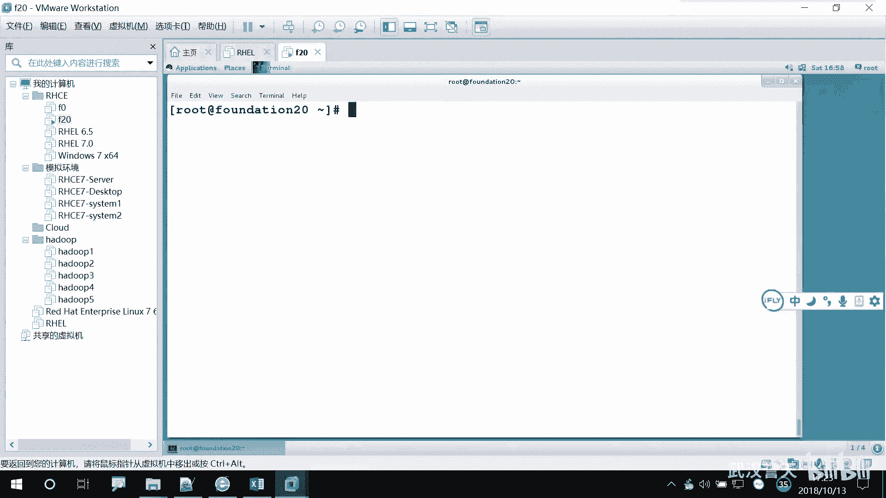
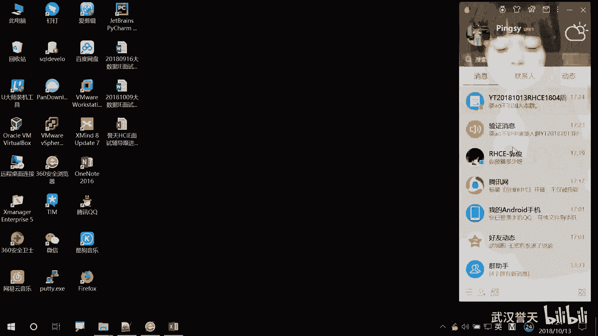
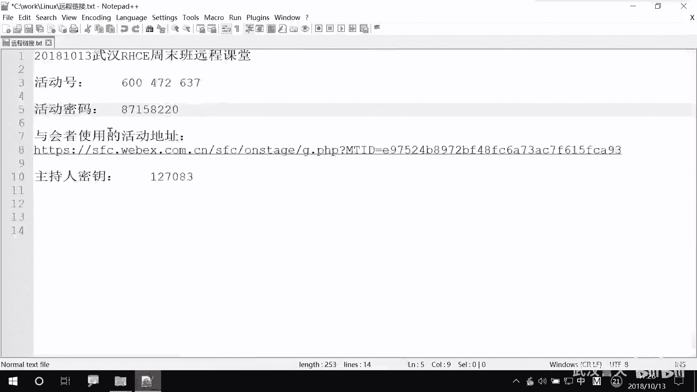

# 誉天-Linux／红帽认证／RHCE／RHEL7基础操作视频 - P12：03 Linux发展和rhel7基本操作_4 - 武汉誉天 - BV1xr4y1K7Aj

我想一想啊，一定要想清楚，对吧？所以你这边修改密码，你要想一想。下面还来了一句说什么呃，权利呃呃权力越大，责任越大，对吧？权利越大，责任越大哟。我跟你说金楚。啊。下面他说spepassword。

就让你给password呃给user A，它输入什么呀？输入user一的密码看到了吗？它并不是让你输入user二的密码吧。😡，对吧。那你是不是要证实你是刘泽怡呀？😡，对吧好，输入右手机的密码啊。

叫red hat。123456是吧，随车。好，看这里啊报错了。要会盘报错啊，他说user一并不在这个什么什么文件里面，但是我现在也不知道这个什么东什么文件啊，fill是不是就是文件的意思啊？

他说user一不在这个文件里面。😡，啊，什么什么in呃什么incident。是什么意思就。解释啊。故障什么么个什么。EC的事件什么事故之类的对吧？对。那这个是什么文件呢？

他这句话的意思其实就是说root你还没有给我付权。😡，你就想以root的身份去运行，对吧？没门是吧？对你没有在这个文件中给我复权，你就没有权限。😡，对，就没有权限。所以root要给它首先付个全啊。

那怎么赋权呢？给家看一下啊。我们有一个文件。呃，ETC。嗯。这个文件里面大家现在先不用等啊，这个我们后面会讲。我只给大家看一下效果。好，我们再来啊，我它复全了啊，复全了，我们再切到右侧E。😊。

然后再来改。再来改啊，前面要加个st啊，你光这样改不行啊，前面要加个st。A do。然后再来啊。你说。啊，让你输入优泽一的密码，之前那段话已经看过了是吧，就他就不会给你再再给你看了啊啊输入密码。

看到了吗？是不是让你输入。新密码呀，现在是不是给U子二来来什么修改密码了吧，对吧？啊，我再输入密码啊。😡，回车输密码回车，我输的是redhead哦。就是我能叔叔说的他是成功。😡。

说明我是以root的身份修改对吧？只有root这个这个这个这个用户是不是才能任意的去指定密码呀，对吧？123123456readhead等任意的密码，对吧？所以我现在是以root的身份去执行的。对。

咱有有这个权限了啊。好。大家看清楚了吗？但至于怎么修改的，我后面会教的啊。😡，啊，下面还有一个命令叫IDID呢它是显示呃什么？它这里写的是当前用户的一个信息。这个ID比如说啊你有没有可能。

当然一般也没有可能。有没有可能你不知道你现在你是谁啊，不知道你现在是哪个用户，对吧？对，但是这地方写了对吧？啊，那你想知道你当前用户的一些基本信息怎么办呢？IDID回车。

它会显示这个用户的一些基本的信息。当是这个基本信息我们看不懂，但是反正出来一串数。对，串一串数字。那么就是代表就是他是这个这个用户的一些基本信息啊，你直接输入ID看的是当前用户啊，当前用户。

那我要看懂这个系统当中一个用户存不存在。我想看这个用户的某一个用户的信息，怎么看呢？😡，ID空格U则一。ID空格userE回车。大家会看到也有一些信息，对吧？对，也有一些信息，但是我不知道是什么东西。

对，没关系啊。好，我再来看一个用户叫张三。我ID张三看有没有这个用户啊，回车。看这里啊有报错。张三怎么样啊？no such。没有此用户。对，只要显示这个的话，那代表这个用户是不是不存在呀？

这个系统当中这个用户是不存在的。但是如果你没有看到这一串，你看到上面是不是代表这个用户是存在的呀？虽然我不知道他写的是什么东，对吧？这是他一些用户组的信息啊，我们第四章会学的啊，这第五章。好。

这是ID的意思啊。那当然我们普通用户也可以是执行ID这个命令啊。说ID回车，它是不是显示自己的信息啊，对吧？ID什么都不接，显示的是当前用户的信息。对，显示的是当前用户的信息啊。啊，我退出来。继续啊。

呃，今天也教了几个病例，大家回去继去练一下，可以啊。后面还有啊呃后面呢是一个。就是。相当于是一个会计键吧，就是我们要讲一下tableable键。对，要讲一下tableable键。之前有同学说到。

袁生同学还在吗？半天没吱声了，有点不适应呢。在啊好。好，好好。嗯，这个table键要讲一下啊，这个table键是用来做什么呢？😡，table键大家知道吧？在那个键盘上面有个table键。

tabletable TAB对吧？啊，那么这个tableable键是用来complete，是用来补齐我们的命令的。对他可以补齐我们的命令，也可以补齐我们的目录。对，可以补齐啊，可以补齐。什么叫补齐啊？

比如说啊。因为我们linkux当中有很多非常非常多的命密，你你数也数不清，对数也数不清的命密，而且很多命令好长啊，对吧？非常长。比如说你password，我忘了，就这几个，反正就忘了。

你就记得passPASS后面不记得。那怎么办呢？你可以tableable一下啊，table一下。看到了吗？起嘞。对吧是不是？而且我建议大家要经常用这个table键，为什么呢？😡，搞半天敲错了，对吧？

如果你这样敲的话，敲错了，我table一下啊。😡，他tableable不了。就算比如说啊你看这里啊WD我table一下啊，我敲对了我table。😡，他空了一格，看到了吗？看清楚了吗？那边已经快睡着了。

一下，快下课了。😊，再坚持一会儿啊。如果你敲对了，你table一下，中间空一格看到了吗？如果你敲错了。😡，没有在研究授权文件是吧，你不用研究啊，我们后面会讲。DW只要你中间有敲速。

比如说啊PA敲了1个SWD，你table table不了啊，空格空格不了。所以它还可以检验你的命令到底有没有敲速。😡，然后比如说啊我就记了PA怎么办呀？我就记不了那么多，我就只能记两个字母，对吧？

那你也可以table。对table一下。哎呀，怎么没出来呀？对，再来一下啊tableable。哇，好太多了。多记一个星。两个太少了啊。啊，太多了啊，对不是太少了，再多记1个S。

因为以PA开头的命令太多了。对，以PA开头命令太多了，你你全部显示出来，你等于没有没有是吧？还得找。所以你多敲一个啊PASSPAS table table。啊，这是不是不是只有两个量，对吧？也就是说。

以PA开头的有两个文件。😡，tableable一下没出来，那是因为你table一下出来，是因为你这个开头的只有一个。那如果你这个table一下没有出来，要么就是你敲错了，要么就是。😡，有多个可能性。

但你再table一下，然后你就可以哎哦好像是这个命ing哦，对吧？PSSSWD。Table。table对吧？敲对了对，敲对了啊。好，这是命令啊，是命令。另外还有一个它可以补齐目录，对，可以补齐目录。

比如说啊我要去，比如说我C呃CD就是进入某一个目录的意思啊。啊，那么我有一个目录叫ETC下面的ss config好长啊，记不住。对吧这个目录非常长，我记不住怎么办呢？table啊对table补齐了。😡。

哦，后面我记得好像是net什么什么东西，对吧？tableable齐了。对，那如果。后面你不记得了，你也可以tableable。但是如果你tableable不出来。😡，后面没有目录了啊。

因为CD是进入目录啊，我这样啊，我把这个去掉。我在tableable。看是不是出来多个呀，我T两下啊。配我一下。哦，也有是吧。tableable一下，我已经table过了。

所以你这个地方如果有多个多个那个可能性的话，你需要table两下。所以我们的table键不仅可以补齐命令，也可以补齐我们的目录。目录太长了哎，目录太长了，文件名太长了。tableable键。

一定要会用啊，否则你看别人敲的那么快，你以为是别人是敲出来的吗？😡，对吧是table出来的呀。对，是table出来的，而且像书筒里面。那个table信用我估计都敲烂了，键都敲失灵了。对。

那个出红里面那个配交安机是吧？😡，要经常用tableable键，如果你不会用table键啊，那你要一个个去求。而且我们这个table键不是所有的操市场上们都有，像有一些操市场就没有。😡。

unix上面就没有。你需要把每一个字母都记下来。很痛苦啊。对，当然我们用这个会用table呃，有table键很幸福的啊很幸福的。所以大家要会用啊，不要放在这儿不用啊，一定要会用。😊，啊。

然后这个是table键啊，这个不用我多说了吧。全敲是吧，没有就推我。装逼用子。我记得很熟。O闭。啊，所以它可以用两个功能啊，你就可以补齐我们的，还有一些参数也可以补齐，还有一些参数什么的都可以补齐啊。

好呃，下面呢是我们的一些呃也是一些快捷卷，就是让我们快速的去挑我们的命令的。得快速去如何去执行我们的命令。比如说啊。我之前。呃，有可能执行过某一个命令，对吧？然后我还想再执行一下，但是我又不想敲了。

我好懒，对吧？很懒，不想敲，那怎么办呢？我可以查看历史记录。对，查看历史记录。叫history。history就是历史的意思嘛？对history回车。它可以显示之前你敲过的所有命令。

对之前敲过的所有命令都可以显示出来。那如果说哎这边有一个命令好长啊，对吧？我想直接去调用它怎么办呢？我可以直接调用的啊，不用再不用再敲一遍了。怎么调用呢？感叹号。感叹号是调用历史记录的意思。

感叹号是交用历史记录的意思啊。大家明天一定要带一个笔记本过来啊，这个笔记本非笔笔笔记本是那个笔记本。纸质的笔记本上。要记笔记啊，我要看大家记笔记，所以有那亲容易睡着，就坐着看容易睡着啊。啊。

感叹号前面看到有是不是有个编号啊？对吧有个编号，那敲71。对，赶叹号71回车。哎，他是不是帮我执行了这个命令呀？对吧所以就可以调用历史记录啊，可以调用历史记录啊，这是一种方法。另外还有一种方法。

还有一种什么方法呢？呃。他可以这样，比如说啊。我不记得什么呢？😡，我还可以用感叹号，我好像记得我之前敲过一个命令是以I开头的。对，以什么开头的，你看这里呃有是不是有ID什么开头的呀？😡。

对吧我只记得是以I开头的，后面不记得了。😡，Yeah。对，不记得了。那我就感叹号I回车。看到了吗？但是为什么它显示的是ID脏三，而不是ID user呀？😡，他会以从下就是这些是不是最近执行的命令啊。

前面是不是之前执行的命令啊，对吧？所以对，他会先从最近的命令去找。😡，对，先从最近的那个命令去找，然后你执行一下呃，这个这个这个这个就可以，他就找最近的一条，然后帮你去执行了。对，就这个意思啊。

这个可以吧。你比较简便啊，当然你比要你就要看一下啊。刚光线sory看一下，而且我们histtory还可以显示，比如说这里你看它把全部都显示出来，对吧？我们可以显示最近的几条对。

Ks banner a history history。NN就是比如说我要显示最近10条history1对history1回车。这不显示的最近10条呀。对吧还可以显示最近10条啊。

而且我们还可以怎么查呢？还可以还可以摁摁摁这个啊。你看这里有很多那个去调用历史记度的。然后还可以用什么呢？control加R。ctrol加R。A下cttrol加R。他可以搜索，比如说IDA看到了吗？

我输入ID后面是不是把最近的一条显示出来了呀？😡，对吧。对你可以这样去搜啊。对，然后回车就执行了。那就这样啊，ctrol加R。当然说实话啊。前面这些我都不怎么用。😡，对。用那还有一条更简便的方法。

上下键是吧？对，上下搜索。方便吧。对。虽然有点麻烦，但是你摁着也挺快的，是吧？😡，对，上下搜索啊对，上下搜索。回到这个回车是不是就执行呀？对吧上下键啊就是你的上下箭头，上下键对上下键。上下键啊。

上up和down上下键。另外还有一个比较常用的。有可能我执行的时候。我想去，比如说啊。😡，在这个地方，我想呃去怎么样呢？这样啊。嗯。我LS另外一个命令去看的啊，去看看一个目录。

那这个是CD是进不到这个目录，对吧？那我后面呢唉想去调用上一条命令的最后一部分这个参数。对，上一个命令的最后这一部分参数可以怎么办呢？也太长了，不想去敲，你可以摁一下ESCESC点。点就是那个句号。

句号那个键上面有一个大于号。ESA点。看到了吗？对，ESC点是吧你它只能调用你上一个命令啊。😡，对，上一个，而且是调用上一个命令的最后一个参数。这个地方听清楚了吗？它只能调用你上一个命令的最后一个参数。

😡，对ESC点。对，ESC点。就ENC点没有空格。就ESC点嘛，ESC点就可以了。😡，1是一点钟能能能。能听清楚吗？就是摁一下ES那个键和摁一下点那个键。可以吧？你看EAC点是不是就出现了呀？😡。

对吧就是你上一条命令的最后一个啊，最后一部分参数。对，这个也是调用之前执行过的一些命啊，执行过的一些命令啊、参数啊等等。这些可以帮助大家快速的操作啊，快速的操作。嗯。我下午这样我就不讲了啊。

我们明天再继续。后面还有一个就是文本编辑器，我们明天再讲。呃，今天我讲的内容不知道大家有没有接受的了啊，呃不知道有没有听懂。呃，一般如果有一点基础的话，应该是比较好理解的。但是如果没有基础的话。

可能入门比较难。对，入门稍微可能刚开始有点懵。这什么东西啊？这是不知道是什么东西，对吧？全是一堆字符字母。😡，对，多去多去多瞧，慢慢来啊，慢慢来。这些东西我都会讲的啊，这是什么东西。

这什么东西都会讲的啊。😡，嗯。远前同学有什么问题吗？😡，现长的员工有什么问题啊？学下讲内容。起码能听懂对吧？但是具体是怎么回事，还是不知道得慢慢来啊，今天要敲什么吗？怎么关？怎么退出来是吧？😡。

他退出来要在这里呃，这个呃呃呃foot上面一个look out。你点就是你在字符界面上敲了一个starX，不是进入图形界面了吗？😡，那你要退出来怎么办呢？

你唉你可以点一下rogo out注销就回到你的自主界面了。对，就回到你的自界面了。今天的内容大家把操系统装好就可以了啊。呃，而且还有今天下午学的password如何去修改修改这个这个修改密码。

如何切换用户。对，如何切换用户，其他的呃，另外还有一个就是如何在控制台之间进行切换，这些啊，其他的我不要求，为什么呢？因为呃其他的一些。涉及到一些其他的内种容。

比如histtory这些这种东西都是后面我们要学的命令，现在还没有学，对吧？😡，这些我们不不需要大家去那个只是听懂我今天的一些那个那那个快捷件，大家记下来啊。记下来之后，我们后面学完之后。

你再翻之前的笔记呃，你就。这是豁然开朗是吧？啊，那么我们今天的内容就到现在结束了啊，远程同学我们下课了啊，明天早上9点继续啊。啊，现场如果有什么呃同学有疑问的，可以留下来问我啊。

我那个winCwinC啊，有问题的，你明天一定要连上明天讲的内容就非常重要了啊。哎，今天的也也重要啊，每天都很重要。好，远程能学，明天见啊，明天见，明天见不着，明天见你的名字。😊，好。进了个什么东西啊。

好像没有东西吧。好的，嗯，你也辛苦了啊。用的一70的2，为什么要密码是吧？因为普通用户切任何用户都需要密码。对一不用密码。创建的时候没有用哪？创建了一个用户，对吧？的一这样子吧这的3。这样的，如果。

他创建完之后，我们有给他设密码。那只有入的用户可以切过去，但是普通用户是切不过去的，就是。😡，对，因为默认它是不能登录，没有密码是不能登录。所以你必须要给他设一个密码，然后再用普通用户切过去。

但是root切任何用户，即使他没有密码V也P写。😡，权力比较大。嗯。不了。哪些命令可以。这谢吗？哪个分多钱。哦，是PPT吗？PPT你们都有的，都发了。对。那你们那个。呃。找一下这里吧，我给你说一下吧。

在这个。嗯，看。这。我不是给你发了一个就是教材吗？然后这地方不是有个上梯嘛？把解压之后，对，就是我用的这个。然后这不有3个吗？我现在上的是第一本书。把它打开有个。这个是这个这个浏览器，给你看。可以。

没事，可以。是自己办呗。像样是吧，绩像在群里有网盘链接，你加群里。

就是群里。好的，你去那个公文件读一下。

跟肖老师发音。说。对，有点。嗯。为什。这个。呃，鄢胜军。这个我们后面第二本书讲。ho目下面的一些文件。嗯。装过装好。2。完了对。本一。然个。嗯。刚问个。这是。我没我睡。他开是。

改了。他不。为本。开心的。😊，就是个的服务端。都。对他。他们会。啊。我这就。他去对必须的，我是大不大。不大不大。嗯。

呃，几百兆还是几兆啊。没有，他超过一个G。好，明天见。认示的，我看看。知了。

嗯。嗯。

Oh。Yes。Hello。然后。

Yeah。

。

行。

