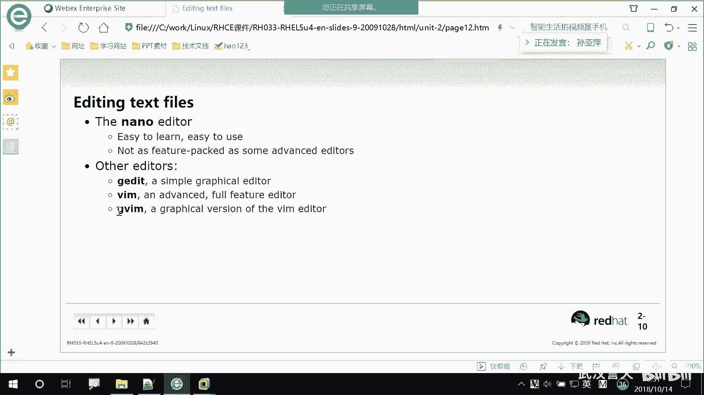
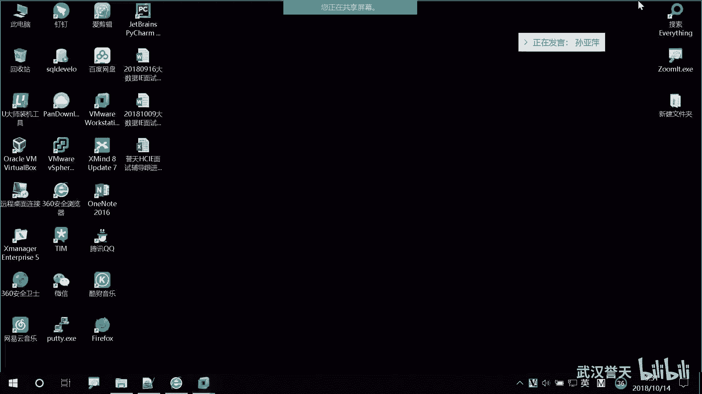
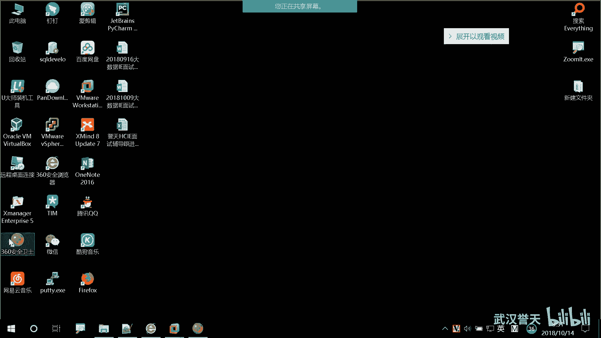
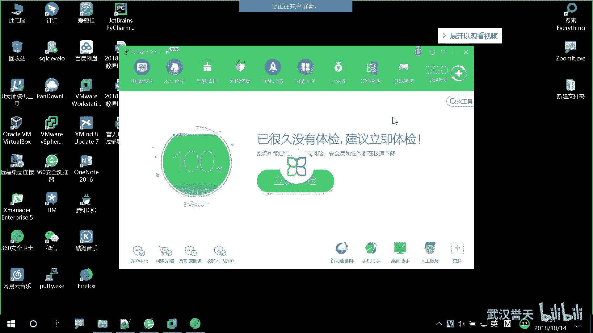
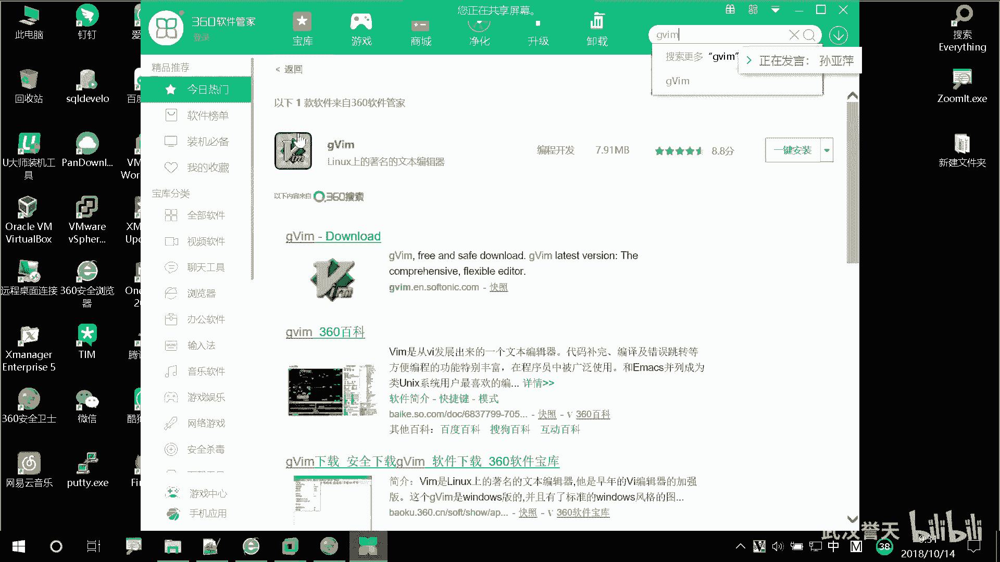
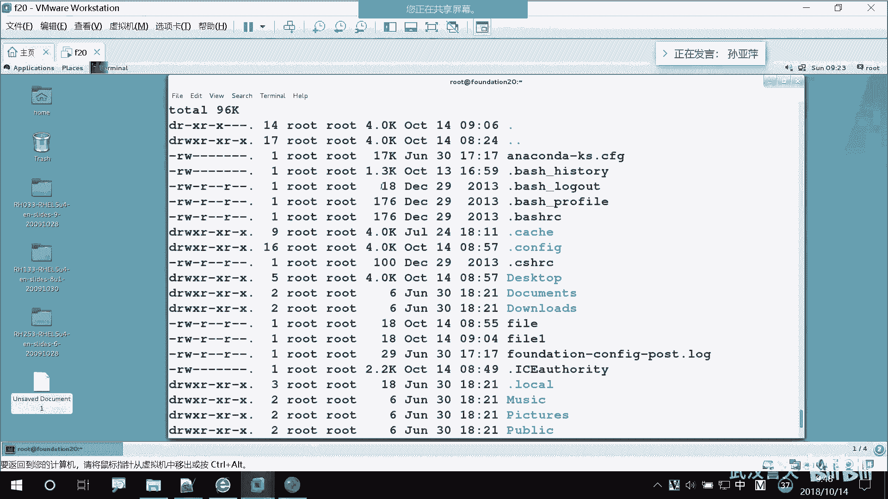

# 誉天-Linux／红帽认证／RHCE／RHEL7基础操作视频 - P13：04 运行命令和获取帮助_1 - 武汉誉天 - BV1xr4y1K7Aj

所天上午呢我们主要是安装了操系统啊，然后操系统的话，大家回去要自己装一下啊，装在自己的笔记本上面。因为回去的时候，你们呃课下去练习。嗯，如果有什么问题，你们再跟我联系就可以了啊。然后呢。

我们昨天上了两章的内容，第一章是我们的linux的一个理念和历史。呃它的一个基本的一个概念啊。然后这张呢主要是我们讲了open source，就是我们的开ing软件的本质，以及我们linux的一个起源。

以及我们那个红帽的不是红帽的发行版啊，除了红帽的发行版，我们还介绍了其他版本的呃，其他公司的一些发行版，大家可以可以下一课去联那个那个去去去了解一下啊，为什么呢？因为有可能啊我们学了。我们。

我们学的是RHEL对吧？但是有可能我们工作的时候啊呃可能用的不是IHE的对他有可能用的是别的版本的。但是没关系啊，你学的这个都差不多都可以用啊，都可以用。呃，秘密啊什么都差不多。好，然后呢。呃。

学了一些那个links的一个基本的原则。比如说一切接文件呢。这几个准则大家记一下啊。一切接文件在linkux当中呢操系统里面啊，一切是接文件的。我们可以通过编辑文件来对我们的操作系统进行操作。

包括我们的硬件，以及我们的应用程序就是应用嘛。其实大家可以把一些命密啊，就可以聊，就是把它当成一个软件。当成一个应用程序来判断就可以了。它都是一些小而精巧的应用程序。

那这些程序呃这些程序呢它只做一些呃一些比较简单的事情。对，如果说你想把完成一个复杂的任务的话，那么你需要把多个应用程序，就是多个命令组合在一起，然后来执行。那么如何把组合在一起呢。

我们后面学文本处理的时候会去学啊。好，然后呢呃我们也可以通过修改我们的配置文件，对我们配置配置的数据啊都放在我们的文本当中。那什么是配置的数据呢？我们后面啊后面会说就比如说啊我们配我们的网卡信息，对吧？

我后面要去配我们的IP。子网DNS中的这些信息呢都是来编辑我们的文件就可以了啊。啊，然后这是第一章内容啊。第二章内容呢我们学了一些lininux的基本用法。这个地方呢呃大家要会去登录啊。

会去重新界面和我们的字符界面去登录。那我们提供了。我们linux当中呢一共提供了一种。步行界面。一个呃图形控制台，还有5个虚拟控制台，又叫什么字符字符界面，对吧？叫字符界面叫文本，看到没？

test based就是文本啊。那么你可以呃这任意的啊任意的一个控制台呢，它之间是相互独立的。我们通常也叫它终端，得叫终端啊，终端。那其实真正意义上的终端呢应该是比如说啊我们的接一个显示屏。

接一个呃接一个键盘，这样才是真正的意义上的终端。但是我们这种都是类似都是虚拟的啊，它叫虚拟终端，所以叫虚拟终端。比如说文本的，那就叫虚拟终端啊。好，然后呢你登录操系统之后呢，它会给你呃有一个桌面。

分发一个桌面。就像我们windows登录进来也是看到是个桌面，对吧？哦，那你在桌面这个地方啊，注意，比如说你这里看到这个桌面，对吧？那你在这个上面打开一个终端的话，那你当前你当前就在桌面上。

对你当前这个地方这个位置，你在桌面上，我们讲路径的时候，讲目录的时候会讲到啊。然后每一个用户呢都会有一个加目录来存放我们的私人文件。也就是说我们每个人的桌面是不一样的。你在桌面放一些文件。

那么你用另外一个账号去登录的话，是看不到其他人的文件的啊，这属于个人的私人文件以及一些其他的啊其他的文件。好，然后呢，我们如何在我们的。除形界面还有虚拟控制台之间进行切换。

我们的一个命令是呃快捷键和快捷键，快捷键是conttrol alt加F一是默认是第一个图形界面，然后conttrol alt加F2ctlalt加F6一直到F6啊，它这个呃跟这个有点不一样。

F1是图形界面，呃，control alt加F2F3F4F5F6是我们的字符界面，也就是我们的虚拟控制台。control加alt加F7好像好像没有啊。对，杭州奥加F7好像是没有的，只有6只有6个。好。

那么如何在我们的虚拟控制台里面进入图形界面呢？而不是我们的控制台之间进行切换啊，而是在虚拟控制台里面开启一个图形界面。对，开启一个图形面。我们可以用一个命令，这是我们学的第一个命令叫star X。

对star Xstar开启对吧？X代表是X window对X window。那如果说你之前安装操系统的时候，没有安装图形界面，那你可以后面啊安装X window的包以及一个桌面工具的包。比如说。

叫X window对吧？啊，怎么写来？X window还有一个几or的包。GNOME好像是这个桌面工具的包，还有一个或者是你按K的E都可以。对按KDE这两种啊两种桌面工具。

但是我们现在学的一些那个快捷用快捷键的用法是genn工具提供的啊。啊，这是如何呃去在控台进行切换，以及在控台中去进入我们的同新界面。好，下面就举动minal的一些桌面的工具，这个你们下去练就可以了啊。

这上面有PPT，你们下去练要经常练主练了啊。哦，然后呢我们学了如何去修改密码。修改密码，我们用password这个命令password。我们就呃我们后面啊一般有时候也会用到图形界面。呃。

但是我想的比较少，图形界面一般点点点我一般不会讲啊。然后我们只学命令行的。好，然后这个CLI就是我们的命令行中，如何去呃去修改修改密码，这命令就是password对password不要敲错了啊。

我们如果你不记得，是不可以用tableable键，对吧？好，然后呢。呃，你给如果你只敲password回车的话，是给自己修改密码，对给自己修改密码，就给当前用户修改密码。那如果你后面想跟别人修改密码。

就要password空格。空格，然后user一对吧？就给别人修改密码啊，然后输入两次密码，OK就可以了啊。好，那么。这是呃root用户给别人修改密码，但是我们普通用户只能给自己修改密码。对。

那么他修改密给自己修改密码的时候，他也要严格去遵守一些规则。比如大小写啊，以及我们的呃特殊字符等等这些啊，然后他是不能给其他用户去修改密码的那如果说他要提升这个权限呢，我们可以用root给他复权啊。

你只有用root身份给他复权。因为那个文件我们之前大家可能看到我之前是编辑了一个文件。那么那个文件呢也只能root来编辑，所以只能root来给他呃提升权限啊，提升某一个普通用户的权限。啊。

那你如果说给他复权之后，比如说我切到优泽一。给右的一复权之后，然后给别人修改密码，前面要加一个sto啊。然后再来执行你想要执行的命令password，然后user一呃user2就可以了啊啊。呃。

root用户我们了解了一下root用户的一个本质。那其实在很多方向呃很多方面啊，我们都可以体现出root用户的权利很大，修改密码呀等等。我们root用户是即意识全全部就是即呃。

他拥有所有的权限啊拥有所有的权限。那么我们普通用户他们之间是相互平等的，普通用户之间相互平等，就是他们的权利是一样的那只有root权限比较特殊。那么我们尽量呢工作当中也不要用root去登录，对吧？

就算如果你有root权限，你也不要用root去登录。因为它的能力很大，权力也很大，那么它破坏力也是很大的啊。好，这是如何去切换用户SUSU空格杠去切杠切换啊。我们教师机的同学上去登录呃，开机的时候。

大家可以看到他的当前用户是cosky那个账号啊，然后你要执行命令的话，你需要切到root账号。ro账号的密码是redhead啊，REDHATHAD哦REDH呃redhead啊。然后。这个是sdue。

对吧？sdue是如果你呃想执行root的呃root的权限，那么前面加个sdue，那么就是以root的身份去执行的啊。好，ID呢就是显示我们的当前用户的一些信信息，它同时也可以检验某一个用户存不存在啊。

某一个用户存不存在ID空格加用户名。你说ID。如果普通用户他也可以执行这个命令啊，他也是可以执行的。比如说啊，我现在是user一对吧？user一这个账号，然后呢。

我执行了ID我显示的就是user一的信息。那我想看一下系统当中张三这个账号存不存在呢？好。ID张三。回车。他说并不存在对吧？那我看一下啊，IDus2存不存在呢？它也是存在的。

说明ID这个账号其实是普通用户也可以执行的，它也可以看到某个用户存在啊。所以ID显示的是某个用户的信息，也可以验证某个用户到底存存在。呃，然后就是tableable键啊，table键嗯。

每次强调这个地方，因为之前有同学他就不太会用，他呃不太会用，也可能有原因啊，可能不太会敲命令，对吧？如果你之前不太记得了，那你就用tableable键。但是如果你只记得一个字母，两个字母那不行啊。

因为这个后面以比如说啊以pass开，我们昨天也做过实验，对吧？以pass开头的命令可能很多，所以你你不要懒啊，有一些基本的命令，大家还是要去记忆的啊。对，还是要记一下。好。

然后这个这个呢是用来补齐我们的命令的，以及我们的目录啊等等，很多都都是可以补齐的。但是强调一下，不是所有的都可以补齐啊，不是所有的参数都都可以补齐的。对，所以还需要大家该记得还是记一下啊。

该记得还是记一下。好。然后呢，我们去查看我们的历史记录history，它可以列出我们最近执行的，它应该可以列呃是500条吧，可以保存500条，大概是。我不记得是几百条了啊，然后列出呃可以列出最近的。

比如列最近的N条，那就historyN。history空格N啊history空格N。就可以列列出最近的5条，以及如何去调用我们的历史记录。

那我们最简单的方法呢就是呃上下键对up and down上下键来滚动去寻找上一个执行的命令。然后ctrol加R呢也可以搜索，对吧？然后在这上输入就输入就可以了啊。啊。

然后呃还有一个比较常用的就是我们感叹号。我们的感叹号history。其实感叹号比较常用的感叹号就是用来调用我们的历史记录的对你直接输入它前面的编号，就帮你执行了啊，比如说82对吧？那后就输入82回车。

他就帮你执行了这个命令，看到了吗？你也可以去感叹号什么呀？感叹号就是这个命令的开头的这个字母。对，如果有多个是以his结尾的话，那么他就会去找最近的一个帮你执行了。对，就这个意思啊。啊。

以及还有一个比较常用的就是ESC点。对ESC点它就是来干什么，还记得吗？ESC点是。调用上一条命令的。最后一个参数调用上一条命令的最后一个参数啊。那比如说我在这里。执行一个命令啊。比如说我要。嗯。

比如说我这里执行了一个命令啊，然后呢，我现在还想就调用这个，我不想再敲了，对吧？上一条命令最后一个参数，那么我就可以怎么样啊，ESC点对ESC点就调用了啊。啊，当然这个是不能没办法执行的啊。好。

那下面呢我们继续啊嗯。嗯，下面呢是一个编辑我们的文本文件啊，如何去编辑我们的文本文件。我们不是所有的一切接文件嘛，对吧？那么我们如何去编辑它呢？当然一些文本文件我们才能编辑啊，比如说二进制的文件呃。

有时候是编辑不了的对它有些是一乱呃，你去看起来像相应对乱码，对吧？是编辑不了的啊，那只有文本我们文本文件我们才能编辑，那么有哪些编辑器呢。呃，你可以把这些编辑器看成是一个软件，相当于你用word打开。

用PDF打开，还是用什么打开之类的啊，你可以把它当成这个啊，那么我们有一个编辑器叫nano。对，nano编辑器。对，这个看一下啊。叫NANO对NANO回车。啊，我就进来了一个文本。

就进就是相当于打开了一个右键，打开一个文本文档的思。对，打开一个文本文档。然后呢，我就在这里面输入啊，比如说呃我输入一堆。对吧。对不对，我不知道输什么东西啊，然后呢。我想把它保存下来，对，怎么保存呢？

看下面啊。下面是什么呀？这个是什么呀？😡，获取帮助对吧？就什么w out，什么read file什么么什么一堆，但你不知道那你怎么办嘞？它就有提示啊，有提示。比如说你想退出。

你看这个地方有一个上呃是什么间号，对吧？一个X。那就是退出，那我想退出来，对吧？那我就但是这个键号不是这个键盘上的键号啊，那shift键。😡，对shift键加X。哎，是cttrol键吧。对。

cttrol键啊，说错了。conttrol键加X，然后他说呀他问你是不是要保存，是否要保存我刚刚写的这些内容啊？对，是否要保存？那如果yes就是保存嘛，no就是不保存。呃，嗯对这这个呢就是取消嘛，对吧？

cancel就取取消啊。好，那你就摁Y了，我保存对吧？哦，我摁Y之后呢，它又提示我什么呀？fill name他说你要给这个文件是不是要起个名字啊？当大家我看到我呃看到我去执行nano的时候。

其实就就只是执行了一个命令，而并没有给这个文件起个名字，对吧？那你保存的时候，一定这个文件需要有个名字，所以你需要输入，比如说我输入fill。文件。对，输入file文件。那么这个文件名就叫fill啊。

然后怎么退出来呀？啊，直接回车。回车就出来了啊哦，我看一下这个地方多了一个文件，在这里啊，在当前目录下多了一个文件叫fill，对叫fill。其实在整个过程中呃，其实呃这个这个这个文编辑器啊。

在整个过程中不知道大家有没有什么感受，就是就感觉反正我是觉得挺麻烦的。对，一步一步要提示你呃，怎么要退出啊，对吧？还要去写文件名等等，这些一步一步来，对吧？那么其实这个我们不怎么常用，对，不怎么常用。

不怎么常用，说了半天，对吧？对，让你们比较一下啊哪个更好用。啊，那么我们还有一个啊。这个这个叫G editit，对，叫G editit。这个G edit呢。

如果大家习惯用我们的呃就是windows里面那个软件叫文本呃文文本文档，对吧？对那个笔记本记事本那个东西。对，那么你可能就比较喜欢用这个对吧？叫G edititG代表是图形界面graphic意思。对。

所以它是一个图形化的工具。对，图形化的工具。那么我们来edit个编辑嘛，对吧？G editit好，那我们来ge editit一下啊。大家可以看到啊，这边就调出来一个文本框，就是这就就是一个窗口。

这个窗口呢其实就相当于是一个文本，就是一个一个一个打开了一个记术本，然后你可以在这里输入啊输入。hello，对吧？那怎么保存呢？😡，这地方有个save看到了吗？对，save保存，然后你看取消撤销嘛。

然后这是打开某一个文件。对，然后sve你就把它保存下。保存在哪里呀？你可以保存在你看desktop。😡，O我想保存在桌面上面。那你就save右下角看到吗？保存。对，就保存了。

你可以把它这个是可以擦擦的啊。对，这个是可以擦掉的。对你用命令啊是推不出来的啊，它是一个文本，是一个那个图形界面的工具。所以你看这在这个地方就多了一个文件。这个地方对吧？就是我刚刚保存的那个文件。

好像都没有取名字哦。那这个呢其实在呃在那个windows里面，你也可以去下载。呃，是是不知道windows里没有是这个啊。哦，这个windows面好像没有，就是那个这个里面的linkux当中的。好。

那么。大家如果不习，刚开始不习惯的时候可以用它啊，这也没关系。那下面呢我就要来讲一个我们经常用的比较好用的一个编辑器，叫VI编辑器。对，叫VI。现在呢以前老版本可能或者是你在字符界面下。

它只能只叫VI对，叫VI。那现在重新界面呢？呃，或者更新的版本啊，它叫VIM，已是VI的升级版。对VI的升级版叫VIM。啊，那么我们直接啊VIM打开。看这里啊这有一段话，呀没了。啊，这个地方有一段话啊。

你看VIM它是VI的升级版，对吧？升级了。然后现在版本是什么什么，然后。他说VM是一个开源的，什么自由的什么什么版本。然后你可以怎么样啊，你可以敲什么tap呃help或去帮助，对吧？看到吗？这段有Q。

你敲Q就退出了，对吧？或者是挑什么hap，就什么什么帮助啊，那这个地方呢其实我们需要我们后面啊第二本书的时候，我们专门呃。专门有有一是第一本书，第二本书。对，专门有一章第一本书啊。

我们后面就会学专门有一章来教我们的VI编辑器如何去使用。对VI编辑器如如何让你在里面很快速去修改文本内容，对吧？专门有一章去讲的啊，那在这个地方呢，我首先跟大家呃讲一些最基本的用法啊。

那你进入到这个里面呢，你现在去敲是没有用的啊，再敲是没有用的。你先要进入插入模式，对，插入模式，插入单词叫insert。这一。Search。对，叫insert叫插入模式。所以你需要摁一个I摁一个I对。

摁I啊键盘上的I。I。啊，看这这里啊左下角。左下角啊这个地方就变成了插入模式啊，一定要看啊，不要插了半天没插上去，对吧？不知道为什么在这个地方，如果显示的是插入模式就insert。

那你才可以往里面去输入啊，你才可以输入啊。啊，这个地方呢我就开始输入啊，比如说hello。对吧。啊，那如何保存退出呢？对，完全不知道，对吧？啊，你需要如果保存下来啊，摁一下ESC。对，摁一下ESC。

摁一下ESA下面左下角那个ins色的是不是消失了呀，对吧？就相当于退出了我们的那个插入模式，然后摁一下冒号。对，冒号啊在这个地方显示了一个冒号。这地方啊有一个冒号，然后在这个冒号就是出现这个冒号之后。

在后面再输，就是是保存呢还是退出啊，对吧？啊，那个好。W是保存啊W是保存。Q是退出。Q是退出。W和Q可以一起执行。比如说啊打，我摁一下W啊哦还没有文件名哦，还需要起一个文件名。好，再摁一下ENC啊。

冒号又出来了啊，W，然后空格。被一。对，空格fill一。回车。啊，看这里，他就说他说这个地方什么，生成了一个新的文件叫fi一，对吧？也，叫fi一。好，那我怎么退出来呢？我只是保存了，但是没有退出，对吧？

啊，怎么退出来摁一下E冒号Q。Q啊Q就是queen，就是QUIT那个。因IT退出嘛，放弃那个意思对吧？6啊。啊，我车。就退出来了啊退出来了哦，这个地方呢就多了一个文件叫fill一。

其实我们用这个VIM的时候，并不一般情况下不这么用。对，那你要想创建一个新的文件，或者是要打开一个新的文件。打开一个文件进行编辑的话，我们通常是这样子啊VM然后fill。

一、比如说啊我想编辑刚刚我编辑过的那个文件，对吧？那你就VM空格fill一。回车怎不就进来了呀，对吧？好，摁一下I。好，呃，后面比如hello world。啊，怎么退出呢？很快啊，你可以保存退出一起。

对，保存退出一起摁一下EC左下边现在是insert的对吧？摁一下EC冒号WQ。先W后Q啊。因为它是先保存后退出，不能QW啊。不能QW没车。就退出了啊。其实如果你熟练的掌握还是非常快的对，非常快的。

进来I然hello对吧？保存退出。对。这个地方记住了吗？哦，这是我们的一个呃VI啊，就是如果你刚刚啊如果你写往里面写内容，大家可以对比我们的word或者是编辑那个编辑文本的时候，可以对比一下。

如果你直接摁Q的话，比如说你比如说你这地方啊你增加了内容，对吧？你增加内容，如果你摁ES冒号Q能退出来吗？是不是退不出来呀，因为它没有保存啊，你回车他说什么呀？😡，看这里啊。

他说no white就是从上次没有写入，也就是你没有保存，你需要怎么样啊？你直接退出的话是退不出来的，为什么呢？因为你把这个文件修改了。如果你没有修改，你是可以直接退出来。但是如果你修改了，你就退出来。

😡，那你要想强制退出来怎么办呢？加一个感叹号。对，加一个感叹号。但是如果你加了感叹号的话。上面写的内容就没有保存下来。对，就没有保存下来啊，这个地方一定要会用。建议大家不要看一个文件的时候。

比如上来就WQ啊，为什么呢？因为有一个文件有可能它很重要，对吧？你不可能你有可能说进去之后不小心把修改了。😡，但是你又不知道修改在哪个地方了，那怎么办呀？就直接Q感叹号退出。然后再来打开。

是刚刚没有保存呢。对吧所以Q感叹号感叹号是强制的意思啊，强制退出。对方听懂了吗？哦，这个是VM现在的一些就保存如何打开呀，如何保存呢？呃如何呃去退出，对吧？这是VI的一些基本的用法啊。

后面我们还要去学哎，如何在VI编辑器里面快速移动，对，如何快速定位，对吧？如何快速的去复制粘贴等等，对吧？当然不是用鼠标啊。是用快捷键啊。啊，那么这个是我们的一个呃很流行的一个啊。

在lininux当中很流行的一个编辑器。而且现在我们基本上都用它上面的nano啊，几edit一般都不用。啊，那么我们由于很很好用，对吧？我们在windows里面也出了一个图形啊，是1个GVM。

它是一个图形化的版本，对它其实也不是完全作用。为什么叫图形化呢？就是它运行在我们的呃windows里面，你在windows里面可以去下载啊。呃，比如说你想去在windows里面也去使用。

你可以在呃，他他有这个。

GGVIM那个软件，你们可以去装一下，在windows里面。

小鸡CM。就这个编辑器啊，就linkux上面著名的文本编辑器，对吧？对你可以把它装一下，然后去呃它那个打开这个运行这个应用程序，它跟那个VM在这个里面VM打开是一模一样。

对，一模一样的。一些快捷键什么都是一样的。啊，我就不给大家装了啊。啊，这是我们第二章的内容啊，我们第二章呢主要是呃看后面start x啊呃genor tominal工具，password。

然后sus呃SUSU然后那个nano这个启况就变成VM啊VM这可能比较版本比较老。然后大家在那个字符界面的时候啊，就是在字符界面的时候，他有可能执行不了VM。对你只能啊你只能用VI对只能用VI啊。啊。

这是第二章内容。下面呢我们开始第三章内容的学习啊，第三章内容非常非常重要。对嗯。它这个呢贯穿我们整个对吧？也不是贯穿整个就是。在工作当中，比如说啊你遇到问题了，怎么去解决，对吧？没人帮你。

或者是哎给你一个命令，对吧？它如何去运行它的语法是什么样子的？所以这就是我们这章要学的内容啊，我们看一下标题啊，第三章是运行命令和获取帮助。对，获取帮助。嗯。那其实为什么还要学什么如何获取帮助呢？

如果运行命令的语法呢，大家可以可能有很深的体会啊，就是特别是办公的人，办公用用office对excel啊、word呀，还有一些什么或者是什么呀，或者是那些什么呃比如说photoshop呀，那些软件。

对吧？那么你新拿到的一个软件的话，你知道怎么用吗？一般情况下不知道，对吧？你想买一本书，哎，后面可能报个班啊去学一下。对，网上其实也可以去查。对，所以他学习起来其实是很麻烦的，需要花费呃。

可能花费金钱花费花费精力，对吧？都是要的。那么在我们linux当中，比如说啊你有一个命令，不知道如何去运行了。那在我们的。呃，系统当中有很多很多的帮助信息，供你去查找。对它语法是什么样的。

以及我们还有一些呃文本的，就是呃如果文本的那些让你去阅读还有一些官方的等我会慢慢的给大家一个个介绍的啊。但是为什么要学呢？我直接记下来不就行了吗？呃，之前我也说了，我们的命令太多了，对，太多太多了。

你没有办法记下来。甚至有时候有一些基本的命令啊，马上就忘记了，那怎么办呢？查对，查如果去用怎么办？查你不可能呃上来就百百度，对吧？其实。大家习惯并不是在lininux当中获取帮助，对吧？

一般上来就百度了，对，一不懂就百度，一不懂就度娘了是吧？这是习惯对，就习惯了。但是有时候百度也不太靠谱。对吧对，那那那那同学说，哎呀，我反正就是很为难啊，我就是看不懂那个英文，就是看不懂，对吧？

大家可以结合着，就是我们先学一段时间，大概有一定的基础之后，我们再慢慢去阅读。对你比其实那上面你还是拥有一点的基础的。没有基础的话，你去看那全那就是看不懂。😡，对，所以我会呃后面我们学的时候。

我也会带大家如何去看啊，如何去翻译，或去呃那那阅读。大家不用担心啊。呃，还有之前好像这个帮助还是什么的，呃那个那那个好像还有人出了书。对，就是把这里面的全部翻译一遍，对吧？

但是也没必要说拿着那本书去买一本书去搞。好，然后嗯。我们这张内容啊，第一，我们去excuse执行的意思对执行命令在我们的呃提示符就相当于是个提示符，就是这个啊。你说提示符不就这个嘛，对吧？

就是个提示符啊。啊，如何在提示符里面去运行命令，然后呢，我们需要了解一些简单的命令的一些与用法。对，以及它的目的就是它用来做什么的作用，呃，还有它语法语法规则啊。

然后如何在我们的呃红猫企业版links当中去获取一些帮帮助资源，对resource资源嘛，对吧？获取一些帮助资源啊。啊，然后如何去running啊，就是去运行命令。那命令的语法呢，这个是语法的意思啊。

下列语法的意思，然后命令的语法是什么样呢？command就是命令 optiontion。option就是选项。对，option就是选项。后面是。arguments对吧？就是参数。参数这些单词都要认识啊。

option options选项中间用空格隔开。对，所以命令的基本的语语法就是命令选项和参数。命令选项和参数。比如说啊。我有一个命令叫LS这个命令呢它的意思就是看对，就是看。那我LS回车我就看到了。

对吧？那其实这个是它的基本语法。并不是所有的命令都有这三部分。对，并不是所有的命令都有这三部分。那么我们所有的命令都是以命令开头，对吧？这句话有点废话是吧？对，所有的命令就是这一段都是以命令开头的啊。

如果你之前执行了一个命令，然后下面报什么命令没有找到，那一是你敲错了，二是这个没有这个命令。对，没有这个命令啊，所以你不能上来什么fill，对吧？fill一它是个稳件。😡，你这个文件能执行吗？

你必须要执行，它是个可以执行的命令，它才能执行啊，否则他就会报什么呀？😡，谁会报错啊，命令没有找到对命令没有找到。所以我们所有的啊都是以命令开头的啊。对，以命令开头的。好，我们看第二个啊。

options叫选项，选项是什么呢？选项是我们命令自带的功能。对，选项是我们命令自带的功能。什么叫命令自带的功能呢？呃，其实说白了我可以给大家举个例子啊，比如说我们的电风扇，对吧？冰山。

比如说它是一个应用程序，对它它的作用干嘛？山峰，对吧？那么他可以怎么可以删封，那可以怎么删呢？摇头栓对吧？哎，大大小档12三档。1二三档摇头这些都是他的。功能对，这都是它的功能。

所以option大家可以看到看成是它的功能。好，给大家举个例子啊，LS是查看对吧？好，那我我想我这样这样看的话，我这都是一个个文件。那我不想这样看，我想看它的一些哎更多的信息。对，更多的信息。

那就怎么样？LS杠L对，杠L，然后回车。那我看到的内容跟之之前这个是不是不一样啊？对吧所以这个也是它的功能。那这个杠L就是一个选项。对，就是一个选项，是我们命令自带的功能啊自带的功能。好。

那么我们来说一下选项是如何去调用。唉，为什么是选项啊，怎么样才是选项呢？啊，你看这里有个解释啊，它说不是选项是修饰命令的行为。对，修饰命令的行为。对，就是相当于就是就是控制这个嘛，控制电风扇如何去转。

对吧？啊，那么我们叫sing letter，就是短横杠，就是一个横杠。这个横杠是我们那个加减号上面那个减号。对加减号上面那个减号。只要我们如何去调用我们的选项呢？需要在前面加一个横杠。对，加一个横杠。

就是调用了这个命令的一个选项。对，调用这个命令的一个选项啊。刚刚的我LS空格啊空格杠L是不是就调用了一个选项啊，对吧？好，那么他看到的内容跟我们LS看到内容肯定是不一样的对。

那所以杠L就修饰了这个LS的一个行为是如何去看，对，如何去看，其实大家这个L可以理解成什么呢。大家不知道这个大家应该有体会，就是大家可以看到这个吗？就是这个不是有很多文件吗？

对吧这个文件你看啊这文件名啊、日期啊、类型呢，是不是看到很多信息啊啊，大家这样看查看。我看你比如说是呃呃小图标啊，那这样的话这个功能是不是跟LS的功能是一样的？啊。这里你看LS是不是哎文件名啊，对吧？

全是文件名，那LS杠L呢就是哎这是什么呃时间，我起码看到这个时间，这这这六是时间，对吧？这个是文件名，对，所以它就修饰它的行为。这个大家可以理解啊。那这个是查看详细信息。

当然我们在windows是点是点点点鼠标点对吧？那在linux当中呢，是用命令来执行啊。好，比如说我们L还有一个选项叫杠A。对，list呃，其是LS。对列列详细信息的意思吗？好。对，是list史的啊。

那LS杠A啊，还有一个选项叫LS杠AA呢我回车看一下，先看一下效果啊。跟LS对比一下，大家会发现什么呀？反正反正好像多了一些文件，对吧？对，好像多了一些文件。你会发现这些多的文件呢，它是有什么特点呢？

是不是一点开头啊，对吧？一点开头的多了一些一点开头的文件。😡，你点开头的文件是什么呢？对，你点开的文件是隐藏文件。对，是隐藏文件。什么叫隐藏文件啊？在你的windows里面应该也有隐藏文件吧，对吧？对。

为什么要把它隐藏起来呀？一是他是非常重要。非常重要隐藏啊就是重要你LS正常这样一般看不到，对吧？看不到，你就不会去操作它，你也不会把它删掉了。你你删这样正常就删是删不掉的。😡，所以这个文件很重要。

还把它隐藏起来，正常看不到。那这个A代表什么呢？😡，代表我。A，瑶瑶。代表过代表所有对我要查看所有的文件，是这样的啊，为什么要隐藏起来？因为呃有些人有强迫症。对吧在windows里面。

其实我之前就有点这样。呃，就强不到什么地步呢？就是呃我看呃一些手机里面文件，对吧？我好像不认识他，对吧？我说不认识的东西我都要把它删掉。对我只留下我认识的东西。我之前就是不知道是手机还是电脑啊。

我我就把删删删删删然后删挂了。😡，对，因为我想哎呀，我都不认识他，好像是一些乱七八糟的东西，对吧？因为要清清清理，对，经常清理，然后就删删挂了好几次。对，所以其实那些文件是很重要的文件。

只是你不认识它而已，对吧？所以呃为了防止我们误操作。对，防止误操作，我们需要把它隐藏起来，当然这些隐藏文件，我们后面也会接触到啊，我们也会去兴趣去修改它。其实如果你能操作这些隐藏的文件。

就说明你代表你有一定的水平了，对吧？你也不可能呃一般情况下也不会太去误操作，说把它删掉，不认识把删掉啊。所以一般情况下呃这些文件都是比较重要的那杠A呢就显示所有的包括我们的隐藏文件啊，那刚刚呢。

我给大家看了两个选项，两个选项啊。那这些选项呢？你看这里啊，他说选项可以是杠A可以是杠B，可以是杠C，对吧？那我现在有个要求，我有需求，对吧？我想查看详细信息，又想查看。呃，隐藏文件。对。

又想查看隐藏文件，那么我们可以将这些选项进行组合。对LS空格杠L。空格杠A。对空格杠A回车。大家可以看到这个里面是不是我们隐藏文件的详细信息也列出来了呀，对吧？这是将我们的选项进行组合啊。

将我们的选项进行组合啊。那比如说啊我还有一个选项，对，比如说我还想再执行1个LS杠L。呃，杠A还有什么杠H。杠H回车好，好像没有什么太大的区别，对吧？对，大家可以这样看啊，大家可以看到正上是不是数字啊？

对吧这是数字啊，那这个数字代表是这个文件的。大小对，代表是这个文件的大小。好，你来说这个文件有多大呀？肯定是吧知道的人是吧知道。有可能你不知道这个到底是多大，对吧？呃，给你一个非常大的啊。

那你算一下这个是多少。😡，刚刚是4K是吧，那这个是多少？😊，算不出来对吧？让家算一下，就脑子要算算一下，对吧？6K啊，算啥呀。啊，那么我们这个啊默认是字节。对，默认这个单位是自己这个大小。

那我想以他我能看懂的方式，比如说多少K呀，多少兆啊，那我这样看起来是不是直观一些？对吧那如何去看呢？我们可以加一个选项叫H杠HH是什么东西呢？H是一个呃它叫human。叫叫叫。HUMAN。哎。

哥man哥man是什么呀？用的是什么呀？人类吗啊这不认识人嘛，对吧？😡，对。相当于就是我们以人类可懂，就是人类可以识别的相当于这个意思。人类可以识别的。那刚刚那个字节是不是机器才能识别啊，对吧？

我们人可能也能识别，但是要算对吧？对我们更直观的一种方式就是H很多里面啊都是杠H就是 humanman的意思，就是来换算它的单位。那如果你是兆的话，它就给你显示兆，就是16K。

现在没有没有那个大的文件啊。你看这里啊，如果你超过了呃到达兆级别的话，那后面的单位就会变成兆。对，如果你到G就会变成G，就这个意思。如果是K级别，就是K。那如果不到K级别的话，还是字节级别的话。

那就还是原来的字节。

