# 誉天-Linux／红帽认证／RHCE／RHEL7基础操作视频 - P14：04 运行命令和获取帮助_2 - 武汉誉天 - BV1xr4y1K7Aj

对，就是自己啊。啊，那么。我现在讲了三个选项对吧？三个啊这三个，那有可能我是不是可能还会有什么呃呃杠L什么等等一些其他的一些选项啊，对吧？有可能啊会一些其他的选项，那这么多选项哇，好多呀。

敲的也挺那个还要敲好多杠，对吧？对，那我们可以把这些选项进行一个组合对进行一个组合，如何去组合呢？这样子啊，LS杠LAH。对，LAH。啊，组合起来。它的顺序没有呃，没有什么顺序啊，就是你放在前面。

放在后面，这都是无所谓的。当然我们后面有一些有一些选项啊是有有有有关系的啊，这个这个顺序是有有那个的，但是LS这个是没有的。嗯，这个顺序是没有的啊，随便放啊，然后再回车。

是不是跟刚刚那个杠L杠A杠H是一样的呀？对吧。所以我们可以将将它进行组合起来啊，那这种字母单个字母的选项，单个字母的选项叫短选项。对，叫短选项。那有短选项是不是还有长选项啊。还有长选项啊，这个叫短选项。

那我下面来跟给大家举几个例子，比较错误，经常容易犯的错误啊，比如说LS。杠L什么，它直接杠A是吧？杠H。啊，这个地方哪里错了呀？嗯。对，这个地方是不是要空格呀？你要多个罗列的话，是不是要空格，对吧？

那你又不想空格，你要简单一点，那怎么样，你把它去掉嘛，就把杠都去掉呀，就一个杠就可以了。😡，对，一个杠就可以了啊。这个地方应该相信大家应该不会犯这样的错误啊。说不准对吧？啊。

或者是有同学讲LA叫H不加杠。这样也是不行的啊，你只要用空格隔开了，你前面是不是要加一个杠啊？😡，对吧都需要加一个杠啊，否则它是不能识别，它就会报错。他就会把这个不加杠的认成是参数。对，认为是参数。

所以你看就报错了，也就报错了啊，那么这是短选项啊，我们下面来看一下长选项。原选项大家应该都会了吧。啊，长选项是什么呢？比如说LS。如果去使用长语量，长语量跟短语量是不一样的啊。😡，短选项是一个杠。

长选项是两个杠。对，长选项是两个杠啊。ALL。长选项调用是两个杠，而且长选项它不是单个字母，而是一个。相当于是个单词，对，是一个单词。L杠杠W。回收。

大家可以看到这个是不是跟之前的那个什么LS杠A是不是一样的呀？对吧效果是一样的啊，只不过一个是短选项，一个是长选项。对，一个是短选项，一个是长选项。你不能这样子啊，不能LS杠ALL。

那这样是你到底是长选项还是短选项？其实这样的话，其实你认为的沃是不是你想要是沃呀，但是它是把你理解成是短选项，然后什么杠ANL杠L啊。😡，啊。这样子。回车他是也能帮你执行，是因为为什么帮你执行了呀？😡。

它是把你理解成是短选项了呀，而且是多个字母组合在一起的短选项啊。😡，啊，能理解吧？对它是杠A杠L杠L的意思。对，杠L的意思啊。所以你想要想调用长选项，哎，后面是单词，必需要有两个杠啊，两个杠对，杠杠哦。

啊，那么我们还有一个啊，比如说。L杠杠help。S杠杠help。pab是什么呀？救命是吧，帮助啊帮助帮助那L杠杠help回车。这是不是报错啊。😡，它显示了LS的一些帮助的信息。

也就是如何去使用这个LS命令对，帮助信息。那么这也是一个常选项，也是一个常选项。它显示的是LS的一些帮助的信息。你看这个地方不是个杠A吗？其实杠A就是杠杠5。

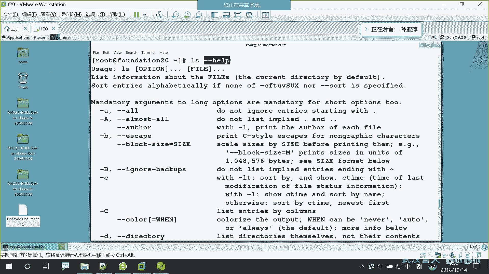

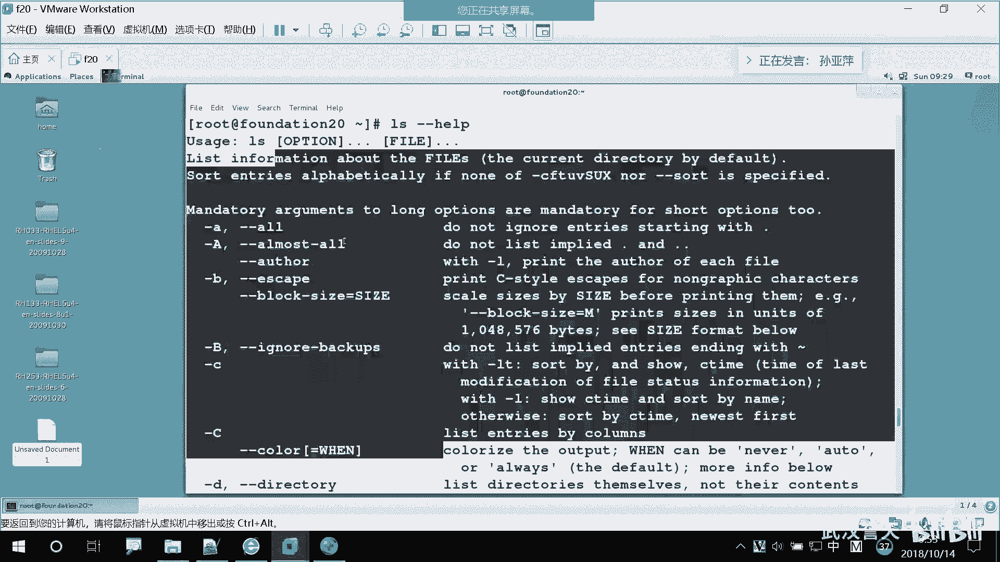

杠A就是杠杠窝啊，那么这个长选项啊这个长选项跟这个短选项能不能放在一起用呢？对吧杠杠or杠杠help。能不能这样子啊？回车。反正也执行了，对吧？但是好像。大家看看这里啊。

大家觉得这两个组合其实有时候没有什么意义。你刚刚握是显示什么呀？😡，权部文件对吧？但是刚刚help又是显示的。呃，全部的一个帮助信息。所以你看刚刚沃就没有执行。对，就没有执行。

所以有些长选项是不能组合的，长选项是不能组合在一起的。但你这样执行它不会报错。但是如果是这样子的话啊。LS杠杠wallhel。就是这样组合在一起嘛，对吧？回车。对。他就报错了。对他就报错了。

他报什么错呢？他说unrecnized这个是不可识别的。对，不可识别的啊。这个是可以识别的嘛，对吧？前面加个按就是不可识别的不可识别的啊，不可识别的options，不可识别的选项。

它就会认为all help是一个长选项。认为是一个长选项，因为没有这个长选项，所以报错了。对，所以报错了啊。所以我们的长选项是不能组合在一起的。哎，不像短选项这LS杠ALH对吧？短选项是可以组合的啊。

长选项是不能组合的。那什么时候用到长选项啊？我们有一些情况下会用到长选项的啊，后面我们慢慢呃一步步去来接触啊。但短有长，比如说啊杠A跟杠杠物是不是一样的呀，对吧？那你用长选项用短选项呢？

肯定是用短的对吧？对，我们都比较懒。2。嗯，这个地方呃选项这个地方大家呃不知道有没有弄清楚啊。嗯，后面呢可能是这样的啊，大家可以看到我们的LS我只用了什么命令跟选项吧，是不是还缺了一部分啊？呃。

贴了一部分叫什么？😡，参数对，其实我执行LS或者是执行LS杠A的时候都执行成功了。也就是说这三部分。并不是必须的对，只有命令是必须的，选项和参数都不是必须的对，都不是必须的那我想用参数怎么去用呢？

比如说啊S杠A呃S杠L吧。我想查看某这样的话，我是查看所有的文件啊。😡，对吧我还给建啊LS。嗯嗯。Bll， or table bell。后面接的是一个文件名，对，接的是一个文件名回车。那这样的话。

我是不是只看这一个文件呀？对吧我只看某一就是参数的意思就是某具体的某个对象。对，具体的某个对象一般就是呃具体的某个文件呢，具体的某个文件夹呀，对，具体的某个什么什么东西，对吧？啊。

那么你看我是没有加选项啊，所以命令跟参数也可以组合。那命令参数命令选项参数放在一起呢？它是不是显示的某一个文件的详细信息啊？对吧某一个文件的详细信息啊，所以这是完整的命令选项参数。对，命令选项参数。啊。

但是有一种情况下，你根本分不清什么是秘密，什么呃，命密可以分析啊，什么是选项什么参数啊。这样子啊。呃。你这能分清哪个是选项，哪个是命令，哪个是参数吗？啊，哪个是命令啊？哪个是命？前面两个。啊。

哪个是秘密啊？谈一下嘛。之前我说什么一切已。😡，啊，一切有文件一切都是文件是吧？你要想执行这一条的话，必须要以。😡，命令开头嘛，所以哪个是命令啊，肯定是第一个是命令啊，总不能是第二个是命令。

第三个是命令吧，对吧？肯定是第一个是命令啊，就摆在这里，我告诉你哪个就问你哪个是命令，那肯定是第一个。😡，也不能是最后一个，对吧？啊，那么。第二个是不是命令呢？😡，不是命密啊。对。两个命令不能同时用。

两个命令是不能同时用的啊。那我想两个命令同时用怎么办呢？我们后面会学对，如何把两个命令连接起来，但并不是纯粹的说中间有个空格，就把两个命令连起来了啊，这样是不行的啊。

这样是不行的那这个啊除了第一个后面全是。参数。对，后面全是参数。所以有时候一些呃一些那个呃分清啊，这个是什这个是干什么呀？这个是我们后面会讲啊，第二本书我才会讲。这个是用来先跟大家透露一下。

这个是用来修改网卡的。对，修改修改我们的呃IP呀呃修改配置信息就网卡的配置信息。这个命令比较难啊，有点难。嗯但是我们后面学完就不难了啊。啊，只是给大家举个例子啊。给你一条，首先第一个肯定是命令嘛，对吧？

不你不可能不可能是以其他的，比CON是命令吗？😡，你要检测一下是不是命令，你就NMCLI。😡，他出来的结果是不一样的呀，你看啊。😡，我用CON出来结果说什么呀？😡，命密没有找到对吧？

但是我用NMCLI回车哇，后面是它的。语法。对。他会告诉你哎，语法是什么样子，他说哎你后面好像少借东西了哦，对吧？所以你可以执行一下，看一下。好，我们的命令选项跟参数，大家呃还有什么问题吗？

这是我们后面执行我们的命令的一些基本的语法啊，大家会会用会会会用啊。起码你能看懂。啊，然后自己有几个那个啊，你看每一个item，每一个项，每一项之间，每一个条目啊，就是每一项。

每一个条目之间呢separated就是分开的，是为什么分开呀？by space space就是。不合啊。就是每一个项之间呢是要用空格隔开的啊，一定要用空格隔开。比如说我这上就是没有用空格隔开。哎。

我想看某一个文件，对吧？那这样行不行呢？肯定是不行的啊，为什么呀？那这样会报什么错，大家猜一下啊。😡，将会报什挫呀。啊。对。

没有呃command not found就是命令没有找到系统会认为这是一个命令。对，这是一个整体的一个命令，而他不会帮你分开，他可没没有那么智能啊，他不会帮你分开的啊。😡，对他直接就会爆。可以的。

这样子啊啊有同学问中间有不能有不能有多个空格呢？一个空格可以，对吧？能不能有多个空格呢？😡，你碰几个都无所谓，没事。对，可以控啊。当然可能有一些特殊的场场景，他只能要求有一个空格。当是一般情况下。

空格的个数没有要求，对，没有要求，随便你空几个。这个地方听懂了吗？好。这样一定要听懂啊，否则后面命令不知道怎么执行啊，我执行了半天看不懂，对吧？啊，然后他说这个参嗯这个呃是选项啊，选项是修改命令的行为。

那有一个single letter就是短横号呃，短横杠对吧？然后forward就是我么整个单词选项，单词选项就是用我们的杠杠来调用的啊啊，那单个字母的选项呢就是我们的短选项用一个杠来呃调用。啊。

argument就是我们参数，它是文件名。或者是什么呀，一些其他的data，其他的一些数据。对先数据对need对我们命令所需要的一些啊。好，然后那如果我想执行多个命令。对我想执行多个命令怎么办呢？😡。

我刚我们刚刚只学了一个命叫LS对吧？好，我们我们再学一个啊，然后再来啊，我们再学一个，然后将这两个命令结合在一起，怎么怎么怎怎么执行啊。好，下面有两个命令。一个叫date，一个叫CAL，一个叫date。

一个叫CALdata呢是你看。display它是显示日期和时间的显示日期和时间的CL显示的是。这什么呀？日历啊。就是日历啊日历的意思，它是日历这个单词啊，缩写CL看到吗？

其实有一些命密它是还是有一点那个来源的啊。还是有一点来越的。好。我们来执行看一下啊，data。回车。它显示的是什么呀？能看懂吗？这什么呀？这样星期天然是什么呀？10月october那个那个单词是吧？对。

然后是。14号，然后是9点。39分55秒对吧？然后后面是。年对，后面是年，它跟我们显示，好像我们是年月日1分秒，对吧？对，待会儿我们布置作业的啊，让他如何去显示学完这张啊啊。

还有一个名叫CAL对CAL回车。它显示的是这个月的信息，对日历对，日历现在大家一般都不用日都用手机看上面有日历，对吧？啊，10月份对吧？然后呃第一呃星期一星期二星期星期一星期二。呃。

什么sunday Tuesdayesday wednesday对吧？这些基本的单词大家要会要会看啊。啊，今天14号，所以这两个命令呢。对，是一个显示日期，一个显示日历。好，那我既想显示日期。

又想显示日历怎么办嘞？哎，那能不能这样子呢？dataCAL。大想一下啊，这样子的话痛。后面这个是什么东西啊？就是我这样一执行下去，系统会认为后面这什么东西啊。😡，函数啊。这样子。应该是参数吧。

目前我们来学的是吧？目前我们来觉系统会认为他是个参数对回车。他说这是一个无效的什么什么东西。😡，他说后面是个无效的，所以这两个命这两个命令啊，其实我们人为也可以认为它是两个命令，对吧？

但是系统并不这样认为对，系统并不它并不能识别后面是个命令，它只会认为是dta的一个参数，对，是dta的一个参数。那我又想显示日期又想显示日历怎么办呢？这样子啊，dta分号。😡，CAL。

分号用分号来隔开两个命令啊，用分号来隔开两个命令回车。看这里啊，是不是首先给你显示了日期呀，然后再给你显示了日历，对吧？再给你显示了日历。而且这个它有什么，这个我们一般不怎么用。😡，为什么呢？

因为前后两个命令之间是没有关系的，没有任何关系，没有逻辑上的关系。没有说data执行成功了。哎，我在执行或者是呃什么data执行失败了，我再执行。你无论你执行什么样，我后面都会执行。

他们是两个分格完全毫无关系的。这个能听懂吗？对他们两个命令之间是没有任何关系的。你有没有执行成功，跟我没关系。对，那比如说啊我执行失败啊，我前面我要执行失败。对，就这样子我随便敲的。前面执行失败了。

那后面会执行吗？也会执行，对吧？后面也会执行的啊，你看前面是不是执行失败了呀？对吧报错了啊报错了，但是后面呢也会执行。所以分号用分号去隔开两个命令，那这两个命令是没有任何逻辑上的关系的。对。

没有任何逻辑上的关系啊。这个能听懂吧？当然我们后面要学的是前后要有关系啊，要有关系。就比如说我这个执行成功了，我才能执行这样子啊，所以这个很少用对，很少用。就是我看一看。好。我们下面继续啊。

这是我刚刚说了一下它的简单的一个就是显示，它是dplay显示的意思。对，display是显示的意思。啊，那么我们之前刚刚啊也碰到了一些命令，对吧？也学习了几个命令。

但是呢哎好像都是我告诉大家是如何去用的对吧？那如果我给你一个命令da，它怎么用啊？对吧CL后面怎么用啊？LS我没有告诉你后面那些选项你怎么用呢？😡，对吧我们要会自己去用啊。

那比如说我给你一个命令叫data。这个地方啊。我们如何去获取帮助？他这个data是干什么的呀？哎，我好像认识他叫日期，所以我觉得它是日期，对吧？万一碰到我一个不认识的单词呢？

对吧不认识的单词它具体是干什么呢？怎么用呢？我们有以下几种帮助信息啊。他这地方也说了，他说do not是吧？不要尝试去记住everything，不要尝试去记住一切，为什么呢？记不住脑子装不了那么东西。

是吧？对，记不也记不住啊。😡，那记不住怎么办呢？查呀。😡，你说让我去找某一个命令啊，那个命令怎么敲怎么敲，我可能我一下子我也说不出来。但是哎你只要给我一个系统，对吧？我就能帮你找出来。😡。

最终帮你执行了就可以了啊啊就可以了。当然一些简单的大家要尝试去听一下啊，你不能所有都要去找找嘛？明明一个很简单的命令就敲完了，你还要去找半天，对吧？啊，就是各种级别的一个hap对吧？

各种级别的去从深从浅到深啊。第一个是what is。啊，第一个是what is对，第二个是command，什么帮助。第三个是man呀，in for呀，还有一些什么呃文档，还有一些其他的文档啊。

我们一个个来看啊，我们首先看第一个what is。what is meaning令呢？它是来描述一个对什么对命令的一个简短的描述。对，显示的是命令的一个简短的描述description嘛，描述对吧？啊。

那他描述什么东西呢？比如说啊。What is。what is啊，不是what is。是what is对。what的意对比的我的意思是吧？啊，what is date？我不是不知道date是什么吗？

那what is date回车。😡，对，what is data就这个很直白吧，是啥呀？data是什么呀？对data是干什么的呀？啊，这个地方你看啊data它说是什么呀？

打印打印打印一般就是打印到当前屏幕上嘛，打印到我们终端上就是打印的意思啊，或者是display就显示的意思。啊，打印或者是设置s，设置我们的系统时间和日呃系统日期和时间。也就是说data它可以什么样。

可以显示时间，是不是也可以设置时间呀？对吧比如说时间不准了，哎，我用daate来设置一下也是可以的啊。所以起码我知道data是干什么的对，起码我知道了啊啊，whatwhat is LS是干什么的呀？啊。

what is L啊？list啊列出。列出目录directies directory这个目录要认识啊。啊，后面是什么呀？有人有有有认识的吗？对，内容啊。列出目录的内容。列出目录的内容。

LS所以一般LS后面可以接目录，对吧？列出目录的内容，对它就这个功能就就只有这个功能，就列出目录内容嘛，就各种呃各种方式去列，对吧啊。What is C A L。那C也L是不是就列出一个日历呀，对吧？

列出一个日历好，what is我们之前写的什么呀？😡，Password。What is password。password是干什么呢？它是用来更新update，更新用户的认证的口令。说的很高大上，对吧？

就就密码。对，就是密码就是个口令啊，它一般叫密码叫口令嘛，tokins也叫口令。当然还有很多其他的功能，比如说它计算这个呃密码的哈希值对，哈希值。这个我们后面会说啊。然后它还是一个password文件。

对，因为这个这个这个它又又是一个文件，所以它这方也给你列出来了，看到吗？它叫password，就密码文件。它不仅仅是一个命令，它也是一个文件。对，它也是一个文件，所以都给你列出来了。

所以what is呢就是大大概的去了解一下这个命ing是什么啊，另外大家我还会遇到一个问题啊，就看这里啊。这个word is呢它是基于。它是基于dabb的，什么叫基于dabbase啊。

它是基于我们的数据库的。也就是说你在这里去查看，它是从数这些都放在数据库里面，你执行what is它就会从数据库里面去调用，把你显示出来。哎，一般基于数据库有点不好。对，它是在晚上才更新是吧？

update naturally对，在半夜的时候帮你更新。也就是说，如果你刚刚新装了一个。那用what is查不到的。对他会过一个晚上，然后第二天你才能查到。对，就这个意思啊。好。

那我就要现在查怎么办嘞？或者是有同学哎，我现在好像刚安装好一个操作系统，用word is它会报错。

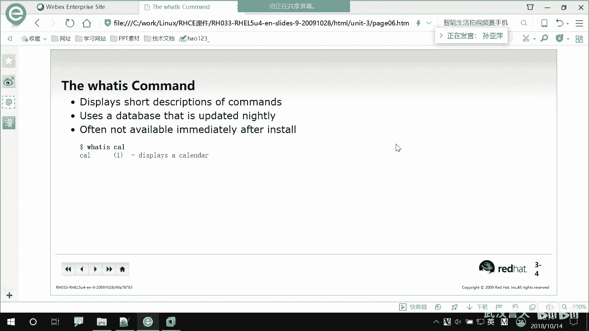

对，有没有同学报错呀？

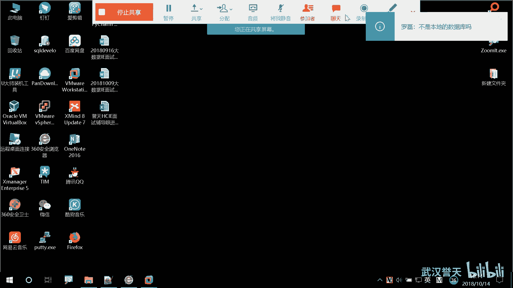

啊，是本地数据库啊。哎呦我的意思报错了。😡，哎，因为你的系统还没有过24小时是吧？对，还没有过一个晚上啊，你过一个晚上还第二天你就可以用了。哦，那我要等到第二天用是吧？对我教大家如何手动更新啊。

Update B。upd DB更新数据库嘛，DD不就是datbase嘛，对吧？你执行一下这个命令，word is就可以用了啊。对word is就可以实时的更新了。所以说。哎在在更新。啊。

更新完之后你就可以用了啊，因为我这个系统可能装过了不止呃不止24小时是吧？对，所以。你们刚装的系统，我的意思是执行不了的。😡，远生同学有问题吗？这个命令啊。你看这个地方，你看他这地方还专门有一句话说。

哎，他说after刚呃刚安装好之后是不能立即使用的对吧？对，not available available可用的是否可用的呀？in这个是什么立即的意思。啊，然后这个是呃最基本的就是what is嘛。

就是一个就看一些简单的描述，具体再多没有了。对，没有了啊。好，那么我们想看更详细的信息怎么办呢？对，LS有一个选项叫杠杠help。之前说过啊，叫杠杠help，这个选项就是用来帮我们查找帮助资源的对。

就是帮助资源的。而且很多命令都会有这个选项都有杠杠help，对，基本上都有对，基本上都有杠杠ha这个选项。然后回车。啊，大家可以往上看啊往上看往上翻往上翻。哦。这个地方有一个use age是用法。

用法的意思use嘛？use呃usus age啊语法用法的意思。用法是LS，然后option。option是什么呀？😡，选项啊选项，那这个是什么呀？啊。😮，命令选项什么呀？参数对参数。

但是这地方它接的是一个文件名。稳健啊啊。大家看LS空格中间有空格啊，有空格，然后option有个中括号，对，有个中括号。那中括号代表是。可选项。对，中括号代表是可选项。什么叫可选项啊？可有可无嘛，对吧？

有没有选项I是不是都可以执行啊？对吧。没有选项我可以执行，有选项我也可以执行。所以一般加了中括号代表这个选项并不是必须的。对，不是必须的，但是有些选项是必须的哦，我们后面会遇到啊。

有些选项它就没有加中括号，它就是必须要选的。啊，那么点点点是什么呀？省略号。点点点无语是吧？0顶点代表是可以有多个选项。可以有多个选项。点点点。多个选项这个能理解吧。

之前我们是不是有杠L杠H什么杠什么杠什么对吧？对，可以有多个选项啊啊，后面是参数，代表可选项，对，可选项点点点代表。可以有多个参数。对，可以有多个参数。比如说要给大家举个例子啊，LS。呃。

fill一 file是不是有两个文件呀，一个叫fi，一个叫fill，对吧？回车哎，后面是不是接了两个参数啊？对，参数可以有多个啊，那我能不能这样子呢？能不能这样子啊？啊，刚刚点点点不是没分开吗？

他也没有空格啊。好，那这样的话会执行成功吗？肯定不会嘛，对吧？系统会认为后面是不是一个文件呀？对，所以参数与参数之间也要用空格隔开啊，参数与参数之间也要用空格隔开啊，参数没办法合并啊。选项可以合并。

参数不能合标。好。再回到这个地方啊。再看一下，往上翻往上翻。我们把这个讲完下课啊。啊，下面你会看到啊嗯这个地方有一个什么，它这个是对它一个简短的描述，对吧？对，简短的描述，他说是列出信息呃。

我们fi呃文件的信息呃，是当前目录的，默认就是当前目录，对吧？啊，然后这个是它的这些。选项有哪些选项啊？杠A啊，有杠大A有杠B。那后面这个就是长选项，这个跟它的效果是一样的。然后你看啊杠D。

当地是杠杠directory对吧？哎，还有很多呀。还有杠刚help好多选项。你看这里还有刚刚ha对吧？这都是他的选项啊。所以刚刚刚刚help就是能显示这个一些详细信息啊，就是一些帮助的一些稍微详细一点。

对，稍微详细啊，那刚刚help不好用在哪呢？大家看到我这样是不是上下在翻呢，鼠标上下滚动，对吧？啊，那比如说啊在这种情况下。

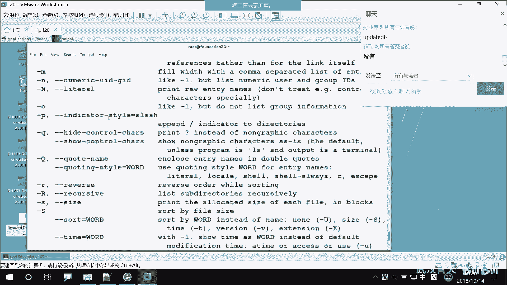

对吧在这种情况下啊，然后呃LS。

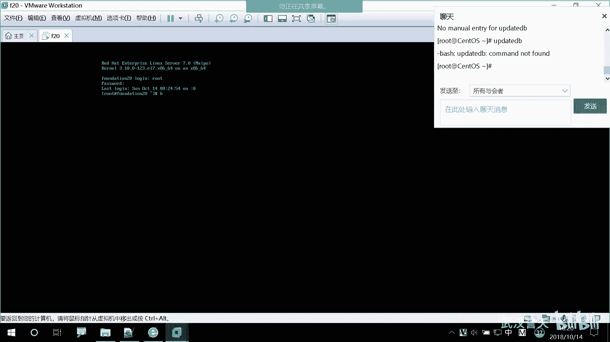

杠干ha。没错。哦，你上向翻了。搬不了对吧？那上面的是不是就看不到了呀，对吧？没有办法往下翻啊，当然我们后面也会学。这个命令都没有找到。嗯，然后。

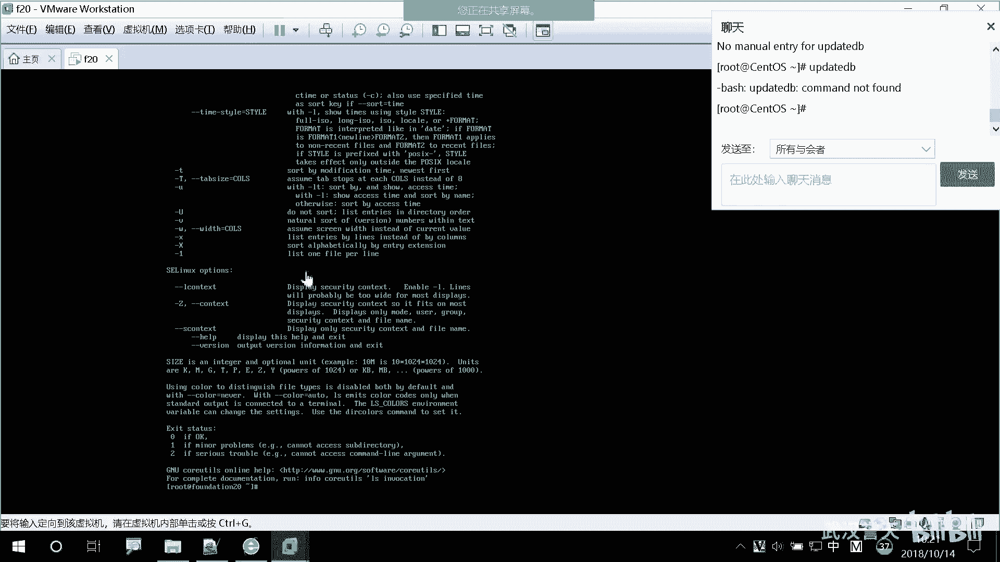

那这种情况下我就翻不了了。对，翻不了了，那怎么办呢？我们还有一个更强大的功能啊。

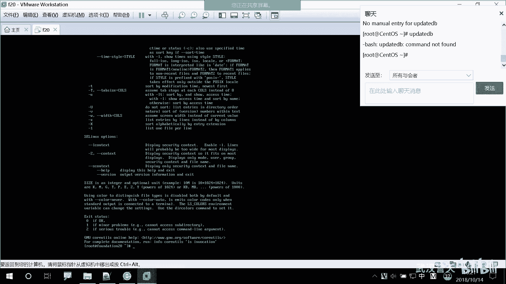

叫慢。好，下课下节个再讲啊。休息15分钟。

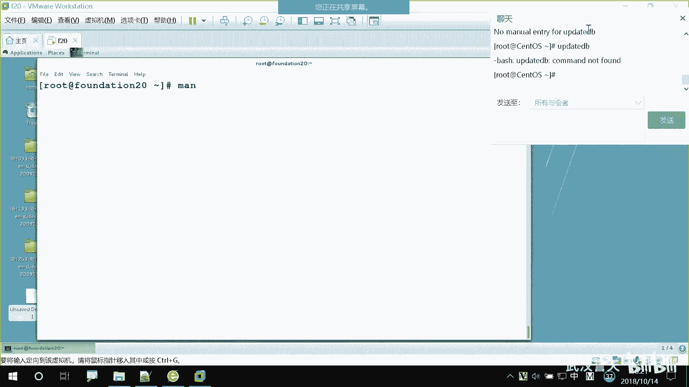

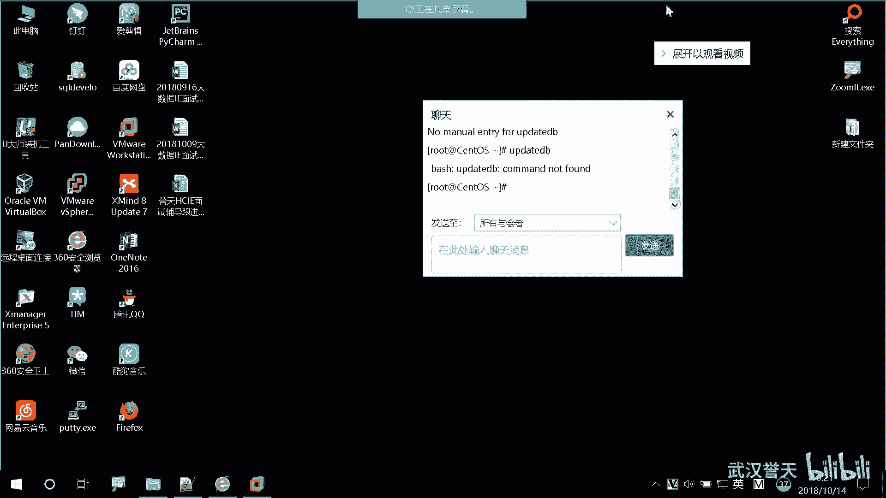

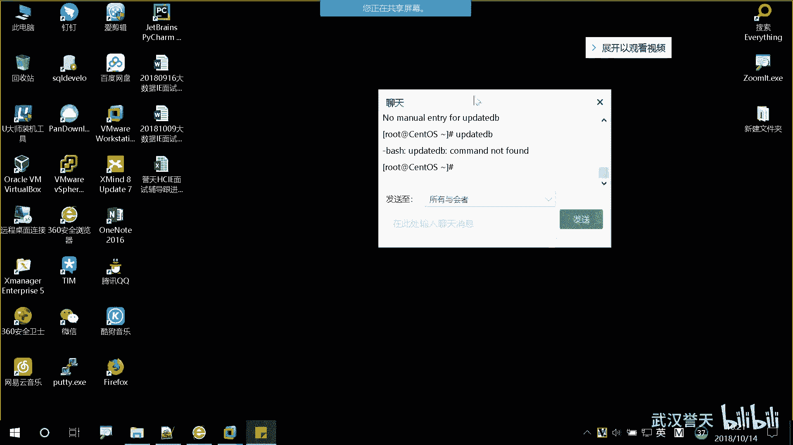

那可能是不是渗头S跟着有点区别啊，跟我们这个。到。知道啊。

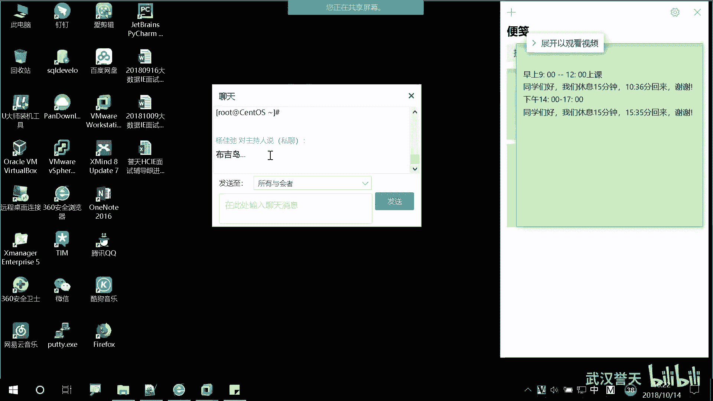

你就跟我版的一样吧。你有时地方可能不太有有点还是有点不一样。这需要查一下。

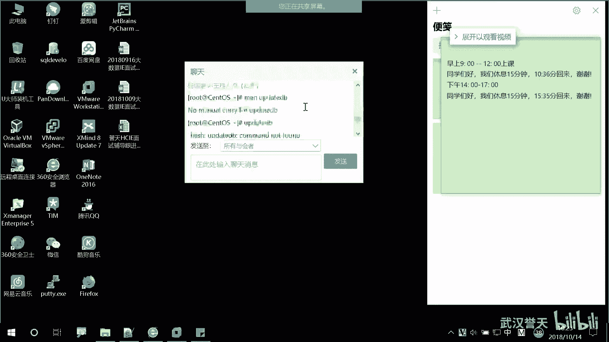

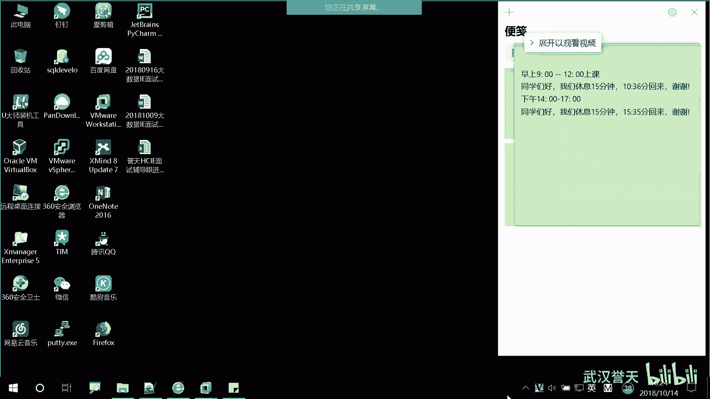

可以。交权限。你们可以在这地方选所有所有与会者吗？这地方选一下所有与会者可以吗？这地方能选所有与会者吗？如果选不了，让班主任改一下。你们俩是吧。Yeah。不。

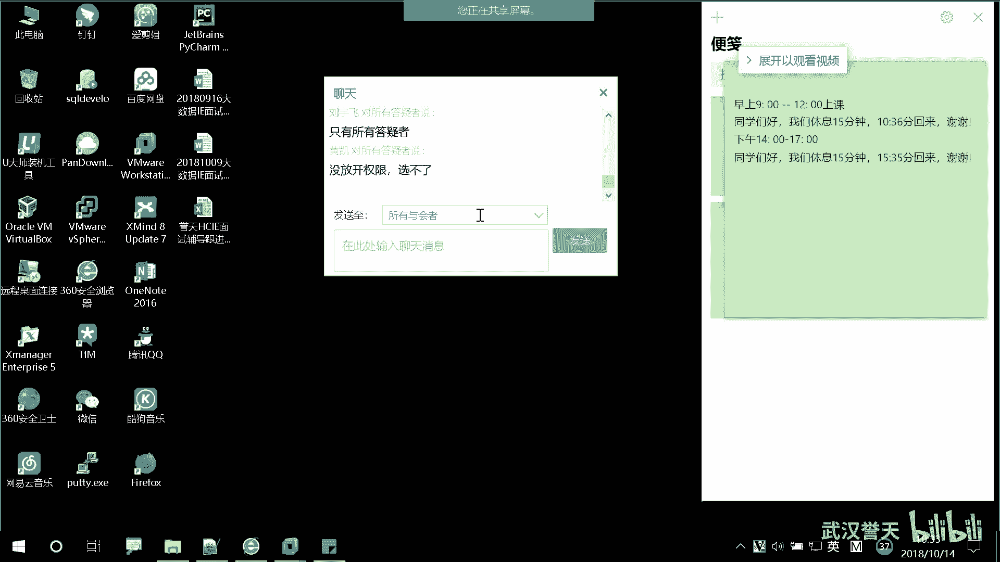