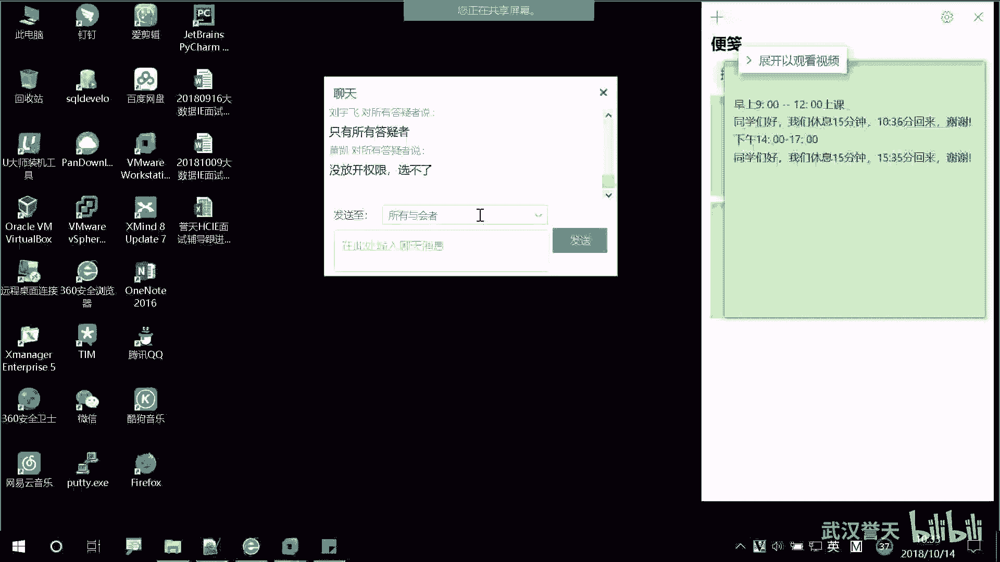
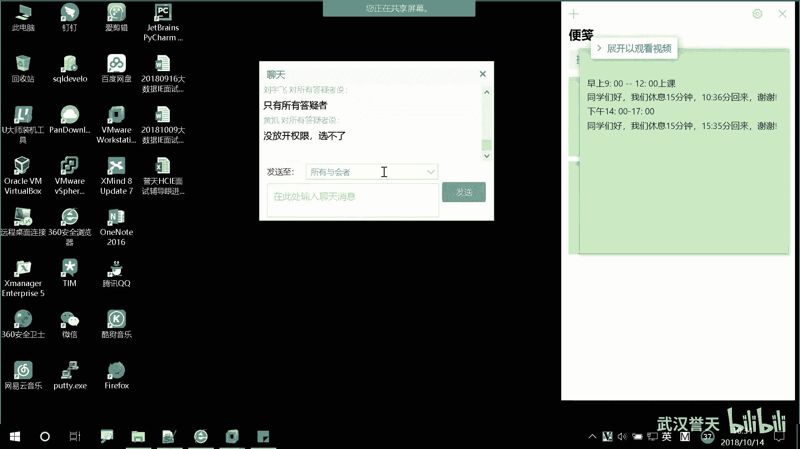
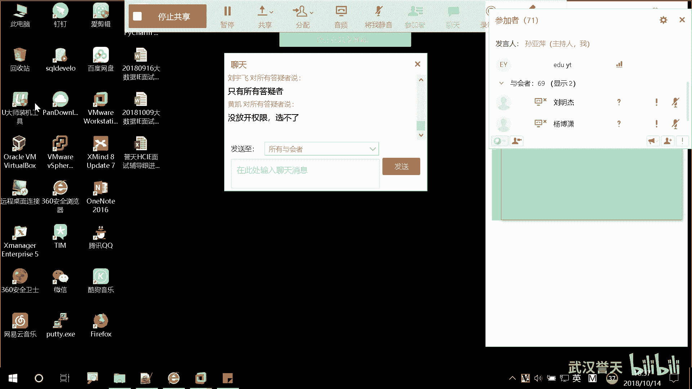
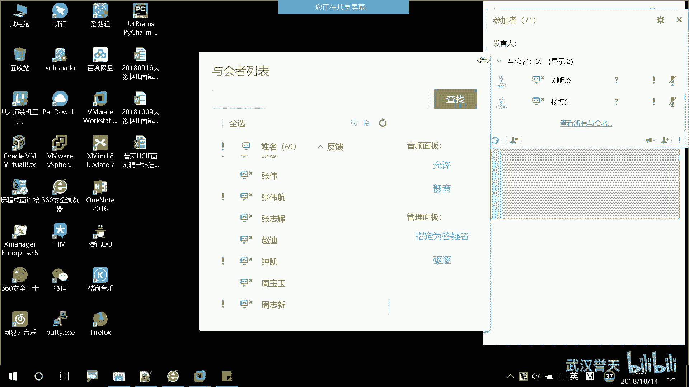
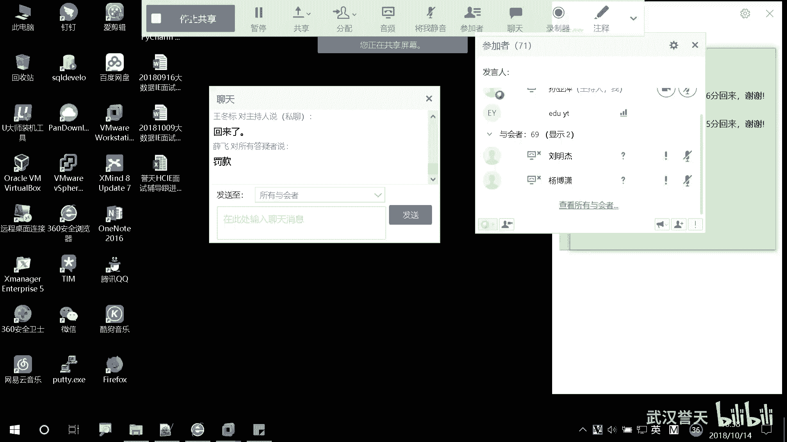
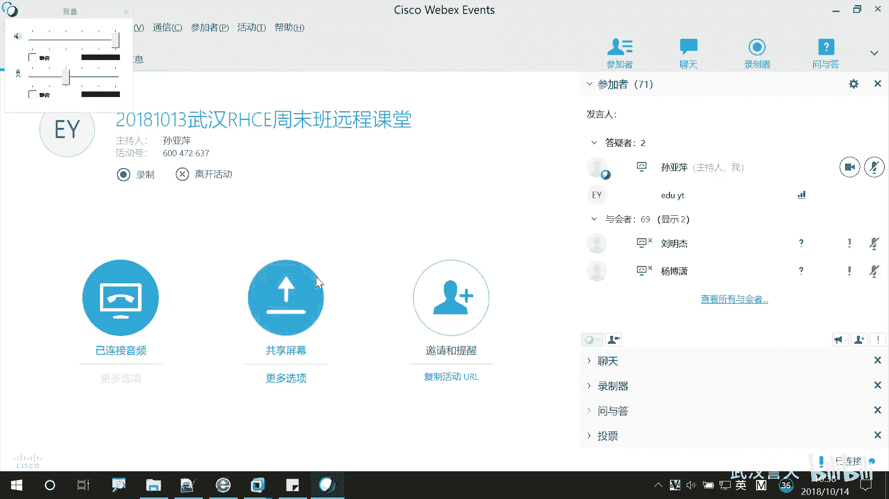
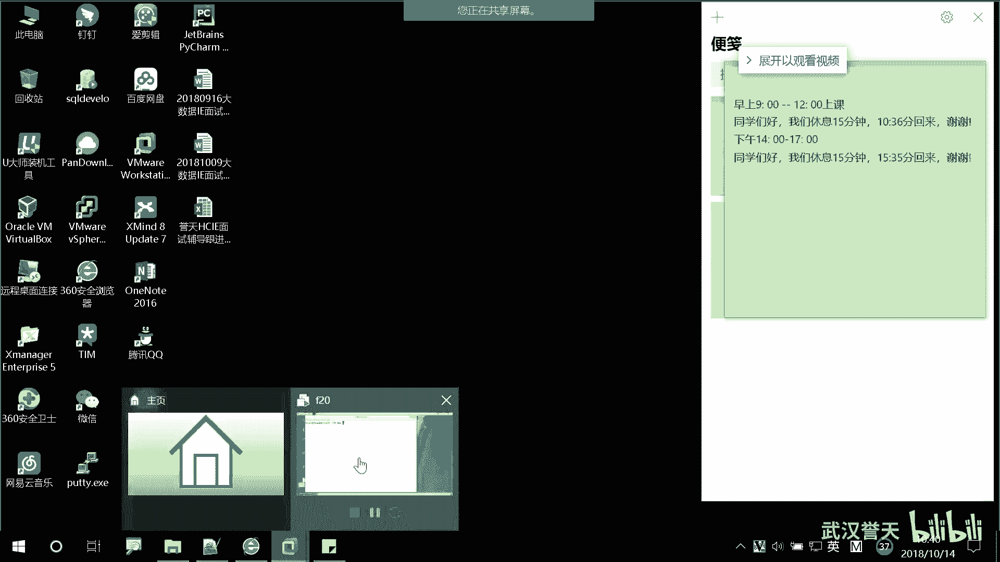
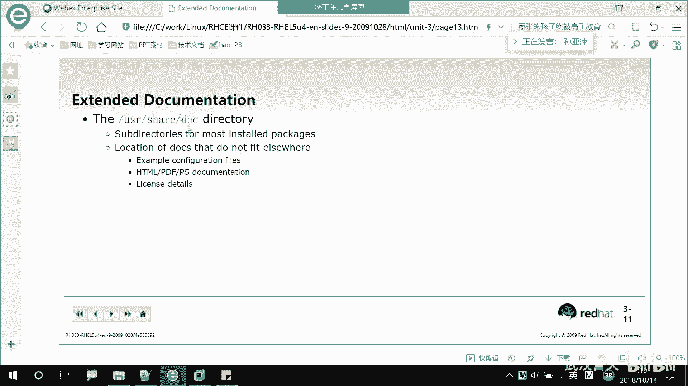

# 誉天-Linux／红帽认证／RHCE／RHEL7基础操作视频 - P15：04 运行命令和获取帮助_3 - 武汉誉天 - BV1xr4y1K7Aj

What。我这。好像我那个。跟我说一声。什么。公行。反正把事同。那我就。O的。关安你。坐下。远纯同学回来了吗？

嗯，回来了啊回来了。😊，嗯，等一下啊，我把那个权限。因为我不太会调，我那个让。就你自己。嗯，说一下啊，我们上早上9点钟上课啊，那比较迟到啊。我还以为昨天上完，今天早上9点钟把人家上跑了呢。都迟到了是吧？

明天抓迟到的。哥我现在名单还没有拿到，都不认识你们叫什么。😡，来了啊。

别天那家稍等一下啊。

对，than you。嗯，那个远征同学可以把那个聊天的那个地方改成了，改成所有与会者了啊，可以了。然后所有人都可以看到。好的。啊，然后说一下上课啊，上课我们是9点钟准时开始啊。

因为呃其实我也想等一下你们，但是因为远程也有同学。同学也在等，所以呃你们尽量早一点，好吧。嗯，可能有同学住的比较远，对吧？呃，辛苦一下啊。之前也有同学来这边上上课的啊，呃。

住的早上好像两两个小时左右过来，早上很大一大早就起来了，晚上很晚回去，哎，大家为了学习，对吧？回到学校知识，辛苦辛苦啊。

啊，我们继续啊。嗯，我现在有名单了啊，然后。就可以。那是吧。远神的同学哎，还有一点啊就是。要说的就是。大家可能也去申请视频了，对吧？可能也申请视频。但是我希望有有同学我希望啊就是。上课呃。

尽量本地的同学还是来本地啊，样这样效果就会好一些。有什么问题要吗？我可以当面解决。对，如果你再远程的话，我可能就有点顾不到你了，对吧？你有可能你。名字在那儿对吧？可能人不在。都没有。

但是起码你在这儿我还能监督一下你。然后呢，不懂的地方，你可以跟周围的人稍微商呃，就是讨论一下，商量一下都是都是可以的啊。这边还学习效果要好一些，所以希望大家坚持坚持啊。嗯，我本地应该是有3哦，33加上。

10个就是43个人。这应该是40左右吧，40左右。好像有的直接报了本地的，直接在远程的是吧？唐晓明同学。在远程。韩晓明在这。等下。加微信呢，我都不知道是哪是你。好，我们上课啊。嗯。

刚刚我们有有说到两个帮助，一个是what is还有一个是杠杠help啊，杠杠help好，那么杠杆help呢，其实它已经显示了部分部分的帮助信息。但是一方面它不方便，因为它一下子一屏全显示了，对吧？

比如说候你还往前翻，对，往前翻，找也不好找。那这个时候他就不太适用嘛，对，不太适用。那我们有一种更适用的就更常用的方法，也，更常用的帮助叫man。对，man man不是男人啊，不是男人。

不是男人的意思啊。😡，嗯，他是没有。nyou叫什么？😡，手册对手册。然后的缩写对吧？MAN取3个是？man你man一下呀，对吧？之前有同学说人工man是吧？😊，老是问别人，对自己不手动自己去卖。

然是问别人人工卖啊。那就是你你不会语法不会，然后就具体的信息那个怎么去敲这个命令慢一下，对吧？慢一下好，那我们来慢一下啊，慢一下LS。😊，对，然后它就进入到了一个你看进入到一个界面，虽然也是上下滚动。

但是我们有快捷键啊，快捷键可以快速的去移动。比如说啊。呃，我想回到这个最底部，回到最底部，我们可以摁。shiftve加大G。shiftve加大G。对，shift加大G，然后。想回到最上面怎么办嘞？😡。

两个小G对两个小G摁两下啊，G小G摁两下。就回到最上面了。对，回到最上面了。啊，那比如说我想去查找某一个关键词，对我想去查找，这是一个相当于是一个章节吧，打开了一个手册的意思，也是一个章节。

那我要想去找某一个关键词怎么找呢？这样子啊，摁一下斜杠，就是那个问号shift旁边那个斜杠摁一下，左下角会出来一个斜杠，看到了吗？然后比如说我要找一个当关键词叫。LS对，叫LS我回车。大家可以看到啊。

所有的LS都标亮了，看到吗？都高亮了啊，高亮了啊，那么我可以在这个LS。呃，标亮的就高量的这些L关键词之间呢相互呃就之间移动，就向下移动，怎么向下移动呢？小N小N向下移动，在关键词之间向下移动。小恩。

然后endshift加N，就是大N向上移动。对，然后小N向下移动。大N向上移动。对吧。啊。那我想把这些高量取消掉怎么办呢？没有键可以取消掉啊。对，可我想不想看了，我想换一个或者不想看了。怎么办呢？

斜杠随便敲啊，随便敲。没错。那找不到嘛，所以就取消了，对吧？斜杠随便敲啊，他就取消了。对就，他说没有匹配，没有任何能匹配到的就取消了啊。啊，上下移动啊上下移动就是呃上下移动，你就上下键嘛。

也可以上下移动。然后那个空格键呢是翻页，对，空格键是翻页啊。上下移动就上下键移动就可以了。对上下键移动就可以了。好，然后要退出怎么办呢？看下面啊，他下面会教你，他说NH呃是帮助。NQ。退出对NQ是退出。

就是就Q就是这个单词。QUIT对QIT啊，NH它可以帮助，你看到没？NH对吧？你看他他是怎么上下移动啊，怎么就去对好的帮助信息。啊，NQNQ退出来啊，又回到这个界面了啊，要回到命令行怎么办呢？

NQ退出来了啊。对嗯Q就退出来了，大概这个用法应该会了吧。哦，那我们再仔细看一下里面的具体内容啊。大家可以看一下，其实这个慢帮助手册呢。很清晰呃，就像比刚刚那个要清晰清晰在哪儿呢？首先啊你看。

是name对吧？名字是什么呀？这个命令名字，然后后面是不是相当于是那个what is的内容啊，对吧？就是列出目录内容吧啊，这个单词啊也是语法的意思。对，目前我们碰到了呃几个。呃，us age是用法嘛。

这个是语法一样的意思啊。啊，它的语法是LS，这个跟那个呃慢那个那个杠杠help看到是一样的对吧？对这个是没没什么区别啊啊，下面这个地方一个description。描述。对，描述信息。

它会稍微对这个命令进行一些简单的描述。对，简单的描述啊，那么描述完之后，下面就是什么呀？选项对，就是选项。好，往下翻啊。好，全都是选项选项。而且他还有很多很好的，就是很多秘令啊。

你看这个地方它有个auor，就是作者的意思。对。慢帮助手册他会他会就是一些，你看这是谁写的呀？作者是racachel这个人对吧？他写的对，这是这样的啊，我们每一个命令他并不是由某一个组织。

开发的或者某一个个人开发，而且有很多很多的作者，对很多很多的作者去供就是开发完了之后就可以放里面。就比如收集吧，一般都是那种开源的啊，开源的应用程序对，放在这里面。

所以这个所有命令都是有很多作者写的对你又你觉他写的不好，对吧？你给他给他发邮件是吧？你写的不好，给他改一下是吧？啊，然后这是他的印刷啊，copyright。么印刷版啊，就是版权什么之类的吧。啊。呃。

这个地方它还有一个好处。这张可能看的不太清楚，不太清晰啊。s also。C also就是与这个命令与之相关的，还有哪些命令？这个地方可能没有，我再给大家看一个特殊的啊，我们们呃。d看一下有没有啊。

搬到最下面。呃，这个点好像也是没有。Don嗯。看始。好，这里啊你看say also，我我就卖一个命令，对吧？与之类似的一些其他的命令，它也会放在这里，看到了吗？

如果你就你觉得哎这个好像是修改那个什么什么网卡，对吧？但是好像与修改网卡类差不多的，也是类似也是修改网卡，但是不是这个命令，那你可以卖一下它。然后下面有个say also。就是你还可以参考这些命令。对。

像相关的一些秘密啊相关的一些秘密。所以man它很好用。好，那么再看一下有什么功能啊，我们来只看几个啊，看几个具体的。哦，LS看过了啊，L没什么好看，就看嘛。我们慢一下。Date。问一下date2。

date呢是打印一个设置系统时间跟那个那个日期跟时间，对吧？它的语法呢是date，然后后面啊看着它的语法是。就是选项吧，对吧？它可以有多个选项options，然后点点点对，点点点是有多个选项。

后面它这个地方并没有写什么，加的 format。大家可以把它当做是一个参数，对，当做是一个参数。那么这个参数是不是可选的呀？对吧它是可选的啊，然后加format到底是什么东西呢？

formmat又是什么东西呢？对，一般format这个单词它怎么翻译啊？格式对吧？对，格式。比如说你格式化格式化就是form这个单词。对，就是格式化，它是格式的意思啊啊，那么form到底什么呢？

我们可以往下翻啊，在这个地方看到了吗？对，下面就是formmat，它可以呃forat什么呀？就这种这东西这东西。好，待会儿我会在这个地方布置作业的啊，大家这个地方要仔细听啊。好。

我们先把这个语法规则看完。date然后这个地方呢它显示了一个也是个共中号括起来了。然后它有几个选项，一个是杠U，一个是杠杠UTC，一个是杠杠universal哦，这三个啊这两个是不是长选项，对吧？

这个是短选项，那么中间呢用竖杠隔开了，对，用竖杠隔开了，那么用竖杠隔开代表是这三个呢？或者的关系。对，代表是或者的关系我嘛，对吧？我或者的关系，就是或者他或者他或者他这三个是一样的。对，是一样的。

所以是或者的关系选一个就可以了啊。哦，我们看后面这个啊，后面这个有多个中括号，对，有多个中括号。那中括号嵌套中括号。好，我们来分析一下啊，最外面的中括号看这里啊，最外面的中括号是这个跟这个对吧？

就是最外面中括号啊，大家可以分析它的关系。比如说。最外面这中号相当于说这后面是不是整个是可可有可无的呀？对吧整个是可有可无的好，那么这个中括号这个中括号在第二层啊，第二层是哪个？哦，这里有两两个。

第二层有两个中括号，这个还有这个对吧？那么这两个中括号，这个中括号跟这个中括号。对于外面这个中考是怎么样？是可选的吧，对吧？就是如果你这些是有的那里面没有是不是也是可以的？对吧？好。

那中间呢又嵌套一个中括号，所以这个中括号是这个中括号的可选项。对，是这个中括号可可选项。那具体这是什么东西啊？不慌啊，我们这个慢帮助里面找不到。对我们学完慢帮助，还有另外一个更详细的信息。对。

我们在那里面去找啊，这个地方我们我现在好像也不知道它什么东西啊，好像大概就是我们也见过MMDDHHMM我猜一下啊。好像是什么月日。十分对吧？啊，分M minutes对吧？迟H是R对。

然后CC那真不知道是什么东西的，对吧？好像没见过YY呢。年对吧？SS。对，有可能是秒对我们猜的对吧？那具体是什么？我们待会儿去找啊哦，而且这会儿呃。好好，就这样好，那么往下看啊。

description它说是呃什么呀，显示的什么呀？parent time。显示的是当前的时间吧。对，显示的是当前的时间in the given，就是你可以给定它一个格式去显示当前时间。

那其实我们直接执行date的时候，是不是显示的是系统给我给我的一个格式啊？对吧它是一个呃什么先星期什么什么之类的啊。那我们可以让它怎么显示呢？哎，我可以让他，我想让他用什么样的格式。

就可以用什么样的格式显示它或者是可以什么设置日期啊，下面有个选项，看一下杠D什么意思啊。杠D是它的一个选项，它可以用杠杠data后面这个啊。这是两个啊，你杠D后面接后面接什么什么呃一个东西，对吧？

但是这个语法是杠杠data等于什么么东西？😡，对，这个str是什么东西啊？😡，啊。这不串吧。😡，你该是字符字不穿的意思吧。😡，对吧那corctor也是字母串的意思，对吧？啊，它显示的是什么啊？显示的是。

这个时间显示这个字符串的时间，而不是什么呀，而不是当前的时间。所以如果你要显示某一个时间，而不是当前的时间，那你用杠D这个选项这个看懂了吗？对，杠D这个选项啊。或者用杠刚da。啊，下面还有很多啊。

比如说你看这个地方杠R杠杠reference，它这个是显示的呃，这个地方可能大家。我们学时间初二的时候就知道啊，它显示的是什么呢？显示的是最后的修改时间modification。得modify修改嘛？

modification就是修改的时间。他显示的是一个文件的什么呀？修改的时间。反正都是时间嘛，各种显示各种各样的时间，对吧？所以你可以看这些选项来去满足你所需要的要求。对你想怎么样就怎么样，对吧？

你看这个方设，如果你要设置时间怎么办呢？😡，杠S。对，杠S就是这样子啊，它这个短选项呢，它不是用等于号。就是如果你是用长选项，后面是不是等于一个字符串呢？对吧字符上可能是2018年几月几号，对吧？

这样子，那如果是杠S的话，后面是空格，然后加一个字符上。对，他是这个意思啊啊，然后设置的是他描述的时间，就是你把时间设置成某个某一个时间，就把这个时间改了嘛，那就就把时间改了啊，把你的系统时间改了。哦。

这个是什么打印的UTC时间，对，是UTC时件哦，不是本地时间啊，UTC时间好，这是一些基本的大概会看啊。好，我们再换一个啊，man一下CAL。问一下CL。这个地方。好，CAL是显示什么呀？日历对吧？

它的语法是这样子的啊，选项后面也是几个空格，也是几个中括号，然后最外面是年，对吧？啊，我们这个地方来给大家举个例子啊，怎么显示啊，怎么显示？比如说我要显示某一年的怎么办呢？

CAL2018年呃2017年我想显示去年的日历对，回车。他就把去年整年的日历是不是都显示了？😡，对吧显示某一年的啊啊，那我想显示某一年的某一月显示啊。先看一下语法规则啊。显示月怎么显示啊？😡。

这是不是有个mo啊？😡，对吧有个mon就是年里面嵌套的月。那你那这个mon的位置在哪里啊？😡，是在年的前面吧。啊，你不要觉得哎慢子就就CAL。CAL2017呃，12月份这样子它是没有办法识别的啊。

他是没有办法，他是他说是哎什么illegal就是不合法的什么什么值是吧？好像没有这个对，年好像他是他把这个认为是年了。啊，CAL12就12月份2017这样子啊，前后月在前，年在后，而且怎么样啊？

中间要有空格，我怎么知道有空格呀？是因为他这个语法里面就有空格吗？你看这地方是不是有个空格呀？那如果没有空格，中间是不是紧紧挨着呀？😡，对吧所以这个地方要注意啊，有同学直接122017万为什么？

没有呀啊，不是。没有啊。1220。你看他就会认为是。年是不合法的对年是不合法的。所以中间有空格啊，所以要你你要显示某一年，那我要显示某一天怎么显示嘞，前面是不是继续加10号，比如说10号要空格隔开啊。

而则它就给你标亮了，就这个意思，他也不可能把就这一天显示了，这个日历对日历显示的啊。所以这是CAL用法。CAL用法就是你们自己可以去带着大家看了一个几个啊。自己去看这里有好多，你看到吗？

各种各样的显示显示sunday啊，还是mon呃呃什么monday，对吧？盐等等。我下面可以去尝试啊啊，那么我们再来看一个啊。CP。这个命令。这个命令我们在第四章的时候会具体介绍它的用法。

但是我这里给大家看一下语法规则啊。CP是什么呢？复制copy。对，就是copy的意思。所以CP这个命令就是用来复制用的，复制文件呀，复制什么什么目录啊等等这些好，我们来man一下，我不知道CP怎么用呀。

对吧？man一下CP。他说是复制文件跟目录，看这里啊。它这地方列了三个语法规则，1个CP，然后后面是什么选项也是有多个选项，这个就不多说了啊。好，这个地方有一个选项，它是括起来。

也是可选项或者是什么什么之类。哦，下面看后面啊，大大家猜一下后面是是什么呀？就是命令选项，还有什么？反正不知道是什么，但你先猜一下，就是大概是是参数吧。对吧它是参数哈，这个是sourcece吧。😡。

source就是。😡，Yesest。dest是destination， destination目的地的缩写。对，sourcece是什么呀？😡，圆对大家可以想一下CP这个复制的动作。

我们windows是分两步吧。复制跟粘贴对吧？对你先鼠标复制一下，然后再粘贴，能不能一步完成啊？完成不了，对吧？但是在我们的linux当中是一步完成的啊，它并不是哎先复制一下。

然后再跑到另外一个粘贴一下。不是这样子啊，它是一步完成的。所以如果要想一步完成的话，那你是不是既要有缘，又要有目标啊？否则你是不缺了一个。😡，啊，在想是实。所以这个两个参数大家看它是不是没有加中括号啊？

没有加中国号代表是。B选项对，没有加中括号代表是B选项。所以CP这个命令必须要有三部分，一部分就是命令原目的地。对，命令呃原目的地。就你复制别人的东西，你要你要复制到哪个地方啊，起码要有。

如果你只敲两个，他肯定会报错，他说缺少什么什么东西。对，这个是不成功的，因为它是一步完成的啊。好，看这个地方啊。下面还有1个CP，然后这个不说了，sourcece后面接了三个点，对，后面接了三个点。

那三个点代表什么意思啊？是不是可以复制多个圆呢？那圆与圆之间是不是要用空格隔开，对，要用空格隔开啊，然后后面是。DIR。Diirrey。directory是目录的意思。对，是目录的意思。

那目录能不能有多个呢？这个是不是就是dath呀？😡，是目标呀。对吧啊，就是呃这就是那个那那个呃是那个目录啊目录。那么你就是什么意思呢？这个就是你可以复制多个圆，但是目标只能有一个。你只能复制到一个位置。

对，就这个意思啊。😡，能看懂吗？看懂啊。好，下面看这个啊。这个有个选项，没有加中国号。没有加中国号，代表的是反转的意思就是。反过来，他是先把目那个那个目录是不是写前面了呀？😡，而。

这个目录是把目的地写前面了，然后ss是不是写后面了？😡，所以那这样的话，你加了个杠T的意思。😡，那就是你这个这个地方位置写的是不就是目标，然后后面才是圆呀。那如果你不加杠T，是不是先写圆再写？目标对。

就这个意思啊。所以这个地方也给大家看了，不加必必须有的选项啊，必须有的选项。啊，这是CP啊，先给大家看一下语法。啊，我们慢帮助还有很多啊。呃，这些我已经讲过了吧。呃，就是杠杠help man。

然后他是就中括号。呃，这是间号，间号它是什么呢？它是变量的意思。对，这是变化的量和变量的意思啊变量的意思。嗯，点点点代表是一个就是列表，就是可以有多个的意思，多个选项的意思。

然后这个代表是或or代表or对吧？X或Y或Z，但是不能选两个，只能选一个啊，选一个就可以了。然后杠ABC呢就是哦，这个我们讲过吧，这个是是把短选项放在一起啊，对吧？啊，继续啊我们慢帮助，其实啊。

他还提供了很多手册。他其实默认。比如说啊我们man L进去，大家可以在这个地方看到一个小括号一。那这个一呢代表是慢帮助的第一个章节。哎，那有一个章节是不是还有第二个章节啊？对我们一共有。

几个章节来着8个章节还是9个章节啊好，那具体有几个章节呢，我们可以慢慢一下啊。慢慢一下，对我来慢不知道怎么用，对吧？就慢一下慢。回车。好，往下翻啊，在这里。123456789。

慢帮助一共有9个是呃9个章节。刚刚我们这样man L默认是不是进入第一个章节啊，对吧啊。manCP是不是第一个章节啊，在这里看啊，第一个章节好，那其他章节是干每个章节是干什么的呢？来慢一下啊。

第一个章节他是一些。呃，描述什么呢？描述就是第麦帮助的第一个章节啊是一些可执行的程序。其实我们慢的时候，不仅可以慢命令，还可以man文件，还可以卖一些什么特殊的一些呃其他的呃呃其他的字符啊。

所以第一章呢一般是呃一些命令的基本的用法命令的基本用法。对，叫commands嘛，对吧？可执行的一些程序L其实它就是一个可执行的程序。啊，然后第二个章节是一些什么系统系统调用，一般是我们内核的功能。对。

我们这种有有几张。不太常用啊，这是方式嘛功能对吧？函数什么之类的。然后这个是lib什么什么酷 cool的意思啊，libry是吧？库调用什么库调用的一些程序的库调用。不调用什么东西呢？就是。

库嘛就是呃有可能执行一些程序，可能需要用到的一些文件。比较酷嘛。啊，然后special就是特殊的文件，这个特殊的文件在DV下面对，在DEV下面。那特殊文件包括什么呢？包括一些字符文件。

其实大家我们之前有说什么一切就文件吧，对吧？其实像我们这个终端呢，它也就是以文件的形式。😡，对吧它也是以文件的形式存在的。我们的磁盘是不是以文件的形式存在的呀，对吧？它在DEV下面。

所以第一位下面有很多特殊的文件，对，你也可以去卖，对，也可以去卖啊。第五个呢是我们的文件的form格式，以及它的一些呃语法规则。比如说。你要有一个，我们之前说过password，它既是一个文件。

又是一个命令，对吧？那password呢放的是我们密码的信息啊。我给大家看一下啊。用户的信息，我打开VM打开啊。我打开这个文件，它在这个目录下面对吧？打开这个文件好，这个文件是可以拿来编辑的啊。

而且我们还可以拿来看，那具体这里面写的是什么东西。我要编辑的时候，哎，我该怎么编辑呢？对，怎么办怎么写啊，我们可以men。曼5password。那五怕是我的五代表是慢帮助的第五个章节。

慢帮助的第五个章节，回车看下面啊，你看。这个地方pass word是不是一个password文件呀？😡，啊，往下看啊，下面你看。他这个地方就是每个区域代表什么意思都告诉你啊。第一个代表name。

第二个代表密码。第三面什么UIDGID什么什么什么之类的。对，那你就你看一下这大概的一些描述，你就知道是干什么的。所以我们慢慢啊。第五个章节其实还比较常用。对，比较常用。哦。

那如果你慢一慢一pasword是不是就慢秘密呀？😡，对吧就是命令的语法啊。呃，这什么一些特殊的些特殊的那个比如man man呀，这个man growth这个我们后面会会带大家看一下啊。

这些什么特殊的这个单词我也不知道怎么念。一些包啊什么什么之类的。哦，第八个啊第八个是我们的系统。就叫administration，就是管理员的命令。对呃，经常是嘛root对，经常是root。

就是一般情况下呃。普通用户有些命令是不能执行的对吧？只有入的用户才能执行。那么这些命令。他是曼达。对，是曼巴。比如说啊我卖一下一个特殊的命令叫fordi。fordi呢它是用来分区的。

那分区的这个你想想一下，有可能我不太清楚啊。呃，有可能。普通用户还执定不了，只有ro的用户才能执行，对吧？那我们就卖一下喽。这个时候你会发现这个地方是不变成8了呀？

对吧所以一般第八个章节都是放的一些root的，呃，只有root才能执行的命令。对，只有root才能执行的命令。一般普通用户都能执行的命令就在麦一里面。对麦一，那这个命令肯定就没有麦一啊，对吧？

那默认是不是进入漫8呀啊。再来啊还有一个叫什么呃。什么coel什么rooting，对吧？这个。这个也不怎么常用，非标准的看上最重要的几个啊，一。5。8。对，158这几个是经常用的。嗯。这样子啊。

我们默认慢L它进入的是第一个章节，就是有可能我们一个命令。它有多个章节，对吧？但是并不是每个章节都有。并不是每个章节都有啊，所以它只有一些呃个别章节才会有。那你像那些只有文件没有命令的。

是不是只有man五啊，对吧？所以你要慢某一个章节，那你比如说我想漫5L有吗？你没有吧，对吧？LS它不是文件的，所以慢五他是你看他就会报错，他说没有文件。对，没有文件。

所以并不是每个命令都有那个呃都有呃这9个章节的啊。而且如果说它有多个章节的话，它默认是从上往下，比如说我有158，对吧？这几个章节，那你去慢什么都不加，中间什么都不加，那它从一开始匹配。对。

从一开始匹配。那如果你要慢特定的某个章节，那你就慢慢。对，慢级就可以了。嗯。那比如说啊。我有一个命令，我根本不知道他在哪个章节，有没有可能，对吧？😡，而且这个命令呢我还记一半儿，我记不住，记不全，对吧？

我只记某一个。哎，比如说我只记得pass，但是我又不知道他在我想去找他，我要就看他的慢帮助信息，但是我又不知道哪个章节，那怎么办嘞？这样子啊。😡，M。杠K。慢杠Kpa。万杠K pass回车。往上翻啊。

这么多。他会把所有。这个里面带pass的都给你找出来了。😡，看到了吗？你看这个命令它不带pass吧，但是什么呀？它描述信息里面带pass唉，他都给你找出来。😡，而且这个描述信息大家看着有没有有点熟悉啊？

😡，就感觉跟我们之前那个what is的结果有点类似啊。对，这个就是根据那个what is的数据库。来找。对。而且它只能在这个命令上面或者是描述上面有这个字符串的。你看这前面有命令。pass在中间。

只要出现这个字符串，他都会帮你怎么样啊，找出来后面这个括号是不是就是他张杰呀？😡，对吧后面这个括号就是他张杰啊，所以这就不用怕了，对吧？你就随便找了啊。😡，你看好多有的是慢八，有的是慢一，还慢三的。

万五对吧，都有。吧会用了吗？啊，这个你看慢装就上下键嘛，然后如何去查找。如果去查找斜杠，然后摁一个你关键字就可以查找了。然后N小N向下呃，在关键词之间向下移动，大N在关键词之间向上向上移动。

Q退出man帮助手册Q退出man帮助手册。如果要查找man帮助的话，你可以用man杠K，然后加keyword加关键词，它可以是字符，呃，也可以是整个命令都可以啊，它是模糊查询。啊，叫模糊查询啊。

如果是精确查询的话，那你如果没有pass的话，是不是就查不到啊，对吧？还是模数来件，而且还用的是what is的数据库，哎，用的what is的数据库。嗯。慢帮助呃。应该大概会用了啊。

就听大概能听得懂吧，可听得懂，就是还还不太会用，对吧？慢慢来啊，慢慢来。嗯。这个地方啊。刚刚我们不是说了吗？慢帮助其实慢帮助啊呃他的信息已经比较全了。对，信息已经比较全了。呃，还有一个更全的信息，对。

比它更全的，但是非常难用的对吧？非常难用啊，它叫in货。对，叫infer。刚刚我们不是留了一个疑问吗？data里面那些不知道对吧？找不到那个CCMM是什么意思。那么们在infer里面就可以找到。

我们首先看一下infer的一个大概的分布啊。你点进去，你看到这有个date，我们慢呃就info date。那他也有解释对吧？他也有语法，然后貌似好像内容也挺多。你看他好像比那个。呃，要多的多吧。

你看好多描述信息啊。有什么没有这些特别多，对吧？院接触不良。啊，这里面非常多的内容，其实我们很多都用不到。那我们去找一下我们那个啊。我们刚刚那个什么那个那那个什么MMDD。在哪里呢？在哦在这里看到了吗？

对，在这里啊，你看MM代表是什么呀？月对吧？月那月的话，MM就是12月嘛。那如果你1月的话，你要写。01。对，01啊MM嘛，然后DD就是两位，对吧？两位啊，HH小时啊。呃，一点那就要那01啊。

它是有严格那个那个要求的啊，要分钟对吧？这是分钟啊分钟。那CC是什么东西呢？CC是first。就什么棉的。前两位对年的前两位YY代表是。年的后两位就是201820是不是前两位？一8是后两位。对。

就这个意思啊。SS代表是秒。对SS代表是秒啊。好，好，我们再往下看一下啊，其实它这个里面内容非常多，而且觉得有时候看起来。很头疼。对吧内容太多了，有时候找也不太好找。它其实它的用法跟那个呃有点类似啊。

你看这个info的那个info的这个帮助呃，帮助啊，它上下键移动嘛，然后table键可以呃在什么链接之间进行移动，对吧？而enter键进入什么。NP啊这个好打的S，然后t才是查找文本Q退出。

这个内容非常多，其实我们一般用不到my芒足就够了，man芒足就够了。而且这个很复杂，而且它里面啊不只是包括date的，还包括其他的一些，它是一张一张，你看它有有个有什么这地方有一个小的。😡，下饭往下。

你经常翻翻翻，你就找不着了，就找不着你在哪儿。😡，那回不去了是吧？反正我经常就把自己在这里面绕晕了。对，21年还有一个章节，他不仅仅是包括date的，还包括其他的。所以你找着找着就找不回去了。对。

它内容太多了啊。哦，这个我就不多说了啊。大家可以有兴趣的去看一下。哦，这个是应付啊应付。嗯，好，还有一些帮助的信息啊。嗯。这些帮助信息在哪个呢？在这个目录下面。The USR share doors。

这个目录下是文本，是之前我们看到的是一些呃就是这些就是什么呢？呃，是一些呃文本文件吧，相当于是也是一些文件。然后这些目这个目录下面存。

