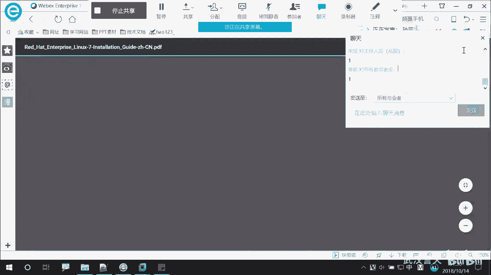

# 誉天-Linux／红帽认证／RHCE／RHEL7基础操作视频 - P16：04 运行命令和获取帮助_4 - 武汉誉天 - BV1xr4y1K7Aj

了一些我们就是。比如说他举个例子啊。我们先去到这个目录看一下啊。US。哦。这个下面有好多文件。呃。哦，这样吧，我给大家举个例子，我们后面要学到一个服务叫阿帕奇的服务，就是weable。

对大网站的一个服务。那如当网站的服务，我们后面啊考试的时候也要考，而且是重点内容。那当网站的服务呢，我们可能要去写一个配置文件。那那个配置文件呢。哎，挺多的对吧？但是你又不知道不知道怎么写那个配置文件。

那怎么办呢？我们可以它里面可以自带了有一个包，就是你把那个包装一下。对，比如说我现在把那个包装一下啊。叫man you的手册。对，蛮用手册，大家先不用看懂，就知道我装了一个包就行了。好。

我装完这个包之后呢。他就在这个目录下面生成了很多文件，这个包默认就装在这个目录下面了。这个包其实就是一些文件，也就是一些文件，生成了一些文件。那我看一下啊，这些包在哪。看这里啊。

USR share知到了吗？下面生成了好多文件在USR share。那我们就去到这个USR share里面看看啊。呃，HTTPENE。manu手册啊啊我可以看到下面有很多XT呃HTML的文件。

你可以用火狐浏览器把它打开。对，火狐浏览器直接打开。比如说啊教大家如何打开啊，火狐浏览器直接用fllf。这不火狐浏览器嘛？这个是lininux当中自带的一个浏览器。对，比如说打开一个文件。哦，回车。

你看他就给你打开了，这里面。好多帮助信息啊，这是自带的啊，而且考试的时候都都是可以用的，也是光盘里面自带的一个包，所以考试都会都可以用。所以这个目录下面呢，它放的就是一些帮助的信息。对，就是一些文件。

没有什么特殊用，就是我们来阅读的。它是某一个应用程序，有可能比如说网卡呀，或者是有有可能像唉哎刚刚我们看到那个阿帕奇的那个软件，对吧？那么怎么配置啊，配置文件在这里面参考啊参考。

当然你在这里面修改是没有用的啊。它只是让你阅读的得让你看的，它并不是配置文件，而是我们参考的文件阅读的啊。还有很多的HDML还可以放PDF还有P什么PS document文件。啊，你看这个是什么呀？

他是说某呃很多安装的package，很多安装包的一个什么呀，一个就是一个directory是什么呀？目录对吧？也一个sub就相当于父子。对，就父目录呃，就是不是那个父啊。那个。这个符。这个付。嗯。

就是从的意思对吧？就从的意思。词对吧？种类似这个意思啊。有一些额外的。嗯。那么除了这些啊，除了我们自带的这些。对自带的这功那个里面，其实更多的我们去看哪里啊。看某一个应用程序的官方。呃，官方网呃网站。

官方网站，比如说啊我们阿帕奇它是一个。是一个专门做网网站的对吧？专门做网站的阿帕奇网站。那阿帕奇它它这个呢我们linux当中也用了对，它是一个呃也用了这个软件。

那么这个软件有可能是linux那帮人发明的对吧？它是拿来用而已啊，一般都是很多都是开源的，大家都可以用。那么我们可以看一下啊，我把这个包装一下，刚刚只是装的那个帮助手册的包啊。

它的包名叫HTTPD这个我们后面会学的啊。装过了是吧。然后呢，我打开一个配置文件啊。在配置文件有它的那个呃呃那个什么网址官方网址。在这里啊这有个网址URL地址HTTPHTTPD阿帕奇这个我们复制一下啊。

当然你去百度也可以啊，百度阿帕奇官网对吧？这应该会吧。把地址复制一下啊。看。而且还是中文的。对吧。这个好像是可以选选选，这有语言，看到没？如实在看不懂，就看一下中文了。那但是好像里面绝大多数也还是英文。

你看这是它的一个官方的，你看阿帕奇的几版本的一些新的特性。如何使用，比编译安装，如何去安装这个软件呢啊，它一些什么启动啊，什么启重启啊，指令快速参考指南哪等什么之类的，在这里是不是都有，对吧？

而且大家平时工作中可能用到一个叫什么呃叫NG，对吧？对，N这个是因为我们这个课应该是不讲这个的嗯嗯。N这斯。呃，NGIANGINX。对，我们可以去到它的官网看一下啊。这是NG的它官网。

就呃一般国外人写的就比较呃。比较清晰吧，不像国内的写的那个很多网站上面都是广告，对吧？搞半天找不到重点。然后这个里面呢，你看啊它的一个特征是什么样子的。然后HDB有服务的一个特征。

其他的还有一些它的软件包啊，在哪里呢？它可以在呃。哪里呀download看到吗？download你要下那个Nt包download在这里。它这里有好多版本。对，更新了chan更新了一个版本。然后。呃。

它的一个源代码看到吗？code代码在这里呃网址是在这里，还有它一些稳定的版本在这里啊啊这个地方呢。呃，比较重要，为什么呢？这个我们可能现在还看不懂，因为我们没有学这个地方，它是它的一个仓库。得样仓库。

有时候我们就是装了一个包，对吧？装了一个包，它可能会有一些命令什么之类的。但是这个命令不是我们linkux中自带的，而是这个包来提供的。你可以把它的源指向我们的。指向这个网站。

你看这里教你如何配类都都有。看到吗？都有，我们到时候学第二本书的时候啊，呃去那个教大家去装那个去去去呃安装软件包。如果配下我仓库等等，这些我们会教大家啊。

如果把自己的源指向网络当中的某一个某一个网站某一个地区地方。他这里都所以我我想说的就是一些呃软件的官网上面啊，都有一些帮助的信息。那其实我们lininux呢也有自己的官网，对吧？我们红帽也有自己的官网。

我们现在学的是红帽linux，那红帽呢也有自己的官网，它在哪里呢？呃，叫HDB什么什么3Wre had什么dos对吧？

它自动进入到这个，好像现在叫access redhead点com啊，我们这里自己再进啊ACCCES呃嗯readhead。

点com这个网站啊，access点redhead点com这个网站大家一定要记住啊。要记住，因为这个下面有很多很多的文档需要我们去阅读，需要我们去参考的啊。

进入到这个里面，当然又是英文的对吧？

啊。拉到最下面，这个地方有一个product。呃，documentation叫产品文档。对，产品文档。

点开。

啊，我们学的是哪个版本呢？来家看这里啊，这不是红贸的企业版嘛，对吧？我们学的是红贸企业版，但这个地方还有其他的什么虚拟化呀等等。那我们就点开，我们需要查找的是红贸企业版的一些相关信息。那么我们点开。啊。

点开了之后呢，看这里啊。好，实在不行，这地方有个language是吧？中文好吧。

简体中文啊。

那还是英文，对吧？他只是部分呃翻译成中文了。对，他不会全部给你翻译的啊，但是我起码应该这个地方你应该会认啊，rease就是。😡，发行的意思对，发行的一些nose就是一些呃什么注意点呀。

什么告诉你就是nose笔记啊什么之类的对吧？啊，那么我们每一个发行版，比如说7。0跟7。17。1跟7。2呃，到7。5了，现在7。5对吧？他们每一个版本变更。对，都变更了哪些内容，你在这个里面。

你可以去下载到也可以下载到。好，那比如说啊我想了解什么呢呀？我想了解安装如何去安装的。对吧我们当然在虚拟机里面安装。那如何在服务器上面安装啊，如何在什么什么各种呃那个什么，比如说read呀。

在read上安装啊，的都可以都有啊。而且很好的是安装指南啊，全部是中文的。这个大家不用担心的，是吧？怎么去下载啊？😡，这个地方有一个格式，对，可用的格式把它点一下，有个PDF。对，有个PDF。

你可以点一下啊。

远晨同学还人还在吗？

半天没说话了。嗯。哦哦是不是回音呀？好好好。啊，在这个里面大家可以看到啊。听不太懂。听不太懂啊是吧？没关系，听不太懂是正常的啊。到时候呃到时候我们讲具体的某一部分的时候，我还会带大家去学习的啊。

我们只要给大家介绍一下现在有哪些帮助的资源。但是这个地方你首先要知道吧，这是官方网站啊。你看这个地方它下载对吧？下载linux，然后在呃什么AMD什么in特尔64安装引导如何安装啊。

在这个地方怎么安装啊，使用canada怎么安安装啊？对吧呃用什么什么IBMport什么stem怎安装啊。就是各种安装。呃，一般能够满足你的需求了吧。对吧还可以通过网络网络安装，看到吗？这也有。

takestar的安装。呃，什么磁盘印象安装，虚拟化环境中安装。安装升级什么安装后怎么怎么样。是不是很很清楚啊，对吧？当然也只有这个文件是中文的。也就这个安装指南是中文的啊，其他的还是英文。

你看这地方迁移呀迁移规划桌面什么迁移管理呀，如何从6升到7啊？对吧因为有很多呃公司啊，现在还是用的6对吧？对还是用的6。那当然我们六的命令也会教大家也会教，而且红帽七呢也保留了红帽六的一些命令。

对红帽六红帽七我们都一起学啊。哎，还有7还有如何5迁移到7啊。你看还有系统管理的系统管理指指南，什么什么什么指南，各种性能调优啊，电源，还怎么管理都有。资源管理。你看逻辑卷如何管理，对吧？

什么什么很多啊虚拟化有关虚拟化的也可以啊，什么集群的cster集群的对吧？都有。

好，大概就是这些啊，大家可以自行去下载。就是这个这章内容呢，主要就是一个呃可贯穿我们整个学习啊。所以如果这方大家没听懂，没关系啊，我后面还会给大家讲，但是前面从慢帮助那个地方。

那个地方之前应该听懂了吧。对，慢帮助怎么用，应该会吧。啊，远生同学慢帮助那个地方。之前后面没听懂，没关系啊。😡，张志辉。张志辉同学。可以啊，好，慢帮助的会用啊，后面没有听懂，没关系，我后面还会再讲。

好的。听清。哦，然后呢我。这样啊布置一个作业啊。剩下还有点时间，我们先把这个作业做一下。呃，经常我们像经常留的一个经典的作业，对吧？对头。😡，看你慢慢去会不会用啊。data显示的时间是什么呀？呃呃。

什么呃，这个时间的顺序是星期对吧？月日呃，什么什么这个这个对串啊，那么我们正常情况下，我们一般啊。Comomeca。阿帕奇。啊，我们正常显示时间2018对吧嗯。今天是14号对吧？然后空格几点几分呢？

是11点。三四分这样子吧。对吧啊，我不需要你修改时间啊，我需要让你把当前的时间显示的时候显示成这个格式。可以吧，能听懂我的要求吗？我的需求。我的需求是你显示的格式是这样子的。因为你直接执行data哦。

听懂需求了。好的。😡，直接咨询对长是不是显示的是这个格式啊，但这个格式我不习惯，我就想让它显示成这个样子哦，看着舒服，对吧？看得懂。啊，我们来给大家提醒一下啊，man dateman一下啊。

man data，然后肯定在data里面找，对吧？你可以看一下啊。😡，呃。他是什么格式呢？option加formmat对，加formmat贝塔呢，你看杠第是什么呀？显示的是。

他这个地方显示的是什么时间啊，我让你显示的是什么时间啊，是当前的时间吧。😡，所以肯定不能加低啊，杠低杠低是显示某一个时间对吧？某一点的时间，而不是当前时间。那正常情况下，它显示的是不是就是当前时间呀？

但是当前时间的格式你需要改一下，对格式怎么改呀，就是max。那佛妹的在哪里啊？就在这里啊。不看一下啊，它是来控制什么输出的。对，控制输出就是你data它那个输出输出到平面那一串，它是控制它的输出的。

所以我med可以改变它的输出格式。那具体什么格式呢？哎，自己去找好吧，自己去读啊。啊，远程同学做完之后发到这个聊天框，呃，你可以私发给我啊，你要是那个发回去所有同学都看到了啊。你私发给我。可以吧。

袁娟同学。然后大家如果还有什么不懂问题可以再问我啊。😡，上午的内容大家一定要听懂。嗯，趁这个时间我给大家认识一下吧，然后我点名大家那个呃注意一下啊。你们做自己的，不要不要那个受我影响。呃，付红雷。好的。

嗯。彭吉胜。如果我不小心把你的名字念错了，原谅我。这个是。站览吗？哦，好的。东凯。中卡有来吗？哦，你在这儿。怎没来现场。昨天来了吗？想进一下微信群鱼刚。哦，昨天也眼成是吧，微信群微信群。微信群。鱼缸。

我怎么这个名字好熟啊。你你上一个班是不是跟过我上过？微信群。怎么你怎么扫呢？你在那个吗？

哦，好，那我。你在QQ群里面吗？你在QQ群里面吗？

那我你你你聊一下我那个QQ群，我把那个码发给你。这个怎么。哦。我发到QQ群里面吧，没有加的可以加一下啊。我发QQ群里面啊玉哥。可以的可以可以，黄松。对的，温喜。对的。好，然后。呃，张志辉。张志辉在吗？

哦，你在远泉是吧？熊功强。陈功强在吗？很帅。杨子健。陈峰。杨佳持。嗯，好。然后你们都跑的都跑的远程家。人来现场尽天来现场啊。呃，西韩红。哦，做完你可以休息了啊。可以休息了。可以去吃饭了是吧？

如果你有什么不懂的问题，可以再问我啊。啊，西韩红在吗？做完了可以让我帮他看一下啊，对不对？嗯，是稍稍稍稍等，先别下课，我还我等会儿讲一下吧。张红不在呀。王松在。于江波。王东林。王东林。窦建平。嗯，张豪。

杜勇。彭伟勇。丁磊。张浩然。周志兴。周志新。哦，好的。侯德俊。嗯。鸿瑞。刘雄。刘雄在吗？哦。呃，杜少奇。胡永博。谢磊。徐海欢。朱爱民。Liu Xuan。啊。呃，杨家持对的。吴家良。肖海洲。吴永杰。

刘永杰在吗？罗鹏。叶俊。郑素奎。呃，龙俊。龙俊在吗？张丽杰。好的。爱天。在签。在天在吗？呃，城普。远程同学，这是怎么点啊？哦，现在没有。还有没有其他同学没有点到名？哦，写怎么样了？比喻。鱼。

你是现场的吗？是本地的吗？先生。嗯。好，这样吧，在的同学扣一下一啊。看一下你们谁在啊。啊，50开始讲。看看你们。讲一下啊。哦，我看有同学很多同学都做出来了啊。啊，我们再看一下啊。呃。

man date看一下。我们不是要找famed嘛，对吧？form格式，那它格式呢都在下面，其实你一个一个的看呃，也是可以的，还蛮多的对吧？我们可以这样啊，就是你可以搜索关键词，对，搜索关键词。

比如说斜杠，对吧？ yearear，我们要找什么年吧，年月日年嘛，年就是 yearear。对吧那么所有的E是不是都会高亮啊？那你在这些e之前开始找看有没有你想要的啊。呃，回到。没有。啊。

然后这有一个什么，你看这地方他描述啊，他说。年的什么呀？last two digital最后两位数字吧，但是我们要的是四位对吧？2018对，2018，那这个不是我们想要的啊。

那么这个呢SO什么呃we number？这是weake number啊，we应该是年的什么哪个星期是吧？大概是这个意思，反正也应该也是不是我们想要的。好，那这个摆号J是什么呢？

年的天应该是你看这地方例子是001到366，就应该是年中的哪一天。就像我们现在今天是365天的哪一天，对，应该是天吧，并不是年啊。好，那么下面还有哪里有年呢？这个白分冒号U哦，这个才是你看。

week number，我们一般一年有5354个星期对吧？对，54个星期。那我们这今天呢是在哪个哪个星期呢？对，就那个意思，0到5不53对，取值是0到53啊。啊，这个地方呢是weake number。

也是weake number。但是这两个有区别，你看没？😡，呃，这个是sday作为什么呀？😮，一个星期的第一天，然后这个是monday作为啊，星期一作为一个星期的第一天。对，就是这有点有点区别。

有点不一样。呃，白放Y呢是我们的年的。最后两位数字就是如果说你们就是看不看不太懂跟年相关的那你可以怎么样，可以去试一下嘛，对吧？你试一下也没事啊。啊，那这是年的最后两位，对，最后两位要百分号Y。

那这个地方是摆分号大Y就是E，它就写了个y。那 year是什么东西，我们可以试一下啊，比如说date。加号吧，然后再是frommed，对吧？i号大Y。哎，这好像就是我们想要的对吧？就是我们想要的啊。好。

那下面应该没有了，那我们就就用这个啊就用这个啊，那么找完年之后，我们是不是要找？小月对吧？年月日月嘛，月是什么样？M， O， N TH month。呃呃呃，MOMOT。多少来着？MONHH没有吗？

但是我敲错了。哦，在上面。回到最上面啊。回到最上面，然后再来MONTH它好像是在你当前这个位置往下走。所你看不到，那在这里就可以找到了。😡，哦，这个呢是月的什么名字啊？它是loc case什么什么缩写。

这个是缩写的意思啊。是书写。然后他缩写是january就1月份嘛，1月2月february对吧？对，1月2月什什么。所以它是缩写，那这个就是。呃，拼音全拼音对吧？不是不是不是全全全单词啊。

全单词就是fo full name对，ful name。然后这个呢是什么呀？是。月的某一天吧，这个应该是日吧。对吧月的某一天，我们这个是14号，是不是月的某一天啊？

那这个是不是哎正好我们找到找到那个日了。对，正好找到日啊。😡，但是这个的话你看一下啊，摆放到第，它好像是摆放M，摆放D，摆放Y这样子对吧？那你来找一下它大概哪一个是什么意思。啊。

我们看一下这个month of day，这个什么它加了一个什么空格sp。加一个空格，但是这个不知道能不能用啊，待会试一下可以好，再往下看。哦，这个是天这个是天啊这个是天，我们找找月啊，找月哦。

这个地方有个百分号F。对，你看这里。for date full date全日期的格式是摆放Y摆放M摆放D，对吧？那摆放OYY我们刚刚找到是年吧，然后摆放D是什么呀？日对吧？那摆放M，你可以找一下是什么。

肯定是月吧。你看正好是我们想要的。所以你可以自己去敲摆放号Y摆放M摆放D或者你敲一个摆分号F是不是都可以啊，这地方能看懂吗？啊，我们这样啊，我们先把这个年月日敲出来啊。e然后加百分号Y。

那中间这个杠你可以自己去敲。得自己去敲这个杠。其实这些你可以去试嘛，对吧？不懂可以去试啊啊，然后在版放用不用加加加了。你必续试。这个也也我们也不太知不太知道，对吧？你就可以去试啊啊，百分号M。

然后杠百分号D对，百分号D，然后正好是我们想要的这个模式，或者是你是百分号什么呀？F。对，刚刚好找到一个白胖网，就是我要这个格式。对吧所以如果你要斜杠，那你看斜杠怎么处理啊？我我我要的格式是杠对吧？

我空格呀什么之类的，那我们去处理。好，年月日我已经找到了。那十分秒我要去找一下十分秒啊。我们再回到这个mandate里面，1分秒。分十十是什么R对吧？our你可以往下看这个地方是什么呀？😡。

M猫H是24小时制的。对吧这是24小时制，这个是12小时制的。那你可以选一个呀，我们其实。选哪个选24小时段吧，百方H。对吧还有分钟是什么呀？分钟是你看。分钟是百放大M。嗯。10分钟，然后秒是什么呀？

百分号S好，这个地方还有一个秒啊。这个地方有个秒叫second呃，从哪儿啊？1970年。1970年1月1号起开始到现在经过了多少秒？对，到现在经过多少秒？那这个哎白白帽大S呢指的是当前是哪一秒？对。

当前是哪一秒？摆放小S指的是从1970年1月1号。这一天到现在经过了多少秒啊，我们等会儿再来看这个啊，我们先看把这个写全。哦，后面你有可能我中间是不是有个空格呀，对吧？那你好打个空格呀，那打个空格。

那你后面要写什么，你那你看是不是要写加号或者要不要写，所以你可以你都可以去试啊。但是这个地方好像是不用写加号，它只能有一个加吧。啊，那么就是百分号多少？H。呃，中间是冒号对吧？然后百分号。呃。

是小M大码？然后是。百分号S是这样啊哦，这个地方他又报错了，他说这是额外的一个。多了对，额外的，所以它并没有识别这个加号呢，你要把它处理一下，这个空格你要处理一下。那如果说没有空格的话，你看一下啊。

它可以帮你执行，但是中间又少了一个空格。那这个空格怎么处理呢？一般学过语言的还是稍微知道一点的啊。空格它是一个特殊字符，对吧？空格一般情况下，我们是用来分开项与项之间。对吧所以他就把认为这是两个项，对。

这是两个项，所以就会报错，就是不不认识是什么东西，也就会报错。所以这个地方你要把空格稍微特殊的处理一下啊。去掉它的特殊含义，你可以加反斜杠。对，反斜杠就是来去除它的特殊含义的。也可以啊哦。

还有什么方法呢？你可以把它括起来用。对，单引号双引号把它连接起来。其实空格是不是也是一个字符啊，对吧？让他回去他原来的意思。因为空格它是隔开项与项之间，但是它本身其实实质上是不是也是一个字符。啊。

你要把这个字符给特殊的处理掉啊，所以你看双引号、单引号都是可以的啊。哎呀。或者是你这样，你可以把它统一的哎用双引号括起来这样子。是不是也可以，对吧？啊，或者是这我看有同学是这样子的啊，他用的是。

他是这样的，他加了一个百分号7。对他加了一个百分号7。回车。好像中间空了很多格，对吧？百分号7的意思是一个table键。一个tableable键是几个字啊。😡，啊。8个吧。一个一个table键。

你该看百猫提1一个table键，它是8个字符，对，8个字符，但是这样不太好看，对吧？也可以啊，也是可以的哎。还有很多啊，我看同学发了有很多种方法，你只要找我们linux当中啊。

不管你是以什么方法去实现的，我们都是允许的对，只要结果是正确的对，结我只要结果不要过去，对吧？偷别人的也行是吧？操操抄来抄去。参考一下呀参考一下啊。我们工作了之后要会抄，对吧？会去抄别人的。

都抄抄就是自己的了。啊，原上人学还有什么疑问吗？呃，等下午的时候，我们把第四章内容学完之后，我会给大家布置作业啊，大家不要那个啊不要这一不布置作业，估计人周一到周五人都不知道去哪了。布置作业。

然后你们要写作业，对写作业。当然呃如果你们想把作业发给我看一下也可以啊，但是人太多了，我们可能有时候检查不过来，估计没几个人发给我啥。啊，所以呃你们晚上啊等晚上上完课之后，我会总结一个一份作业。

其实在我们之前呃发的啊。呃，那个就是你重启一下就那个了。重启一下。时间就对了。然后之前发的那个就是网盘里面啊，它有那个SO啊，什么都有，里面作业也有，其实是有的。但是我之前发了啊，他们从来不看的。对。

就是提前发给你的东西，你们从来不会看。对，只有我每次然后给你总结好，然后让你们去写作业，你们才会写啊。所以我还是得跟你们。单独再给你们发一个啊，然后你们课下一定要去写啊。要不然这些呃过了5天你又忘了。

学这周学什么内容啊，我们中间我们下课了啊，中午下课，下午2点钟2点钟继续上课啊。袁程同学，我们中午下课了，可以去吃饭了。陈同学吃饭了吃饭了啊。冒号也是一个字符呀，它没有什么特殊含义，对吧？

冒号它其实都是一些字符，他没有对他没有什么特殊的含义。但是空格键它有特殊的含义，所以不能直接加空格。之前是谁有问题来着？我把我写的那个放在这里啊，你们可以看。你说什么东西嘞？

