# 誉天-Linux／红帽认证／RHCE／RHEL7基础操作视频 - P1：01 rhel7操作系统安装_1 - 武汉誉天 - BV1xr4y1K7Aj

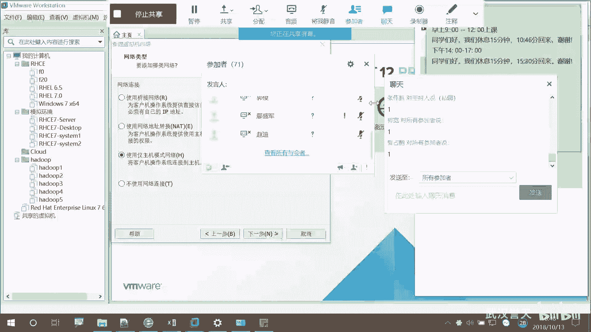

嗯，远程同学。我再强调一下啊。

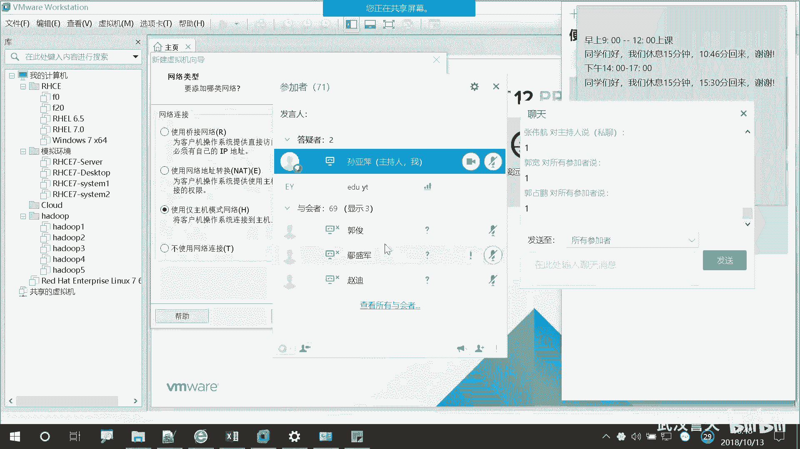

哦，我们的同学用拼音去写自己的名字的那个下次改过来啊，改成那个。

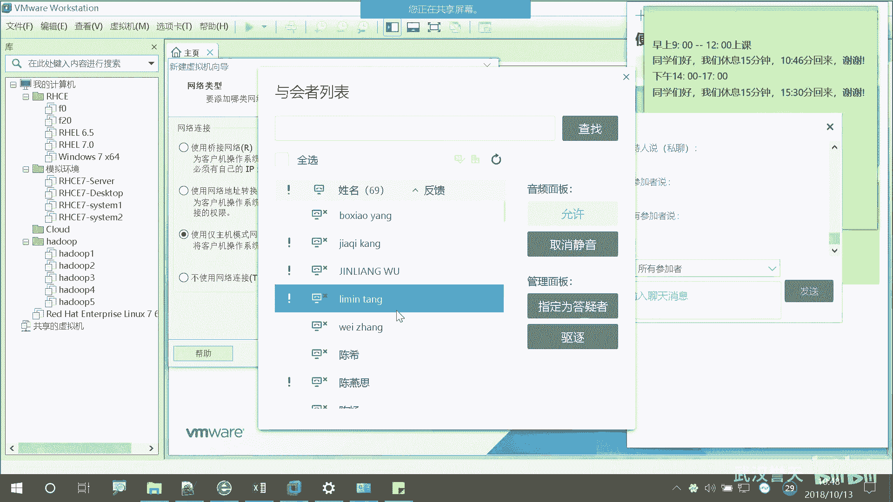

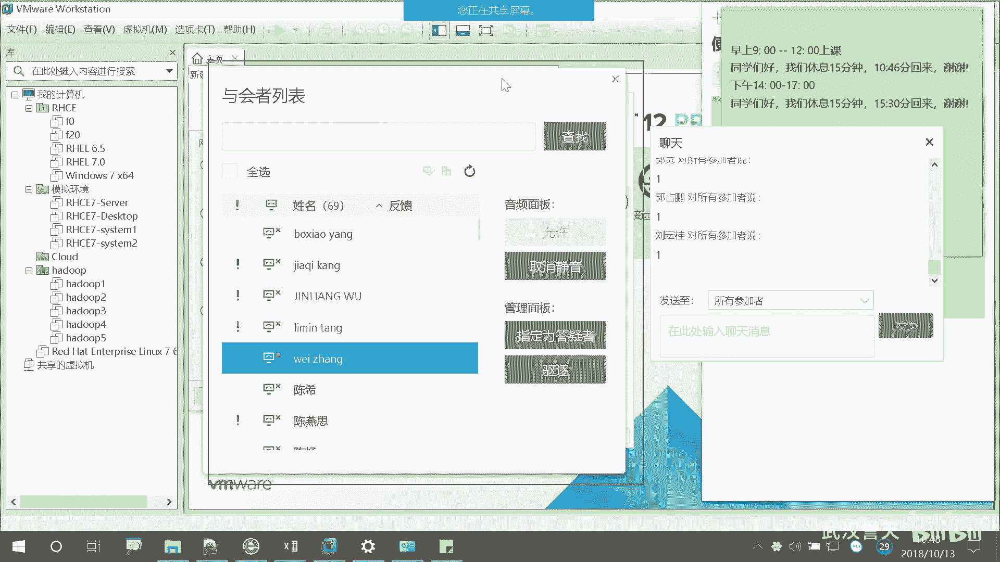

中文，因为我们这边如果。找不到你的名字的话，我们会踢出去的啊。

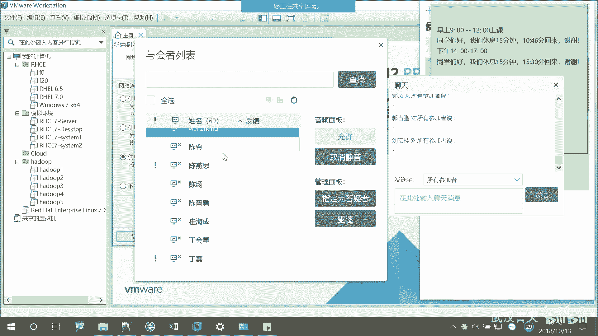

不想被踢出去就改过来啊。😡。

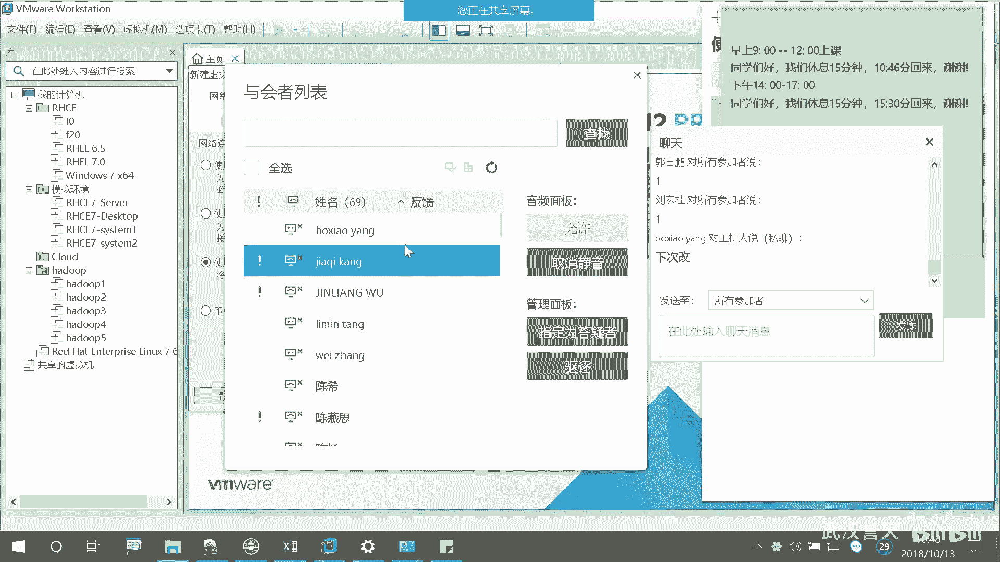

还有这位就什么嗯，吴。吴金亮对吧？这位同学好，你你找到了啊，下次改啊。好，吴金亮同学是哪位？我没念错吧。这个这位同学在吗？吴金亮同学在吗？

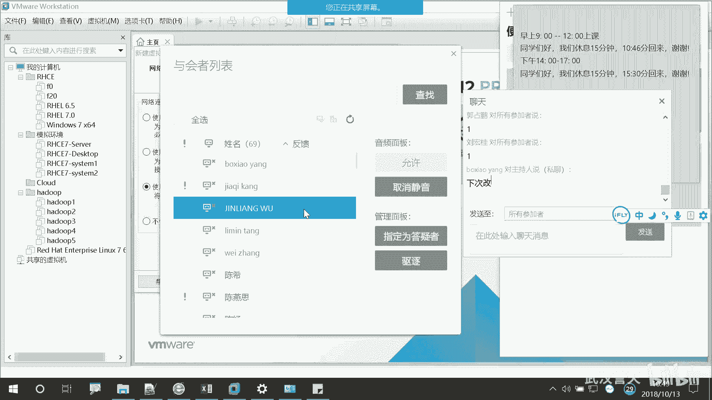

不在的话，那我就那个啥了啊。这还没踢过人呢，就踢。哦，你在是吧？就我要踢你了，你才出来。你那个你叫什么名字？那个班主任这边统计一下。好的好的。

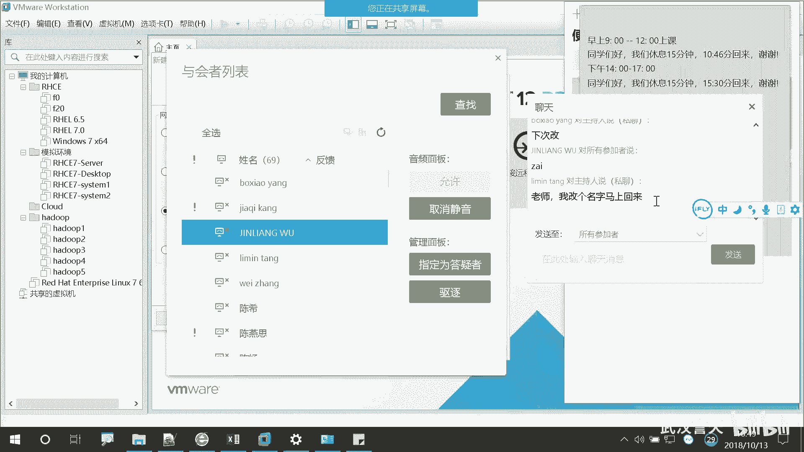

在哪里改名字啊，进来的时候改的进来的时候只能退出来，要重新进。吴同学。吴同学报上你的大名。看。

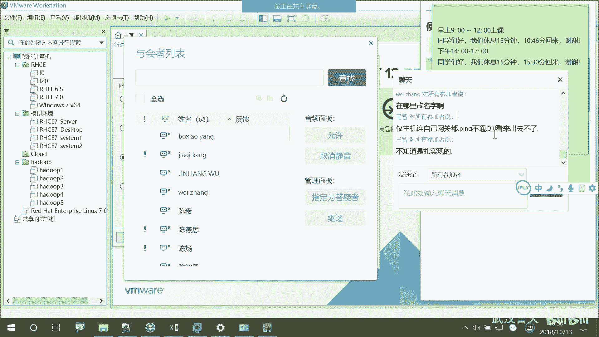

还有嗯。好，我们上课了啊。还有这样啊，因因为我在讲课的时候呃，吴吴吴进良是吧，没一个念对的。

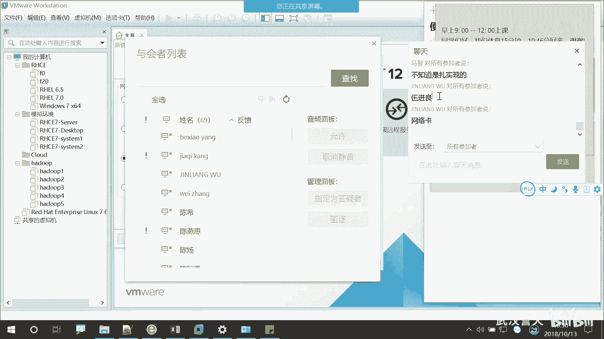

啊，然后。

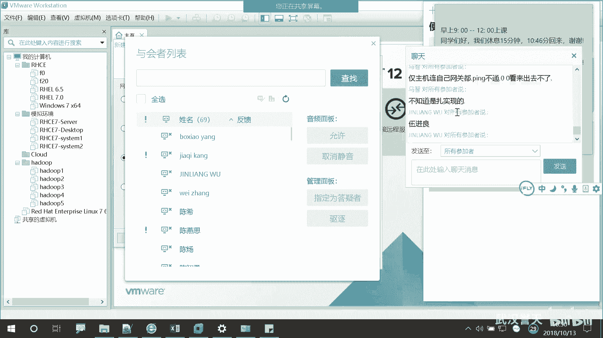

我们上课的时候，这边这个对话框啊，大家不要刷屏啊，就是我问你们的时候，你们可以回回一下啊。然后上课你们提问题的时候，最好不要聊我们课堂无关的内容啊。

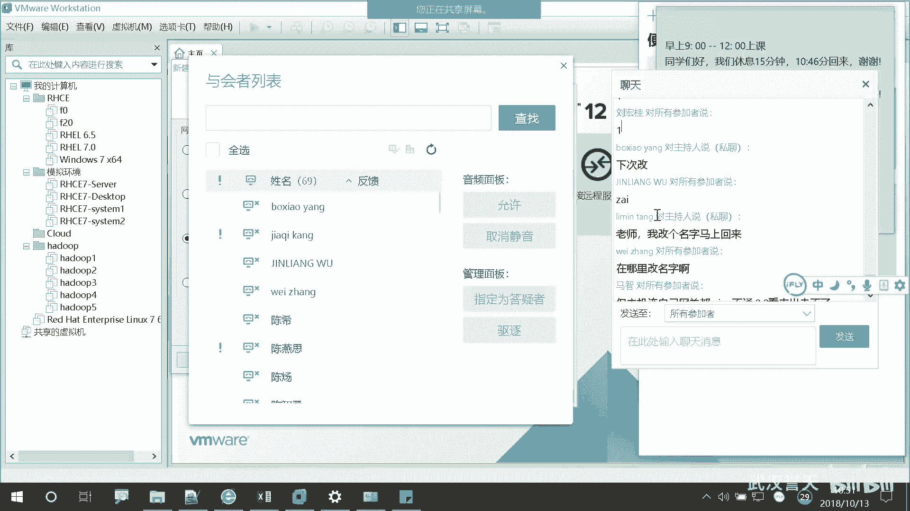

嗯。我正在讲的内容，你们可以问啊，这都没有关系。😡。

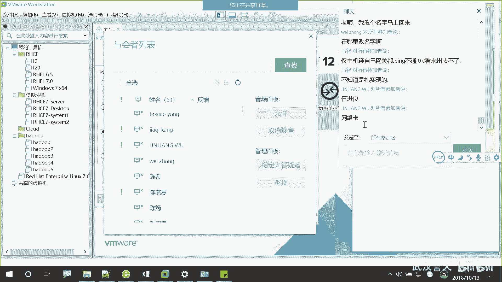

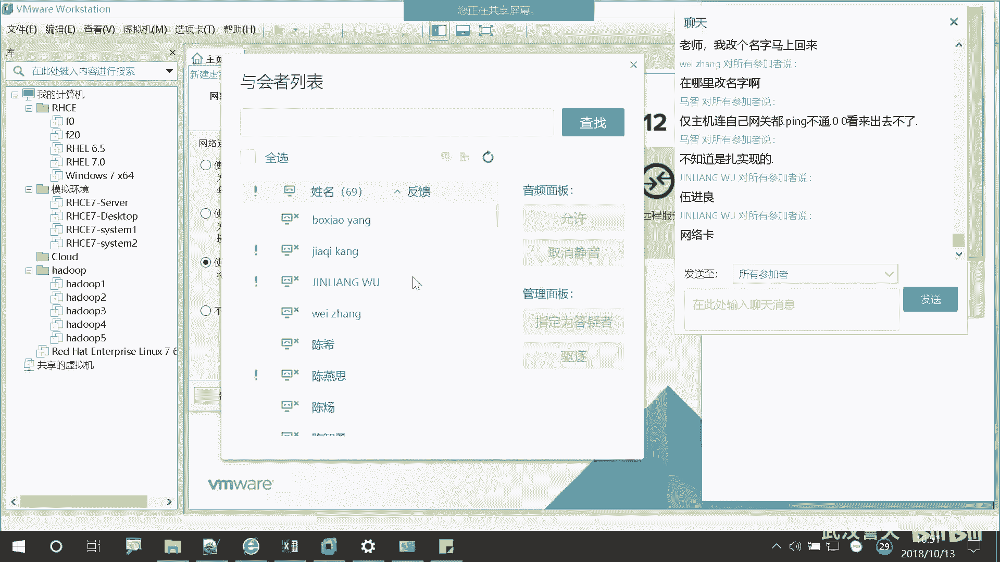