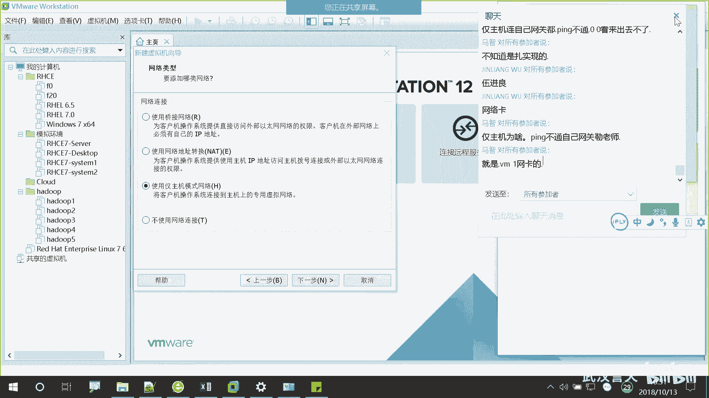

# 誉天-Linux／红帽认证／RHCE／RHEL7基础操作视频 - P2：01 rhel7操作系统安装 _2 - 武汉誉天 - BV1xr4y1K7Aj

你要批什么网关啊？要在同一网段呀。

好，我们先上课啊。呃，再有问题的话，你们私聊我。嗯，我们刚刚讲到第三种紧主机模式，还有大家前一天晚上啊一定要一定要休息好啊。

要然这边来来上课，在在这睡了一觉是吧，然后回去了。

啊。嗯，第三种仅主机模式，我们就选紧主机模式啊。因为我也我们整个呃上课的过程也不需要用到网络，也基本上不需要用到那个Y网啊，所以你就选紧主机模式就可以了。

啊，下一步。然后这个是那个scars控制器，就是我们磁盘上面那个那个控制器啊，磁盘上的这个你们你们不太清楚的，就写推荐就可以了啊，推荐就可以了。然后呃磁盘的类型，scars盘就推荐啊，推荐用这个。啊。

然后呃我们这个地方啊，如果你是第一次装操装那个虚拟机的话，就选第一个创建新的呃虚拟磁盘。

他为什么会有下面这些呢？呃，这个啊是这样子的。如果你选第二个的话，那如果有是不是有可能之前你装过一个虚拟机啊，对吧？有没有可能你会留下了一个，因为我们里面啊虚拟机它磁盘也是文件。

这个能理解吗？😡，就是他那个文件夹不是一个虚拟机吗？它磁盘是以文件的形式存在的。所以如果你在上一个虚拟机把那个文件留下来了，那么你可以用那个文件当做你的磁盘。

可以的啊，当然我们就选第一个就可以了啊。第三个的话就是用你的物理磁，物理磁盘了，就占你物理空间了，它就不是有文件的啊。😡。

好，然后我们就选第一个啊。

呃，磁盘大小，我们这个地方如果仅仅是装一个虚拟机的话，20G也够了。对，当然你你看我这个地方啊，我可以给200，也可以给2000，甚至可以给到2万。对。

这个其实啊我们这个虚拟机它这个磁盘的大小是不是也是这样的。

