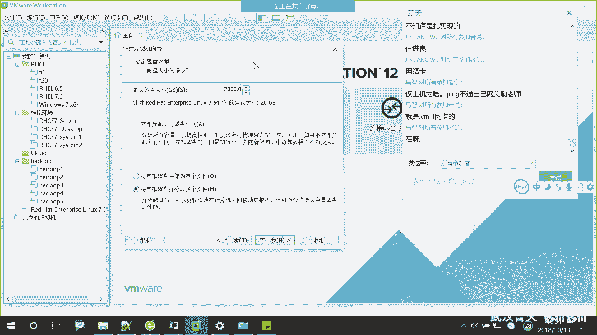
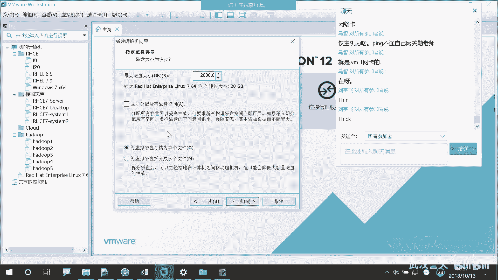

# 誉天-Linux／红帽认证／RHCE／RHEL7基础操作视频 - P3：01 rhel7操作系统安装 _3 - 武汉誉天 - BV1xr4y1K7Aj

你提的那个那个个磁盘空间呀，对吧？但是为什么这个地方我我2万我2000是不是2个T呀？我这个我这个那个电脑肯定是没有两个T的啊。😡。

但是我两个2000兆这个G啊，G2000G是不是2个T啊，2个T左右，对吧？我也是可以选的啊，为什么呢？因为看这里啊，这里有个方框，他说立即分配所有磁盘空间。

如果你把这个勾选上了。

你把这个勾选上啊，那么你在这个地方选了多大，填了多大，那么就会立即从你的硬盘上划走了就没有了。

对，从你的那个电脑上。对。

对，本机的电脑。本机上面的那个物理机上面的磁盘。

立即就划走了就没有了啊，就是给这个虚拟级了。😡。

就磁板上就少了两个T。所以如果我选这个的话，我这个是不是成功不了啊？因为我没有两个T嘛啊，那这个地方一定不要勾，其实没必要勾啊。如果不勾的话，我可以给多大都可以，为什么呢？因为它是按需分配的。

你要按需分配呢？就是你用多少，它给多少。对，就是你用多少。😡。

磁盘就给你分多少空间，就这个意思。大概啊我们这个虚拟机一个虚拟机装下来的话，大概是3到5个G对，3到5个G。所以就算你给了20G200G。

他也只占3到5个G。

这个能听懂吗？好，那将来有没有可能你往虚拟机上面去放文件呢，对吧？去创建一些文件或者是复制一些文件。那这样的话是不是你的虚拟机会变大呀，对吧？你的磁盘空间。

然后那个那个电脑呢电脑上的物理空间就会给它划空间，用多少给多少这意思能听懂吧？啊，这个当然如果你勾上的话，那性能是不是好呀？

对吧就是如果你勾上的话，你的词所你这个虚拟机所占所占你物理空间，是不是相当于连续的，你划了一块空间嘛。

那这样的话就性能稍微好一些。那如果说你用一点分一点用一点分一点，那这样的话，你的虚拟机的文件在磁盘上是不是就不是连续的呀？

那这样性能稍微差一些。对，但是我们也不需要多好的性能。所以这个地方呢大家就不用勾上了啊，因为我们磁盘毕竟是有有限的啊，用不了那么多，所以大家就选呃不勾啊不勾。

下面呢是你的磁盘文件，是呃存储一个文件还是多个文件呢？这个。

我有强迫症的，我就把喜欢人一个我接。

对，就是它可以把你的磁盘文件分割成多个文件，它默认。

