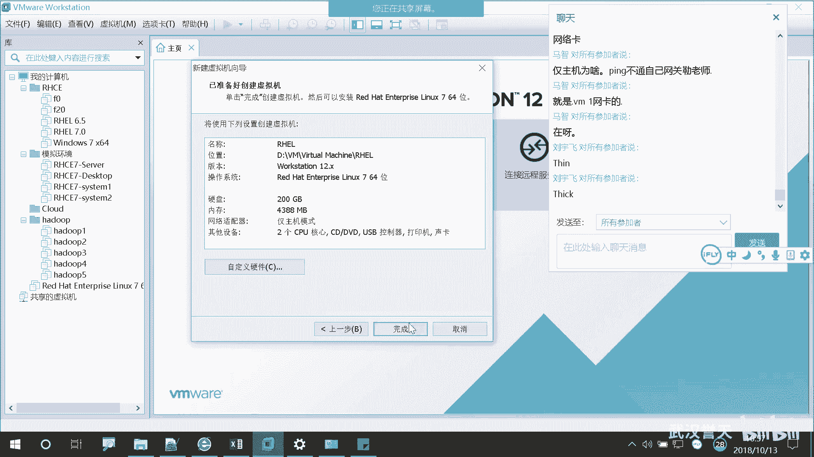
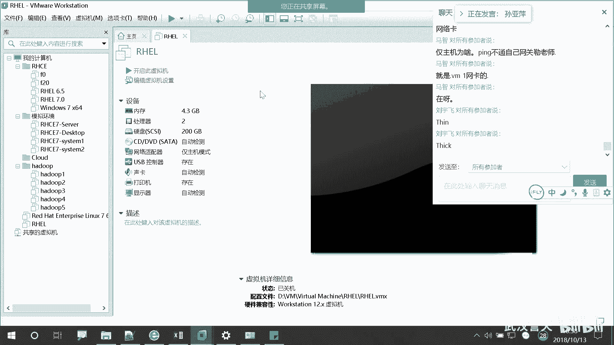
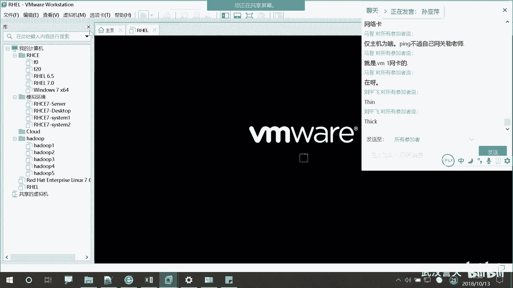
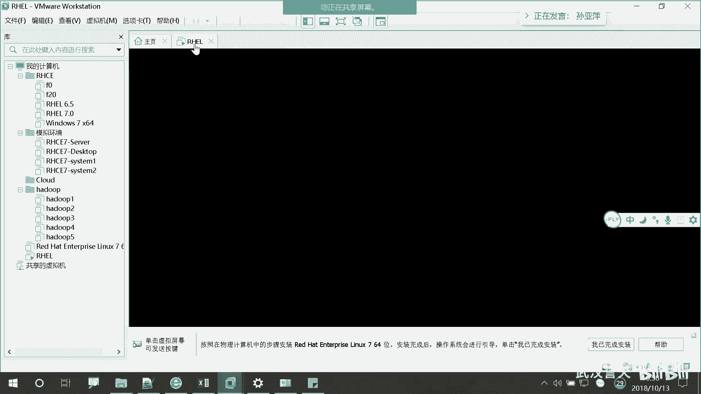
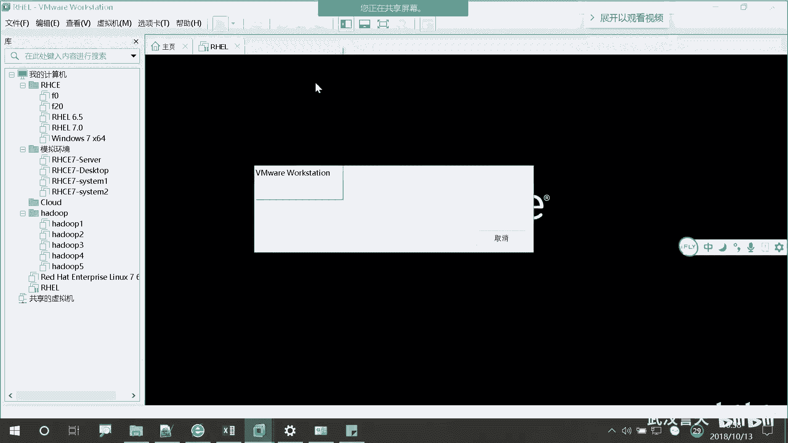
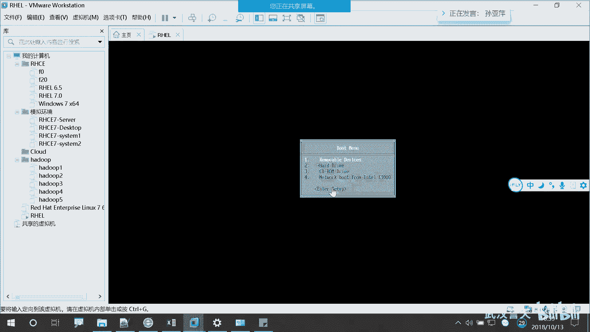
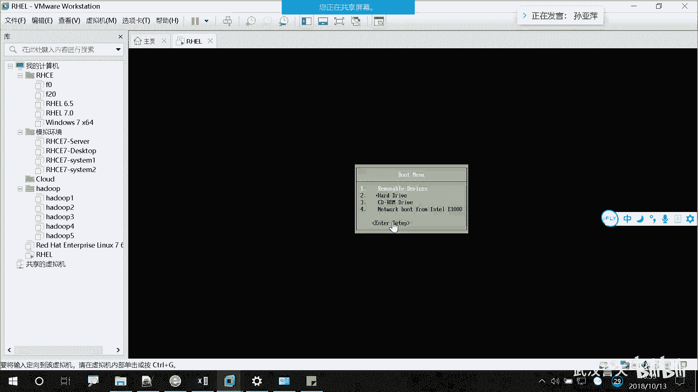
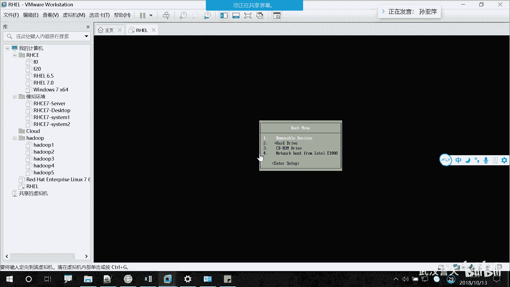
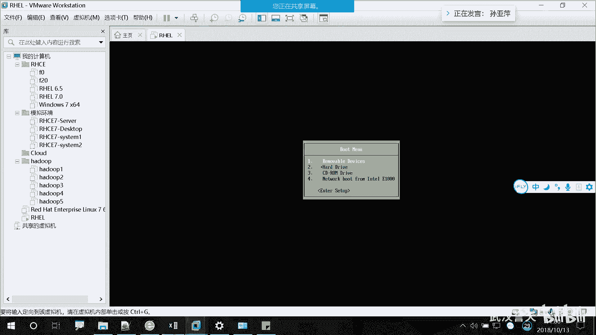

# 誉天-Linux／红帽认证／RHCE／RHEL7基础操作视频 - P4：01 rhel7操作系统安装_4 - 武汉誉天 - BV1xr4y1K7Aj

是多个，这个无所谓啊，这都不没没没关系的。好。对这就200吧。20其实也够了啊，20际。2十7啊202006斤。啊。下一步这个这个啊这个就是你磁盘文件的名字。对。

如果你在你的虚拟机那个文件夹里面看到一个文件名及点VMDK结尾的那这个文件就是磁盘文件。这个地方能听懂吗？对，就是所以所以你在那个我给大家发那个环境里面，是不是有一个文件叫什么什么VMDK，对吧？

那个就是它的磁盘文件。对，好，下一步完成啊完成。

这样的话这个地方我就多了一个虚拟机。那这样的话整个过程你的电脑就买好了。对你的整个电脑就买好了啊。好，那么下一步开始装操作系统啊，装操作系统。怎么装呢？我首先给大家演示一下我们教室机怎么装啊。

我们教室里的物理机怎么装？啊，然后怎么装呢？我们直接开机啊，大家可以把自己的电脑重启啊，我先啊我先来啊，大家先等一会儿啊。

这样啊，我开机。

哦，过了，等会儿啊，这个时间刚刚慢了一会儿慢了一下。

重启啊重启。这个地方一秒钟不到啊，很快的。嗯。啊，这个啊刚刚有一个那个进度条一出现呢，我摁了一下EA进到这个界面啊，进入到这个界面，这是我虚拟机啊啊，如果是物理机的话，你们重启你的电脑。

听到低一声NF12，那边的电脑呃，有的电脑啊，这边好像新的那个或的是F5F8。呃，其他的试一下F12都试一下啊，重启听到第一声没有听到，你也摁一下吧。对，重启啊重启，然后进到一个蓝色，但还是蓝色界面。

然后停留在那个那个界面上面。

大家可以把自己电脑重启一下啊。好，然后在那个界面上要出现一个什么什么P叉一或者是什么什么agent，是这样子啊呃。

