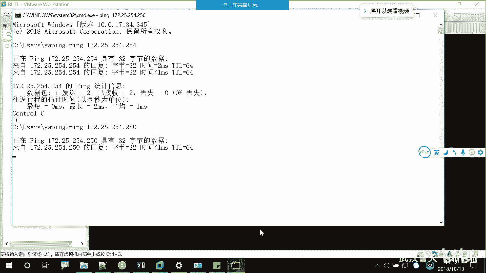

# 誉天-Linux／红帽认证／RHCE／RHEL7基础操作视频 - P5：02 rhel7操作系统安装(续) _1 - 武汉誉天 - BV1xr4y1K7Aj

啊，你出现了这样的字样啊，什么P叉一。😡，或者是什么什么呃agent，这边好像这个新的主题，什么什么agent，有一个单词叫agent，或者是network。😡，这些字眼啊。😡。

然后选上你看我这个地方是不是network。😡，对吧好，所以我把我的这个选成这个啊第四个对第四个，那你们有的。啊远程的同学稍微等一下啊，我我把那个现场同学这边。呃。看一下。ほ。Good。过了不。不。

当就。好了。被个。はい。对啊。哎。啊对。我们用P叉E网络部署啊，网络部署，我们教室环境才教室里面才会有这个环境啊。呃好，sorry，我刚刚那个地方写错了，我要重新来一遍。

同意。好，大家停留在这个界面上啊，这个界面看到了吗？上下移动让它停留在后下面倒计时的啊，的啊。😡，移弄在这个界面上啊，然后这个界面上，第一个第一个是footot，就是从本地磁盘上启动，对吧？

footot是启动的意思啊，footot是启动。因为我们本地的硬盘上之前网管已经把大家那个操作系统装好了。如果你选第一个的话，它会就自动进入到那个操系统里面了。对，它已经装好了。当然我们需要自己安装啊。

那我们选哪个呢？我们选第三个啊，叫第三个叫insstore安装安装鸿贸企业版Linux7选这个啊，选第三个。好，大家注意啊，我们来看一下下面的啊。下面再看这边下面有很多F1F2、F3、F4F5F6对吧？

大家看到了吗？好，一直到F2哦2。230对吧？这个是我们的一个自动化部署的脚本，这个脚本是放在我们的那个。器上面的就是一个菜单啊，菜单什么意思呢？如果你选了F一这样回车。那你就不用管了。😡。

整个就会去去吃个饭对吧？上厕所啊，吃个饭啊，上个厕所有点快了。吃个饭回来之后就装好了啊，就超系统就装好了，不需要你人为干预。这个叫P叉一步，这叫这叫自动化啊。kickstar。

我们第二本书就会学的时候呃，会学的。所以大家上午我们把操系统装好之后，下午啊大家按顺序按顺序啊把自己的操系统。这边是一对吧？我们只能装20台啊，20台，我们没有20，而且F20是我在用，F20是我在用。

你们呢就只能装到19。懂吗？19啊，然后12这样啊，12这是下午啊。但完合同说是。你呃把它回蛇就不管得去看。啊，然后这234呃。嗯。1789。那这边就15个。24。6789101112131415。

15。当时人。都系。不能。哦。嗯。不意思。好。那你们任务啊好，那我们呢现在就是第三个啊。哦，我刚刚去那个下面去。安排一些事情。哦，然后我们远成同学远成同学回来了啊。我们选第三个啊。

第三个安装红帽前埋的那个17回车进去啊。那我们。

哦，远程同约是这样的啊。

因为我们本地呢是用的呃那个P叉E部署远程同学这样啊。你们在这里啊。

远程动学用自己的笔记本的啊，我们是用光盘去装操系统的啊光盘。然后你们呢在这里把这个CDDVD看到了吗？CDDVD怎么选出来的啊，这样子啊。

右键这里有个设置看到了吗？😡，设置啊。

打开。然后这个有个CDDVD看到了吗？这个地方有一个使用物铝驱动器。因为我们现在一般都没有那个呃那个那个光盘了，对吧？如果有光盘的话会自动检测。当然没有，我们就用ISO啊ISO然后选上你的。

选上你的ISO镜像的位置啊。我给大家是7。0对吧？你选上它打开。😡，确定就可以了啊。看清楚了吗？远程同学看清楚了吗？远神同学郭俊同学。选上你的ISO，然后再重启一下就可以了啊。好的。SO是灰的。

灰的选不了吗？那那那那。😔，怎么是灰的呢？那你。😔，下课，我帮你看一下吧。哦，是这样的啊。呃，如果你们想远程，我帮你们看的话，你们就下一个软件，这个软件叫。因 you。

这个软件啊这个是远程连接的一个远程桌面连接的一个软件。这个啊。因为QQ和那个性能不太好，这个就是比较适合你们要远程，我帮你们看的话，你们下这个软件啊，远程农源听到了吗？你就下这个软件啊。好。

你再看一下啊。啊，远程同学选这个啊，现场同学这个是怎么回事啊？

不会又出现这个问题。等一下啊，我看那个器开了。

你们都卡在这里吗？不出现。你们没有进去的吗？有进去的吗？我看看。对的。Right。对。开屏。嗯，我我是。帮一下这个。我认没我也。他是。等一下人太多了。

哦，我再进不去，我就用ISO装了啊。等州。进不去，多重启几下。

对。

啊，如果是光盘启动的啊，我刚刚也进不去了啊，那你们有的就用笔记本吧，可能一下子人太多了，进不去，不进去了，就就稍微等一会儿啊。啊，如果是光盘安装的话，它是它有三个菜单啊，一个是install安装。

第二个是测。第第一个是安装操系统啊，第二个是测试介指并安装，不要讲话啊。然后测试呢。他测试的是你那个ISO镜像镜像文件，就那个戒指吧，一dia就是你的戒指啊这个。

这个啊。media然后再去安装啊，大家不要选第二个啊。

