# 誉天-Linux／红帽认证／RHCE／RHEL7基础操作视频 - P6：02 rhel7操作系统安装(续)_2 - 武汉誉天 - BV1xr4y1K7Aj

如果你选第二个的话，估计你吃几顿饭，他回来还没他也没装好。对，所以这个镜项是我们给的啊，大家放心用啊，都没有问题的。

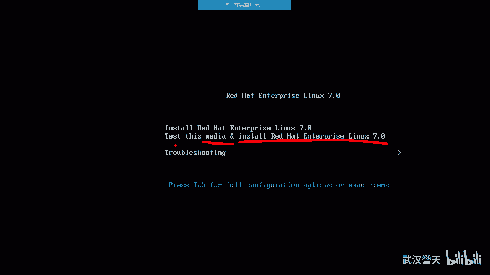

啊，第三个呢是traub shooting。tub shooting，它后面里面可以进入救援模式修复系统的啊，修复系统的时候用。我们第二本书的时候可能会讲到如何去修复系统才会用到啊，我们就选第一个。

如果安装操作系统的话，就选第一个。

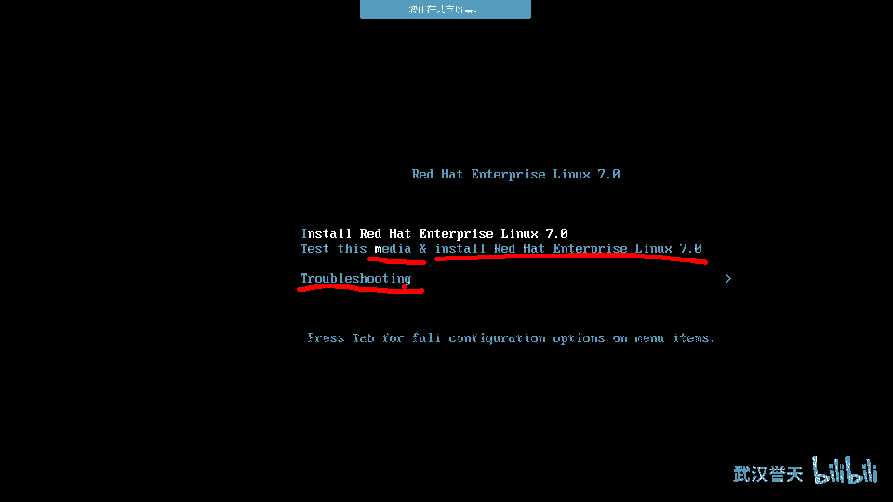

这边还没有进去吗？多重启几下，能进去了吗？把自己。

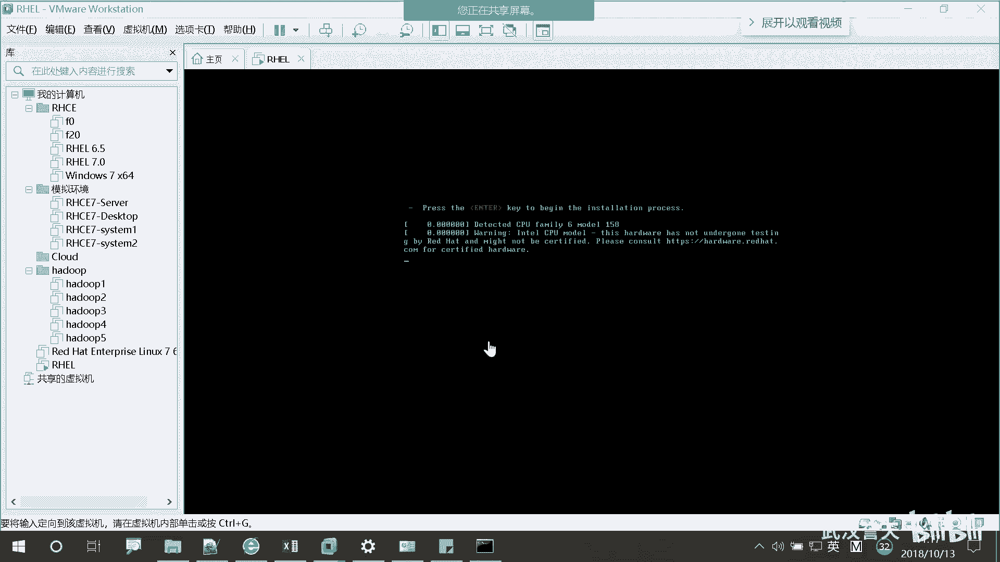

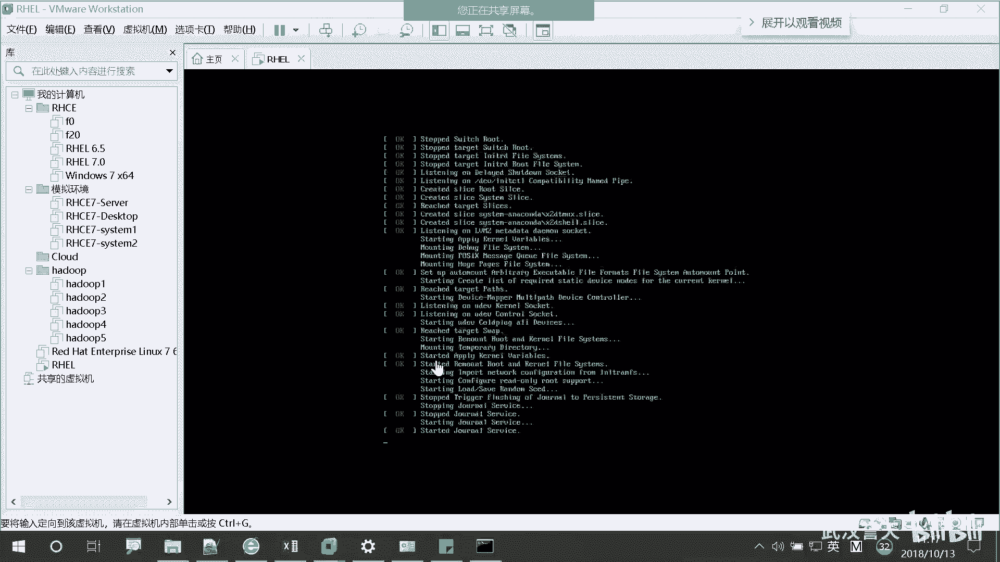

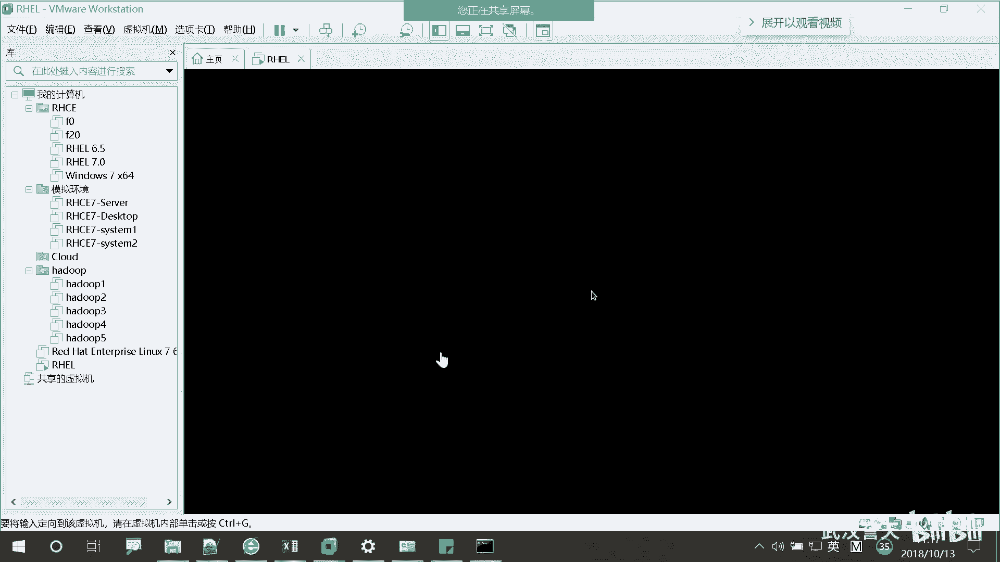

好。大家可以看到这个界面啊，这个是什么？欢迎你来到什么什么对吧？他说什么语言。

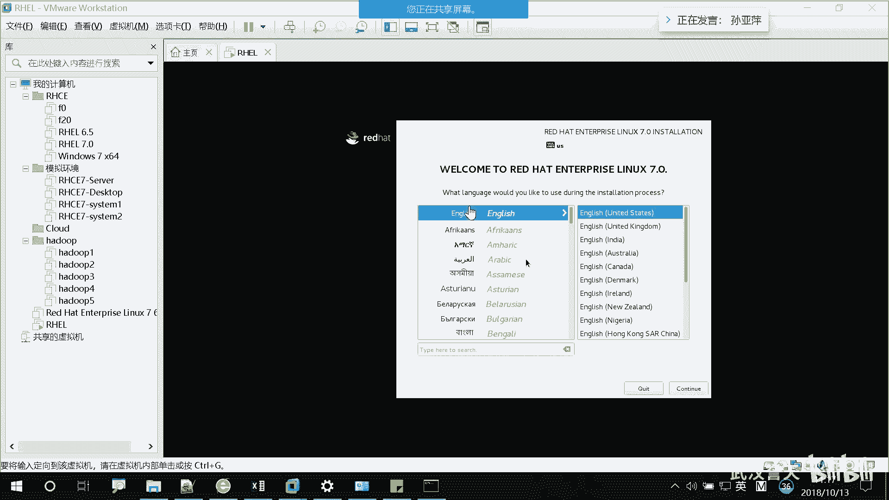

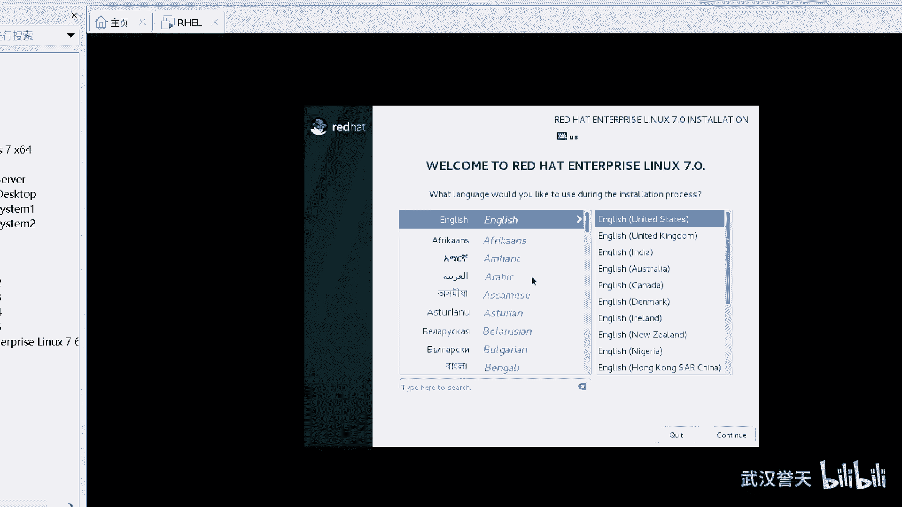

在这个安装过程中啊在这个安装过程中安装啊这个install大家要认识啊，安装的意思对，安装的过程中过程中什么样的语言language大家应该认识吧啊。什么样的语言，你选择什么样的语言啊？

这个我这个呢是这样的啊，我的原则坚持大家用英文啊。那天我我上一次网上上课的时候，我从就是我一直在去学校上课的时候啊，我一直在用的英文，但是我从来没有用过中文的。然后那天我就为大给大家演示，说用一下中文。

结果里面好像有好不习惯。呃，在我的课上啊，我希望大家大家给我发那个那个的时候啊，不要让我看见中文啊。😡，一定要用英文啊给大家要求啊。

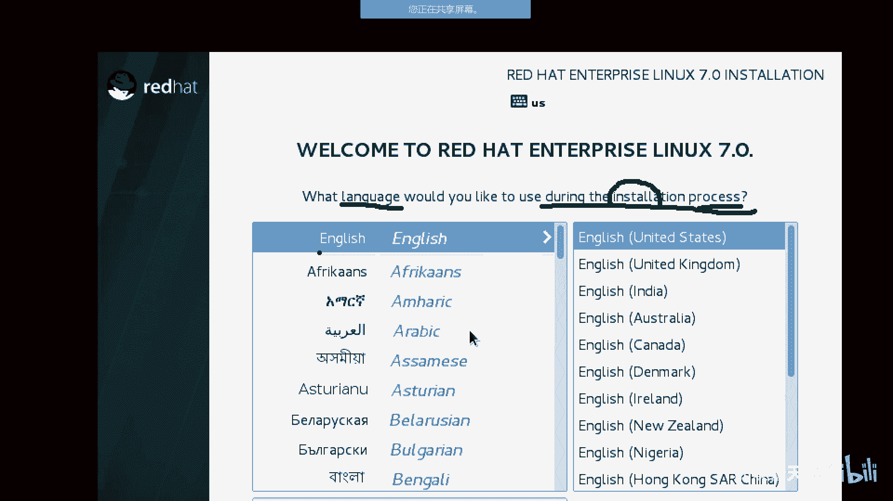

如果你走到这一步，你报了这个班，对吧？你就下不了船了啊。😡，啊，我们选择中文啊，不选择。选个英文啊，选第一个。好，右下角有继续啊继续。啊，然后这个安装操系统的过程呢跟其他的版本可能不太一样。

因为之前有人安过六对吧？六版本的那个六呢，它是一步一步，然后下一步下一步下一步这样子，对吧？但是我们这个红包期啊，它是在这个界面全都在这个界面上，你需要自己点开，对，需要自己点开，然后去修改。

那如果说我安装出来的，跟你安装出来的有点不一样。那肯定是在这个界面上出现问题了啊，肯定是在这个界面上啊啊，那么我们看一下啊，第一个选择的是dta and time，就是什么呢？日期和时间，对。

日期跟时间啊啊，那么这个日期跟时间呢。呃，大家可以看一下，我们。在这个地方，为什么要选日期跟时间，屏幕卡了吗？我的屏幕卡了吗？😡，啊。对，因为之前如果你用中文的话，里面绝大多数还都是也都是英文。

大家不要想着说，你用中文进去全是英文了啊。没那么好的事儿啊，人家也不会给你全翻译过来的，只有部分是中文，而且很别扭。比如说你选。呃，你还要安装，你要选中文的话，你是不是还要安装中文的那个字体？

否则你那怎么选呢？字母怎么选选不了。😡，他那个目录名字要叫中文，你怎么选呢？哦，你们自己看一下自己的网络啊。哦，这个地方时间很重要啊时间很重要。其实我们在这装那个大家可能装windows啊。

装其他可能呃不太能够感受到啊，我们这个日期的重要性。那么日期有多重要呢？是这样子的啊，如果你的日期不对，有可能啊比如说啊举个例子，极端情况下你的日期不对，那有可能比如说你的物理你你的物理级啊。

有可能你的你都上不了网。😡，你访问任何网页，它都会显示说什么网页找不到啊等等这些。对，这些都是有可能啊，也不是全是，有可能是你的日期时间不对。那为什么时间不对，我就访问不到了呢？

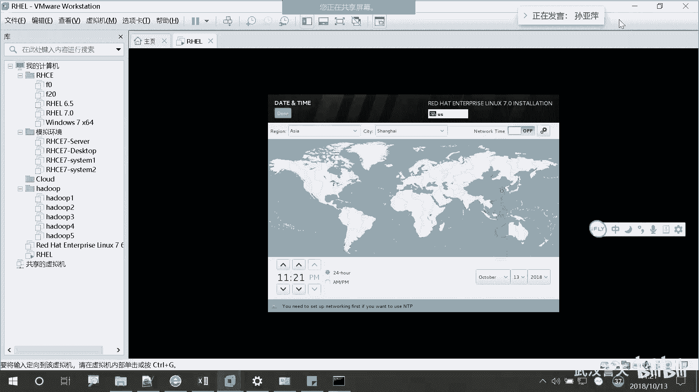

因为我们现在很多网页啊很多网页大家看到这个S没？对吧HTTPS。这个S代表是加密的意思。对，S代表是加密的意思。那么加密。加密的过程中呢，就比如你访问一个网页。

它这个过程你的数据传输是加经过加密了的那在加密的过程中，它会放进去一个很重要的因素，叫时间。对，叫时间。那如果说啊你去访问别人的时候，比如说啊你的时间不对。你去访问别人的时候，那别人那边就会收到，哎。

你来访问我，你的时间跟我的时间不一样呀。比如说你的时间快了，或者你的时间慢了，那么服务器端收到的啊，大家有没有不知道呃，什么叫服务器的呀？知吗？嗯，什么是器啊？服务气是什么呀？这没有。那个就息吧。

知道什么叫服气是吧？

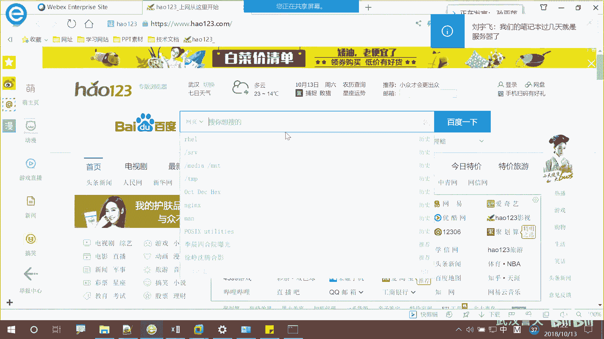

过几天就是服气了是吧？😊，服务器嗯。呃，说那个的啊，其实就是对性能更好的PC机就叫服器。对性能更好的PC机。那我们那台主机跟你们的主机有什么区别呀？😡，没什么区别的。那我叫他福气，对，叫他福气。

一是它性能好。第二，它上面搭了很多服，对吧？不叫福气嘛。😊，对它就是性能稍微好一些，对，稳定一些，对吧？稳定一些啊，所以叫服务气啊。因为你这个网站有没有就跑在你的服务器上面，对吧？

所以当你去给他发出请求的时候，如果是他接收到的消息是来自于过去和或者是来自于呃什么什么将来，那么他会把你的消息丢弃掉。把你的请求丢弃掉。对，是这样子的啊，所以这是加密来实现的。那么为什么我们现在都没有。

就自己的电脑上面，还有你你你的手机啊，根本就没有设置过时间呢？

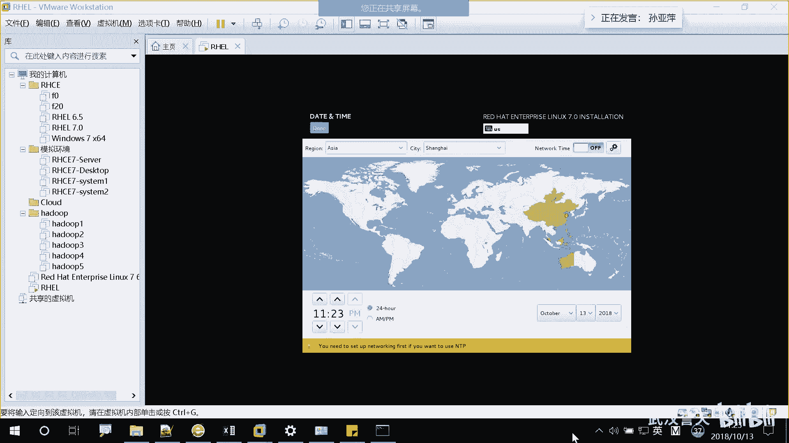

对，其实这个事情运营商已经帮你做了。对，只要你联网你的时间就是准确的。对你的时间就准确的，大家可能。自己这个手机啊，不知道大家呃呃就之前用过那种老式的手机，对吧？老式的手机是不是要调时间呢。

自己上来就对时间嘛，就新新买过来之后就对时间。但是我们现在新的手机不调对时间。对，因为你上来第一件事就干嘛？联网嘛，对吧？是不是联网啊，其实你的电脑也联网，它也有时间同步。

它是跟一台时间服务器去同步的那它在哪儿呢？我可以给大家看一下啊，其实你的电脑笔记本里面。

他就连了一个时间服务器。对，你们可以去看一下自己电脑啊，windows的它的时间服务器叫times呃呃times windows什么什么点com吧。呃，在在在。

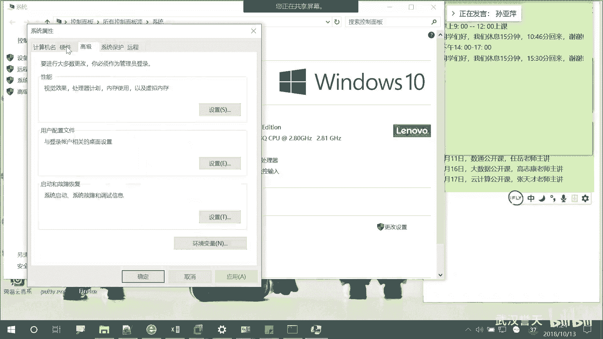

哦，在日期跟时间里面是吧？嗯，看一下啊。

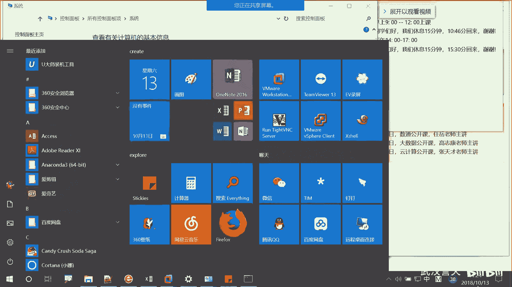

日期。这里有个日期跟时间啊，在你的控制面板里面有一个日期跟时间。然后这个地方呢，你看到没？internet时间就网络时间，对吧？这个地方你看啊，它说已将你的计算机设置为自动。看这里啊。

是不是自动与time点windows点com这个服务器同步了呀。这是一台windows提供了一台实践服务器。所以当你去联网的时候，它你的你的物理机啊就会给就会向这个实间服务器去同步。

所以为什么你的时间这么准呀，对吧？是从来没有调过时间呢？对，就是因为这个原因。他跟你的时间去同，他跟你那个时间服务器同步了啊，当然你也可以修改啊，你可以用别的别人的那个时间服务器也是可以的。

在这里修改也可以啊。而且我们国内也有一些什么免费的那个时间服务器，大家都可以用。大家可以搜一下，像一些学校啊，还有一个国家授试中心那些服务器都可以。而且我们这个实践服务器呢。

有专有的公司也专门去提供这个时间服务器的功能啊，而且还要收费的。对，省黑收费的啊，而且还不基本上不便宜。呃，而且就算呃一般情况下啊，你创业公司想去搭服务器什么之类，都需要用到时间服务器。

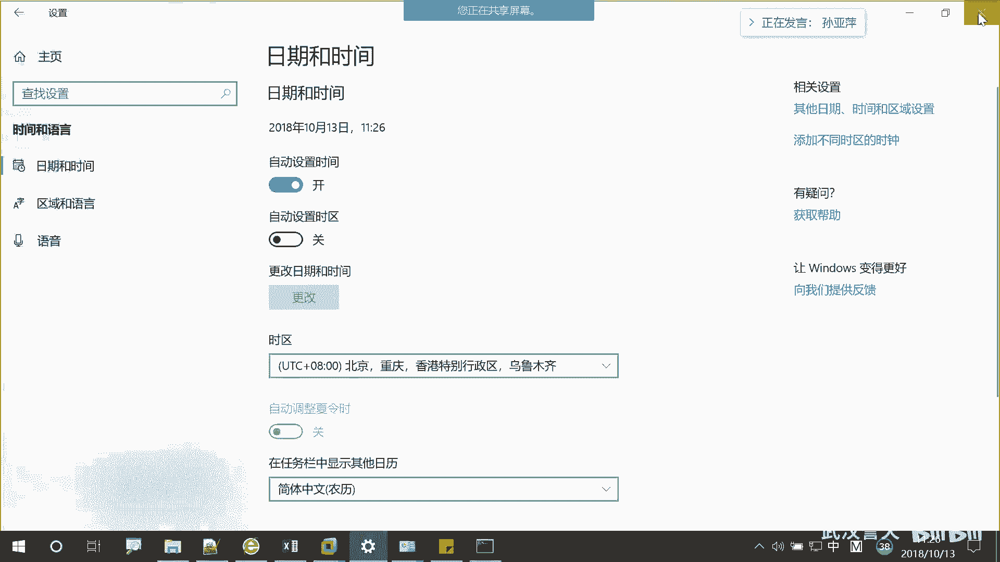

对，都需要跟别人的时间同步啊。啊，那么我们这个。

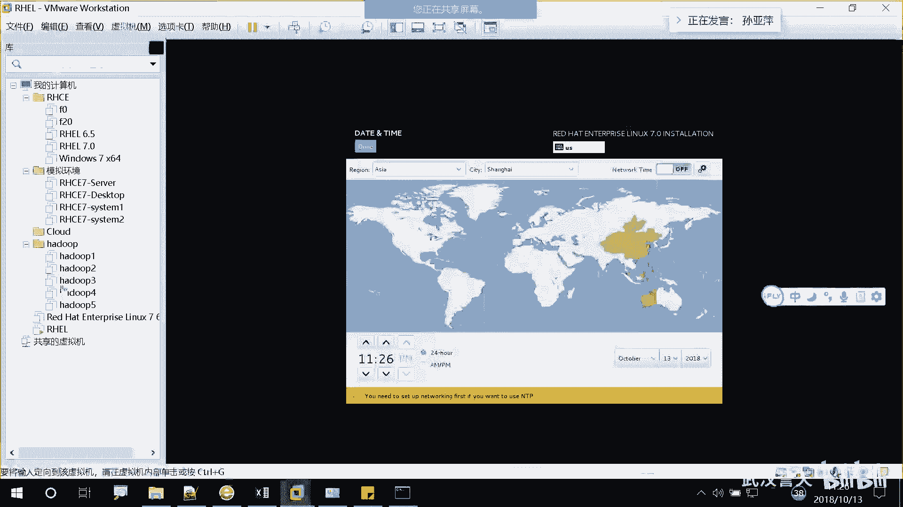

这个地方啊，你看这里它会选一个什么时区吧，对吧？其实我们的手机第一件事，其实你选了时间的，你在哪选的呢？你选的地区是不是中国呀？对吧你选了中国，是不是就是你选了你在哪个时区啊？😡，对吧否则你如果选美国。

你的手机时间是不是就美国时间？对吧所以这个地方呢你要想时间你选了地区的话，选了地区啊，上海，那么它就固定你在这个时在这个时区。那其实我们的时间啊需要一个统一的时间，为什么呢？如果说啊。你用的本地时间。

比如说国外啊，比如说美国对吧？美国跟我们是差时区的对吧？相差不多是12个时区，大概是12个时区，对吧？那么如果我用的是本地时间，比如说我本地时间是11点半。那么有可能美国是不是晚上11点左右啊？

对吧那他引用的呃那个那个本地时间，我也用的本地时间。那这样的话，我跟他的时间是不是不一样啊？有没有可能你访问的服务器，那个网站是美国的时间，美国的那个服务器。啊，这个能理解吗？就你访问的网站。

那个网站有可能在国外嘛。😡，对吧如果他用本地时间，你用本地时间，那这样的话，你的时间是不一样啊。啊，对吧。好，那为了避免这种情况，我们肯定要有一个统一的时间嘛，对吧？我们大家应该听过一个时间叫什么？

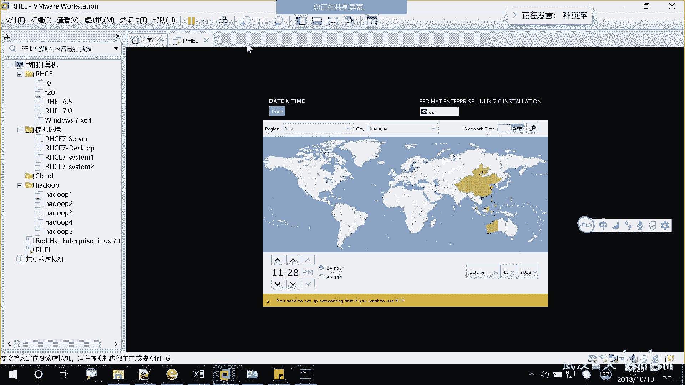

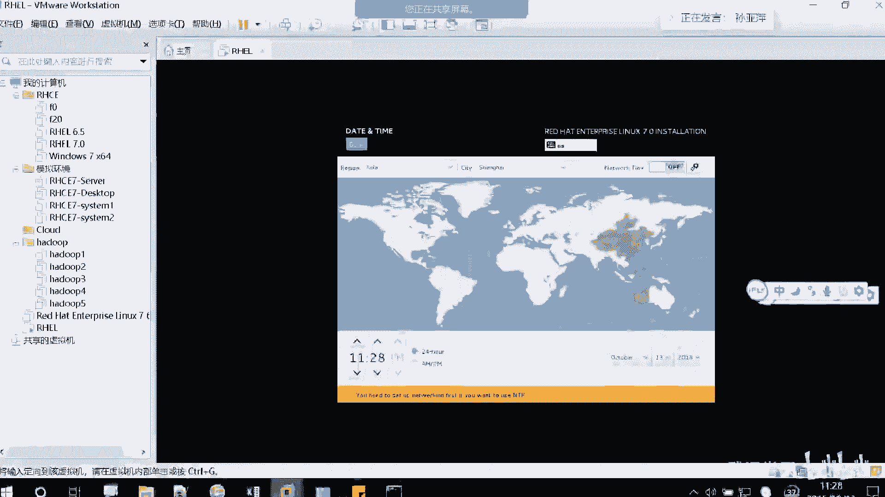

UTC时间吧，大家有听过吧？叫世界统一协调时间。对，叫世界统一协调时间。它规定了我们时间的起点。规定了我们时间的起点，大概应呃大家知道时间起点在哪吗？😡。

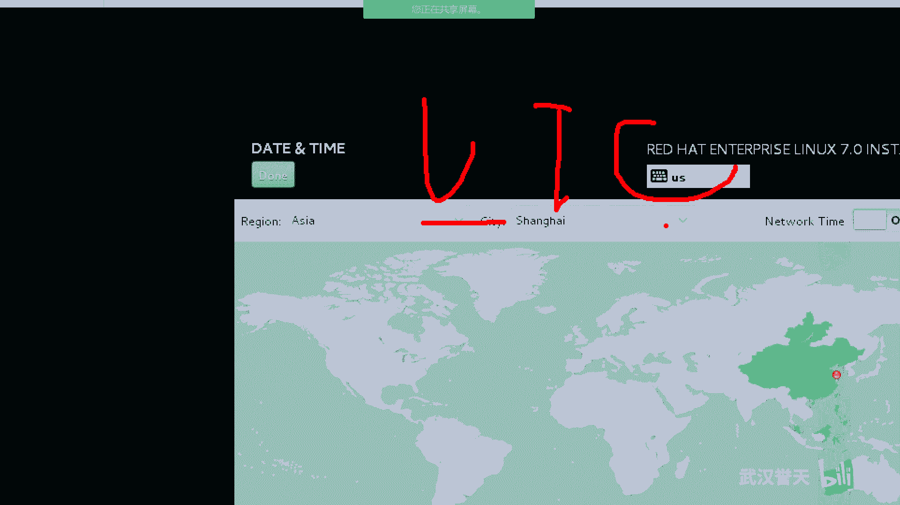

啊。😮，对。英国的格林威治那个本出字母舰嘛，英国的格林威治那个小镇对吧？它是以那个为时间的起点啊，那英这这这英国在哪儿啊？😡。

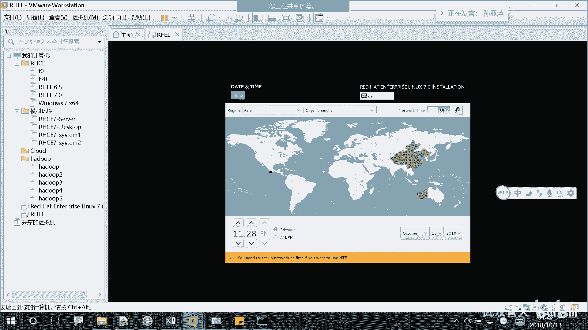

不好意思啊，一礼拜吃。哦，随便画一下吧，比如说在中间啊。啊，如果是这条线啊，叫本初本初子午线，对吧？对，叫本初子五线。那这个是时间的起点。比如说啊这个是零点。对吧0点，那么我们中国在哪个时区啊？

是不是东八区啊，对吧？所以我们选上这个是不是要选跟这个时间就同步了呀？这个是UTC时间嘛啊，那就是UTC加8，对吧？对吧啊，那美国呢？美国可能在这边对吧？他是。C五区对吧？C5区是不是减5？😡，因为。

这个是嗯。这个怎么说啊？美国在西五区吧，因为为什么？因为我们将全球这个地图画成了24个时区，对吧？画成了24个时区啊，而东十呃东十二西十二。对，这个是时间的起点，那这边呢我们在第八个对东东八区。

那美国在西五区。那我们如果这个时间是零点的话，那我们是早上8点，那它就是。晚上几点啊？凌晨5点。咋算的？晚上几点啊？然。嗯，晚上9点吧。减5吗？24减5呀。啊，呃19点对，19点啊19点。

都是体育老师教的他。我就是。我不背锅啊。啊，是晚上19点啊晚上19点。所以如果说他本地时间是晚上19点，那如果你的时间的格式是UTC减5，那么换算成格离位置的时间，是不是就是零点呀？

对吧那我本地呃中国这个地方是UTC加8，那换算成时间你是不是也是零点？那这样时间是不是就统一了呀，对吧？叫所以叫世界统一协调时间嘛。

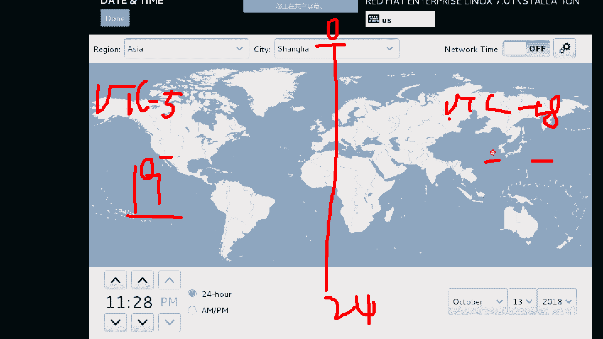

这个地方能听懂吗？好，那如果是网络时间，你想象NNTP同步的话，对，就像我们windows这样同步，我们也可以做到同步哦。在这里有个letwork time，叫叫叫网络时间，对，叫网络时间。

大家可以把这个打开啊。嗯，我打不开呀。好，大家可以点这里啊，这就要把它打开on变成on，然后这个地方。没网络打不开嗯。我刚刚应该把他那个改一下。好，这个地方呢大家可以看到啊，这个地方有NTP服器。

这个是虹贸官方的那个。呃，时间服器。

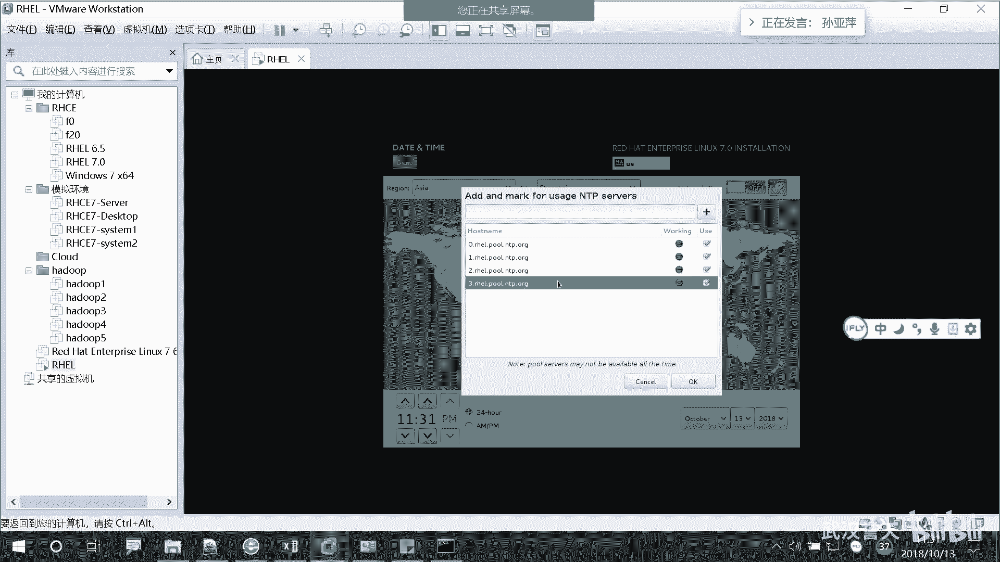

这是虹贸官方的几台时间服务器。当然如果你真的是开公司，对吧？你。他是免费的，一般免费的东西。不好用，对吧？万一他停了，你时间就不准对，时间就不准了。所以一般情况下，如果你真的要带服务气的话。

你是不是要去租别人的时间服气啊？交了吧。对，要去租别人的时间服务器啊，要不然你时间。😡，是你你的时间上升同步向谁同步呢？对吧？有可能你的时间走路者就慢了，不是走走就快了，这个是有可能的。

所以它会每隔一段时间向时间服务器去同步。那如果说你购买了时间服务器，那你将将你的时间服务器啊，比如说啊我们本地地方也有一个时间服务器叫172，你可以把它的那个IP写在这儿。172。25。254。250。

25呃和254都可以啊，这两个都可以。你可以把它地址写在这个地方，然后填个加号。😡。

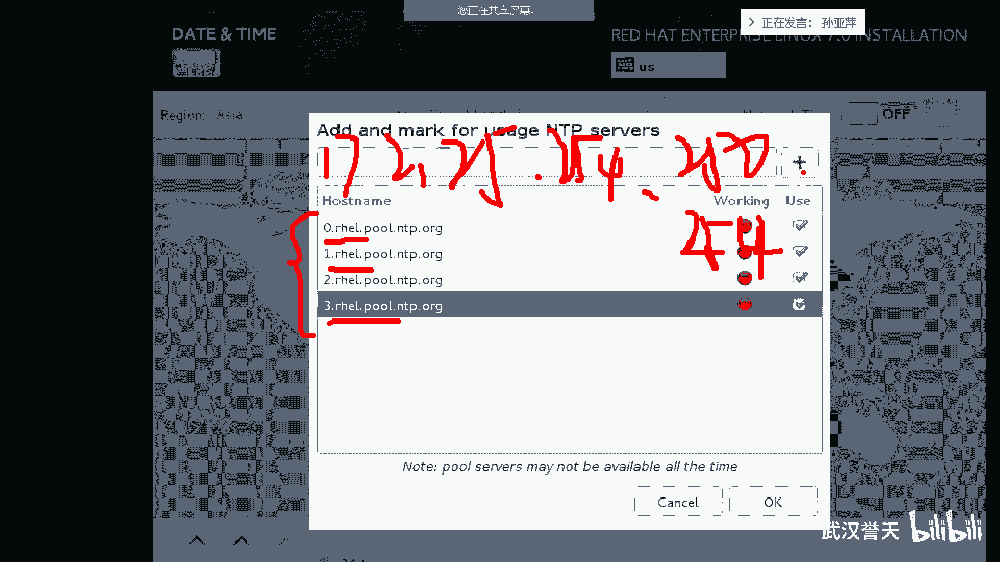

就把它添加进来了，看啊。17202。

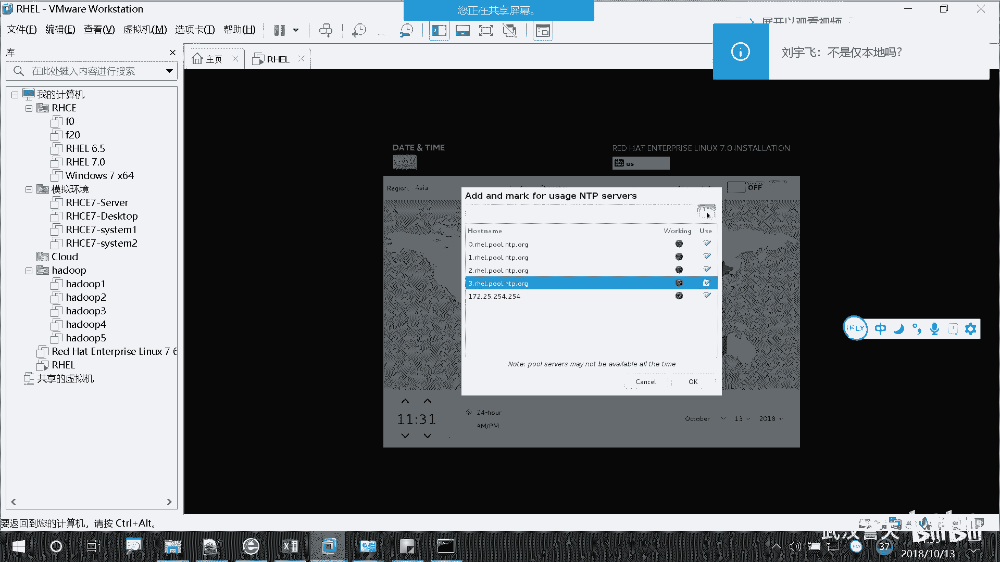

哦，就加在这里了啊。