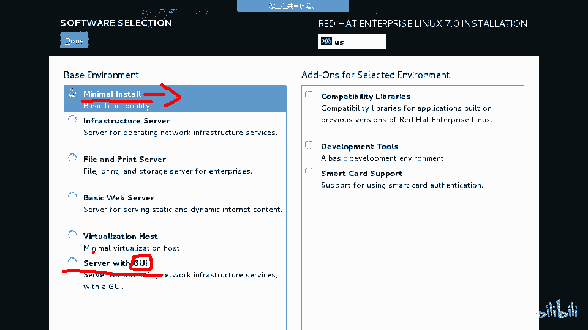
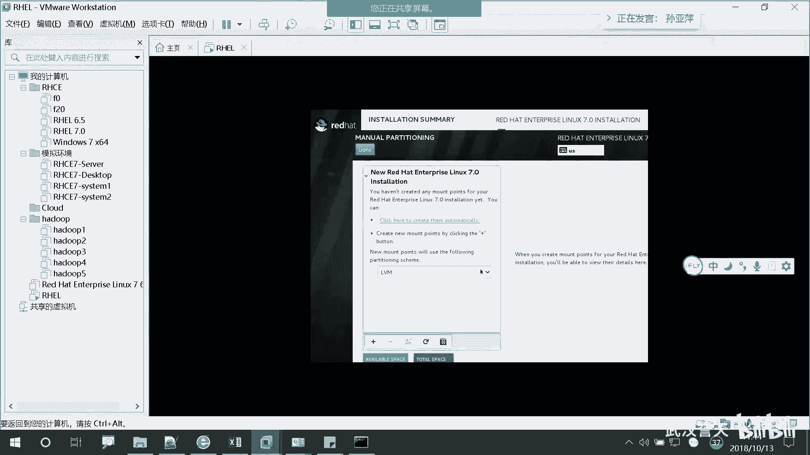
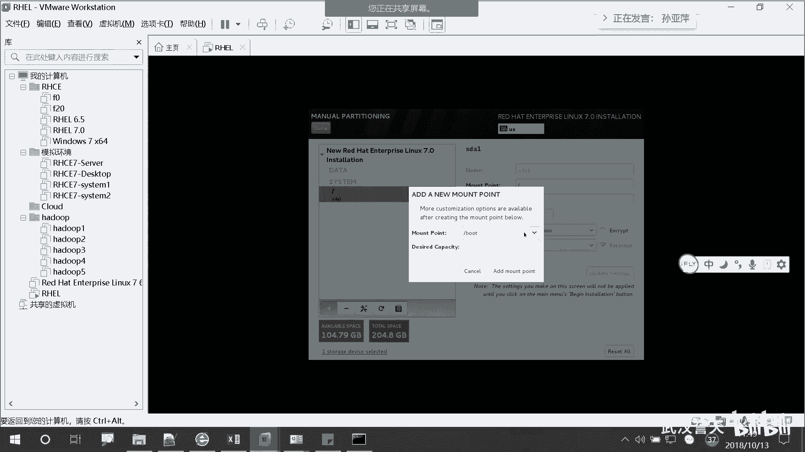

# 誉天-Linux／红帽认证／RHCE／RHEL7基础操作视频 - P7：02 rhel7操作系统安装(续)_3 - 武汉誉天 - BV1xr4y1K7Aj

啊，如果网络是通的话，那么这个地方就会变绿色。对，就会变绿。对，变为绿色之后，你把这取消掉啊，取消掉。啊，把这个勾上，那将来你这台呃服务器这台那个讯机啊，就像这个时间服务器去同步了。

这个地方大家能听懂吗？对，就是你工作的时候，如果装的时候有时间服务器，就一定要写时间服务器啊，一定要向时间服务器去同步的。啊，这个地方我们就不同步了吧，完了啊。啊，那我就选一个时区就可以了啊。啊。

这个地方键盘在默认不用管啊，就美式键盘啊。如果你改成别的，估计你摁出摁个A，它出来不是A是吧？对，就默认啊。好，这个地方。呃，这个是你安装的语言啊，就是你将来用的时候。

就之前选那个语言呢是安装过程中的语言。这个是你安装完之后，你可以带哪些语言。比如说啊。你可以带英文对吧？你也可以就是其他国家，比如说简体中文啊什么什么之类的就是。他这些呢就是如果你勾上了啊。

就将来你你可以切换语言的。😡，对，是可以切换的，这些都是一安装包。你只要选上了，将来就给你安装上了。对，但是我我们不选啊。我们就默认啊默认。😡，啊，下面看这里啊。这个是呃软件software对吧？

software，然后这个是安装员什么installationof安装员选安装员啊啊，刚刚我们呃用物理机的同学啊用物理机的同学。大家注意啊，你们选择的是。on the network。

你的安装员在我们台服务器上面。所以这个地址我给大家我给大家写一下啊。

呃，这个地址是。哎。这个地址啊。你看我我们的安装员在这里，你们把这个地址敲上去啊。😡，是172。25。254。250，然后斜杠HEL7。0斜杠叉8664A哦哦。这个啊。能看到吗？地址啊。

本地的同学记一下啊。你们刚刚用那个呃装的。这个地址啊。172。25。254。250HEL7。0叉86点DVD。呃呃，形状DVD。

好，记下来吧。啊，如果是远程的同学，远程同学我们用虚拟机用ISO装的时候啊，他已经检测到了。

看到吗？它这个地方已经自动检测到了安装界指，就是你之前连过它，它就自动检测到了。所以这个地方你就默认就可以了啊，默认就可以了。😡。

好，然后。往下啊这个地方注意啊，在这里啊，这个叫software selection，就软件选择点进去啊，这个地方非常重要啊。

第一个是minum模式，就是最小化安装。对，最小化安装。如果你用这个安装出来的话，它只有。黑色的呃黑色的背景是没有图形界面的啊，是没有图形界面的。当然。呃。

我们现在啊lininux呢它也他也做了重新界面，而且重新界面还比较好用啊，而且为了我们方便学习。对，如果你选了这个，那你鼠标就用不了。大家可能之前没有接触过linkux的的时候啊，呃没有鼠标。

感觉什么都做不了，对吧？对，不知道呃。不敢全都敲秘密，你不知道该敲什么。如果你想呃我们方便学习啊，方便学习，大家都选这个serv with UI。over with GOI啊，这个是图形界面的意思。对。

图形界面的意思。如果你选这个，那将来你鼠标就可以用了，对，好开心，对吧？在linux里面也可以用啊。

122是出的。没有错啊，我直接复试过来了。Lero。对。这个这个这个仓库应该是没有问题。网络问题。So。远程有什么问题吗？什么。

远程不是这个地址啊，远程你们就选这个默认这个嗯。好的好的，我离开跟大家说一声。好，你这个地址你们来看一下啊，我们继续啊，这有同学等在等着。

啊，我们选最后一个啊，s with youI。就最后一个，然后这边完成啊完成但。好，这边在检测啊，检测你的戒指。啊，然后这边。安装安装路径啊，安装呃就是。就是你的操作系统安装在哪个位置？

之前我们选了1个那个200G的磁盘空间，对吧？200G的啊，然后呢。一般有同学直接就断了，我们就选这个上面啊。如果说你有多的磁盘，就是多的那个那个那个那个磁盘空间呢，你可以在这里会有很多。

也可以选啊安装在哪个盘上面。当是我们现在只有一个啊，然后呢我们这个地方看这里啊。😡。

后边先不用选服务，先不用选。哦，然后这边呢它是自动默认是自动的啊，如果你直接回收的话，你就然后安装，那么呃直接完成安装的话，那么这个地方呢它就把你自动分区了啊。如果是自动分区的话。

它就会把你所有的磁盘空间给用了。对，所有磁盘全空间都用了。当然我们这个地方要看一下分区的过程啊，所以我们自己手动配置分区啊，手动配置分区。

选第二个啊选第二个。好，完成。没有声音吗？

你看一下你的网络啊。

我卡了。我卡了吗？我卡了吗？其他同学呢？哦哦，sorry sorry，看错了看错了。

好，然后。这个地方啊这个地方。😡，我们这个地方默认是逻辑卷，逻辑卷呢我们后面啊第二本书的时候会讲，所以我们现在啊就用标准分区，然后你在这个地方点一下啊，点一下这个地方是标准分区，对，标准分区啊。

标准分区我们用标准分区啊。好，选上这个。然后我们添加分区的左下角这地方有一个啊，左下角这地方有个加号，对，有个加号，我们点一下啊。

啊，这个地方呢添加分区啊，但是它这个地方并不是添加分区，它是添加挂载点。对，挂载卷其实也是在分区啊也是在分区啊，大家可以看一下啊。

这个地方有个挂载点，一个是根，一个是什么boot homeUSR有很多目，就是类似这种目录形式，大家应该有见过。其实在我们windows里面应该有见过吧，它只不过它是反斜杠，对吧？它是反过来的这样子对。

反过来的那其实我们linux当中的目录结构也是它是这样子的对，这样子的。对，是这样子的啊，它是这个地方是挂载点，为什么叫挂载点呢？其实这个挂载点就跟我们windows里面的那个盘符是一样的。对。

大家知道什么是盘符吗？😡。

上午能有点那个了，可能讲不完。啊，这个地方看这里啊，这个不就是盘符吗？对，这个就叫盘符啊，知道盘符了。有同学可能不知道啊，然后这个地方就是盘符，这个盘符其实就是比如说啊你插了一块U盘。

那这个地方是不是就多了多了一个盘符啊？😡，那这样的话，你是不是才能通过这个盘符，然后进入到你的分那个那个磁盘里面，然后才能去写文件，看文件，对吧？是这样的啊，所以我们这个挂载点呢。

其实就相当于是我们盘符的作用。那将来我刚刚说了，这个地方是不是我们相当于是个目录啊？

对吧它是一个目录啊，那将来如果说你进入到这个目录里面，就相当于进入到一个分区，这个地方大家能理解？比如说啊。

我现在把这个这个这个斜杠啊，这个斜杠叫跟，对，斜杠叫跟，相当于我们windows里面C盘。对，相当于windows里面的C盘啊啊，那么这个就是一个目录，对，就是一个目录，是一个挂载点。

那我把这个跟分区跟分区啊，如果分出来的话，那是不是我分的第一个分区啊？😡，对吧按照第一个分区，那将来你去访问。访问这个根的时候，是不就相当于访问的第一个分区啊？就这样能力写。可以吧，对。

而且这个分区是必须要分的，必须要分啊，就是像C盘一样。好，那我们就开始分啊。

选项。然后你给多大呀？

比如说啊这个地方我们给实际吧，分分去嘛。给多一点啊。实际。如果不放什么东西是可以完全够的啊。

啊。我给了200G是吧，那我多给100G吧，有点吝啬了10G。啊，我给了100G啊，100G，你们自己看着分啊。啊，添加挂载点。添加挂载点。好，这个地方啊。

是不就多了一个呀？😡，这个地方就是100G的一个分区，它这个第一个分区不叫C盘什么什么什么之类的，它叫SDAE对，SDAE后面的时候我给大家解释这个什么意思啊。S代表是scars。Gs盘。

不知大家你没听过啊。gas盘之前我在选那个磁盘类型的时候，大家还记得吗？😡，那个地方不是scars盘嘛？推荐那个地方呃过的稍微快一点，就推荐的那个地方，大家可以装的时候再注意一下啊。😡，然后D呢。

D代表是disk。对，disc就磁盘嘛，对吧？S呃AA代表是A代表是第一块硬盘。第一块硬盘一代表第一个分区。这句方能听懂吧？好，那么它挂载在哪个位置啊，是不是跟呢？😡，是不是跟分区啊，跟目录上面啊。😡。

啊，那我开始分第二个啊。第二个叫boot分区。啊，这个地方除了根分区以外啊，除了根分区以外。

他是必须分的，其他都不是必须的。对，其他你可以分，也可以不分。那这个就相当于。这个目录啊，那你我如果说第二个分的是这个分区的话，那么我。😡。

