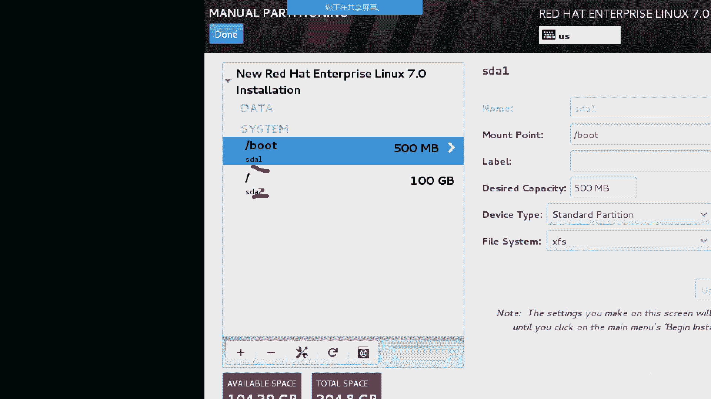

# 誉天-Linux／红帽认证／RHCE／RHEL7基础操作视频 - P8：02 rhel7操作系统安装(续)_4 - 武汉誉天 - BV1xr4y1K7Aj

访问这个目录的时候，是不是访问了第二个分区啊？

这呢能听懂吧。好，这个如果大家听不懂的话，我们第四章内容还会再讲的啊，这个目录结构。

啊，这个bo分局是干什么呢？它一般是放到我们的启动过程中啊，启动过程中。呃，所要用的，比如说。反过来说，如果这个不分区文件丢了，那你启动就起不来了。😡，对，是它一直是一个引导的作用啊引导的作用。

那这个bo的分区呢，我们一般给多大呢？500兆就够了啊。500兆就够了，其实200兆就够了，哎多给了一点。

对，500兆就够了啊。

啊，我再添加一下，大家可以看到这里啊。哦，它变成啊自动把它变成二了。其实按理来说，不应该是第一个，它自动变成二了。你看是不是第二个分区变成第二个分区了，他那个名字变了。

啊，我再分印给大家看一下啊，它应该是3。好，再分一个什么分区呢？叫home分区。

大家可定看不到ho目分区啊。这个呃是一个加目录，这个其实很好理解。其实就是我们C盘里面的用户那个目录。大呢这个可以理解吧。对，就是用户那个目录啊，那就放了一些我们私人的文件嘛，对吧？

每个用户的一些私人的文件。

啊，那这个我给多大呢？给两个G啊。

给两个G。两个G啊好，确定。

那这个地方它是变成三了，看到了吗？😡。

对，这个地方就变成三了啊。第三个分区啊，另外我还给大家讲一个一个比较重要的分区啊，叫swipe分区。

其他的分区我就不分了啊，我们后面会讲的。

swipe分区不知道大家有没有听过啊，叫交换分区。什么叫交换分区啊？😡，windows里面大家听过虚拟内存吗？😡，有没有没有听过的，没有听过的，我就讲一下。虚拟内存。交换分区其实是一样的。Yeah。

什么叫交换分区啊？😡，交换啊交换分区啊，给大家举个例子啊。大家都知道我们整个呃那个。CPU内存跟磁盘的关系，大家应该知道吧。计算机你该知道不学嗯不学计算机的可能不太清楚啊。哦，大家简单的说一下。

比如说这地方CPU。这个地方是内存。这条是磁盘啊磁盘。那一般我们的文件是不是放在我们的磁盘上面呀？😡，对吧一般文件放在磁盘上面。那如果说你的CPU啊，你CPU啊，你下发一个指令，说我要打开这个文件。

那是不是给CPU下发指令啊？对吧他是不是就会去读磁盘上，按理来说，他是不是会去读磁盘上的文件呢？😡，啊，应该是吧。但是这个时候他一般情况下不会去直接去读取他。一般不会直接去阻止他，为什么呀？😡。

大家知道为什么吗？因为磁盘是不是性能比较差呀？读写性能比较差，一般CPU运转速度是比较快呀。那这样的话两边是不匹配。那必须要跟CPU就是有有一个什么跟他进行交互的过程，要进跟它的速度要进行匹配。

那这个就叫内存。对，就要内存，所以内存比较贵嘛，对吧？肯定比你硬盘贵啊。所以这个时候CPU把这个文件的数据读到内存当中，这能用。读到内存当中，那CPU是不是直接去读内存就可以了？😡，啊，可以吧？好。

那其实在早些时候，我们的内存是不是很紧张啊，就是呃内存比较小，对吧？内存比较小。那这个时候我要读多个文件往里面读，往里面读，是不是都写到里面了呀？😡，那是不是内存有可能不够用啊？😡，那不够用怎么办呢？

我再打不开文件了吗？😡，对，有可能有可能会卡住，对吧？就打不开了啊，那这个时候如果你加了一个交换分区，那交换分区其实它是硬盘上的。一部分空间对它是硬盘上的一部分空间。那我们把硬盘上的一部分空间当内存用。

那这一个部分空间就叫做交换空间，叫交换交换分区。对，叫windows里面叫虚拟内存。那他能不能直接当内存用呢？其实是不可以。对，其实是不可以。那他用来做什么呢？😡。

它是用来存放我们内存当中暂时用不到的数据。举个例子啊。比如说这地方你开一个word，你要学习了对吧？C一了，回去啊，什么什么都资料都准备好，都打开，然后虚拟机打开，对吧？好，那是不是都读到内存当中了呀？

😡，啊，那这个时候呢你就占了一部分内存啊，比如占这么多。那这个时候哎呀玩累了是吧？困了，打把游戏放心放松一下，对吧？很多同学就开了一把游戏，对吧？常这样。那这个你游戏很占内存吧，对吧？那你游戏占内存。

那怎么办呢？它这个时候啊，比如说你前面这些是不是用不到了呀，现在暂时没有访问，对吧？他就会把这部分空间。😡，这部分数据啊这内存当中的这部分数据，然后放到哪啊，放到交换分区里。这个能听懂吗？对。

放到交换分区里面啊，然后。是不是空空出来一部分空间啊，然后给到我们的呃游戏来用。就这个意思能听懂吗？那如果我又唉爸妈来进屋了，对吧？😡，对，然后你马将切过来了。对，马上切回来之后。

你是不是又要读这些文件呀？😡，那这个时候它是不能直接读的啊，它需要把它再放回到内存当中。然后再组。所以，交换分区的作用就是暂存内存当中的部分数据。而且这些部分数据呢是呃暂时没有被访问的。这个能听懂？

好。远程农学没问题吧。好的，然后我们给多大呢？我给一个G吧。而且现在交易分机其实不怎么能用到了，因为我们内存慢慢就比较大，对吧？动不动几百个G啊，就服务器上面啊T啊，而有我们现在笔记本16G啊呃。

32G啊都都都都够用了啊。

啊，那我就给他给他一个G啊。

啊，我就分这么多啊就分这么多。😡，呃，完成啊完成，你看这边用了还剩100个G，对，还剩100个G，在这里可以看到。

然后完成啊。这边呢你选接受变化啊，接受就是格式化，接受格式化。哎，就格式化。

好。

我们上午稍微拖一点时间，把这个地方讲完了，快结束了啊快结束了。

远程同学稍微嗯。

稍微拖一点时间啊。啊，然后这个地方啊都没问题了啊，这个地方网络跟主机名什么的，我们后面再说啊，后面再再再去管它。

然后直接这个右下角有一个叫开始安装，看到了吗？开始安装，我们点一下啊。

啊，这个地方呢我们需要创建两个用户。第一个是root用户，他默认这个用户就是有的，你需要给他添加一个密码。

添加一个密码，看到没？root的。😡，对，password没有设置，对吧？这个root用户就相当于我们操作系统里面的windows里面的administ，对吧？对，超级管理员啊，他的权利非常大。

我们后面慢慢的来说啊，会有什么样的权利，权利非常大。所以我们呃lininux默认是不想让你用root用户去登录的。所以呢我们必须创建一个普通用户，但是windows里面就没有，对吧？

你就一管理员就可以了。但是这个地方啊必须要创建，对，必须要创建一个普通用户。它倾向于你用普通用户去登录，而不是root用户去登录。

好。我们把密码设一下啊。但是密码如果你设的简单的话，呃，它会需要摁两下。对，摁两下一下，他会说说说你密码太短了什么之类的，那下面有提示，当然我们可以再点一下就可以了啊。啊，这个地方创建一个呃普通用户啊。

比如说张三。密码说一下啊。啊，看这里啊。这个地方呀。

这个地方看到没？这有个进度条，对吧？这个不是11189。是一表示的是1189个软件包。对，1189个软件包正在安装嘛。如果你选的是最小化模式的话，它是300多个包。那如果你这个地方是300多个包的话。

那一会儿就安装好了。对，那代表你装出来的就没有图形界面，能听懂吗？就是没有图形界面啊啊，我们等一下啊，这个应该装的比较还是比较快的。😡。

我们上午争取把这个地方呃弄完啊，下午我们就开始正式从后面开始。大应该装了吧，自己笔记本上面装了吗？远程同学有跟着一起装吗？哦，装好了是吧？314，你是314个包吗？啊，郭俊同学。才安装了哦。

300多个包是吧？可以。我们不慌啊，现在吃饭的人比较多，下也下不去估计现在。等一会儿啊。大家不要着急。自动分区是可以的，这个是没有问题的。呃，说一下啊，如果是自动分区的话，它分出来的是逻辑卷。对。

分出来是逻辑卷啊。😡，如果你自动分区，你就看不到这个分区的过程啊。对大家可以手动分一下啊，手动分一下。😡，那不慌啊，我下午给大家用用那个远程那个连接的，因为这个可能有。大家下午装1个VC。

再装1个VC就可以连我的电脑了。对的，如果以后服务器太多的话，那你你手动分这个就很麻烦了，对吧？你可以自动分。上午内容大家还有什么疑问吗？没有是吧嗯。我那个我这就说话的语速，你们还能接受吗？😮。

就是我这个讲课的进度。可以是吧。啊。有时候时断时续啊，可能是网的问题。吃饭去。陈呃，陈燕思。是男生是吧？好，我记住了。没意思。😊，好的好的。我移动是吧，那我。尽量不动。音量不重。

大家就是有什么问题可以在这个聊天框里面说啊，你们如果在群里说的话，就是看不到。😡，有问题可以在这里面。大家如果说有的就是有时候他是这样子的，你你断断续续的话，你重新进一下。退出来重新进一下。

应该会好好很多。再等等几分钟等几。我把后面。嗯，这样吧，大家可以大家先去吃饭吧，我们下午再继续吧，还剩一点点。好的。哦，照相了照相了。好，就这样吧，那个远程同学先吃饭，我们下午继续啊，下午继续。哦。

我可以去吃饭了啊。我们下午是两点钟啊两点钟。这是我们下午的上课时间啊。好。啊。

可以帮我。