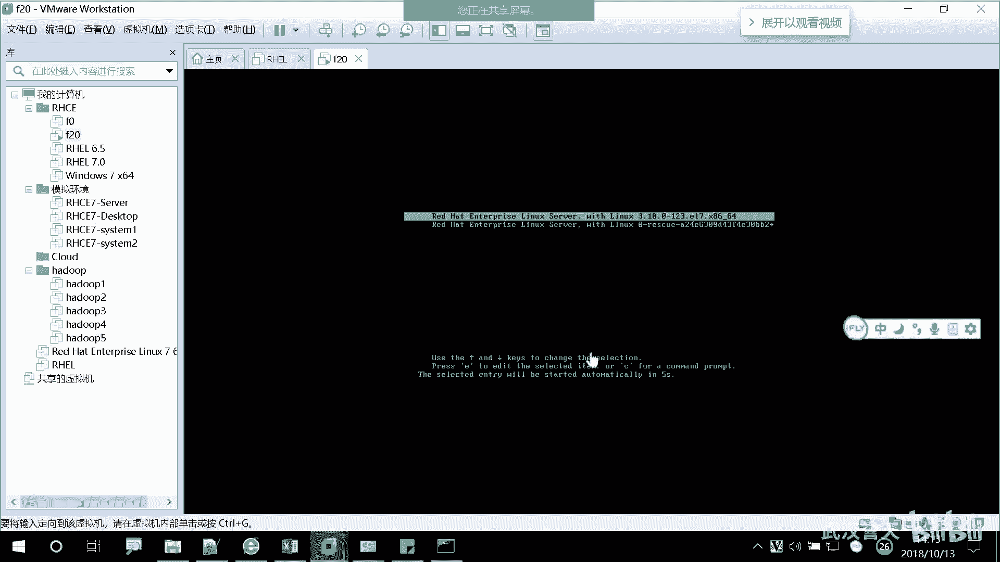
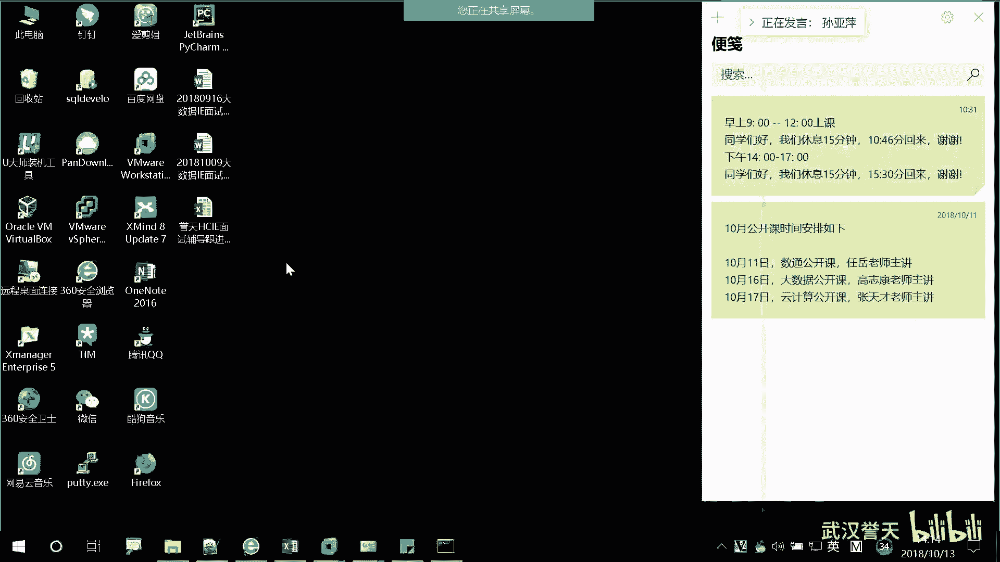

# 誉天-Linux／红帽认证／RHCE／RHEL7基础操作视频 - P9：03 Linux发展和rhel7基本操作_1 - 武汉誉天 - BV1xr4y1K7Aj

装完之后，这个有个reboot重启一下啊，点一下。

呃，之前我讲分区的时候，因为有同学好像那个地方没过去，对吧？呃，没过去，原因可能是你的分区的根分区啊，大家要注意啊，根分区至少要10级以上的啊。为什么呢？

因为剩下大家看到我剩下是不是还有一些那个目录是没有分分区啊，对吧？如果没有分的啊，剩下的如果没有分，他们全部都占跟分区的空间。这个能理解吧？哦，全部占根峰区的，所以根分区要大一点啊，分大一点。

好，这个地方就是一个呃。同意书嘛，就是你接受他的一些什么条条框框的约束，什么什么。你们有兴趣的可以看一下啊。哦，就在这地方点个接受就可以了。这个有个小勾号，然，这个框框点上就可以了。好。

这边右下角啊右下角完成完成配置，右下角这个地方点一下。又开始重启了。好，这个地方我给大家讲一下啊。😊，嗯。

这个叫K down。K down能他这方有一段话在描述他K down是用来做什么的？他说K down是内核，这个是 kernelel内核的意思啊。内河crash崩溃。内核崩溃的一个机制。

叫什么叫内核崩溃的一个机制呢？就是比如说啊你在运行运行，有可能你windows大家可能遇到过windows蓝屏，大家知道吧？应该遇到过啊啊，windows蓝屏啊，这种像一般就是内核崩溃了。

就系统崩溃的这种。那linux同样也会遇到类似的情况，所以这个Kd呢它提供了一个什么呀？它说它是系统的一个什么什么even的事件，然后它用来干什么呢？Kd用来capture就是用来捕捉。

捕捉一些信息，就从你的操作系统里面，对吧？捕捉一些信息，那这些信息是来记录什么的呢？是用来记录你操作系统的一个运行的状态，就是内核的运行状态，操作系统的运行状态。好，那记录记录他有什么用呢？

比如说啊它是在内存当中记录的啊，你看这地方它是不是有个内存的空间呀，对吧？多少多少兆啊，预留多少多少兆，然后用来记录你的运行状态。那如果你的操系统在某一时刻崩溃了。他是不是一直在记录呀，对吧？好。

崩溃的那一瞬间，他是不是保留的是崩溃的那一瞬间的状态呀？对吧好，那这个时候它本来是在内存当中的，它就可以把它写到硬盘当中了，生成一个Kd的文件。那么正常情况下啊，它可以将这个文件要联网了啊。

它可以将这个文件，然后丢到一台服务器上面就传过去。它这个文件会传过去的啊，传过去之后呢，那么这边就是收收到一个文件，再收到一个文件。那么这个文件呢我们可以拿来做分析。

就是分析一下有什么原因导致我的内核崩溃。对他就是这做这做呃呃就是这个用处啊。好，这个地方呢，当然其实这个分析的并不是呃什功的分析，还需要一些特定的软件来分析。而且这些软件一般也都收费的。

像那个360里面好像也有也有这个功能，也可以分分析一下，分析windows什么之类的。这个是需要收费的一个项目啊啊，那么其实我们这个地方呃也没必要，对吧？如果你内存不嗯没有那么多。

那你把它去掉也没有关系啊？

你把它去掉也可以。好，然后下角啊右右下角啊继续。yes就可以了。

好，这个地方啊。呃，是一个订阅，这个是订阅的意思啊，就是订阅什么服务啊什么什么之类的啊。然后订阅管理注册就是注册的意思。对，注册啊经常去注册一些账号什么的，这个注册就这个意思啊。哦。

那这个地方是用来做什么呢？像我们这个系统啊呃我们学的这个系统。叫HEL对吧？它是红帽的一个发行版。那么你要用这个系统，比如说要出现问题了。对吧这个问题了，谁帮你修啊？😡。

那可能是红猫的售后帮你帮你去解决这个问题，对吧？但是前提是你要购买它的服务。你要购买他的服务，他才会帮你处理，否则。呃，就己自己自生自灭，对吧？所以这个这个那个发行版是会涉及到一些购买服务的。

所以这个地方呢，他是问你要不要注册呀？对，如果你购买它的服务，那么你是需要注册的。你你注册之后呢，后面会填一个什么那个序列号，你把填进去就可以了。那如果说我们是做实验，对吧？😡，那我们就不做作为。

因因为你要选这个的话，后面就过不去了。所以我们就选第二个啊，注册啊不注册。

当然我们其实还有一个版本，待会下我待会儿讲版本的时候，还有一个版本跟它类似，那个就不涉及到服务。就是之前大经常大家可能遇到那个sdoS那个版本。啊，这个地方啊finish完成。哎，我是学了。那我啊。

还有重启的。

啊，遇到这个界面。嗯，大家可以看到，这是我登录的一个界面啊，登录界面。然后这个是那个普通用户叫张三，对吧？我起了一个名字啊，你们名字随便取。

然后你可以用这个账号就登进去就可以了。对，但是我们刚刚有说到一个叫root的账号，对吧？这个地方没有显示出来，因为默认它一般不会把这个账号放在这里，因为用它登录很不安全，所以要想用它登录怎么办呢？

你可以在这里选啊，not list，未列出not list，你在这点一下。然后这个地方呢是一个user name，就是用户名的意思。对，用户名，然后在这个地方填root。填上用户名root。

然后last下一步，然后输入输入密码。这个密码大家自己装操作系统，自己要记住啊。😡，别装了操系统问我密码是多少，我也不知道，对吧？一般呃，我比较喜欢用redhead。

而且我们上面电脑所有密码都是redhead。对，密码都是来的ad啊。啊。我们学完第二本书，如果密码再忘记了，我们会破解密码啊。第二本书会学。

好，然后看到这个界面啊，我们整个操作系统装安装就已经完成了啊。们装出来了吗？没有装出来的。远程弄乐应该都装出来了吧。啊，我们大家呃这样啊。我们装一下winC啊，这样如果带自己笔记本上面。

当家笔记本上面有没有winC啊？没有。没有温C，我们以后上课用这个。呃。报错了就。

VC我的VC地址，大家知道什么是VC吗？😡，我的VNC地址啊，我呃待会课下的时候，我给大群里发一个那个VNC，他自己装一下。呃，然后你可以就可以连我的电脑，就可以看你的电脑，就可以看到我的屏幕了啊。

我的VC大家如果有的话，可以打开连一下啊。我VC地址是172。25。254。77，大家记一下啊，密码好像是呃远程不用VNC啊，远程用VC也连不了我。呃，密码是redhead，如果有密码就rehead。

没有密码就直接登录了啊，应该是redhead密码。啊，如果是物理机的话啊，物理机。大家需要装一个软件。装一个这个软件啊。这个命令可能大家没有学过，但是大家先敲一下啊，是一个安装软件的。

是叫tiger winC，我先装一下，给他看一下啊，这样啊在右在桌面上桌面上，然后右键。

右键啊右键，然后第二行有一个open in terminal。对open in terminal。看到了吗？对打在终端中打开的意思翻译过来叫在终端终端中打开。啊，这边呢就提供了一个命令函给你。

然后你在这上面啊把这一段话敲下来啊。哦，我可能这个地方还敲不了，我开一个啊。我这个你新装的操作系统，你新安装的操作系统是执行不了这个命令的啊。

你只能用我们之前那个F1F2那个装出来才能执行啊。

所以你们需要重装操系统。

我用我们的我用F20。

呃，我们班上同学是绝大多数都没有更新吗？

有wifi呃，这边wifi地址大应该知道吧。wifi的wifi就是这个呀，就是那个。看一下。就是一一天EDUtudent的这个。然后密码是87158220。对87158220。

然后需要那个呃短那个短信验证一下。然，就可以了，就可以登录了。我给大家发一个那个。winC的那个。大家可以装一下啊。这是哪个版本？我就把这个发群里，待会儿。

你们可以装一下。

然后你们的电脑插上网线啊，要插上网线。

我的温信连不了我。

微C是干嘛用的？就是一个远程桌面连接的一个。Yeah。呃，远程同学不用VC啊，远程同学不用VC。呃，本地的同学啊用NC。

对。啊，然后在这个上面你装一个包。这个。装一个软件包啊。我先装一下，给你们看一下啊。就这个命令啊，就这个。😡，大敲一下啊，要不然物理机流连不了我。要求错了啊。然后。然后去连我的。那个我的电脑172。

25。254。77。VC viewVIEWERVC view就是这个你敲完之后。然后再敲这个。就可以连我的电脑了。Okay。Okay。嗯。稍等一下啊，我跟那个现场同学。嗯，是这样的啊，远程不需要装VC。

亚仓库我们第二本书才会学第一本书用不到啊，第一本书不用大家去装包。我去帮那个现场解决一下问题，你们稍等一下啊，原生同学稍等一下。嗯，如果大家没有执行成功这个啊大家这样再加两个啊。

是把这两两条命令敲一下啊，然后再敲第三条命令。大家可以先叫。看一下啊。现场同学带笔记本的装一下winC，然后把自己的那个呃笔记本的电脑加一个地址。跟我在同一个网段就可以了啊，然后再去连我的。呃。

VC有同学连上我的VC了吗？Yeah。对。的异。Yeah。屋理他们。不认识用那个Q账号去登录的，所以很多同学是没有权限的。你需要这样啊。因为它是自动登录，都不需要你登录，它自动登录，所以那怎么办呢？

你可以这样啊，在这个右上角有一个root看到了吗？

点一下然，这个地方有个log out注销。

注销。

Okay。注销了之后。这个地方它会出现一个登录界面，因为你们在开机的时候，是不是根本没有登录界面呀，因为它设置的是自动登录。

对，用的coski这个账号自动登录。你可以这样，你可以在这里。在这里note list。

Root。

这样子就登录进来了啊。大家应该现在都能连到了，如果还没有连到的话，呃，先跟旁边看一个啊，下课的时候我来帮你们解决，好吧。啊。啊，连上我就能看到我的这片那个屏幕就可以了啊。我们继续啊，我们开始今天下午。

呃，课程。打开PP。好，袁先东学我回来了啊。😊，嗯。是这样的啊，大家看看这里啊。我们这里呢我有三个大家拿到的书，应该拿到那个PPT应该是它是以网页的形式啊，它是网页的形式。然后呢，它有三个文件夹。

这里啊123。RH033。因为我们用的是洪茂五的PPT，所以他的编号跟洪茂七是不一样的啊。我们刚上午说的是H124是第一本书，对吧？那红帽五的叫H033啊，它叫H033。所以你当你看到这个编号的时候。

它是红帽五的第一本书的编号。这个能理解吧。好，然后第二本书呢叫RH133。RH133啊，然后第三本书叫RH253。对，RH253它的编号呃是不一样的啊是不一样的。所以以后你们再看到这些。

它是红帽五的教材编号啊，这个是我们红帽七，我们拿到的书啊，拿到的书是红帽七的这个编号。所以我后面上课用的就是这个三个文件夹里面的教材啊，三个文件夹里面的教材教材，其他的。呃，还有一个这个啊。

这个可能不知道大家那里面有没有啊，这个是全英文的教材。对，如果大家需要的话，我也发到群里啊。这个是洪茂七呃，洪茂七的英文教材。的英文教材。啊，那我们之后如果有有用到这个英文教材，我也会给大家看一下啊。

给大家去个理就是看一下上面的知识点。好，然后。呃，它是网页啊，把这个网页打开就可以了。这是27033的所有内容，它一共有。嗯，好，下课反啊啊，一共有17章内容。那看一下分别是什么啊。呃。

第一章我们不讲啊，第一章没什么可讲的。我们从哦不这一张啊，从这里开始啊，从第一章开始。对，第一章第一章主要就是我们的linux一个发展理念，还有历史，就是如何发展过来的，以及我们的一些版本的介绍。对。

主要是讲这些内容。然后第二章呢，主要是我们linux的一些基本的用法。呃，比如说呃root有哪些权限呀，怎么去修改我们的密码呀，怎么去有一些快捷键，如何去使用啊等等这些啊。啊，第三个呢。

就是我们如何去运行，就是如何去获取帮助。对获取帮助。什么叫获取帮助呢？就是说我们在linux内部啊有很多帮助资源，比如说遇到问题了呃，怎么去解决呃。

这个命令的语法是什么样子的那我们可以在第三章的内容去学啊？我们linux自带这些功能。啊，第四章内容主要就是我们文件系统结构，对，以及我们一些基本操作。我们复制啊粘贴呀呃什么不是复制粘贴啊。

就复制移动啊，删除啊等等这些啊。然后第五章就是用户组，还有权限。用户组还有权限。然后第六章开始呢，我们就开始学bush share学呃脚本什么之类的，开始脚本了啊。呃，第七章呢什么IO管道啊。

怎么去处理我们的文本呢？对吧然后七张七章第八章，然后第九章也是文本处理工具。呃，后面呃什么一些如如何去配我们的网卡呀，配网络呀。如果去查找文件哪等等这些啊哦，大家现在可能。一有点懵，对吧？没关系。

我们从头开始啊。啊。嗯。上午时候给大家都介绍操系统也装好了。那么我们正式开始啊，嗯大家之前学linux到现在为止，大家也知道linux呃，它大概就是一个操系统，对吧？像我们的windows一样。

它是一个操系统，只不过它是我们服务器上比较常用的一个操作系统。那如果你学了in，你一一般的工作啊，就做一些运维呀等等这些工作。那其实呢呃linux现在运维工作比较火的，就是那个。就像像什么oracle。

对吧？数据库对数据库运维。但这个好像挺多同学学了OCP哦，我们班好像也有有有有人学OCP了，之前。对，学OCP，然后去做数据库。然后你要想从事数据库运维呢，那你也要学linkux。对。

学linkux学点那个运维的知识，然后再结构数据库来做数据库运维。那如果你想往更深的去学，那就是要学高级的HHCA对吧？架构师，比如像一些虚拟化呀，而且像一些什么呃还有一些容器的知识啊，或者是。呃。

什么调优啊等等这些。啊，那么一般情况下啊，我们做lin我学linux，就是之前有同学问我啊，都从事什么样的岗位？其实我可以访问过你学了link死什么不能。对吧。都可以啊，工作当中这个是非常常用的。

现在啊大家听的比较火的一些技术，比如说像一些什么呃云计算嗯，存储云计算，现在比较火的大数据，还有什么AI对吧？这些都是近几年都比较火的那大数据以后呢也会更火。啊，那这些呢大家可以认为它是什么呢？

它是跑在我们linux上面的一种应用程序。大家可以这样去理解啊。嗯。就比如说我们的windows对吧？我们的windows里面它可以跑很多应用程序，对吧？比如说像一些呃开发的软件。

它可以其实可以跑到windows，当然也可以跑在我们的linux上面。他其实是非常广泛的。因为我之前有一个朋友啊嗯。他是学那个。他是做那个芯片的，就是那个材料。对芯片相关的。然后他经常他是做那种生产的。

做生产，就是制造啊，就是别人把工艺呃模拟好之后，就是一些模拟的那个。算出来就是一种模型吧，算是然后他拿去制作生产。那然后他说我我之前有跟他说，我说我是学学这个教这个对吧？

他说哎我好像也需要学这个学一下这个。我说为什么您是做材料的，做芯片的，为什么要学这个呢？哦，他说啊他上一步是不是要设计这个模型呢，对吧？那么模型计算，他们的那个开发的啊。

软件是跑在我们这做linux上面。对，然后他每次如果说后面的程序有遇到什么问题，他不懂lininux，他就没有办法就是跟那个就之前他前一步的那个人，他就怎么不知道怎么沟通。对，他说我有必要去学一下。

所以可见我们linux用处非常广泛啊，就像我们现在呃比较火的大数据。因为我呃之前也考了华为大数据一段。那么像我们现在比较。呃，基础技能有了一些生物专业都要学的。对，之前说那个python从小学开始学。

对吧？但是我们那个是从现在什么时候从小学要开始学。啊。那我们大数据的很多像平台，像hado平台呀，像一些很多组件呢都是跑在我们linux上面的对，之呃，之前如果说你不从事运维工作。

就属于从事一些什么hado上那个大数据上面的一些呃平台的一些那个那个那个呃那个操作，对吧？那么你稍微也要懂一点我们linux知识，它起码你起码要达到什么水平啊，起码要达到我们的。呃。

基础的就是CSA的部分，你起码要要有对CSA这个基础你起码是要有的，否则呃一些基础的操作你都不太会，就好比你不会用windows，然后那你软件是不是也用不了啊，对吧？

所以都是要那个那个那个去有一下这个基本的知识啊。所以如果你有了lininux的之那个基础的话，你后面啊再学存储。但存储里面底层啊全基本上全是我们lininux的一些命令。所以你再去学存储，再去学云计算。

那都基本上他执行什么命令，你基本上都知道。😡，对他那个底层用的都是呃lininux。都是用linux啊，所以呃学这个是非常有优势的啊。好，那么我们来看一下啊，我们linkux的一个。

介绍啊它的一个linux的理念，ideas，对吧？还还有一些生产，它它是如何发展，一步步发展到现在的。那我们这张内容呢？嗯。我们这张的目标啊，学完这章之后，我们应该知道什么，要起码要知道一个概念。

什么叫开源啊，open source开源。什么叫开源软件？开源软件的nature本质是什么？对，开源软件的本质是什么？然后还要去我们的一个起源，对吧？有我们类似的一个起源。

还要我们要介绍一下我们的红帽的操作系统的一些发行版。当然我会介绍红猫的操系统呃，发行版也会给大家介绍一下其他呃公司的一些那个发行版啊，这个叫发行版的意思tribution叫发行版的啊。好。

还有一些我们linux的一些基本的原则，基本的原则。好，然后。是吧上来就说open source什么是开源呢？大家对开源有有了解过吗？什么是开源？同学有了解过吗？Okay。开放源代码。对，看这里啊。

open source就是我们的software，就是软件和什么呀？source code就是代码code就是代码意思。available是吧，就是。软件和源代码。对。

就是呃就是所有人都可以获得它的呃软件的源代码。什么叫源代码呢？就是大家知道我们所有的软件都是程序员，对吧？呃，一个代码，一个代码码出来的，你用C语言呢。

java呀等等这些语言写出来的那源代码就是他最初的这个呃他写出来的这个代码，就是呃没有经过任何处理的，然后给你了，然后你可以看到它是怎么写的。对。这叫开源啊，这开源对开放源代码开放源代码。哦。

然后呢我们的开源啊，我们有一个叫自由软件。我们开源，大家是一说到开源啊，就会想到那开源是不是就是免费的呢？对吧我我原代码都给你了，那还不免费吗？😡，对，不是啊。开元不等于免费。太人了。呃。

不等于是不等于。开源是不等于免费的啊，那开源比如说啊像我们这个我们现在装的这个操作系统啊，它就是开源的对，它就是开源的。你可以下载到它所有的源代码。但是它就免费了吗？不啊，我们之前在安装操作系统的时候。

有一步是什么呀？是不是订阅呀，是不是要购买它的服务啊，你用它的可以，你也可以不用购买它的服务。但是如果出现问题了，再想一下啊，我们这些操作系统都是跑在我们的服务器上面的对吧？😡，你肯定要求它稳定啊。

而且出现问题是不是要有容易去解决呀，否则你你很没有安全感呀。所以一般情况下是不是要购买他的服务，对，购买他的服务。那么这个时候你就要付费了。😡，对我们很多版本其实都是付费的对，都是付费的。那么。😡。

那免费是什么呢？😡，免费软件。大家平时用的很多软件，比如说啊我们的其实我们的操系统是不是也就是一种软件，对吧？我们的windows也是一种软件，office也是一种软件。那这种软件是免费的吗？啊。

大家平时用这种软件是免费的吗？😡，是免费的，反正没交过钱，是吧？啊，都是破解版的。其实按理来说按理来说，本来就是啊事实就是windows和我们的office，其实都是要收费的。对吧但是你用的是盗版的。

你每次隔一段时间可能要激活一下。对，因为都破解了嘛，对吧？其实呃只是在国内可能是这种啊在版权问题没没办法去追究，太多人。盗版的了。对，其实国外其实这方面管管的还是蛮严的啊。那么这种免费软件呃。

刚刚我之前跟大家发了一个就是team build的那个软件，大家记得吗？就是那个远程桌面连接。就是呃如果你想呃我帮你去解决问题，对吧？我可以控制你的电脑。对你把你的ID和你的密码发给我。

我就可以控控制你的电脑。那那个软件它就是一个免费软件。但是它是一定程度上的免费软件。什么叫一定程度呢？就是如果说。你是自己用啊自己个人使用和学习的话，你可以用。但是如果是商业用途。

给公司对很多人去用公司级别去用的话，那么就需要收费了啊，要收费了。那这种它其实在一定程度上就是免费的，就是没有涉及到版权问题。对它就是免费的。但是这种免费呢，你能看到它的源代码吗？看不到吧。对吧。

所以开源你可以看到下载到它的源代码，而且这个开源的系统，它开源的软软件，它的源代码必须要公布的，因为它是开源的。那免费的软件我给你用，那你你你只能免费用一下嘛，对吧？你看不到它的源代码啊。

所以开源不等于免费，开源不等于免费啊啊，那么在我们开源件呢会有四大自由啊，四大自由就是自由软件机会。它定定义了一个呃自由有几大自由的原则。首先第一个啊。它自由的是什么呀？去运行，以任何目的去运行。

就是什么意思啊？就是以任何目的去运行这个软件。也就是说，无论你用这个软件。无论你用这个软件用来做什么。😡，对你是干好事也好，干坏事也好，他不管你对你可以以任何目的去运行去使用这个软件，这是第一大自由啊。

因为很多那种攻击的软件，其实按理来说呃，你免费呃就是开源机它是不会管的啊，你你去呃去去。得攻击别人的电脑啊，对吧？就去窃取别人的信息啊，这些他们是不会呃，这是自由的啊，是自由的啊。

那么第二个自由呢就是学习和修改源代码。学习你可以拿到它的源代码，你去学习啊，或者是你在那那个源代码基础之上进行修改，这都是可以的。这都是可以的修改，然后你把它怎么样再发布出来。😡，你把它再发布出来。😡。

对，是允许的。那么其实比如说啊你你你觉得哎他这个代码好像写的不好啊，你自己想重新修改一下，然后把自己的一些代码放进去，然后呢在网上公布出来，这也是允许的。这也是允许的啊，重分发重分布。

但是别人用不用就是一回事了，对吧？对别人要用，那是不是要有风险？那用了出问题，谁来负责？对，就是这个事情啊。在干嘛？然后它还有一大自由是在是什么呢？就是它可以自由的去吧，衍生版本啊，就衍生是那个衍生。

衍生版什么叫衍生版呢？就有可能你这个软件啊，我拿到你的源代码，我可能不是用来去做。你就是这个这个软件之前所要做的事情。比如说这个操作系统可能不不不把它拿做什么当操作系统来用。我可能唉我把它修改之后。

把这一部分源代码可能会丢到。会加到一些加一些别的代码，或者是丢到别的那个那个那个呃软件里面，对吧？那这样的话叫衍生版。可能你这个软件用在别的地方，就是是生成了另外一个就是二次开发，生成另外一个软件。

这也是允许的啊，这也是允许的。但是呢他有一个呃，他还有一个要求啊。他是需要标明他们出处的。就是你使用了呃哪个开源的系统，对，使用哪个开源的系统，你需要标明他你的这个使用了谁谁谁谁哪个位置什么什么的。

需要标明出处啊，因为毕竟我们呃程序员把这些软件写出来，对吧？就是辛辛苦苦写出来的对，他们有奉一般这种开源件啊就要有奉献精神，对吧？新呃自己这是相当于自己的个人私人智慧，智慧结晶，对吧？写出来一个软件。

对他把它贡献出来，开源出来。需要一个奉献精神的啊，而且你去用的话，你需要标明一下，就标明一下出处啊，标明一下出处。啊，还有其他很多的一些呃什么，我们这个是自由软件基金会规定的啊。

自由软件基金其实还有一些其他的开源的一些项目。当然他们有自己不同的一些准则，对，有自己不同的一些准则。啊，这个是开源，什么是开源，大家应该清楚了。啊，然后大家了解的什么是开源系统？

下面呢我们来说一下我们lininux的起源啊，lininux的起源。呃，我们linux呢。呃，他是他很年轻，对，什么叫很年轻呢？他也是1个90后，对吧？我这里有很多90后，对他是91年才出现的对。

91年才发布的第一个版本。那么在这之前，首先跟大家介绍一下它的来源，它之前呢发生了一些什么事情。呃，1984年的时候啊，1984年的时候，一个叫richard的那个一个一个人。

对他看他去就是看呃发起了一项运动。发起了一项运动。它一个组织啊叫GNU组织。对GNU那个projectGNU的一个项目。他其实就想去倡导什么呢？倡导自由。对，倡导自由。

然后它有一个它里面有一个基金会叫自由软件基金会。就是我们刚刚提到的自由软件基金会。他就想能不能有呃一些软件呢，可以大家都来使用，而不是说呃呃就是你的你软件开发出来之后，只能你自己公司内部使用。

或者你自己个人使用。那这样其实在我们很早期的时候啊，我们还有一个操作系统叫unix，大家应该应该听过，对吧？unix最早的时候，它是呃几几年出现的是19。69年。对。

1969年由美国的一个贝尔实验室研发出来的。其实刚开始的时候，我们unix也是它源代码也是可以拿来使用的对它也是公布了的。但是后来由于一系列的原因，贝尔实验室呢发现了他的商机，对吧？就是商业用途，对。

有盈利呀，对吧？盈利发现有盈利，那么后来呢他就没有把这个代码公布出来了。那在GNU的时候，那个时候啊，他就看中了，其实看中了unixux对那个那个操作系统。当时开发出来的时候，其实他比较欣赏啊，然后呢。

其实那个时候它开发出来的也是一种就是内核，比较内核啊。那么这地方大家要区分出内核和我们的操作系统的区别。GNU组织它每你一个操系统的核心是不是内核呀？对吧既然有组织一直在寻找一个什么呢？一个内核。他。

刚开始的时候啊，他觉得unixux不错，对吧？他就在unix之上呢开发了一些组件。就是我们操作系统组件。比如说啊内核是什么呢？内核就是让你的你的那个那个那个它是一个就是呃。他可以去管理你的硬件资源。对。

硬件资源。比如说只有你的内你只有内核的话，你的系统是可以运运行起来的。但是你是不能控制它的，就是它可以去连接你的什么呀，连接你的什么硬盘哪，网卡呀等等这些对CPU啊等等这些都是可以的。

但是如果你想要一个。😡，没有操系统啊，只有内核的情况下，你是没有办法去控制它的。也就是说它没有接口，你没有接口，就是可能你没有这样一个什么呀。😡，一个界面，你鼠标可能去点一下，比如说啊我要去点一下网卡。

修改一下配置。其实最终是不是修改你底层的一些硬件的？对吧那如果没有操作系统，只有内核，它是没有人机交互的界面的，你是没有办法去控制它的。这个地方能听懂吗？😡，那有了操作系统，有了操作系统就组建。

比如说啊这个桌面。😡，他是不是开发了一个桌桌面的组件呢，对吧？这鼠标哎，点点点，我为什么可以用鼠标这个点点点的功能啊？哎，这是桌面的主题啊，什么一些乱七八糟的功能啊。😡。

比如说像我们linux里面share啊，就share是是也是一个操作系统的一个组件啊一个组件。那么刚开始的时候，我们的GNU啊就在unux之上开发了一系列的我们操作系统组件。对，操作系统组件。好。

那后来呢unux对吧？商业用途。对，因为。发起这项运动的人，他倡导自由嘛。那后来你你把它商业用途，而而且源代码并没有公布出来之后，我就没有办法去使用你了，对吧？

