# 远程连接SSH - P1 - 打羽毛球的橘猫 - BV1Tb411e7Cz

好，录像已经开始。这边的演示是如何用客户端远程访问到我们的linux的主机。这里面提供一个客户端，是用secret cIT打开它。这边有一个安装包，secCIT的安装包双击安装就好了。

windows安装只要下一步下一步就搞定了，不用太纠结它哈。下一步。continue，我同意下一步。默认的这个所有用户都可以用哈。呃，如果你喜欢你可以选择cust就自定义的去安装。

那我选择所有都让它默认的这个啊。创建桌面呃，就是创建桌面的图标，还有创建程序的那个开始菜单里面的图标。那你如果不需要的话，你就桌面有个图标就好了啊，开始。安装。

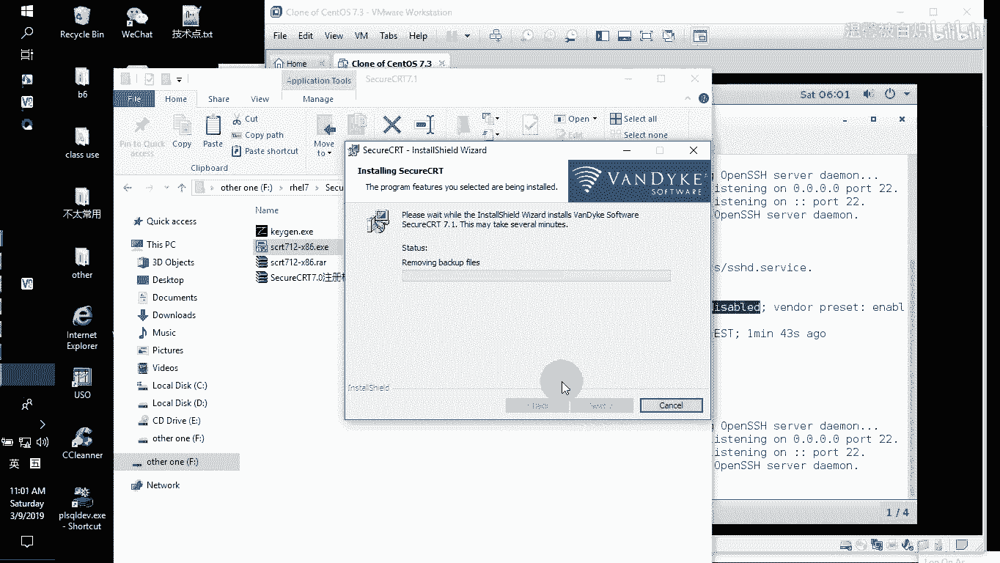

安装完成在桌面的话呢多出一个图标，多出一个图标。不要现在就打开它不要现在就打开它。你打开的话呢，如果你想看只需要看它的路径就好，我们把它装在哪里了。装在了C盘的po file下下面的叉86。

然后里面的话呢有个那个默认的software，就是它的这个名字哈VDS。然后后面的话呢就有它的sT。底下它的启动程序就是sCRT点EX哈。好了，那找到这个的话呢，是因为我们要破警它。

右键点击这边有一个kegan就是破解精灵。右键选择用超级管理员运行它，记住一定要用超级管理员。如果你的权限不够，你必须要切换到能够使用超级管理员权限的账号去启动这个程序启动它了之后。

并不代表说你现在就拿这个用名，拿这个呃company就你的那个城市名，然后呢拿那个S number，然后exed data等等这个license key就可以直接用。它是这样用的啊。首先第一件事情。

找路静。派起。搜索。😡，找到这边的这个路径，就是它。啊，当然了我这边的话，因为可能他直接就扫到了，看到吧？它的路径在C盘。program files里面，然后呢，它里面有一个那个默认的程序名。

找到secCRT是是它的secCT的程序。open我们一定要看到它的路径ha been done，就ha been done，就扫得到这个程序，并且能够找到成功的对吧？

OK然后它会蹦出一个license的，就是我们所说的那个license help，就它的注册程序，选中这个注册程序，然后open。他是默认找这个注册的时候。

他会让他直接链到他的那个注册的那个EX的程序里面。那找到两个都OK找到了之后，这会再选择gene就通用绿化，点击一下它通用绿化了之后呢，接下来不是说绿化完了就能用的那我们一般的话呢打开的时候，大家注意。

因为我这边以为有注册记录。所以你打开的时候它就能用的。但是你们那边一打开不能用的，打开的时候，它会蹦出哪个东西呢？它会蹦出的是。

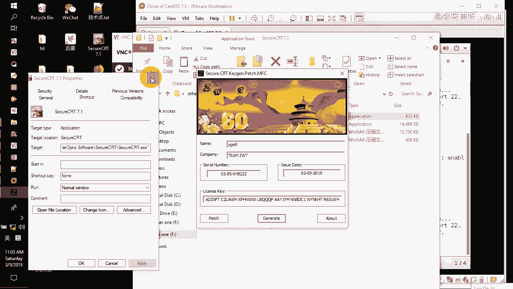

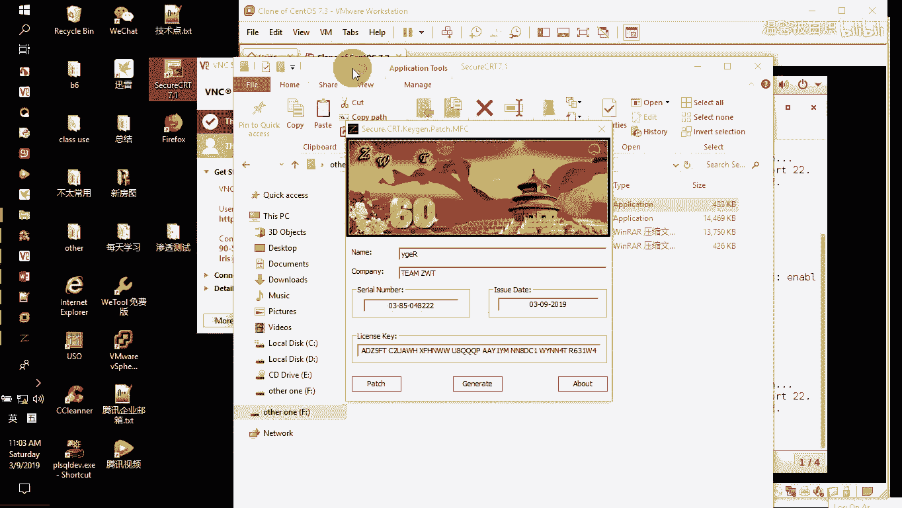

这个消息。你们那里打开的时候蹦出的应该是这个。理解没？他是要你注册的。那么默认情况下选择下一步。这里面就会有注册里面需要用到的信息，这边有一个enter license menu，那我们直接选择点击它。

好了，就不用我说了，名字。看r C。连过来啊，comcom。下一步，这个是s number。SN的注册嘛，这边是license key。那就这边这个。c测C。下一步，然后这边是XQ data。

那后面的话呢，我们没有没有，就是下一步。finish完成。好了，那这个客户端的话呢就已经装好了，也注册了哈。好了，那这边就可以先告一段落。接下来用这个客户端如何去远程连接我们的这边linux的主机。

首先要确定一点，你的这个linux的主机跟我们外面的这个真实物理机器，也就是说物理网络上面的你的那个机器能够连接。那你可以把现在这个will station跑到这边的linux。

认为它这个机器就在机房里面，我们怎么样连接它。那首先第一件事情。

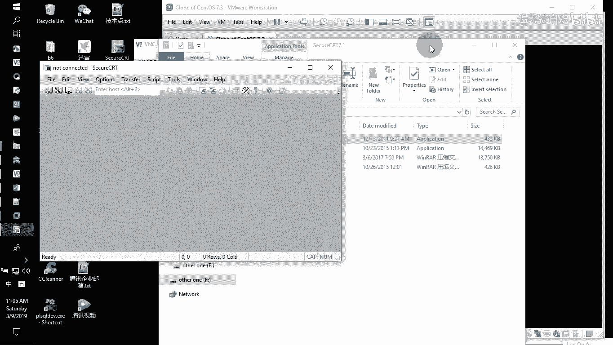

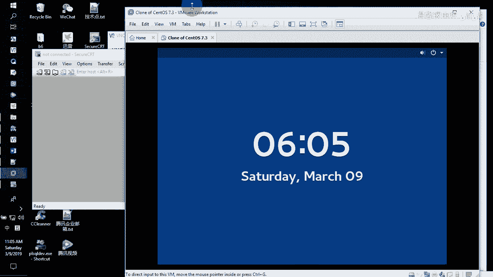

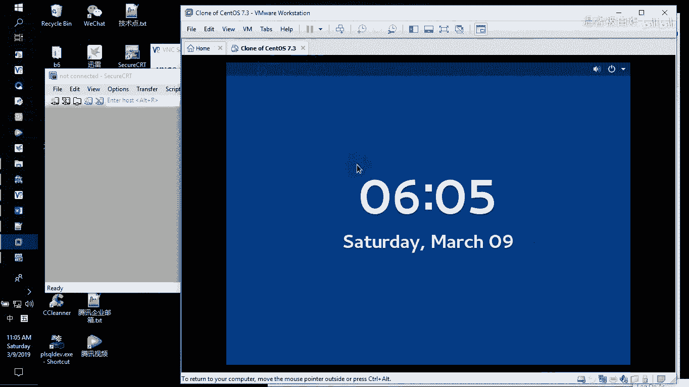

需要注意的就是它VMAvo station现在这个虚拟机它运行在哪一个虚拟网络。

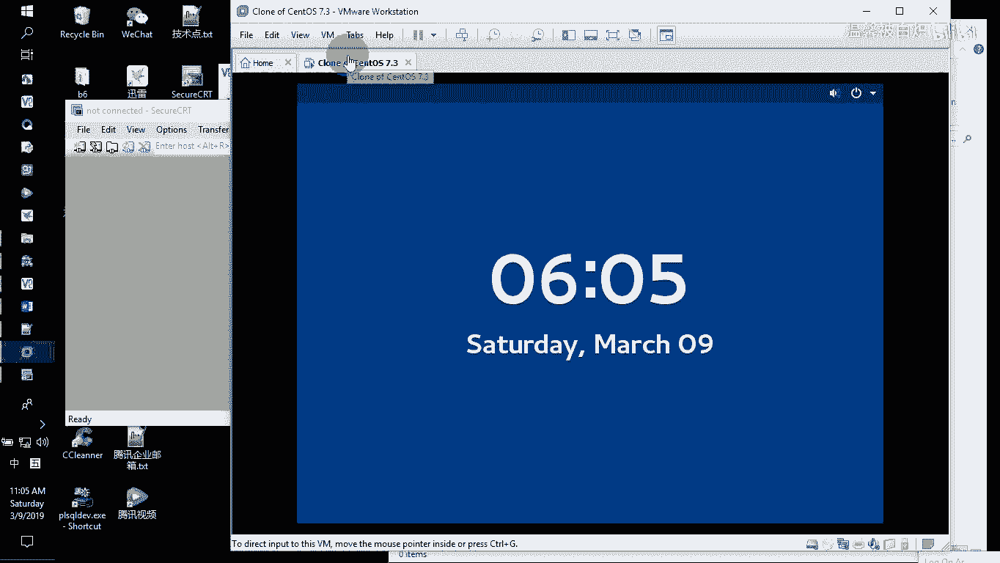

比如说它是一个叫NAT看到吧？NAT那NAT的话呢，我需要你去看你的VMF stationation在编辑里面的虚拟网络编辑器。

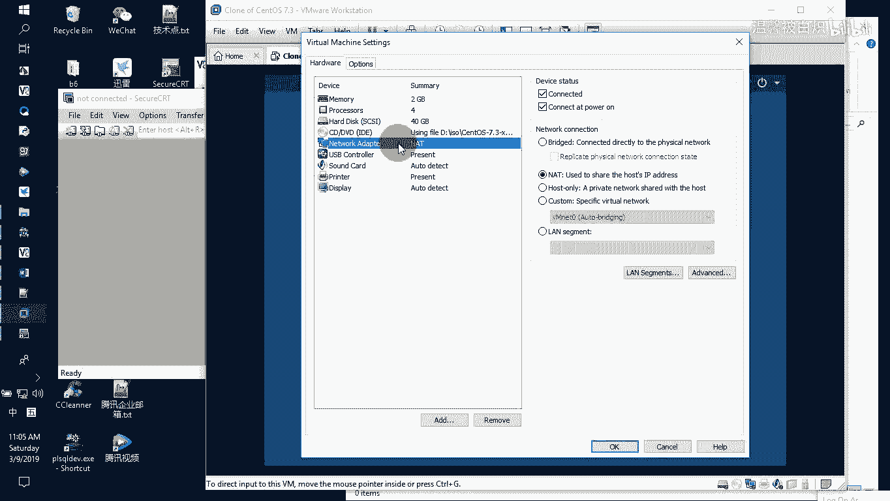

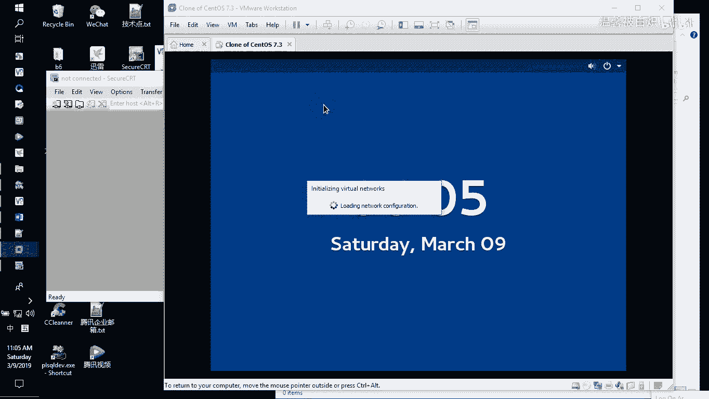

刚刚所看到的VMnet8就是NAT这口网卡，看到没？NAT这口网卡。那么它的网络现在它的网络是20296127。0的网络，而且DHCP是。打开的那enable怎么样把它变成dableable。

这边有个勾可以选的。点击一下就没了。点击一下又有了，看到吧？那有可能你们那边用的是普通账号登录，它会提示你，你没这个权限去点击。那你旁边的话，它应该有一个就是使用管理员去才能点开的这个东西。

那你就点击切换成超级管理员去点就好了。那我现在的D个CP我是打开的。

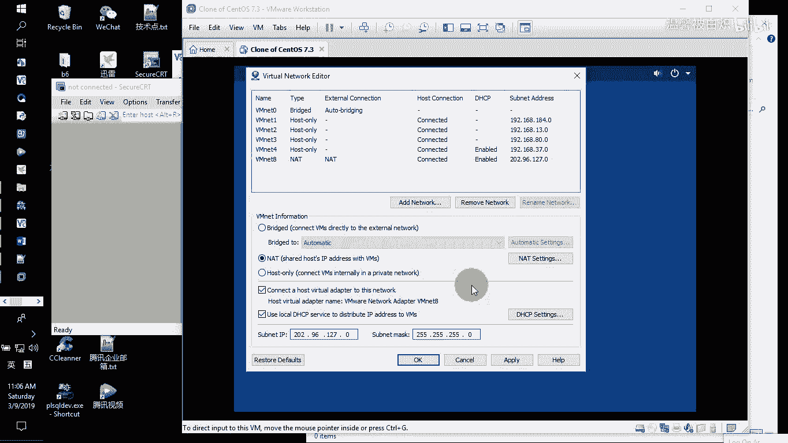

打开了之后，大家注意啊，默认情况下，当你打开的DHCP默认情况下，我们的真实物理机器。

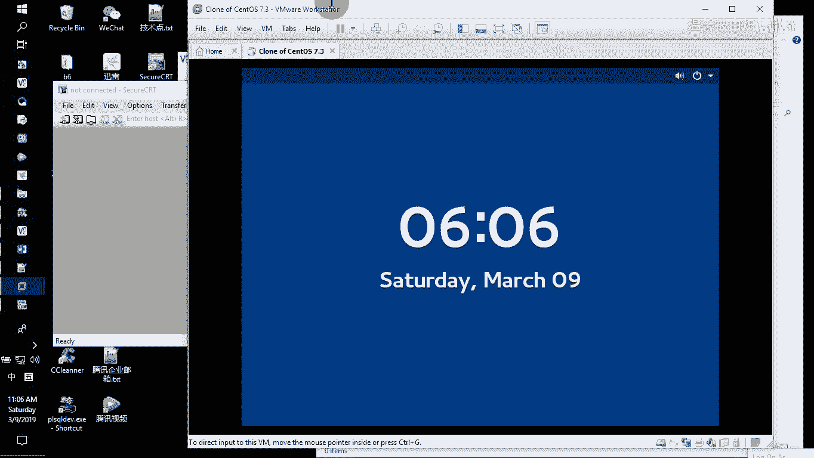

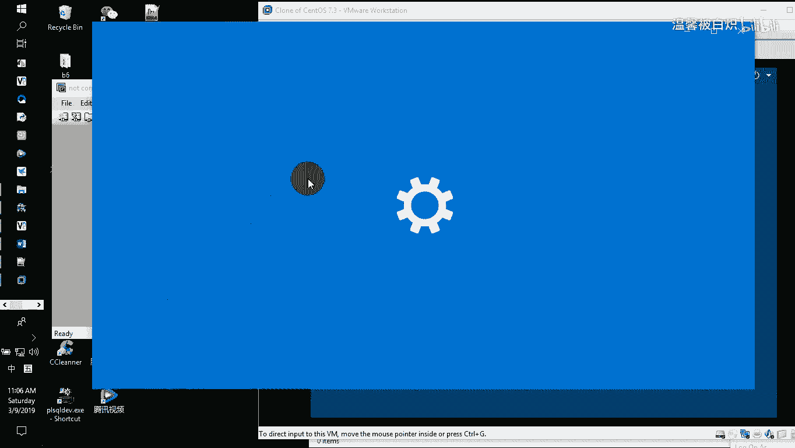

真实的物理机器，它的网络连接里面就会有这一个VMnet8VMnet8。那我们看看它的网络IIP地址啊。在detail里面详细信息里面可以看到它呢现在用的IP地址。20296127。1看到没？

那也就是说它里面的那个IP只要是20296127的这个网段，应该都没问题。来，我们试一下。

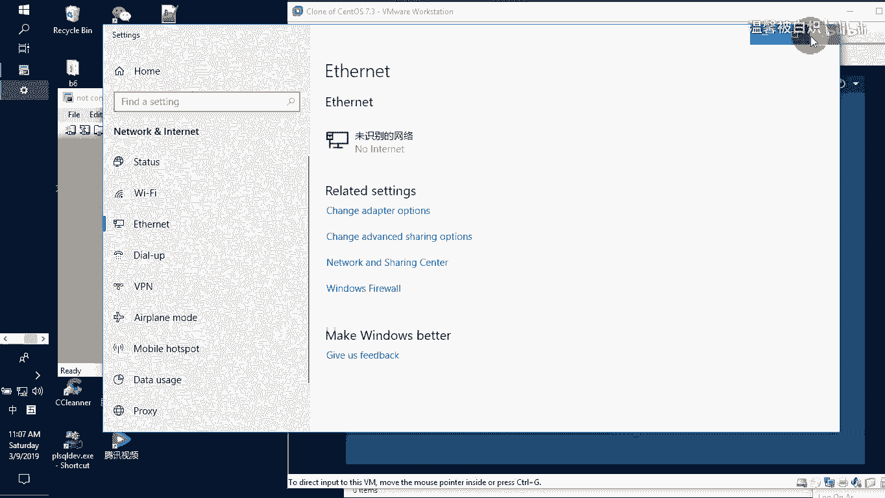

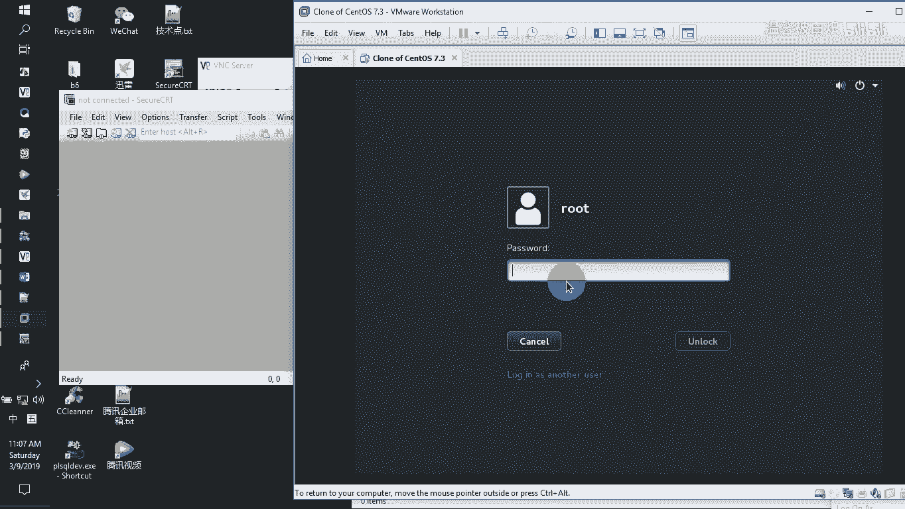

IPAD的。然后查看的时候，他这边的网卡并没有去获取到IP地址来，我们试一下啊。DH crime直接选择ENS33，让它自动获取IB地址。当然了，你也可以直接去点击。

右上角有一个类似像网络接口这么一个小图标，点击它。不是右键，是左键点击它，然后呢，在网络接口这边点击它的这个下拉箭头，你可以看到这里边有1个ENS33。

那我们是编辑虚拟网就编辑网卡配置里面点击它点击了之后呢，你可以看到它这边获取到的IP地址是20296127点。130，如果你不希望他用这种，那你可以去呃关一关，或者重新开开它。

或者说重新点击这个呃小齿轮去配置它都好。明白吗？这个没问题。好了，那现在的话呢，他IP地址IPADD。呃，可以看到是127。130。那么正好我们直接选择新建在sCRT新建一个连接。新建的时候。

我们直接选择202。96。127。130。然后选择用户名呃，如果说按照正常的做法，应该是选择普通用户，但我现在的话呢选择超级管理员root啊回车。名字就这个了，谁选明哈。那我们打开这个绘画。

它会提示我们新的一个主机公钥要不要接受，并且保存啊，是的，我接受并且保存。好嘞，那正好的话呢，在这个外层的机器，我就可以远程去连接到远端的主机。

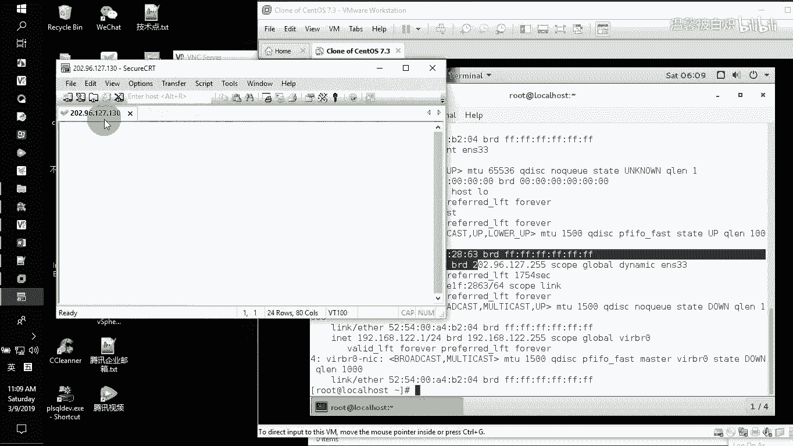

他会要求我们输入一个用户名和密码，那我直接把用户名密码输进来。呃，如果可以的话呢，点击保存也OK。这样的话呢，我们就可以在外面远程去连接我们的电脑。啊，这就是远程连接的一种做法。好了。

看完这个小视频的话呢应该知道如何去操作了。那接下来的话呢，我们再讲讲这个sCRT如何去调节它的这个颜色和字符编码。呃，默认情况下大家注意，如果我们写中文，它是会有问题的。比如说areas。我们写。查看。

查看啊。来。我怎么写半天，他才出来查看哎，怎么又多了一个。喂。其实从这个地方大家一定可以看到了，它并没有说你写什么，它就选什么，对不对？那这个时候怎么办呢？看这里在sson options里面点击它。

然后呢在我们的这个呃终端配置里面的话呢，专门有我们的连接针对字符编码选择成UTF8的字符编码。然后呢，从它前面的模块颜色里面，我们可以直接选它的环境，环境就选择这个VT1版。

然后ask那个把它选上使用现在的这个架构编码，选中现在的这个架格颜色。OK好了，来注意看啊。首先看颜色先。L。颜色有了对吧？然后我们看选中文。比如说。areas然后我们说是查看IP。地址。

然后等同于那个叫。IPAADD啊，那我们这边的话呢，直接写查看。IP地址。

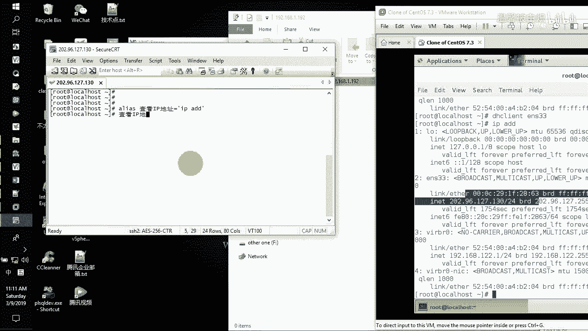

啊，他就等同于我们打那个叫。IPAADD对吧？那这个其实就是能够用中文的一种做法，比较简单的就是在里面去稍微去配置一下颜色，配置一下字体，用UTF8就好了。看到了没？很简单哈。好了。

那这个是用远程的客户端直接去连接的一种做法。先把录像告一段了哈。