# 远程连接SSH：P1：客户端安装与基础连接 🖥️

在本节课中，我们将学习如何使用 SecureCRT 客户端远程连接到 Linux 主机。教程将分为两个主要部分：首先，完成 SecureCRT 的安装与激活；其次，配置网络并建立远程 SSH 连接。

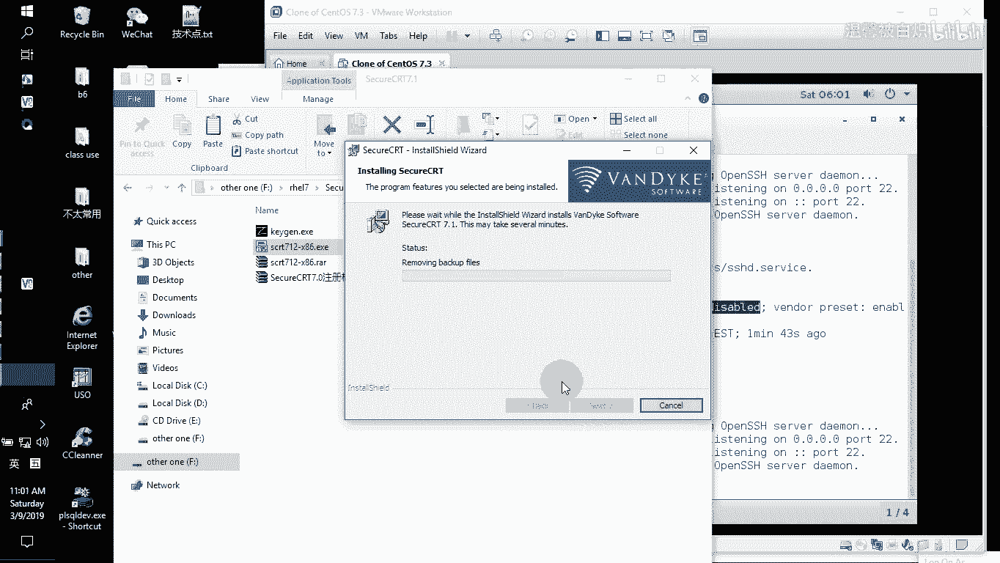

## 概述

我们将从安装 SecureCRT 客户端开始，完成必要的破解步骤以激活软件。随后，我们会检查并配置虚拟机的网络设置，确保物理主机与虚拟机之间网络互通。最后，使用 SecureCRT 建立 SSH 连接，并调整终端设置以支持中文显示和更好的视觉效果。

---

## SecureCRT 客户端安装与激活

首先，我们需要在 Windows 系统上安装 SecureCRT 客户端。安装过程较为简单，但之后需要进行激活。

### 安装步骤

以下是安装 SecureCRT 的具体步骤。

1.  找到 SecureCRT 的安装包，双击运行。
2.  在安装向导中，连续点击“下一步”。
3.  阅读并同意许可协议，继续点击“下一步”。
4.  选择安装类型。默认选项“为所有用户安装”即可。
5.  选择是否创建桌面图标和开始菜单快捷方式，建议至少保留桌面图标。
6.  点击“安装”开始安装过程。
7.  安装完成后，桌面上会出现 SecureCRT 的图标。

安装完成后，软件默认安装路径通常为：`C:\Program Files (x86)\VanDyke Software\SecureCRT\`。主程序文件是 `SecureCRT.exe`。

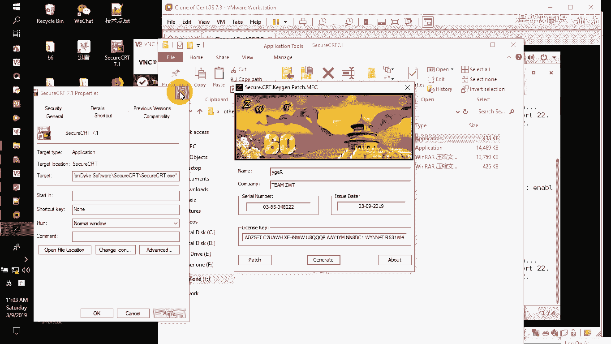

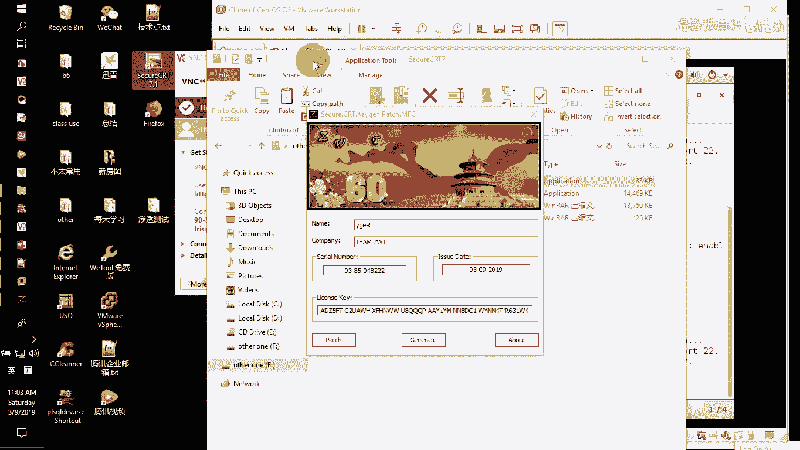

### 激活（破解）步骤

安装后需要激活软件才能正常使用。请确保使用具有管理员权限的账户进行操作。

以下是激活 SecureCRT 的具体步骤。

1.  不要直接打开 SecureCRT。在破解工具（如“破解精灵”）上右键，选择“以管理员身份运行”。
2.  在破解工具中，点击“搜索”或“浏览”，定位到 SecureCRT 的安装目录（例如上述路径）。
3.  成功找到 `SecureCRT.exe` 后，工具通常会提示“Done”。
4.  破解工具会自动找到并加载软件的许可证管理器（License Helper）。
5.  点击“通用绿化”或类似按钮完成破解。
6.  此时，首次打开 SecureCRT 可能会弹出注册窗口。
7.  在注册窗口中，点击“Enter License Data”。
8.  根据破解工具提供的注册信息，依次填写：
    *   **Name** 和 **Company**
    *   **Serial Number**
    *   **License Key**
9.  填写完毕后，点击“下一步”直至完成注册。

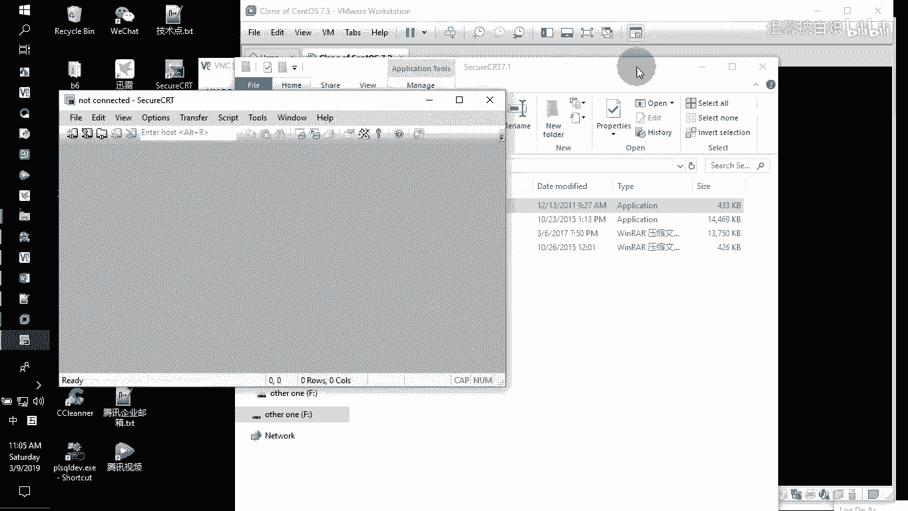

至此，SecureCRT 客户端已成功安装并激活。

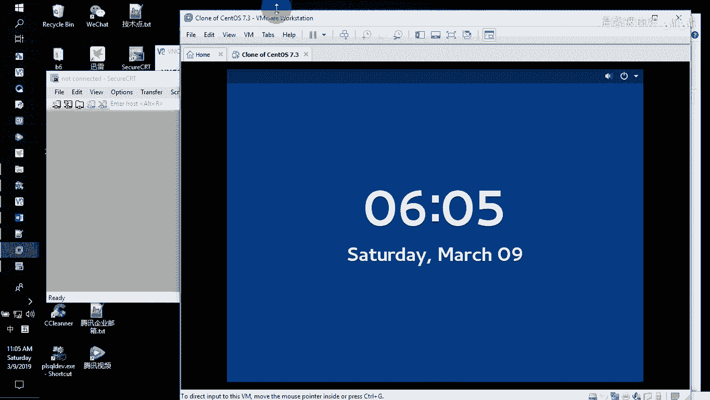

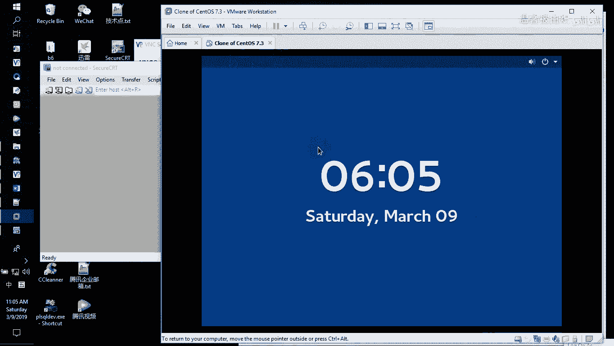

---

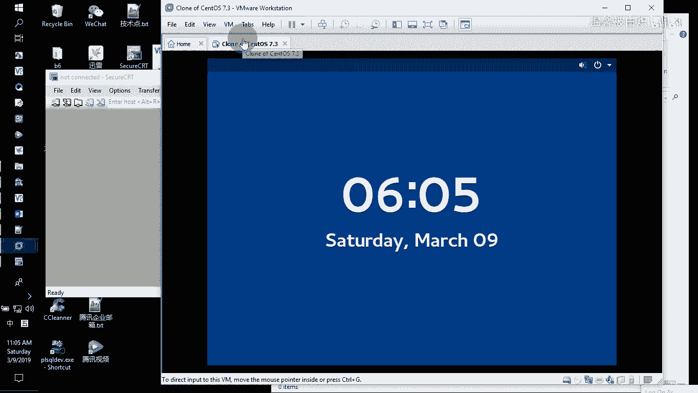

## 配置网络与建立 SSH 连接

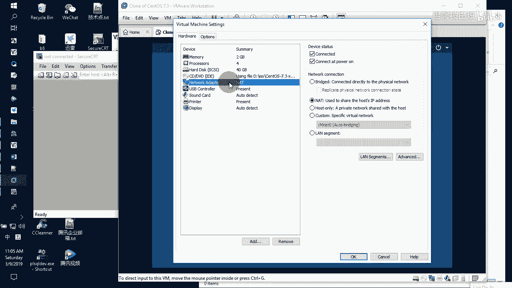

上一节我们完成了客户端的准备，本节中我们来看看如何配置网络环境并建立远程连接。

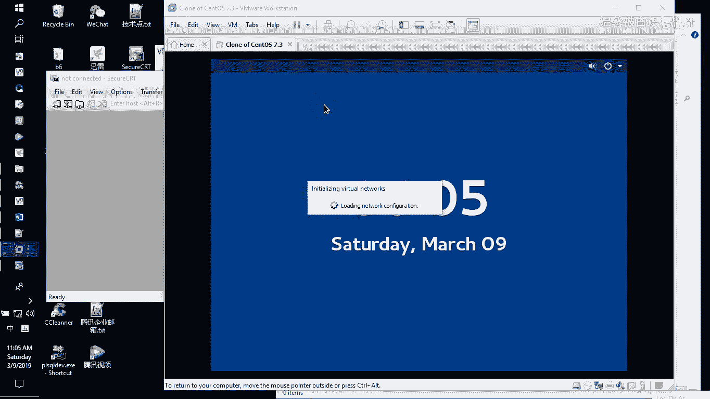

### 检查虚拟机网络配置

要远程连接 Linux 虚拟机，首先需确保虚拟机和物理主机网络互通。

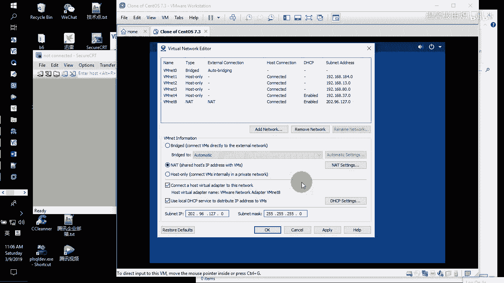

1.  在 VMware 中，确认虚拟机使用的网络连接模式（如 **NAT** 模式）。
2.  打开 VMware 的“编辑”菜单，选择“虚拟网络编辑器”。
3.  找到对应的虚拟网络（例如 **VMnet8** 对应 NAT 模式），查看其子网信息（例如 `192.168.127.0`）。
4.  确保该网络的 **DHCP** 服务处于启用状态，以便虚拟机自动获取 IP 地址。

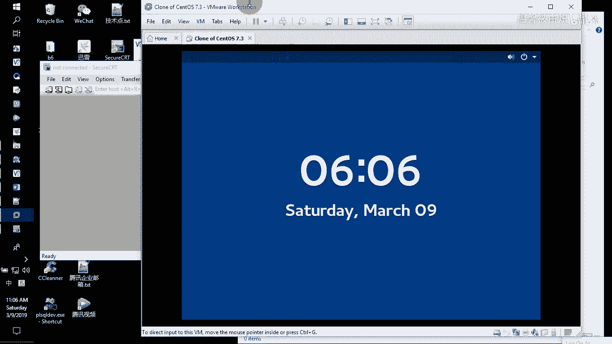

### 获取虚拟机 IP 地址

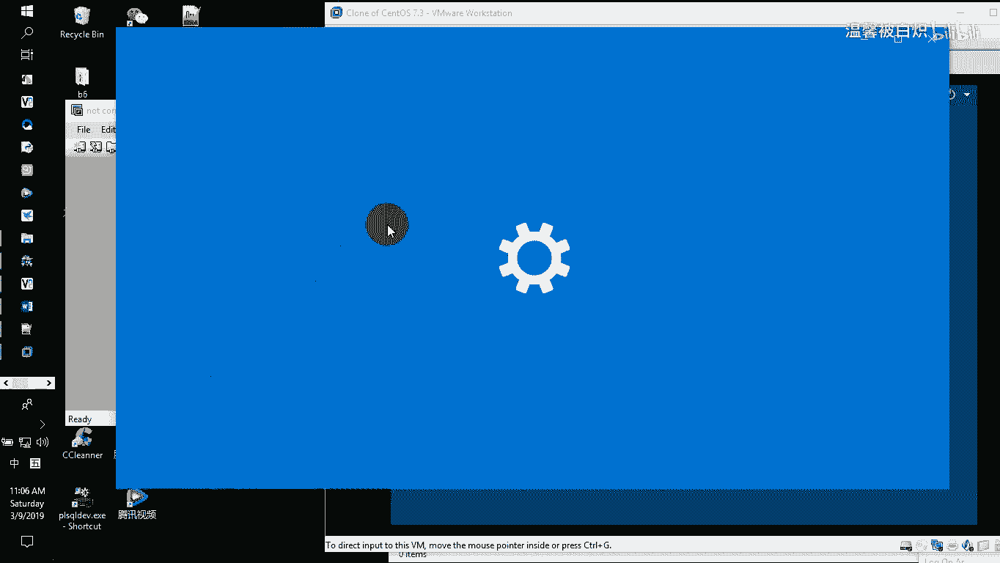

配置好虚拟网络后，需要获取 Linux 虚拟机的 IP 地址。

1.  启动 Linux 虚拟机。
2.  打开终端，输入命令 `ip addr` 或 `ifconfig` 查看网络接口信息。
3.  找到主网卡（如 `ens33`），记录其获取到的 IP 地址（例如 `192.168.127.130`）。该地址应处于虚拟网络的网段内。

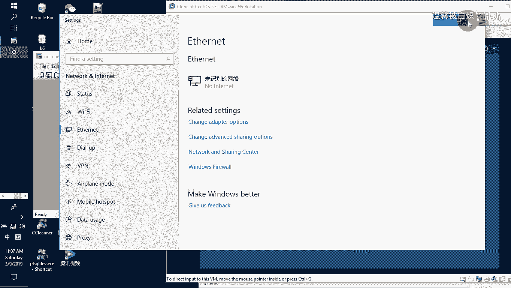

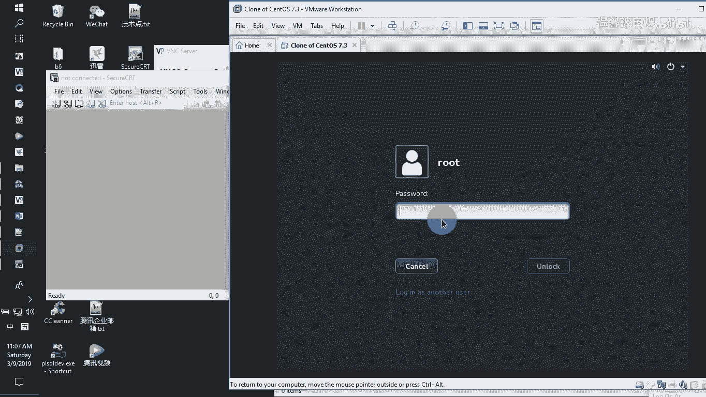

### 使用 SecureCRT 建立连接

获得虚拟机 IP 地址后，即可使用 SecureCRT 进行连接。

以下是建立新连接的具体步骤。

1.  打开 SecureCRT，点击“新建连接”。
2.  在“主机名”栏中输入虚拟机的 IP 地址（例如 `192.168.127.130`）。
3.  在“用户名”栏中输入登录用户名（例如 `root`）。
4.  为这个连接设置一个名称，然后点击“连接”。
5.  首次连接时会提示接受并保存主机密钥，点击“接受并保存”。
6.  在弹出的登录窗口中，输入对应用户的密码。可以勾选“保存密码”以便下次快速登录。

连接成功后，SecureCRT 的终端窗口将显示 Linux 系统的命令行，表示你已成功远程登录。

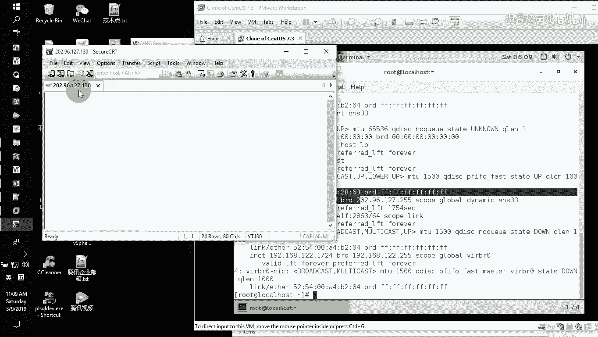

---

## 优化终端设置（字符编码与颜色）

成功连接后，默认设置可能无法正确显示中文或色彩。我们可以进行简单优化。

1.  在 SecureCRT 会话中，点击菜单栏的 “Options” -> “Session Options”。
2.  在左侧分类中，选择 “Terminal” -> “Appearance”。
    *   在 “Character encoding” 下拉框中，选择 **UTF-8**。
    *   在 “Terminal” 下拉框中，选择 **VT100** 或 **Linux**。
    *   勾选 “Use color scheme” 并选择一个喜欢的配色方案。
3.  点击“确定”保存设置。

设置完成后，终端应能正常显示中文和色彩。你可以尝试输入中文命令进行测试。

---

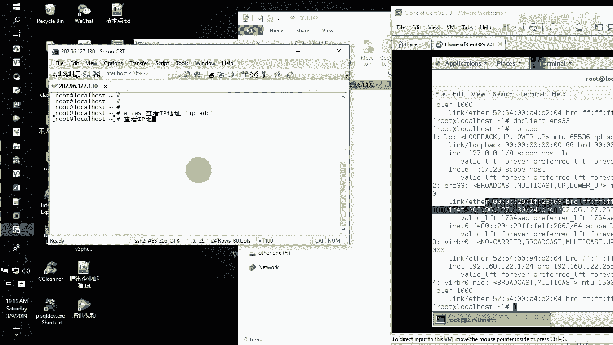

## 总结

本节课中我们一起学习了远程连接 SSH 的完整流程。首先，我们安装并激活了 SecureCRT 客户端。接着，通过检查 VMware 虚拟网络配置和获取 Linux 虚拟机 IP 地址，为远程连接做好了网络准备。然后，我们使用 SecureCRT 成功建立了 SSH 连接。最后，通过调整终端的字符编码和颜色方案，优化了使用体验。掌握这些步骤，你就能从本地计算机方便地管理和操作远程的 Linux 服务器了。