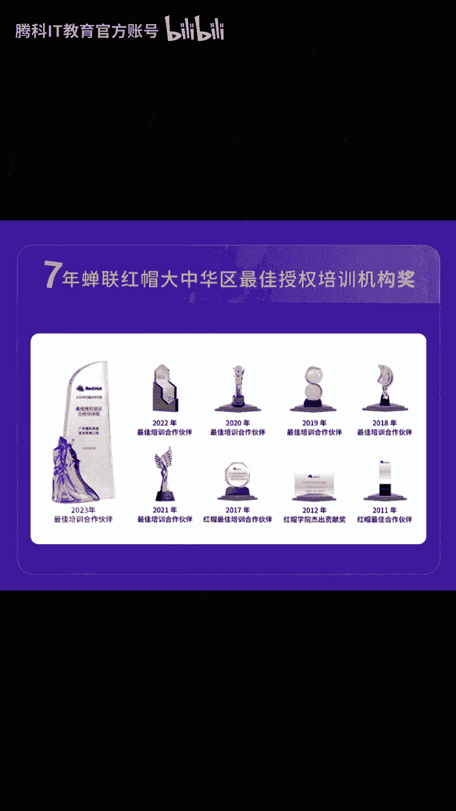

# Linux系统管理入门：1：Linux基础与Shell环境

在本节课中，我们将要学习Linux操作系统的基础知识，并了解Shell环境的基本概念和操作。这是进入Linux世界的第一步。

## 概述

Linux是一种开源的操作系统内核，广泛应用于服务器、嵌入式设备和个人计算机。Shell是用户与Linux内核进行交互的命令行界面。掌握基础命令和Shell环境是进行系统管理的前提。

上一节我们介绍了课程的整体目标，本节中我们来看看Linux系统的基本构成和如何开始使用Shell。

## Linux系统基础

Linux系统主要由内核、Shell、文件系统和应用程序组成。内核是系统的核心，负责管理硬件资源。Shell接收用户命令并将其传递给内核执行。文件系统则负责组织和管理磁盘上的数据。

## Shell环境入门

Shell是一个命令行解释器，它提供了用户与操作系统交互的界面。常见的Shell有Bash、Zsh等。在Shell中，我们可以通过输入命令来完成各种任务。

以下是一些最基本的Shell命令：

*   `pwd`：打印当前工作目录的路径。
*   `ls`：列出当前目录下的文件和子目录。
*   `cd`：切换当前工作目录。
*   `mkdir`：创建新目录。
*   `touch`：创建新文件或更新文件时间戳。


## 核心概念：路径与文件操作

在Linux中，一切皆文件。理解路径的概念至关重要。路径分为绝对路径和相对路径。绝对路径从根目录`/`开始，相对路径则从当前目录开始。

文件操作是Shell中的核心任务。我们可以使用命令来查看、创建、删除和移动文件。

以下是文件操作的常用命令列表：

*   `cat`：查看文件内容。
*   `cp`：复制文件或目录。
*   `mv`：移动或重命名文件。
*   `rm`：删除文件或目录。使用需谨慎。
*   `find`：在文件系统中查找文件。



## 命令语法与获取帮助

Linux命令通常遵循一定的语法结构：`命令 [选项] [参数]`。选项用于修改命令的行为，参数则是命令操作的对象。

当你不熟悉某个命令时，可以使用内置的帮助系统。例如，使用`man`命令可以查看命令的手册页，`命令 --help`可以获取快速帮助。

获取帮助的命令示例：
```bash
man ls
ls --help
```

## 总结

本节课中我们一起学习了Linux系统的基础架构和Shell环境的基本操作。我们了解了Shell的作用，练习了如`pwd`、`ls`、`cd`等基础命令，并理解了文件路径的概念及基本的文件操作方法。最后，我们学习了命令的基本语法和如何获取帮助。这些是后续深入学习Linux系统管理的基石。