# Docker入门教程：P101：Docker容器数据卷


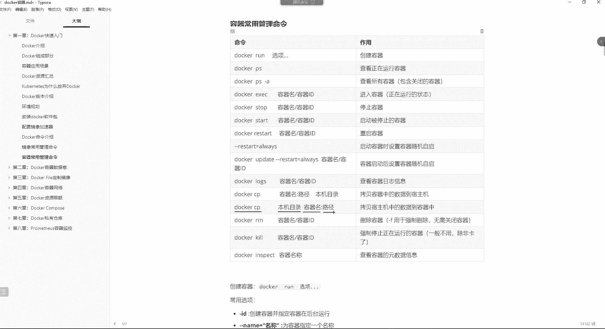

## 概述
在本节课中，我们将学习Docker容器数据卷的核心概念与使用方法。数据卷是解决容器数据持久化、宿主机与容器间以及容器与容器间数据共享问题的关键技术。我们将通过实际操作，理解如何配置和使用数据卷。

---


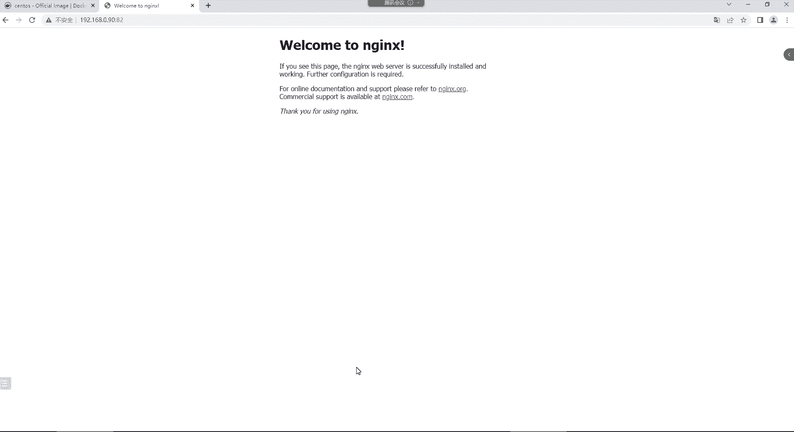


## 数据拷贝命令回顾
上一节我们介绍了容器与宿主机之间的文件交互。除了之前的方法，Docker提供了专门的命令来实现双向文件拷贝。

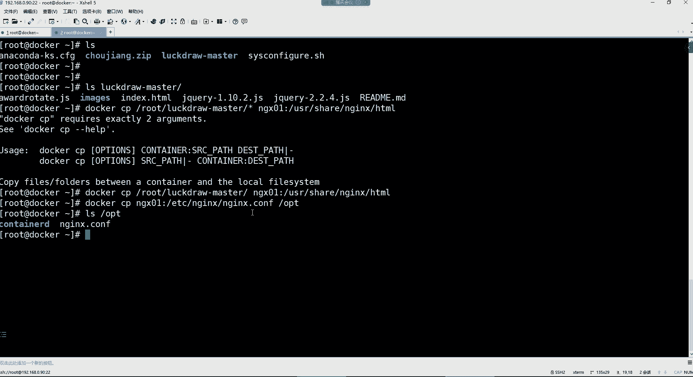

### Docker CP命令
`docker cp` 命令用于在宿主机和容器之间拷贝文件或目录。

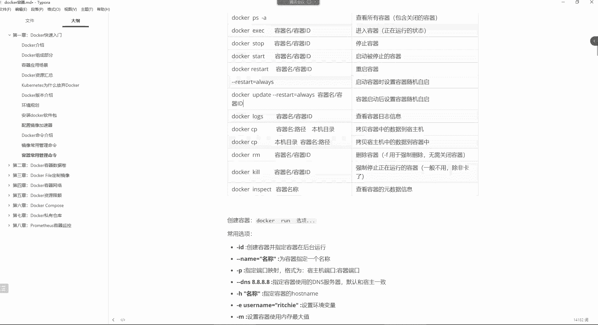

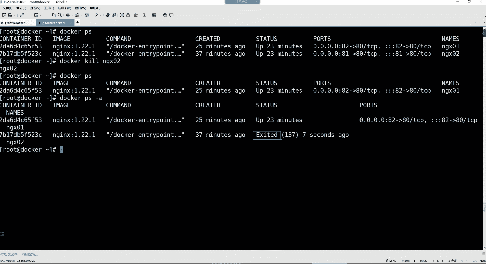

**命令格式如下：**
```bash
docker cp [宿主机路径] [容器名]:[容器内路径]  # 宿主机 -> 容器
docker cp [容器名]:[容器内路径] [宿主机路径]  # 容器 -> 宿主机
```

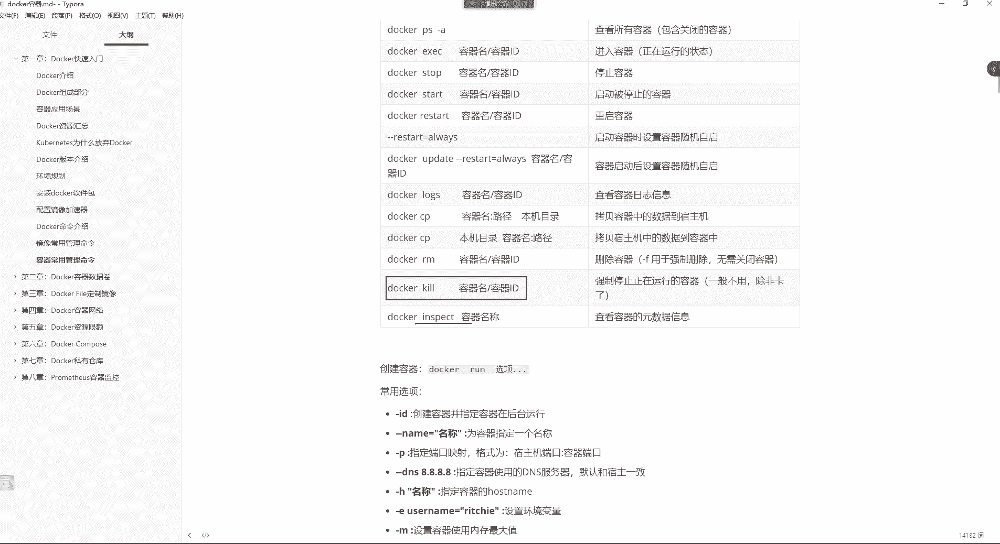

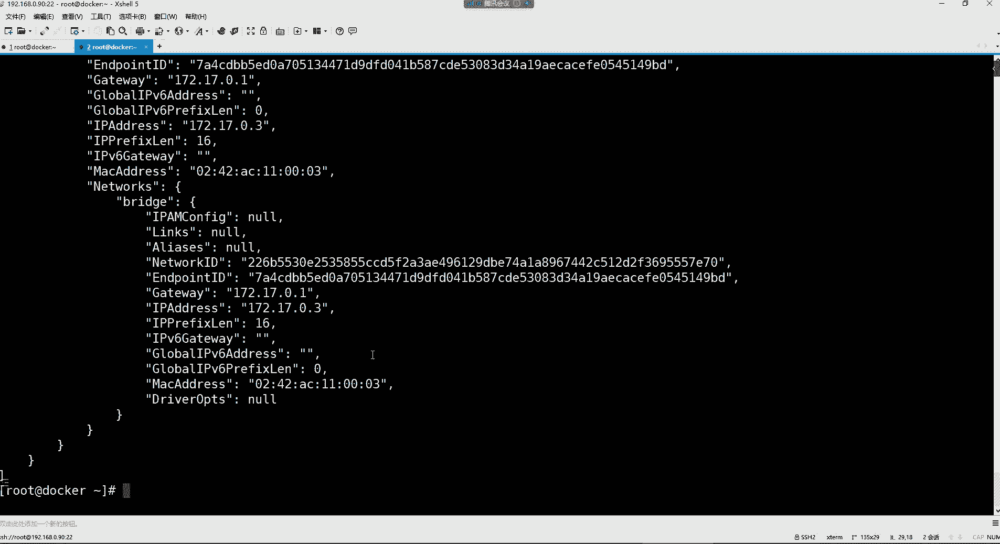

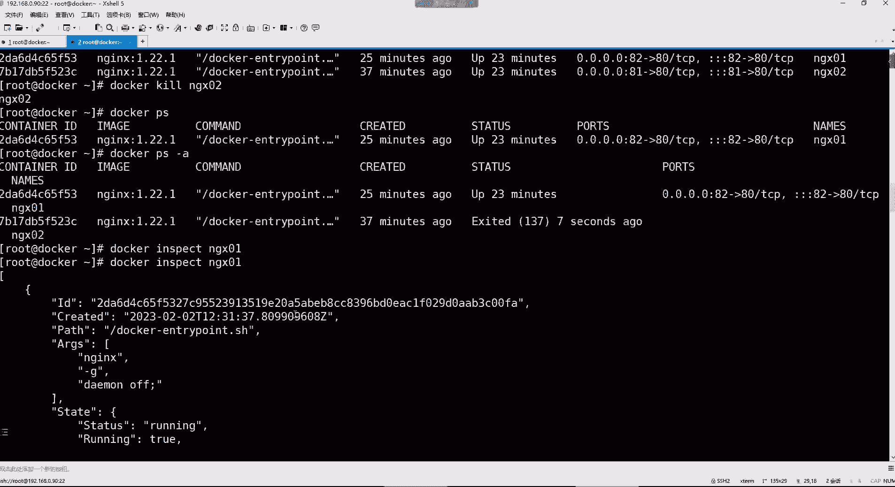

以下是具体操作示例：

**将宿主机文件拷贝到容器**
1.  首先，将宿主机 `/root/` 目录下的内容拷贝到名为 `ng01` 的容器中。
2.  执行命令：`docker cp /root/目录内容 ng01:/usr/share/nginx/html`
3.  注意：路径不支持使用通配符 `*`，需要指定具体目录。
4.  拷贝完成后，可以进入容器验证：`docker exec -it ng01 /bin/bash`，然后切换到 `/usr/share/nginx/html` 目录查看。

**将容器文件拷贝到宿主机**
1.  将容器 `ng01` 的 Nginx 主配置文件拷贝到宿主机的 `/opt` 目录。
2.  执行命令：`docker cp ng01:/etc/nginx/nginx.conf /opt`
3.  在宿主机上检查 `/opt` 目录，确认文件已成功拷贝。

`docker cp` 实现了宿主机与容器间的文件交换，但这种方式是手动、一次性的，并不理想。

---

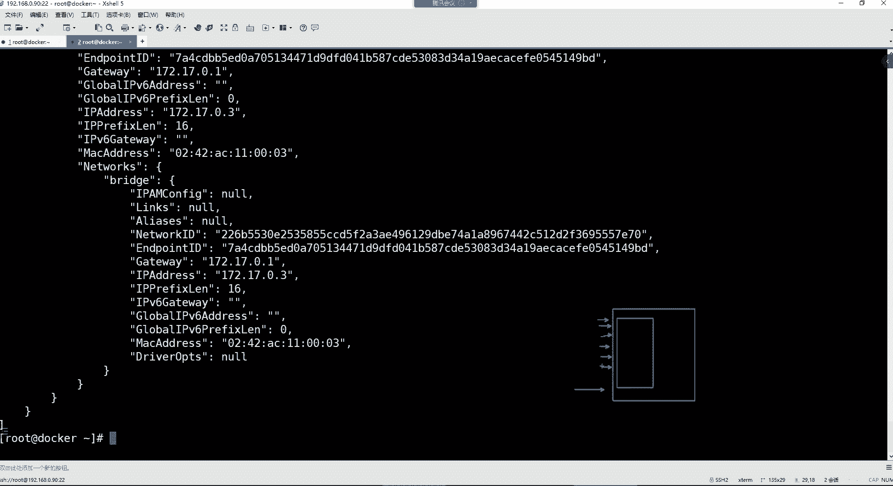

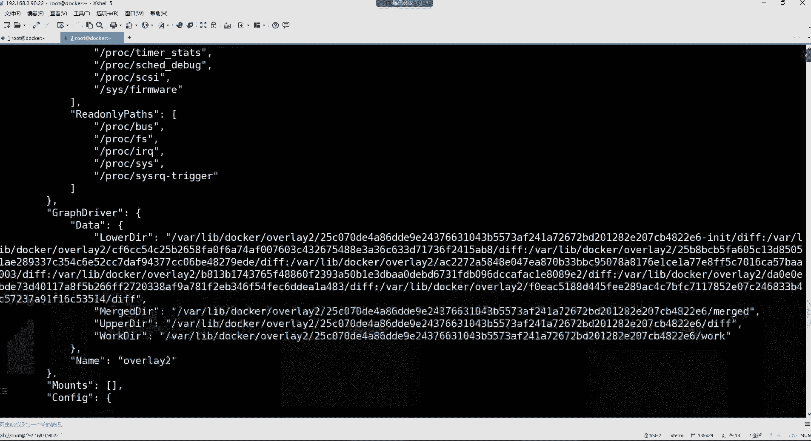


## 其他容器管理命令
在深入数据卷之前，我们先简要回顾几个常用的容器管理命令。

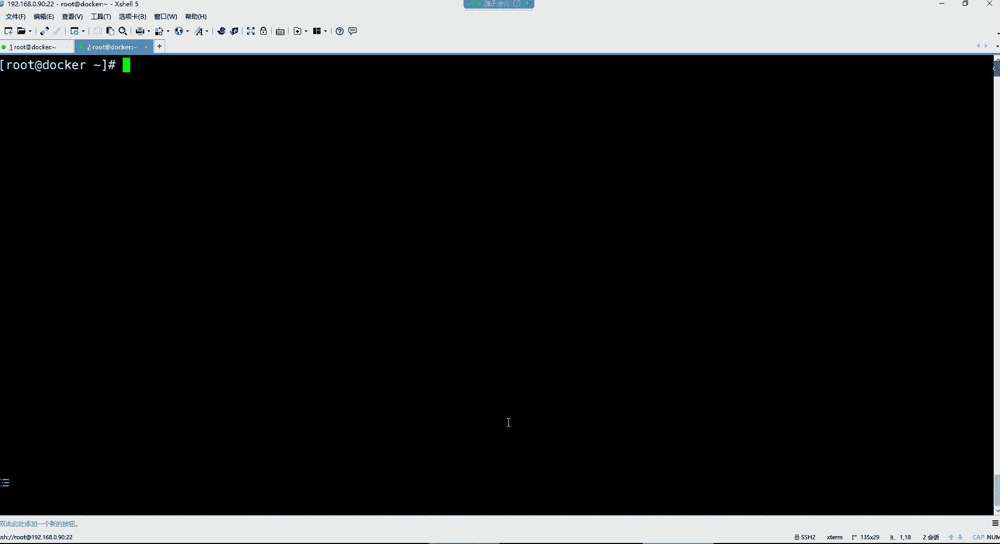


**强制停止容器**
`docker kill` 命令用于强制停止一个正在运行的容器。当容器出现异常无法通过 `docker stop` 正常停止时，可以使用此命令。
```bash
docker kill ng02
```
执行后，容器 `ng02` 的状态会变为关闭，但并未被删除。

**查看容器元数据**
`docker inspect` 命令用于查看容器的详细信息（元数据）。
```bash
docker inspect ng01
```
该命令会输出大量JSON格式的信息，包括：
*   **容器ID**、**创建时间**、**状态**（如 running）。
*   **所使用的镜像ID**。
*   **网络配置**：如网络模式、网关地址、容器自身的IP地址（例如 `172.17.0.3`）。
*   **端口映射**信息。
*   **重启策略**（如 always）。
*   **数据卷**挂载信息（后续重点）。
*   资源限制（如内存、CPU）。

**元数据**可以理解为描述对象自身属性的数据。例如，一本书的作者、目录、章节内容都是这本书的元数据。同理，容器的所有自身信息都属于其元数据。

---


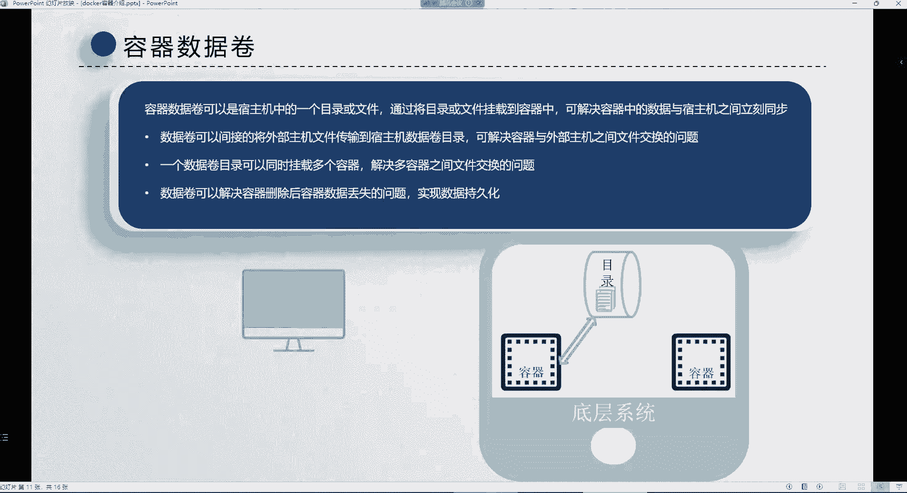

## 容器数据卷的核心概念
上一节我们介绍了基本的容器操作，本节我们来看看容器数据持久化和共享的核心解决方案——数据卷。


### 容器存在的三个问题
1.  **宿主机与容器间文件交换不便**：虽然可以通过 `docker cp` 命令拷贝，但过程繁琐，无法实现实时同步。
2.  **容器与容器间无法直接共享文件**：容器之间相互隔离，默认情况下数据无法互通。
3.  **容器删除导致数据丢失**：容器本身是临时性的，一旦删除，其内部产生的所有数据也会随之消失。

### 数据卷的功能与优势
数据卷是宿主机上的一个目录或文件，可以将其挂载到容器中。它的核心优势在于实现了宿主机目录与容器目录的**双向实时同步**。

数据卷解决了上述三个问题：
1.  **解决宿主机与容器数据同步**：将需要交换的文件放入宿主机数据卷目录，即可自动同步到容器内。
2.  **解决容器间数据共享**：同一个数据卷目录可以挂载到多个容器。容器A写入数据卷的数据，会立刻被挂载了同一数据卷的容器B读取。
3.  **解决数据持久化**：即使容器被删除，数据卷目录中的数据依然保留在宿主机上，实现了数据持久化。

此外，数据卷让配置管理变得更便捷。例如，要修改Nginx配置，可以直接在宿主机数据卷目录中编辑配置文件，修改会自动同步到容器内生效，无需进入容器操作。


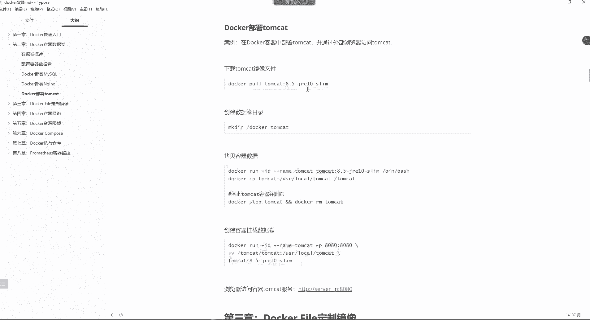

---

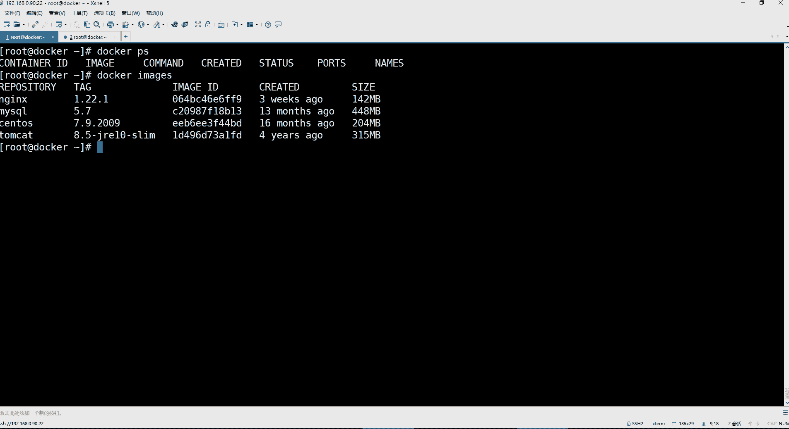

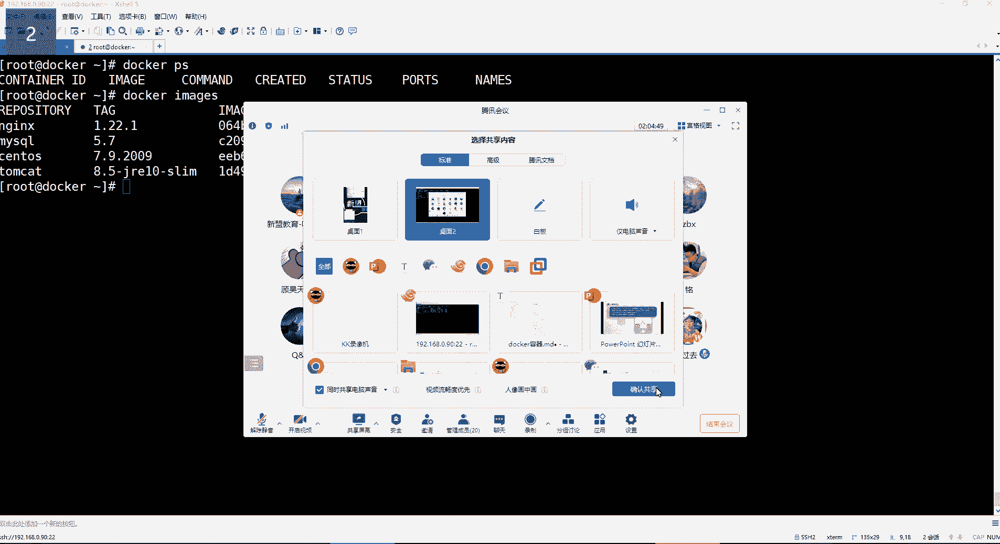

## 配置与使用数据卷
理解了数据卷的概念后，我们来学习如何配置和使用它。


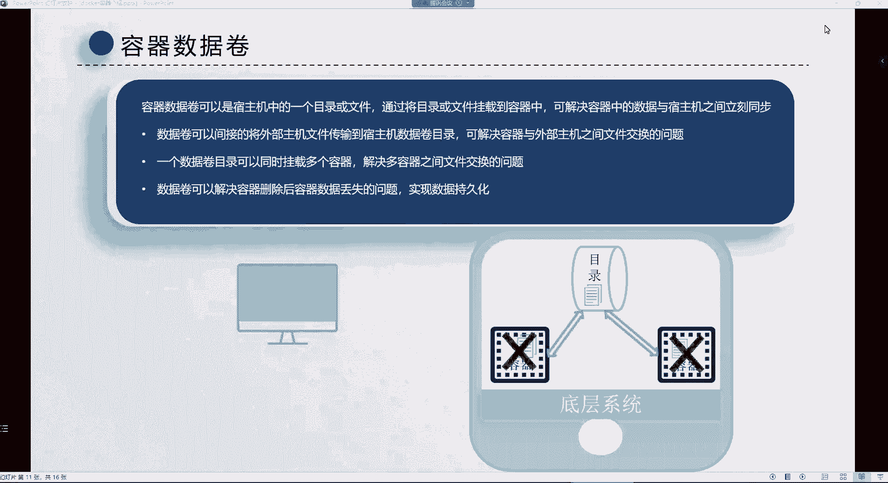


### 基本命令格式
在创建容器时，使用 `-v` 参数来配置数据卷。
```bash
docker run [其他参数] -v [宿主机绝对路径]:[容器内绝对路径] [镜像名]
```
*   路径必须使用**绝对路径**。
*   如果指定的宿主机或容器内路径不存在，Docker会自动创建。


### 实战：部署MySQL并配置数据卷
我们以部署MySQL 5.7为例，演示如何配置数据卷以实现数据持久化。

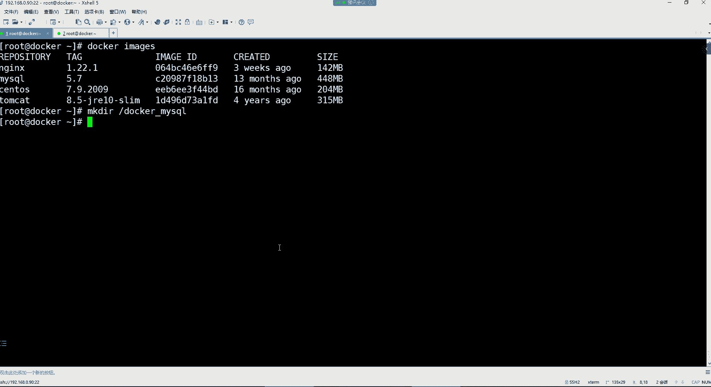


**第一步：规划与准备持久化目录**
MySQL需要持久化的数据主要包括配置文件、数据库文件和数据日志。
1.  在宿主机上创建用于持久化的目录：`mkdir /docker_mysql`
2.  我们需要将容器内的以下目录挂载出来：
    *   配置文件目录：`/etc/mysql`
    *   数据库数据目录：`/var/lib/mysql`
    *   日志目录：`/var/log/mysql`


**第二步：预先获取容器配置文件**
在首次挂载数据卷时，如果宿主机目录为空，它会以宿主机目录为准，导致容器内对应目录的数据被清空。因此，对于原本就有数据的目录（如配置文件），需要先将其拷贝到宿主机。
1.  启动一个临时MySQL容器（需设置root密码）：
    ```bash
    docker run -id --name=temp_mysql -e MYSQL_ROOT_PASSWORD=123456 mysql:5.7
    ```
2.  将容器内的配置文件拷贝到宿主机准备目录：
    ```bash
    docker cp temp_mysql:/etc/mysql /docker_mysql/
    ```
3.  处理拷贝后可能存在的软链接问题，确保配置文件的可用性。

**第三步：创建正式容器并挂载数据卷**
现在，我们可以创建正式的MySQL容器，并将宿主机目录挂载到容器内的对应路径。
```bash
docker run -id \
--name=mysql \
-p 3306:3306 \
-v /docker_mysql/mysql:/etc/mysql \ # 挂载配置文件
-v /docker_mysql/data:/var/lib/mysql \ # 挂载数据文件
-v /docker_mysql/log:/var/log/mysql \ # 挂载日志文件
-e MYSQL_ROOT_PASSWORD=123456 \
mysql:5.7
```
*   `-v /docker_mysql/mysql:/etc/mysql`：将宿主机的配置目录挂载到容器，后续在宿主机修改配置会实时生效。
*   `-v /docker_mysql/data:/var/lib/mysql`：数据库文件持久化在此，即使容器删除，数据也不会丢失。
*   `-v /docker_mysql/log:/var/log/mysql`：日志文件持久化。

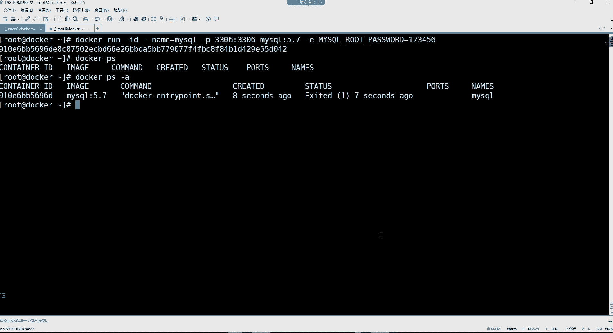


**注意**：对于像 `/var/lib/mysql` 这类初始为空的目录，Docker会在容器启动时自动初始化数据，因此无需预先拷贝。

---

## 总结
本节课我们一起学习了Docker容器数据卷的核心知识。


我们首先回顾了`docker cp`命令用于宿主机与容器间的文件拷贝，并了解了`docker kill`和`docker inspect`等辅助命令。

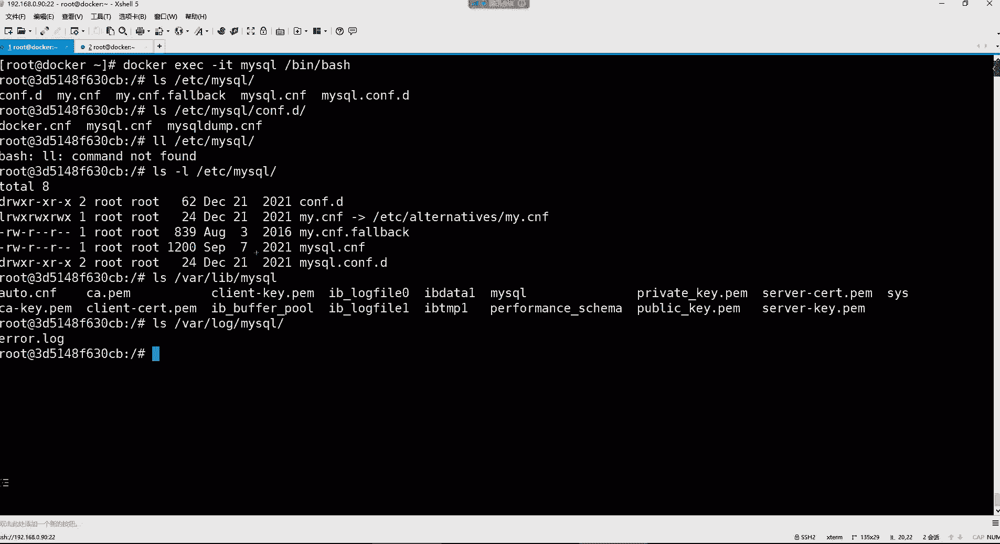

接着，我们重点探讨了**数据卷**，它通过将宿主机目录挂载到容器，完美解决了容器数据持久化、宿主机与容器间以及容器与容器间数据共享的三大难题。数据卷实现了数据的双向实时同步，是容器化应用中管理状态和数据的关键技术。

最后，我们通过部署MySQL数据库的实战演练，掌握了使用 `-v` 参数配置数据卷的具体方法，包括如何规划持久化目录、处理首次挂载的数据覆盖问题等关键步骤。


掌握数据卷的使用，将使你能够构建更加健壮、易于管理和维护的Docker化应用。