# Docker入门教程：P104：镜像原理与转换操作

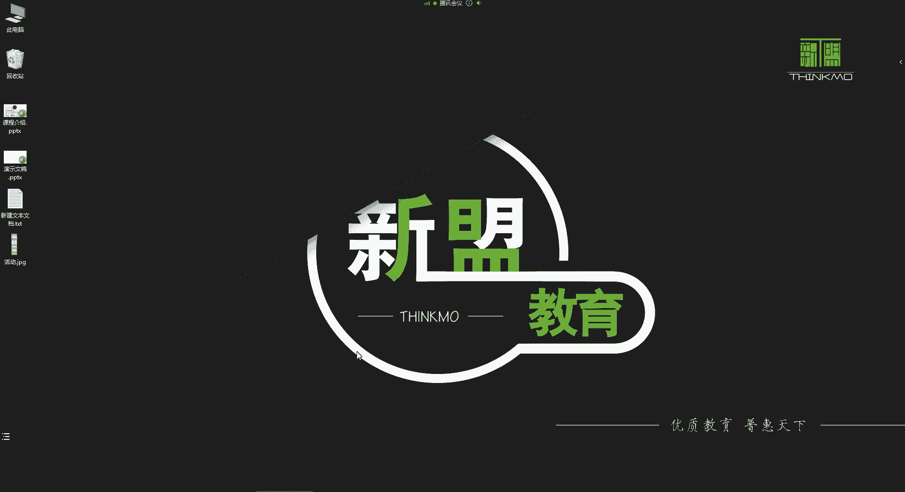

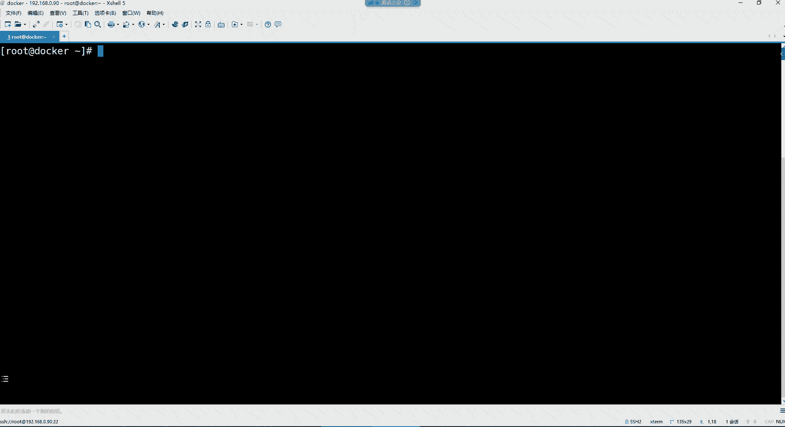

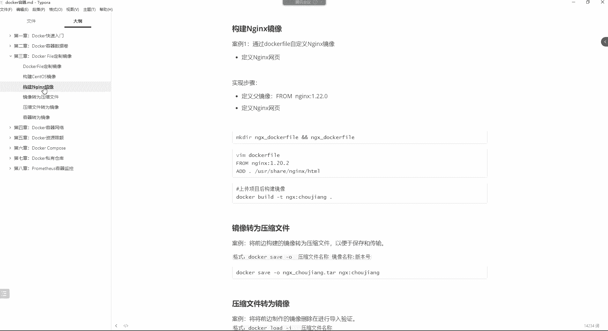

## 概述

在本节课中，我们将要学习Docker镜像的核心原理，以及如何将镜像转换为压缩文件、将压缩文件恢复为镜像，以及如何将修改后的容器保存为新的镜像。这些操作是Docker镜像管理和迁移的基础。

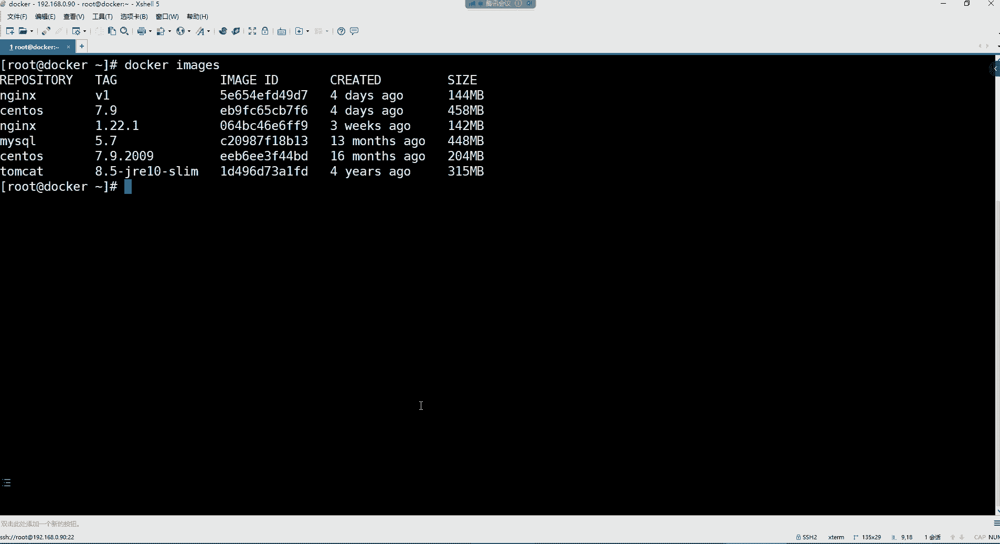

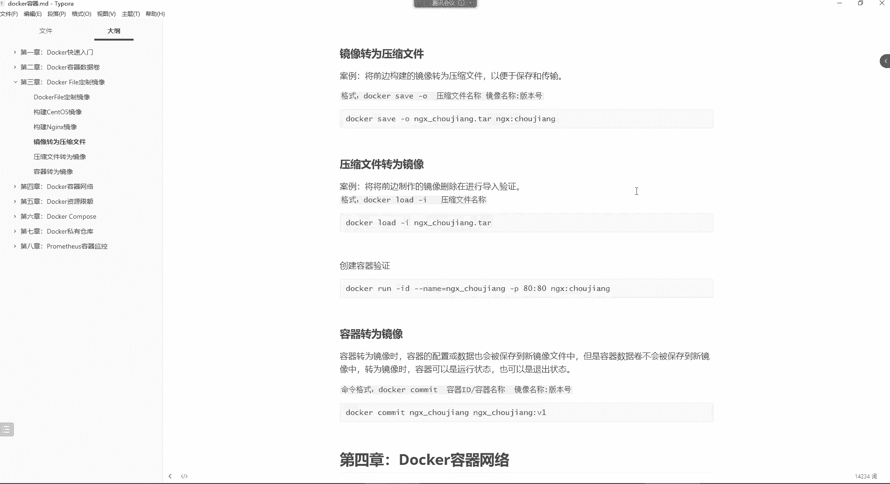

---

## 镜像原理：理解Docker镜像的本质

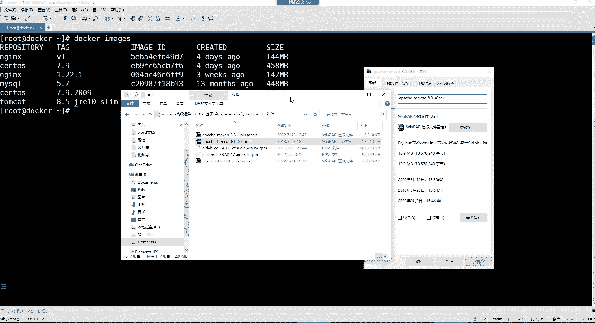

上一节我们介绍了如何使用Dockerfile构建镜像，本节中我们来看看镜像背后的工作原理。

Docker镜像常被称为“精华版的虚拟机”。其本质是一个**叠加的文件系统**。

一个完整的Linux系统由两部分组成：
*   **BootFS**：包含系统内核和引导程序。
*   **RootFS**：包含不同发行版（如CentOS、Ubuntu）的文件系统结构。

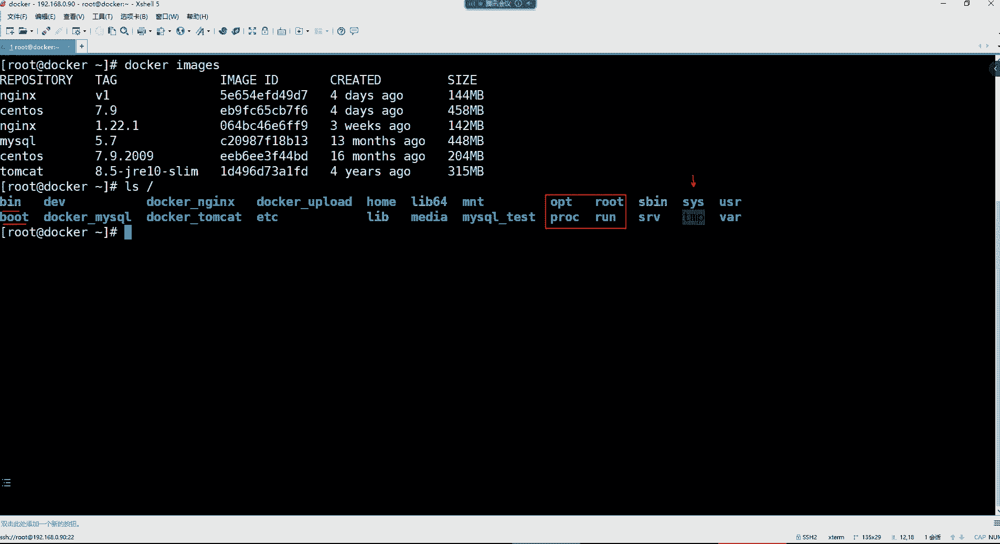

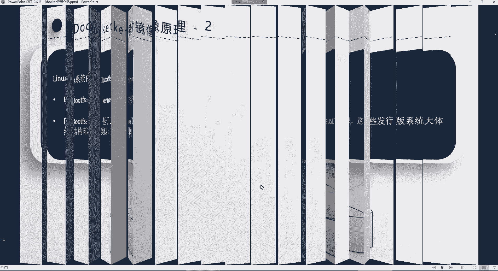

Docker容器共享宿主机的**BootFS**（内核），因此镜像中不包含这一层。镜像的底层是**RootFS**，即一个精简的操作系统发行版。在此之上，再叠加应用程序运行所需的环境（如JDK）和应用程序本身（如Tomcat）。

**核心概念公式**：
`完整可运行环境 = 宿主机BootFS + 镜像RootFS + 环境依赖层 + 应用程序层`

因此，一个十几兆的Tomcat软件包，其镜像可能达到几百兆，因为它包含了运行所需的完整**RootFS**和**JDK环境**。

镜像本身是**只读**的。我们无法直接修改一个已存在的镜像。若需定制，可以通过修改容器并提交为新镜像，或使用Dockerfile构建新镜像。

---

## 镜像与压缩文件的相互转换

理解了镜像原理后，我们来看看如何将镜像保存为压缩文件以便分发，以及如何从压缩文件恢复镜像。

### 将镜像保存为压缩文件

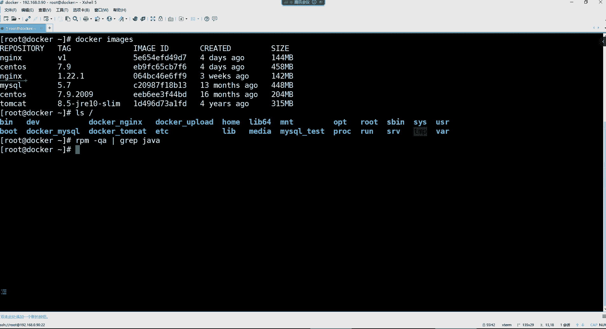

当我们需要备份或迁移镜像时，可以将其导出为单个压缩文件。

以下是操作步骤：

1.  使用 `docker save` 命令将指定镜像打包。
    ```bash
    docker save -o [压缩包名称].tar [镜像名]:[标签]
    ```
    *   `-o`：指定输出文件的名称。
    *   `[镜像名]:[标签]`：指定要打包的镜像及其版本。

2.  示例：将名为 `nginx:v1` 的镜像打包为 `nginx.tar`。
    ```bash
    docker save -o nginx.tar nginx:v1
    ```
    执行后，当前目录下会生成 `nginx.tar` 文件。

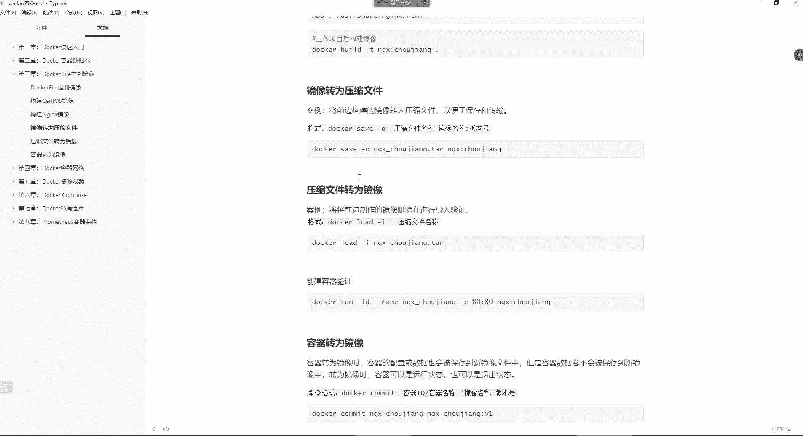

### 从压缩文件加载镜像

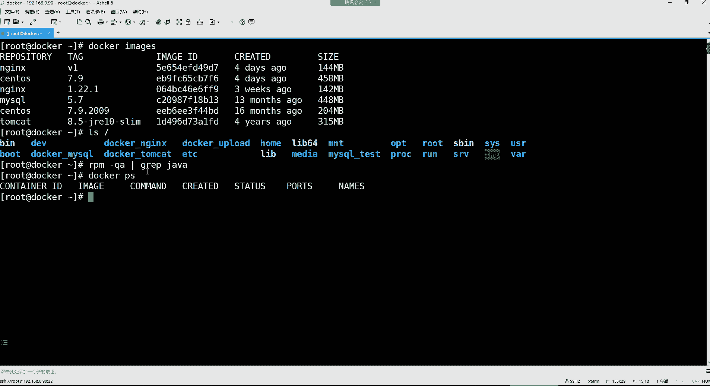

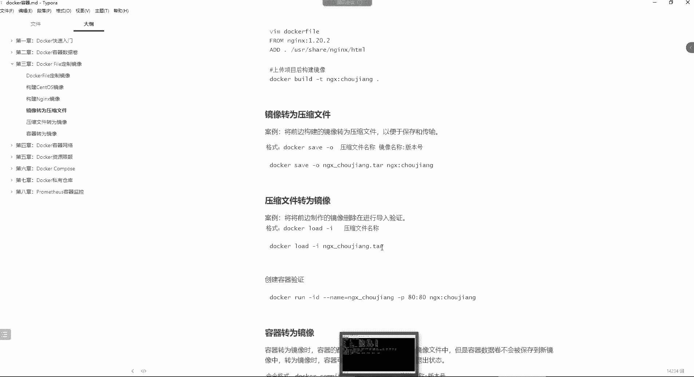

当我们获得一个镜像压缩包后，可以将其加载到本地的Docker环境中。

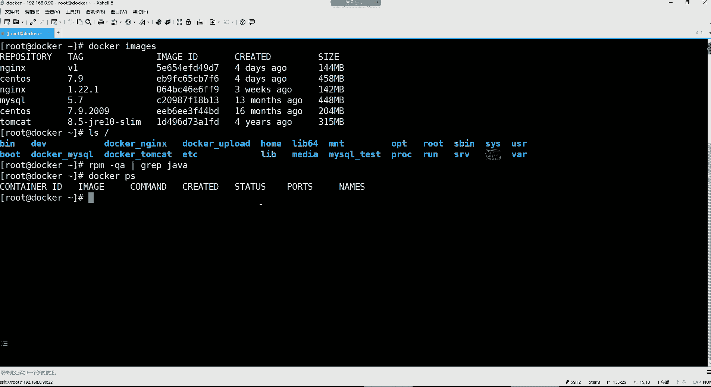

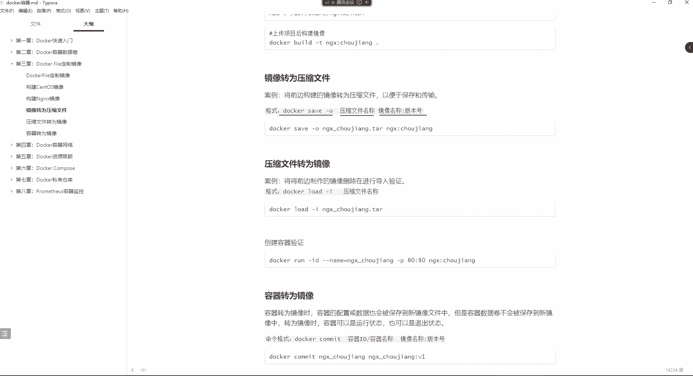

以下是操作步骤：

1.  首先，为了演示，可以删除已有的 `nginx:v1` 镜像（如果存在基于它的容器，需先删除容器）。
    ```bash
    # 删除相关容器
    docker rm -f [容器名]
    # 删除镜像
    docker rmi nginx:v1
    ```

2.  使用 `docker load` 命令从压缩包加载镜像。
    ```bash
    docker load -i [压缩包名称].tar
    ```
    *   `-i`：指定输入的压缩文件。

3.  示例：从 `nginx.tar` 文件加载镜像。
    ```bash
    docker load -i nginx.tar
    ```
    加载完成后，使用 `docker images` 即可查看到恢复的 `nginx:v1` 镜像，并可正常用于创建容器。

---

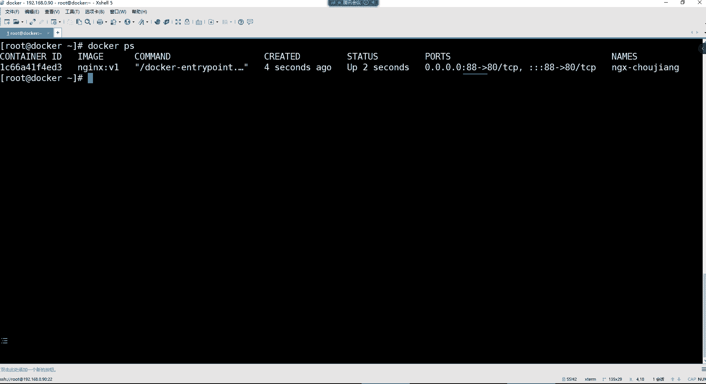

## 将容器提交为新的镜像

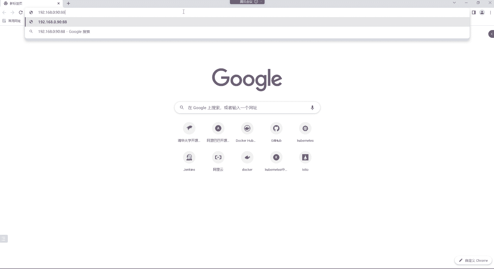


上一节我们学习了镜像的导入导出，本节中我们来看看如何保存对容器的修改。

容器层是可写的。我们可以在容器内修改配置、安装软件或添加文件，然后将这个状态保存为一个全新的镜像。

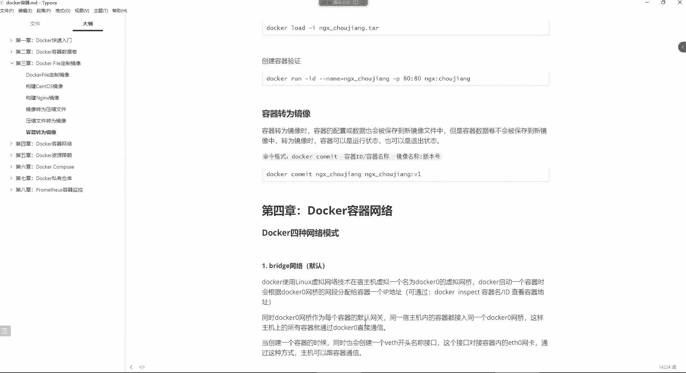

**重要提示**：
*   容器内的修改（如配置文件、新增文件）会保存到新镜像中。
*   容器挂载的**数据卷（Volume）配置不会**保存到新镜像中。基于新镜像创建容器时，数据卷配置会丢失。

以下是操作步骤：

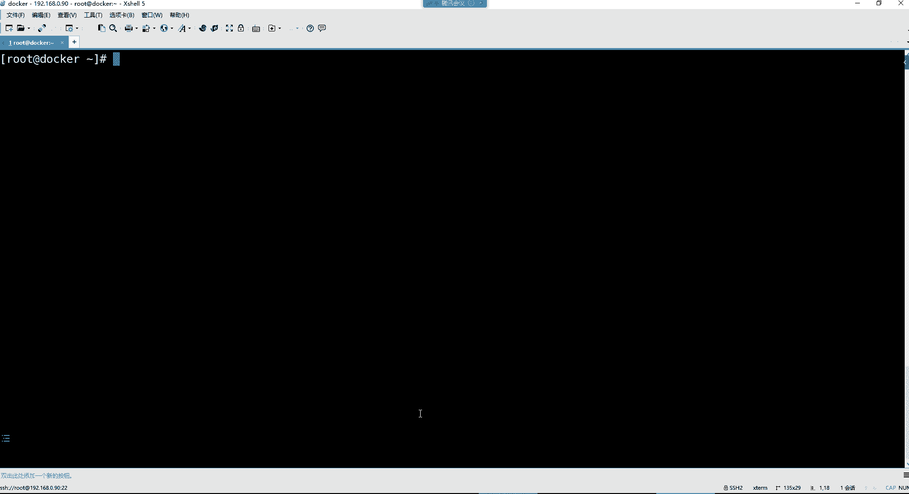

1.  对正在运行的容器进行修改。例如，进入一个Nginx容器并创建一个测试页面。
    ```bash
    # 进入容器
    docker exec -it [容器名] /bin/bash
    # 在容器内创建文件
    echo "hello" > /usr/share/nginx/html/hello.html
    # 退出容器
    exit
    ```

2.  使用 `docker commit` 命令将容器提交为新的镜像。
    ```bash
    docker commit [容器名或ID] [新镜像名]:[新标签]
    ```

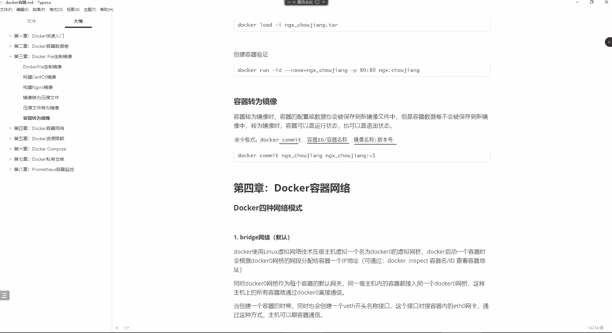

3.  示例：将名为 `mynginx` 的容器提交为 `mynginx:v2` 镜像。
    ```bash
    docker commit mynginx mynginx:v2
    ```
    提交后，使用 `docker images` 可以看到新生成的 `mynginx:v2` 镜像。

4.  验证新镜像。基于新镜像创建容器，检查之前的修改是否生效。
    ```bash
    docker run -d --name new_nginx -p 89:80 mynginx:v2
    ```
    访问 `http://[宿主机IP]:89/hello.html`，即可看到之前创建的页面。

5.  若需分发此新镜像，可再次使用 `docker save` 命令将其打包为压缩文件。
    ```bash
    docker save -o mynginx_v2.tar mynginx:v2
    ```

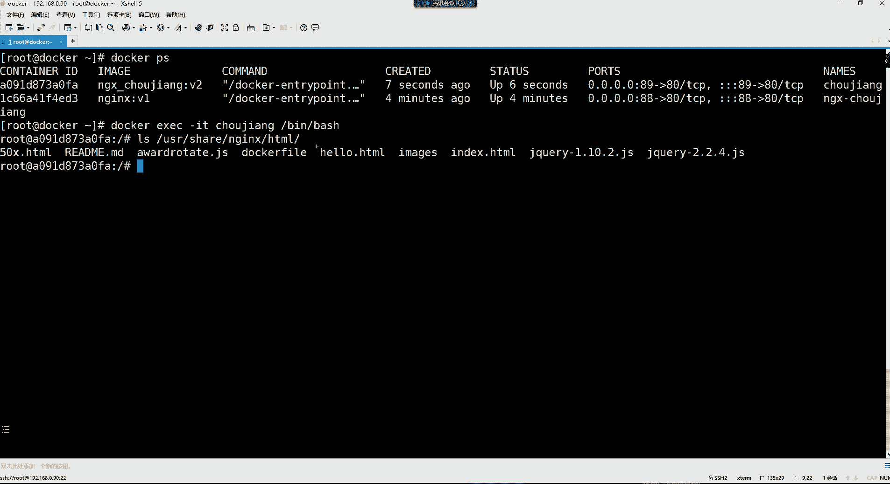


---

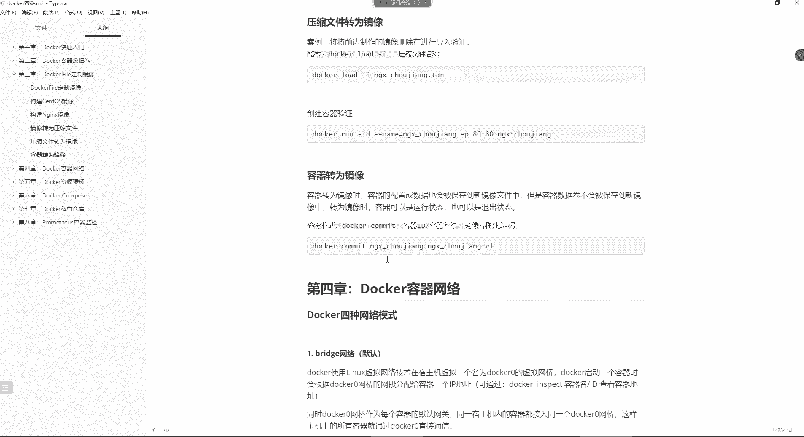

## 总结

本节课中我们一起学习了：
1.  **Docker镜像原理**：镜像是一个叠加的只读文件系统，底层共享宿主机内核，上层包含RootFS、环境依赖和应用程序。
2.  **镜像转压缩文件**：使用 `docker save -o` 命令可将镜像打包备份，便于迁移。
3.  **压缩文件转镜像**：使用 `docker load -i` 命令可将压缩包加载恢复为本地镜像。
4.  **容器转镜像**：使用 `docker commit` 命令可将修改后的容器状态保存为新的镜像，但此操作不会保存数据卷配置。

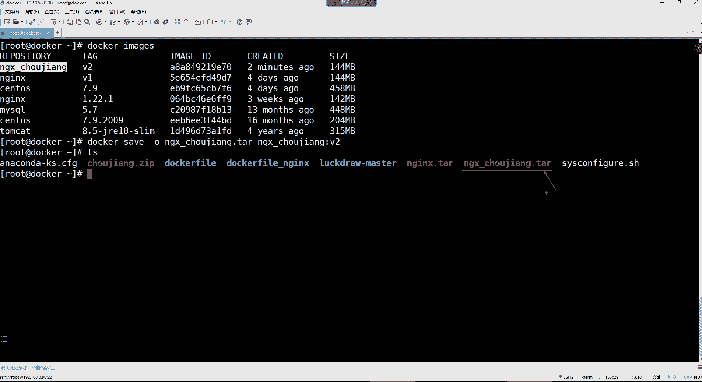

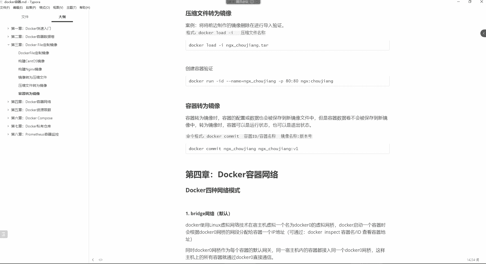

掌握这些镜像的基本操作，能够帮助你更好地管理、定制和分发Docker应用环境。