# Linux基础入门：P10：计算机硬件组成与Linux系统目录介绍

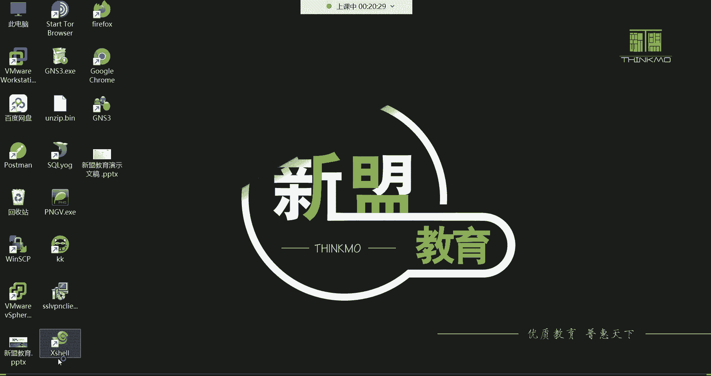


## 概述
在本节课中，我们将学习计算机硬件的基本组成以及Linux系统核心目录的结构与功能。这是理解操作系统如何与硬件交互以及后续深入学习系统管理的重要基础。

## 上节回顾与练习
上一节我们学习了Linux的基本文件操作命令。通过完成以下练习题，可以巩固这些知识。

以下是上节课的课后练习与解析：

1.  **在`/tmp`目录下创建`dent`目录，并在`dent`目录下创建`t1`、`t2`、`t3`文件。**
    *   考察命令：`mkdir`、`cd`、`touch`。
    *   方法一（相对路径）：
        ```bash
        mkdir /tmp/dent
        cd /tmp/dent
        touch t1 t2 t3
        ```
    *   方法二（绝对路径）：
        ```bash
        touch /tmp/dent/t1 /tmp/dent/t2 /tmp/dent/t3
        ```

2.  **在`/tmp`目录下递归创建`test1/test2/test3`目录。**
    *   考察命令：`mkdir -p`。
    *   命令：
        ```bash
        mkdir -p /tmp/test1/test2/test3
        ```

3.  **切换到`/tmp/test1/test2/test3`目录下，并打印当前所在目录。**
    *   考察命令：`cd`、`pwd`。
    *   命令：
        ```bash
        cd /tmp/test1/test2/test3
        pwd
        ```

4.  **同时在`/opt`和`/media`目录下创建`upload`文件。**
    *   考察命令：`touch`。
    *   命令：
        ```bash
        touch /opt/upload /media/upload
        ```

5.  **将`/opt`目录下的`upload`文件移动至`/tmp/test1/test2/test3`目录，并改名为`upload.bak`。**
    *   考察命令：`mv`。
    *   命令：
        ```bash
        mv /opt/upload /tmp/test1/test2/test3/upload.bak
        ```

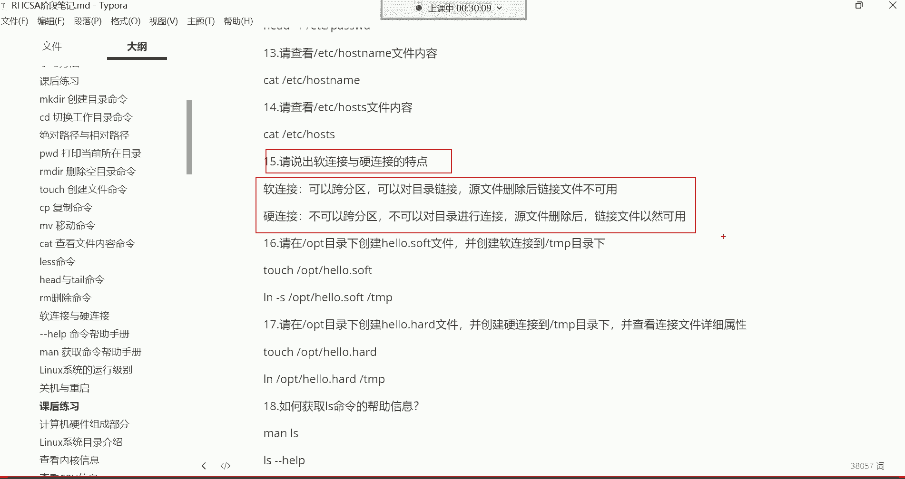


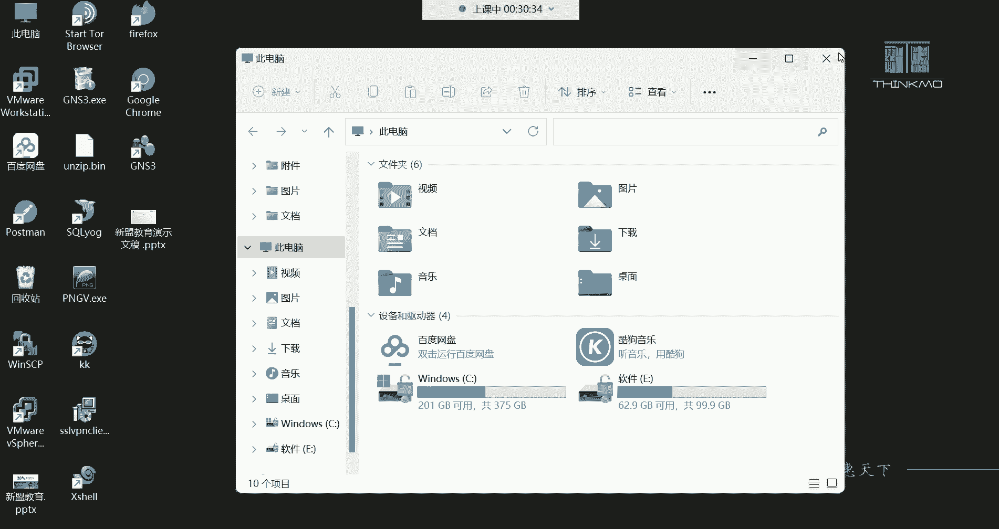

6.  **将`/etc/passwd`文件拷贝至`/opt`目录下，并改名为`passwd.bak`，保持属性不变。**
    *   考察命令：`cp -p`。
    *   命令：
        ```bash
        cp -p /etc/passwd /opt/passwd.bak
        ```

7.  **将`/etc/fstab`文件拷贝至`/opt`目录，并改名为`fstab.bak`。**
    *   考察命令：`cp`。
    *   命令：
        ```bash
        cp /etc/fstab /opt/fstab.bak
        ```

8.  **将`/etc/sysconfig/network-scripts/ifcfg-ens32`网卡文件拷贝到`/opt`目录下，并改名为`ens32.bak`。**
    *   考察命令：`cp`。
    *   命令：
        ```bash
        cp /etc/sysconfig/network-scripts/ifcfg-ens32 /opt/ens32.bak
        ```

9.  **删除`/etc/yum.repos.d`目录下所有的内容。**
    *   考察命令：`rm`。
    *   命令：
        ```bash
        rm -rf /etc/yum.repos.d/*
        ```

10. **在`/etc/yum.repos.d`下创建一个叫`local.repo`的文件。**
    *   考察命令：`touch`。
    *   命令：
        ```bash
        touch /etc/yum.repos.d/local.repo
        ```

11. **查看网卡文件的末尾五行内容。**
    *   考察命令：`tail`。
    *   命令：
        ```bash
        tail -5 /etc/sysconfig/network-scripts/ifcfg-ens32
        # 或 tail -n 5 /etc/sysconfig/network-scripts/ifcfg-ens32
        ```

12. **查看`/etc/passwd`文件的第一行内容。**
    *   考察命令：`head`。
    *   命令：
        ```bash
        head -1 /etc/passwd
        # 或 head -n 1 /etc/passwd
        ```

13. **查看`/etc/hostname`文件的内容。**
    *   考察命令：`cat`。
    *   命令：
        ```bash
        cat /etc/hostname
        ```

14. **查看`/etc/hosts`文件的内容。**
    *   考察命令：`cat`。
    *   命令：
        ```bash
        cat /etc/hosts
        ```

15. **请说说软链接与硬链接的特点。**
    *   **软链接（符号链接）**：
        *   可以跨分区创建。
        *   可以对目录创建。
        *   原文件删除后，链接文件失效（成为“死链接”）。
        *   类似于Windows的“快捷方式”。
    *   **硬链接**：
        *   不可以跨分区创建。
        *   不可以对目录创建。
        *   原文件删除后，链接文件仍然可用（数据依然存在）。
        *   本质上是同一个文件的多个名称（inode相同）。

16. **请在`/opt`目录下创建一个`hello.txt`文件，并创建其硬链接到`/tmp`目录，然后查看文件的显示属性。**
    *   考察命令：`touch`、`ln`、`ls -li`。
    *   命令：
        ```bash
        touch /opt/hello.txt
        ln /opt/hello.txt /tmp/hello_hardlink.txt
        ls -li /opt/hello.txt /tmp/hello_hardlink.txt
        ```

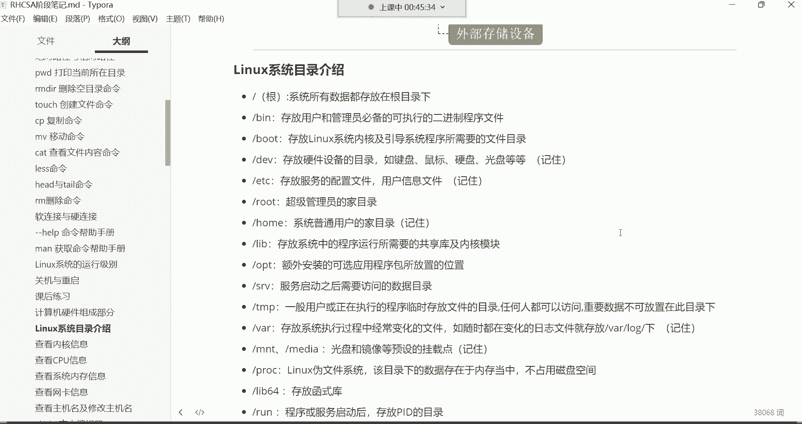

17. **如何获取`ls`命令的帮助？**
    *   方法：`ls --help` 或 `man ls`。对于初学者，查阅网络资料（如百度）可能更直观易懂。

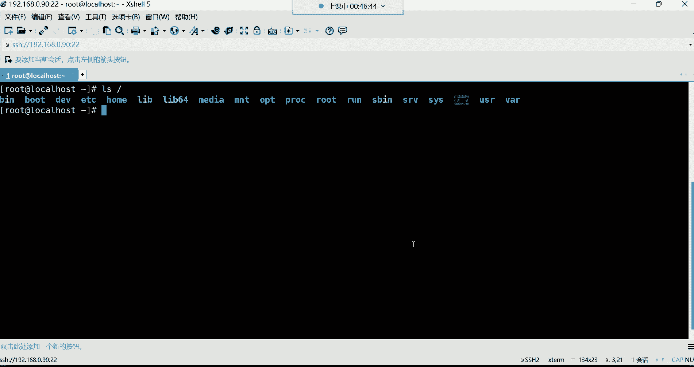

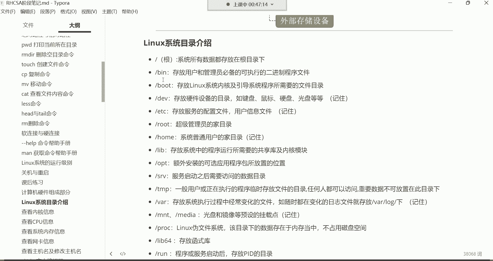

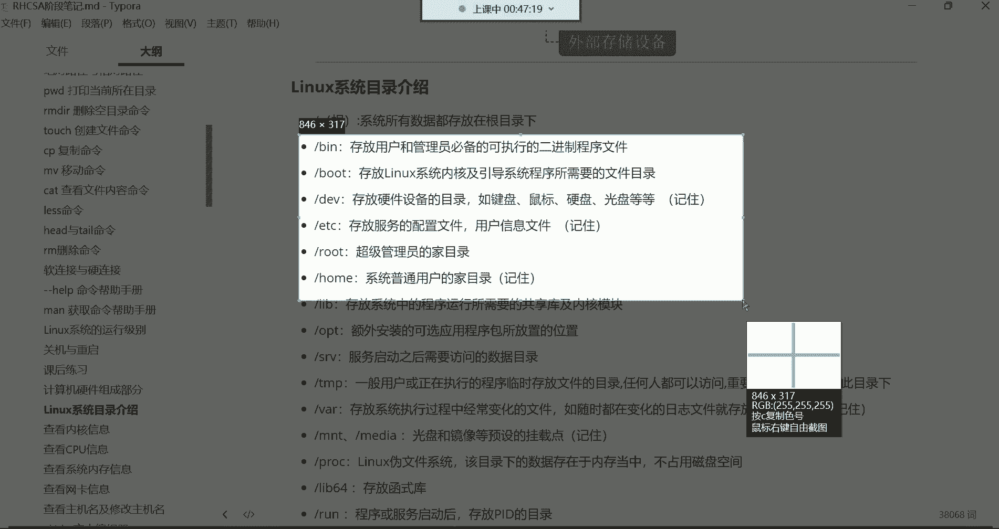

18. **请说出Linux系统的运行级别。**
    *   共有7个运行级别（0-6）：
        *   **0**：关机。
        *   **1**：单用户模式（救援模式）。
        *   **2**：多用户模式（无网络）。
        *   **3**：完整的多用户文本模式（标准服务器模式）。
        *   **4**：未使用。
        *   **5**：图形界面模式。
        *   **6**：重启。

19. **如何重启Linux系统？**
    *   常用命令：`reboot`。

## 计算机硬件组成简介
了解了命令操作后，本节我们来看看计算机的物理基础。一台计算机主要由以下硬件组成：

*   **输入设备**：如鼠标、键盘、触摸屏，用于向计算机输入指令和数据。
*   **主机设备（机箱内部）**：
    *   **主板**：连接所有硬件的核心电路板。
    *   **中央处理器（CPU）**：计算机的“大脑”，负责执行计算和逻辑处理。
    *   **内存（RAM）**：临时存储CPU正在处理或即将处理的数据，断电后数据丢失。
    *   **显卡、网卡、声卡**：负责图形处理、网络通信和音频输出。
*   **输出设备**：如显示器、耳机、打印机、投影仪，用于将计算机处理的结果呈现给用户。
*   **外部存储设备**：如硬盘、固态硬盘（SSD）、光盘、U盘，用于长期保存数据。

**CPU核心概念补充**：
*   **架构**：CPU的设计规范。常见的是`x86`（32位）和`x86_64`（64位）。
*   **位数**：指CPU一次能处理的数据量。64位CPU已成为主流。
*   **核心**：CPU内部的计算单元。核心越多，并行处理能力越强。公式可理解为：**CPU性能 ≈ 核心数 × 单核性能**。

## Linux系统目录结构详解
Linux系统采用倒置的树形目录结构，根目录（`/`）是所有目录的起点。理解每个目录的用途至关重要。

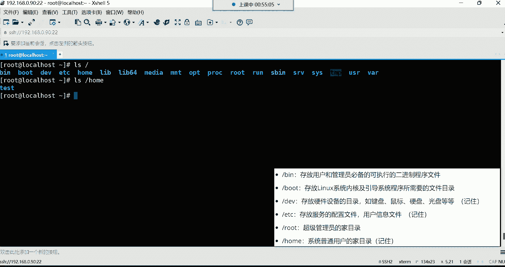

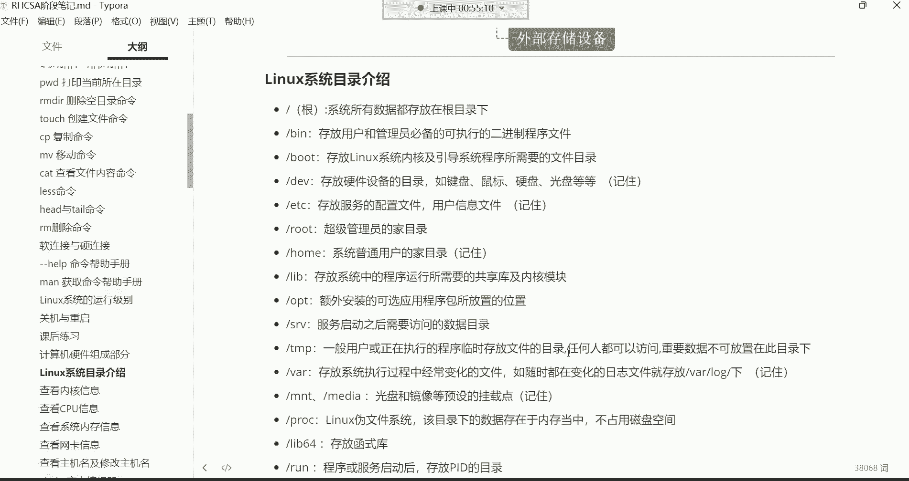

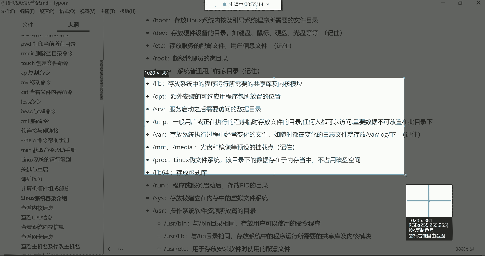

以下是Linux系统核心目录及其功能的详细介绍：

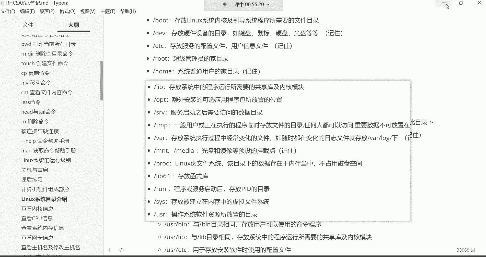

*   **`/` (根目录)**：所有目录和文件的起点。

*   **`/bin`**：存放**系统必备**的可执行命令（二进制程序文件），如`ls`、`cp`、`rm`。它是`/usr/bin`目录的软链接。
    ```bash
    ls -ld /bin  # 查看链接关系
    ```

*   **`/boot`**：存放**系统启动**所需的文件，包括Linux内核（`vmlinuz-*`）和引导加载程序（如GRUB）的配置文件。

*   **`/dev`**：存放**设备文件**。在Linux中，硬件设备（如硬盘`/dev/sda`、终端`/dev/tty`）都以文件形式存在于此目录。

*   **`/etc`**：存放**系统和应用程序的配置文件**。这是系统管理员最常修改的目录之一，如用户账户文件`/etc/passwd`、网络配置等。

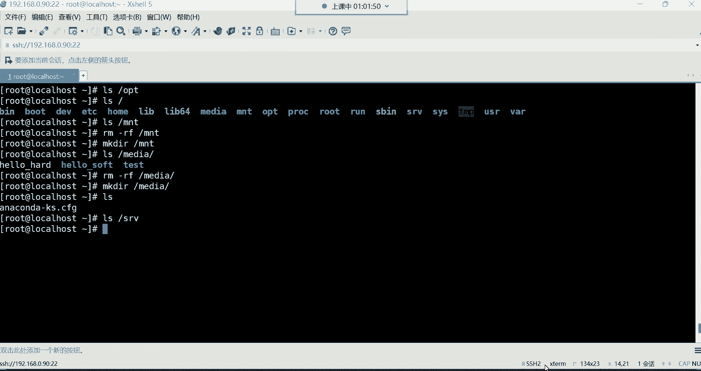

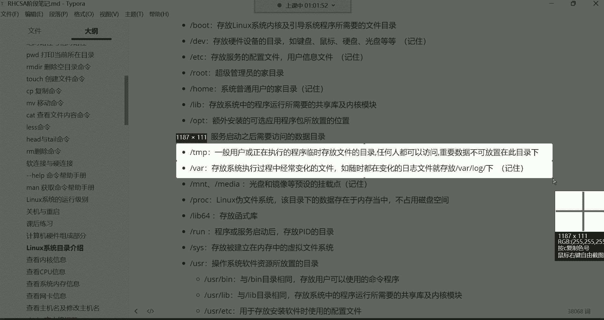

*   **`/home`**：**普通用户的家目录**。每个用户在此目录下有一个以自己用户名命名的子目录，用于存放个人文件。

*   **`/root`**：**系统管理员（root用户）的家目录**。

*   **`/lib` 与 `/lib64`**：存放**系统库文件**（`.so`文件）和内核模块。这些是许多程序运行时共享的功能模块。

*   **`/media` 与 `/mnt`**：**可移动介质和临时文件系统的挂载点**。例如，插入U盘或光盘后，系统通常会将其自动挂载到`/media`下的目录。`/mnt`常用于管理员手动挂载。

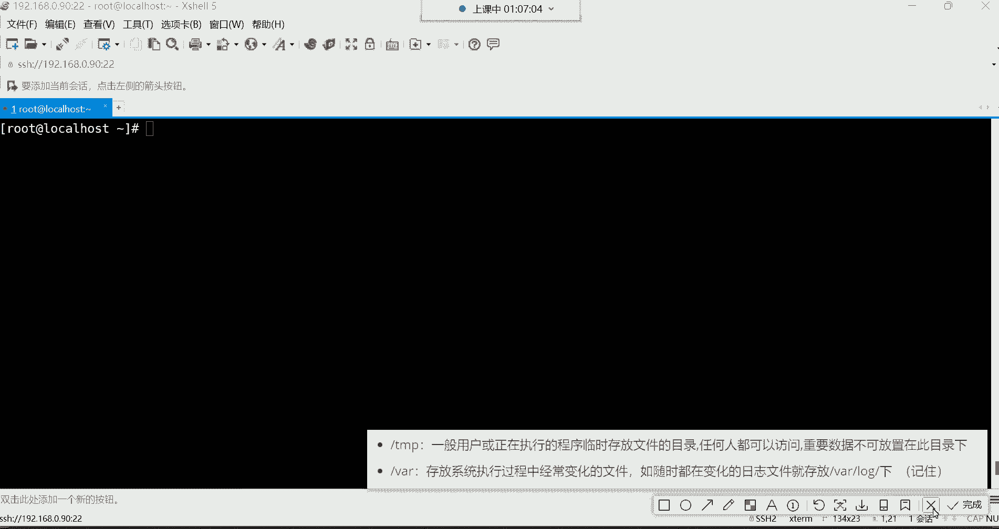

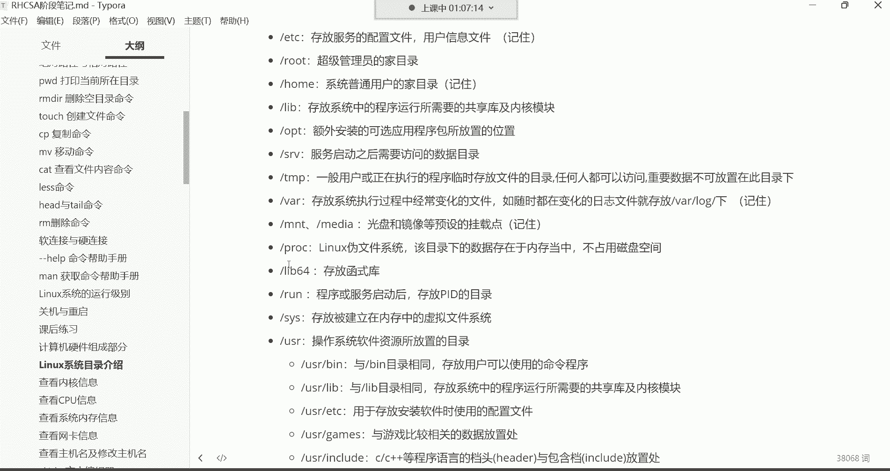

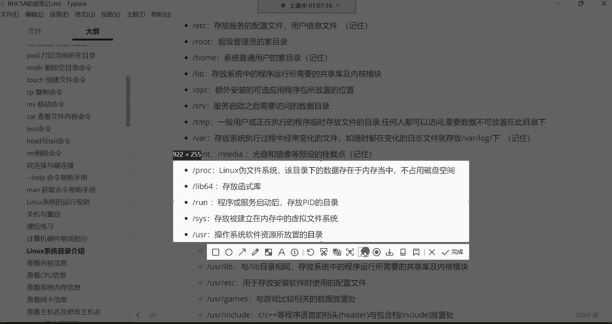

*   **`/opt`**：用于安装**第三方可选应用程序**。如果误删，可以重建，通常不存放关键系统数据。

*   **`/proc`**：一个**虚拟文件系统**，其内容映射自**内存**，提供了内核和进程信息的接口。例如，`/proc/cpuinfo`文件记录了CPU的详细信息。

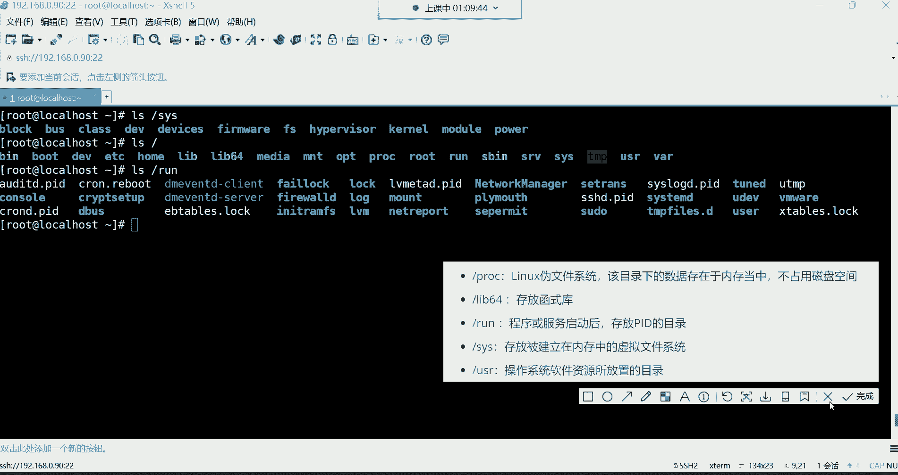


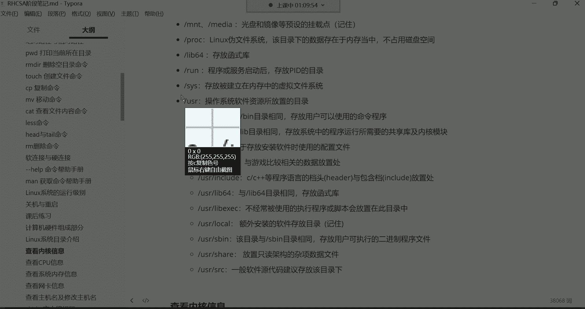

*   **`/run`**：存放自系统启动以来**运行中的进程**的运行时数据（如PID文件），是临时文件系统。

*   **`/srv`**：存放**服务（Service）相关的数据**。例如，Web服务器的网站文件可以放在`/srv/www`下。

*   **`/sys`**：另一个**虚拟文件系统**，用于访问和配置**内核参数**和硬件设备信息。

*   **`/tmp`**：存放**临时文件**。所有用户都可读写，系统重启后可能被清理。**不要在此存放重要数据**。

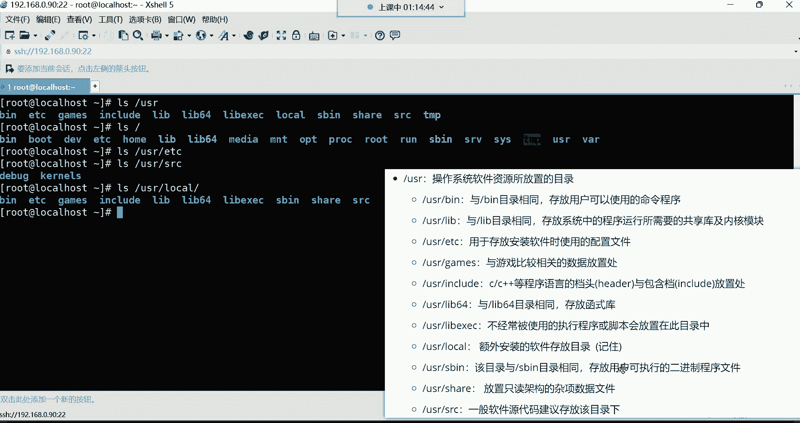

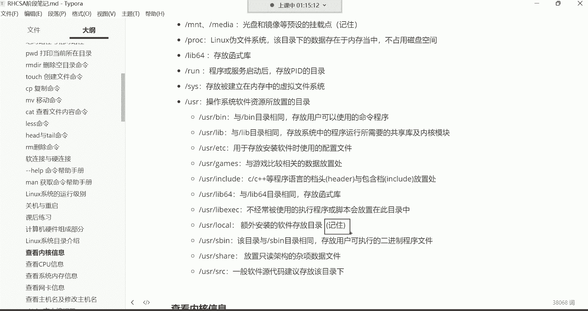

*   **`/usr`**：存放**系统软件资源**，层级结构类似一个小型根目录。
    *   `/usr/bin`：大部分用户命令的实际存放位置。
    *   `/usr/lib`：应用程序的库文件。
    *   `/usr/local`：**手动编译或安装的软件**的推荐位置，其下也有`bin`、`etc`、`lib`等子目录。
    *   `/usr/src`：存放内核源代码。

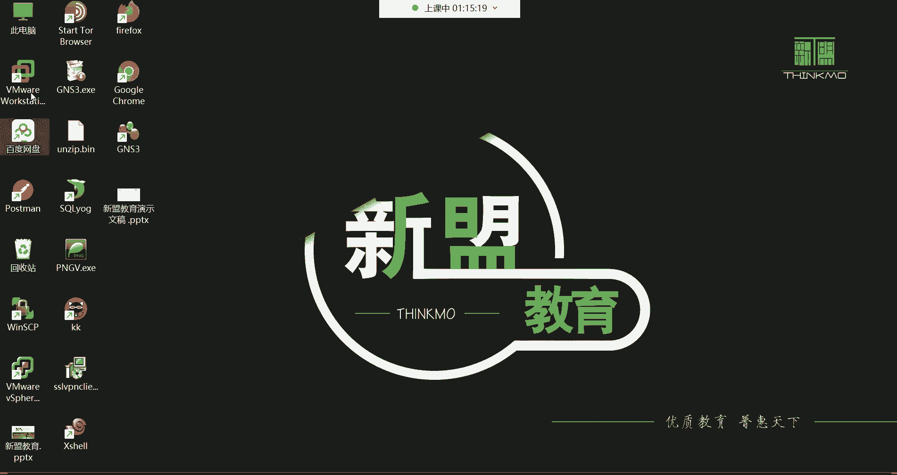

*   **`/var`**：存放**经常变化（Variable）的数据**，如日志、缓存、邮件等。
    *   `/var/log`：**系统日志文件**的集中存放地，如`/var/log/messages`（系统主日志）、`/var/log/secure`（安全日志）。

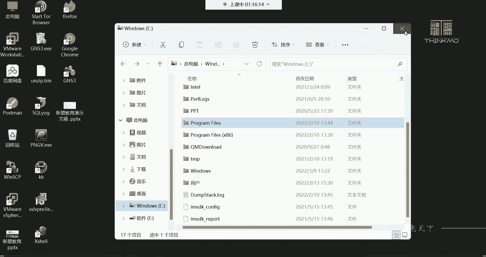

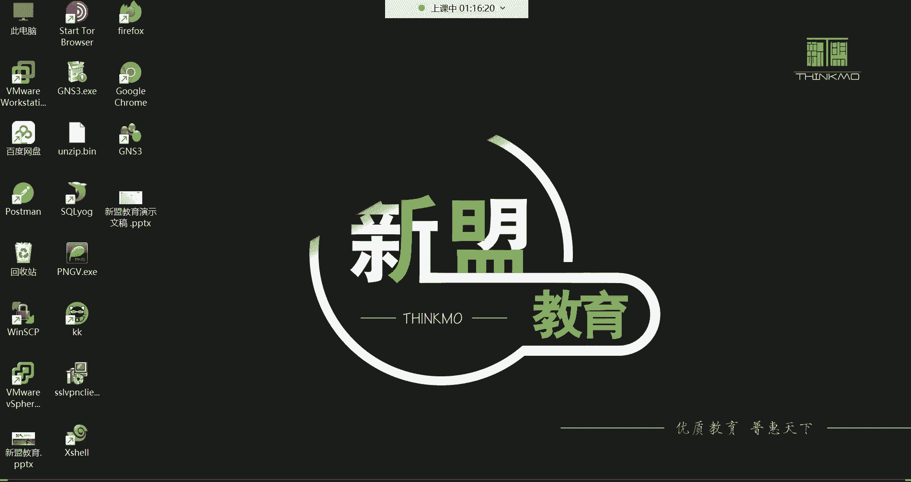

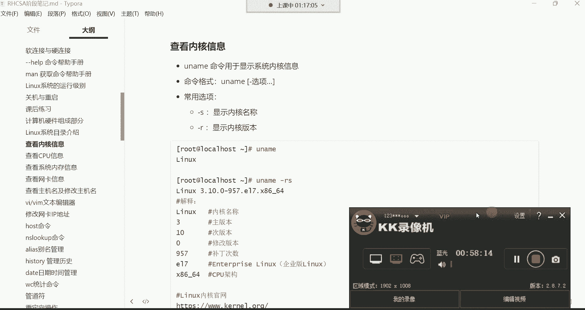

## 总结
本节课我们一起学习了计算机硬件的基本组成和Linux系统的核心目录结构。我们了解到计算机由输入、处理、输出和存储等硬件协同工作，而Linux则通过一个清晰、标准的目录树来组织所有文件和数据。掌握`/etc`、`/home`、`/var/log`、`/usr/local`等关键目录的用途，是后续进行系统配置、软件安装和故障排查的基础。记住，学习初期无需死记硬背所有目录，多在实践中使用，自然会逐渐熟悉。