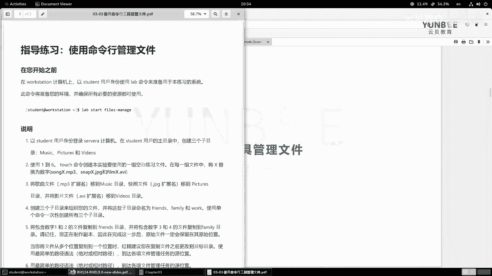
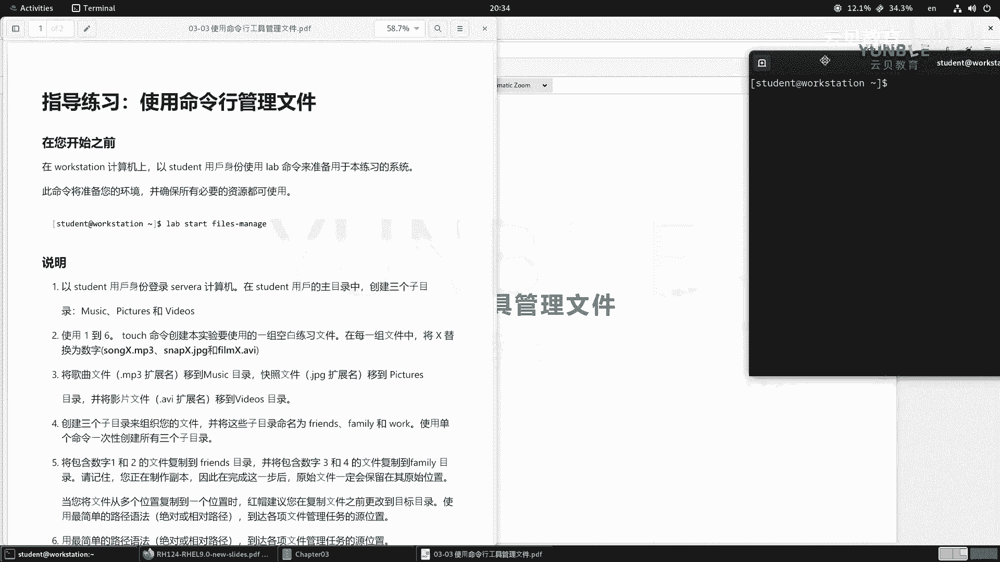
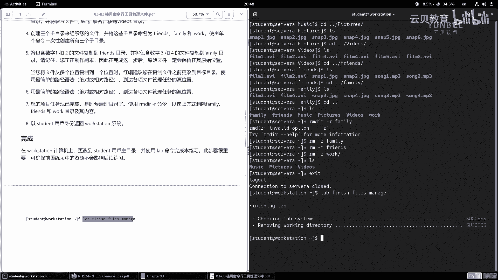
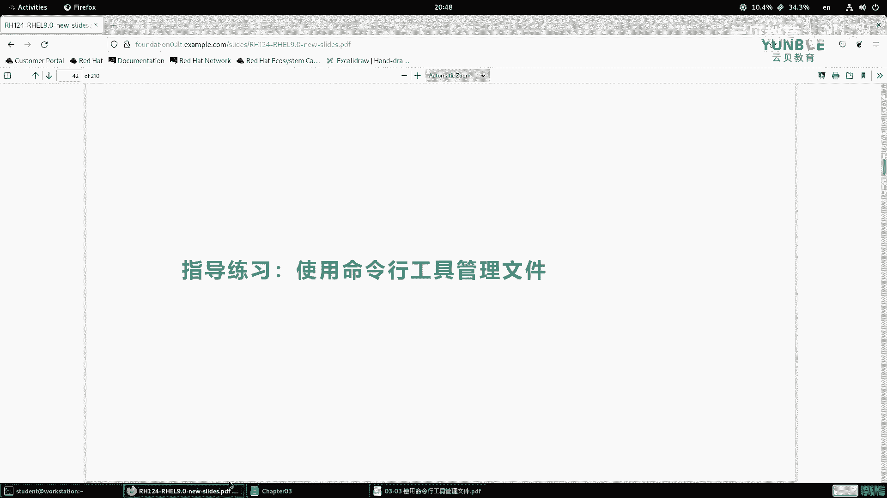

# Linux基础：03.4：使用命令行工具管理文件-实验 🗂️



在本节课中，我们将通过一个动手实验，学习如何使用Linux命令行工具来创建、移动、复制和删除文件与目录。你将掌握`mkdir`、`touch`、`mv`、`cp`和`rm`等核心命令的实际应用。



## 概述

本次实验的目标是模拟一个文件整理任务。我们将以`student`用户身份登录，在其主目录下创建特定目录和文件，然后根据文件类型和名称将它们组织到不同的子目录中，最后清理实验环境。整个过程将完全在命令行中完成。

## 实验步骤

### 1. 启动实验环境

首先，我们需要登录到实验环境并启动实验。在终端中执行以下命令：

```bash
lab start files-manage
```

执行此命令后，实验环境即准备就绪。

### 2. 创建目录

第一步，我们需要在`student`用户的主目录（`~`）下创建三个子目录：`music`、`pictures`和`videos`。

以下是创建目录的命令：
```bash
mkdir -v music pictures videos
```
*   **`mkdir`**：创建目录的命令。
*   **`-v`**：参数，显示命令执行的详细信息。

### 3. 创建文件

接下来，我们使用`touch`命令创建一系列模拟文件。`touch`命令的主要功能是创建新的空白文件或更新已有文件的时间戳。

以下是创建文件的命令：
```bash
touch song1.mp3 song2.mp3 song3.mp3 song4.mp3 song5.mp3 song6.mp3
touch snap1.jpg snap2.jpg snap3.jpg snap4.jpg snap5.jpg snap6.jpg
touch film1.avi film2.avi film3.avi film4.avi film5.avi film6.avi
```

### 4. 移动文件到对应目录

现在，我们需要将不同类型的文件移动到之前创建的对应目录中。

首先，将MP3文件移动到`music`目录：
```bash
cd music
mv ../song*.mp3 .
cd ..
```

接着，将图片文件移动到`pictures`目录：
```bash
cd pictures
mv ../snap*.jpg .
cd ..
```

最后，将视频文件移动到`videos`目录：
```bash
cd videos
mv ../film*.avi .
cd ..
```
*   **`mv`**：移动或重命名文件的命令。
*   **`../`**：表示上级目录。
*   **`*`**：通配符，用于匹配多个文件。
*   **`.`**：表示当前目录。

### 5. 创建分类子目录

为了进一步组织文件，我们在主目录下再创建三个子目录：`friends`、`family`和`work`。

使用单个命令创建所有目录：
```bash
mkdir friends family work
```

### 6. 复制文件到分类目录

现在，我们将特定文件复制到新的分类目录中。复制操作会保留原始文件。

首先，将包含数字1和2的文件复制到`friends`目录：
```bash
cp -v music/song[12].mp3 pictures/snap[12].jpg videos/film[12].avi friends/
```

接着，将包含数字3和4的文件复制到`family`目录：
```bash
cp -v music/song[34].mp3 pictures/snap[34].jpg videos/film[34].avi family/
```
*   **`cp`**：复制文件的命令。
*   **`-v`**：显示复制过程的详细信息。
*   **`[12]`**：字符组，匹配括号内的任意一个字符（此处匹配1或2）。

### 7. 验证文件结构

我们可以使用`ls`命令配合相对路径，快速查看各个目录下的文件，以验证操作是否正确。

以下是查看命令示例：
```bash
ls music/
ls pictures/
ls videos/
ls friends/
ls family/
```

### 8. 清理实验环境

实验完成后，我们需要递归删除`friends`、`family`和`work`这三个目录及其所有内容。

使用以下命令进行清理：
```bash
rm -r friends family work
```
*   **`rm`**：删除文件或目录的命令。
*   **`-r`**：参数，表示递归删除，用于删除目录及其内部所有内容。

最后，运行以下命令来检查实验是否成功完成：
```bash
lab finish files-manage
```
如果看到成功提示，则表明所有实验步骤均正确执行。

## 总结

在本节课中，我们一起完成了一个完整的命令行文件管理实验。我们学习了：
1.  使用 **`mkdir`** 创建目录。
2.  使用 **`touch`** 创建空白文件。
3.  使用 **`mv`** 移动文件。
4.  使用 **`cp`** 复制文件。
5.  使用 **`rm -r`** 递归删除目录。
6.  在命令中使用**相对路径**（如`../`， `*.mp3`， `song[12].mp3`）来高效地操作文件。





通过这个实验，你应该对Linux命令行下的基本文件操作有了更直观的理解和体验。熟练掌握这些命令是高效使用Linux系统的基础。