# Linux运维入门：P12：vim文本编辑器 📝

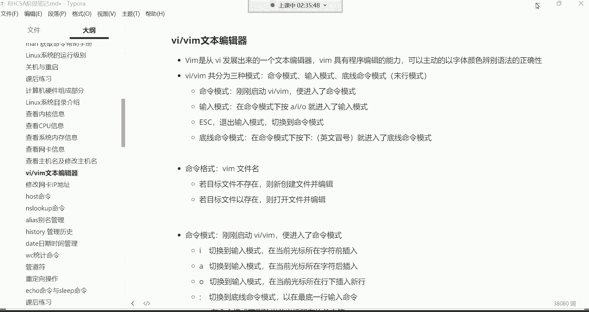

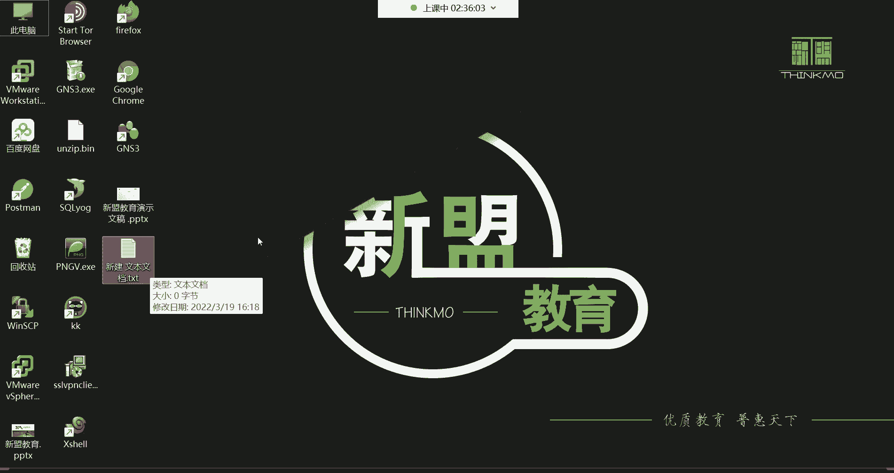


## 概述
在本节课中，我们将学习Linux系统中一个极其重要且强大的工具——vim文本编辑器。我们将从最基本的概念讲起，逐步深入到其三种工作模式以及各种常用操作命令，帮助你掌握使用vim创建、编辑和保存文件的方法。

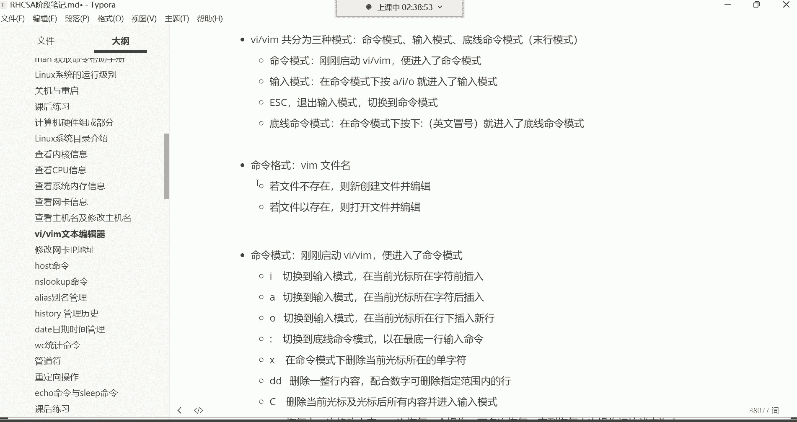

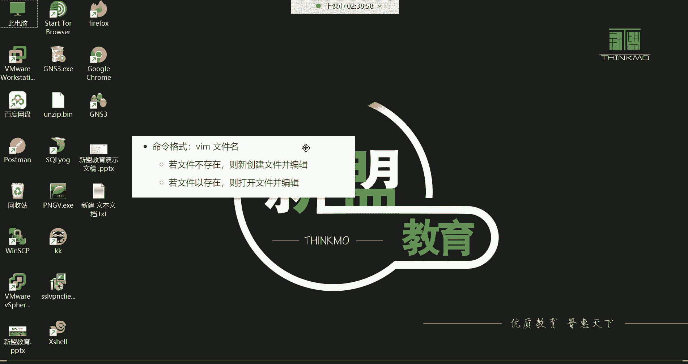

---

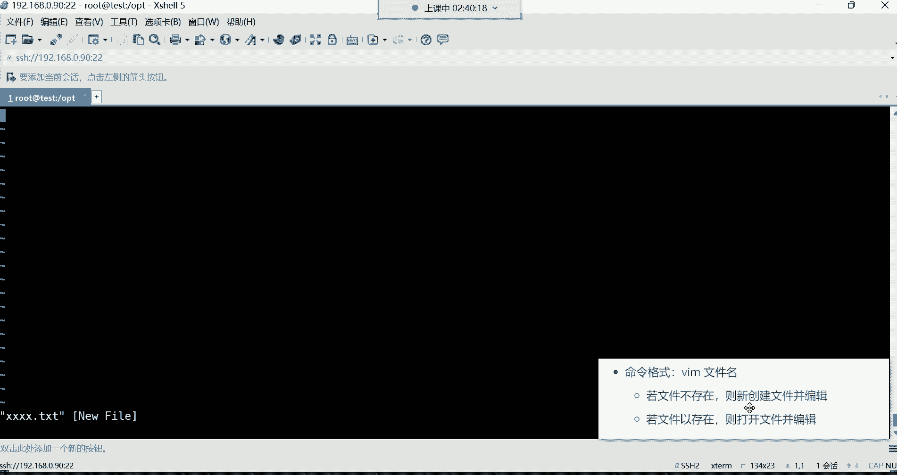

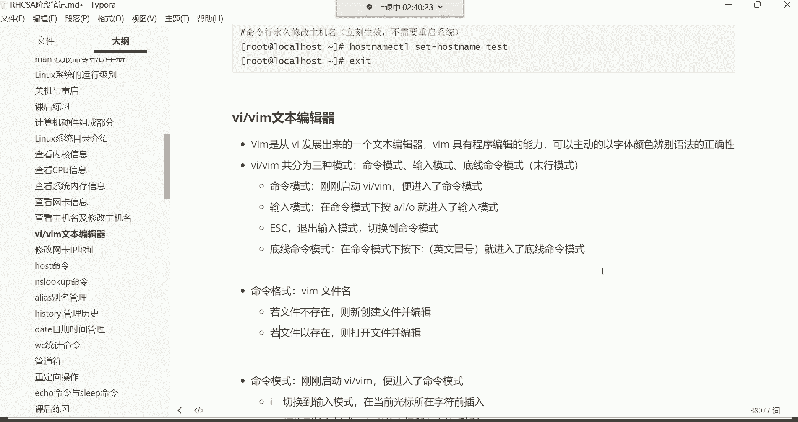

## 什么是文本编辑器？🤔

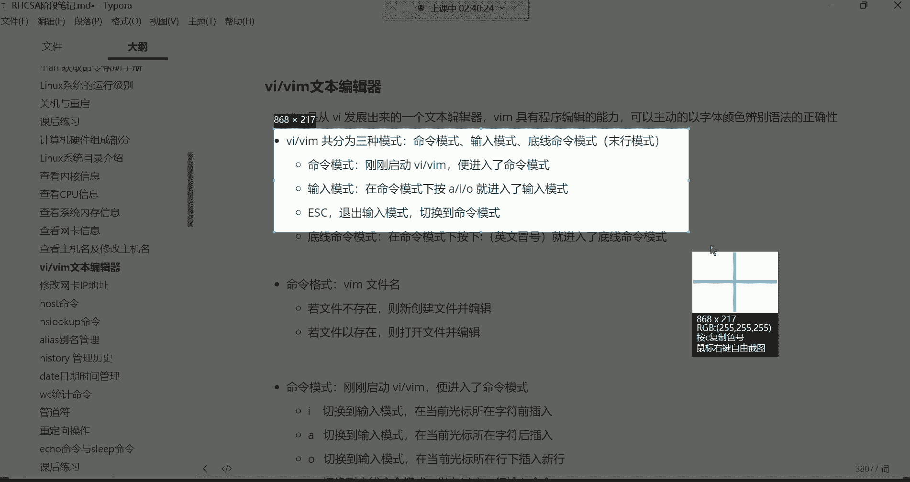

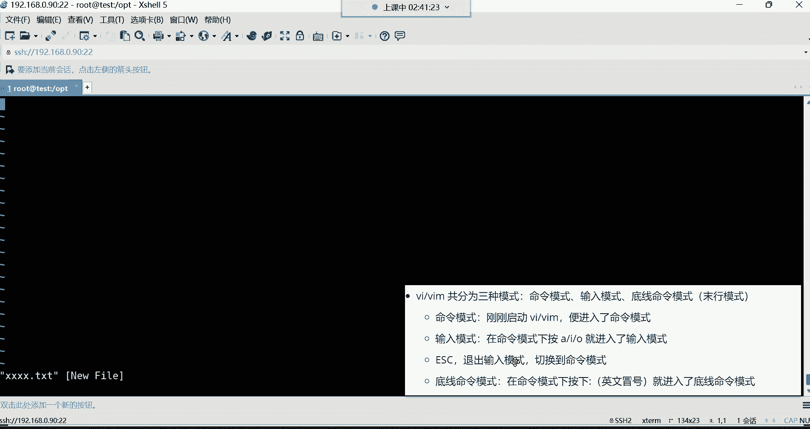

上一节我们介绍了Linux系统的一些基本信息查看命令，本节中我们来看看如何编辑系统文件。首先，我们需要理解什么是文本编辑器。


在Windows系统中，当你想要创建一个文件并写入内容时，通常会使用“记事本”这个工具。记事本就是一个文本编辑器，它具备创建文件以及对文件内容进行增、删、改、查的功能。

在Linux系统中，也有类似的工具，它叫做`vi`或`vim`。`vim`是从`vi`发展而来的一个增强版文本编辑器。它们的主要区别在于：
*   `vi`：本身没有语法高亮颜色提示。
*   `vim`：具备编程能力，可以语法高亮，能通过字体颜色提示语法是否正确，更适合编写脚本或代码。


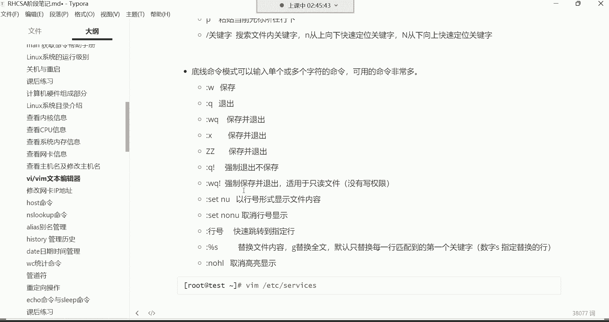

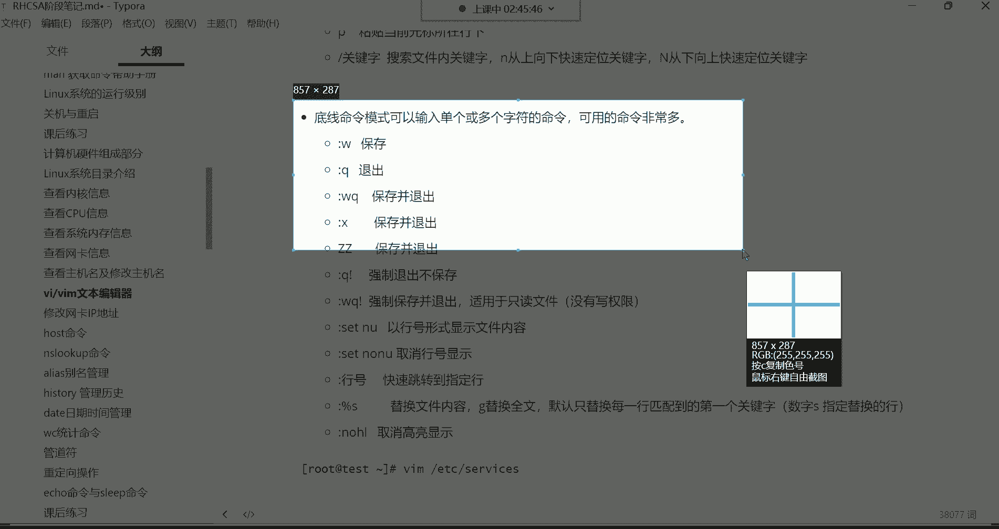

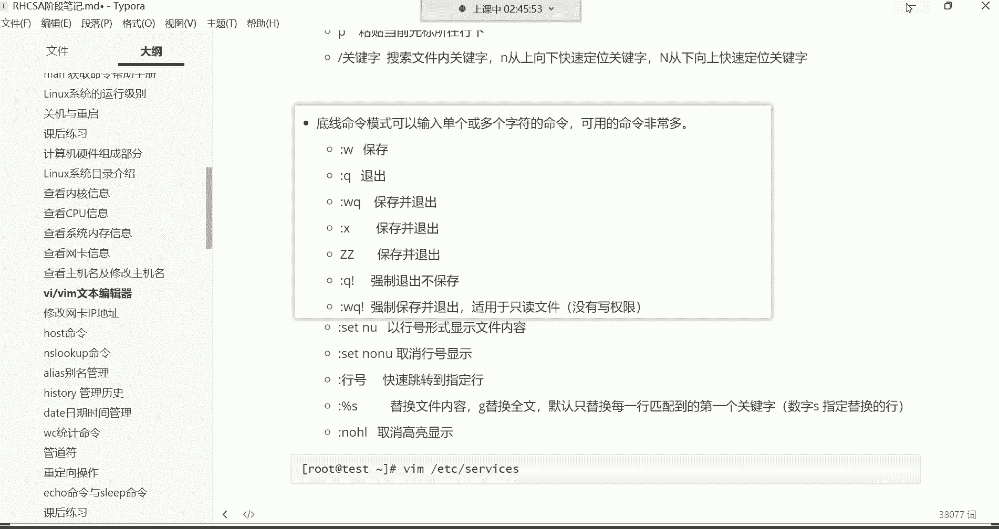

对于日常修改配置文件等操作，使用`vi`或`vim`都可以。

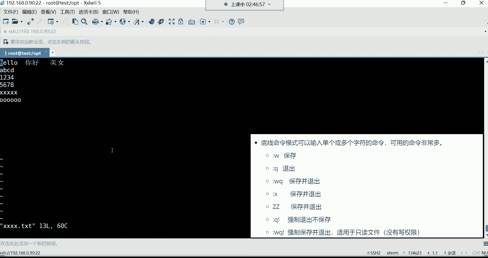

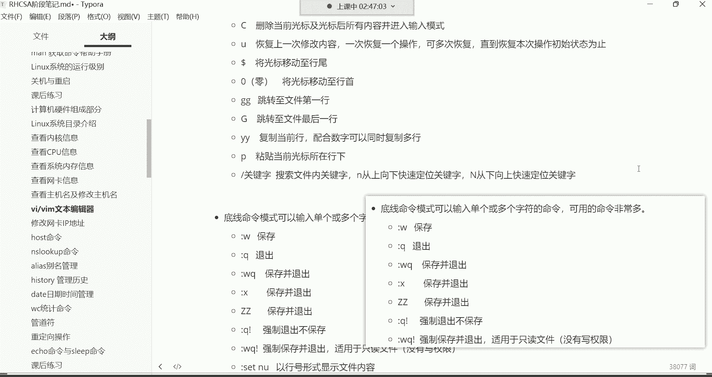

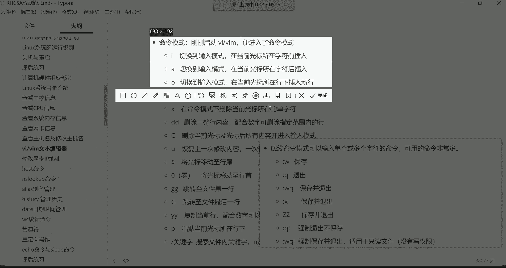

---

## vim的基本使用 🚀

### 命令格式
使用vim编辑文件的基本命令格式非常简单：
```bash
vim 文件名
```
这个命令有两个特点：
1.  若文件**不存在**，则创建新文件并进入编辑状态。
2.  若文件**存在**，则直接打开该文件进行编辑。

例如，编辑一个已存在的系统主机名文件：
```bash
vim /etc/hostname
```
编辑一个不存在的文件（vim会先创建它）：
```bash
vim /opt/xxxx.txt
```

### vim的三种模式
vim的操作比图形化的记事本复杂，因为它分为三种模式，这是学习vim的核心。

以下是三种模式的示意图及转换关系：
```
+-------------------+      按 i, a, o 键      +-------------------+
|                   | ---------------------> |                   |
|    命令模式       |                        |    输入模式       |
|  (启动vim后的状态)| <--------------------- | (插入文本的状态)  |
|                   |      按 Esc 键         |                   |
+-------------------+                        +-------------------+
         |                                          |
         | 按 : (冒号) 键                           |
         |                                          |
         v                                          |
+-------------------+                       按 Esc 键 |
|                   | <------------------------------+
|  底线命令模式     |
| (执行保存/退出等) |
+-------------------+
```

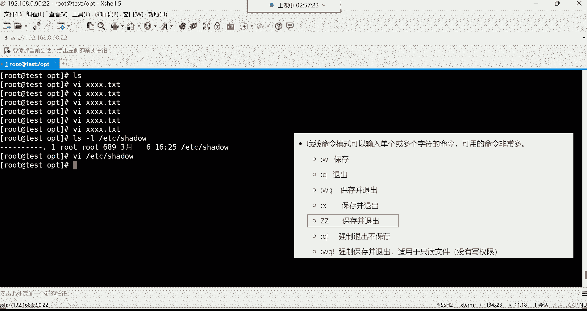

1.  **命令模式**：启动vim后默认进入的模式。在此模式下，键盘输入会被识别为各种命令，而不是文本内容。
2.  **输入模式**：在此模式下，可以向文件中输入或编辑文本内容。
3.  **底线命令模式**：在此模式下，可以在屏幕底部输入命令，进行保存、退出、搜索等操作。

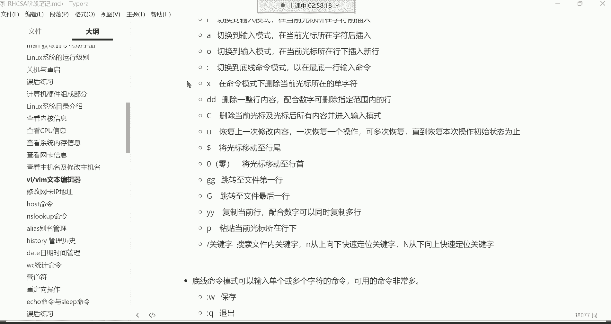

---

## 模式详解与常用操作 🛠️

### 1. 从命令模式进入输入模式
在命令模式下，按以下键可以进入输入模式（插入文本）：
*   **`i`**：在**当前光标所在字符前**插入。
*   **`a`**：在**当前光标所在字符后**插入。
*   **`o`**：在**当前光标所在行的下方**插入一个新行。

对于初学者，记住 `i` (insert) 即可。进入输入模式后，屏幕左下角通常会显示 `-- INSERT --` 或 `插入` 字样。此时，你可以像使用记事本一样输入文本，使用方向键移动光标，按回车键换行。

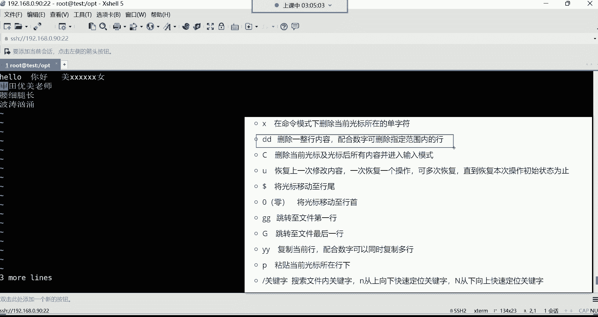

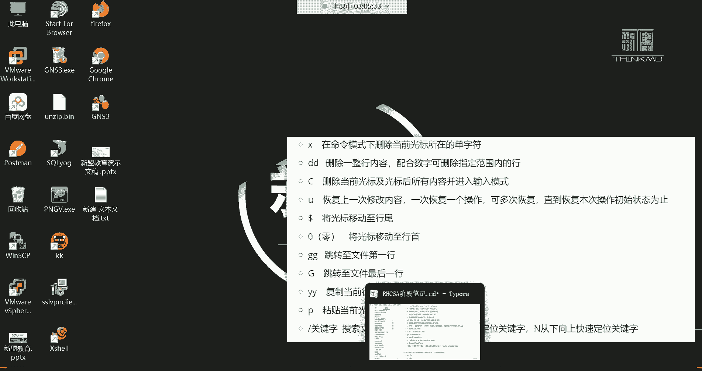

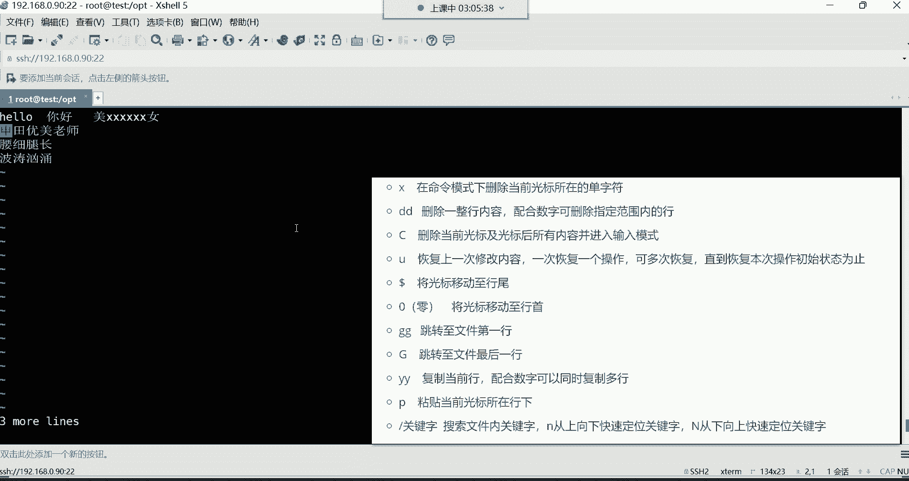

### 2. 从输入模式返回命令模式
在输入模式下，按 **`Esc`** 键即可退回到命令模式。


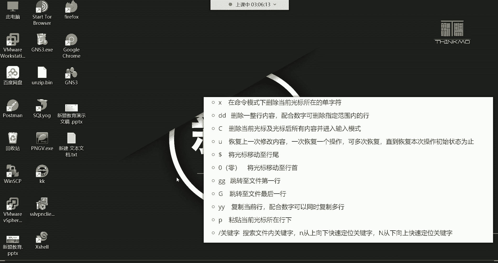

### 3. 从命令模式进入底线命令模式
在命令模式下，按 **`:`** (英文冒号) 键，光标会跳转到屏幕底部，此时进入底线命令模式，可以输入各种管理命令。

### 4. 底线命令模式的常用操作
在底线命令模式下，可以执行以下操作（输入后按回车执行）：

**文件保存与退出：**
*   **`:w`**：保存文件。
*   **`:q`**：退出vim（如果文件有修改未保存，会提示错误）。
*   **`:wq`** 或 **`:x`**：保存文件并退出。
*   **`ZZ`** (注意：这是**命令模式**下的大写`ZZ`，不是底线命令)：快速保存并退出。
*   **`:q!`**：强制退出，**不保存**任何修改。
*   **`:wq!`**：强制保存并退出（通常用于修改只读文件，需要root权限）。

**其他实用命令：**
*   **`:set nu`** 或 **`:set number`**：显示行号。
*   **`:set nonu`** 或 **`:set nonumber`**：取消显示行号。
*   **`:noh`** 或 **`:nohlsearch`**：取消搜索关键词的高亮显示。
*   **`:行号`**：快速跳转到指定行，例如 `:1000` 跳转到第1000行。
*   **`:%s/旧文本/新文本/g`**：将文件中**所有**的“旧文本”替换为“新文本”。
    *   如果不加末尾的 `g`，则只替换每行中**第一个**匹配到的“旧文本”。

---

## 命令模式下的高效编辑技巧 ⚡

在命令模式下，有一系列高效的光标移动和文本编辑命令。

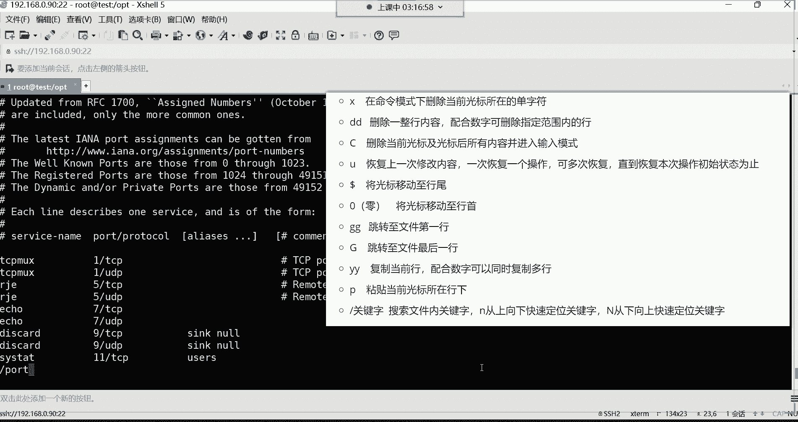

### 光标移动
*   **`0`** (数字零)：将光标移动到**行首**。
*   **`$`**：将光标移动到**行尾**。
*   **`gg`**：将光标移动到**文件第一行**。
*   **`G`**：将光标移动到**文件最后一行**。
*   **`Ctrl + f`**：向下翻页。
*   **`Ctrl + b`**：向上翻页。

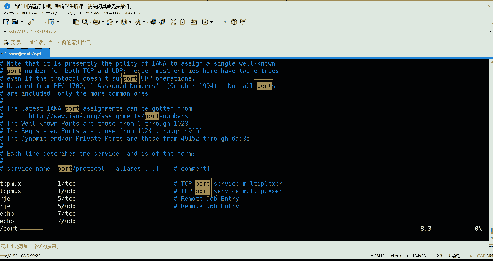

### 复制、剪切与粘贴
*   **`yy`**：复制当前整行。
*   **`数字 + yy`**：复制从当前行开始的指定行数，例如 `3yy` 复制当前行及下面两行，共三行。
*   **`p`**：将复制或剪切的内容**粘贴到当前光标所在行的下方**。
*   **`dd`**：剪切当前整行（如果后续不粘贴，效果等同于删除）。
*   **`数字 + dd`**：剪切从当前行开始的指定行数。

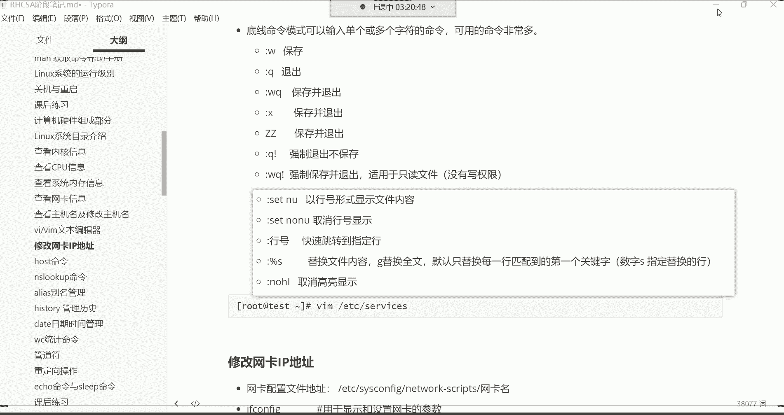

### 删除与撤销
*   **`x`**：删除当前光标所在的一个字符。
*   **`dd`**：删除（剪切）当前整行。
*   **`数字 + dd`**：删除从当前行开始的指定行数。
*   **`u`**：撤销上一次的修改（可多次按`u`进行撤销）。
*   **`Ctrl + r`**：重做，即恢复被撤销的修改。

### 搜索
*   **`/关键词`**：在文件中从当前位置**向下**搜索指定的“关键词”，按回车开始搜索。
*   **`n`**：在搜索后，按 `n` 跳转到下一个匹配项。
*   **`N`**：在搜索后，按 `N` 跳转到上一个匹配项。

---

## 总结
本节课我们一起深入学习了vim文本编辑器的使用。我们首先了解了文本编辑器的概念以及`vi`与`vim`的区别。然后，我们掌握了vim的三种核心模式：命令模式、输入模式和底线命令模式，以及它们之间的切换方法。

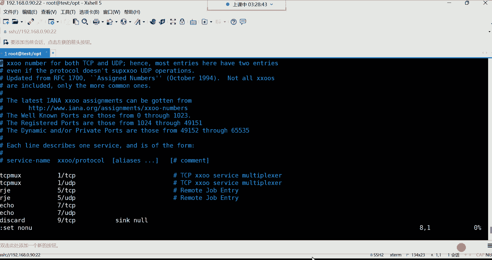

我们学习了如何进入编辑（`i`）、如何保存退出（`:wq`， `ZZ`）、如何强制退出（`:q!`）。更重要的是，我们掌握了一系列在命令模式下提升效率的技巧，包括光标的快速跳转（`gg`， `G`， `$`， `0`）、文本的复制（`yy`）、剪切（`dd`）、粘贴（`p`）、删除（`x`， `dd`）、撤销（`u`）以及搜索（`/`）和替换（`:%s/旧/新/g`）功能。

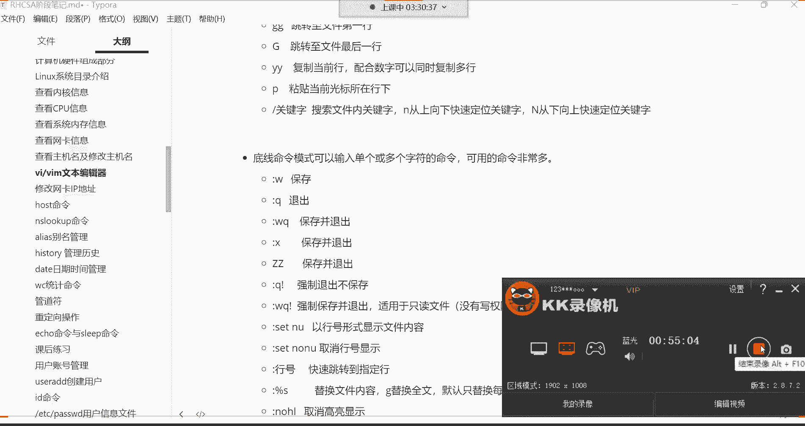

vim是Linux运维工程师必须熟练掌握的工具，其操作初期可能稍显复杂，但通过反复练习形成肌肉记忆后，将会极大提升你在命令行下的工作效率。请务必多加练习今天所学的命令。