# Linux基础：03.5：制作文件间的链接 🔗

在本节课中，我们将要学习Linux系统中文件链接的概念与操作方法。文件链接分为硬链接和软链接（又称符号链接）两种，理解它们的原理和区别对于管理文件系统至关重要。

## 文件链接概述

文件链接允许我们为同一个文件内容创建多个访问入口。这类似于为一份文件创建多个“别名”。链接主要分为两种类型：硬链接和软链接。其中，软链接可以理解为Windows系统中的“快捷方式”。

## 文件系统基础

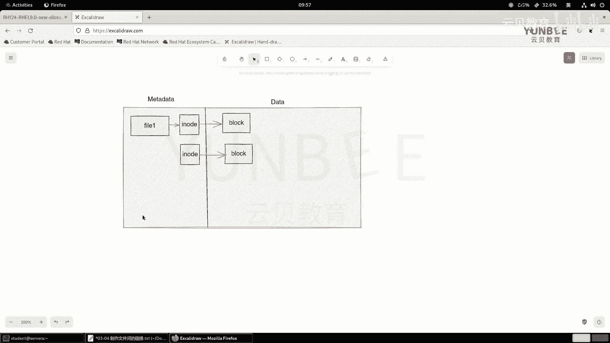

在正式了解硬链接和软链接之前，我们需要先理解数据在文件系统中的存储模式。

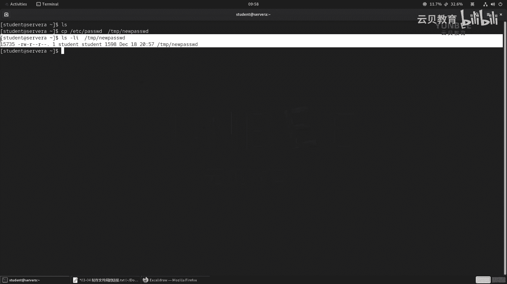

一块新的磁盘无法直接存放数据。通常，我们需要先在本地磁盘上创建一个分区，然后对该分区进行格式化，这个过程也称为制作文件系统。

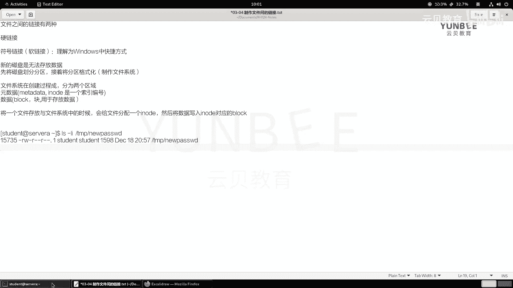

制作文件系统时，系统会初始化两个区域：
*   **元数据区域**：存放文件的索引信息，即 `inode`。每个 `inode` 都有一个唯一的编号。
*   **数据区域**：由固定大小的数据块（`block`）组成，用于实际存放文件内容。

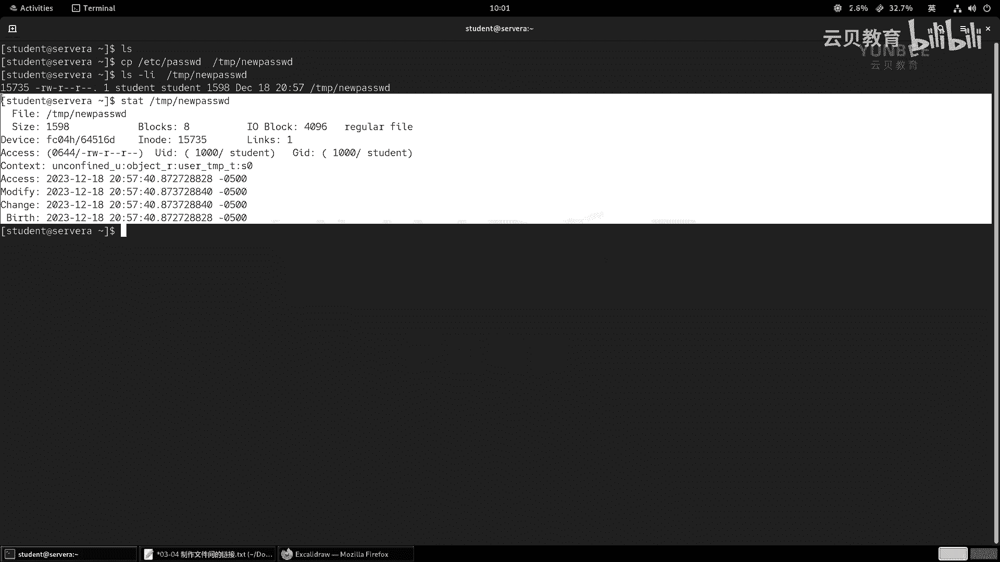

当一个文件被存入文件系统时，系统会为其分配一个 `inode`，并将文件数据写入该 `inode` 所映射的 `block` 中。这样就建立了一条从文件名到 `inode`，再到数据块的访问链路。

我们可以使用 `ls -i` 命令查看文件的 `inode` 编号，或使用 `stat` 命令查看文件的详细信息，包括其 `inode` 和硬链接数量。

## 什么是硬链接？

创建硬链接，本质上是为同一个 `inode` 分配一个新的文件名。这意味着，新的文件名和原始文件名虽然不同，但它们指向的是文件系统中完全相同的 `inode` 和数据块。

上一节我们介绍了文件系统的基础结构，本节中我们来看看如何创建硬链接。

创建硬链接的命令是 `ln`，其基本语法为：
```bash
ln <源文件> <目标链接名>
```

以下是创建硬链接的步骤示例：
1.  首先，我们复制一个示例文件：`cp /etc/passwd /tmp/newpasswd`
2.  然后，为这个文件创建一个硬链接：`ln /tmp/newpasswd /home/student/hardpasswd`
3.  使用 `ls -li` 命令查看，会发现两个文件的 `inode` 编号相同，且链接数变为 2。

**重要特性**：
*   硬链接不支持跨文件系统创建，因为不同文件系统的 `inode` 编号是独立的。
*   删除原始文件，只要硬链接还存在，数据就不会丢失。
*   硬链接只能指向文件，不能指向目录。

## 什么是软链接（符号链接）？

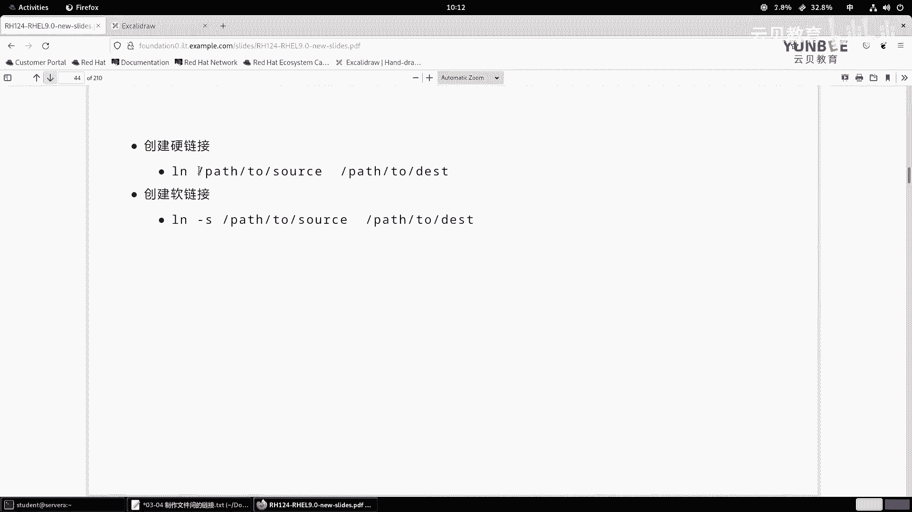

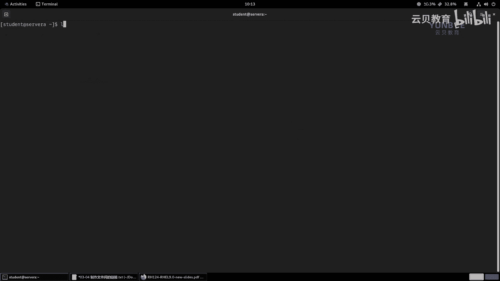

软链接（符号链接）则不同。创建软链接时，系统会创建一个全新的文件，拥有自己的 `inode` 和数据块。但这个数据块中存放的不是文件内容，而是**原始文件的路径名**。

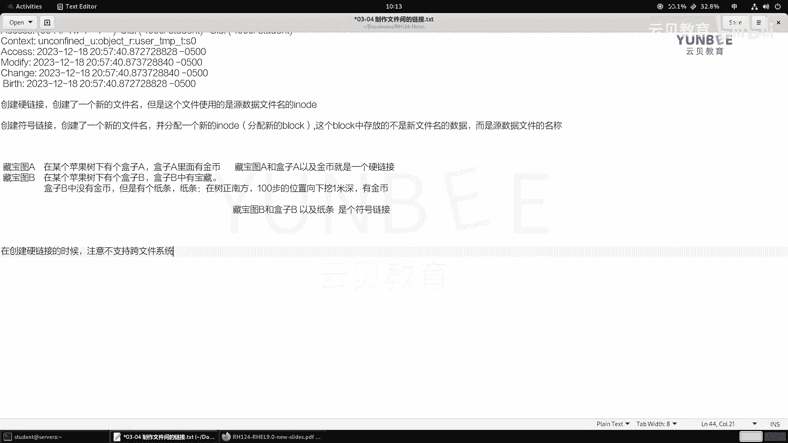

当我们访问软链接时，系统会读取这个路径，然后去查找并访问原始文件。

创建软链接需要在 `ln` 命令后加上 `-s` 选项，其语法为：
```bash
ln -s <源文件或目录> <目标链接名>
```


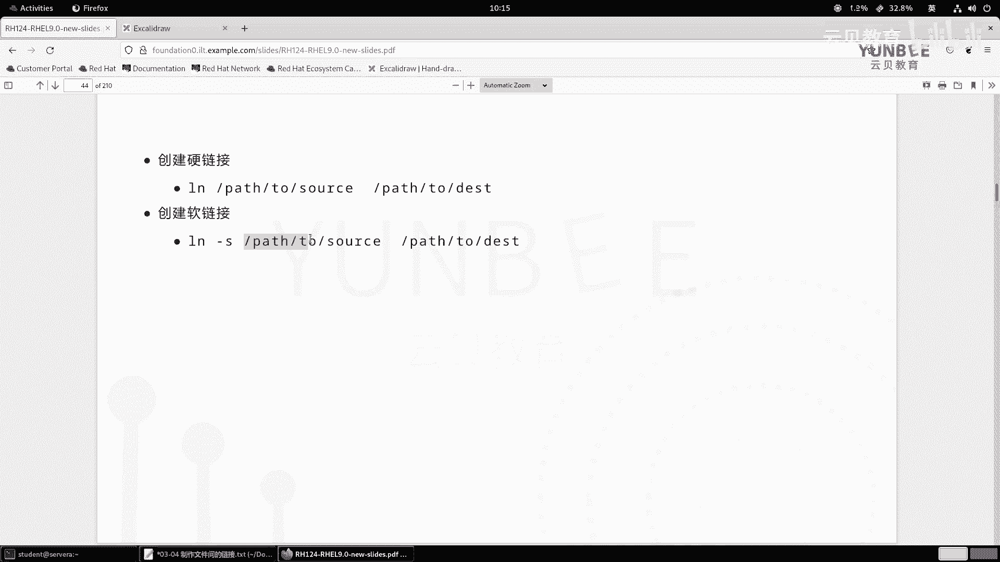

以下是创建软链接的步骤示例：
1.  我们为之前的文件创建一个软链接：`ln -s /tmp/newpasswd /home/student/softpasswd`
2.  使用 `ls -li` 查看，会发现软链接拥有独立的 `inode`，并且文件权限位显示为 `l`，末尾指向原始文件的路径。

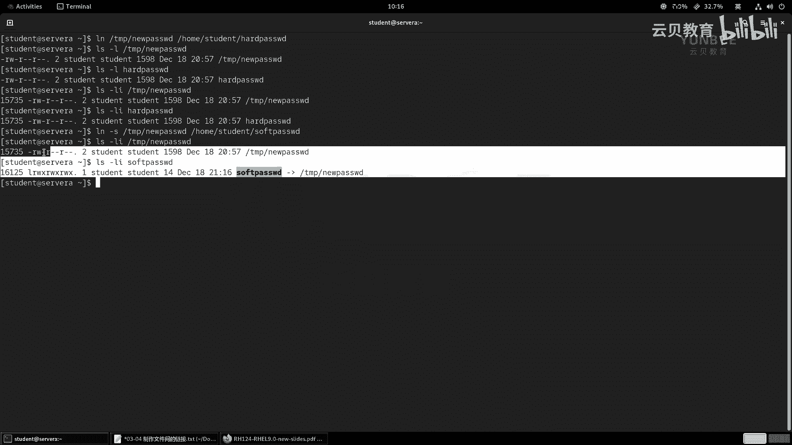

**重要特性**：
*   软链接支持跨文件系统。
*   软链接可以指向文件，也可以指向目录。
*   如果原始文件被删除或移动，软链接就会“断裂”（失效），访问时会报错。
*   软链接文件的大小是其指向的路径名的字符长度。

## 硬链接与软链接对比

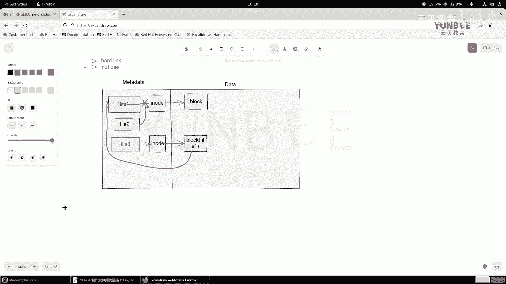

为了更清晰地理解两者的区别，以下是核心特性的总结：

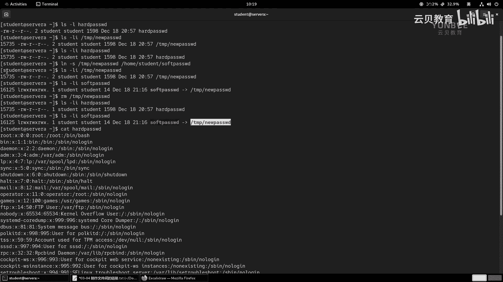

| 特性 | 硬链接 | 软链接（符号链接） |
| :--- | :--- | :--- |
| **本质** | 同一 `inode` 的另一个文件名 | 存储目标路径的特殊文件 |
| **`inode` 号** | 与源文件相同 | 与源文件不同 |
| **跨文件系统** | **不支持** | **支持** |
| **链接对象** | 仅限文件 | 文件和目录均可 |
| **原始文件删除** | 不影响链接访问 | 链接失效（悬空链接） |
| **命令** | `ln <源> <目标>` | `ln -s <源> <目标>` |
| **文件标识** | 与普通文件无异（`-`） | 权限位显示 `l` |
| **大小** | 与源文件相同 | 等于路径名的字符长度 |

## 链接的实践与检查

了解原理后，让我们通过实践来加深印象。我们可以尝试删除原始文件，观察硬链接和软链接的不同表现。

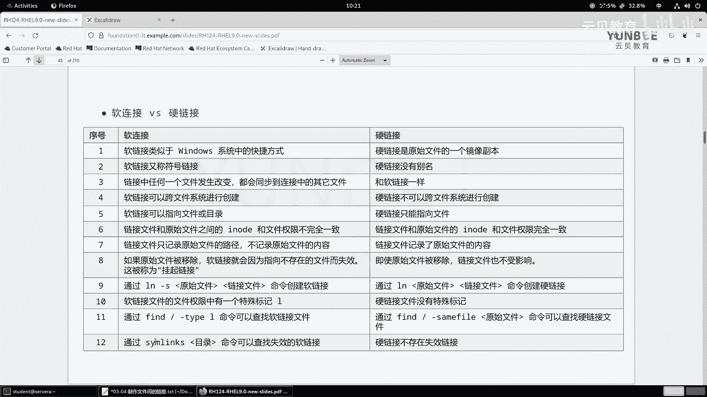


此外，可以使用 `find` 命令查找失效的软链接，例如在当前目录下查找：
```bash
find . -type l -xtype l
```
或者使用 `symlinks` 工具检查目录中的链接状态：
```bash
symlinks -r .
```

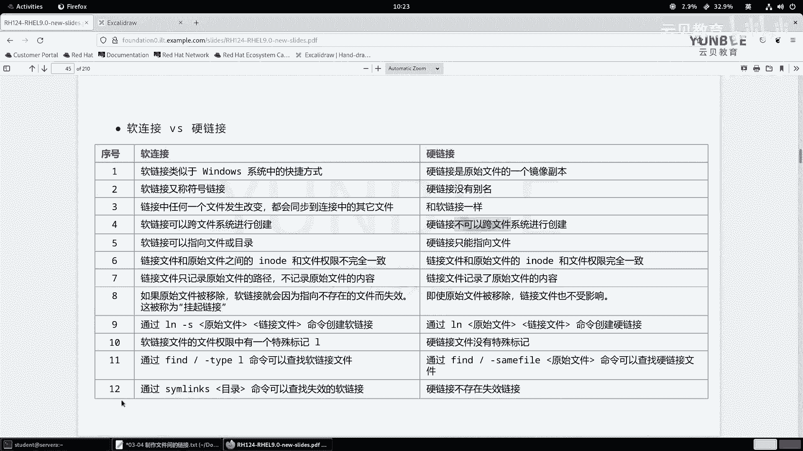

## 总结

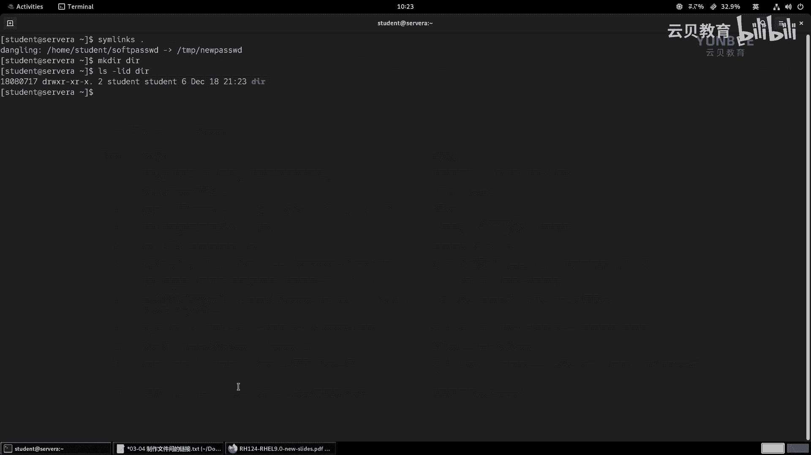

本节课中我们一起学习了Linux文件链接的核心知识。我们了解到：
1.  **硬链接**是文件 `inode` 的别名，不占用额外空间，但不能跨文件系统且不能链接目录。
2.  **软链接**是包含目标路径的特殊文件，使用灵活，支持跨文件系统和链接目录，但依赖原始文件的存在。
3.  创建硬链接使用 `ln` 命令，创建软链接使用 `ln -s` 命令。
4.  通过 `ls -li` 或 `stat` 命令可以查看文件的链接属性和 `inode` 信息。

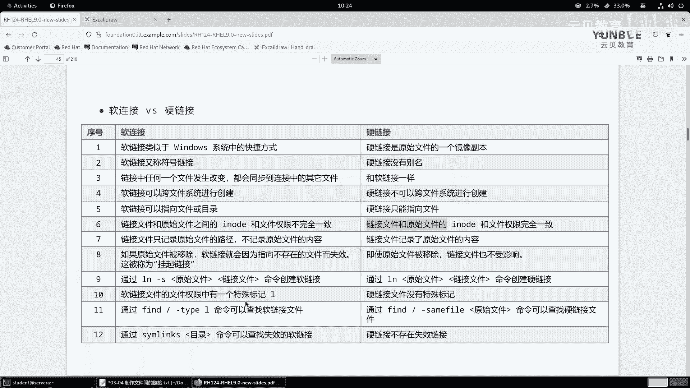

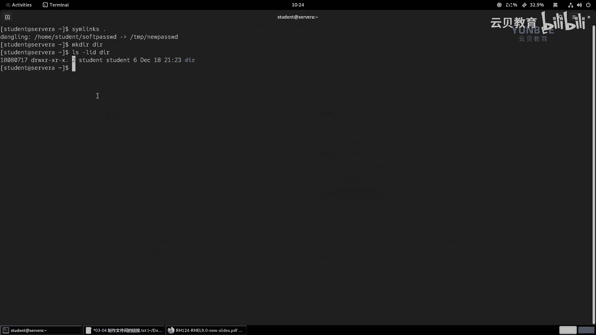

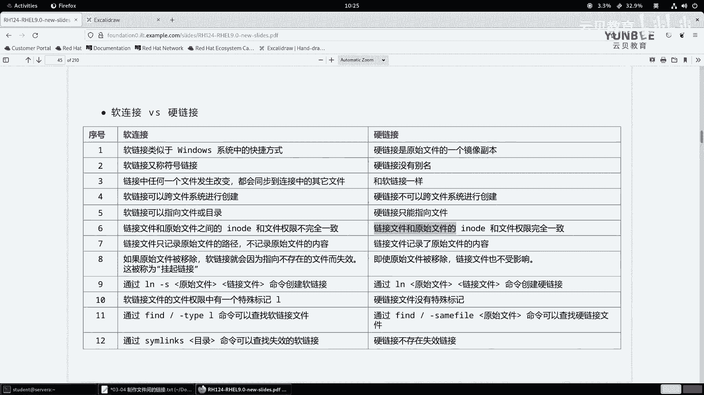

理解并熟练运用这两种链接，能够帮助您更高效地组织和管理Linux系统中的文件。