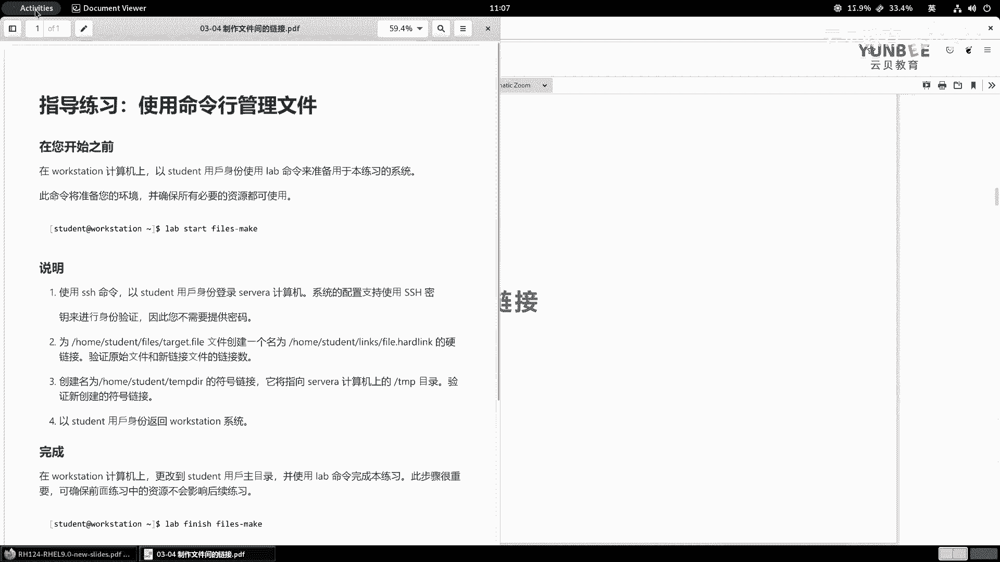
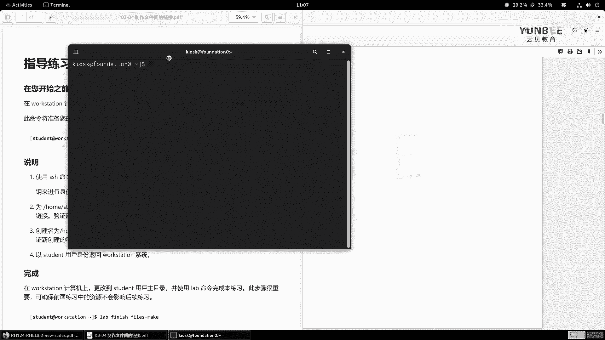
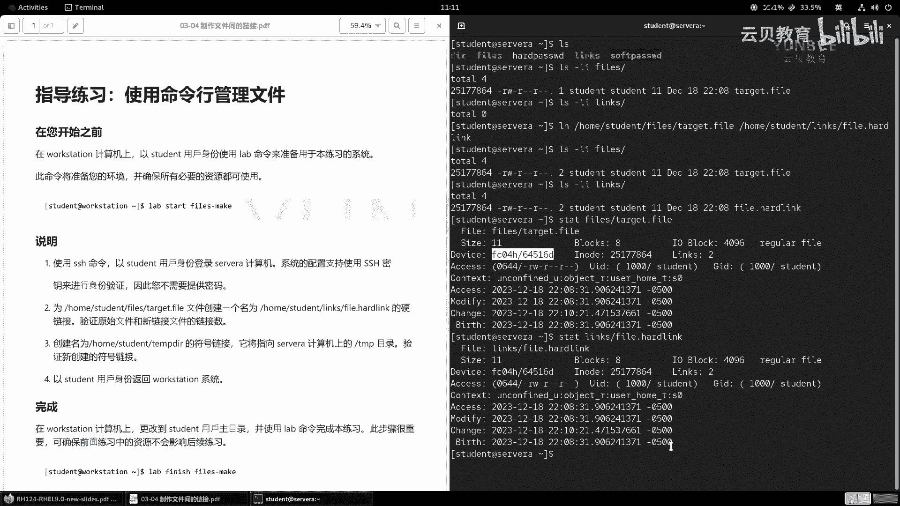
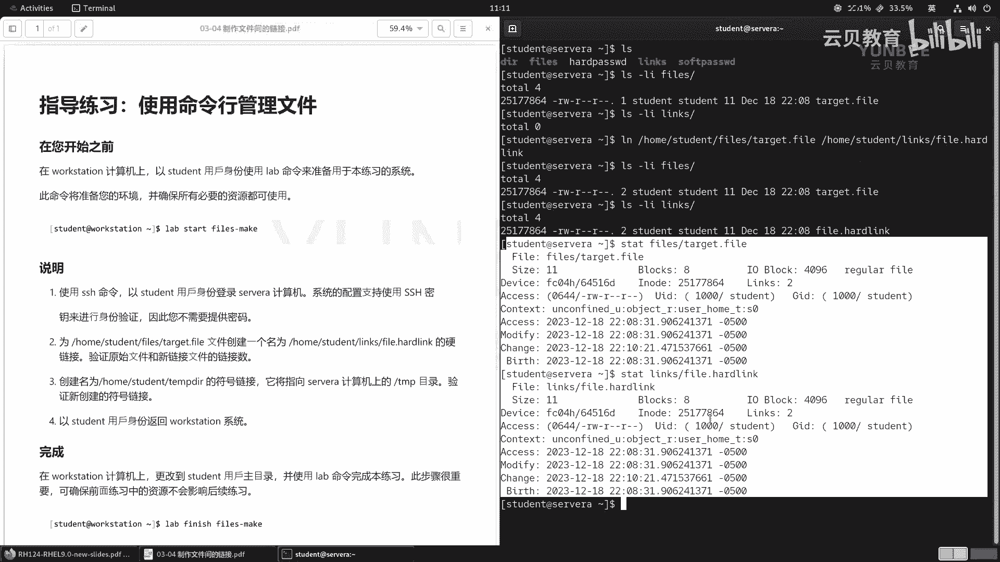
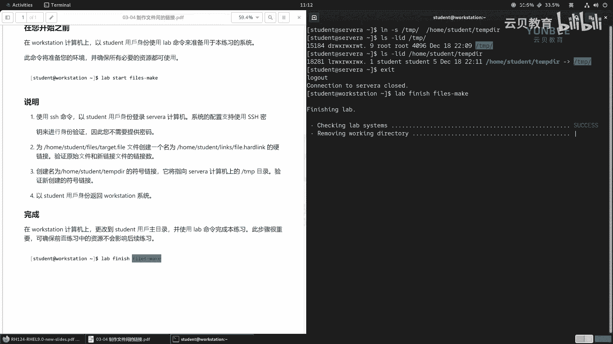

# Linux入门与红帽认证：P14：03.6：制作文件间的链接-实验

## 概述
在本节实验中，我们将通过实际操作来巩固关于文件链接的理论知识。我们将学习如何创建硬链接和符号链接，并验证它们的属性。

---



## 实验准备
上一节我们介绍了硬链接和符号链接的概念，本节中我们来看看如何通过实验来创建它们。



首先，需要登录到实验环境并启动实验脚本。

1.  以 `student` 用户身份登录到 `workstation`。
2.  执行以下命令启动实验：
    ```bash
    lab start files-make
    ```

实验脚本执行完毕后，终端界面会被清理。接下来，我们按照实验步骤进行操作。

---

## 实验步骤

### 第一步：登录到 servera
实验要求使用 SSH 命令，以 `student` 用户的身份登录到 `servera` 计算机。

以下是具体操作命令：
```bash
ssh servera
```
系统已预先配置好 SSH 密钥认证，因此无需输入密码即可登录。

登录成功后，我们将开始在 `servera` 上执行后续任务。

---

### 第二步：创建硬链接并验证
本步骤的任务是为指定文件创建一个硬链接，并验证原始文件和新链接文件的连接数。

首先，我们清理屏幕并查看目标目录。
```bash
ls -l
```
确认存在 `files` 目录后，查看目标文件的详细信息。
```bash
ls -li files/
```
命令输出显示 `files` 目录下存在 `target.file` 文件，其硬链接数量为 **1**，inode 编号为 **25177864**。

接着，检查 `links` 目录是否为空。
```bash
ls -l links/
```
确认 `links` 目录为空后，开始创建硬链接。由于涉及跨目录操作，建议使用绝对路径。
```bash
ln /home/student/files/target.file /home/student/links/file.hardlink
```
硬链接创建完成后，进行验证。

再次检查原文件的链接数，会发现其数量已变为 **2**。
```bash
ls -li files/target.file
```
同时，新目录下也增加了 `file.hardlink` 文件，其链接数同样是 **2**。
```bash
ls -li links/file.hardlink
```
可以使用 `stat` 命令对比两个文件的详细信息，会发现它们的 inode 编号、设备位置、时间戳等属性完全相同。两者之间仅有文件名和存储路径不同。

---



### 第三步：创建符号链接并验证
本步骤的任务是创建一个指向 `/tmp` 目录的符号链接，并验证其属性。



创建符号链接的命令如下：
```bash
ln -s /tmp /home/student/tmp.dir
```
创建完成后，使用 `ls -l` 命令验证新创建的符号链接。
```bash
ls -l /home/student/tmp.dir
```
输出显示，`tmp.dir` 是一个指向 `/tmp` 目录的符号链接。可以注意到，符号链接文件本身的 inode 与目标目录 `/tmp` 的 inode 是不同的。

---

### 第四步：返回 workstation 并完成实验
所有操作完成后，需要返回到 `workstation` 主机。

使用 `exit` 命令退出 `servera` 的 SSH 会话。
```bash
exit
```
返回 `workstation` 后，执行以下命令完成实验并清理环境。
```bash
lab finish files-make
```

---

## 总结
在本节实验中，我们一起学习了文件链接的实践操作。

我们完成了以下任务：
1.  使用 `ln` 命令创建了硬链接，并验证了硬链接共享 inode 的特性。
2.  使用 `ln -s` 命令创建了符号链接，理解了符号链接作为一个独立文件指向目标路径的特点。
3.  通过 `ls -li` 和 `stat` 命令查看了文件的链接数和 inode 信息，加深了对两种链接方式区别的理解。



通过这个实验，你应该能够熟练地在 Linux 系统中创建和管理硬链接与符号链接。