# Linux基础教程：14：wc统计命令、管道符、重定向操作、echo与sleep命令

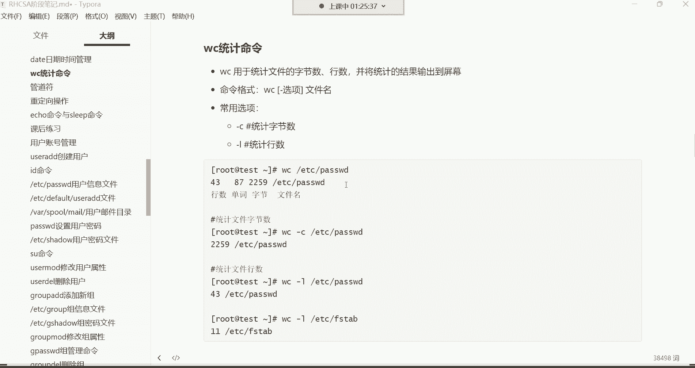

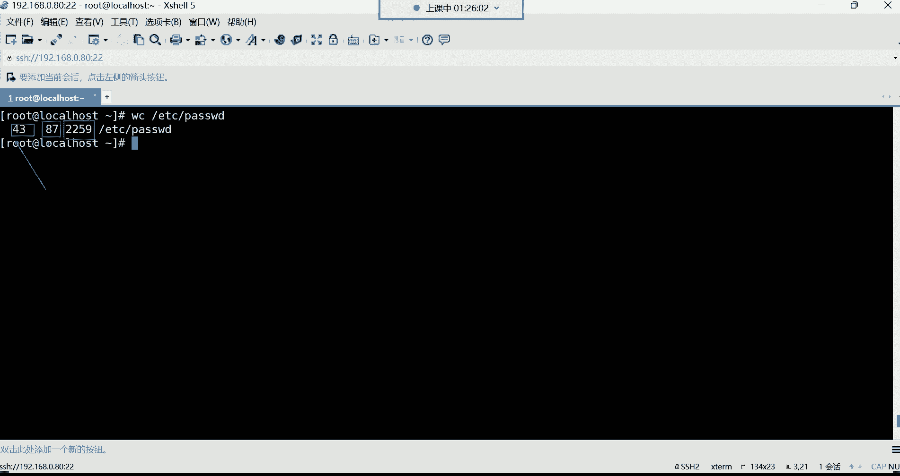

在本节课中，我们将要学习几个非常核心且实用的Linux命令与操作符。我们将从`wc`命令开始，学习如何统计文件信息；接着深入理解功能强大的管道符`|`；然后掌握重定向操作`>`、`>>`、`2>`等，它们能帮助我们控制命令的输出流向；最后，我们会了解`echo`和`sleep`这两个命令的基本用法及其应用场景。


## 📊 wc统计命令


`wc`命令用于统计文件中的行数、单词数和字节数，是日常工作中非常常用的工具。


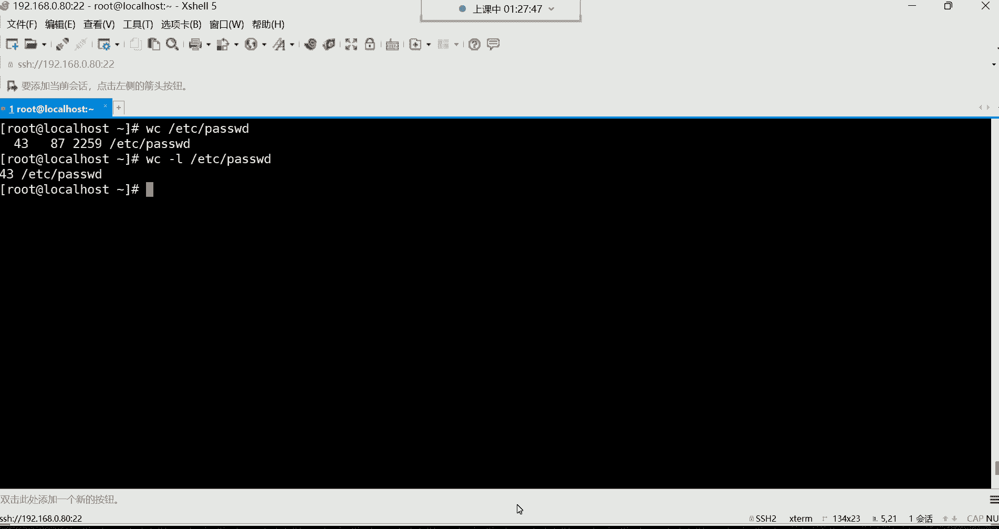


**命令格式**：
```bash
wc [选项] 文件名
```

**常用选项**：
*   `-l`：仅统计行数。
*   `-w`：仅统计单词数。
*   `-c`：仅统计字节数。

例如，统计`/etc/passwd`文件的总行数：
```bash
wc -l /etc/passwd
```
这条命令会输出文件的行数。对于初学者而言，最常用的功能就是使用`wc -l`来统计文件的行数。

## 🔗 管道符 `|`

管道符`|`是一个功能极其强大的操作符，它可以将前一个命令的输出结果，作为后一个命令的输入参数进行处理。


**核心概念**：`命令A | 命令B`
这意味着将`命令A`的输出，交给`命令B`去处理。

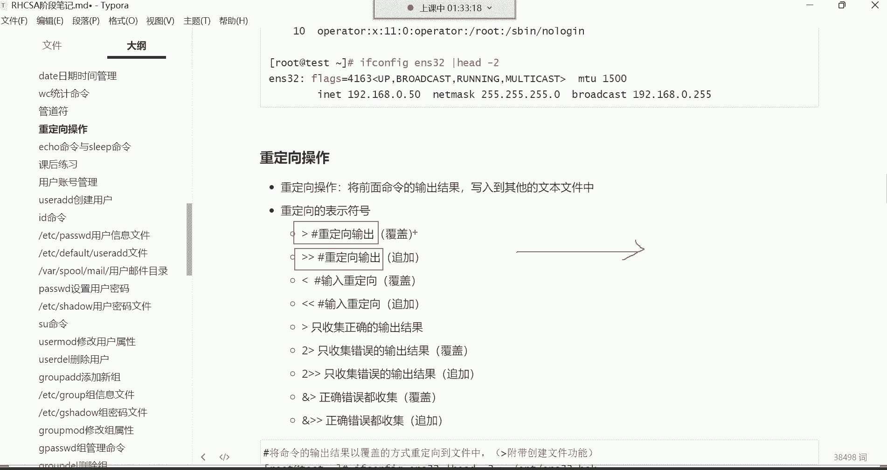

以下是管道符的一些应用示例：

*   **查看文件前十行中的后五行**：
    ```bash
    head -10 /etc/passwd | tail -5
    ```
    这条命令先获取文件的前十行，然后通过管道将结果传递给`tail -5`，最终只显示这十行中的最后五行。

*   **统计上述结果的行数**：
    ```bash
    head -10 /etc/passwd | tail -5 | wc -l
    ```
    我们在上一个管道的基础上，再增加一个管道，将结果传递给`wc -l`来统计行数，最终会输出数字`5`。

*   **查看网卡配置的前两行**：
    ```bash
    ifconfig ens32 | head -2
    ```
    这条命令先查看`ens32`网卡的详细信息，然后通过管道只显示其前两行，通常就是网卡名和IP地址。

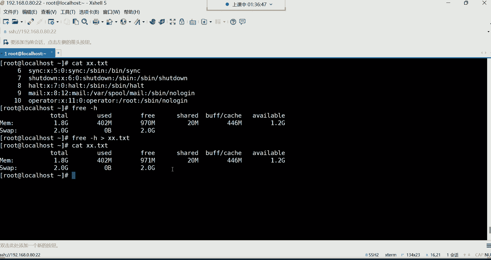

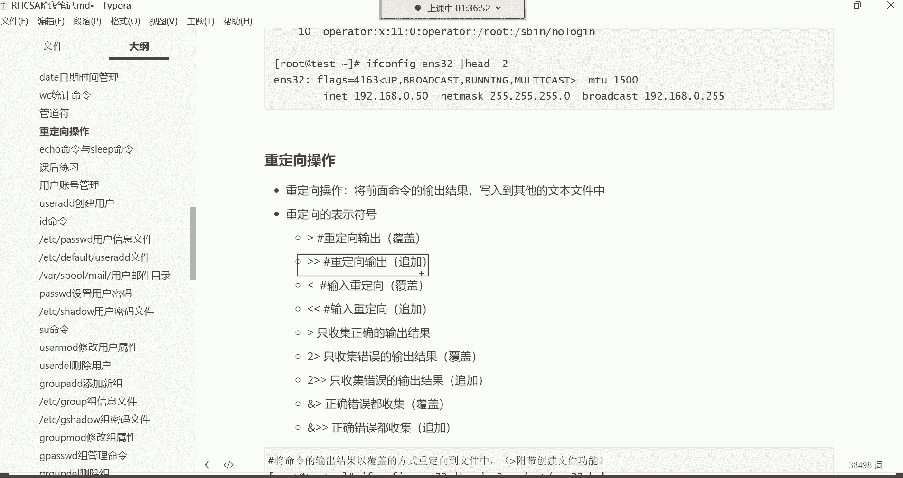

管道符允许你无限地连接多个命令，只要你有相应的需求，它就能组合出强大的功能。

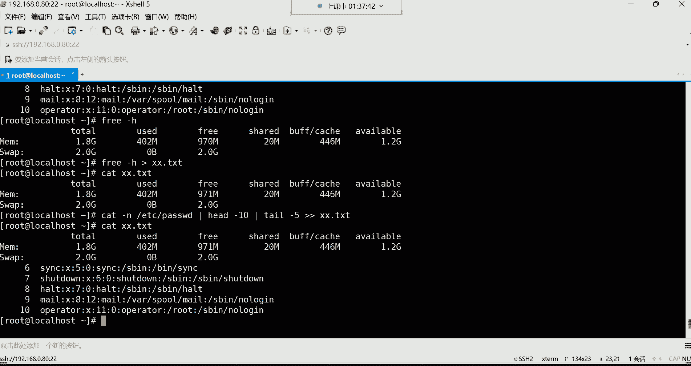

## 📥 重定向操作

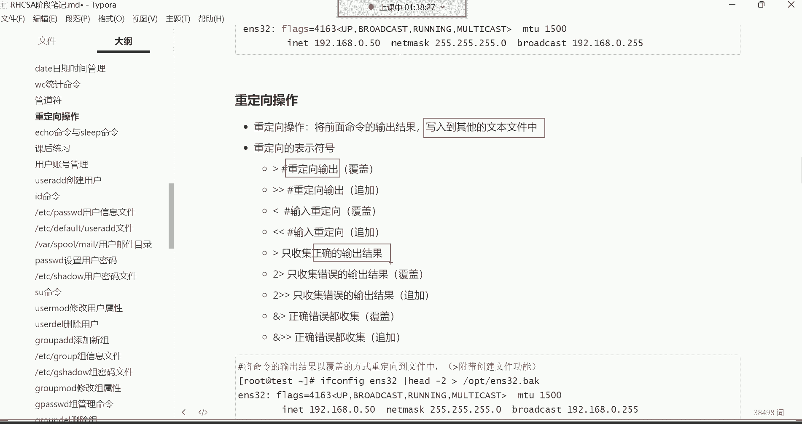

重定向操作可以控制命令的输出方向，将其导入到文件而不是显示在屏幕上。它主要通过大于号`>`和小于号`<`来实现。


### 输出重定向

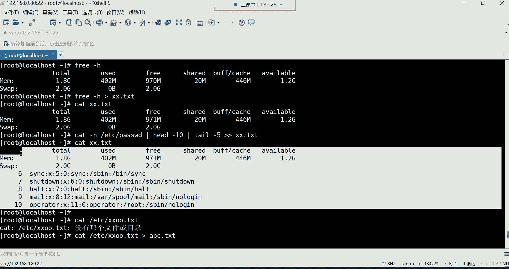

**1. 覆盖重定向 `>`**
将一个命令的**正确**输出结果覆盖写入到指定文件。如果文件不存在，则会创建它。
```bash
# 将 ifconfig ens32 的前两行结果保存到 net_ens32.txt 文件
ifconfig ens32 | head -2 > net_ens32.txt
```
执行后，屏幕没有输出，但`net_ens32.txt`文件中包含了命令的结果。如果再次执行不同的重定向命令到同一文件，原文件内容会被新内容覆盖。


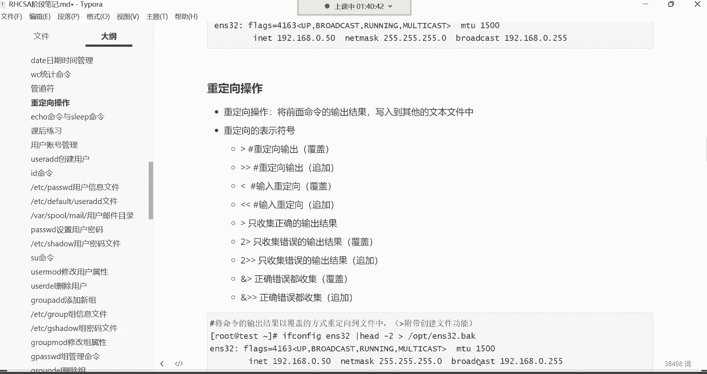

**2. 追加重定向 `>>`**
将一个命令的**正确**输出结果追加到指定文件的末尾，不会覆盖原有内容。
```bash
# 将 free -h 的结果追加到 net_ens32.txt 文件末尾
free -h >> net_ens32.txt
```
执行后，`net_ens32.txt`文件中既保留了原来的网卡信息，又在后面添加了内存信息。

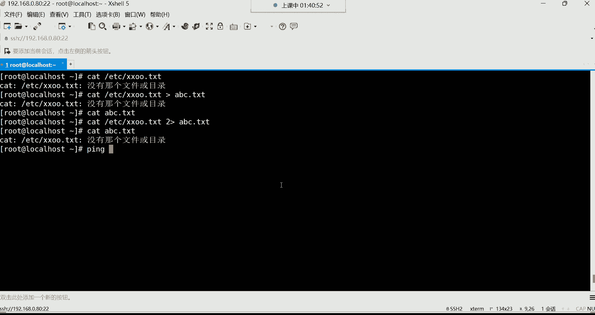

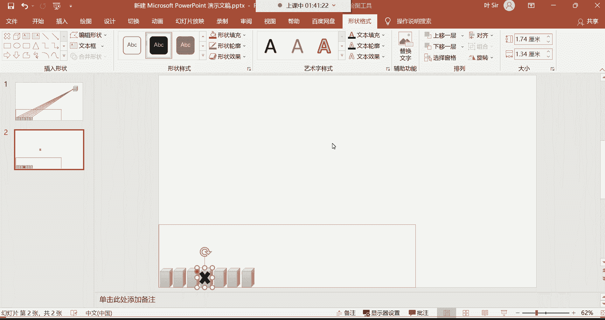

### 错误输出重定向

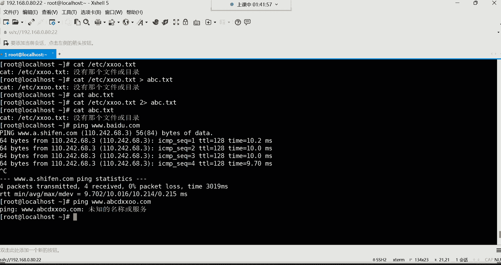

默认的重定向只收集命令执行成功的输出（标准输出）。对于执行失败的错误信息（标准错误输出），需要使用不同的符号。

**1. 覆盖错误输出 `2>`**
专门收集命令的**错误**输出结果，并覆盖写入文件。
```bash
# 尝试查看一个不存在的文件，并将错误信息保存到 error.log
cat /etc/nonexistent_file 2> error.log
```


**2. 追加错误输出 `2>>`**
专门收集命令的**错误**输出结果，并以追加方式写入文件。
```bash
# 再次执行一个错误命令，将错误信息追加到 error.log
ls /etc/abc 2>> error.log
```

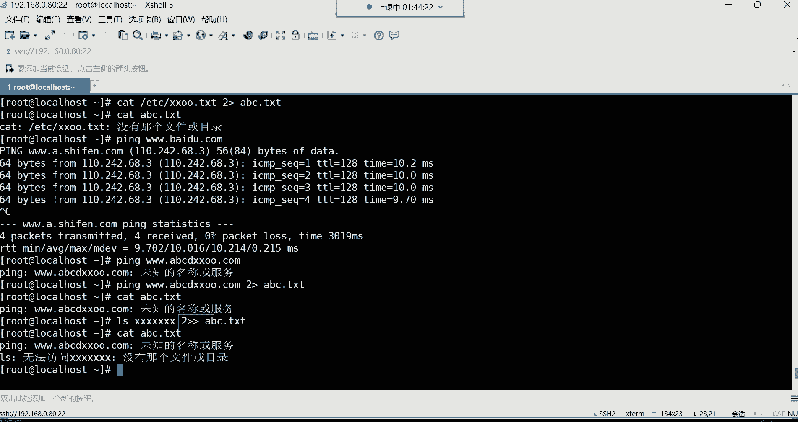

### 混合输出重定向


有时我们需要同时收集正确和错误的输出。

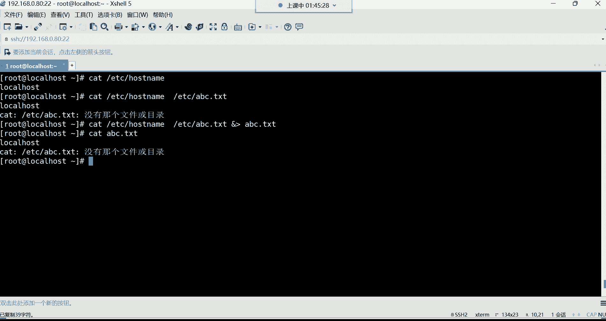

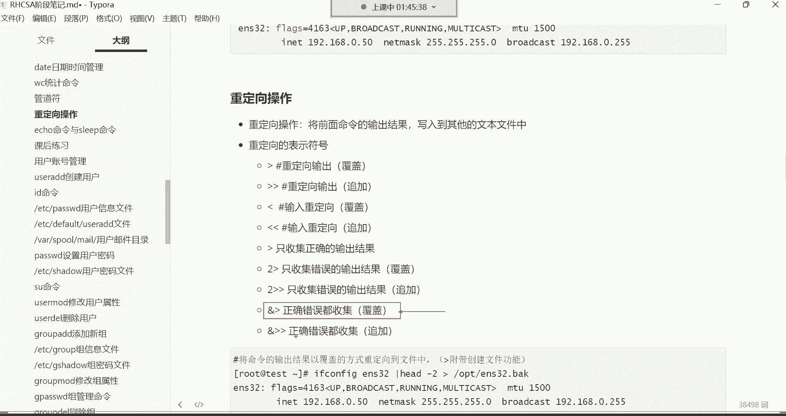

**1. 全部重定向（覆盖）`&>`**
无论命令执行正确还是错误，所有输出信息都会被覆盖写入到指定文件。
```bash
# 查看一个存在和一个不存在的文件，所有输出都保存到 all_output.log
cat /etc/hostname /etc/abc &> all_output.log
```

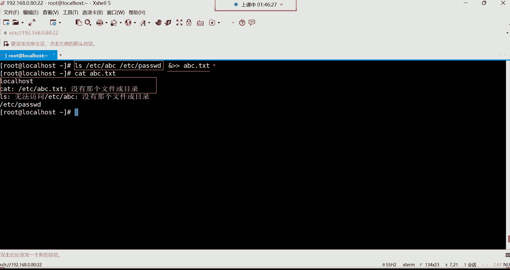

**2. 全部重定向（追加）`&>>`**
无论命令执行正确还是错误，所有输出信息都会以追加方式写入到指定文件。
```bash
# 再次执行命令，输出追加到 all_output.log
ls /etc/passwd /etc/xyz &>> all_output.log
```

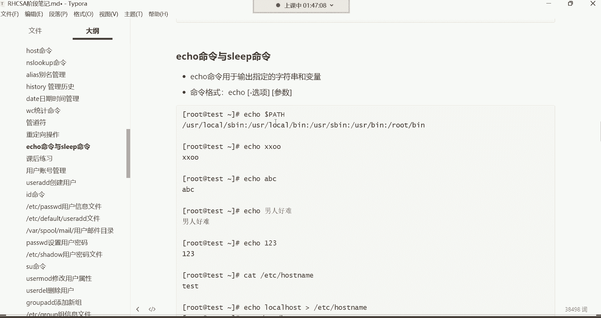

**应用场景**：例如，在后期编写脚本批量检测服务器是否在线时，我们可以使用`ping`命令。将能ping通的（正确输出）和不能ping通的（错误输出）分别或一起重定向到日志文件，便于后续分析。

## 💬 echo 命令

`echo`命令用于在终端输出指定的字符串或变量值。

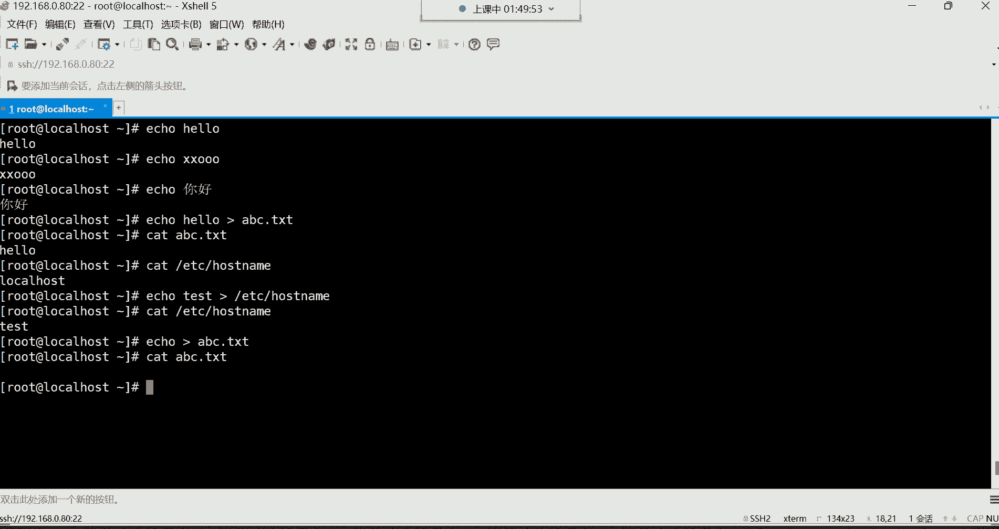

**命令格式**：
```bash
echo [字符串]
```
例如：
```bash
echo Hello World
```
这会在屏幕上输出`Hello World`。

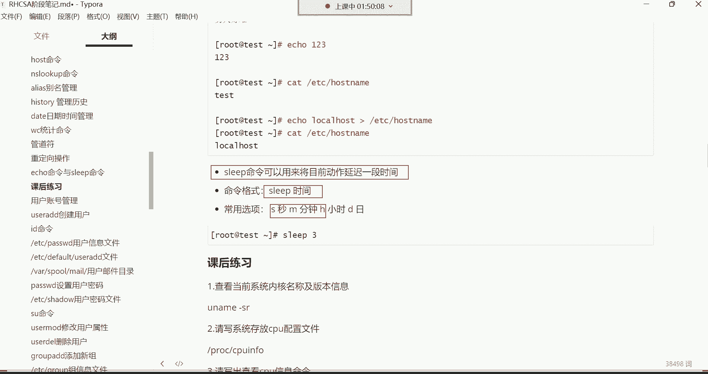

虽然直接使用`echo`看起来简单，但结合重定向，它可以方便地向文件写入内容或清空文件。
*   **向文件写入内容**：
    ```bash
    echo "new_hostname" > /etc/hostname
    ```
    这条命令会将字符串`new_hostname`写入（覆盖）到`/etc/hostname`文件中，常用于快速修改系统配置。
*   **清空文件内容**：
    ```bash
    echo "" > filename.txt
    # 或更常见的用法
    > filename.txt
    ```
    这会将一个空字符串写入文件，从而达到清空文件的效果。


## ⏳ sleep 命令

`sleep`命令用于使当前进程（或脚本）暂停（睡眠）一段时间。

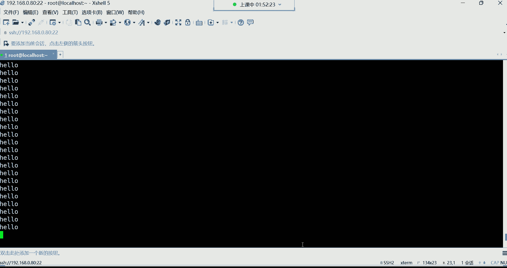

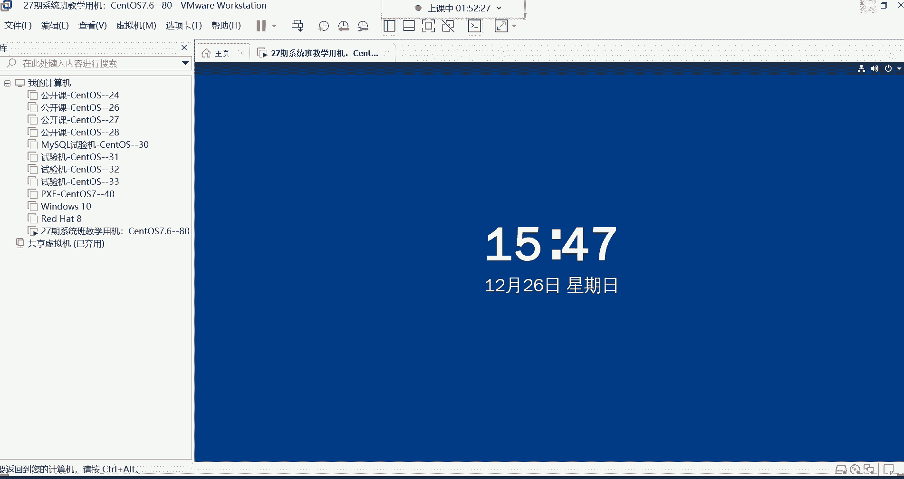

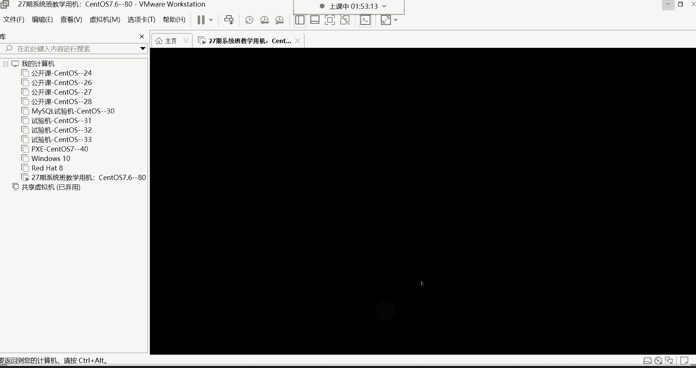

**命令格式**：
```bash
sleep 时间
```
**时间单位**：
*   `s`：秒（默认单位）
*   `m`：分钟
*   `h`：小时
*   `d`：天

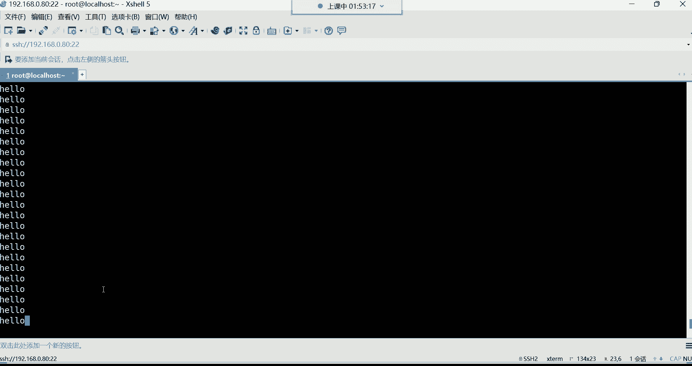


例如：
```bash
sleep 5    # 休眠5秒
sleep 1m   # 休眠1分钟
```

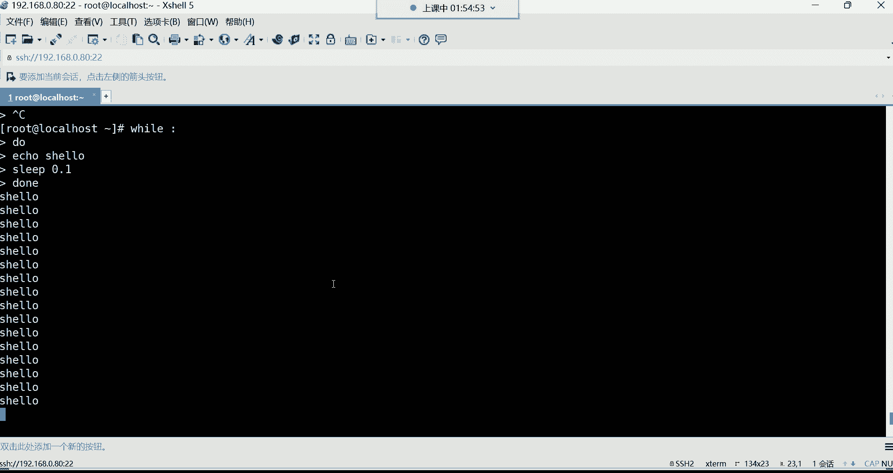

**应用场景**：在后期编写Shell脚本时，`sleep`命令非常有用。它可以控制命令执行的节奏，避免CPU因循环任务而过载。例如，在一个持续输出信息的循环中，每次循环后让CPU休息0.1秒，可以显著降低CPU使用率。
```bash
# 一个简单的演示：每秒输出一次Hello，共5次
for i in {1..5}; do
  echo "Hello"
  sleep 1
done
```

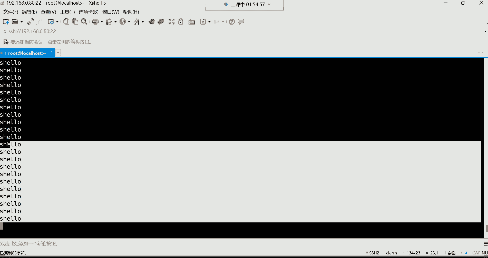

---

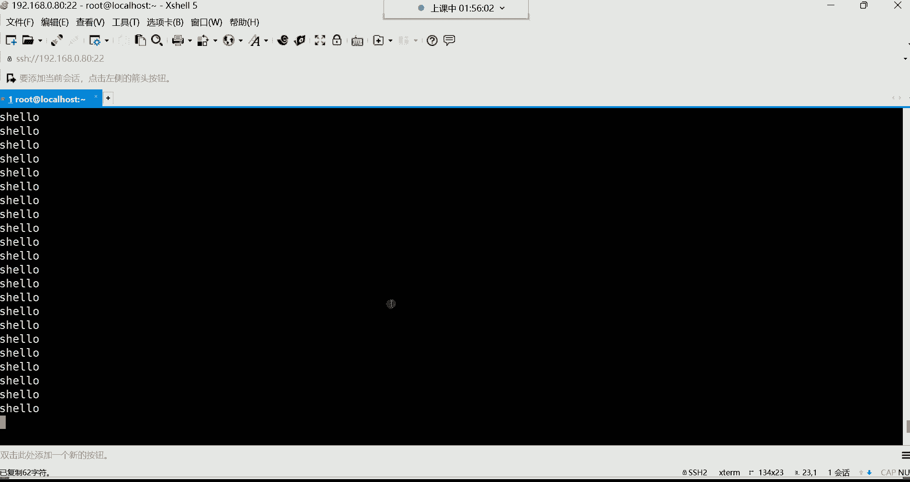

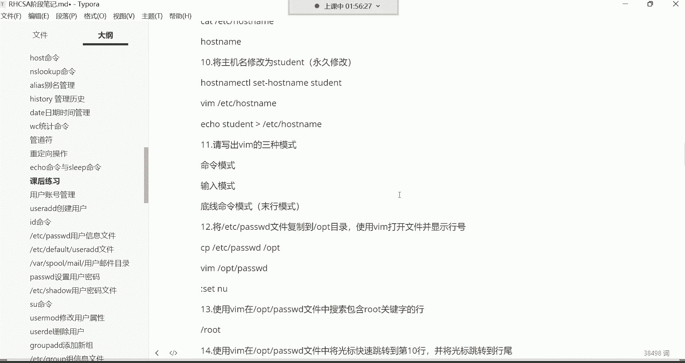

本节课中我们一起学习了`wc`、`echo`、`sleep`命令以及管道符`|`和各种重定向操作符`>`、`>>`、`2>`、`&>`等的用法。这些是Linux命令行中不可或缺的核心工具，熟练掌握它们将极大地提升你处理文本、控制数据流和编写自动化脚本的效率。