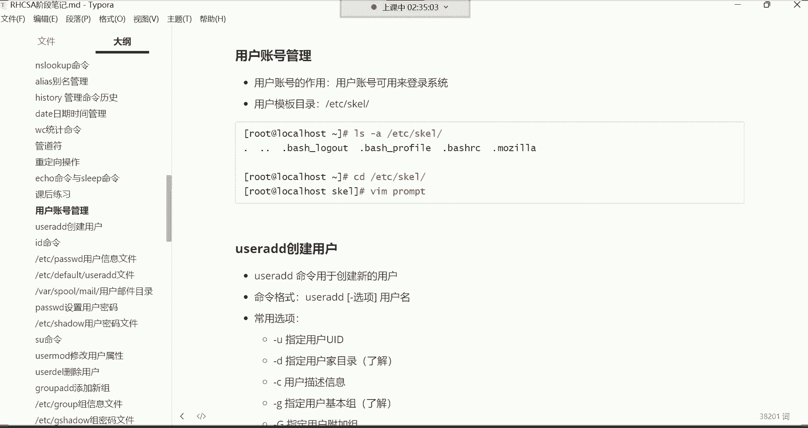
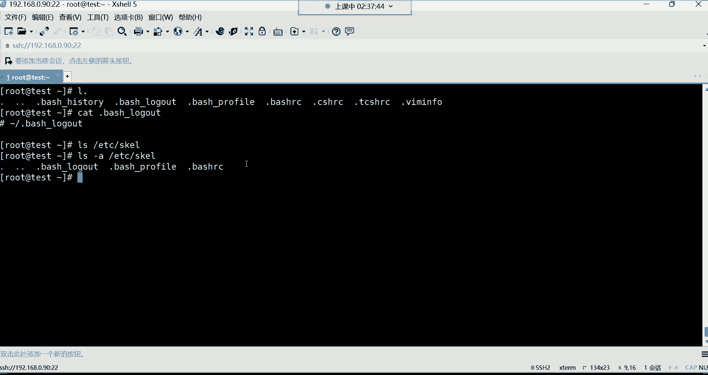
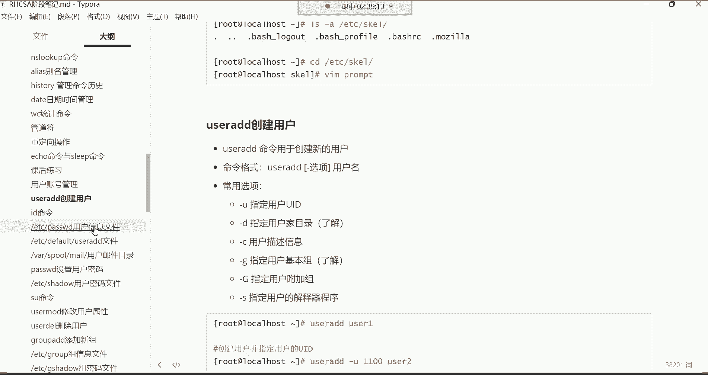
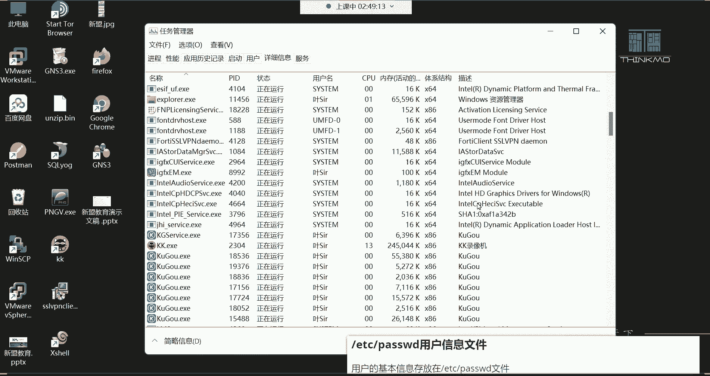
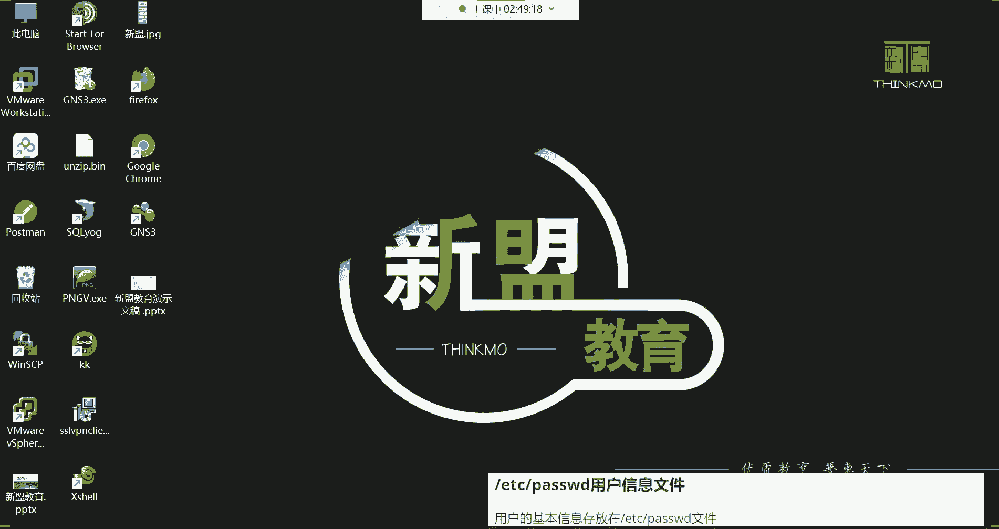
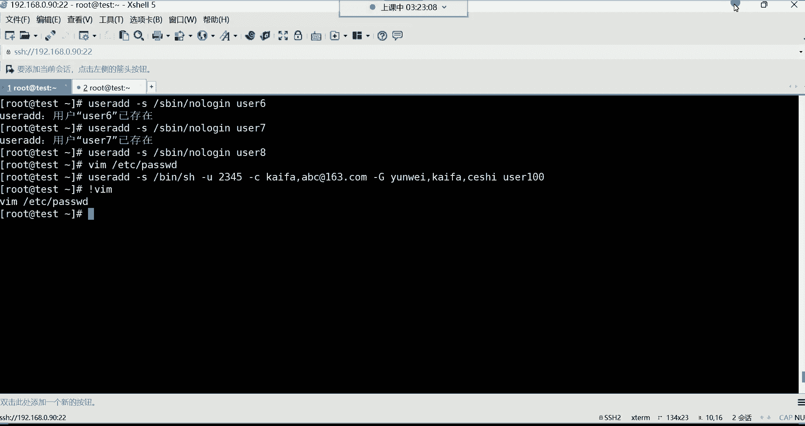
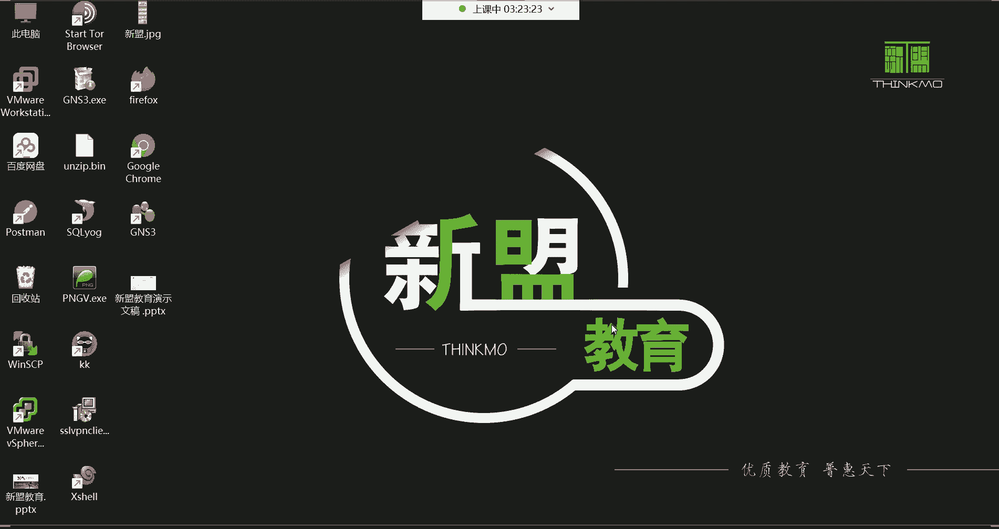

# Linux运维：P15：用户管理、用户信息文件详解 👤

在本节课中，我们将要学习Linux系统中的用户管理，包括用户账号的作用、分类，以及如何创建和管理用户。核心内容是深入解析存储用户信息的 `/etc/passwd` 文件，理解其每一列的含义。通过学习，你将掌握用户创建命令 `useradd` 的常用选项，并理解用户与组的基本概念。



## 用户账号概述

用户账号是登录系统所必需的凭证。在Linux系统中，用户主要分为两类：**超级管理员（root）** 和 **普通用户**。




超级管理员root拥有系统的最高权限，可以执行任何操作，包括删除整个系统。由于其权限过大，在企业环境中，root账号通常只分配给核心运维人员或部门领导，以避免因误操作导致系统故障。





普通用户由管理员创建，权限较小，用于日常操作，以减少对系统的潜在威胁。这就是为什么系统中需要存在普通用户。

## 用户的模板目录

在深入用户管理之前，我们先了解一个概念性目录：**用户的模板目录**。

这个目录是 `/etc/skel/`。它包含了当新用户被创建时，会自动复制到其家目录中的默认配置文件。

以下是查看该目录内容的命令：
```bash
ls -a /etc/skel/
```
你会看到一些以点（.）开头的隐藏文件，例如 `.bash_logout`、`.bash_history`、`.bash_profile`、`.bashrc` 等。

这些文件的作用是为新用户提供初始环境配置。例如，`.bashrc` 用于存放命令别名，`.bash_history` 用于记录用户输入的命令历史。你无需深入研究此目录，即使不知道它的存在，也不影响系统使用。


## 创建用户：useradd 命令



创建用户的命令是 `useradd`。**只有root超级管理员才有权限使用此命令。**




命令格式非常简单：`useradd [选项] 用户名`。例如，创建一个名为 `user1` 的用户：
```bash
useradd user1
```
用户名不能使用中文，必须使用英文命名。


用户创建后，需要为其设置密码才能登录系统。在设置密码前，我们首先需要了解用户信息存储在哪里。


## 用户信息文件：/etc/passwd 详解

用户的基本信息存储在 `/etc/passwd` 文件中。这个文件至关重要，如果被删除，所有用户（包括root）都将无法登录系统。

使用以下命令查看文件内容：
```bash
cat /etc/passwd
```
文件看起来可能有些杂乱，但它遵循严格的格式。

**文件结构解析：**
*   **每一行**代表一个用户的信息。
*   **每一行**以英文冒号 `:` 作为分隔符。
*   **每一行**总共有 **7** 个字段（或称为7列）。

接下来，我们详细解释这7列的含义。


### 第1列：用户名
这是用户登录时使用的名称。例如，`root`、`user1`。

### 第2列：密码占位符
这一列永远显示为 `x`。它只是一个标识符，并非真正的密码。用户的加密密码实际存储在 `/etc/shadow` 文件中。


### 第3列：用户ID (UID)
这是用户的唯一身份标识号，相当于身份证号。
*   **UID = 0**：代表**超级管理员**。注意，系统判断超级管理员的唯一标准是UID是否为0，而不是用户名是否为root。
*   **UID 1~999**：代表**系统伪用户**。这些用户真实存在，但**不能登录系统**。它们的作用是为系统进程或服务提供运行身份。例如，`bin`、`daemon` 用户。
*   **UID >=1000**：代表**普通用户**，由管理员手动创建。

### 第4列：基本组ID (GID)
这是用户**初始组**（或基本组）的ID号。创建用户时，系统会自动创建一个与用户名同名的组作为其基本组。一个用户有且只有一个基本组。

### 第5列：描述信息
这是用户的备注信息，可以为空。类似于给好友添加的备注，可以填写用户所属部门、联系方式等，方便管理。

### 第6列：家目录
这是用户登录系统后所在的初始目录。例如，root用户的家目录是 `/root`，普通用户 `user1` 的家目录通常是 `/home/user1`。


### 第7列：解释器程序
这是用户登录系统后使用的命令解释器（Shell）。默认是 `/bin/bash`，它是一个功能强大的标准解释器，负责将用户输入的命令“翻译”给系统内核执行。


还有一个特殊的解释器 `/sbin/nologin`，它的作用是**禁止用户登录系统**。系统伪用户通常使用此解释器。

## useradd 命令的常用选项


`useradd` 命令支持许多选项，用于在创建用户时指定其属性。以下是常用的选项：

*   **`-u UID`**：指定用户的UID。
    ```bash
    useradd -u 6666 user6
    ```

*   **`-d 目录路径`**：指定用户的家目录。
    ```bash
    useradd -d /myhome/user3 user3
    ```

*   **`-c “描述信息”`**：添加用户的描述信息（备注）。
    ```bash
    useradd -c “运维部，电话：xxx” user2
    ```

*   **`-G 组名1,组名2,...`**：指定用户的**附加组**。用户可以被加入到多个附加组，从而继承这些组对文件的权限。
    ```bash
    useradd -G dev,test user5
    ```

*   **`-s Shell路径`**：指定用户的解释器。
    ```bash
    useradd -s /sbin/nologin user8 # 创建不能登录的用户
    ```

这些选项可以组合使用，没有严格的先后顺序要求：
```bash
useradd -u 2345 -c “开发部” -G ops,dev -s /bin/bash user100
```

## 查看用户和组信息：id 命令


创建用户后，可以使用 `id` 命令查看用户及其所属组的信息。
```bash
id username
```
例如，`id user1` 会显示该用户的UID、基本组GID以及所属的所有组（基本组和附加组）。


---






本节课中我们一起学习了Linux用户管理的基础知识。我们了解了用户账号的分类与作用，深入剖析了核心文件 `/etc/passwd` 的7列结构及其含义。同时，我们掌握了使用 `useradd` 命令创建用户及其常用选项，并学会了使用 `id` 命令查看用户信息。理解用户与组的关系是后续学习文件权限管理的基础。对于初学者，重点在于理解 `/etc/passwd` 文件结构和 `useradd` 的基本用法，多练习即可熟能生巧。