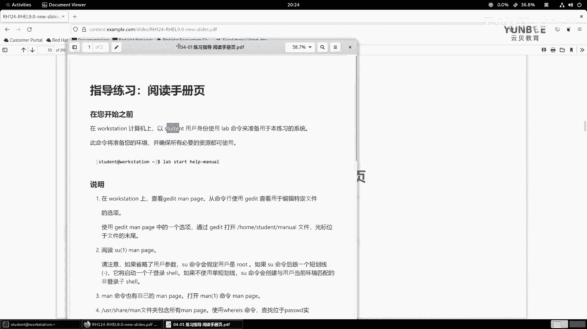
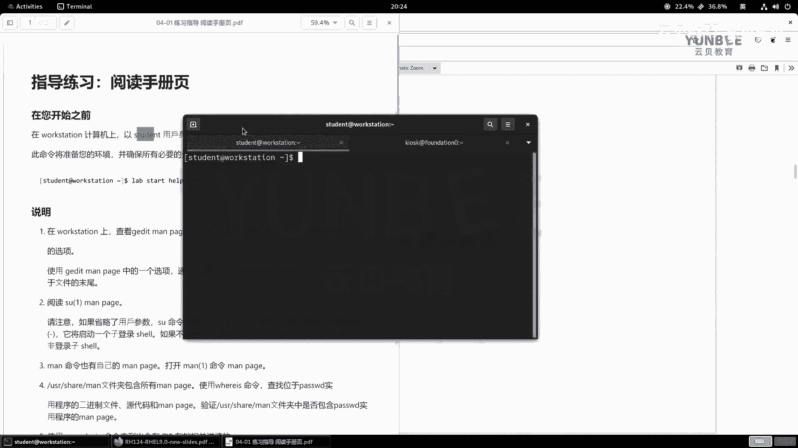
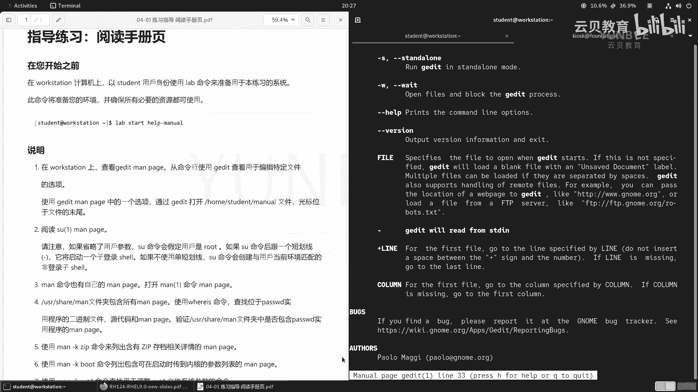
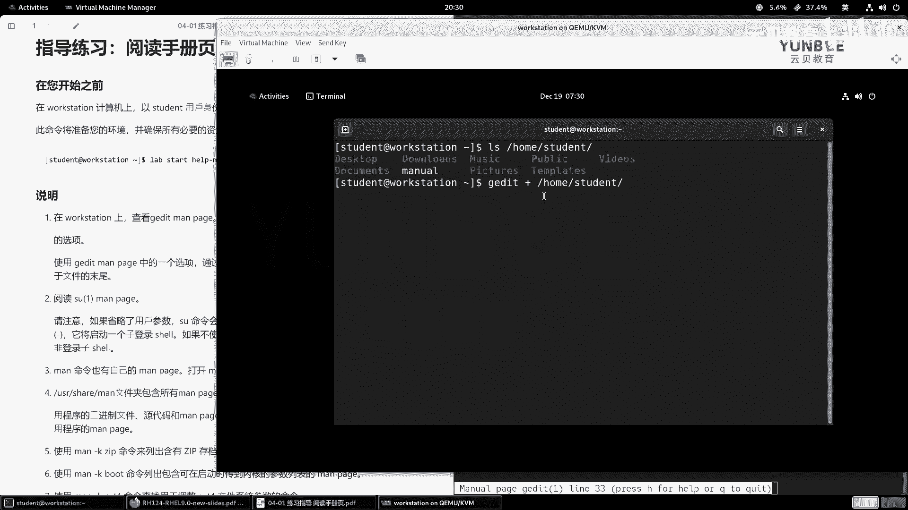
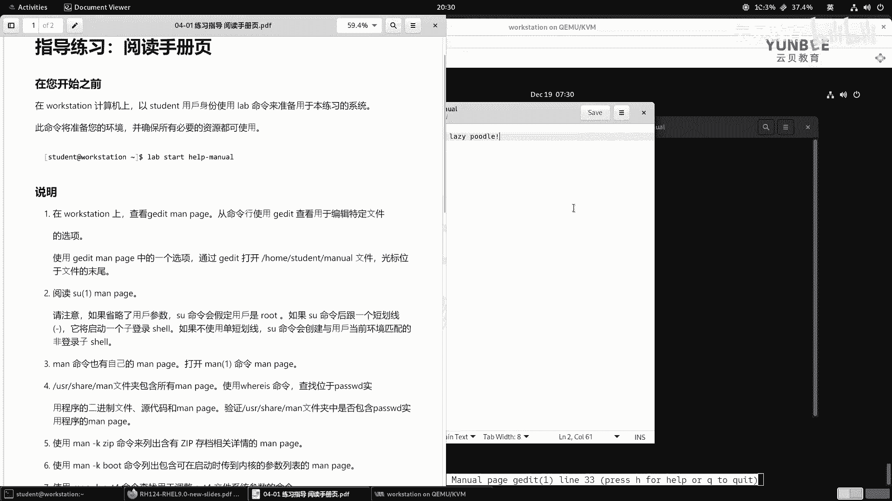
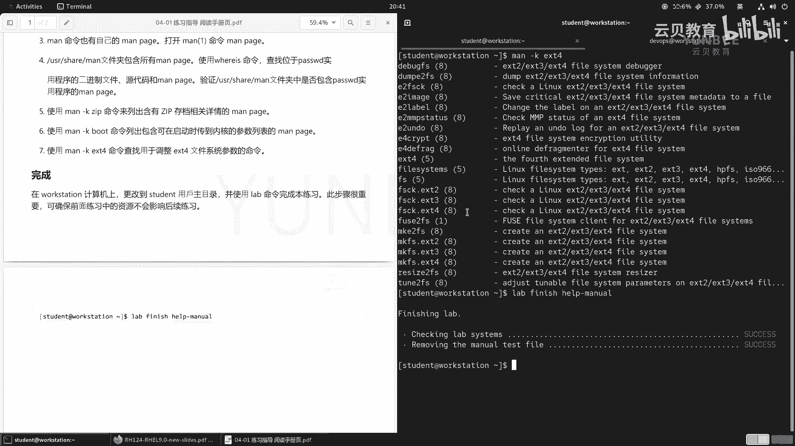

# Linux入门与红帽认证：04.2：阅读Man Page实验 🧪

在本节课中，我们将通过一个实验来学习如何阅读和使用Linux的`man`手册页。`man`手册是Linux系统中最重要的帮助工具之一，掌握它对于理解和使用命令至关重要。





---

## 实验准备

上一节我们介绍了`man`命令的基本概念，本节中我们来看看如何在实际操作中应用它。

首先，我们需要登录到实验环境。按照要求，在`workstation`节点上以`student`用户身份执行以下命令来启动实验：

```bash
lab start-help-man
```

命令执行成功后，实验环境即准备就绪。

---

## 实验步骤



以下是本次实验需要完成的具体任务。


### 1. 查看gedit的man手册

第一步要求我们查看文本编辑器`gedit`的man手册。我们使用`man`命令后跟程序名来查看。

```bash
man gedit
```

在打开的man手册中，“NAME”部分概述了`gedit`是GNOME桌面环境的官方文本编辑器，这意味着它需要图形界面支持。“SYNOPSIS”部分说明了其基本用法：`gedit [选项] [文件] [+行[:列]]`。其中，`+`号用于指定打开文件后光标定位的行数，如果`+`后为空（即`+`），则光标会定位在文件末尾。

现在，我们打开图形界面，并使用`gedit`打开`/home/student/manual`文件，并将光标定位在文件末尾。

```bash
gedit + /home/student/manual
```

执行后，`gedit`会启动并打开指定文件，光标将位于文件最后一行的行尾。



### 2. 阅读su命令的man手册

接下来，我们阅读`su`命令的man手册。`su`命令用于切换用户身份来执行命令。

```bash
man su
```



手册指出，`su`命令的基本格式是`su [选项] [用户]`。如果不指定用户，默认会切换到`root`用户。手册还特别说明，为了兼容性，`su`在切换用户时会更改家目录并设置环境变量。因此，推荐使用`--login`选项或其简写`-`来完整切换用户环境。例如：

```bash
su - root
```
这种方式比直接输入`su`更安全，能确保环境变量正确加载。

### 3. 查看man命令自身的man手册

`man`命令也有自己的手册页，它详细说明了man手册的章节划分。

```bash
man man
```

手册列出了各个章节的含义：
*   **第1章**：用户命令（可执行程序或shell命令）。
*   **第2章**：系统调用（由内核提供的函数）。
*   **第3章**：库函数（程序库中的函数）。
*   **第4章**：特殊文件（通常位于`/dev`目录下）。
*   **第5章**：文件格式和约定（例如`/etc/passwd`的语法）。
*   **第6章**：游戏。
*   **第7章**：杂项（包括宏包和约定等）。
*   **第8章**：系统管理命令（通常需要`root`权限）。
*   **第9章**：内核例程（非标准章节）。

了解这些章节有助于我们更精确地查找信息。

### 4. 使用whereis查找文件位置

`whereis`命令用于定位一个命令的二进制文件、源代码和man手册页的位置。

```bash
whereis passwd
```

执行后，命令会显示`passwd`命令的二进制文件路径（如`/usr/bin/passwd`）、配置文件路径（如`/etc/passwd`）以及man手册页的路径。

### 5. 使用man -k进行关键字搜索

`man -k`命令可以根据关键字在man手册的描述中搜索相关命令。这一步要求我们查找与“zip存档”相关的命令。

```bash
man -k zip
```

命令会列出所有描述信息中包含“zip”的手册页。从输出中，我们可以找到诸如`zip`（创建压缩包）、`unzip`（解压缩包）等与zip存档操作相关的命令。

### 6. 搜索与系统启动相关的参数

接下来，我们搜索可以在系统启动时传递给内核的参数列表。

```bash
man -k boot
```

在输出结果中，我们可以找到名为`bootparam`的手册页，它详细介绍了启动时可用的一系列内核参数。

### 7. 查找调整ext4文件系统的命令

最后，我们查找用于调整ext4文件系统参数的专用命令。

```bash
man -k ext4
```

在列出的结果中，`tune2fs`命令就是专门用来调整ext4（及ext2/ext3）文件系统参数的。

---

## 实验收尾

完成所有步骤后，使用以下命令结束实验：

```bash
lab finish-help-man
```

---

## 总结



本节课中我们一起学习了如何通过实验来熟练使用`man`手册。我们实践了如何查看特定命令（如`gedit`、`su`）的手册，了解了man手册的章节结构，并掌握了使用`whereis`定位命令文件和使用`man -k`进行关键字搜索的技巧。这些技能是高效使用Linux命令行的基础，务必多加练习。