# Linux入门与红帽认证：04.3：使用GNU Info 📖

在本节课中，我们将要学习一个在Linux系统中获取帮助的重要工具——GNU Info。虽然`man`手册页是大家最熟悉的帮助文档，但GNU Info提供了另一种格式的帮助信息，尤其适用于由GNU项目开发的软件。本节将介绍GNU Info的基本概念、使用方法以及它与`man`手册的区别。

## 概述：GNU Info是什么？

在Linux系统中，`man`手册页内容丰富，格式正式，主要介绍特定命令或功能，每个文档都是独立的。然而，许多Linux软件是由GNU项目开发的，它们拥有自己的帮助文档系统，即GNU Info。

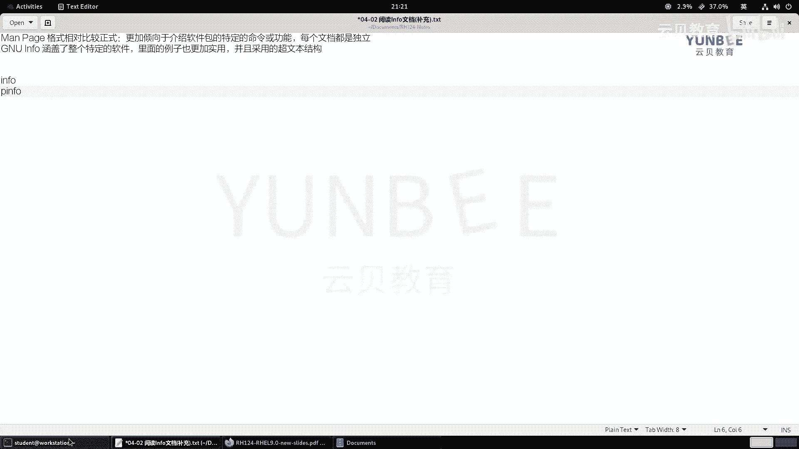

GNU Info文档涵盖了整个软件包的相关信息，结构上采用超文本链接，浏览起来更加方便，并且其中的示例通常更为实用。因此，了解GNU Info可以作为`man`手册的有效补充。

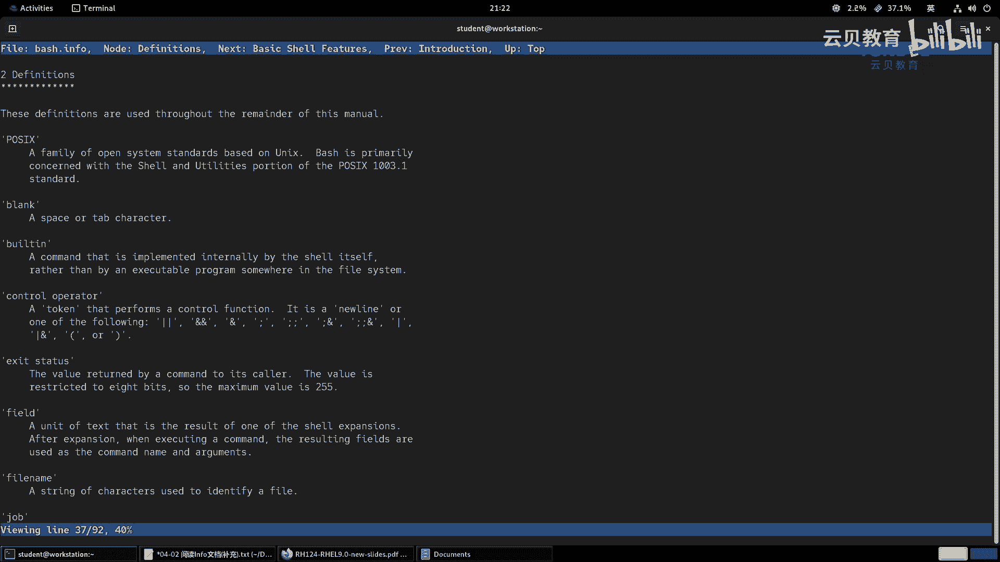

## 使用GNU Info的命令

要使用GNU Info，主要有两个命令：`info`和`pinfo`。它们的功能相同，主要区别在于用户界面。

*   **`info`命令**：提供一个普通的文本界面。
*   **`pinfo`命令**：提供一个基于文本的浏览器界面，支持彩色显示，超链接部分通常为蓝色，高亮部分为红色，视觉上更清晰。

你可以根据个人喜好选择使用哪个命令。它们的语法结构很简单：

```bash
info [主题]
```
或
```bash
pinfo [主题]
```

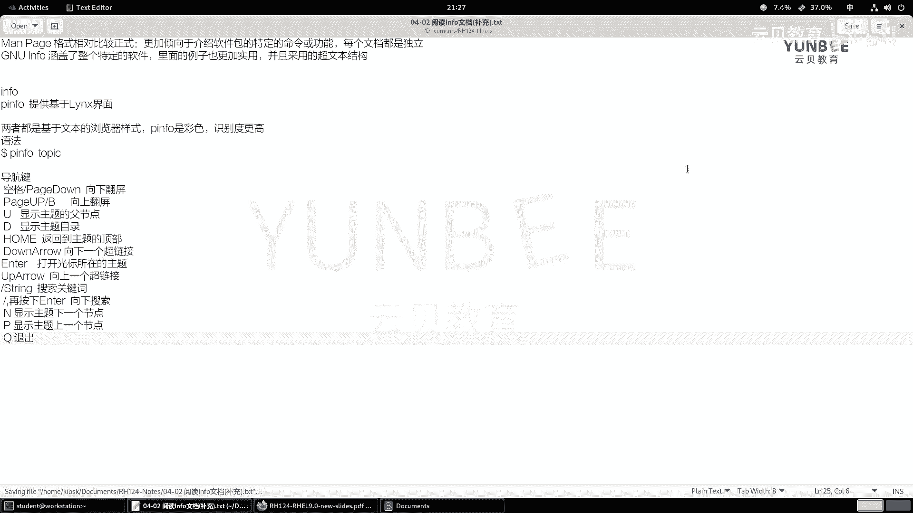

## GNU Info的导航按键

上一节我们介绍了如何启动GNU Info，本节中我们来看看如何在Info文档中进行浏览。以下是常用的导航按键：

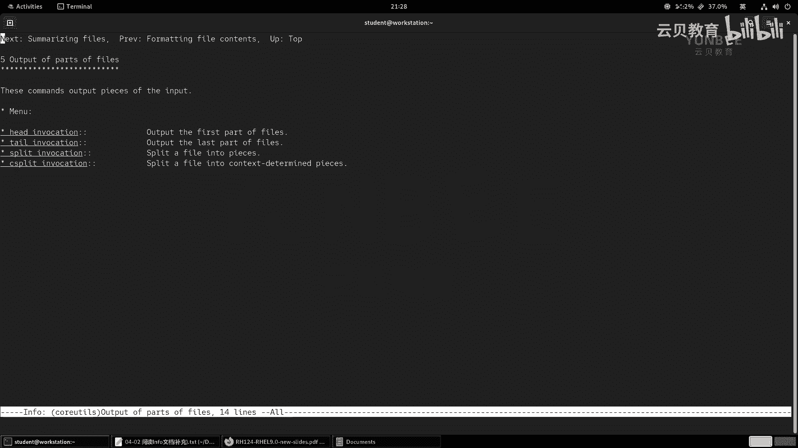

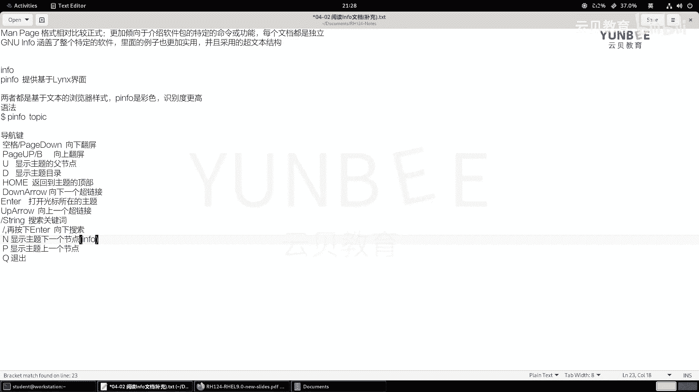

*   **翻页**：使用`空格键`或`Page Down`向下翻屏；使用`Page Up`或`b`键向上翻屏。
*   **节点导航**：按`u`键显示当前主题的父节点；按`d`键显示主题的目录。
*   **光标移动**：使用`上方向键`和`下方向键`在超链接间移动。
*   **打开主题**：将光标移动到超链接上，按`回车键`即可打开对应的主题页面。
*   **搜索**：按`/`键，然后输入关键词，按`回车`开始搜索。按`n`键可以继续向下搜索相同关键词。
*   **节点切换**：按`n`键显示主题的下一个节点；按`p`键显示主题的上一个节点。
*   **其他**：按`Home`键返回页面顶部；按`q`键退出Info浏览器。

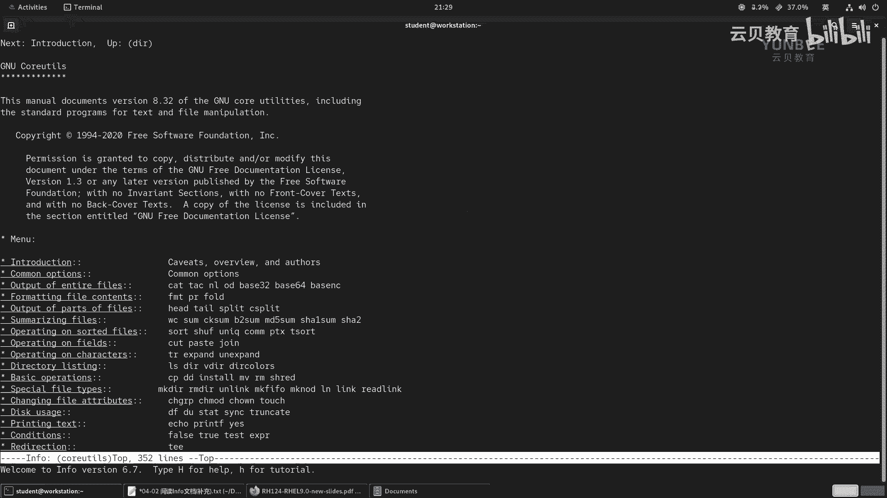

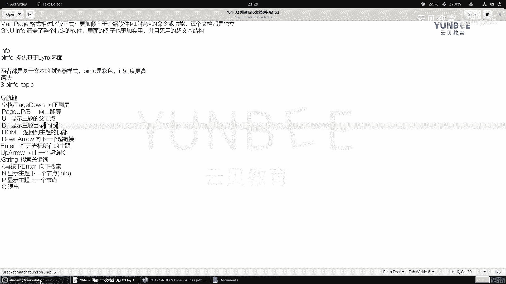

## 实战演示

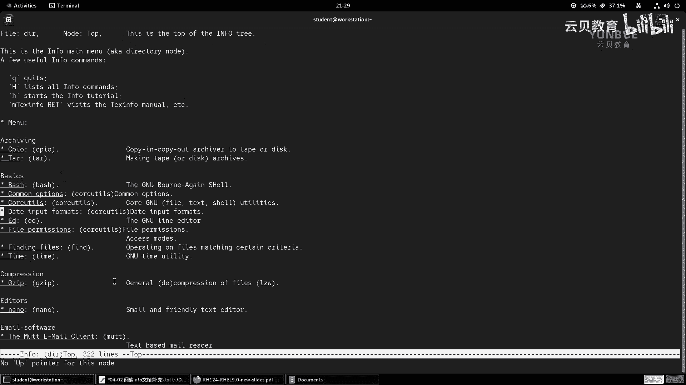

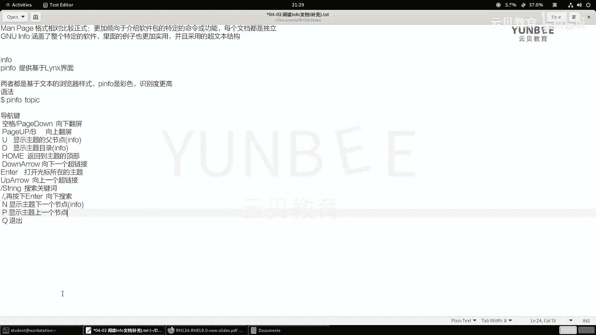

现在，让我们通过一个简单的例子来熟悉GNU Info的操作。

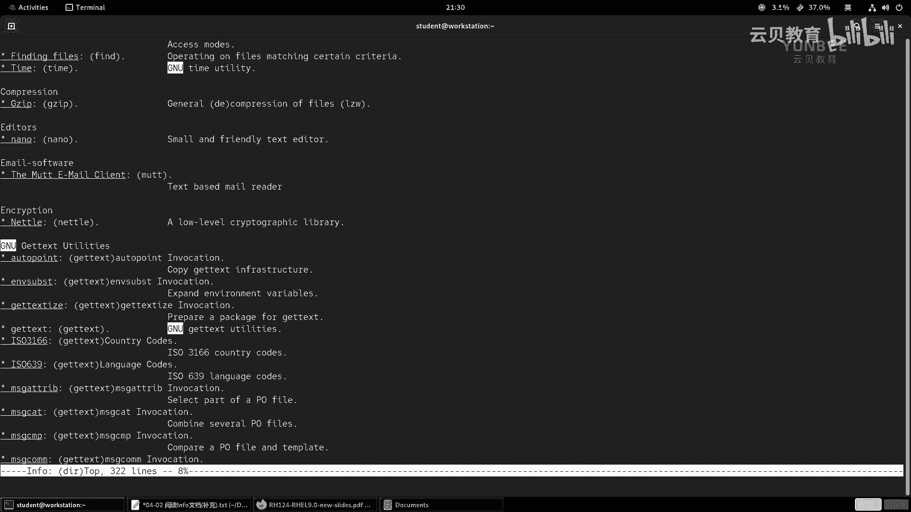

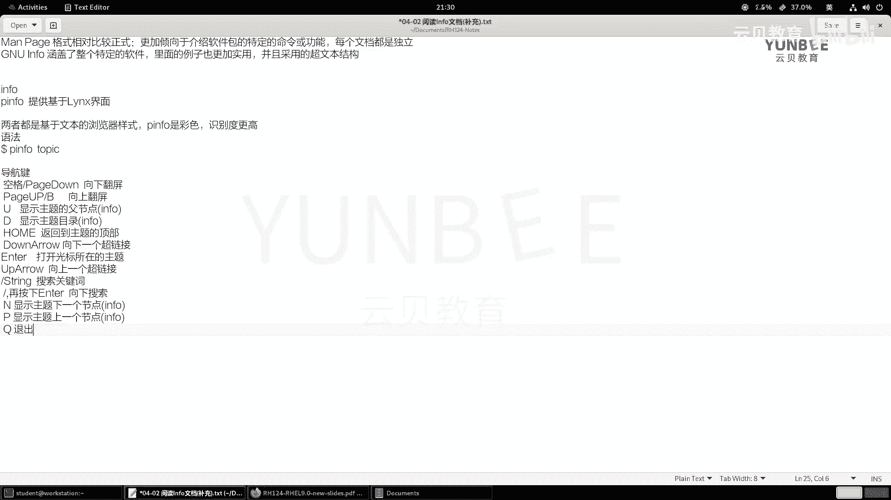

1.  首先，我们使用`pinfo`命令打开Info浏览器：
    ```bash
    pinfo
    ```
2.  进入后，使用`下方向键`移动光标，例如找到并选中“GNU Coreutils”这个主题，按`回车键`进入。
3.  在页面中，可以使用`空格键`向下翻页阅读。
4.  如果想查看当前页面的父节点，可以按`u`键返回。
5.  如果想直接跳转到顶级目录，可以按`d`键。
6.  在浏览时，可以按`/`键，输入“cpio”进行搜索，然后按`回车`。找到结果后，将光标移动到对应链接上，按`回车`即可查看详细内容。
7.  阅读完毕后，按`q`键即可退出Info浏览器。

通过这些操作，你可以像浏览网页一样，在GNU Info中查阅结构化的帮助文档。

## 总结

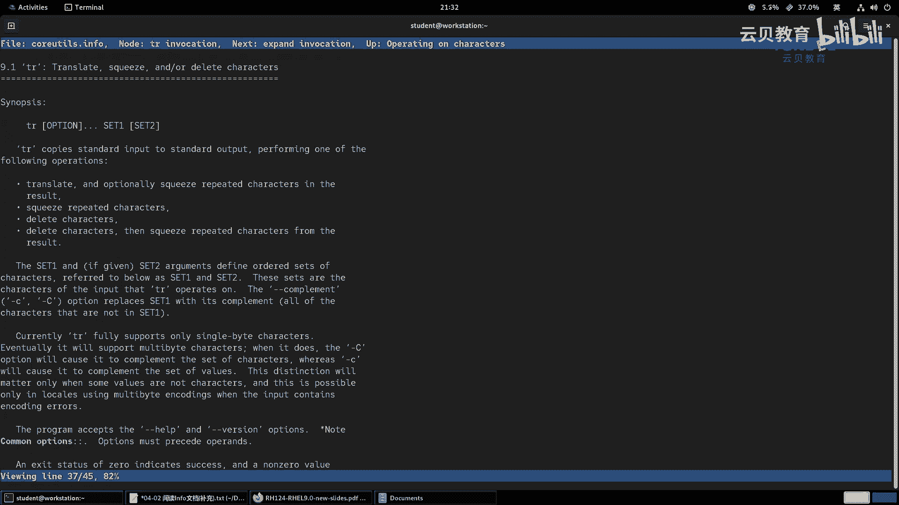

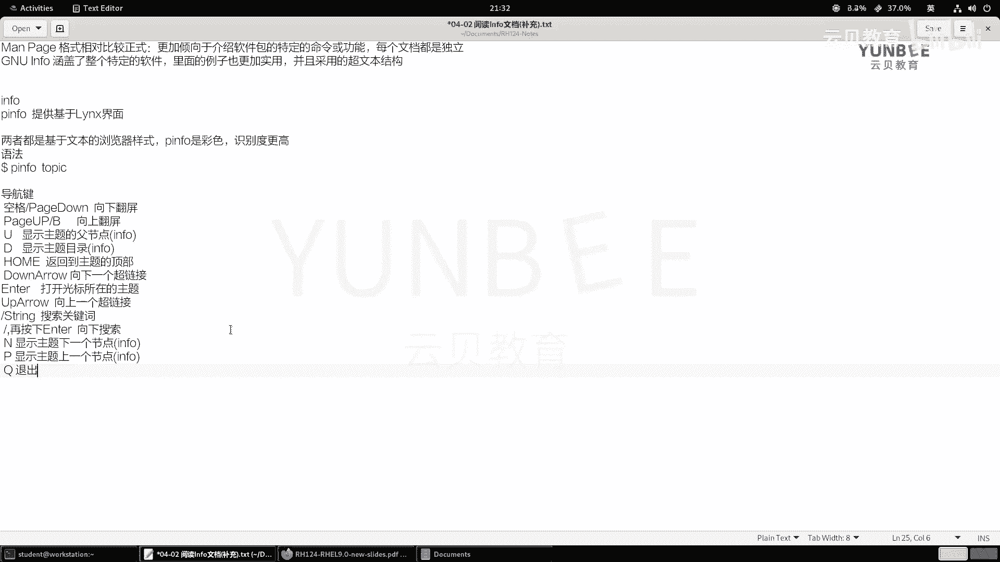

本节课中我们一起学习了GNU Info帮助系统。我们了解到，GNU Info是`man`手册页的重要补充，特别适用于GNU软件。我们学习了使用`info`和`pinfo`命令来查看帮助，并掌握了在Info文档中进行翻页、节点跳转和内容搜索的基本导航方法。虽然日常使用`man`可能更频繁，但在需要查阅更结构化、示例更丰富的GNU软件文档时，GNU Info是一个非常有用的工具。