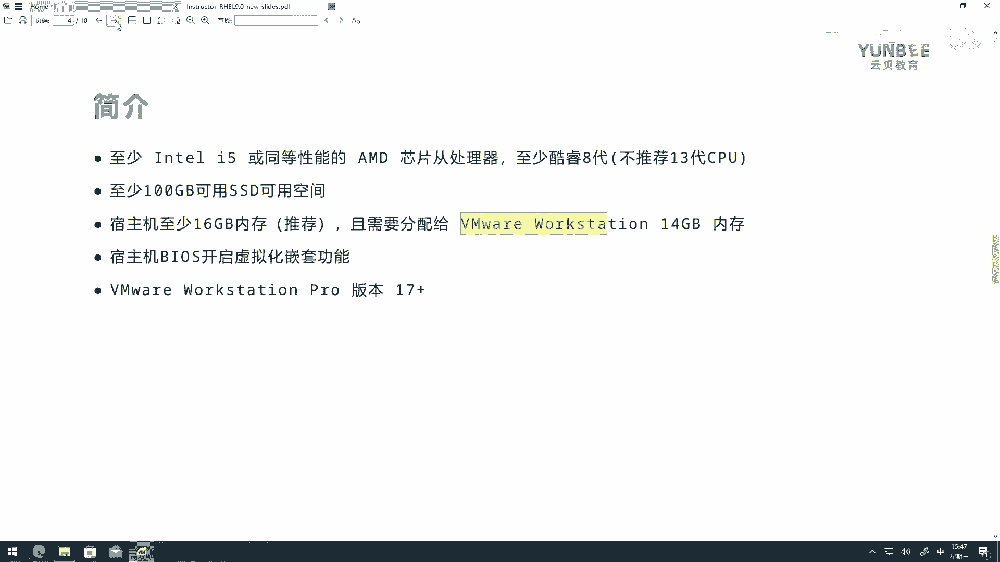
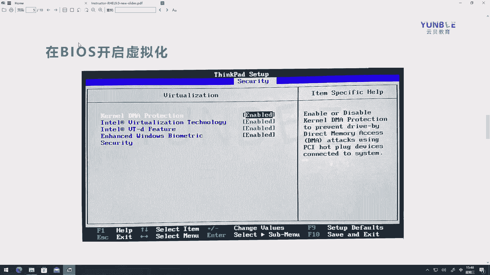
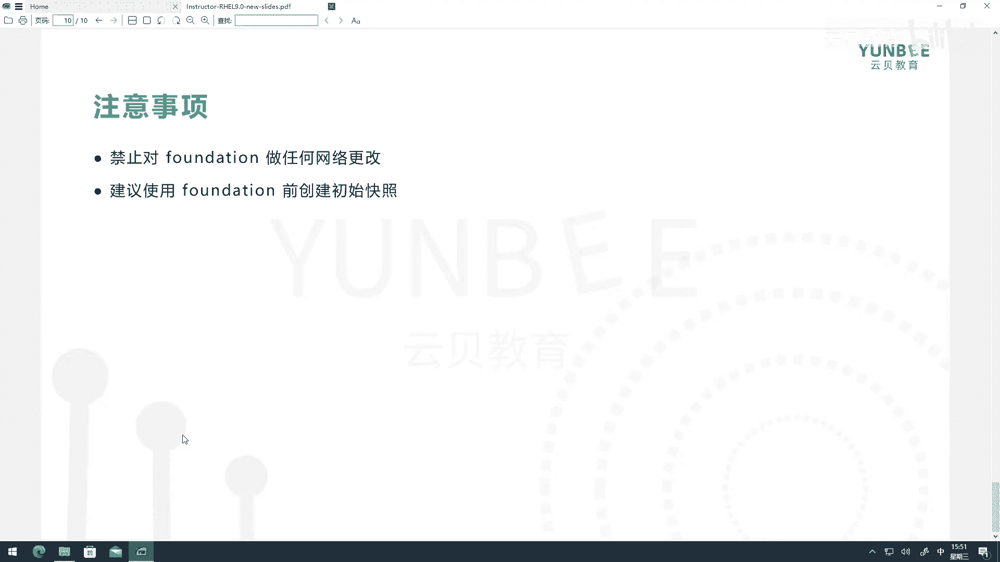
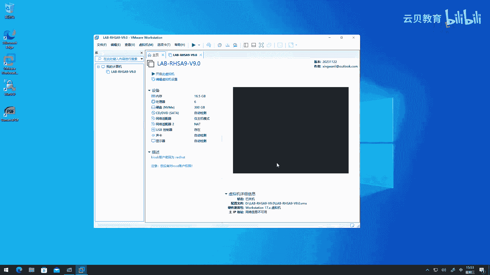
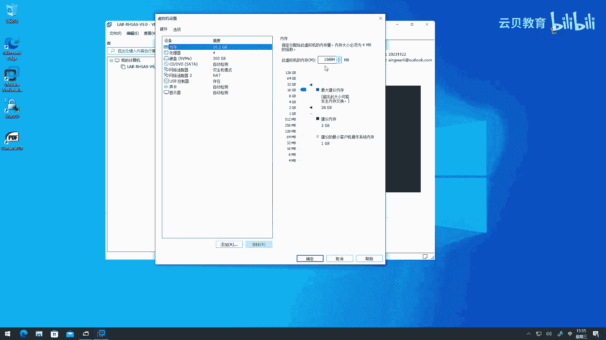
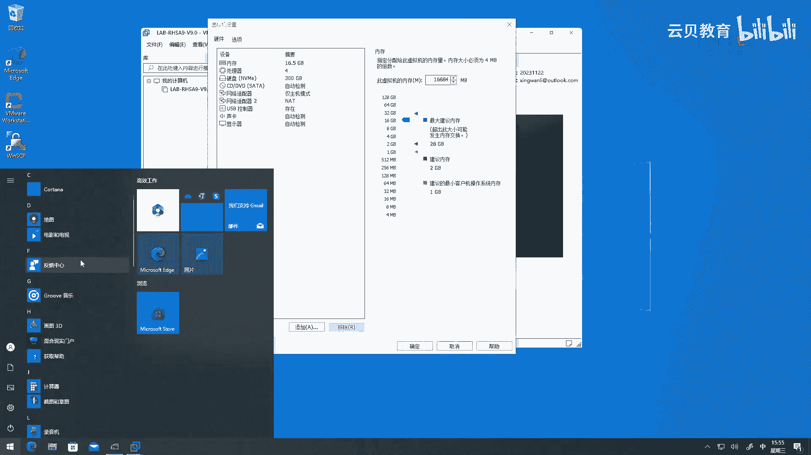
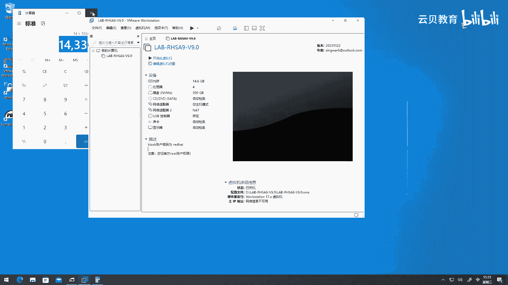
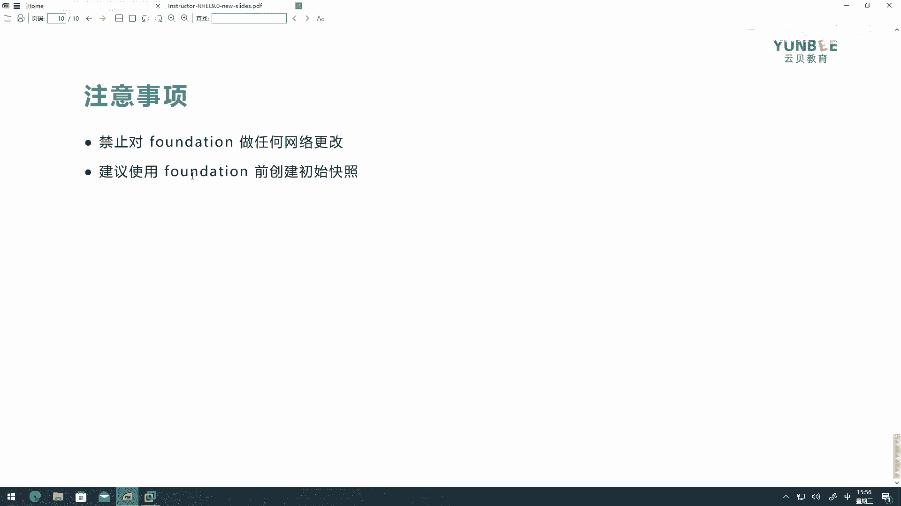
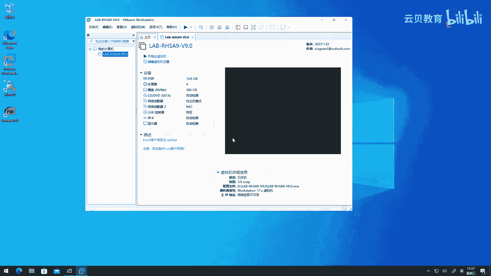
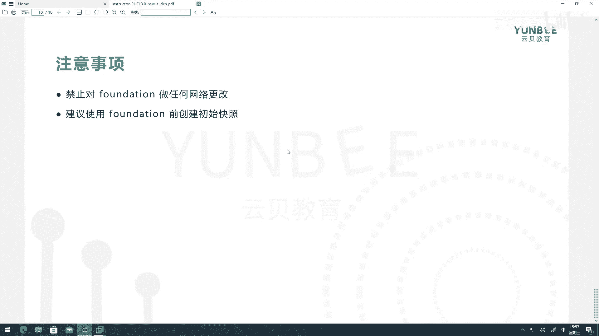

# Linux零基础入门与红帽认证：00.1：课程介绍与环境准备 🚀

在本节课中，我们将要学习这门红帽RHCE认证课程的整体介绍，并详细讲解如何准备和配置学习所需的环境。课程基于最新的红帽企业Linux 9（RHEL 9）系统，旨在帮助零基础的学习者掌握系统管理的核心技能。

## 课程内容概述

我是讲师行万里，拥有红帽官方认证讲师资格，从事红帽培训已有八年。本课程是红帽认证系统管理员（RHCSA）的配套课程，专为没有Linux基础的学习者设计。当然，具备一些计算机和网络知识会更有帮助。

整个课程将从零开始，带领大家认识Linux系统。我们会从最基础的概念讲起，例如什么是命令行、如何在命令行中执行基本命令，以及了解Linux的文件系统结构。

上一节我们介绍了课程的整体定位，本节中我们来看看课程的具体内容范围。

以下是课程将涵盖的核心管理技能：
*   **用户与组管理**：学习如何管理本地用户和组。
*   **权限管理**：掌握文件和目录的权限设置。
*   **软件管理**：使用包管理器安装、更新和移除软件。
*   **网络管理**：配置网络连接和防火墙规则。
*   **磁盘管理**：进行磁盘分区、格式化和挂载。
*   **容器基础**：初步了解和使用容器技术。
*   **Shell脚本**：开发简单的自动化脚本。
*   **性能监控**：监控服务器的关键性能指标。

本课程不仅完全覆盖了标准的RHCSA考试要求，还额外增加了一些实用但官方课程可能未深入涉及的技术点，例如编写**systemd单元文件**和更全面的服务器监控方法。这些新增内容在课程目录中会用星号（*）标出。

学完本课程后，您将有能力解决工作中的基本系统管理需求，并且通过完成课程内的实验，可以为参加红帽RHCSA认证考试做好充分准备。

## 学习环境准备

要高效学习，配套的实验环境至关重要。我将提供一套基于VMware Workstation的预配置虚拟机环境供大家下载使用。



以下是准备环境需要满足的硬件与软件条件：

**硬件要求**
*   **处理器**：至少为英特尔酷睿 i5 或同等性能的AMD芯片。建议使用第8代至第12代之间的英特尔CPU，因为RHEL 9内核可能对更新的第13代CPU兼容性不足。
*   **存储**：本地磁盘至少有100GB可用空间，强烈推荐使用固态硬盘（SSD）。
*   **内存**：宿主机（您的个人电脑）建议拥有16GB或以上内存。因为我们需要为虚拟机分配足够资源。



**软件与配置要求**
*   **虚拟化支持**：必须在计算机的BIOS/UEFI设置中开启CPU虚拟化功能（如Intel VT-x或AMD-V）。
*   **关闭冲突功能**：需要关闭Windows自带的Hyper-V虚拟化和内核隔离功能，以确保VMware的嵌套虚拟化能正常工作。
*   **VMware版本**：建议使用VMware Workstation Pro 17或更新版本，旧版本可能不支持RHEL 9。

### 如何开启BIOS虚拟化

不同品牌电脑进入BIOS的按键不同（如Delete、F2、F12）。进入后，通常在“高级”（Advanced）或“安全”（Security）设置中找到虚拟化选项（如`Intel Virtualization Technology`）并将其启用。



您也可以在Windows中打开命令提示符，输入以下命令来检查虚拟化是否已启用：
```cmd
systeminfo
```
在输出信息中查找“固件中已启用虚拟化”一项，如果显示“是”，则说明已开启。

### 环境加载与配置



下载并安装好VMware Workstation后，请按以下步骤操作：



1.  **配置VMware网络**：打开VMware，进入`编辑` -> `虚拟网络编辑器`。点击“更改设置”获取权限，然后选中`VMnet1（仅主机模式）`，**取消勾选**“使用本地DHCP服务将IP地址分配给虚拟机”选项，点击应用并确定。
2.  **打开虚拟机**：在VMware中，选择`文件` -> `打开`，然后导航到您下载的课程环境目录，选择其中的`.vmx`配置文件并打开。
3.  **检查虚拟机设置**：打开虚拟机后，点击`编辑虚拟机设置`。在“硬件”选项卡中：
    *   **处理器**：确保“虚拟化Intel VT-x/EPT或AMD-V/RVI”选项已勾选。处理器核心数建议设置为2（每个处理器核心数2）或更高。
    *   **内存**：为这台“父虚拟机”分配**16GB**内存。如果宿主机内存只有16GB，可酌情调整为14GB（即`14336 MB`）。
4.  **启动并创建快照**：启动此虚拟机。成功进入系统后，**强烈建议立即创建一个快照**。在VMware菜单栏选择`虚拟机` -> `快照` -> `拍摄快照`，为其命名（如`Initial_State`）并添加描述。这便于在实验出错时快速还原到初始状态。



**重要注意事项**：
*   虚拟机默认登录用户为 `kiosk`，密码为 `redhat`。root账户权限已被管理。
*   请勿随意更改“父虚拟机”的网络配置。
*   实验操作主要在“父虚拟机”内部嵌套的客户机中进行。





## 总结





本节课中我们一起学习了红帽RHCSA认证课程的内容框架与特色，并详细完成了学习环境的准备工作。我们了解了课程从Linux基础到系统管理的完整路径，并成功配置了基于VMware的嵌套虚拟化实验环境。接下来，我们就可以在这个稳定的环境中开始正式的Linux学习之旅了。