# Linux运维入门：第1章：云计算与Linux系统介绍

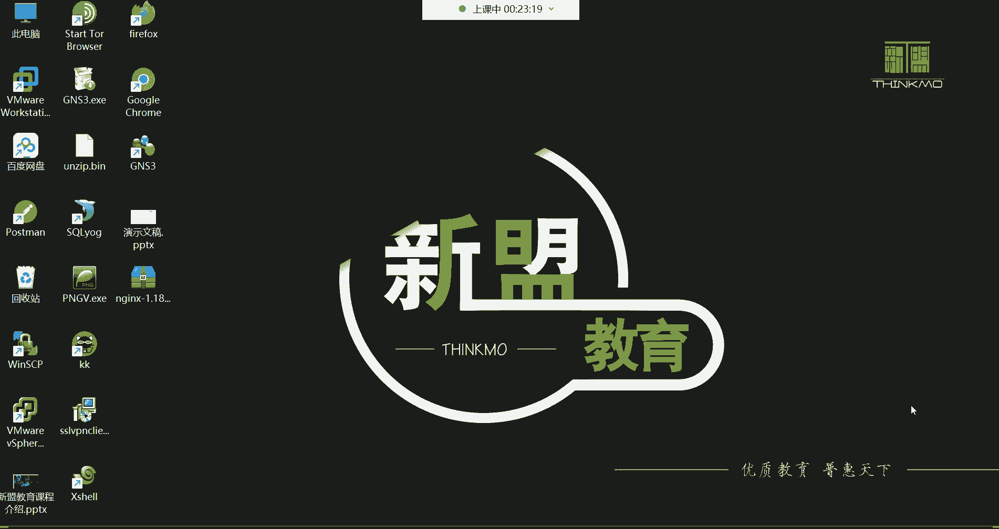

## 概述

在本节课中，我们将学习云计算的基本概念、Linux系统的核心知识以及它们之间的关系。课程将从云计算的定义和发展历史讲起，逐步过渡到Linux系统的本质、发展历程和主要发行版。通过本课，你将理解云计算如何改变IT行业，以及Linux系统在其中的核心地位。

---

## 什么是云计算？🌥️

云计算是当前IT行业的核心技术之一。简单来说，云计算是一种通过网络提供计算资源的服务模式。它的本质是**网络资源出租**。

为了更好地理解这个概念，我们可以回顾一下它的发展历程。大约20年前，“云计算”这个词对大多数人来说还很陌生。在2000年深圳的一场IT领袖峰会上，当记者问及中国互联网巨头们对云计算何时到来的看法时，答案各不相同。马云对此充满信心，并随后在阿里巴巴内部大力支持王坚博士研发云计算。经过8年的努力，阿里云在2009年9月10日正式成立。如今，阿里云已成为全球第三大云服务提供商，在全球20多个地区设有数据中心。

目前，全球主要的云服务商排名如下：
1.  亚马逊 AWS
2.  微软 Azure
3.  阿里云

此外，还有华为云、腾讯云、百度云等众多厂商。这些云厂商为制造业、金融、政务、交通、医疗、电信、能源等众多行业提供服务，我们日常使用的12306购票网站、中石化等大型企业的系统背后都有云服务的支持。

那么，云计算具体是如何工作的呢？我们可以通过一个例子来理解。

### 云计算的优势：按需租用

假设你想创办一家公司，需要运行一个网站。在传统模式下，你需要：
1.  购买物理服务器。
2.  购买机柜、机架来放置服务器。
3.  建设或租用IDC机房，以提供稳定的电力、网络、温湿度控制等环境。
这个过程成本高昂，尤其对于初创公司而言负担很重。

而有了云计算之后，这个过程变得非常简单：
1.  你只需登录云平台（如阿里云）。
2.  租用一台**云主机**（本质上是云厂商通过技术虚拟出来的一台计算机）。
3.  在这台云主机上部署你的网站即可。

云主机包含了CPU、内存、硬盘、网络和操作系统等所有必要资源。其付费方式非常灵活：
*   **按量付费**：开机才计费，关机则停止计费。
*   **包年包月**：像租房一样，预付一段时间费用，期间可随意使用。

至于数据中心的地皮、厂房、电力、网络、空调等所有基础设施，均由云厂商负责建设和维护。用户无需关心底层硬件，只需专注于自己的业务。因此，云计算的本质就是**将计算、存储、网络等资源作为一种服务，通过互联网出租给用户**。这类似于我们去网吧上网、租房子或住酒店，都是按需使用他人提供的资源。

---

## 云计算的三种服务模式

云计算主要提供三种层次的服务，以满足不同用户的需求。

### 1. IaaS（基础设施即服务）

IaaS为用户提供最基础的计算资源，如**CPU、内存、磁盘和网络**。这就像你买了一台“裸机”电脑，只有硬件，没有操作系统。用户租用IaaS服务后，需要自己安装操作系统、配置环境并部署应用。
**核心公式**：`IaaS = 基础硬件资源（服务器、网络、存储）`

### 2. PaaS（平台即服务）

PaaS在IaaS的基础上，进一步为用户提供了一个**现成的软件平台和开发环境**，例如特定的服务框架、中间件或运维监控工具。这就像你买了一台预装了Windows 10系统的电脑，可以直接安装和使用各种软件，而无需自己安装系统。
**核心公式**：`PaaS = IaaS + 软件平台/开发环境`

### 3. SaaS（软件即服务）

SaaS是最高层的服务，它直接为用户提供**完整的、可直接使用的软件应用**。云服务商负责所有前期的部署、后期的维护、升级和安全等工作。用户就像“拎包入住”五星级酒店，无需关心任何技术细节，直接使用软件即可。例如，直接租用一个现成的网站或邮件系统。
**核心公式**：`SaaS = IaaS + PaaS + 完整软件应用`

对于大多数企业而言，出于安全和可控性考虑，更倾向于使用IaaS或PaaS，并雇佣自己的运维团队进行管理。

---

## 什么是Linux？🐧

了解了云计算后，我们来看另一个核心：Linux系统。Linux是一个**类Unix的操作系统内核**。

**内核**是操作系统的核心，相当于计算机的“大脑”，负责管理系统的所有硬件资源（如CPU、内存、磁盘）和软件协调（如进程、文件系统、网络）。计算机开机后风扇转动、硬盘工作，都是由内核控制的。

关于“Linux”的读音（/ˈlɪnəks/ 或 /ˈlɪnʊks/）没有绝对标准，可按个人习惯。它的诞生与Unix密切相关。

### Unix与Linux的渊源

Unix是另一个操作系统内核，诞生于1970年，由贝尔实验室的肯·汤普森和丹尼斯·里奇（C语言之父）开发。Unix是一个**商业系统**，使用需要付费。

1991年，林纳斯·托瓦兹开发了Linux内核。Linux是**免费且开源**的，它继承了Unix的许多设计思想和风格。林纳斯选择企鹅作为Linux的吉祥物，有一种说法是寓意Linux像南极一样，不属于任何商业实体，是全球共有的自由软件。

后来，Linux内核加入了**GNU（自由软件基金会）项目**，形成了完整的“GNU/Linux”操作系统。我们在Linux系统中使用的大部分命令工具，都来自GNU项目。

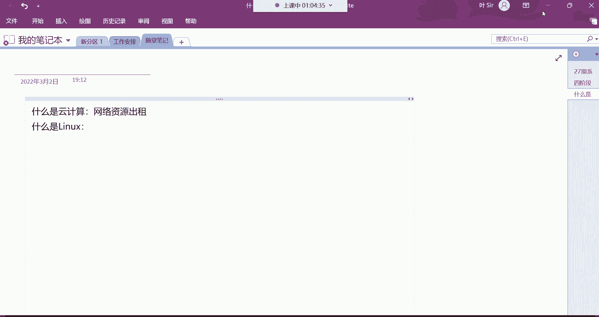

---

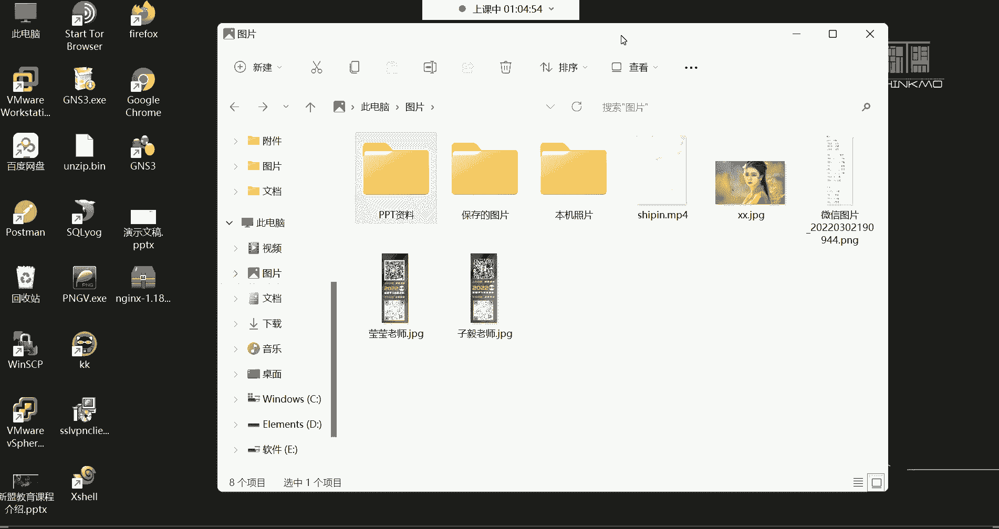

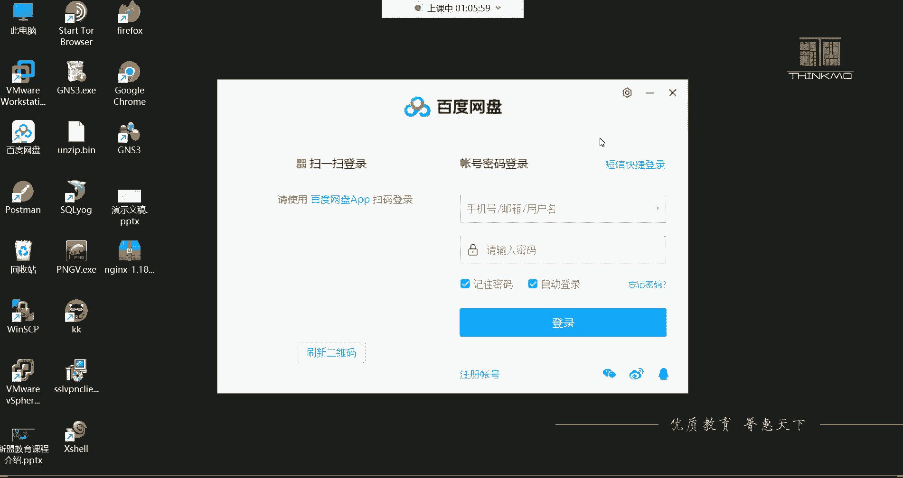

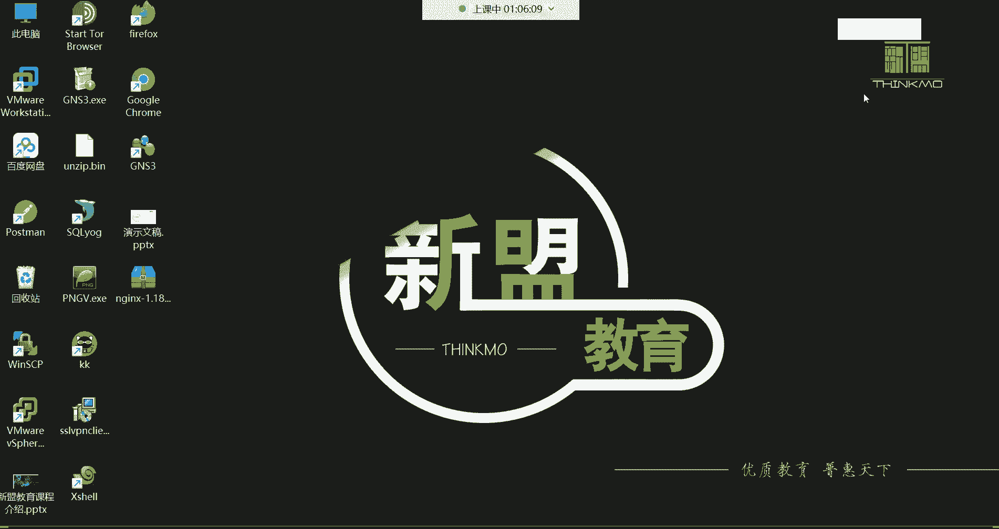

## 基于Linux内核的发行版系统

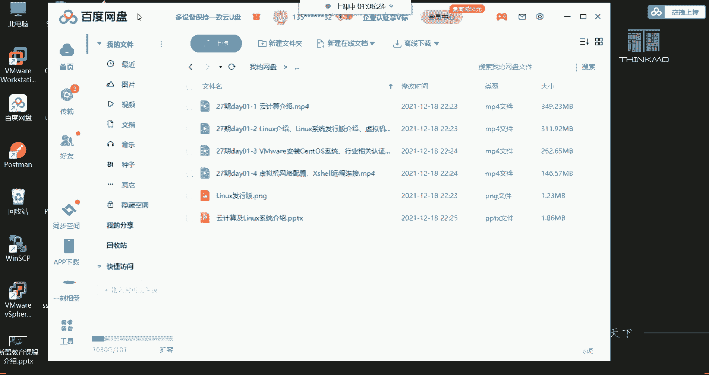

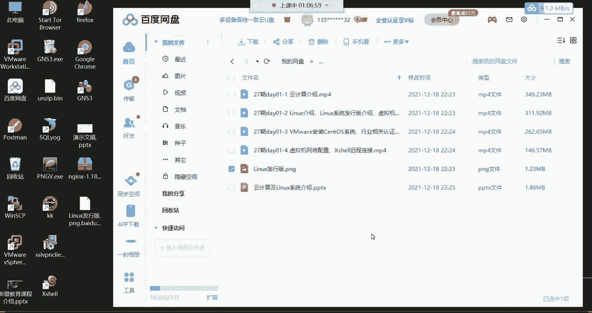

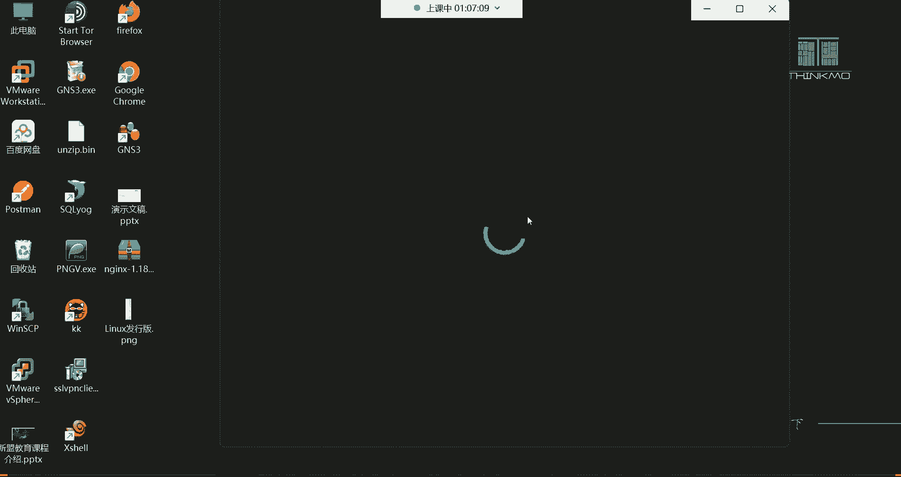

Linux只是一个内核，基于这个内核，不同的组织和公司打包了不同的软件，形成了各种各样的**Linux发行版**。其家族非常庞大，主要分为几个系列。

以下是几个最常见和重要的发行版：

### 1. Red Hat Enterprise Linux (RHEL) 🔴
*   **定位**：企业级服务器操作系统。
*   **特点**：系统本身免费，但如需红帽官方的技术支持、安全补丁和上门服务，则需要购买订阅服务。它是全球企业市场最主流的Linux发行版之一。

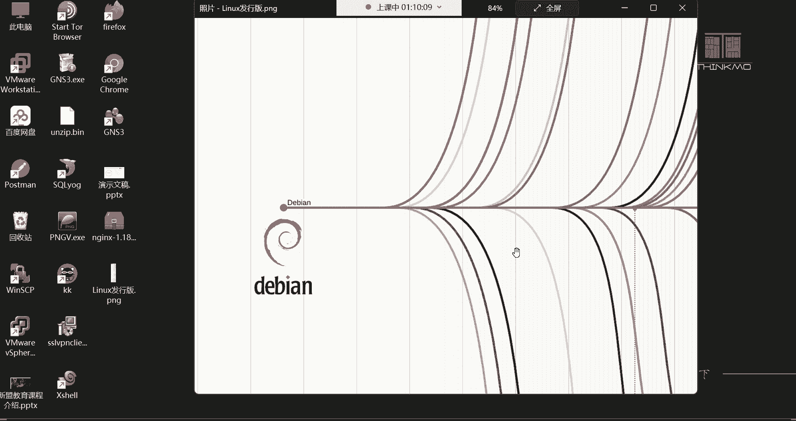

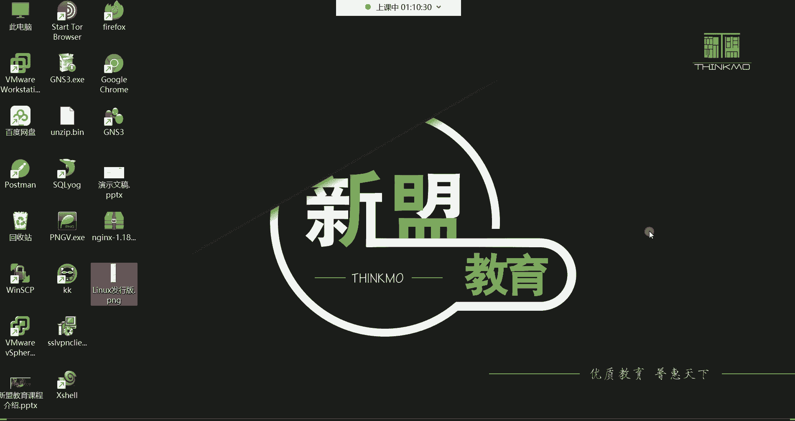

### 2. CentOS
*   **定位**：社区版的企业级服务器操作系统。
*   **特点**：可以看作是RHEL的免费克隆版，与RHEL高度兼容，但不提供商业支持。非常适合学习和搭建企业服务器环境。**（注：CentOS 8之后已转向CentOS Stream，稳定性策略有所变化）**

### 3. Fedora
*   **定位**：前沿技术测试平台。
*   **特点**：红帽赞助的社区项目，用于测试最新技术。稳定后的功能会引入RHEL。适合开发者和技术爱好者。

### 4. Ubuntu 🐧
*   **定位**：桌面和嵌入式开发。
*   **特点**：基于Debian，拥有极其友好的图形界面，易用性高。深受开发者和个人用户喜爱，但在服务器领域（尤其对稳定性、资源消耗要求高的场景）不如RHEL/CentOS系列普遍。

### 5. openSUSE / Debian
*   **定位**：openSUSE在欧洲流行，兼具桌面和服务器特性；Debian以稳定著称，是Ubuntu等发行版的基础。

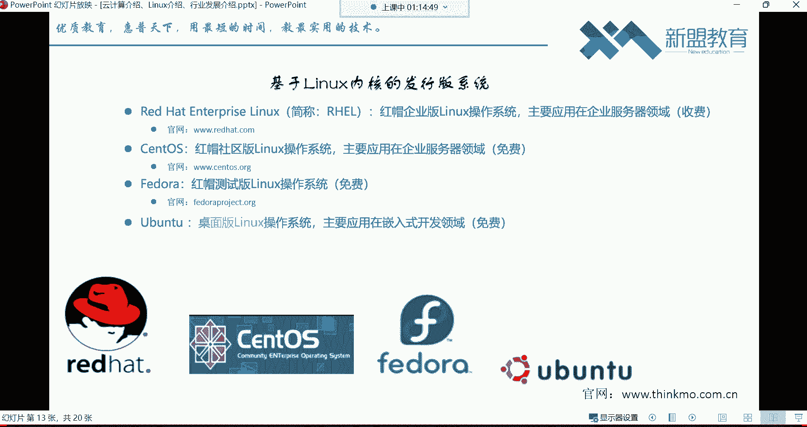

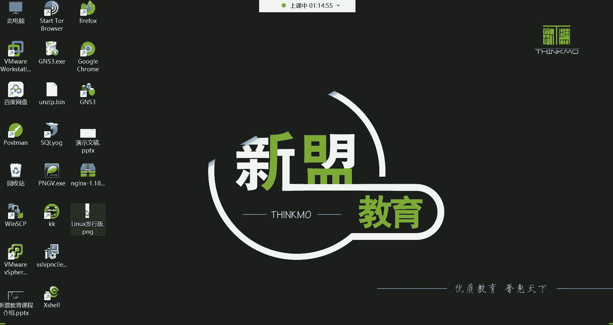

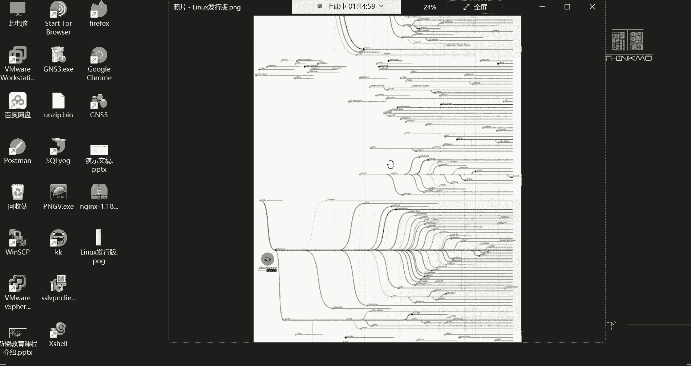

**为什么服务器通常选择RHEL/CentOS而非桌面版？**
因为服务器追求**稳定、高效和低资源消耗**。图形界面会占用大量CPU和内存资源，且可能引入不稳定因素。服务器管理员几乎全部通过**命令行**进行高效、精准的管理，因此不需要图形桌面环境。

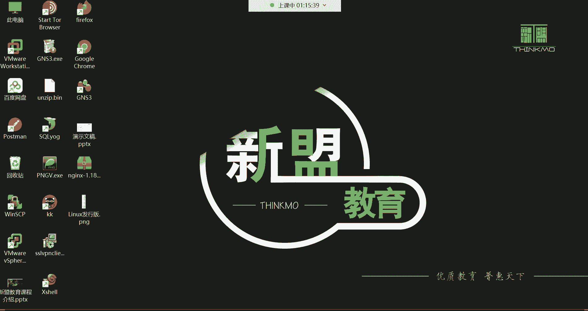

---

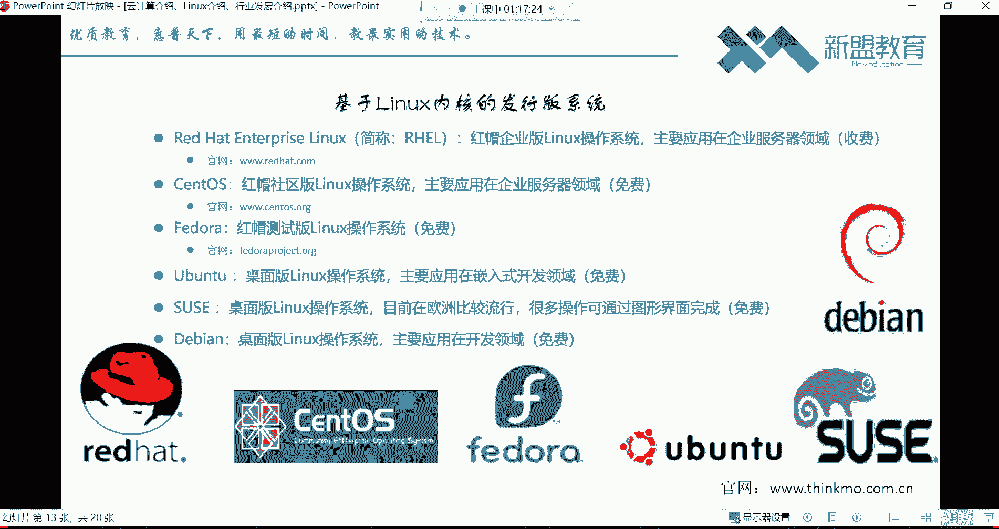

## 总结

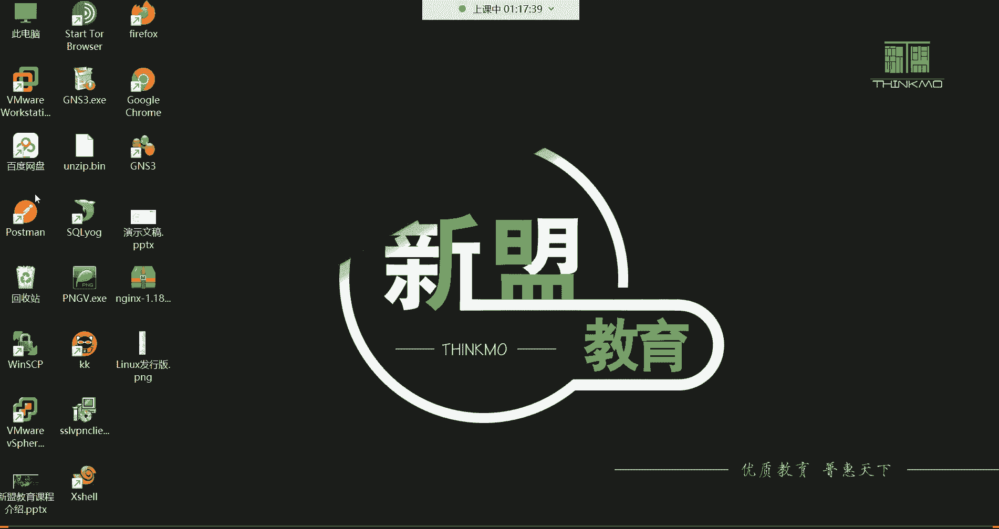

本节课我们一起学习了：
1.  **云计算**的本质是**网络资源出租**，它通过IaaS、PaaS、SaaS三种服务模式，极大地降低了企业和个人使用IT资源的门槛和成本。
2.  **Linux**是一个**免费、开源的操作系统内核**，是众多发行版的核心。
3.  基于Linux内核有**RHEL、CentOS、Ubuntu**等众多发行版，它们在服务器、桌面、开发等不同领域各有所长。
4.  在企业级服务器领域，**RHEL/CentOS**因其稳定性和专业性而占据主导地位，管理员主要通过命令行进行管理。

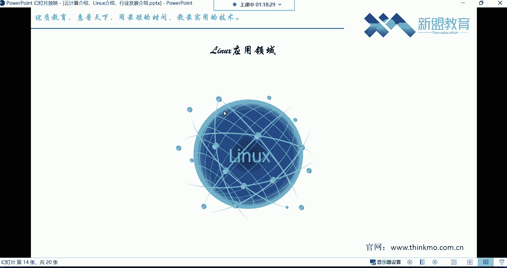

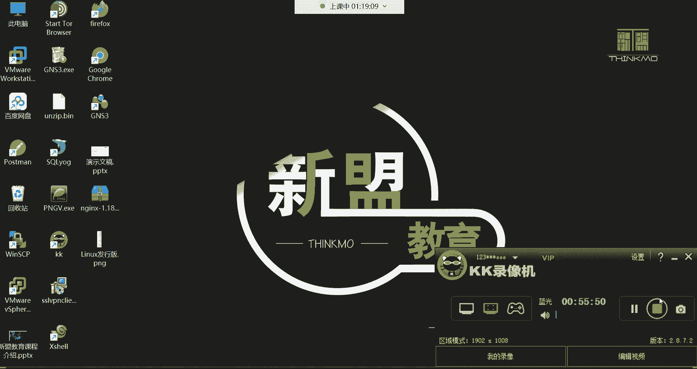

理解这些基础概念，是成为一名Linux运维工程师的第一步。接下来，我们将动手安装一个Linux系统，开始真正的实践之旅。