# Linux入门：P20：常用特殊符号与grep文件内容过滤

在本节课中，我们将学习Linux系统中几个常用的特殊符号，以及如何使用`grep`命令高效地过滤文件内容。这些工具是日常操作和文本处理的基础，掌握它们能极大提升工作效率。


## 特殊符号


在Linux系统中，键盘上的许多符号，如`!`、`@`、`#`、`$`、`%`、`^`、`&`、`*`、`()`、`{}`、`[]`、`<>`、`?`、`/`、`\`、`` ` ``、`.`、`|`等，都被称为特殊符号。它们在系统中具有特定的功能含义。在初级阶段，我们主要掌握以下四个：`*`、`{}`、`?`、`[]`。其中，`*`和`{}`最为常用。

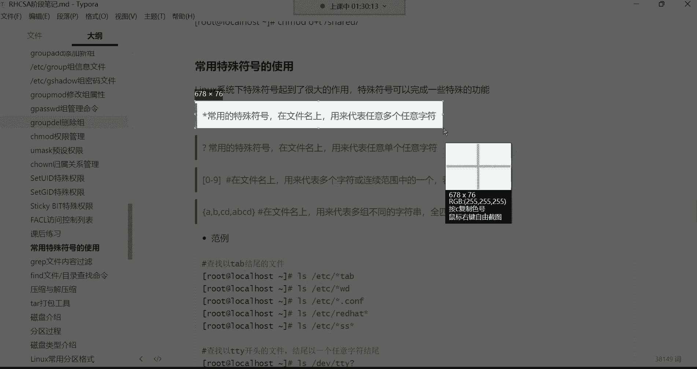

### 星号 `*`

星号 `*` 是一个通配符，主要用于文件名匹配。它的功能是**代表任意多个任意字符**。

这意味着：
*   **任意字符**：可以匹配数字、字母（大小写）、点或其他符号。
*   **任意多个**：不限制匹配的字符数量，长度不限。

**公式**：`*` 匹配零个或多个任意字符。

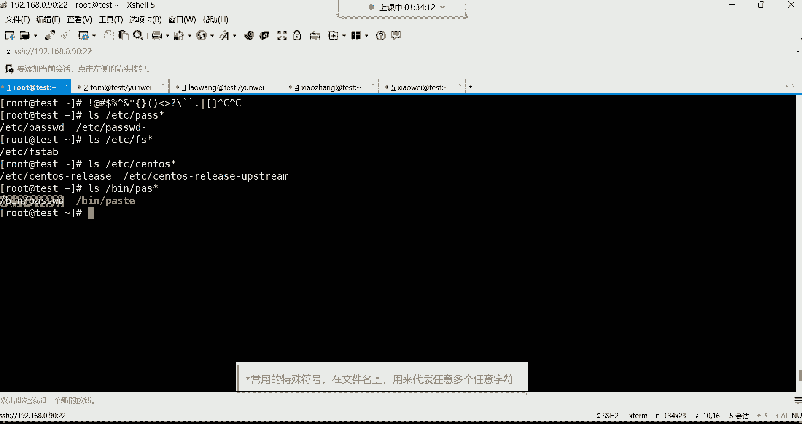

它的常见用途是进行模糊文件搜索或批量操作。

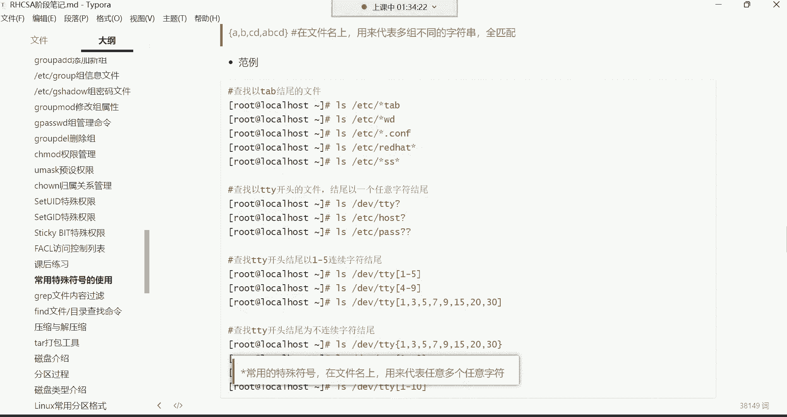

以下是星号的一些应用示例：

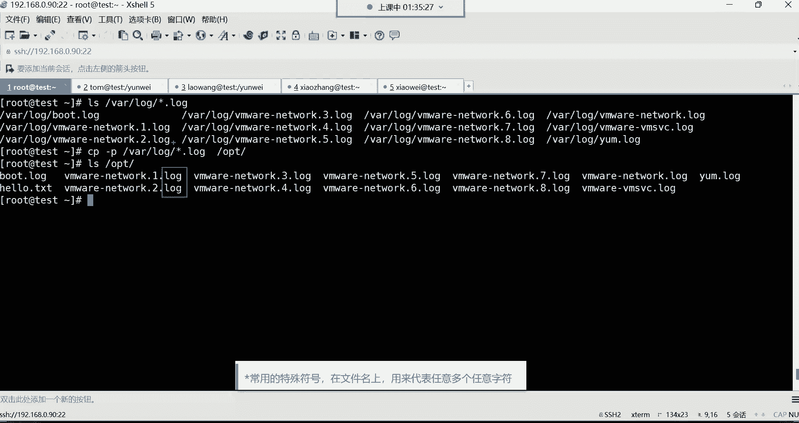

*   **搜索文件**：当记不清完整文件名时，可以用`*`代替未知部分。
    ```bash
    # 搜索/etc目录下所有以‘pass’开头的文件
    ls /etc/pass*
    # 搜索/var/log目录下所有以‘.log’结尾的日志文件
    ls /var/log/*.log
    ```
*   **批量操作**：结合命令对匹配到的文件进行批量处理。
    ```bash
    # 将/var/log下所有.log文件备份到/opt目录
    cp -p /var/log/*.log /opt/
    ```
*   **灵活匹配**：`*`可以放在文件名开头、中间或结尾。
    ```bash
    # 匹配文件名中间包含‘ss’的文件
    ls /etc/*ss*
    ```

**警告**：`*`功能强大，但需谨慎使用。例如，`rm -rf /*`命令中的`*`会匹配根目录下的所有内容，导致灾难性后果。

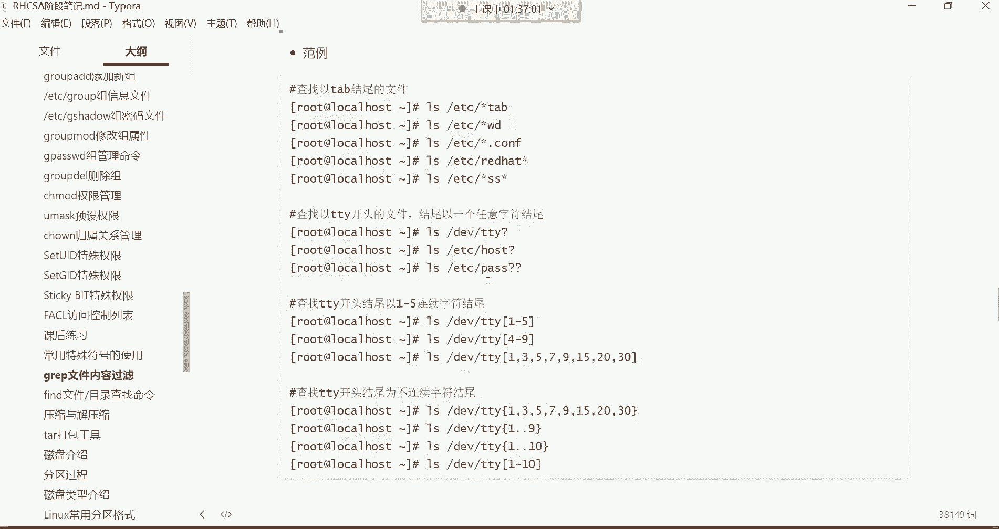

### 问号 `?`

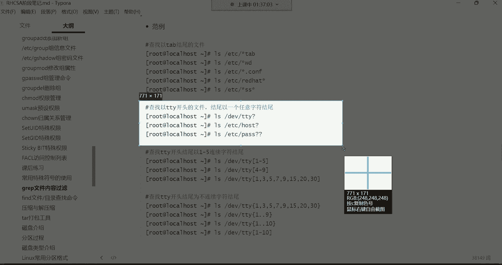

问号 `?` 同样用于文件名匹配，但它的功能是**代表任意单个字符**。

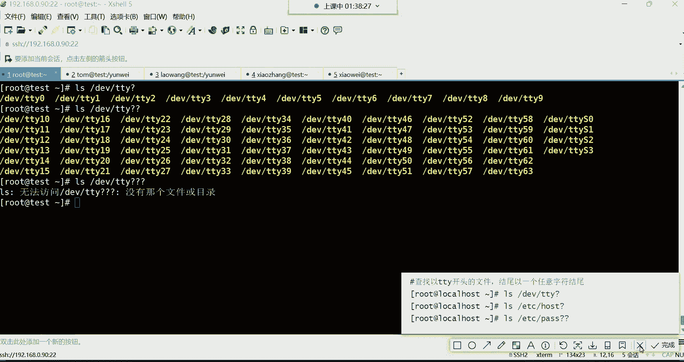

**公式**：`?` 匹配一个任意字符。

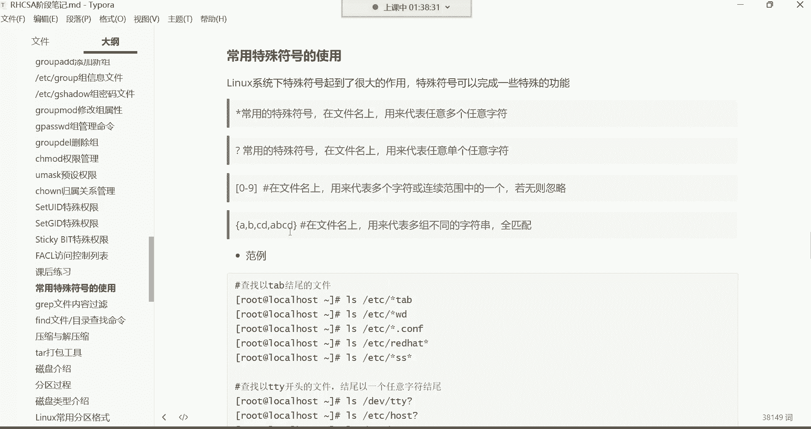

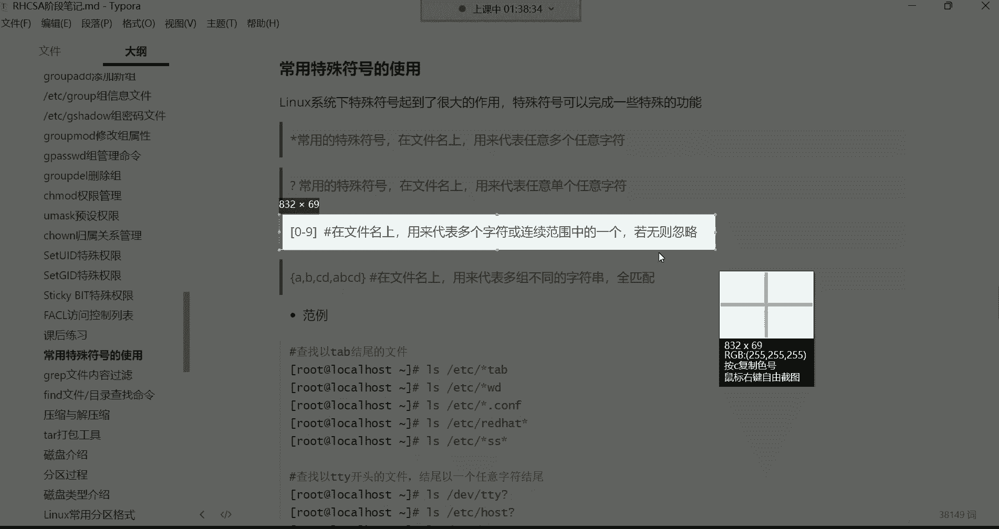

它与星号的主要区别在于，`?`只匹配一个字符位置。它通常用于精确匹配特定长度的文件名。

以下是问号的应用示例：

```bash
# 搜索/dev目录下，以‘tty’开头且结尾只有一个字符的文件
ls /dev/tty?
# 搜索/dev目录下，以‘tty’开头且结尾有两个字符的文件
ls /dev/tty??
```


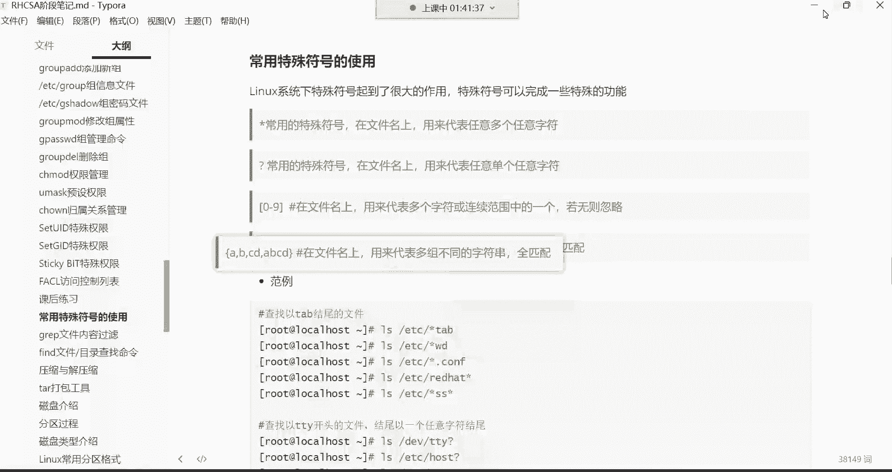

### 中括号 `[]`

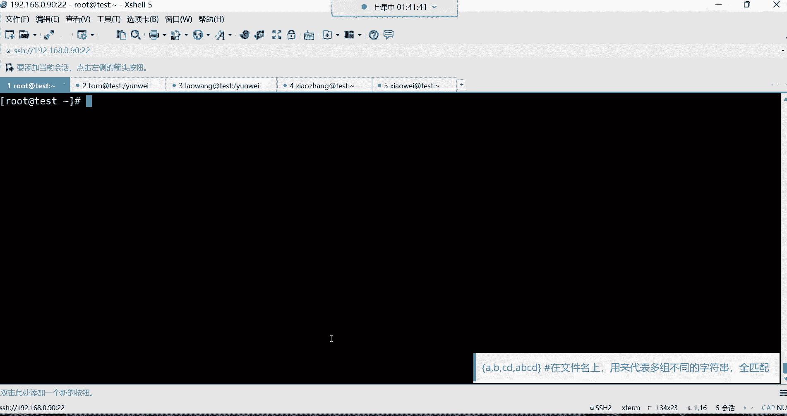

中括号 `[]` 用于匹配**指定范围或集合中的单个字符**。

**公式**：`[范围或集合]` 匹配括号内指定的一个字符。

常见用法是匹配连续的数字或字母范围。

以下是中括号的应用示例：

```bash
# 搜索/var/log目录下，文件名中包含数字（0-9）的文件
ls /var/log/*[0-9]*
# 搜索/var/log目录下，文件名中包含小写字母（a-z）的文件
ls /var/log/*[a-z]*
# 搜索/dev目录下，以‘tty’开头，且结尾是数字0到9的文件
ls /dev/tty[0-9]
```

需要注意的是，`[]`在匹配不连续的数字范围（如`[15-25]`）时，可能无法按预期工作。

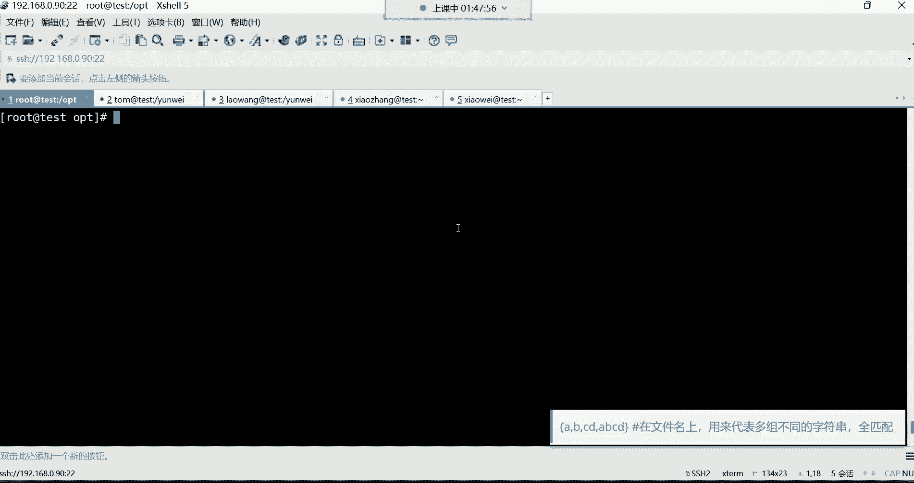


### 大括号 `{}`

大括号 `{}` 功能强大，主要用于**生成序列或匹配多组不同的字符串**，特别擅长处理数字序列。

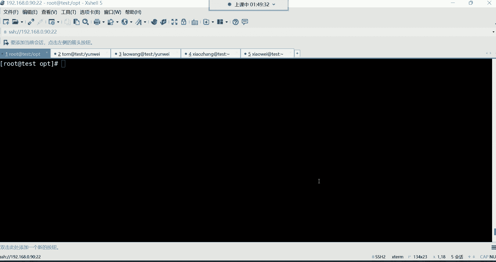

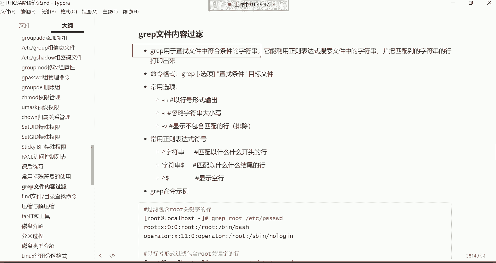

**公式**：`{起点..终点}` 生成从起点到终点（包含两端）的连续序列。

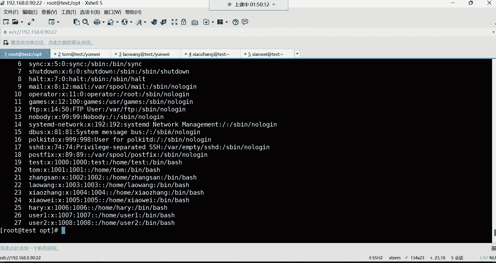

以下是它最实用的功能示例：

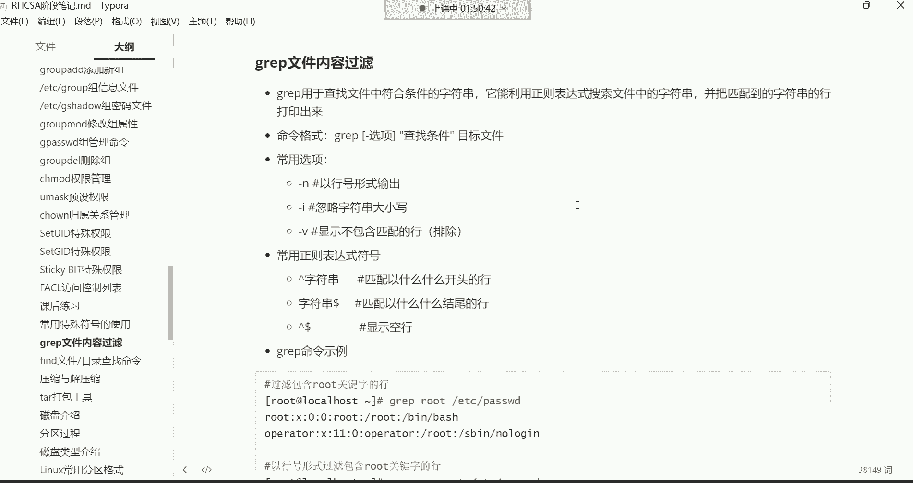

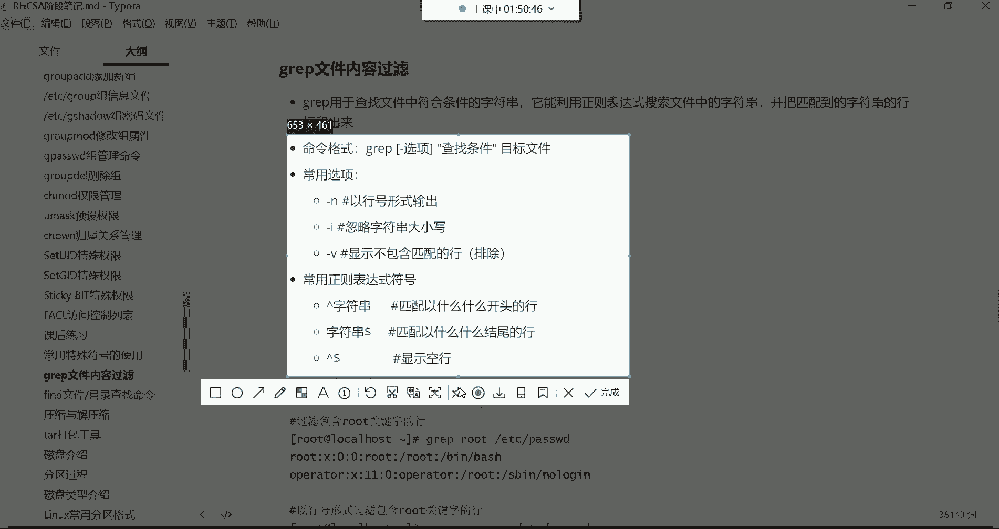

*   **批量创建文件**：快速创建一系列有规律命名的文件。
    ```bash
    # 在当前目录创建 test1, test2, ..., test100 共100个文件
    touch test{1..100}
    ```
*   **批量删除文件**：同理，可以用于删除特定序列的文件。
    ```bash
    # 删除当前目录下 test51 到 test100 的文件
    rm -rf test{51..100}
    ```
*   **匹配多组字符串**：也可以用于匹配非数字的选项（但不如数字序列常用）。
    ```bash
    # 列出/etc目录下，文件名包含a或b或c或d的文件
    ls /etc/*{a,b,c,d}*
    ```

大括号在后续学习Shell脚本时也会非常常用。

上一节我们介绍了用于文件名匹配的特殊符号，本节中我们来看看如何对文件**内部的内容**进行搜索和过滤。

## grep文件内容过滤命令

`grep`命令用于在文件中搜索并显示包含指定字符串的行。当你需要从一个大型文件中快速找到关键信息，而不是用编辑器打开整个文件慢慢查找时，`grep`是你的得力助手。

**基本语法**：`grep [选项] “搜索字符串” 文件名`

### 基础用法

最简单的用法是直接搜索包含特定关键词的行。

```bash
# 在 /etc/passwd 文件中搜索包含‘tom’的行
grep “tom” /etc/passwd
# 显示行号，方便定位
grep -n “tom” /etc/passwd
```

### 常用选项

`grep`命令配合以下选项可以变得更加强大：

以下是`grep`命令的一些常用选项：

*   **`-n`**：显示匹配行在文件中的行号。
    ```bash
    grep -n “root” /etc/passwd
    ```
*   **`-i`**：忽略大小写进行匹配。
    ```bash
    # 匹配‘user’，‘USER’，‘User’等
    grep -i “user” /etc/passwd
    ```
*   **`-v`**：反向选择，即显示**不包含**匹配字符串的所有行。常用于“排除”。
    ```bash
    # 显示/etc/passwd中不包含‘root’的行
    grep -v “root” /etc/passwd
    ```

### 结合正则表达式符号

`grep`可以结合更精确的正则表达式符号进行过滤。


以下是结合正则表达式的过滤示例：

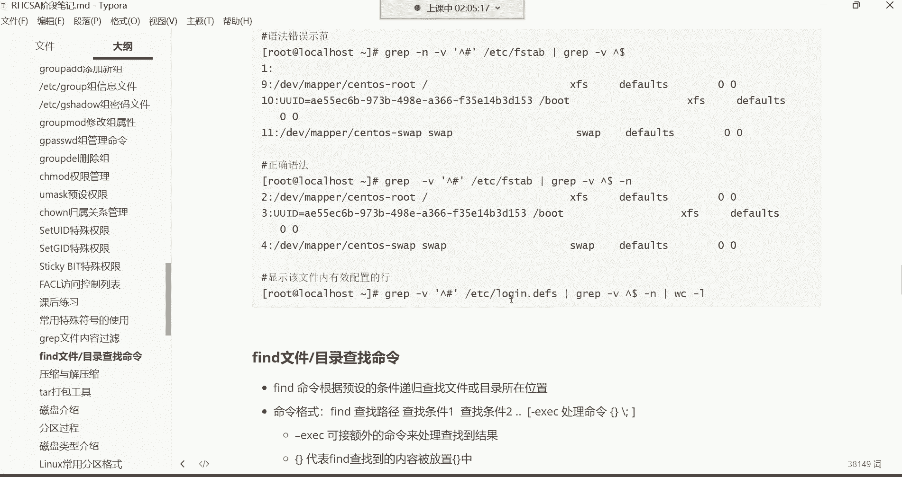

*   **`^`**：匹配以指定字符串**开头**的行。
    ```bash
    # 匹配以‘root’开头的行（即用户root的信息）
    grep “^root” /etc/passwd
    ```
*   **`$`**：匹配以指定字符串**结尾**的行。
    ```bash
    # 匹配以‘/bin/bash’结尾的行（即可登录系统的普通用户）
    grep “/bin/bash$” /etc/passwd
    # 匹配以‘/sbin/nologin’结尾的行（即不可登录系统的系统用户）
    grep “/sbin/nologin$” /etc/passwd
    # 统计不可登录用户的数量
    grep “/sbin/nologin$” /etc/passwd | wc -l
    ```
*   **`^$`**：匹配空行。
    ```bash
    # 统计文件中的空行数
    grep “^$” /etc/login.defs | wc -l
    ```

### 高级组合与管道

`grep`的强大之处在于它可以与其他命令通过管道符`|`结合，对前一个命令的输出结果进行过滤。

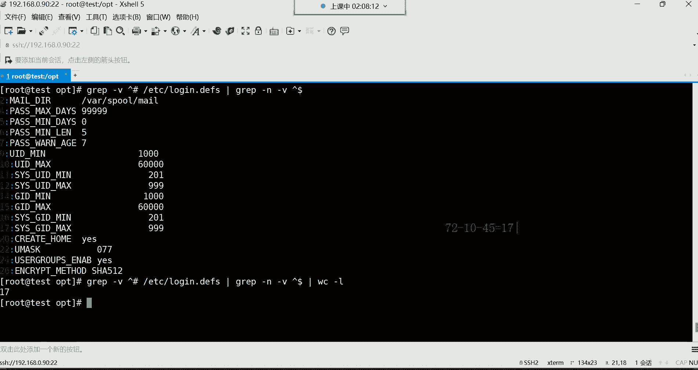

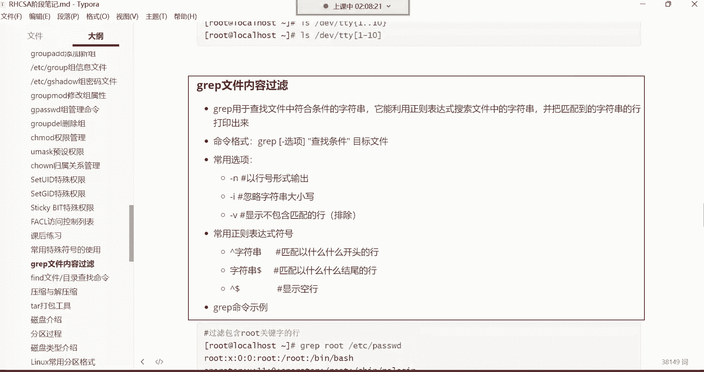

以下是`grep`结合管道的应用示例：

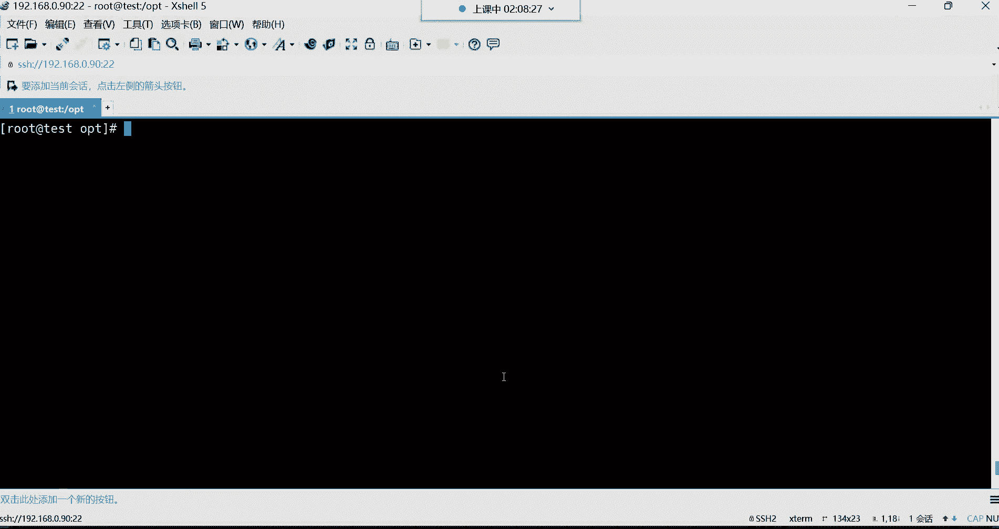

```bash
# 查看系统内存信息，并只过滤出包含‘Mem’的行
free -h | grep “Mem”
# 查看网络配置，只显示包含‘inet’的行
ifconfig | grep “inet”
# 复杂过滤：先排除注释行（#开头），再排除空行，最后显示有效配置及行号
grep -v “^#” /etc/login.defs | grep -v “^$” | grep -n “.”
```


通过这个例子可以看到，我们可以通过多次管道连接`grep`，对文本进行层层过滤，最终得到最精炼的结果。例如，一个72行的配置文件，可能包含45行注释和10个空行，真正有效的配置只有17行。

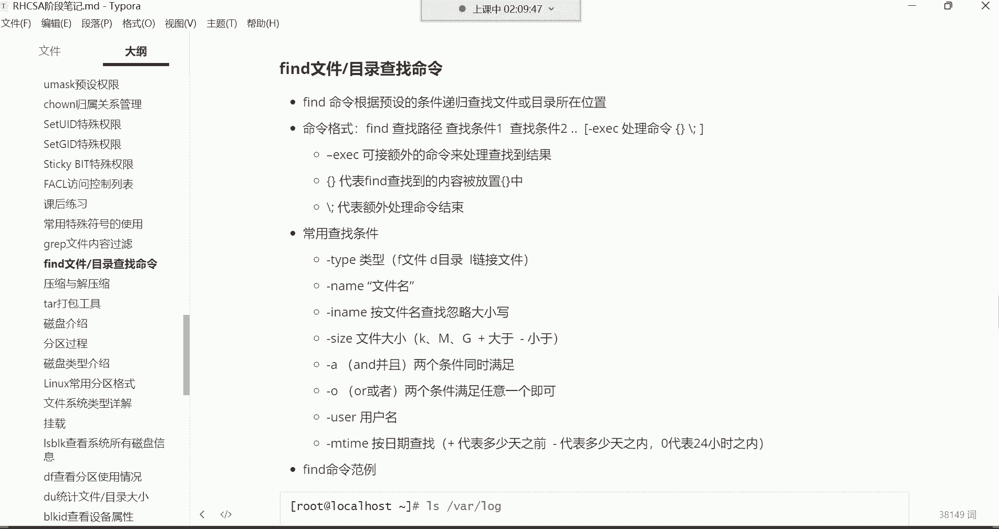


## 总结


本节课中我们一起学习了Linux中四个常用的特殊符号（`*`， `?`， `[]`， `{}`）以及`grep`命令。
*   `*`和`{}`是文件操作中最得力的通配符，尤其`{}`在批量创建序列文件时无可替代。
*   `grep`是文本内容过滤的利器，通过基本用法、选项以及结合`^`、`$`等符号，可以快速从大量文本中定位所需信息。结合管道符，更能实现灵活的多级处理。
熟练掌握这些工具，将为你后续的Linux学习和运维工作打下坚实的基础。