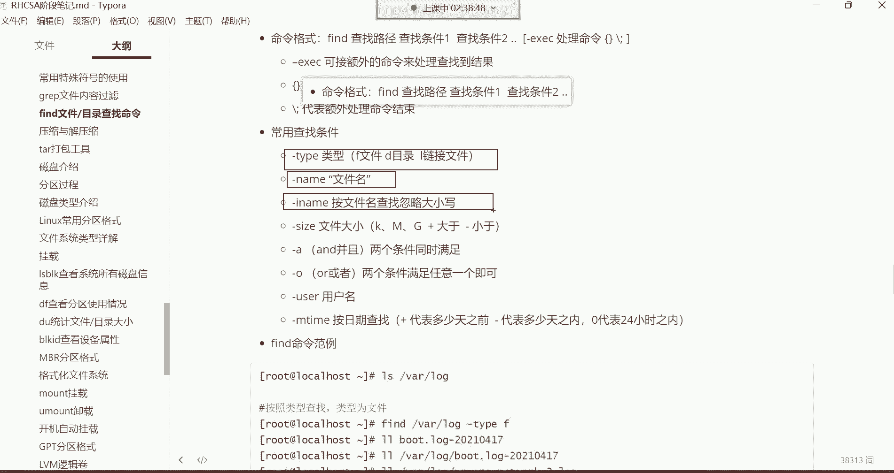
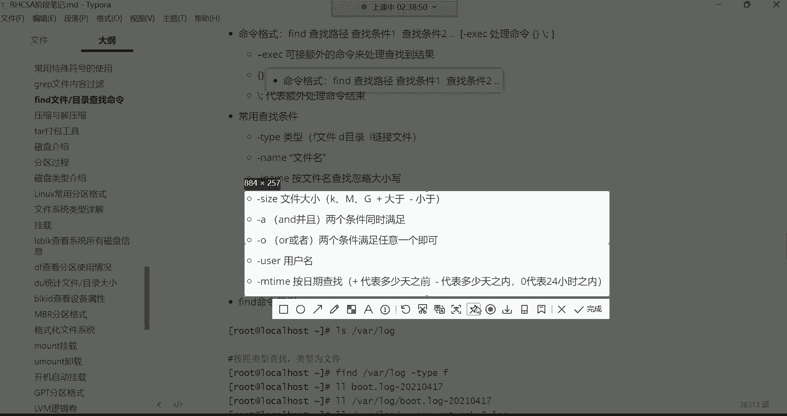
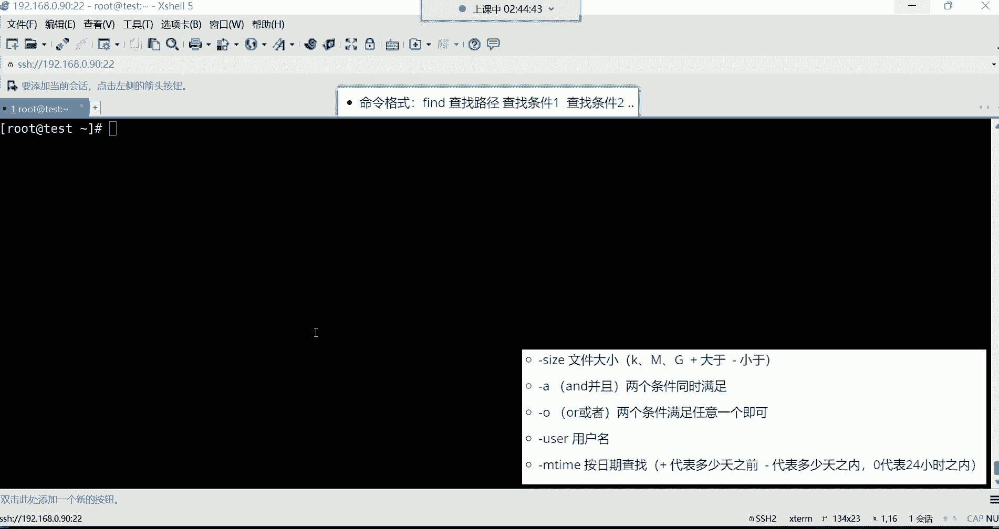
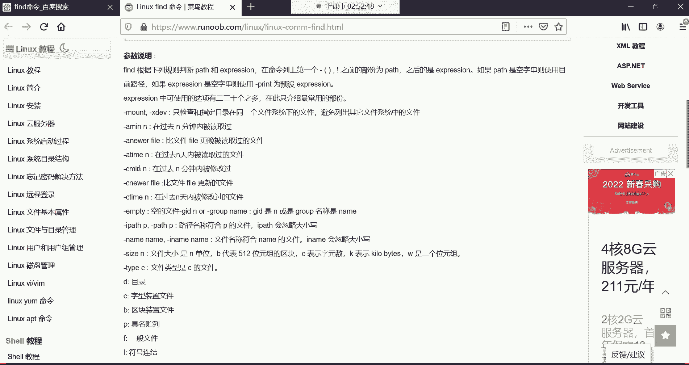
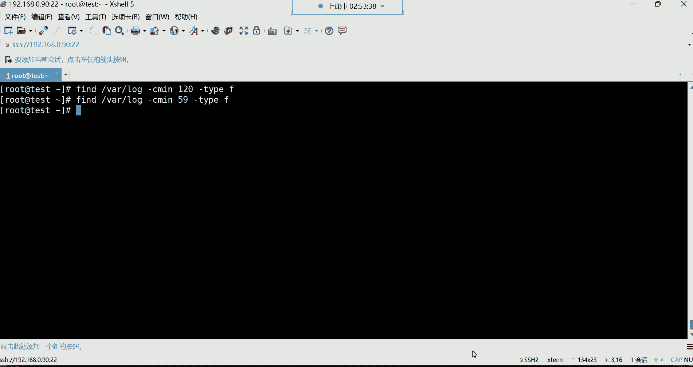
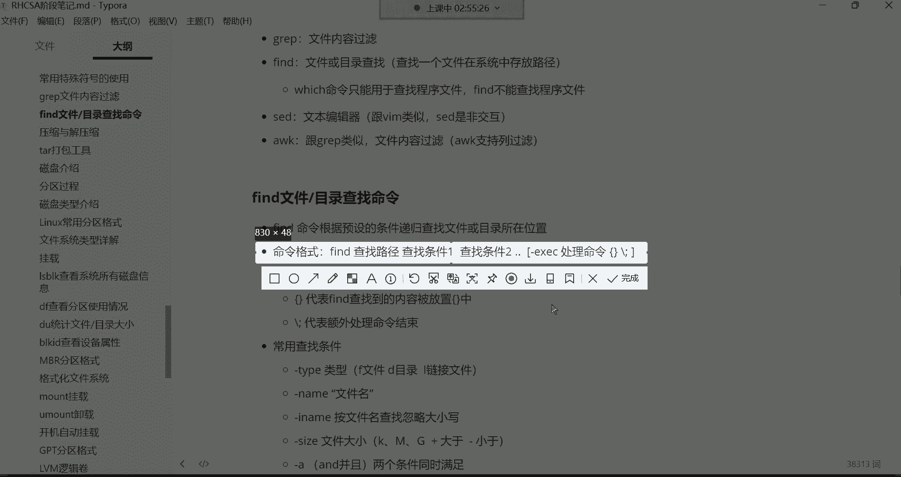
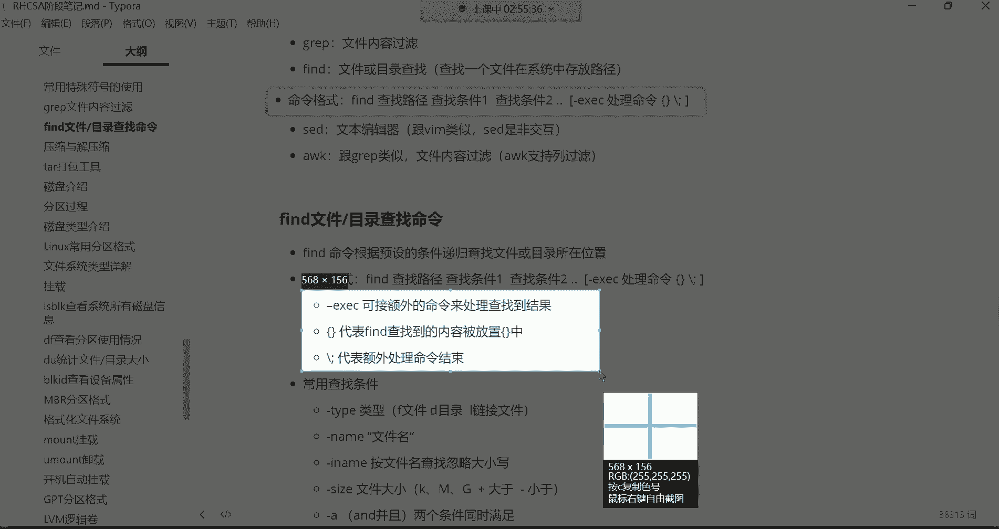
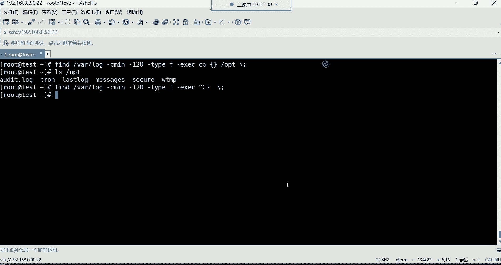
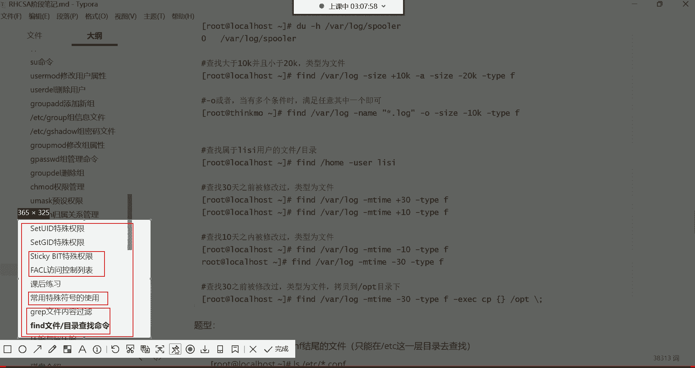

# Linux运维教程：P21：find文件查找命令详解 🔍

在本节课中，我们将学习Linux系统中一个非常强大的文件搜索工具——`find`命令。我们将从基本语法开始，逐步学习如何根据不同类型、名称、大小、所有者、时间等条件来精确查找文件，并了解如何对查找结果进行进一步处理。

## 命令格式与递归查找 📁

`find`命令的基本格式是：`find [路径] [查找条件]`。你首先需要告诉它从哪里开始搜索。

**命令格式**：
```bash
find /path/to/search [options]
```

例如，从`/var/log`目录开始查找：
```bash
find /var/log
```

`find`命令的一个核心特点是**递归查找**。这意味着它不仅会搜索你指定的目录，还会深入该目录下的所有子目录进行彻底搜索，并将所有匹配的结果列出来。这与`ls`命令只在当前目录层搜索有本质区别。


## 按类型查找 ( -type ) 📄





上一节我们介绍了命令的基本格式，本节中我们来看看第一个常用查找条件：按文件类型查找。使用`-type`选项可以指定查找目标是普通文件、目录还是链接文件。

以下是`-type`选项的常见参数：
*   `f`: 查找普通文件。
*   `d`: 查找目录。
*   `l`: 查找符号链接文件。

**示例**：
1.  在`/var/log`中查找所有普通文件：
    ```bash
    find /var/log -type f
    ```
2.  在`/etc`目录中查找所有符号链接文件：
    ```bash
    find /etc -type l
    ```

## 按名称查找 ( -name / -iname ) 🔤

按照类型查找可能范围太广，更常用的方式是按照文件名进行精确或模糊查找。这需要使用`-name`选项。

**命令格式**：
```bash
find [路径] -name “文件名模式”
```




在“文件名模式”中，可以使用通配符：
*   `*`：匹配任意数量（包括零个）的任意字符。
*   `?`：匹配单个任意字符。

**示例**：
1.  在`/var/log`中查找所有以`.log`结尾的文件：
    ```bash
    find /var/log -name “*.log”
    ```
2.  结合多个条件，查找`/etc`下以`.conf`结尾的普通文件：
    ```bash
    find /etc -name “*.conf” -type f
    ```

此外，`-iname`选项的功能与`-name`相同，但在匹配时会忽略文件名的大小写，适用于记不清大小写的情况。

**注意**：`find -name`是**根据文件名**在文件系统中查找文件。而之前学过的`grep`命令是**在文件内容中**查找匹配的文本字符串。两者用途不同，请不要混淆。

## 按大小查找 ( -size ) ⚖️

在系统维护中，经常需要查找特定大小的文件，例如过大的日志文件。`find`命令的`-size`选项可以满足这个需求。

**命令格式**：
```bash
find [路径] -size [+/-]大小[单位]
```




*   `+`：表示“大于”指定大小。
*   `-`：表示“小于”指定大小。
*   单位：`c`（字节）， `k`（千字节）， `M`（兆字节）， `G`（吉字节）。


**示例**：
1.  查找`/var/log`下大于10KB的普通文件：
    ```bash
    find /var/log -size +10k -type f
    ```
2.  查找`/var/log`下小于10KB的文件：
    ```bash
    find /var/log -size -10k
    ```




可以使用`du -h 文件名`命令来验证找到的文件大小。


## 组合条件查找 ( -a / -o ) 🔗







我们可以使用逻辑运算符组合多个查找条件，实现更复杂的搜索。

*   `-a` 或 `-and`：表示“并且”，两个条件必须同时满足。
*   `-o` 或 `-or`：表示“或者”，满足任意一个条件即可。

**示例**：
1.  查找大小在10K到20K之间的文件（包含10K和20K）：
    ```bash
    find /var/log -size +10k -a -size -20k -type f
    ```
2.  查找文件名以`.log`结尾，**或者**大小小于10K的文件：
    ```bash
    find /var/log -name “*.log” -o -size -10k -type f
    ```

## 按所有者和时间查找 👤⏰

`find`命令还可以根据文件的所有者或修改时间进行查找。

**按所有者查找 (`-user`)**：
查找属于特定用户的所有文件。
```bash
find / -user username
```



**按时间查找 (`-mtime`)**：
查找在指定天数内/之前被修改过的文件。
*   `+n`：查找`n`天**之前**被修改的文件。
*   `-n`：查找`n`天**之内**被修改的文件。
*   `n`：查找正好`n`天前被修改的文件。


**示例**：
1.  查找`/var/log`下10天之前被修改过的文件：
    ```bash
    find /var/log -mtime +10 -type f
    ```
2.  查找24小时之内被修改过的文件：
    ```bash
    find /var/log -mtime 0 -type f
    ```
    （对于更精细的时间控制，如按分钟查找，可以使用`-cmin`等选项，具体可通过`man find`或网络搜索查询。）

## 对查找结果执行操作 ( -exec ) ⚙️

找到文件后，我们通常希望对它们进行一些操作，例如复制、移动或删除。由于`find`命令对管道（`|`）支持不友好，它提供了`-exec`选项来直接处理搜索结果。

**命令格式**：
```bash
find [路径] [条件] -exec 命令 {} \;
```
*   `{}`：代表`find`命令找到的每一个文件路径。
*   `\;`：表示`-exec`执行的命令到此结束。


**示例**：
1.  将`/var/log`下找到的所有`.log`文件备份到`/opt/backup`目录：
    ```bash
    find /var/log -name “*.log” -type f -exec cp {} /opt/backup \;
    ```
2.  删除`/tmp`目录下所有以`.tmp`结尾的文件：
    ```bash
    find /tmp -name “*.tmp” -type f -exec rm {} \;
    ```
3.  **清空文件内容**：将一个特殊设备文件`/dev/null`（可视为系统黑洞）的内容覆盖到目标文件，从而实现清空。
    ```bash
    find /var/log -name “*.log” -size +10k -exec cp /dev/null {} \;
    ```


---




本节课中我们一起学习了Linux中功能强大的`find`命令。我们掌握了如何根据文件类型(`-type`)、名称(`-name`)、大小(`-size`)、所有者(`-user`)、修改时间(`-mtime`)等多种条件来查找文件，并学会了使用逻辑运算符组合条件(`-a`, `-o`)。最后，我们还了解了如何使用`-exec`参数对找到的文件执行复制、删除等后续操作。`find`命令是系统管理和维护中不可或缺的工具，需要多加练习以熟练掌握。