# Linux运维教程：P26：逻辑卷管理（LVM）原理与创建

## 概述
在本节课中，我们将学习Linux中逻辑卷管理（LVM）的核心概念、工作原理以及如何创建和使用逻辑卷。逻辑卷是解决磁盘空间动态扩展需求的重要技术，尤其适用于需要灵活调整存储空间的场景。

---


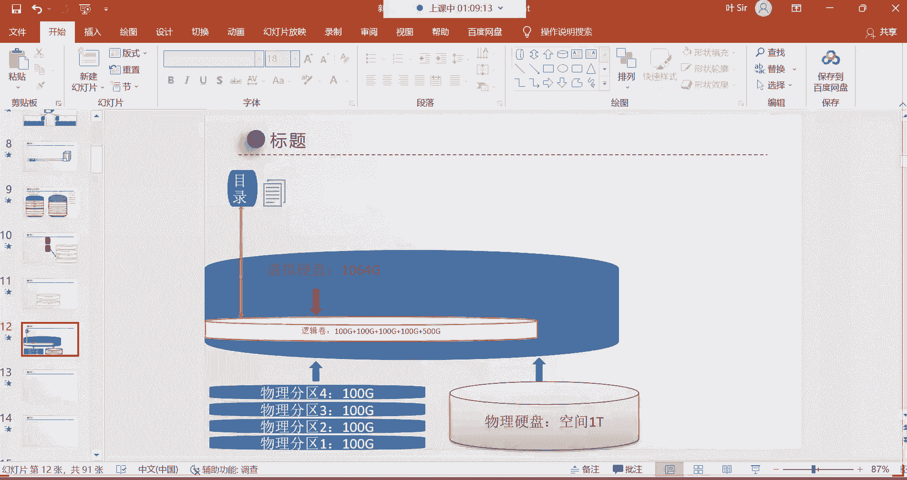

## 逻辑卷的核心概念与原理

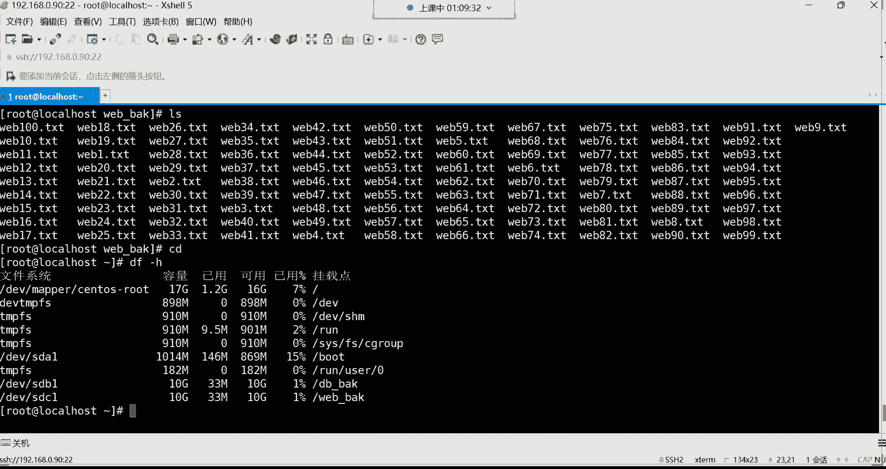

上一节我们介绍了磁盘分区和挂载，本节中我们来看看如何实现存储空间的动态管理。


逻辑卷是一种虚拟化技术，它将底层物理硬盘的空间抽象出来，形成一个可以灵活调整大小的“虚拟硬盘”。最终的数据存储仍然依赖于底层的物理硬盘，但逻辑卷提供了在物理硬盘之上进行空间动态管理的便利。


逻辑卷的空间可以不断扩展。例如，假设一个逻辑卷当前大小为400GB，当需要更多空间时，可以对其进行扩容。扩容的空间来源于底层的“虚拟硬盘”（即卷组）。如果卷组的空间不足，我们可以通过添加新的物理硬盘或分区来扩展卷组的容量。

**核心公式/概念**：
*   **物理卷（PV）**：物理硬盘或分区，是LVM的底层存储单元。
*   **卷组（VG）**：由一个或多个物理卷（PV）组成的“存储池”。
*   **逻辑卷（LV）**：从卷组（VG）中划分出来的、可供用户使用的逻辑存储单元。

**工作流程简化表示**：
`物理硬盘/分区 -> 物理卷(PV) -> 卷组(VG) -> 逻辑卷(LV) -> 文件系统 -> 挂载使用`


逻辑卷的主要特点和适用场景就是实现存储空间的动态扩容，无需像传统分区那样需要格式化整个分区来调整大小。


---


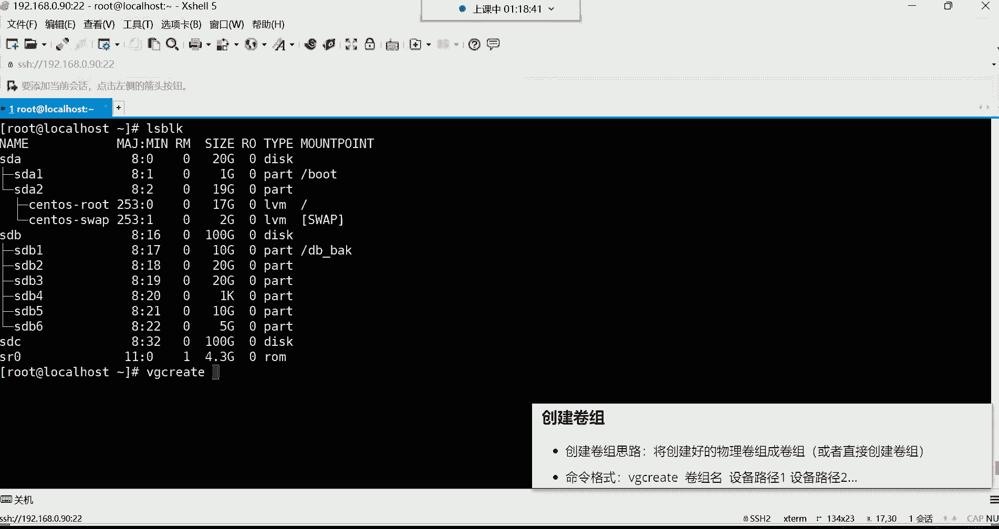

## LVM管理命令简介


以下是LVM管理中常用的命令分类，其命名非常有规律：


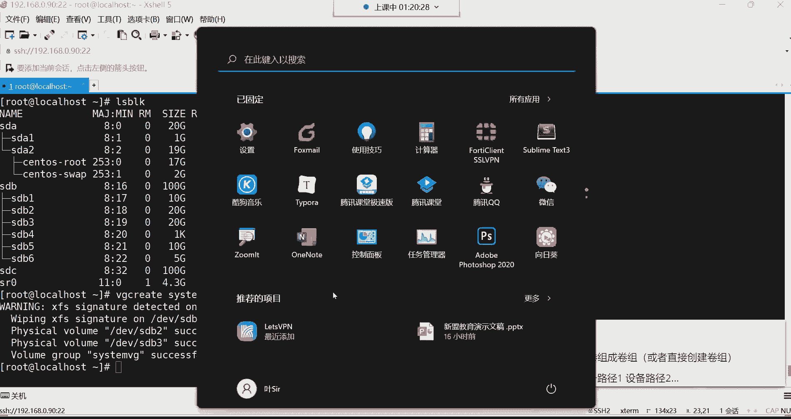

*   **创建类命令**：`pvcreate`, `vgcreate`, `lvcreate`
*   **显示类命令**：`pvdisplay`, `vgdisplay`, `lvdisplay` (以及简要命令 `pvs`, `vgs`, `lvs`)
*   **扩展类命令**：`vgextend`, `lvextend`
*   **删除类命令**：`pvremove`, `vgremove`, `lvremove`

**命令规律**：命令以管理对象（PV/VG/LV）开头，后跟操作（create/display/extend等）。例如，`vgcreate` 表示创建卷组，`lvextend` 表示扩展逻辑卷。

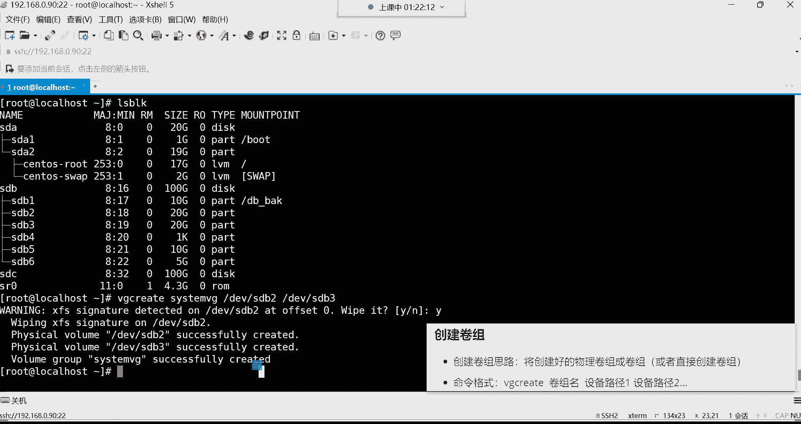

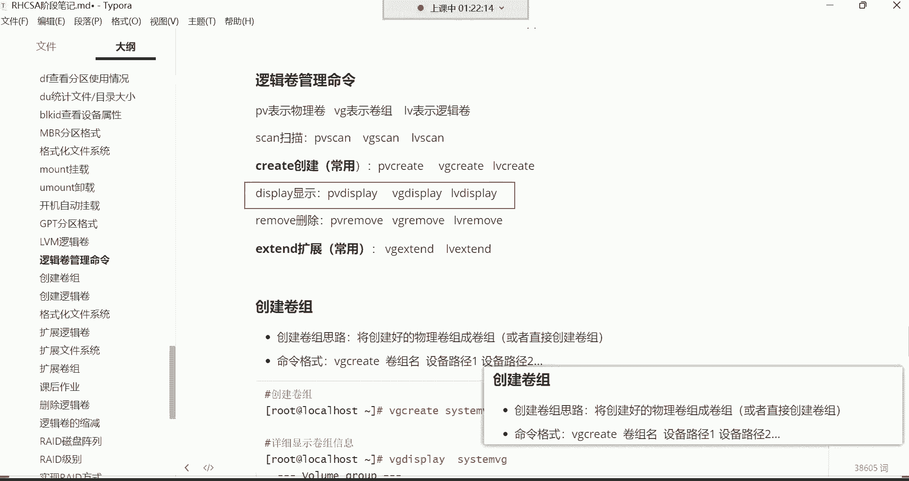

> **注意**：在CentOS 7及更高版本中，创建卷组（`vgcreate`）时，系统会自动将指定的分区初始化为物理卷（PV），因此通常无需手动执行 `pvcreate` 命令，这简化了操作步骤。


---

## 实战：创建并使用逻辑卷

接下来，我们通过一个完整的示例来演示如何创建和使用逻辑卷。我们将使用两块20GB的分区（`/dev/sdb2` 和 `/dev/sdb3`）来创建一个卷组，并从中划分一个逻辑卷。


### 步骤一：创建卷组（VG）

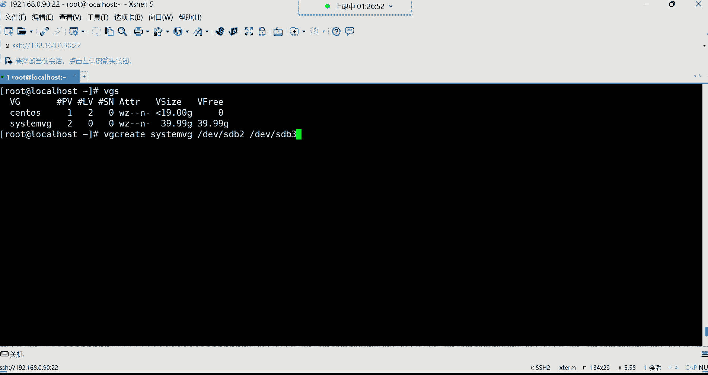

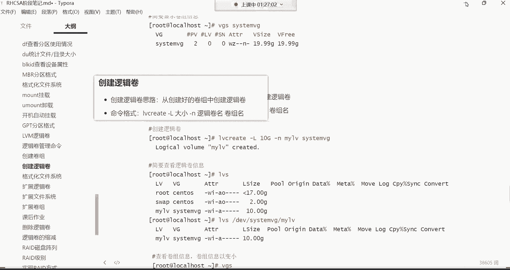

首先，我们将两个物理分区组合成一个名为 `system_vg` 的卷组。

```bash
vgcreate system_vg /dev/sdb2 /dev/sdb3
```
执行此命令时，系统可能会提示检测到现有文件系统签名并询问是否擦除。输入 `y` 确认即可，因为组成卷组的分区不需要预先格式化。

命令执行成功后，可以使用简要命令查看卷组信息：
```bash
vgs
```
输出中会显示卷组名、包含的物理卷数量、逻辑卷数量、总大小和剩余空间。

### 步骤二：创建逻辑卷（LV）

在创建好的卷组 `system_vg` 中，划分一个大小为20GB、名为 `my_lv` 的逻辑卷。

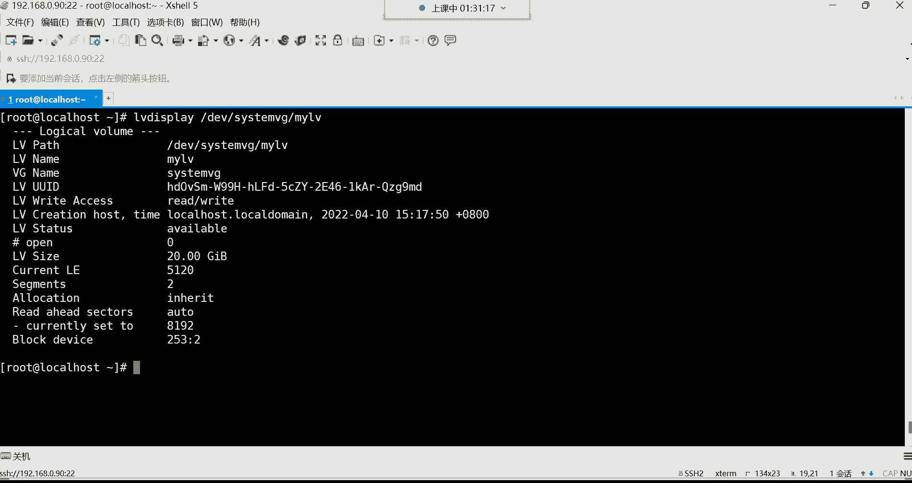


```bash
lvcreate -L 20G -n my_lv system_vg
```
*   `-L 20G`：指定逻辑卷大小为20GB。
*   `-n my_lv`：指定逻辑卷的名称为 `my_lv`。
*   `system_vg`：指定逻辑卷的空间从哪个卷组划分。

创建完成后，可以查看逻辑卷的详细信息或简要信息：
```bash
lvdisplay /dev/system_vg/my_lv
# 或使用简要命令
lvs
```
创建好的逻辑卷设备文件路径通常为 `/dev/<卷组名>/<逻辑卷名>`，本例中即 `/dev/system_vg/my_lv`。

### 步骤三：格式化并挂载逻辑卷

逻辑卷创建好后，它就像一个普通的分区，需要格式化为文件系统并挂载到目录才能使用。

1.  **格式化逻辑卷**（例如，格式化为XFS文件系统）：
    ```bash
    mkfs.xfs /dev/system_vg/my_lv
    ```

2.  **创建挂载点并挂载**：
    ```bash
    # 假设挂载到 /web_back 目录
    mount /dev/system_vg/my_lv /web_back
    ```
    使用 `df -h` 命令可以查看挂载情况，确认 `/web_back` 目录已使用新创建的逻辑卷，容量约为20GB。

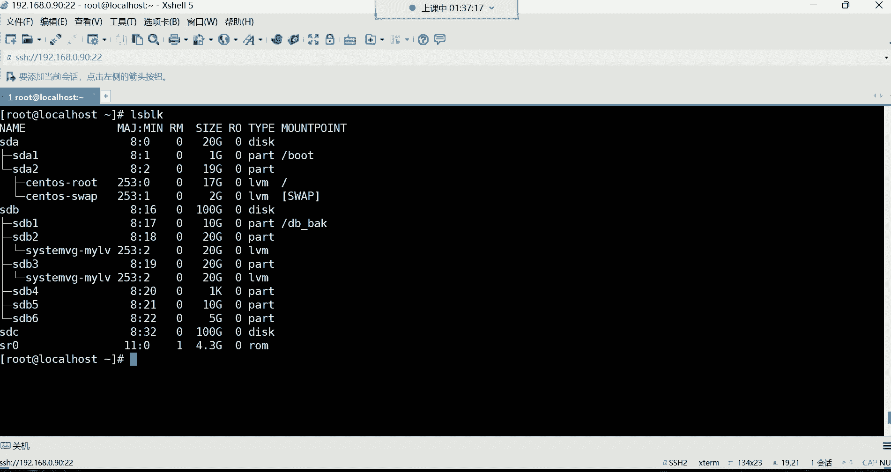

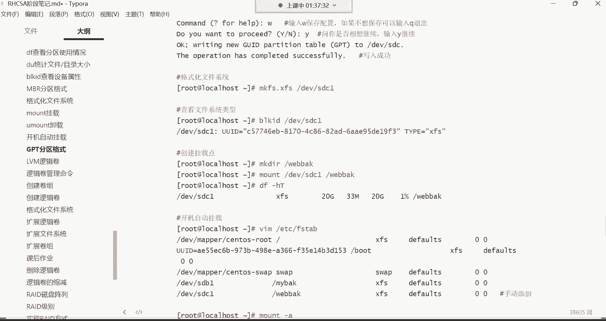

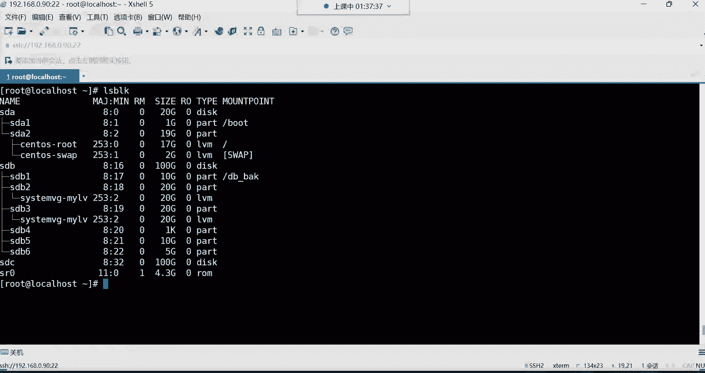


3.  **配置开机自动挂载**：
    编辑 `/etc/fstab` 文件，添加如下一行：
    ```
    /dev/system_vg/my_lv /web_back xfs defaults 0 0
    ```
    保存后，执行 `mount -a` 测试配置是否正确（无报错即表示成功）。这样系统重启后，逻辑卷会自动挂载到指定目录。


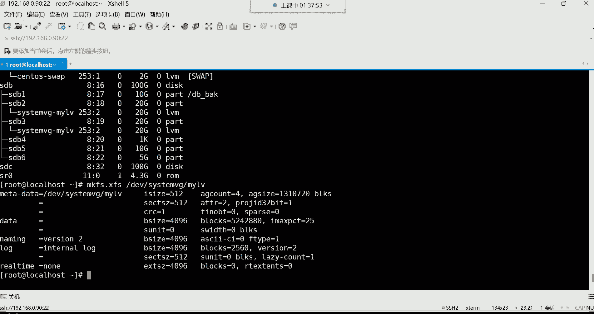

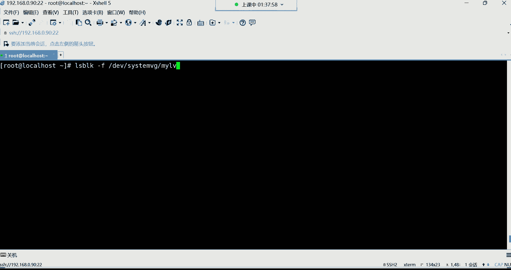

---

## 总结


本节课中我们一起学习了逻辑卷管理（LVM）的核心知识：
1.  **理解了LVM的原理**：通过物理卷（PV）、卷组（VG）、逻辑卷（LV）三层结构，实现对存储空间的灵活管理和动态扩容。
2.  **熟悉了LVM命令规律**：命令结构为 `[对象][操作]`，如 `vgcreate`（创建卷组）、`lvextend`（扩展逻辑卷）。
3.  **掌握了逻辑卷的创建与使用流程**：`创建卷组 (vgcreate) -> 创建逻辑卷 (lvcreate) -> 格式化 (mkfs) -> 挂载使用 (mount)`。
4.  **完成了实战操作**：使用两个分区创建了卷组和逻辑卷，并成功格式化、挂载及配置开机自动挂载。


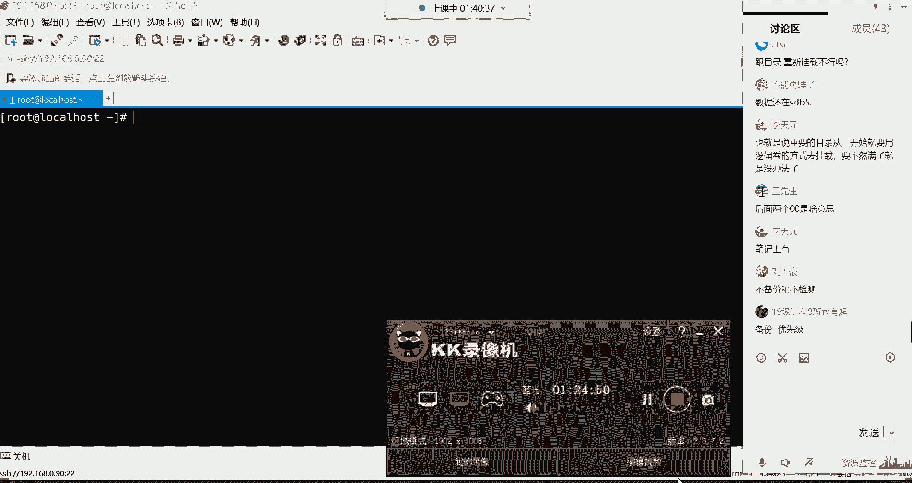


逻辑卷是Linux系统管理和运维中一项非常实用的高级磁盘管理技术，特别适合需要灵活调整存储空间的服务器环境。