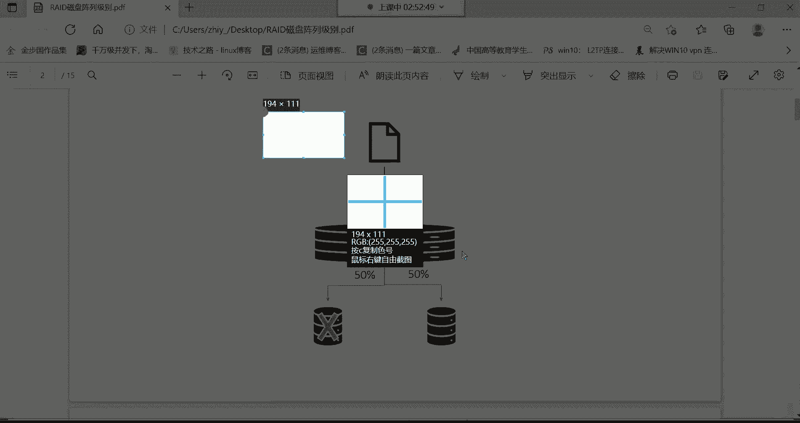
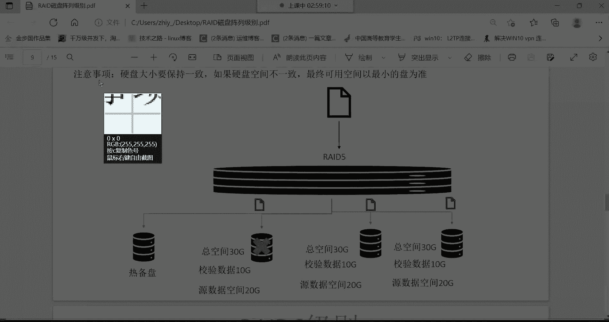
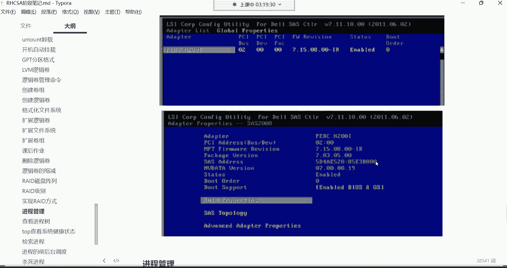
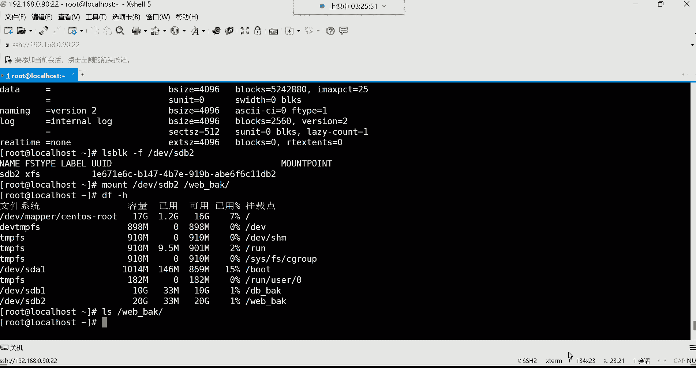

# Linux运维：P28：逻辑卷扩容与RAID磁盘阵列

在本节课中，我们将学习磁盘管理的两个核心高级主题：逻辑卷的扩容和RAID磁盘阵列技术。逻辑卷管理提供了灵活的磁盘空间管理方式，而RAID技术则用于提升磁盘的性能和可靠性。理解这些概念对于构建稳定、高效的企业级存储系统至关重要。

## 逻辑卷扩容回顾

上一节我们介绍了逻辑卷的创建与管理，本节中我们来看看如何为已存在的逻辑卷进行扩容。逻辑卷扩容通常涉及三个步骤：扩展物理卷/卷组、扩展逻辑卷本身，最后扩展其上的文件系统。

以下是逻辑卷扩容的基本命令流程：
```bash
# 1. 查看当前卷组空间
vgdisplay

# 2. 如果有新磁盘，先创建物理卷
pvcreate /dev/sdb1




# 3. 将物理卷扩展到卷组
vgextend vg_name /dev/sdb1

# 4. 扩展逻辑卷（例如增加10G）
lvextend -L +10G /dev/vg_name/lv_name

# 5. 扩展文件系统（以ext4为例）
resize2fs /dev/vg_name/lv_name
```
**注意**：对于XFS文件系统，扩展命令为 `xfs_growfs /mount_point`。

## RAID磁盘阵列详解


在了解了动态存储管理后，我们转向另一个提升磁盘子系统性能与可靠性的关键技术：RAID。RAID通过将多个物理磁盘组合成一个逻辑单元来实现特定目标。




### RAID 0：条带化阵列

RAID 0至少需要两块磁盘。其工作方式是将一份文件的数据块交替、并行地写入所有成员磁盘。

**核心特点**：
*   **公式**： 总容量 = 所有磁盘容量之和。例如，2块1T硬盘组成RAID 0，总容量为2T。
*   **优点**： 读写速度理论上可成倍提升（并行读写）。
*   **缺点**： **无冗余功能**。任何一块磁盘故障将导致所有数据丢失。
*   **适用场景**： 对性能要求极高，但对数据安全性要求不高的非关键数据。

### RAID 1：镜像阵列

RAID 1同样至少需要两块磁盘。其工作方式是将同一份数据的完整副本写入每一块成员磁盘。

**核心特点**：
*   **公式**： 总可用容量 = 单块磁盘容量。例如，2块1T硬盘组成RAID 1，可用容量为1T。
*   **优点**： **提供完全的数据冗余**。允许一块磁盘故障而不丢失数据，安全性高。
*   **缺点**： 写入速度无提升（需写入所有副本），存储空间利用率低（50%）。
*   **适用场景**： 存储极其重要的数据，如操作系统、数据库日志文件。


### RAID 5：带分布式奇偶校验的条带阵列

RAID 5是对前两者的折中方案，至少需要三块磁盘。它将数据和奇偶校验信息分布式地存储在所有磁盘上。

**核心特点**：
*   **公式**： 总可用容量 = (N-1) * 单盘容量。例如，3块1T硬盘组成RAID 5，可用容量为2T。
*   **优点**： **兼顾性能与安全**。既通过条带化提升了读写速度，又通过奇偶校验提供了冗余能力，允许一块磁盘故障。
*   **缺点**： 写入数据时需要计算奇偶校验，对性能有一定影响。重建阵列时负载较重。
*   **适用场景**： **企业中最常用的RAID级别之一**，适用于对性能和可靠性都有要求的通用文件、应用服务器。

### RAID 6：带双分布式奇偶校验的条带阵列

RAID 6是RAID 5的增强版，至少需要四块磁盘。它使用两组独立的奇偶校验数据。

**核心特点**：
*   **公式**： 总可用容量 = (N-2) * 单盘容量。例如，4块1T硬盘组成RAID 6，可用容量为2T。
*   **优点**： **更高的容错能力**。允许同时两块磁盘故障。
*   **缺点**： 写入性能比RAID 5更低（需计算两组校验），存储空间利用率也相对较低。
*   **适用场景**： 对数据安全性要求极高，允许在更换故障盘期间再坏一块盘也不影响业务，常用于大型归档存储。

### RAID 10 (1+0)：镜像与条带的结合

RAID 10先做镜像(RAID 1)，再做条带(RAID 0)，至少需要四块磁盘。


**核心特点**：
*   **公式**： 总可用容量 = (N/2) * 单盘容量。例如，4块1T硬盘组成RAID 10，可用容量为2T。
*   **优点**： **高性能与高可靠性的结合**。既拥有RAID 0的读写速度，又拥有RAID 1的数据安全性。允许每个镜像对中坏掉一块盘。
*   **缺点**： 成本高昂，存储空间利用率仅为50%。
*   **适用场景**： 对性能和可靠性要求都极高的关键业务，如数据库、高负载服务器。


## RAID的实现方式



了解了各级别的特性后，我们来看看如何实现RAID。主要有三种方式：

1.  **软件RAID**： 由操作系统内核或特定软件实现。成本低，配置灵活，但会消耗CPU资源，性能一般，且依赖于操作系统稳定性。
2.  **硬件RAID**： 通过专用的RAID控制卡实现。性能好，功能强（如带缓存、电池保护），不占用主机资源，稳定性高。是生产环境的**首选方案**。
3.  **外置RAID**： 使用独立的磁盘阵列柜。扩展性强，管理方便，但价格非常昂贵，多见于大型数据中心。

对于硬件RAID卡，配置通常在服务器启动时通过特定快捷键（如Ctrl+R）进入其配置界面（WebBIOS或类似工具）进行设置。具体操作需参考相应RAID卡的说明书。


## 总结与课后实践


本节课中我们一起学习了逻辑卷的动态扩容方法以及RAID磁盘阵列的核心知识。我们比较了RAID 0、1、5、6、10等常见级别的特性、优缺点和适用场景，并了解了软、硬件RAID的实现方式。

**核心要点总结**：
*   逻辑卷扩容是LVM的核心优势，需按步骤进行。
*   **RAID 0**追求极致速度，**RAID 1**追求绝对安全。
*   **RAID 5**在速度、安全、成本间取得了最佳平衡，是企业最常用级别。
*   **RAID 10**提供了顶级的性能与安全性，但成本最高。
*   生产环境推荐使用**硬件RAID卡**来实现RAID功能。




**课后练习**：
请在你的实验环境中，尝试为根分区（假设其为逻辑卷）扩容。例如，当前根分区为17G，请尝试为其增加10G空间。请完整演练从检查空间、扩展卷组、扩展逻辑卷到扩展文件系统的全过程。