# Linux运维入门：P2：VMware安装CentOS系统 🖥️

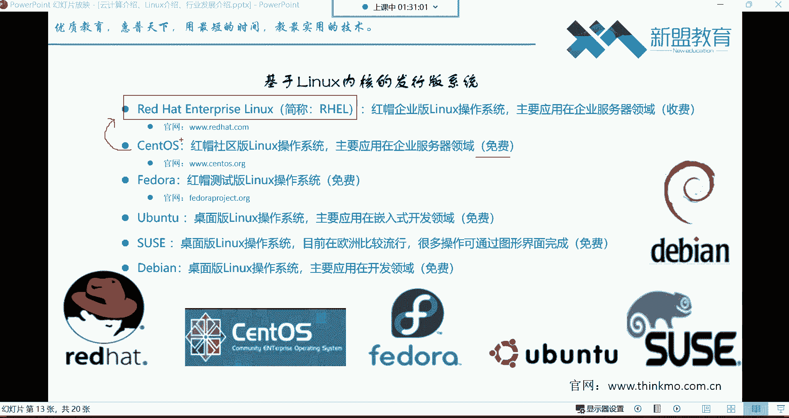

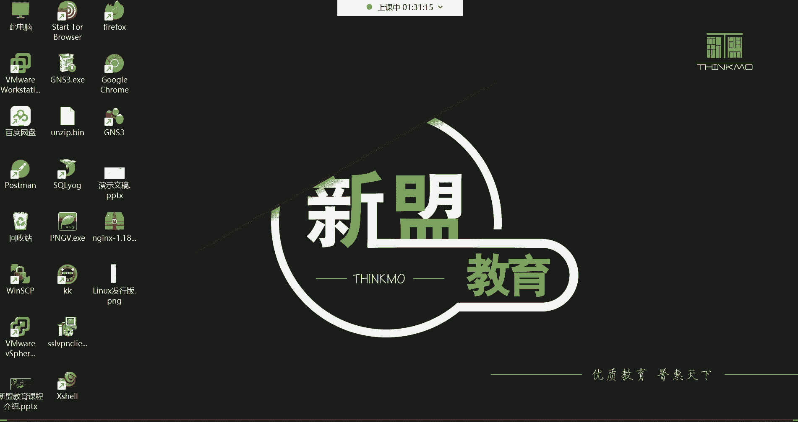

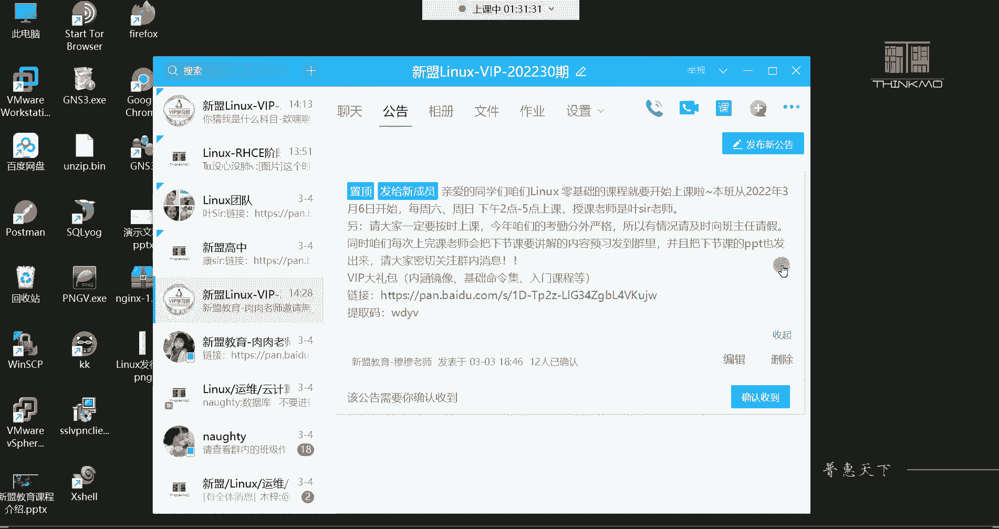

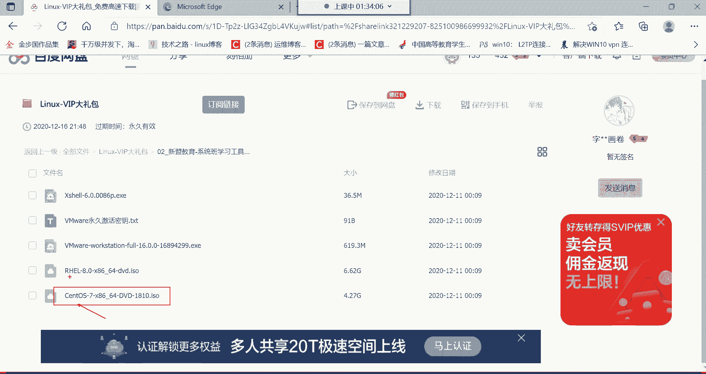

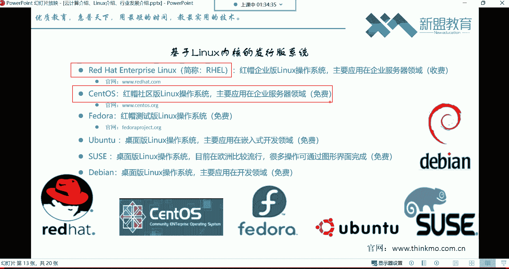

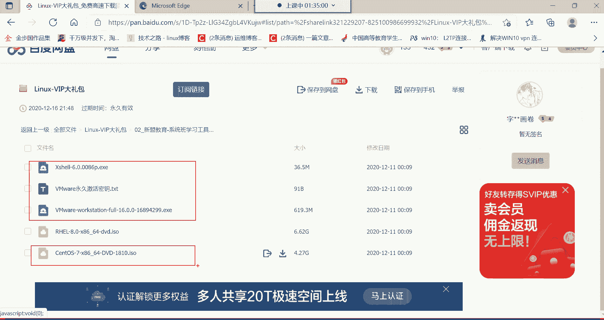

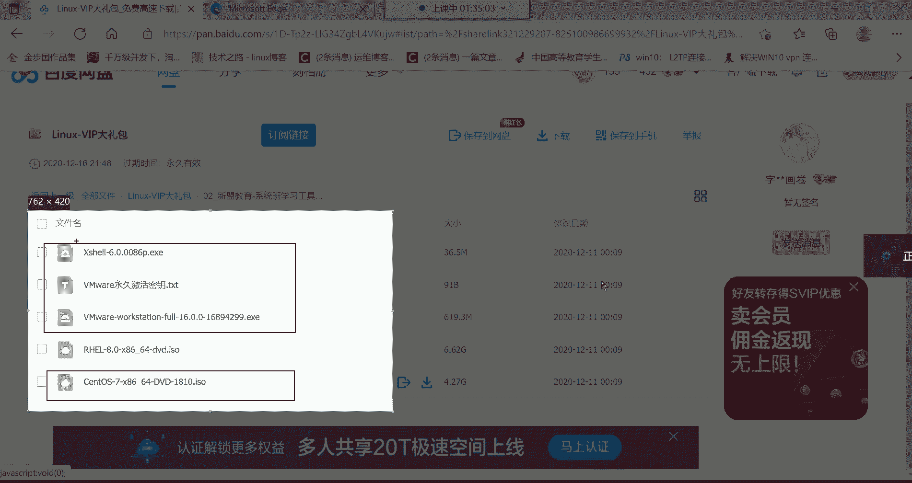

在本节课中，我们将学习如何使用VMware虚拟机软件安装CentOS操作系统。这是学习Linux运维的第一步，我们将从下载必要的软件和镜像开始，一步步完成虚拟机的创建和系统的安装。

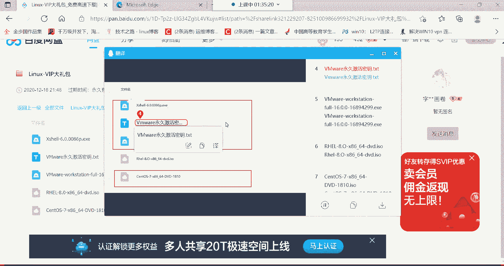

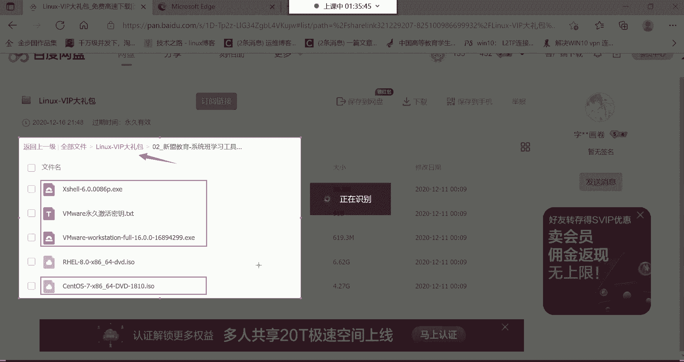

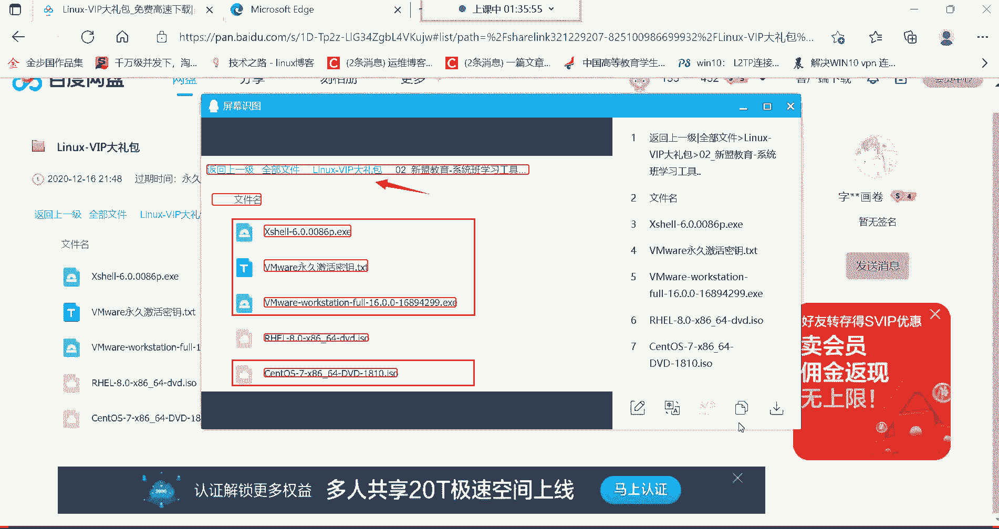

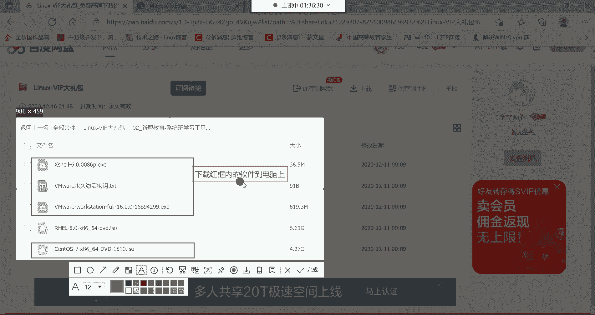

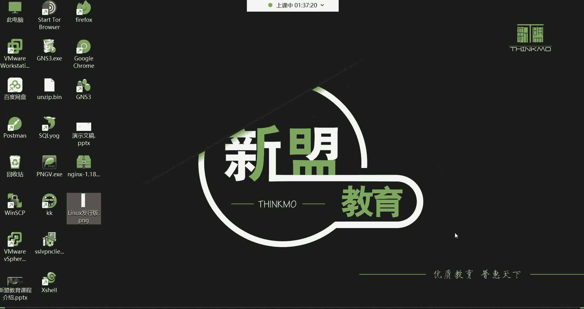

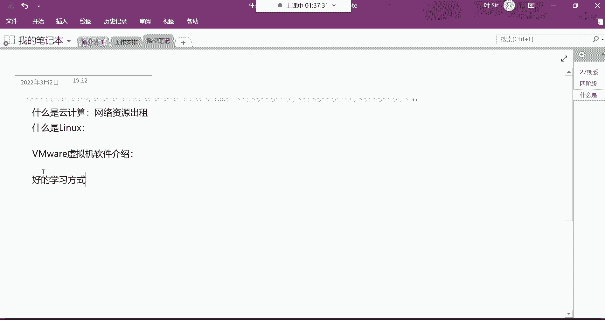

## 系统选择与准备

上一节我们介绍了课程的整体安排，本节中我们来看看如何准备安装环境。首先需要明确安装哪个Linux发行版。

CentOS和Red Hat Enterprise Linux（RHEL）关系密切。CentOS是从RHEL克隆而来的免费操作系统。两者在命令和操作使用上完全一致。学习CentOS后，在企业中遇到RHEL系统也能轻松上手。由于CentOS免费且在企业服务器领域应用广泛，本课程将以CentOS为主要学习系统。

以下是安装前需要从提供的“VIP大礼包”中下载到本地电脑的软件和文件列表：
*   **VMware Workstation**：虚拟机软件。
*   **VMware激活密钥**：用于激活VMware软件。
*   **Xshell**：远程连接工具（如果已有其他工具可不下载）。
*   **CentOS 7镜像文件**：用于安装操作系统的ISO文件。推荐使用CentOS 7版本，因为CentOS 8已停止维护。

## 创建虚拟机

准备好所需文件后，我们开始创建虚拟机。虚拟机软件的作用是在你的电脑（称为“宿主机”或“真机”）中模拟出一套完整的计算机硬件环境。

1.  双击运行VMware Workstation。
2.  点击“创建新的虚拟机”。
3.  选择“典型”配置，点击“下一步”。
4.  在安装客户机操作系统界面，选择“稍后安装操作系统”，点击“下一步”。
5.  客户机操作系统选择“Linux”，版本选择“CentOS 7 64位”，点击“下一步”。
6.  为虚拟机命名（例如：`教学机-90`），并选择虚拟机文件的存储位置（建议放在空间充足的磁盘，如固态硬盘），点击“下一步”。
7.  指定磁盘容量，默认20GB即可。此空间并非立即从宿主机划走，而是随着虚拟机使用逐渐占用。选择“将虚拟磁盘存储为单个文件”，点击“下一步”。
8.  点击“自定义硬件”，对虚拟机的硬件进行详细配置。

## 配置虚拟机硬件

在自定义硬件界面，我们可以调整虚拟机的各项硬件参数。

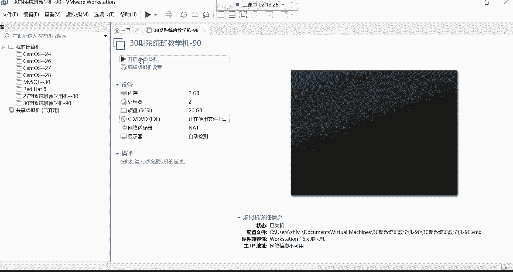

*   **内存**：建议分配2048 MB（2GB）。分配的内存是虚拟机可使用的上限，关机后不占用宿主机内存。
*   **处理器**：根据宿主机CPU情况分配。例如，可为虚拟机分配1个处理器，2个核心。
*   **新CD/DVD**：此处选择安装源。点击“使用ISO映像文件”，浏览并选择之前下载的CentOS 7镜像文件。
*   **网络适配器**：选择网络连接模式。有三种模式：
    *   **桥接模式**：虚拟机网卡与宿主机物理网卡桥接，虚拟机与宿主机需要在同一IP网段，可访问外网。适合网络环境固定的台式机。
    *   **NAT模式**：虚拟机通过宿主机共享IP访问网络，虚拟机与宿主机IP可以不在同一网段，也可访问外网。这是最常用的模式，特别适合笔记本电脑。
    *   **仅主机模式**：虚拟机仅与宿主机通信，无法访问外网。
    本教程选择 **NAT模式**。
*   **USB控制器、声卡、打印机**：这些设备通常用不到，可以选中后点击“移除”以节省资源。
9.  硬件配置完成后，点击“关闭”，然后点击“完成”。至此，一台空的虚拟机就创建好了。

## 安装CentOS系统

虚拟机创建完毕后，就可以开始安装操作系统了。

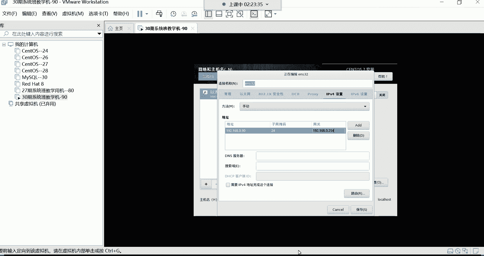

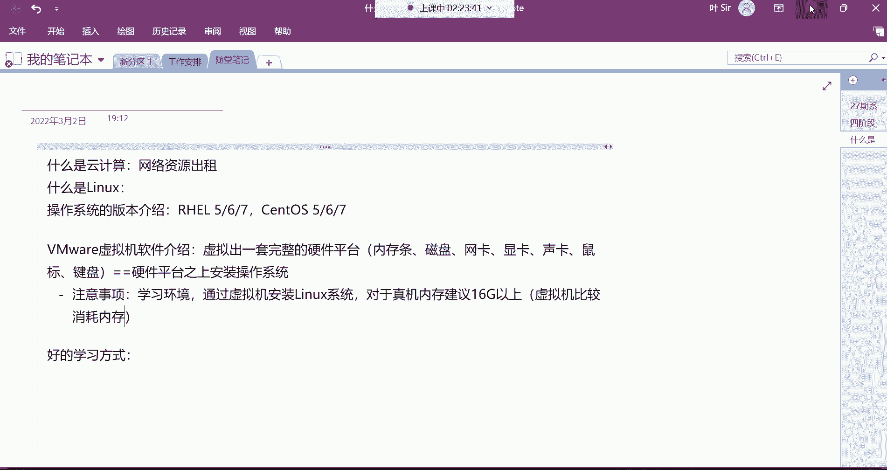

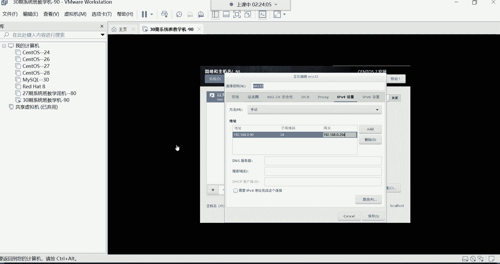

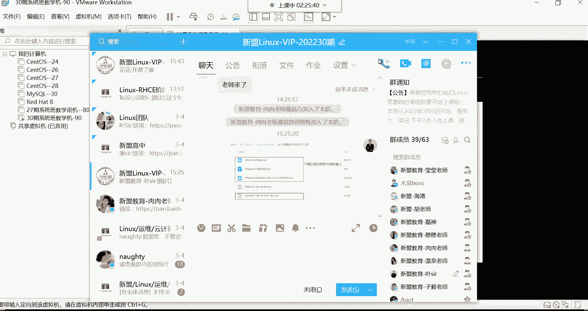

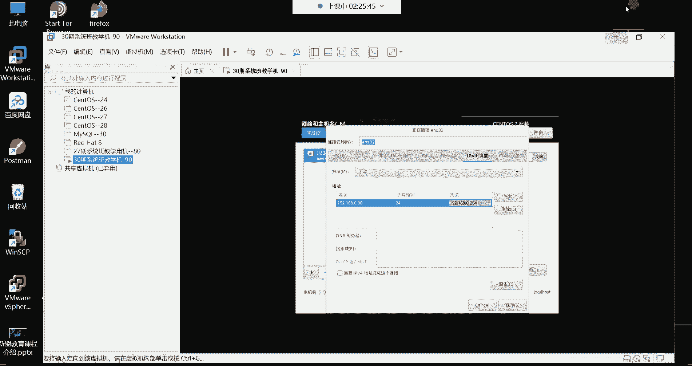

1.  点击“开启此虚拟机”。
2.  虚拟机启动后，会进入安装菜单。使用键盘上下键选择第一项“Install CentOS 7”，按回车键。
3.  系统开始加载安装程序。过程中可按 `Ctrl+Alt` 组合键将鼠标从虚拟机中释放回宿主机。
4.  进入安装界面后，首先选择语言为“中文-简体中文”，点击“继续”。
5.  进入安装信息摘要界面，需要进行以下配置：
    *   **日期和时间**：设置为亚洲/上海，并调整正确的日期和时间。
    *   **软件选择**：点击进入。对于服务器和学习环境，建议选择“最小安装”，并勾选右侧的“调试工具”等基本管理工具。这样可以获得一个纯净、高效的系统。
    *   **安装位置**：点击进入。系统会自动识别我们创建的20GB虚拟硬盘，直接点击完成即可（使用自动分区方案）。
    *   **网络和主机名**：点击进入。
        *   主机名可暂时不改。
        *   点击“配置”来设置网络。在“IPv4设置”中，将方法改为“手动”。
        *   点击“添加”按钮，配置以下网络参数（**请注意，DNS应设置为223.5.5.5**）：
            *   **地址**：`192.168.0.90`
            *   **子网掩码**：`255.255.255.0` 或 `24`
            *   **网关**：`192.168.0.254`
            *   **DNS服务器**：`223.5.5.5`
        *   配置完成后，点击“保存”。回到上一界面，将网卡开关从“关”切换到“开”。
6.  所有配置检查无误后，点击右下角的“开始安装”。
7.  安装过程中，需要设置“ROOT密码”。点击进入，为系统的超级管理员root用户设置密码（如：`1`），点击两次“完成”。
8.  同时，可以点击“创建用户”，创建一个普通用户（例如用户名：`test`，密码：`1`）。
9.  系统进入安装包部署阶段，等待其完成。安装完成后，点击“重启”。

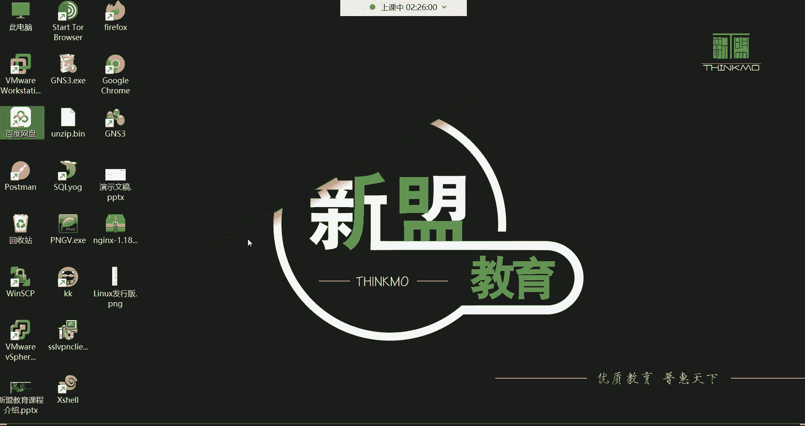

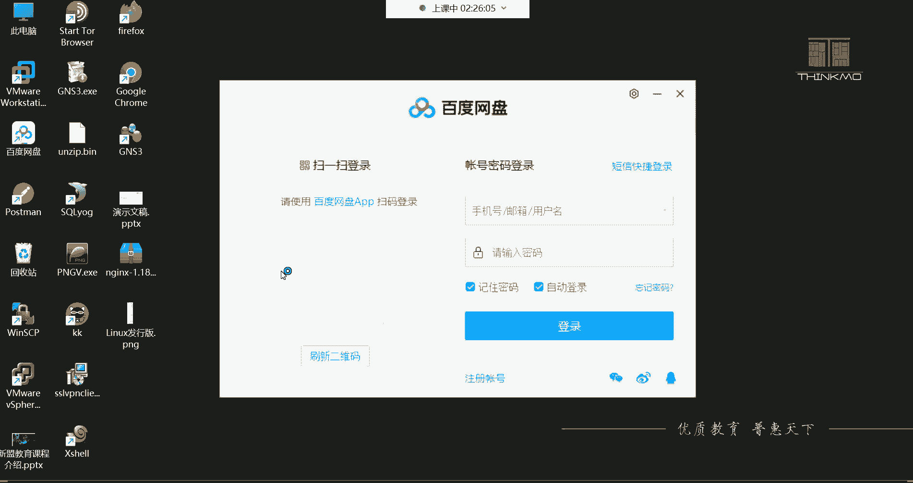

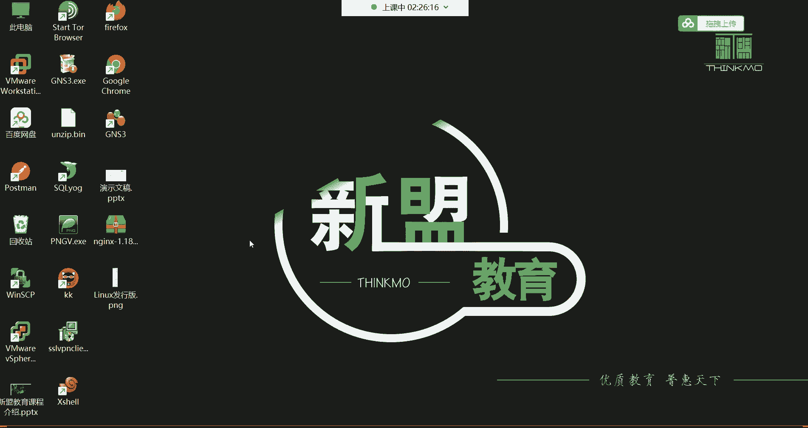

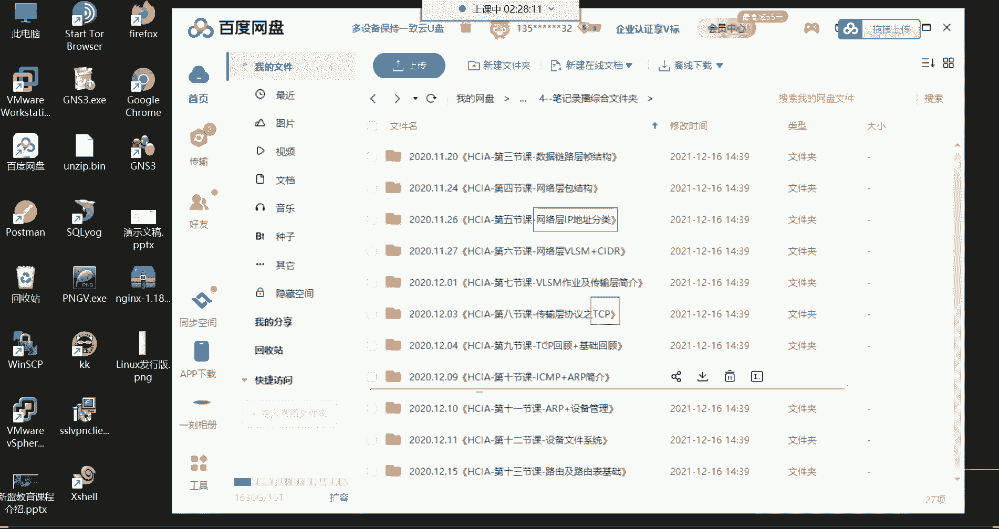

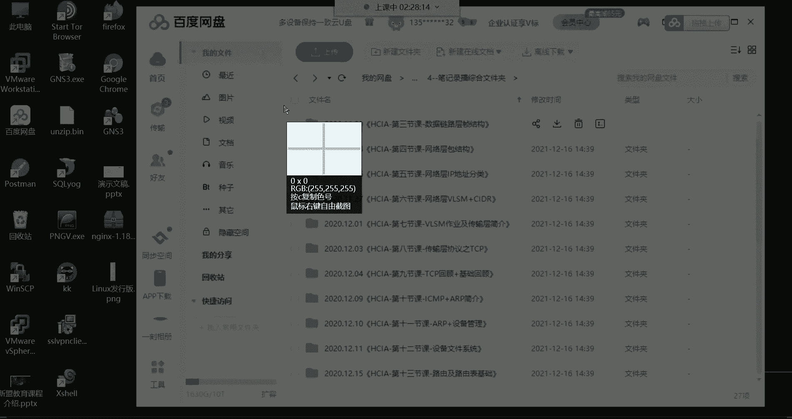

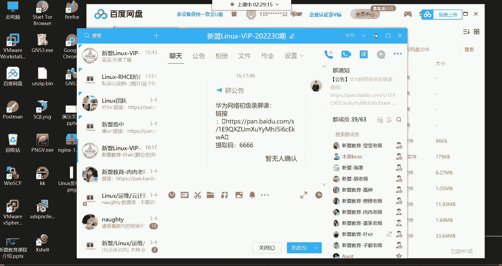

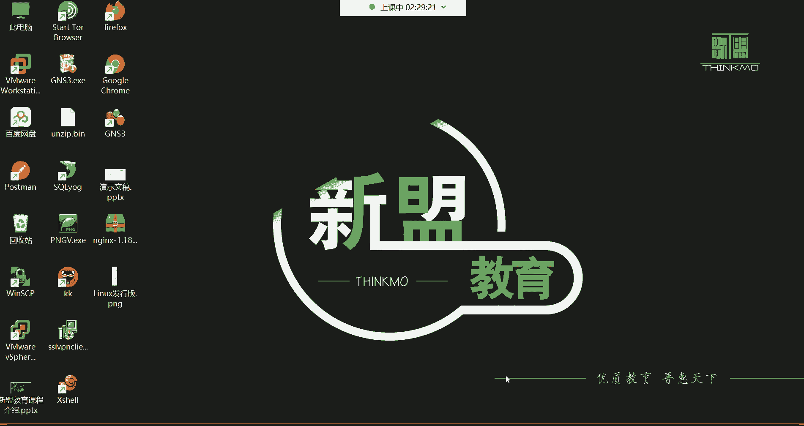

## 课程总结

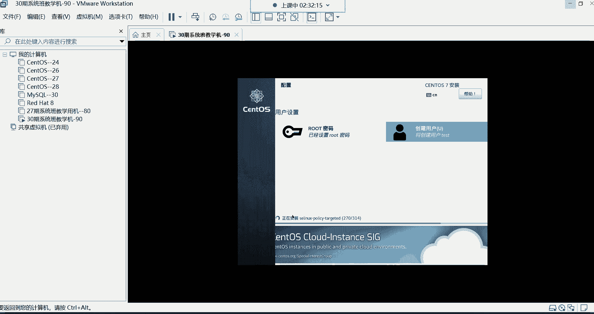

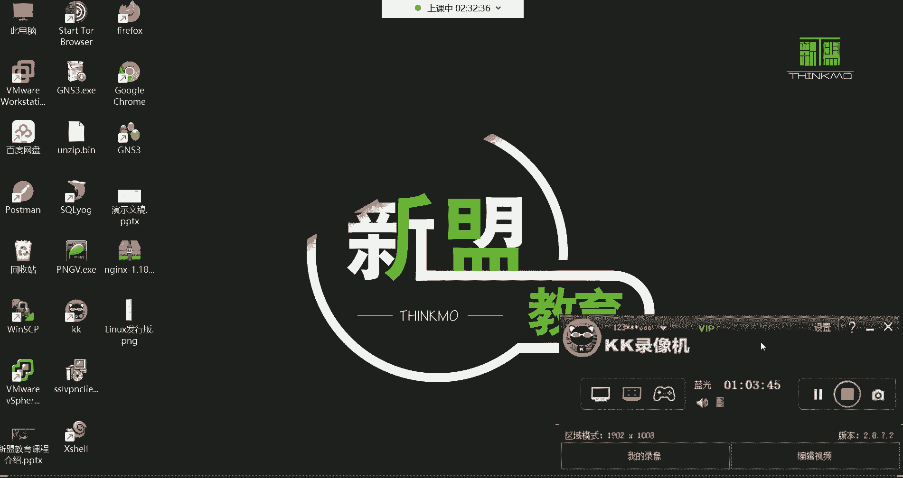

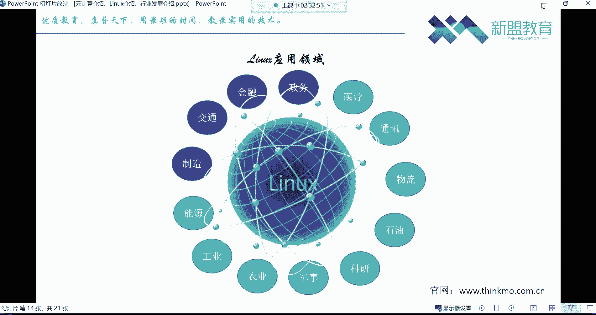

本节课中我们一起学习了Linux运维的入门第一步——使用VMware安装CentOS系统。我们了解了CentOS与RHEL的关系，准备了必要的安装文件，逐步完成了虚拟机的创建、硬件配置以及CentOS 7操作系统的安装和初始设置（包括语言、软件包、网络和用户密码）。现在，你已经拥有了一个可以开始学习和实验的Linux环境。在接下来的课程中，我们将进入这个系统，开始探索Linux的世界。