# Linux进程管理：P30：进程前后台调度、杀死进程、用户登录分析

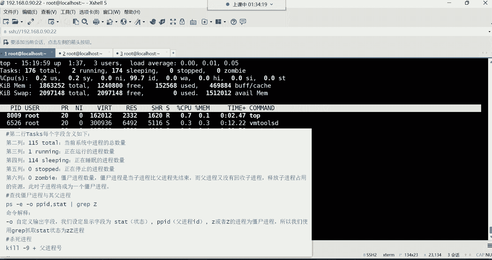

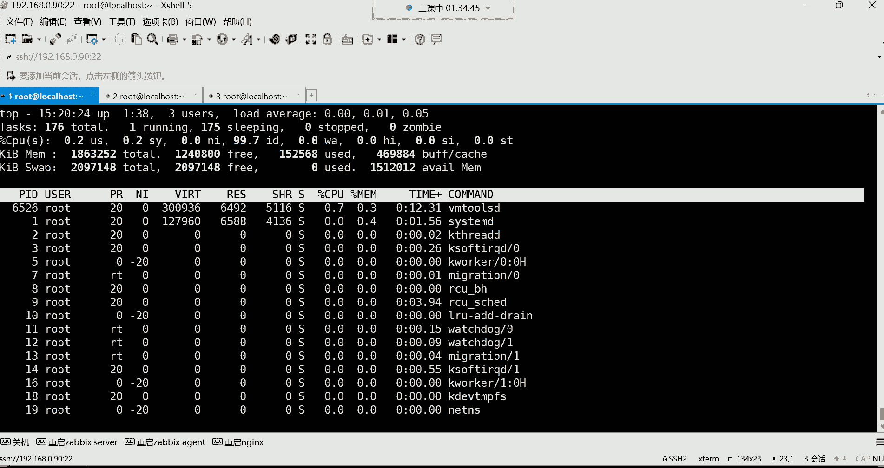

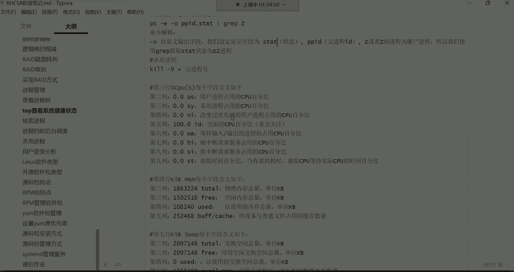

在本节课中，我们将要学习Linux系统中关于进程管理的核心操作，包括如何查看和分析进程状态、如何将进程在前后台之间调度、如何安全或强制地结束进程，以及如何分析用户的登录情况。这些技能是系统运维和故障排查的基础。

## 进程状态监控：top命令详解

上一节我们介绍了使用`ps`命令查看进程快照。本节中我们来看看一个动态监控进程的工具——`top`命令。`top`命令可以实时显示系统中各个进程的资源占用状况，类似于Windows的任务管理器。

运行`top`命令后，界面主要分为几个部分。我们首先关注最上方的几行摘要信息。

**第一行摘要信息**：
*   **当前系统时间**：例如 `10:13:16`。
*   **系统已运行时间**：例如 `up 1 day, 2:30`。
*   **当前登录用户数**：例如 `2 users`。
*   **系统平均负载**：显示过去1、5、15分钟的系统平均负载，例如 `load average: 0.00, 0.01, 0.05`。

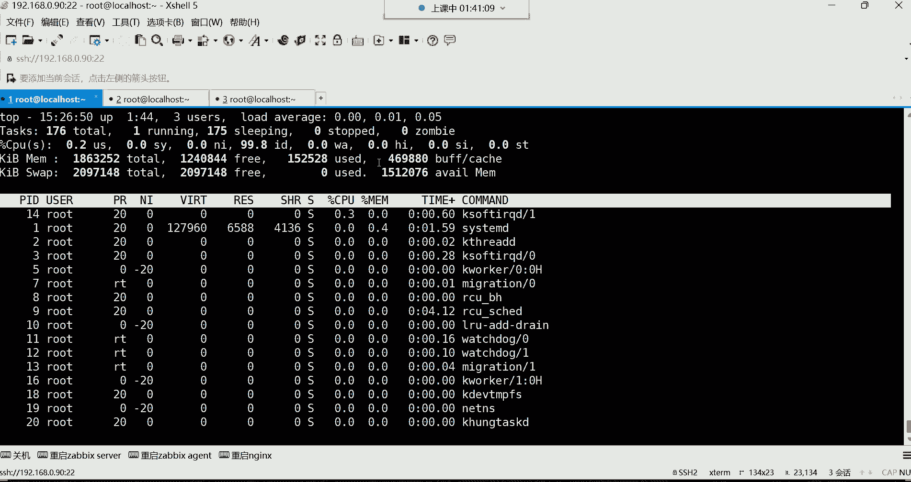

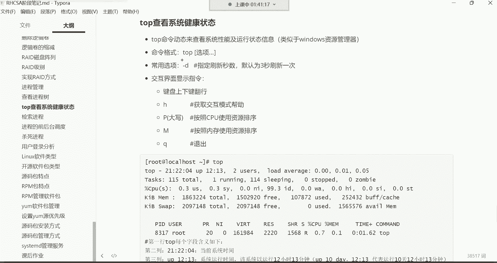

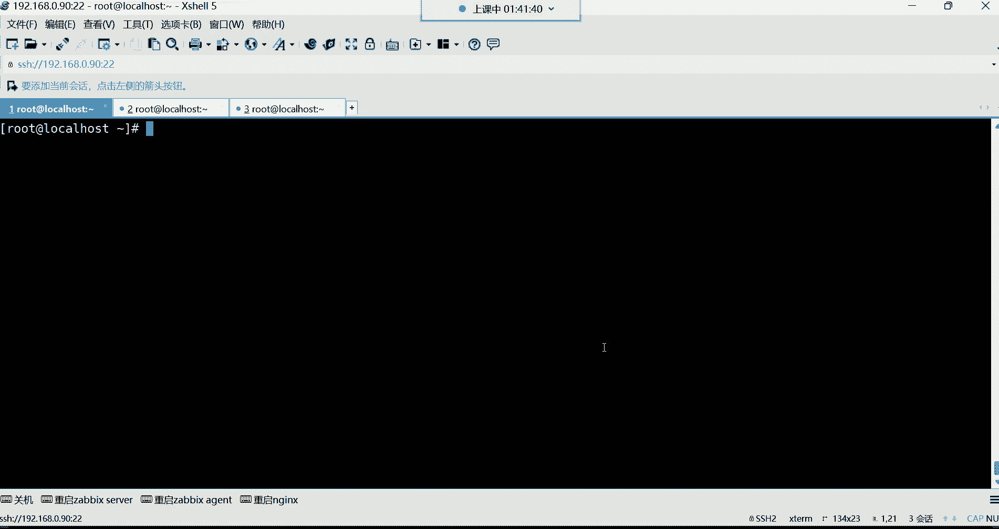

**第二行进程摘要**：
*   **总进程数**：例如 `total 185`。
*   **运行中的进程数**：状态为 `R` (running)，例如 `1 running`。
*   **休眠进程数**：状态为 `S` (sleeping)，例如 `174 sleeping`。
*   **停止的进程数**：状态为 `T` (stopped)，例如 `0 stopped`。
*   **僵尸进程数**：状态为 `Z` (zombie)，例如 `0 zombie`。僵尸进程是已结束但未被其父进程回收的进程，需要关注。

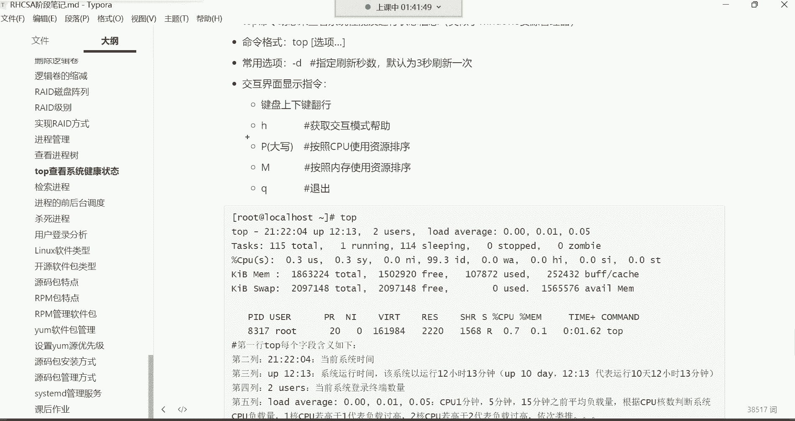

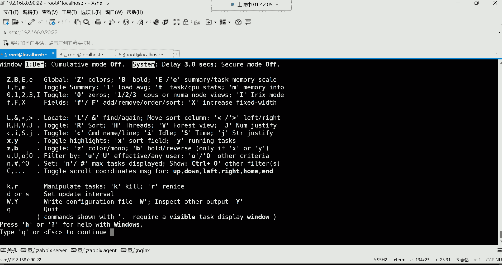

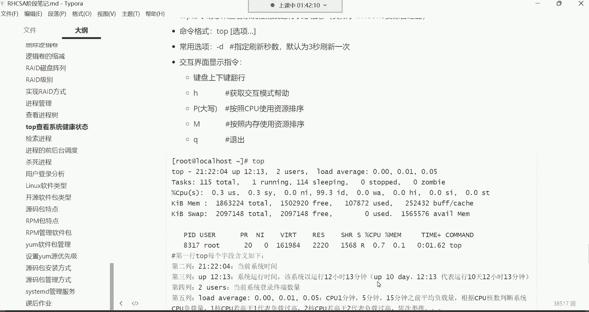

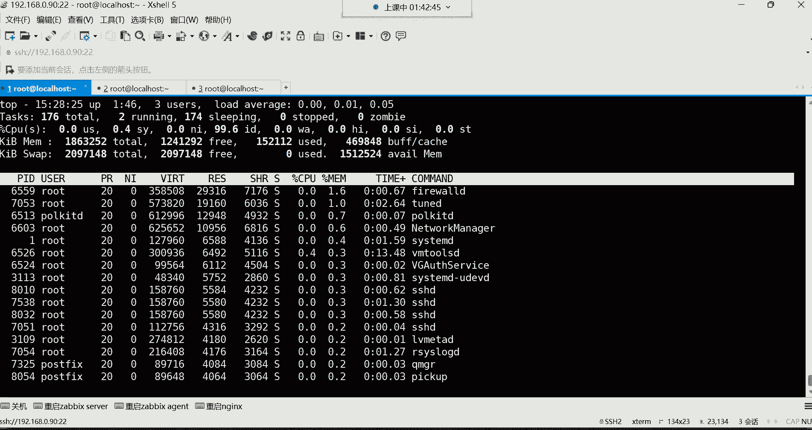

**第三行CPU状态**：
*   **用户空间占用CPU百分比**：`us` (user)，例如 `0.3%`。
*   **内核空间占用CPU百分比**：`sy` (system)，例如 `0.7%`。
*   **改变过优先级的进程占用CPU百分比**：`ni` (nice)，例如 `0.0%`。
*   **空闲CPU百分比**：`id` (idle)，例如 `99.0%`。**这是需要重点关注的指标**，如果`id`值过低（例如持续低于10%），说明CPU非常繁忙，需要排查原因。
*   其他如等待I/O的CPU时间(`wa`)、硬中断(`hi`)、软中断(`si`)等，通常关注较少。

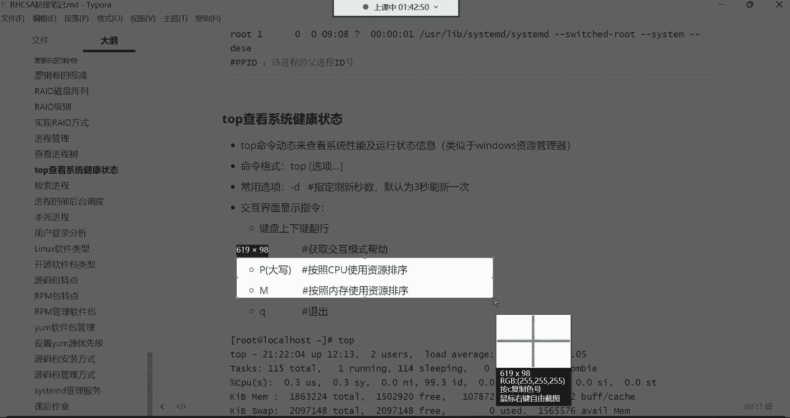

**第四、五行内存和交换分区信息**：
*   显示总内存、已用内存、空闲内存、缓冲/缓存内存等信息。但查看内存更推荐使用 `free -h` 命令，因为它以更直观的单位（如G、M）显示。

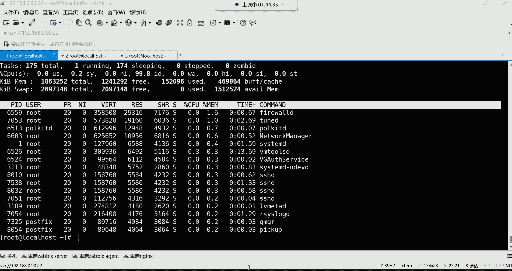

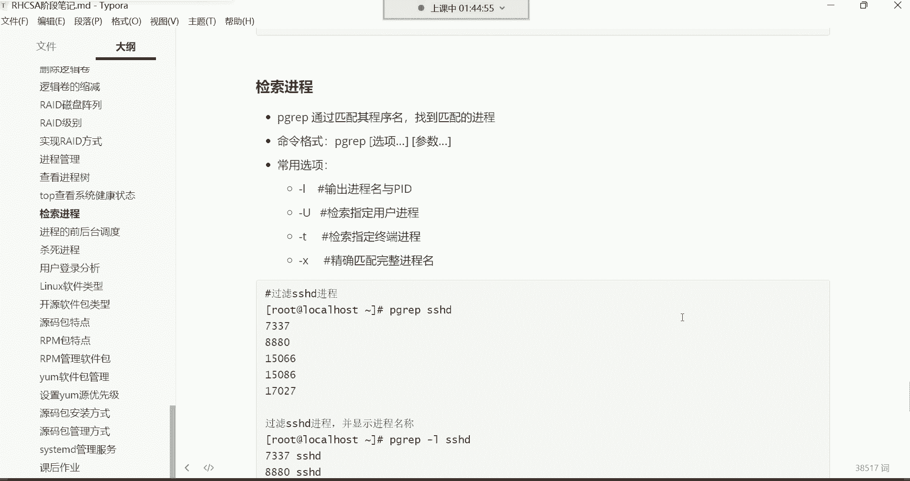

在`top`界面中，可以使用一些交互命令：
*   按 **`P`** (大写)：按照CPU使用率降序排列进程。
*   按 **`M`** (大写)：按照内存使用率降序排列进程。
*   按 **`q`**：退出`top`命令。

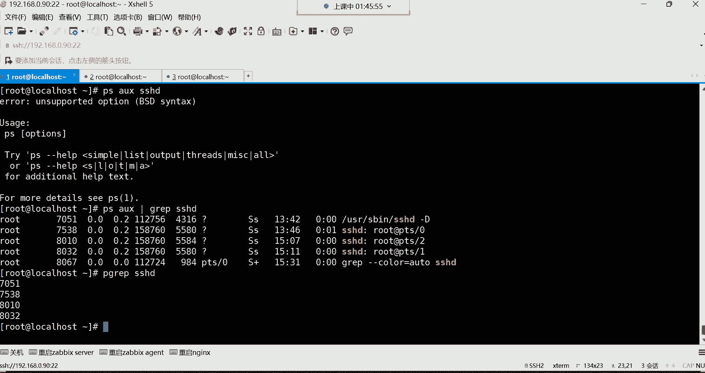

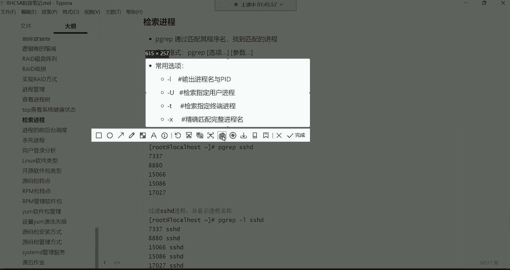

通过`top`命令，我们可以快速定位消耗CPU或内存资源最高的进程，为后续的问题排查和进程管理提供依据。

## 进程检索：pgrep命令

除了`ps`和`top`，我们还可以使用`pgrep`命令来检索进程。`pgrep`通过匹配进程名进行查找，输出相对简洁。

以下是`pgrep`命令的常用选项示例：


*   **基本检索**：`pgrep sshd` 会列出所有进程名包含“sshd”的进程ID。
*   **显示进程名**：`pgrep -l sshd` 在列出进程ID的同时也显示进程名。
*   **检索指定用户的进程**：`pgrep -l -U test` 列出属于用户`test`的所有进程。
*   **检索指定终端的进程**：`pgrep -l -t pts/1` 列出在终端`pts/1`上运行的所有进程。
*   **精确匹配进程名**：`pgrep -x sshd` 只匹配进程名恰好是“sshd”的进程。

`pgrep`命令输出信息不如`ps aux`详细，但用于快速查找特定进程的PID非常方便。

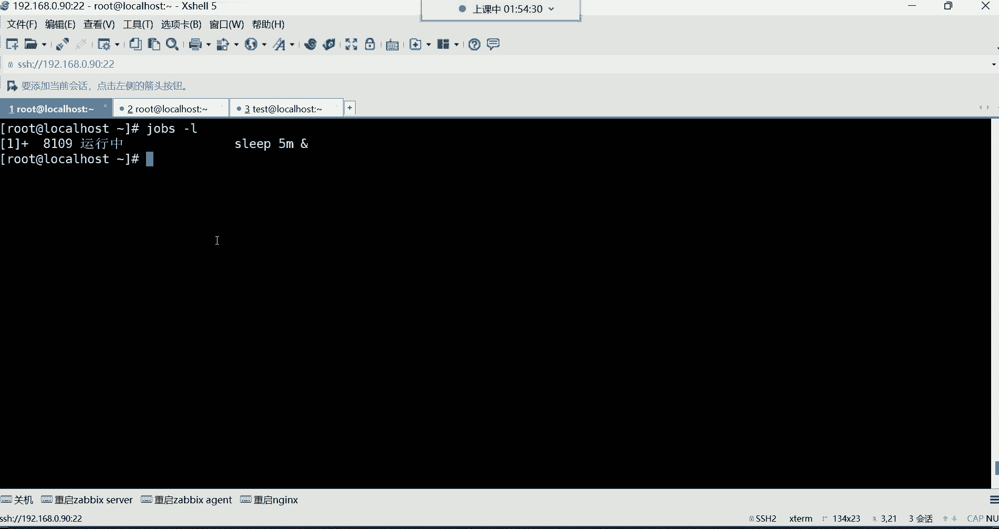

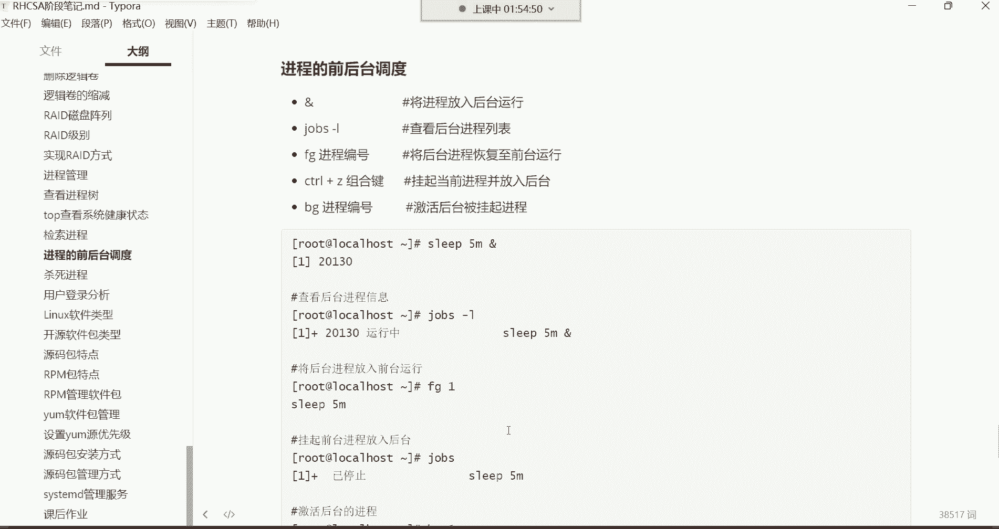

## 进程的前后台调度

在Linux终端中，进程可以运行在前台或后台。前台进程会占用当前终端，直到运行结束；而后台进程则在后台运行，不占用终端，允许用户继续输入其他命令。


以下是进程前后台调度的关键操作：

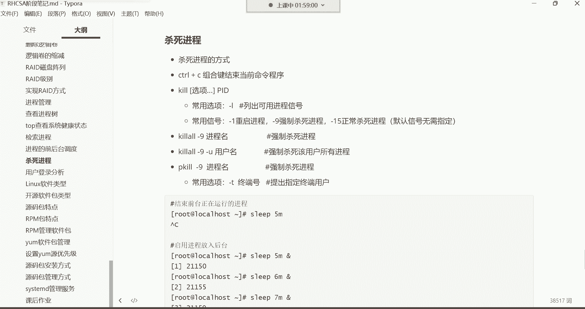

*   **将进程放入后台运行**：在命令的末尾加上 `&` 符号。
    ```bash
    sleep 300 &
    ```
    这条命令会让`sleep`进程在后台休眠300秒，同时终端可以继续使用。

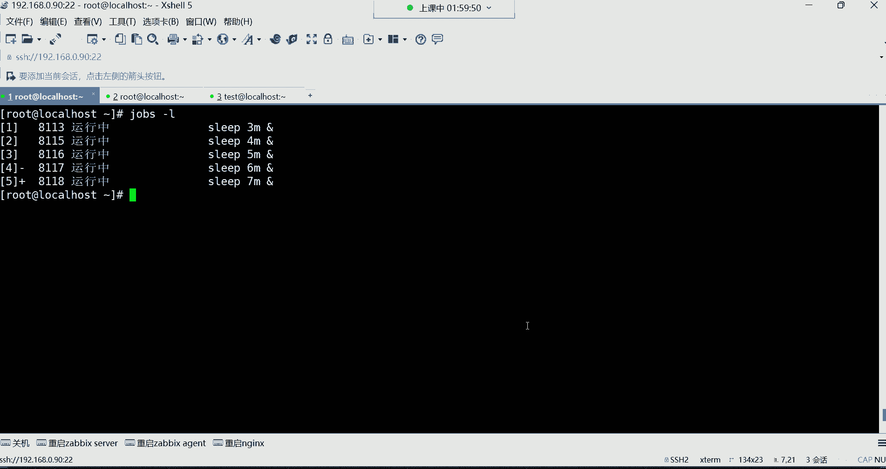


*   **查看后台进程列表**：使用 `jobs -l` 命令。
    ```bash
    jobs -l
    ```
    它会列出当前用户放入后台的进程，并显示其在后台的编号（如`[1]`）和进程PID。

*   **将后台进程调至前台**：使用 `fg` 命令加上后台编号。
    ```bash
    fg 1
    ```
    这将把后台编号为`1`的进程调到前台运行，并占用终端。

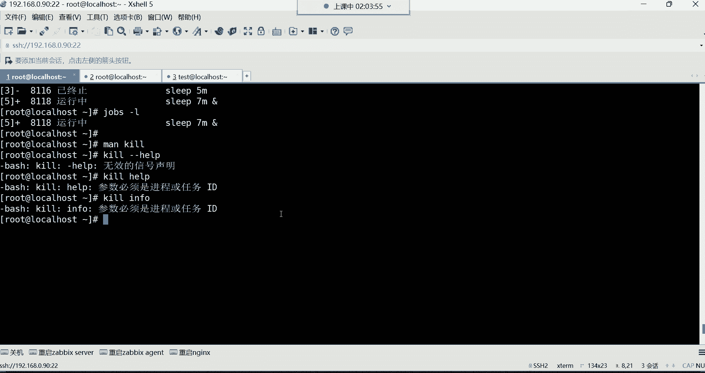

*   **挂起前台进程**：按下 `Ctrl + Z` 组合键。这会将当前正在前台运行的进程暂停，并放入后台（状态变为`stopped`）。

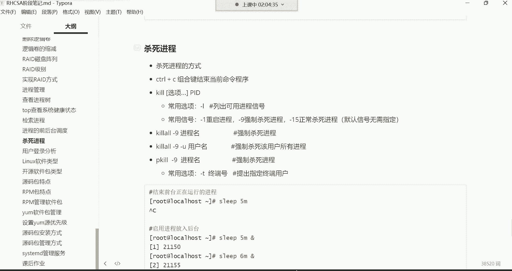

*   **让挂起的进程在后台继续运行**：使用 `bg` 命令加上后台编号。
    ```bash
    bg 1
    ```
    这会让后台编号为`1`的（被挂起的）进程在后台继续运行（状态变为`running`）。

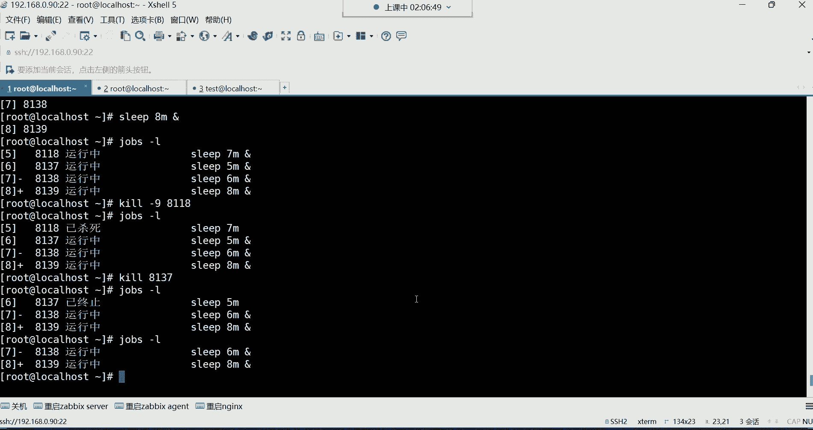

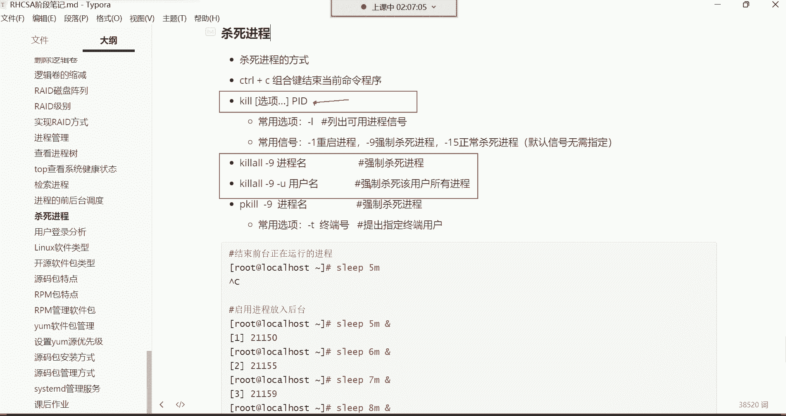

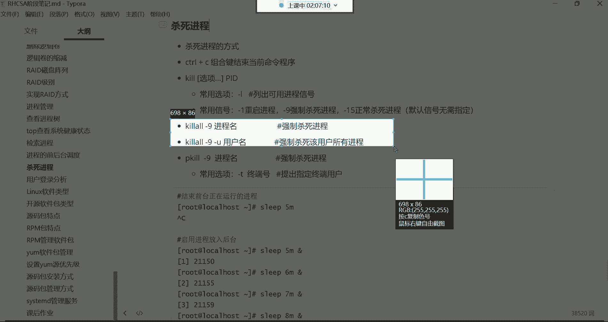

前后台调度在处理耗时任务时非常有用，例如让一个长时间的脚本在后台运行，而不阻塞当前终端。

## 杀死进程

当需要结束一个进程时，我们可以使用`kill`系列命令。结束进程时，系统会向进程发送一个信号，不同的信号代表不同的结束方式。

**常用终止信号**：
*   **`SIGTERM (15)`**：**正常终止**。这是`kill`命令的默认信号。进程收到此信号后，会进行一些清理工作再退出。
*   **`SIGKILL (9)`**：**强制终止**。进程会立即被结束，无法进行任何清理。用于无法正常结束的进程（如僵尸进程）。
*   **`SIGHUP (1)`**：**挂起**。通常用于让进程重新读取配置文件。

以下是杀死进程的命令：

*   **通过PID杀死进程**：使用 `kill` 命令。
    ```bash
    kill 1234         # 正常结束PID为1234的进程 (发送SIGTERM信号)
    kill -9 1234      # 强制结束PID为1234的进程 (发送SIGKILL信号)
    ```

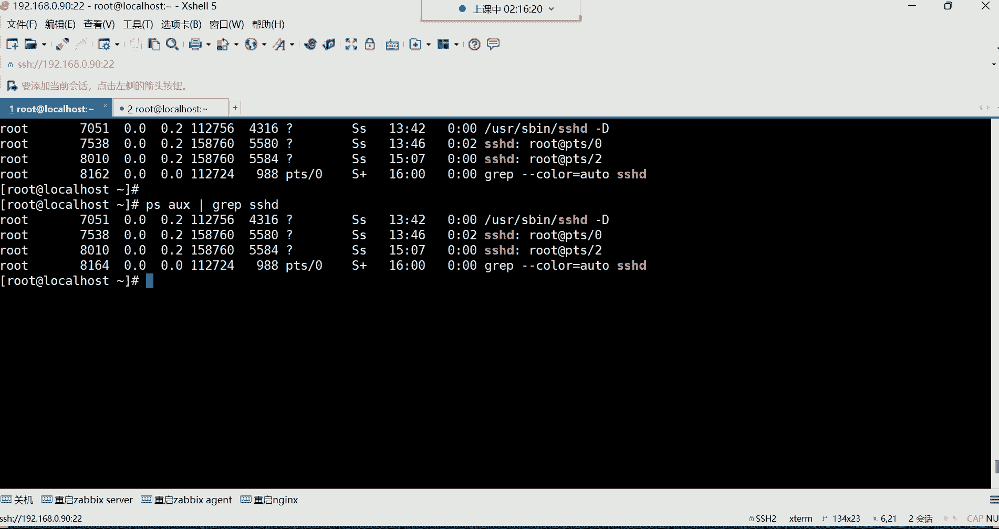


*   **通过进程名杀死进程**：使用 `pkill` 命令。它会杀死所有匹配指定名称的进程。
    ```bash
    pkill sleep       # 正常结束所有名为sleep的进程
    pkill -9 sleep    # 强制结束所有名为sleep的进程
    ```
    使用`pkill`可以一次性结束多个同名进程，更为彻底。


*   **杀死指定用户的所有进程**：使用 `pkill -U` 命令。
    ```bash
    pkill -9 -U test  # 强制结束用户test的所有进程
    ```
    这常用于将某个用户踢出系统。


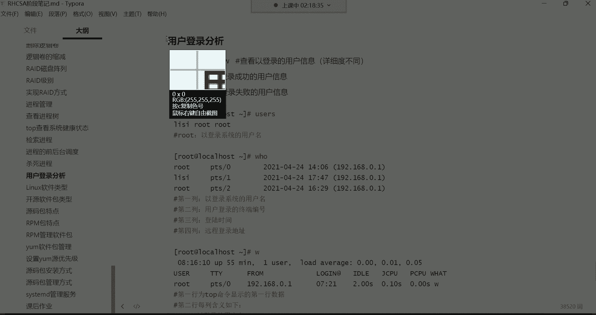

*   **通过终端杀死进程**：使用 `pkill -t` 命令。
    ```bash
    pkill -9 -t pts/3 # 强制结束在终端pts/3上运行的所有进程
    ```

**注意**：强制杀死(`-9`)进程可能导致数据丢失或状态不一致，应优先尝试正常结束(`kill` 不加 `-9`)。


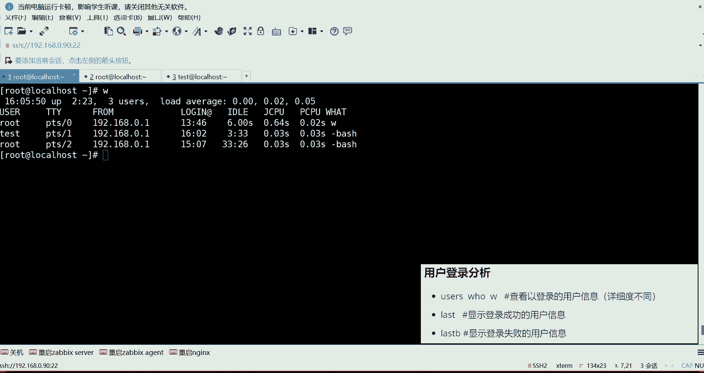

## 用户登录分析

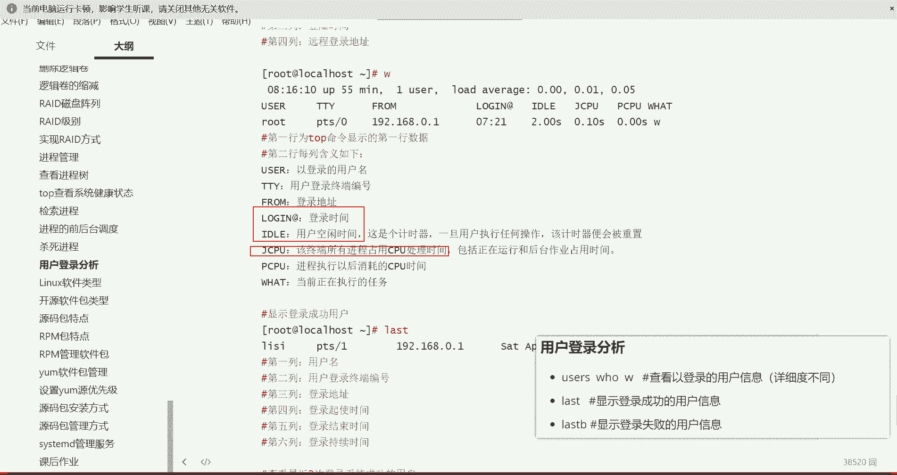

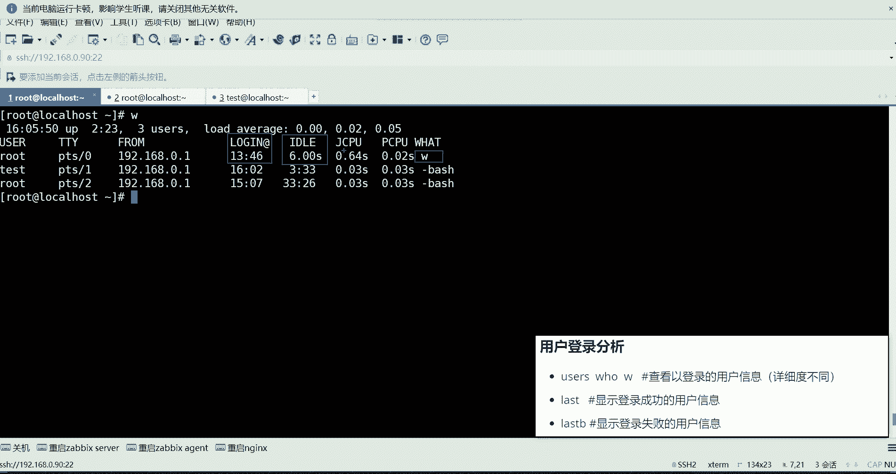

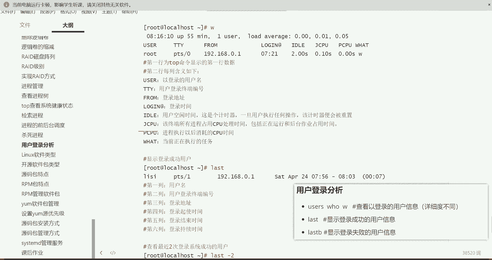

了解谁正在或曾经登录系统，是系统安全管理的重要部分。

**查看当前已登录的用户**：
*   **`who` 命令**：显示简洁的登录信息，包括用户名、终端、登录时间和来源IP。
    ```bash
    who
    ```
*   **`w` 命令**：显示更详细的信息，包括`who`命令的信息，以及用户当前正在执行的命令和系统负载。
    ```bash
    w
    ```
*   **`users` 命令**：仅显示当前登录的用户名列表，最为简洁。

**查看历史登录记录**：
*   **`last` 命令**：查看**成功登录**系统的历史记录。它会显示登录用户名、终端、来源IP、登录起止时间。
    ```bash
    last
    ```
*   **`lastb` 命令**：查看**登录失败**的历史记录。这对于发现恶意登录尝试非常有用。
    ```bash
    lastb
    ```
    注意：首次使用`lastb`可能需要root权限，并且可能没有记录，可以尝试几次错误的登录后再查看。

通过这些命令，系统管理员可以监控系统的访问情况，及时发现异常登录行为。

## 总结

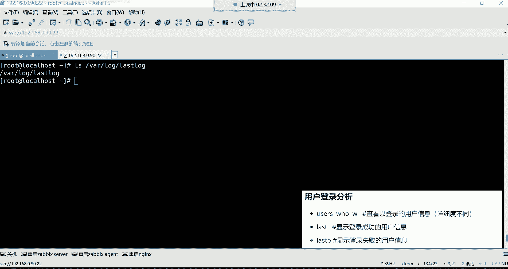

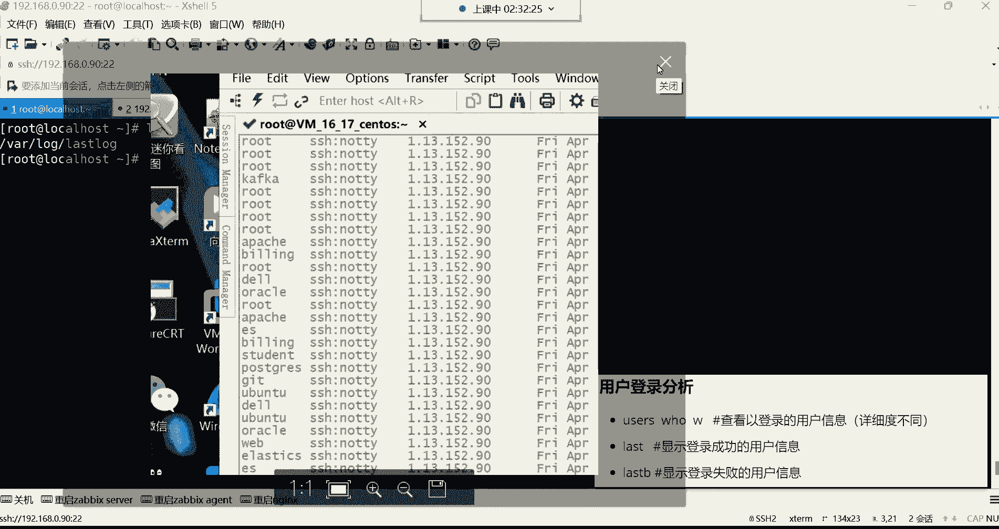

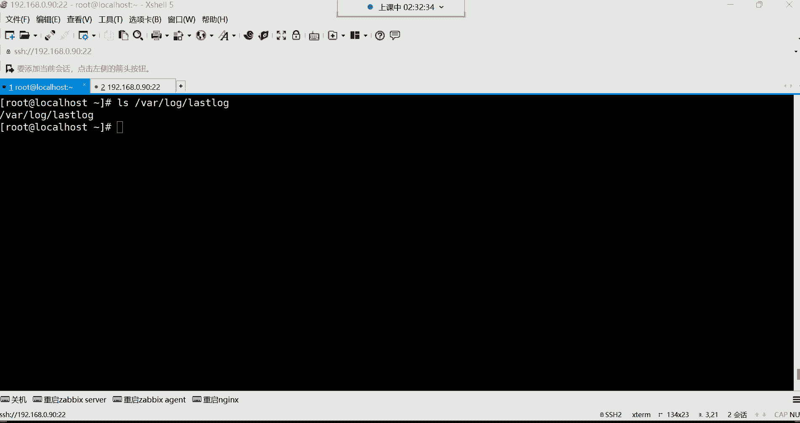

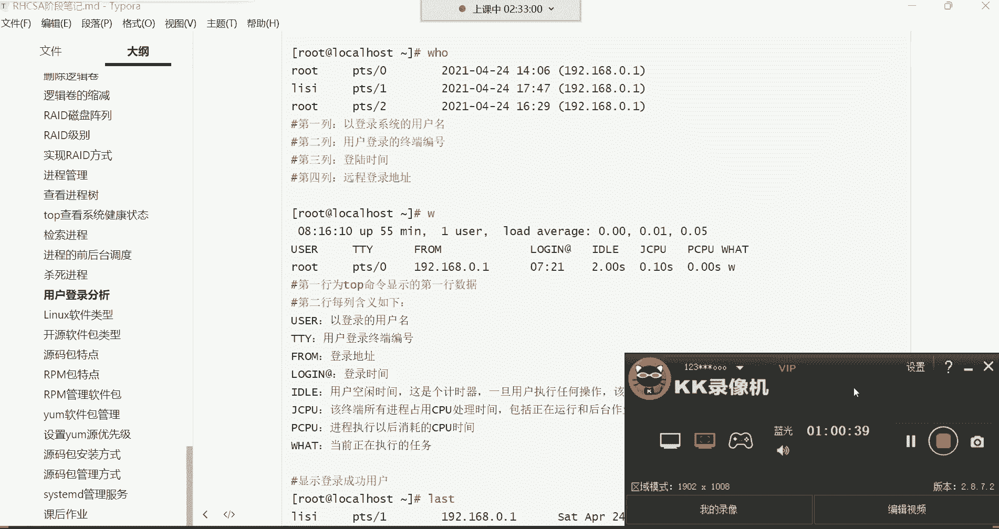

本节课中我们一起学习了Linux进程管理的核心操作。我们掌握了使用`top`命令动态监控系统状态和进程资源消耗；学会了使用`&`符号和`jobs`、`fg`、`bg`命令进行进程的前后台调度；理解了通过`kill`和`pkill`命令，并配合不同的信号（如`SIGTERM`和`SIGKILL`）来正常或强制结束进程；最后，我们了解了如何使用`who`、`w`、`last`、`lastb`等命令来分析用户的登录情况。这些技能是进行系统日常维护、性能优化和安全审计的基础。