# Linux软件包管理：31：Linux系统软件包类型介绍、源码包与RPM包特点、RPM命令管理软件包

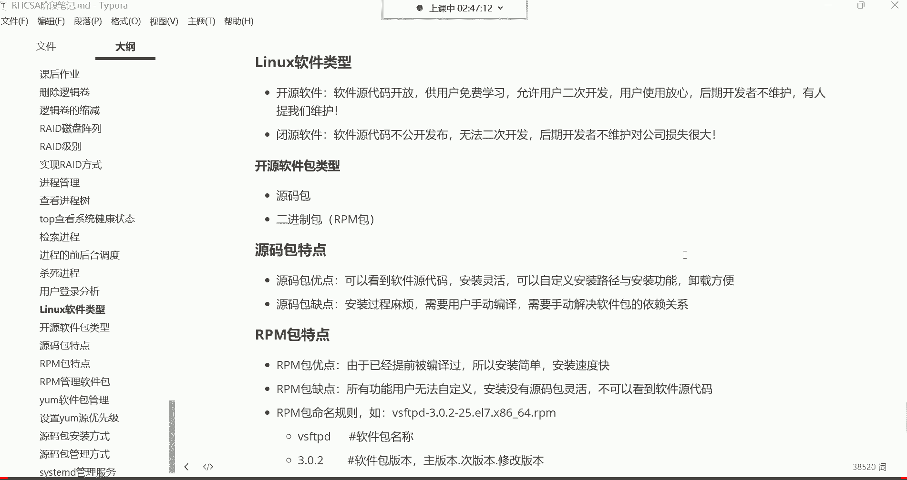


在本节课中，我们将要学习Linux系统中软件包的基本概念、不同类型软件包的特点，以及如何使用RPM命令来管理二进制软件包。掌握软件包管理是Linux运维工程师的核心技能之一。


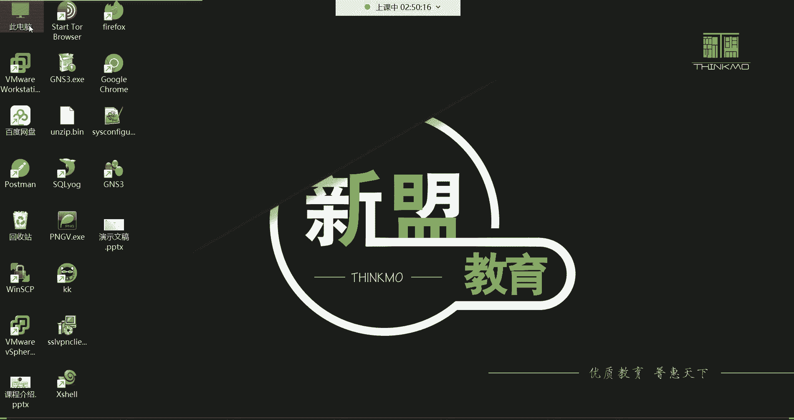


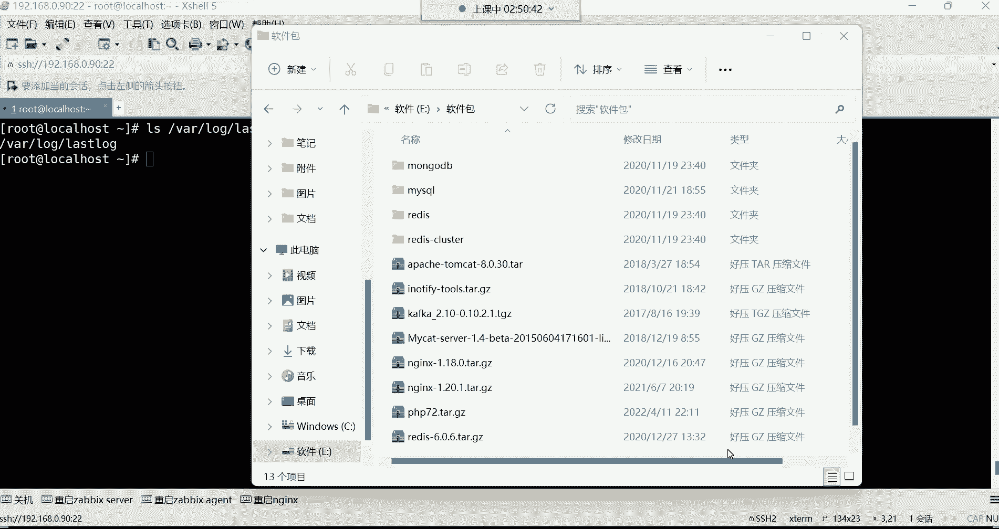

## 软件包管理的重要性

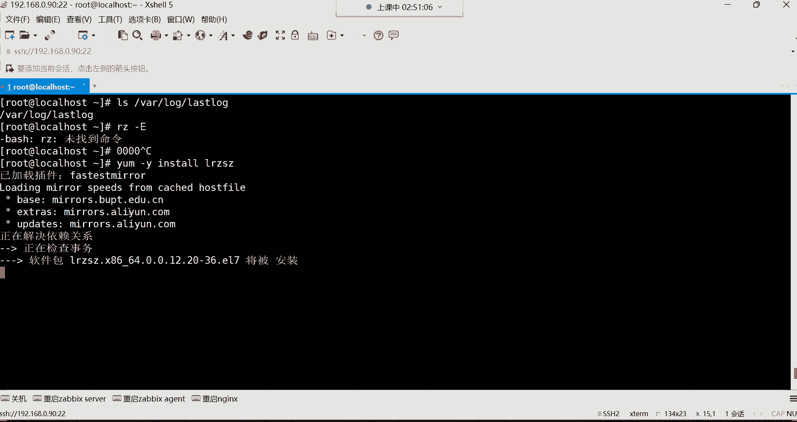


上一节我们学习了文件压缩与归档，本节中我们来看看软件包管理。对于任何操作系统而言，安装和管理软件都是核心任务。在Linux系统中，我们通过软件包来安装、更新和移除应用程序、服务及工具。无论是部署网站、数据库还是其他服务，都离不开软件包管理。


## 开源软件与闭源软件


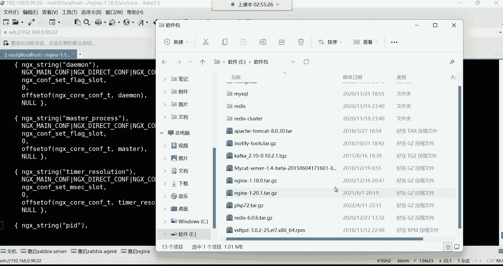

在深入了解软件包类型之前，我们需要理解开源与闭源的概念。

*   **开源软件**：源代码公开，允许用户查看、修改和二次开发。例如，淘宝基于Nginx二次开发了Tengine服务器。开源软件的优势在于透明度高、社区支持强大，即使原开发者停止维护，也会有其他贡献者接手。
*   **闭源软件**：源代码不公开，用户无法查看和修改。例如，微软的Windows操作系统。闭源软件的缺点是，一旦官方停止支持，用户很难自行修复问题。


需要注意的是，开源不等于免费，有些开源软件会为高级功能或技术支持收费。


## 软件包类型：源码包与RPM包


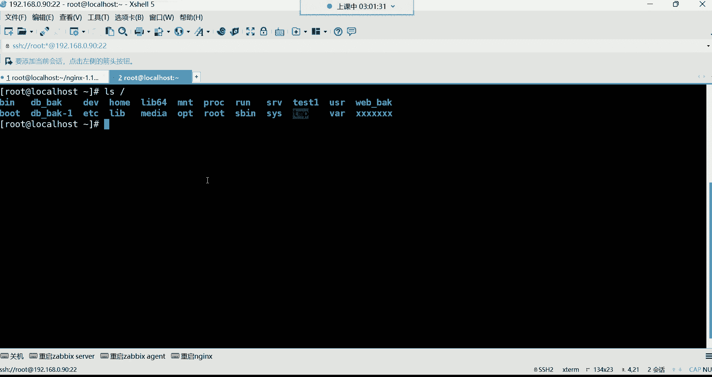

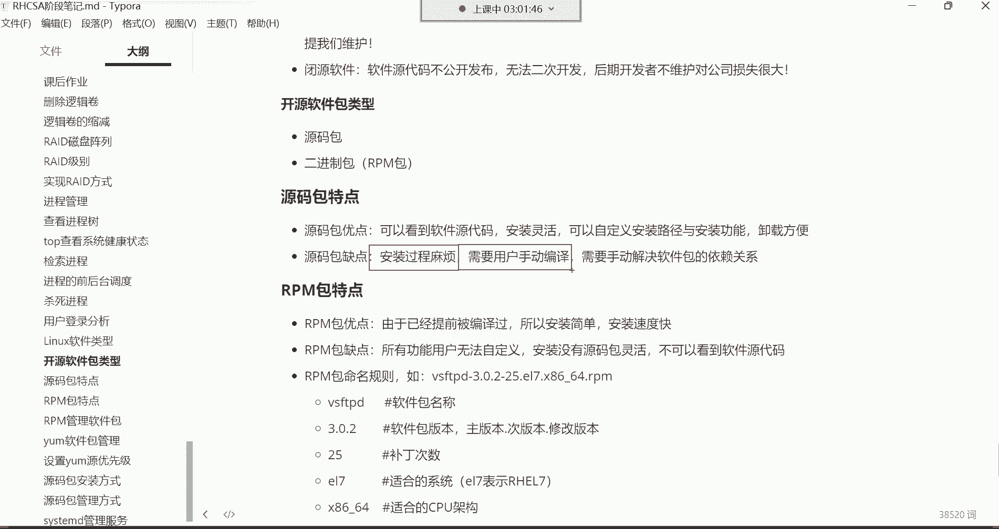

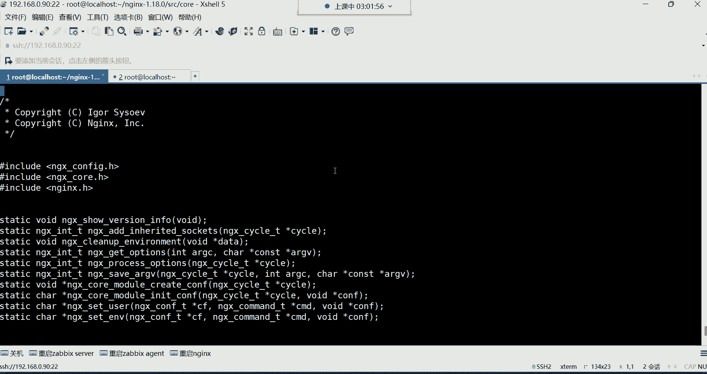

Linux下的软件包主要分为源码包和二进制包（如RPM包）两大类。

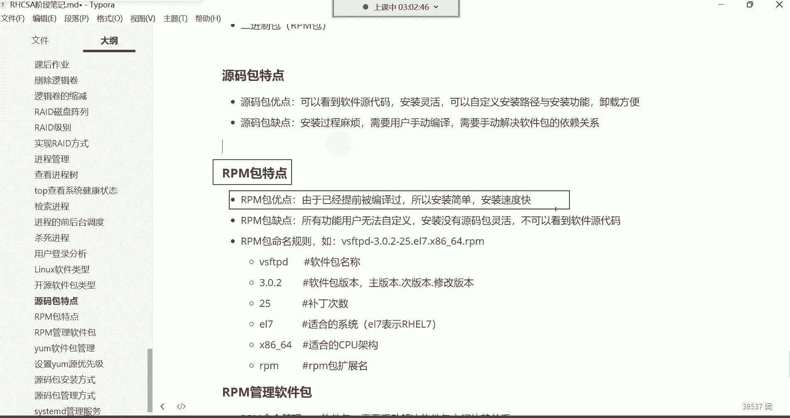

### 源码包

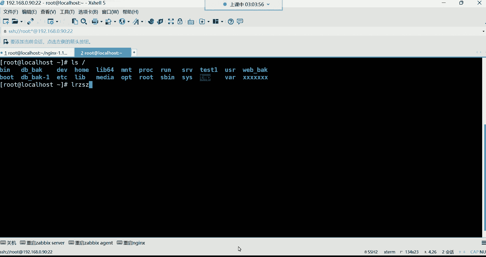


源码包直接提供了软件的源代码文件（通常是`.tar.gz`或`.tar.bz2`等压缩格式）。例如，从Nginx官网下载的 `nginx-1.18.0.tar.gz` 文件。


以下是源码包的主要特点：
*   **优点**：
    1.  开放源代码，允许自定义修改和二次开发。
    2.  可以灵活地**自定义安装路径**（如 `/opt/nginx`）和**选择编译功能**，做到“用什么，装什么”，有利于节约系统资源。
    3.  卸载方便，直接删除安装目录即可。
*   **缺点**：
    1.  安装过程复杂，需要用户手动执行 **`./configure`**, **`make`**, **`make install`** 等步骤进行编译。
    2.  需要自行解决复杂的**软件依赖关系**。

**核心概念示例（编译安装大致流程）**：
```bash
tar -zxvf nginx-1.18.0.tar.gz
cd nginx-1.18.0
./configure --prefix=/opt/nginx # 指定安装路径
make                           # 编译
make install                   # 安装
```

### RPM包（二进制包）

RPM包是Red Hat系列Linux（如CentOS、RHEL）使用的预编译软件包格式，文件后缀为 `.rpm`。我们之前用 `yum install` 命令安装的软件都是RPM包。

以下是RPM包的主要特点：
*   **优点**：
    1.  已经过编译，**安装简单快捷**，通常一条命令即可完成。
    2.  无需处理编译环境问题。
*   **缺点**：
    1.  看不到源代码。
    2.  **无法自定义安装路径和功能**，安装位置和包含的功能由打包者决定。
    3.  安装、卸载时需要RPM命令或YUM工具协助处理依赖关系，但依赖问题有时会很棘手。

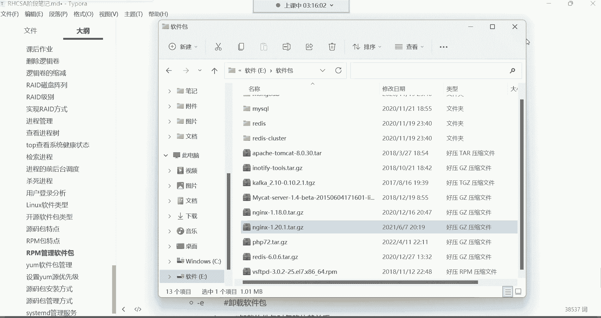

**软件包命名规则示例**：
`vsftpd-3.0.2-25.el7.x86_64.rpm`
*   `vsftpd`: 软件包名称。
*   `3.0.2`: 版本号（主版本.次版本.修订号）。
*   `25`: 发布次数（打过补丁的次数）。
*   `el7`: 适合Red Hat Enterprise Linux 7或其兼容系统（如CentOS 7）。
*   `x86_64`: CPU架构（64位）。
*   `rpm`: 文件扩展名。


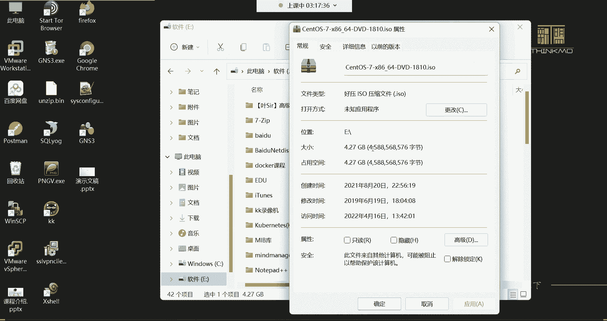


## RPM命令基础管理


RPM命令是直接管理`.rpm`软件包的工具。在使用前，我们需要知道软件包来源。除了网络，系统安装镜像也是一个重要的本地源。镜像文件通常挂载在 `/mnt/` 目录下，其中包含一个 `Packages/` 目录，存放了数千个RPM软件包。


### 安装软件包

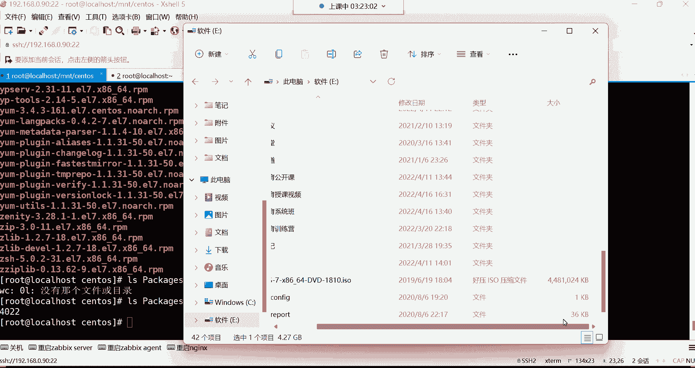

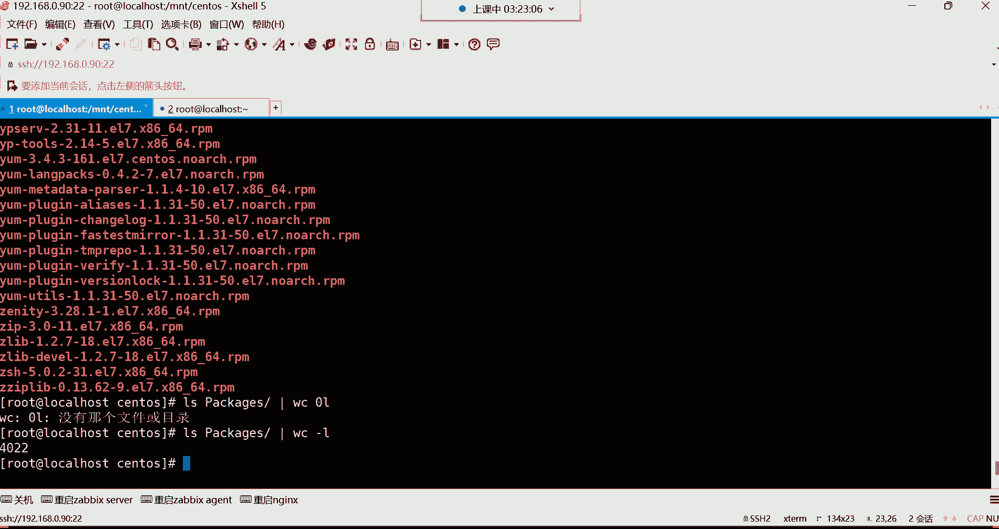


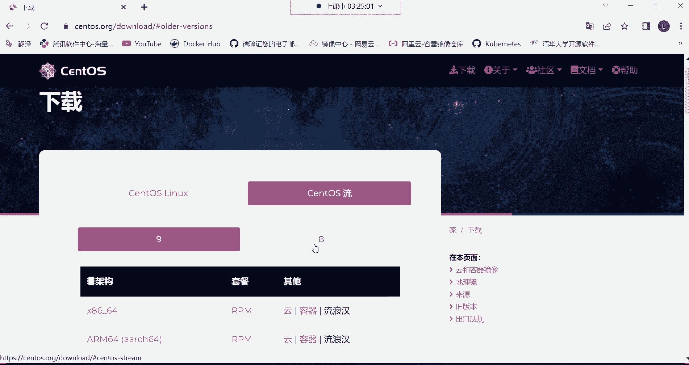

使用 `-ivh` 选项组合进行安装，其中 `-i` 表示安装，`-v` 显示详细信息，`-h` 显示进度条。


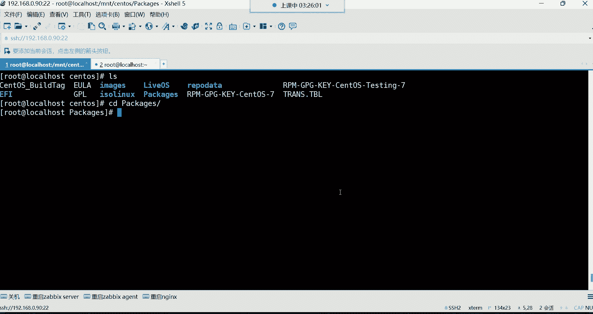


**操作示例**：
```bash
# 进入镜像挂载目录的Packages文件夹
cd /mnt/centos/Packages/
# 安装vsftpd软件包，使用Tab键补全包全名
rpm -ivh vsftpd-3.0.2-25.el7.x86_64.rpm
```


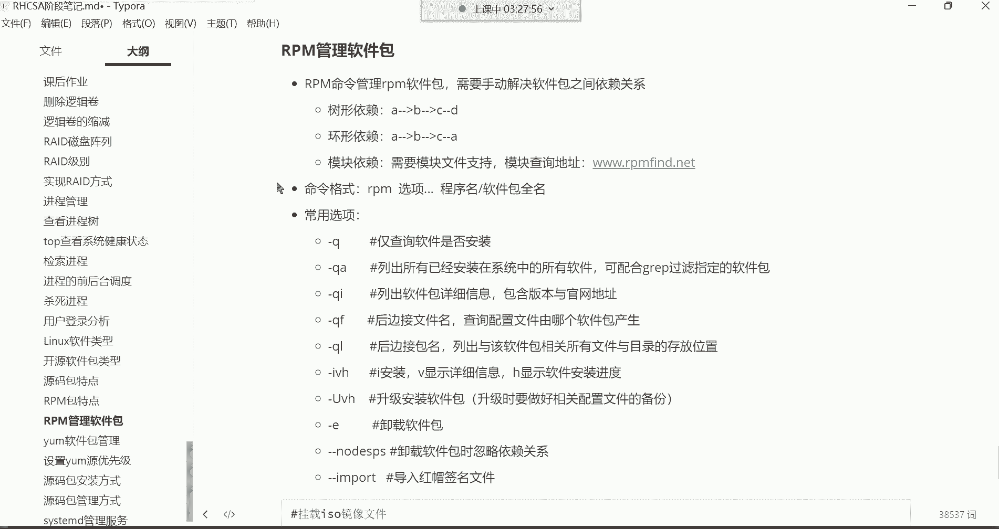

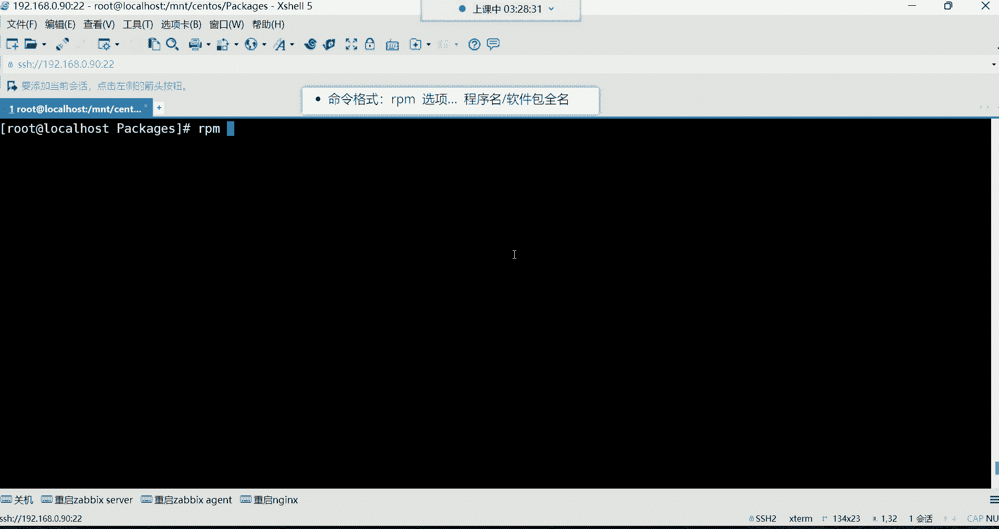


### 查询软件包


RPM的查询功能非常强大，以下是常用查询选项：


以下是常用的RPM查询命令：
*   **`rpm -q 软件名`**：查询指定软件是否安装。
    ```bash
    rpm -q vsftpd
    ```
*   **`rpm -qa`**：查询系统中所有已安装的RPM包。
    ```bash
    rpm -qa | wc -l        # 统计已安装包的数量
    rpm -qa | grep vsftpd  # 在所有包中过滤包含‘vsftpd’的包
    ```
*   **`rpm -qi 软件名`**：查询已安装软件的详细信息（版本、描述、安装时间等）。
    ```bash
    rpm -qi vsftpd
    ```
*   **`rpm -ql 软件名`**：列出软件安装的所有文件及其位置。
    ```bash
    rpm -ql coreutils # 查看coreutils包提供的所有文件（包含很多基础命令）
    ```
*   **`rpm -qf 文件路径`**：查询某个文件是由哪个软件包安装的。
    ```bash
    rpm -qf /etc/passwd
    rpm -qf /bin/ls
    ```

> **注意**：安装时需要提供软件包的**全名**（包含版本信息等），而查询、卸载等操作时只需提供**软件名**即可。

## 软件包依赖关系

使用RPM命令手动安装时，常会遇到依赖性问题。依赖关系主要有以下几种：
1.  **树形依赖**：A包依赖B、C、D包。需要先安装所有依赖包，再安装A包。
2.  **环形依赖**：A依赖B，B依赖C，C又依赖A，形成循环。解决起来较为复杂。
3.  **模块依赖**：依赖一个特定的库文件（如 `.so` 文件），需要先找到并提供该库文件对应的软件包。

手动解决依赖非常繁琐，因此我们通常使用能自动解决依赖的YUM工具（下节课内容）。但了解RPM命令的查询功能对于排查问题至关重要。

## 总结


本节课中我们一起学习了Linux软件包管理的基础知识。我们了解了开源与闭源软件的区别，重点对比了**源码包**（灵活但安装复杂）和**RPM二进制包**（简单但固定）的特点。我们还掌握了使用 **`rpm`** 命令进行软件包安装和多种方式查询的基本操作，并认识了软件包依赖关系的复杂性。这些是后续学习更高级的包管理工具（如YUM）和源码编译安装的坚实基础。