# Linux运维教程：P34：软件版本升级、网络YUM仓库配置与优先级设置 🚀


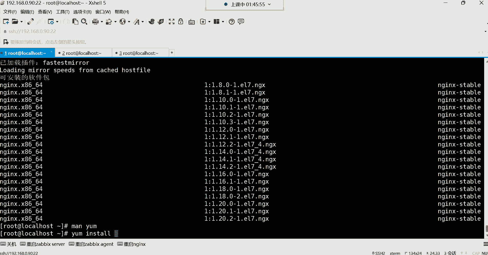


在本节课中，我们将学习如何使用YUM包管理器进行软件版本升级、如何配置网络YUM仓库，以及如何设置仓库的优先级，以确保软件包从最合适的源进行安装。

## 软件版本升级 🔄

上一节我们介绍了YUM的基本安装与查询功能。本节中，我们来看看如何指定版本进行软件安装与升级。

有时，企业环境需要安装特定的稳定版本，而非仓库中的最新版本。YUM提供了指定版本安装的功能。

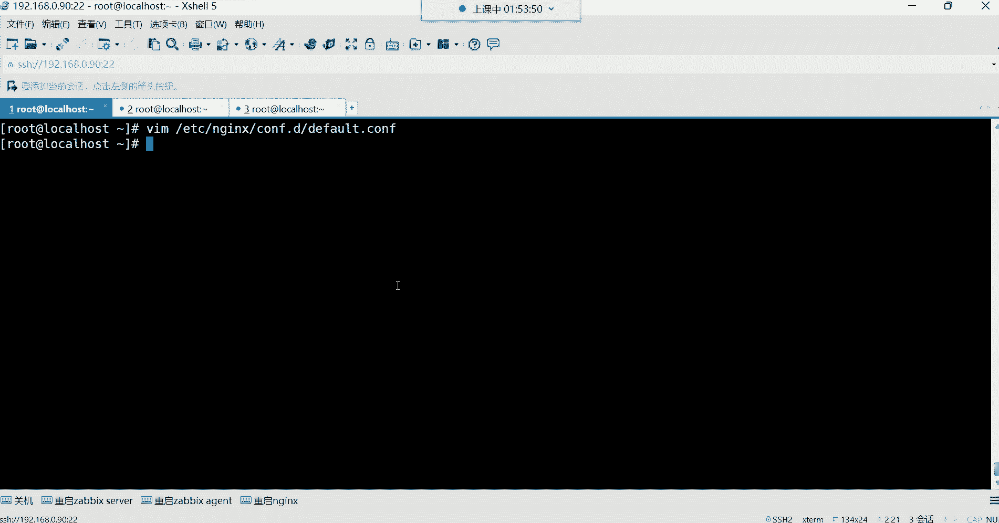


以下是列出仓库中某个软件包所有可用版本的命令：
```bash
yum list <软件包名> --showduplicates
```
例如，要列出 `nginx` 的所有版本，可以执行：
```bash
yum list nginx --showduplicates
```
命令执行后，会显示仓库中所有可用的 `nginx` 版本列表。


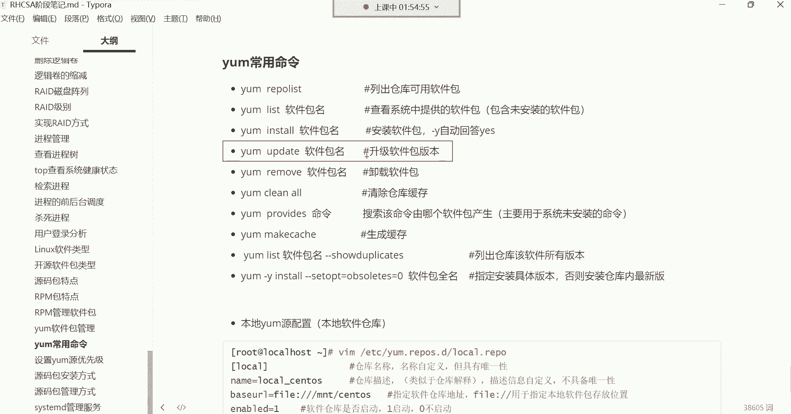

接下来，如果需要安装特定版本（例如 `nginx-1.18.0`），可以使用以下命令格式：
```bash
yum install <软件包名>-<版本号>
```
更简洁的写法是使用通配符：
```bash
yum install nginx-1.18.0*
```
执行此命令后，YUM会开始安装指定的 `1.18.0` 版本。

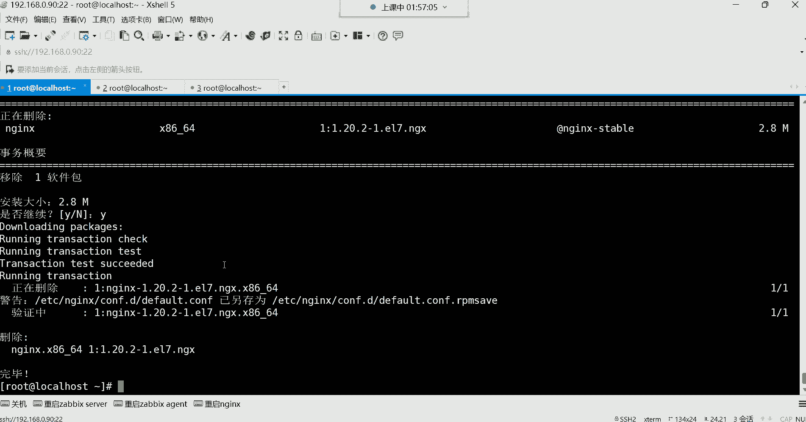


安装完成后，可以修改软件的配置文件。例如，修改Nginx的主配置文件 `/etc/nginx/conf.d/default.conf`，并添加一些自定义配置。


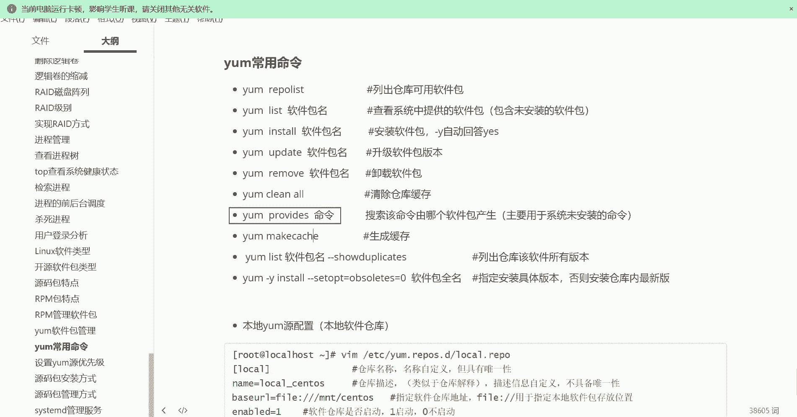

之后，可以进行版本升级。使用 `yum update` 命令可以升级到更高版本：
```bash
yum update nginx-1.20.1*
```
现代软件包管理器（如YUM）在升级时，通常会保留用户对配置文件的自定义修改，而不会直接覆盖。这意味着升级后，之前添加的配置项很可能依然存在。但为了安全起见，建议在升级前对重要配置文件进行备份。

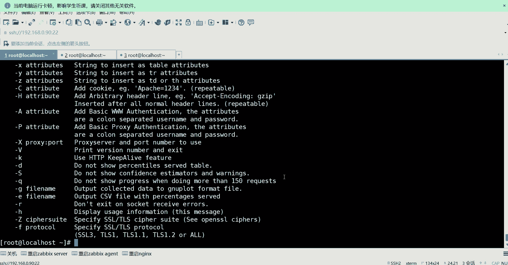

## 软件包卸载与查询 🗑️


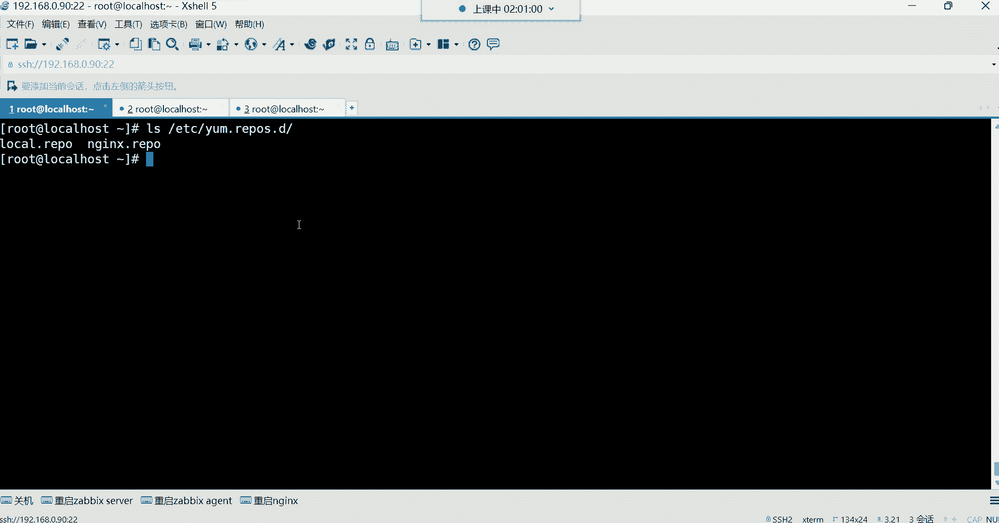


软件包的卸载操作同样简单。使用 `yum remove` 命令即可卸载指定软件包。
```bash
yum remove nginx
```
值得注意的是，现代YUM在卸载时通常只移除主软件包，而不会自动删除其依赖包，这比早期版本更加人性化。


当系统缺少某个命令时，可以使用 `yum provides` 来查询该命令由哪个软件包提供。
```bash
yum provides ab
```
例如，查询 `ab` 命令，会显示它由 `httpd-tools` 包提供。随后即可安装该包以使用此命令。


## 配置网络YUM仓库 🌐


本地仓库的软件包可能有限。接下来，我们学习如何配置网络YUM仓库以获取更丰富的软件源。

常用的国内网络仓库有阿里云、清华大学等镜像站。它们的速度远快于CentOS官方国外源。

配置网络仓库非常简单，通常只需下载仓库配置文件即可。以下是使用阿里云仓库的步骤：

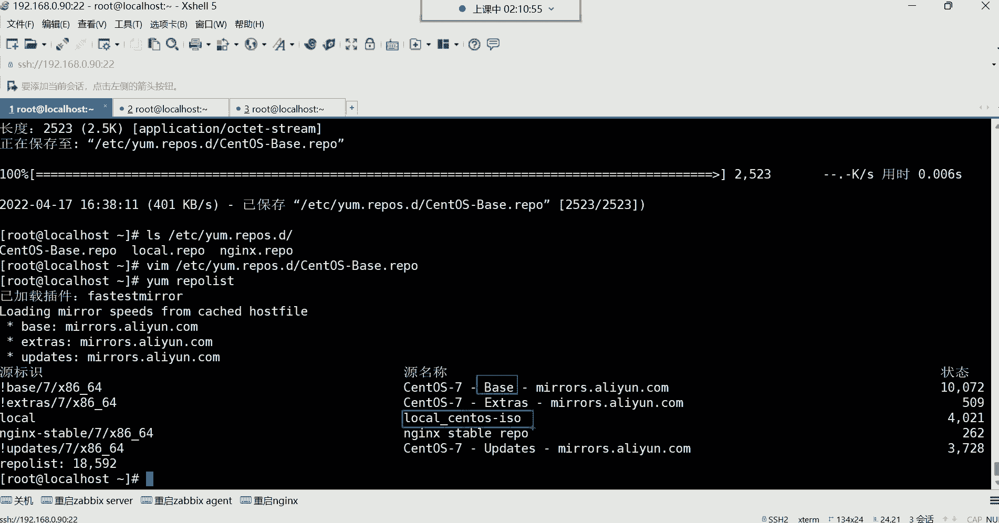

首先，安装下载工具 `wget`（如果尚未安装）：
```bash
yum -y install wget
```
然后，使用 `wget` 下载阿里云的CentOS 7仓库配置文件到系统YUM仓库目录：
```bash
wget -O /etc/yum.repos.d/CentOS-Base.repo https://mirrors.aliyun.com/repo/Centos-7.repo
```
下载完成后，无需手动修改该文件。可以使用 `yum repolist` 命令查看新增的网络仓库及其包含的软件包数量。


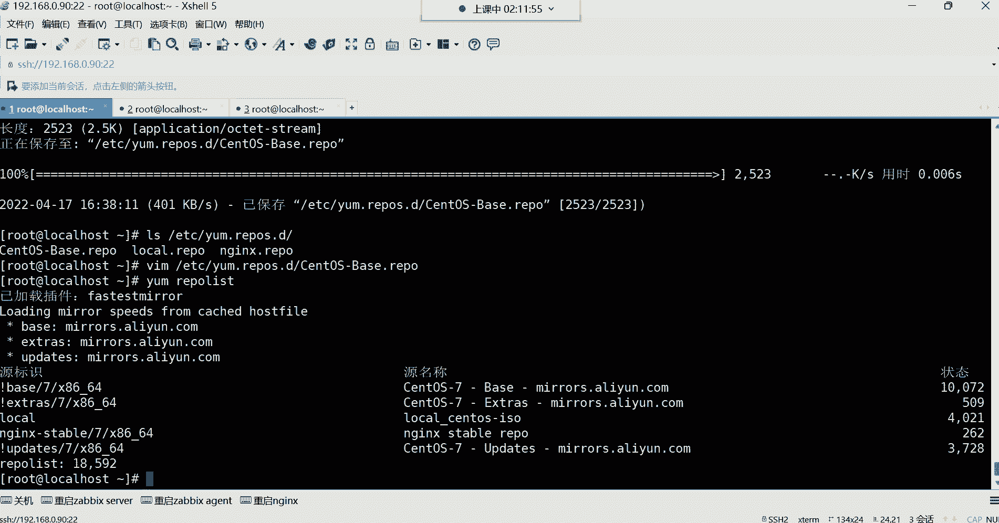


网络仓库的配置文件中通常已经设置了优先级（priority），这会导致YUM默认优先从网络仓库搜索和下载软件包。

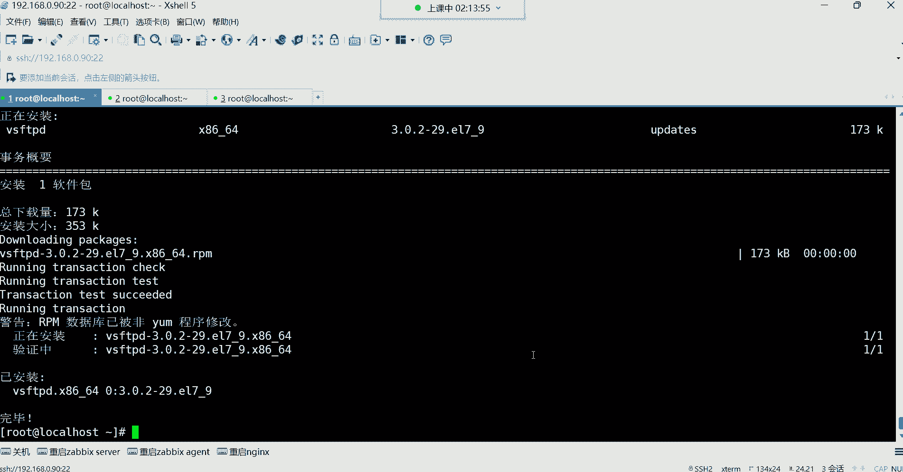

## 设置YUM仓库优先级 ⚖️


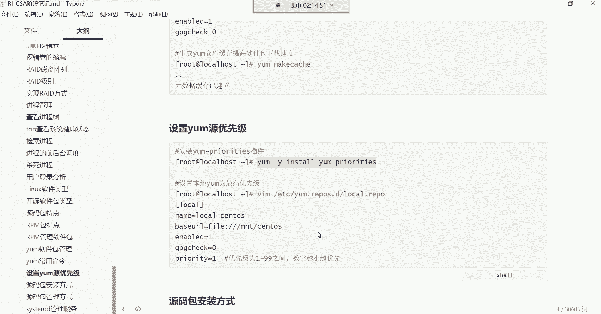


当同时存在本地和网络仓库时，我们可能希望YUM优先从本地仓库查找软件包，以提升下载速度并节省流量。这需要通过设置优先级来实现。

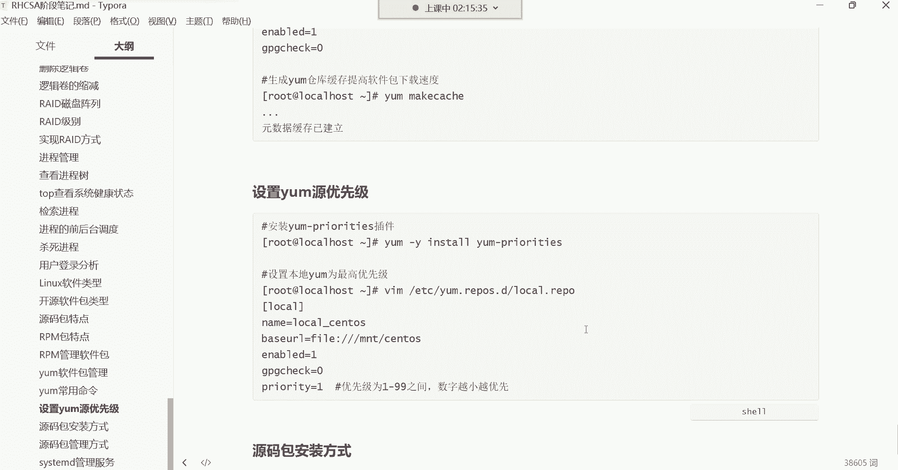


以下是设置本地仓库优先级的步骤：

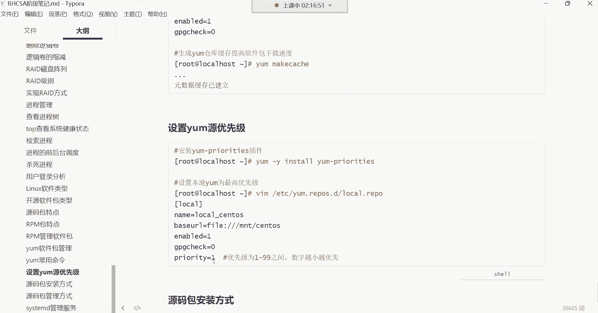


首先，需要安装优先级插件：
```bash
yum -y install yum-plugin-priorities
```
然后，编辑本地仓库的配置文件（例如 `/etc/yum.repos.d/local.repo`），在 `[local]` 段落中添加优先级设置：
```
priority=1
```
优先级数值范围为1-99，**数字越小，优先级越高**。因此，设置为1意味着该仓库拥有最高优先级。


保存退出后，当使用 `yum install` 安装软件时，YUM会优先从本地仓库查找。如果本地仓库不存在该软件包，才会转向网络仓库。

## 清除YUM缓存 🧹

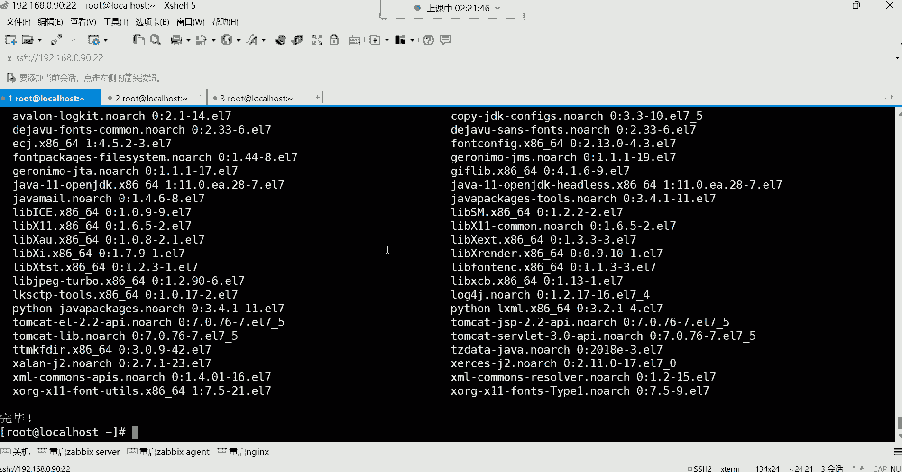

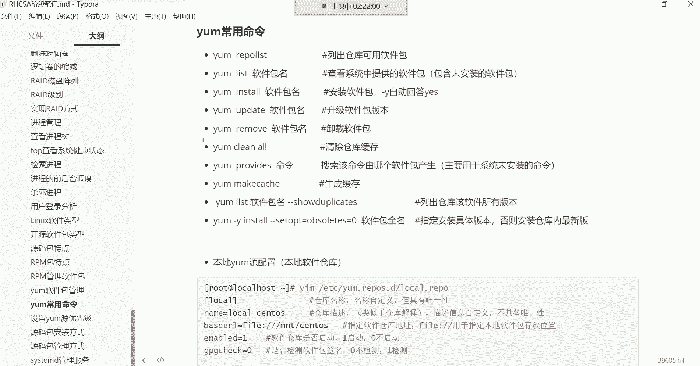

YUM会缓存仓库的元数据（如软件包列表），以加速后续操作。但有时缓存信息可能过时或出错，导致安装失败。

例如，如果卸载了本地镜像挂载点内的软件包，但YUM缓存仍记录着该仓库有数据，此时安装软件就会失败。错误信息可能难以直接理解。

这时，需要清除YUM缓存：
```bash
yum clean all
```
清除缓存后，再使用 `yum repolist` 命令，它会重新读取仓库信息，显示真实的软件包状态（例如本地仓库变为0个包）。之后再进行安装操作就会恢复正常。

生成缓存的命令是：
```bash
yum makecache
```
它会在使用网络仓库时，将软件包元数据缓存到本地，加速后续的搜索和安装过程。

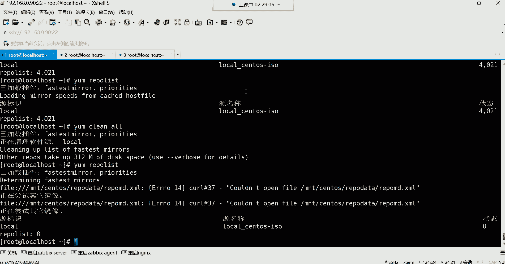


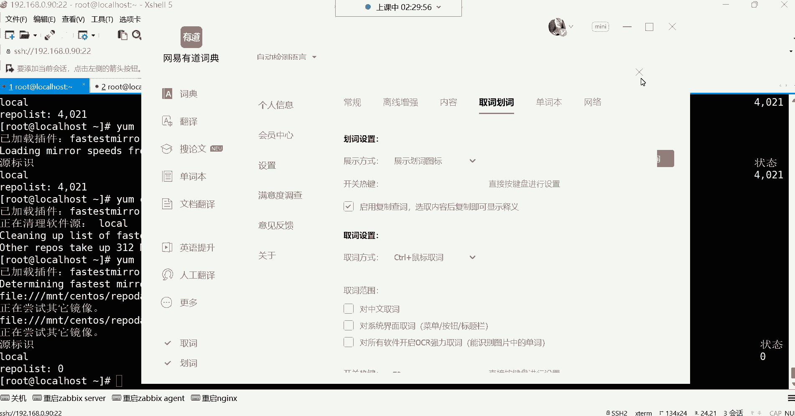

---


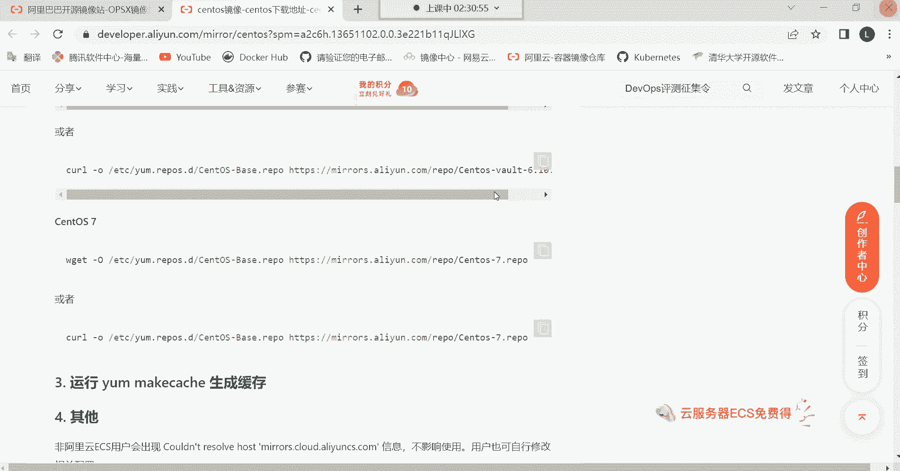


本节课中我们一起学习了：
1.  使用 `yum install <包名>-<版本号>` 来安装特定版本的软件，并使用 `yum update` 进行升级。
2.  通过 `yum remove` 卸载软件，以及使用 `yum provides` 查询命令所属的软件包。
3.  使用 `wget` 下载网络仓库（如阿里云镜像）的配置文件，快速配置网络YUM源。
4.  通过安装 `yum-plugin-priorities` 插件并编辑仓库文件的 `priority` 值，来设置仓库的搜索优先级，使本地仓库优先。
5.  使用 `yum clean all` 清除可能引起问题的旧缓存，并使用 `yum makecache` 建立新缓存以提升效率。


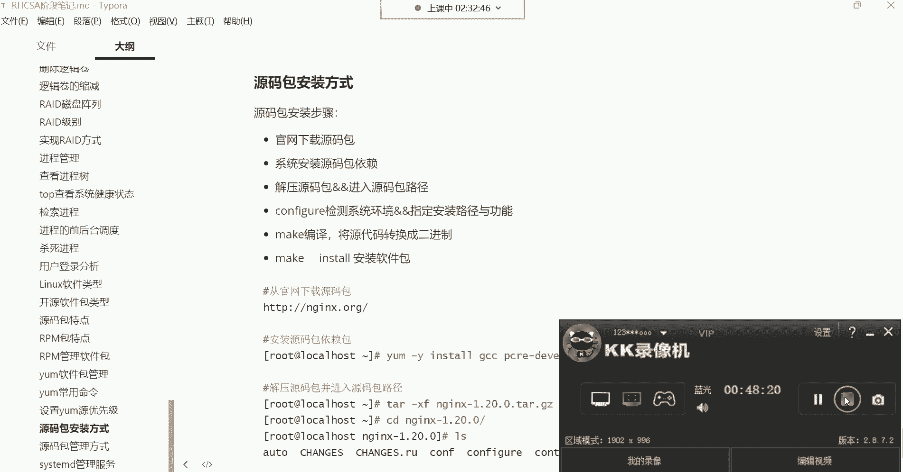

掌握这些技能，将使你在管理Linux系统软件时更加得心应手。