# Linux运维：P37：编写与执行Shell脚本


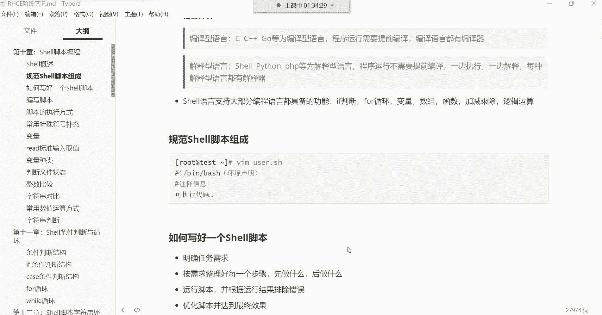

在本节课中，我们将学习如何编写和执行Shell脚本。这是自动化运维工作的基础，通过脚本，我们可以将一系列命令组合起来，按顺序自动执行，从而简化重复性任务。

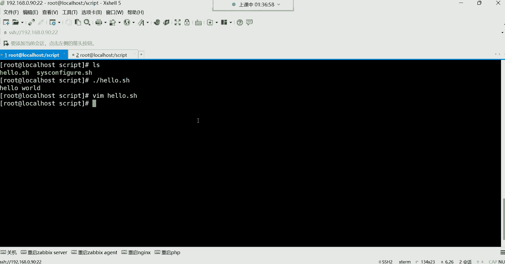

## 脚本的“Hello World”仪式

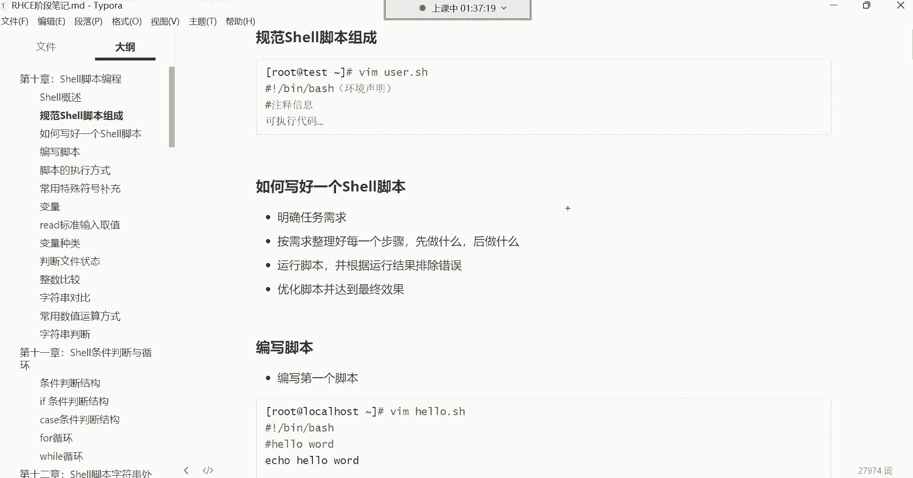

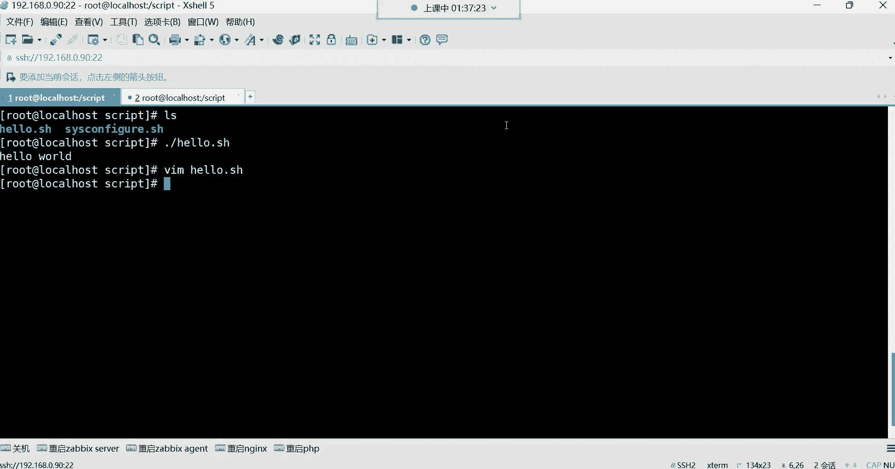


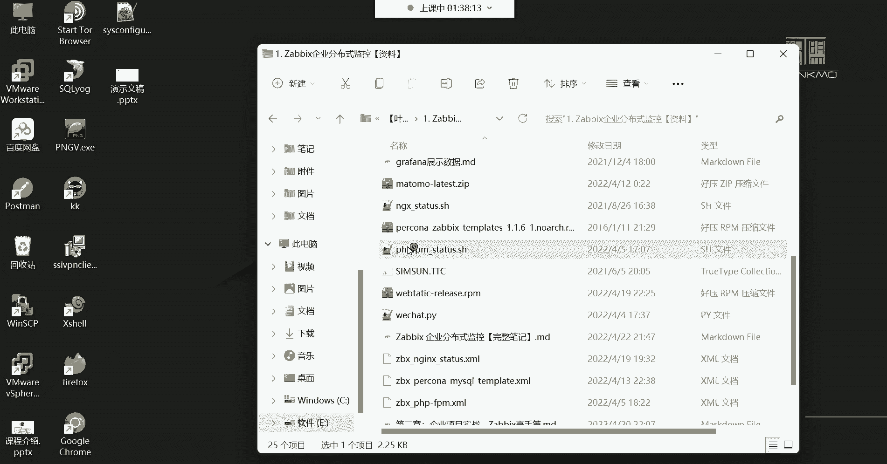

上一节我们介绍了脚本的基本概念，本节中我们来看看如何编写第一个脚本。在编程世界中，第一个程序通常是输出“Hello World”，这是一种传统。

以下是用Shell脚本输出“Hello World”的步骤：
1.  创建一个新文件，例如 `hello.sh`。
2.  在文件第一行指定脚本解释器：`#!/bin/bash`。
3.  使用 `echo` 命令输出文本：`echo “Hello World”`。
4.  保存文件后，为其添加执行权限：`chmod +x hello.sh`。
5.  最后，执行脚本：`./hello.sh`。

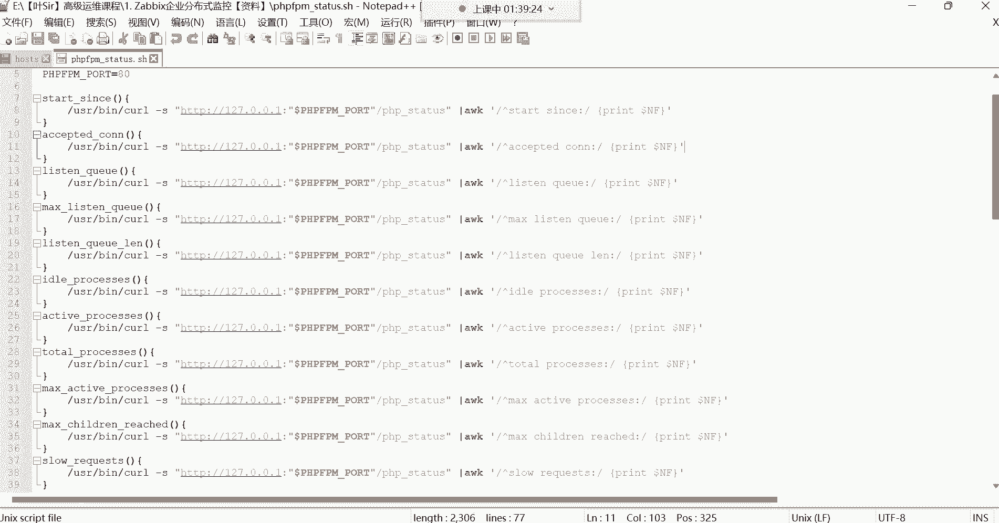

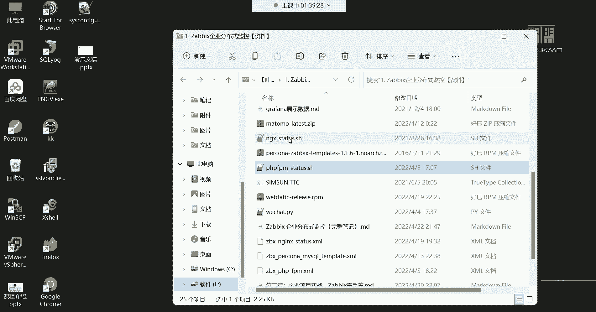

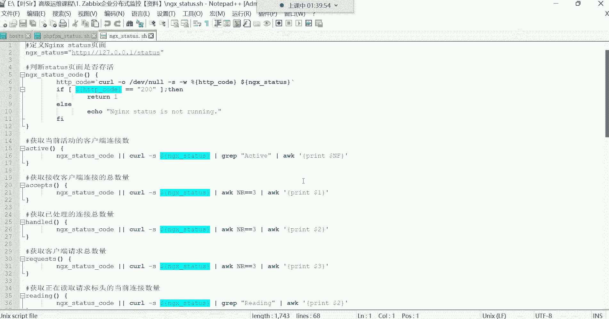

这个简单的流程展示了脚本的本质：**将命令行中手动输入的命令，预先写入一个文件，然后批量自动执行**。

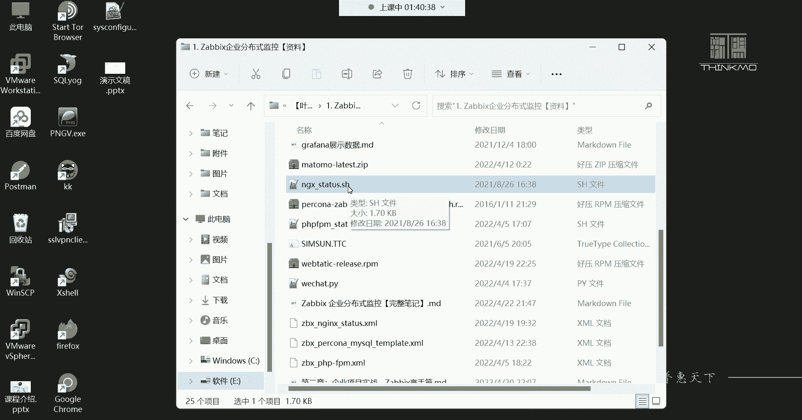

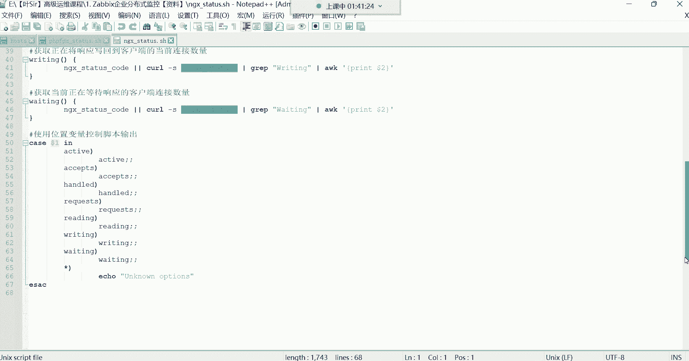

## 编写优质脚本的思维逻辑


仅仅会写简单命令堆积的脚本是不够的。要编写复杂、实用的脚本，需要清晰的逻辑规划。这类似于完成一个项目或达成一个目标。

编写一个脚本的标准流程通常包括以下几步：
1.  **明确需求**：确定脚本最终要完成什么任务。
2.  **分解步骤**：将大任务拆解为一个个可执行的小步骤，并理清顺序。
3.  **编写代码**：将每个步骤转化为具体的Shell命令写入脚本。
4.  **测试与调试**：运行脚本，检查是否有错误，并逐一修正。
5.  **优化与完善**：确保脚本运行稳定、高效，并可能添加容错处理。

遵循这个逻辑，可以帮助你写出结构清晰、功能可靠的脚本。

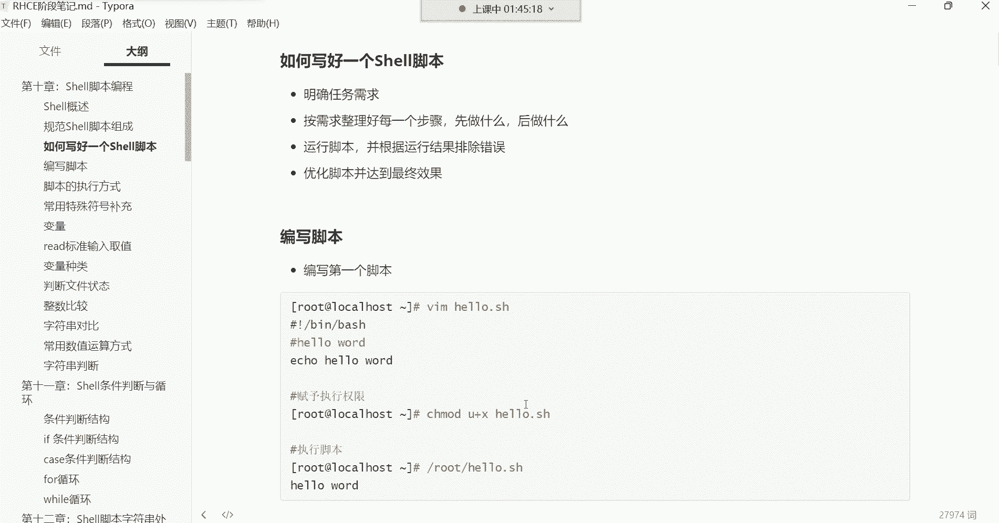

## 脚本编写的核心注意事项

在将命令行操作转化为脚本时，有一个至关重要的原则：**避免使用交互式命令**。

交互式命令在执行时需要用户手动输入参数（如 `passwd` 设置密码）或进行操作（如 `vim` 编辑文件）。这类命令会**导致脚本执行到该处时暂停，等待用户输入，从而使自动化中断**。

以下是如何处理交互式命令的例子：
*   **错误示例**：在脚本中直接使用 `passwd username` 命令，脚本会卡住等待输入密码。
*   **正确方法**：使用非交互式方式设置密码，例如：
    ```bash
    echo “123456” | passwd --stdin username
    ```
    这条命令通过管道将密码“123456”直接传递给 `passwd` 命令，无需手动输入。

记住，脚本的目标是自动化，应确保其中的所有命令都能在无需人工干预的情况下独立完成。

## 实践：编写一个系统信息查看脚本

现在，让我们综合所学，编写一个实用的脚本。该脚本用于查看基本的系统信息，并在每个操作前给出友好提示。

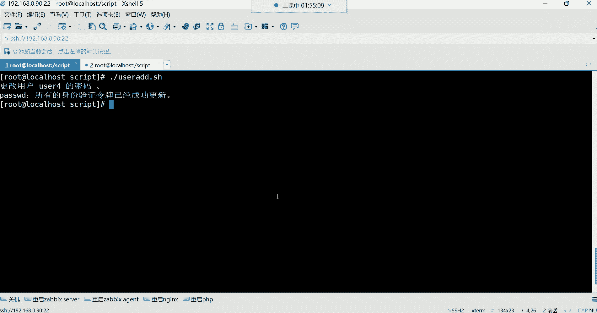

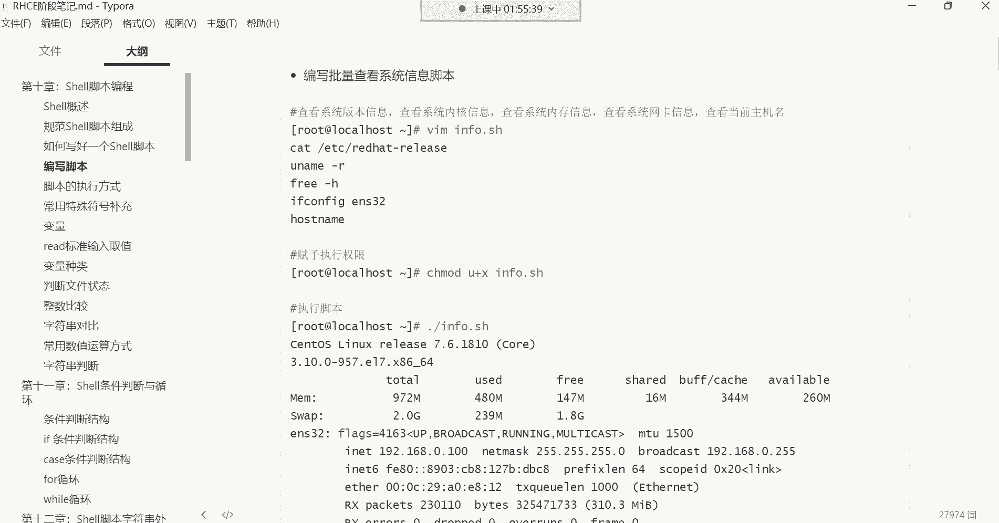

以下是脚本内容示例 (`system_info.sh`)：
```bash
#!/bin/bash
# 这是一个查看系统信息的脚本

echo “第一步：正在查看系统版本信息...”
sleep 2
cat /etc/redhat-release

echo “第二步：正在查看内核版本...”
sleep 2
uname -r

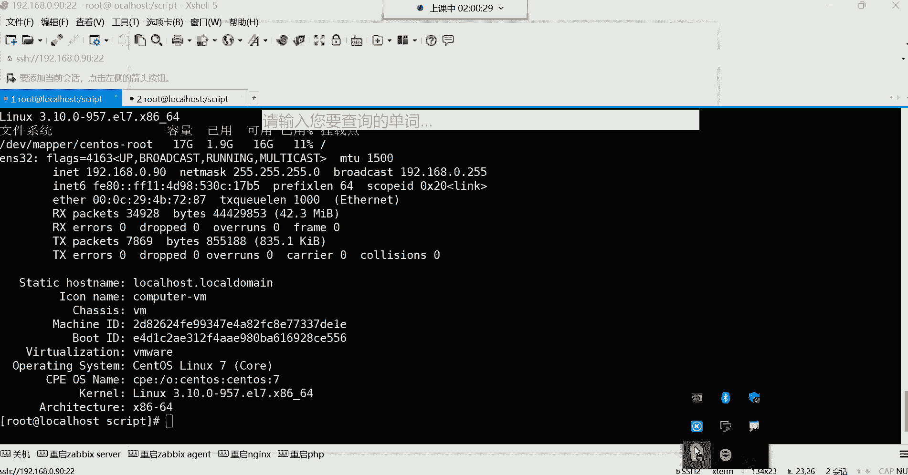

echo “第三步：正在查看根分区磁盘使用情况...”
sleep 2
df -h /

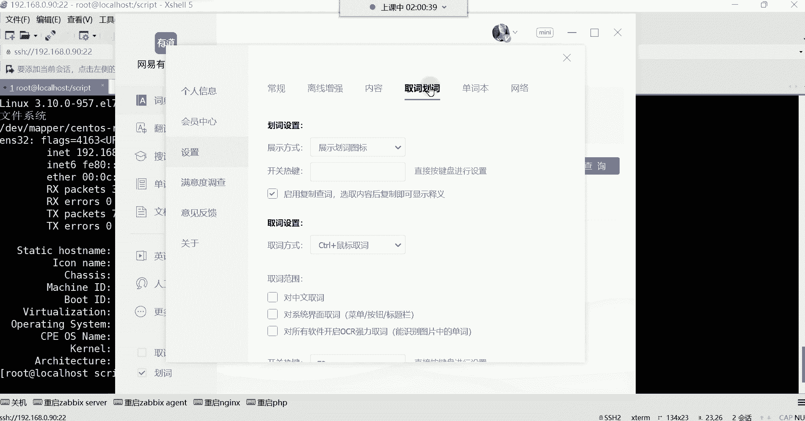

echo “第四步：正在查看网络配置信息...”
sleep 2
ifconfig ens33

echo “第五步：正在查看主机名信息...”
sleep 2
hostnamectl
```

**脚本解析**：
*   `#!/bin/bash`：指定使用Bash解释器。
*   `# 注释`：添加注释说明脚本用途，这是一个好习惯。
*   `echo “提示信息”`：在每一步执行前，输出提示，增强可读性。
*   `sleep 2`：让脚本暂停2秒，使输出信息不至于滚动太快，提升体验。
*   后续各行：需要执行的实际查看命令。

保存文件后，赋予执行权限并运行：
```bash
chmod +x system_info.sh
./system_info.sh
```
你将看到脚本会分步、有停顿地执行各个命令，并输出结果。

## 脚本的存放与共享

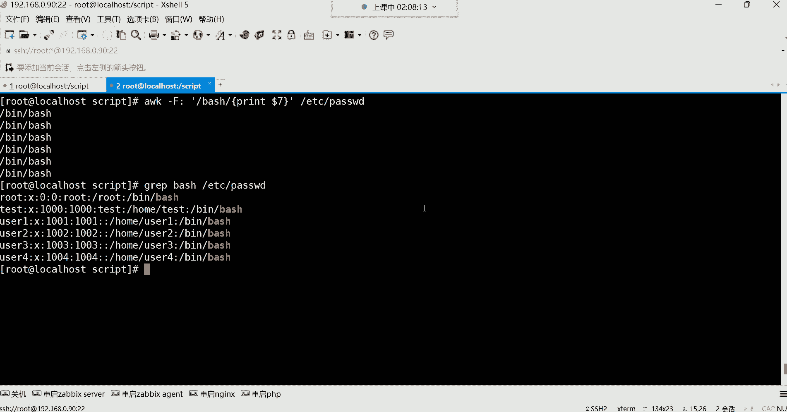

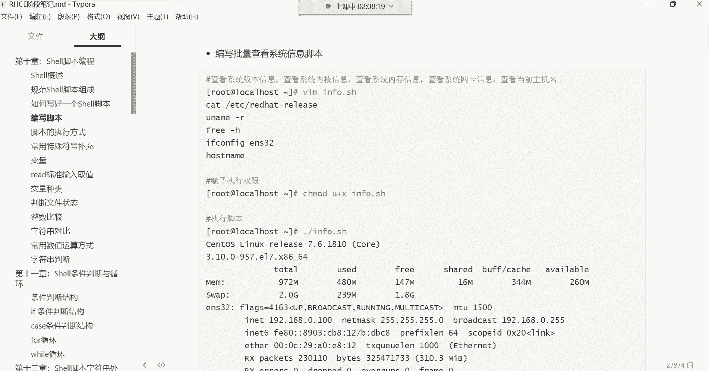

脚本写好后，存放位置也有讲究：
*   **个人使用**：可以放在自己的家目录下，方便管理。
*   **团队共享**：如果需要让其他用户也能使用，则应将其放在一个公共目录（如 `/opt/scripts/`）下，并确保其他用户对该目录和脚本有相应的读取和执行权限（例如 `chmod o+rx script.sh`）。

---

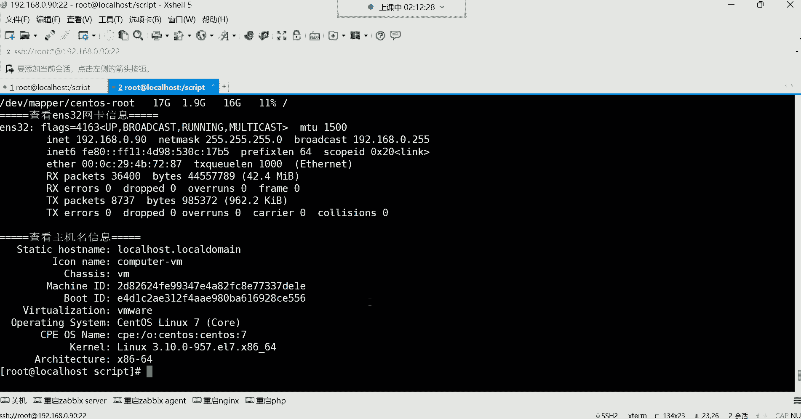

本节课中我们一起学习了Shell脚本的编写与执行。我们从传统的“Hello World”开始，理解了脚本是命令的集合。接着，我们探讨了编写脚本应有的逻辑思维：从明确需求到测试优化。我们重点强调了脚本中**必须避免使用交互式命令**，这是实现自动化的关键。最后，我们动手实践，编写了一个分步查看系统信息的脚本，并了解了脚本存放的注意事项。掌握这些基础知识，是迈向自动化运维的第一步。